---
# required metadata

title: Get started with Electronic invoicing for Italy
description: This topic provides information that will help you get started with Electronic invoicing for Italy.
author: gionoder
ms.date: 09/22/2020
ms.topic: article
ms.prod: 
ms.technology: 

# optional metadata

ms.search.form: 
# ROBOTS: 
audience: Application User
# ms.devlang: 
ms.reviewer: kfend
# ms.tgt_pltfrm: 
ms.custom: ["97423", "intro-internal"]
ms.assetid: 
ms.search.region: Global
# ms.search.industry: 
ms.author: janeaug
ms.search.validFrom: 2020-07-08
ms.dyn365.ops.version: AX 10.0.12

---

# Get started with Electronic invoicing for Italy

[!include [banner](../includes/banner.md)]

> [!IMPORTANT]
> Electronic invoicing for Italy might not currently support all the functions that are available for electronic invoices in Microsoft Dynamics 365 Finance and Dynamics 365 Supply Chain Management. 

This topic provides information that will help you get started with Electronic invoicing for Italy. It guides you through the configuration steps that are country-dependent in Regulatory Configuration Services (RCS) and Finance. It also guides you through the process for submitting electronic invoices that are generated in the Italy-specific **FatturaPA** format through the service, and it explains how to review the results of processing.

## Prerequisites

Before you complete the steps in this topic, you must complete the steps in [Get started with Electronic invoicing](e-invoicing-get-started.md).

## RCS setup

During the RCS setup, you will complete these tasks:

1. Import the e-Invoicing feature for the export of customer electronic invoices in the **FatturaPA** format.
2. Review the format configurations that are required to generate, submit, and receive responses about electronic invoices.
3. Configure the events that support the electronic invoice submission scenarios.
4. Publish the e-Invoicing feature.

> [!NOTE]
> "The e-Invoicing feature" is the generic name for the resource that is configured and published to consume the Electronic invoicing server. In this case, the export of customer electronic invoices is the e-Invoicing feature that you will set up.

## Import the e-Invoicing feature

1. Sign in to your RCS account.
2. In the **Globalization features** workspace, in the **Features** section, select the **e-Invoicing** tile.
3. On the **e-Invoicing Features** page, select **Import** to import the e-Invoicing feature from the Global repository.

    > [!NOTE]
    > If you don't see the list of available features, select **Synchronize**. 

4. Select the **e-Invoices Export (IT)** feature, and then select **Import**.

When you import the **e-Invoices Export (IT)** feature from the Global repository, all the settings that are described in the next sections are also imported.

## Create a new version of the e-Invoices Export (IT) feature

1. On the **e-Invoicing Features** page, on the **Versions** tab, select **New**. 

    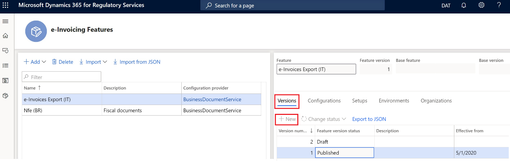

    Next, you will configure the Electronic reporting (ER) formats that are associated with the e-Invoicing feature.

2. On the **Configurations** tab, select **Add** to manage the configuration versions.

    

    In this step, you're adding and configuring the ER formats of different files that are used to export Italian e-invoices. For Italian FatturaPA e-invoices, use either the following standard configurations or the actual customized configurations that you use for e-invoicing:

    - Sales invoice (IT)
    - Project invoice (IT)

    When you create an e-Invoicing feature that is derived from another e-Invoicing feature, all ER formats are inherited from the original feature.

3. Select a specific ER format file configuration.
4. Select **Edit** or **View** to open the **Format designer** page.

    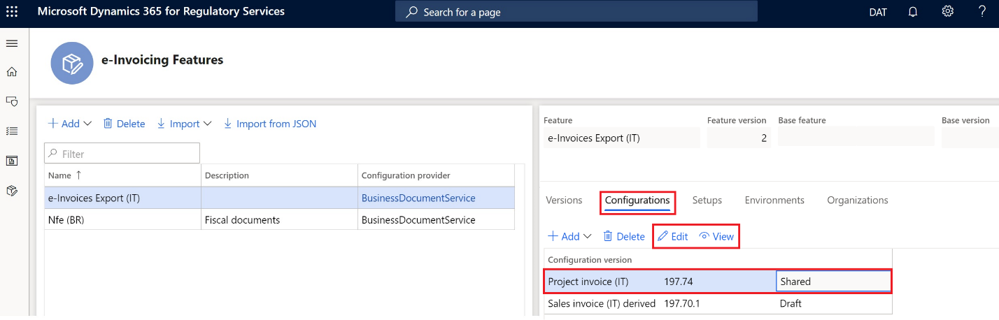

5. Use the **Format designer** page to edit and view the ER format file configurations.

    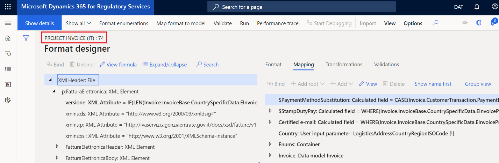

## Manage the e-Invoicing feature setups

- On the **e-Invoicing Features** page, on the **Setups** tab, select **Add**, **Delete**, or **Edit** to manage the e-Invoicing feature setups.

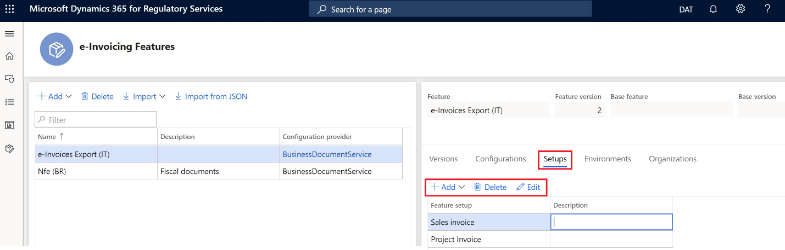

In this step, you configure the events that are applicable to electronic invoices, including generation of the XML output files in **FatturaPA** format and digital signing (if required).

### Configure the Sales invoice feature setup

1. On the **e-Invoicing Features** page, on the **Setups** tab, in the **Feature setup** column, select **Sales invoice**.
2. Select **Edit**.
3. On the **Feature version setup** page, select the **Actions** tab to manage the list of actions. Actions define a list of operations that must be run in sequential order to accomplish full execution of the event.

    

    | Action ID | Action name        | Action description                                     |
    |-----------|--------------------|--------------------------------------------------------|
    | 1         | Transform document | Create the e-invoice XML file in **FatturaPA** format. |
    | 2         | Sign document      | Apply a digital signature to the XML file.             |

4. Select the **Applicability rules** tab to view and maintain the applicability rules. Applicability rules define the context where the action will be run.

    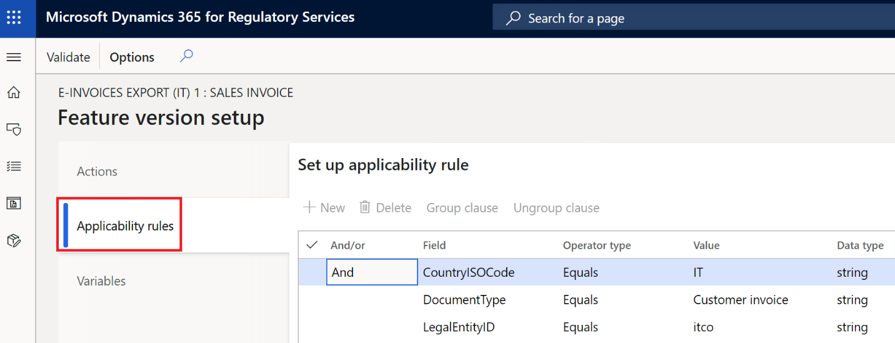

5. Select the **Variables** tab to view and maintain the variables.

    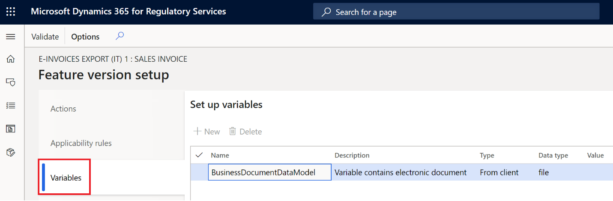

6. Define the public variables that are required to run the actions.

### Configure the Project invoice feature setup 

The steps and settings that are required to configure the **Project invoice** feature setup are very similar to the steps and settings for the **Sales invoice** feature setup. When you work with project invoices, see the procedures for sales invoices.

## Assign the e-Invoicing feature to the environment

1. On the **e-Invoicing Features** page, on the **Environments** tab, select **Enable**.
2. In the **Environment** field, select the environment.
3. In the **Effective from** field, select the date when the environment should become effective.
4. Select **Enable**. 

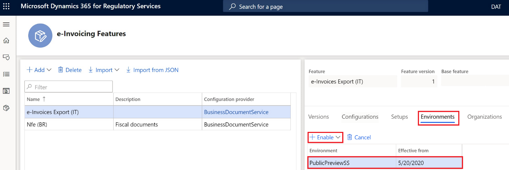

## Publish the e-invoicing feature

You can publish the e-Invoicing feature by changing the version status to **Completed** or **Published**.

### Change the version status to Completed

1. On the **e-Invoicing Features** page, on the **Versions** tab, select the version of the e-Invoicing feature that has a status of **Draft**.
2. Select **Change status \> Complete**. 

### Change the version status to Published 

1. On the **e-Invoicing Features** page, on the **Versions** tab, select the version of the e-Invoicing feature that has a status of **Completed**.
2. Select **Change status \> Publish**.

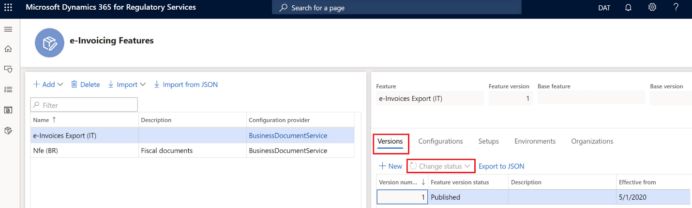

## Set up Electronic invoicing integration in Finance

During the setup of Finance, you will complete these tasks:

1. Import the ER data model, the ER data model mapping, and the context configurations for FatturaPA e-invoices.
2. Configure the certificate that is required to digitally sign Italian e-invoices.

### Import the ER data model, data model mapping, and formats

1. In the **Electronic reporting** workspace, verify that the **Business Document Service** configuration provider is set to **Active**.
2. Select **Repositories**.
3. Select **Global resource \> Open**.
4. Import **Invoice model**, **Invoice model mapping**, and **Customer invoice context model**.

#### Turn on the feature for exporting customer electronic invoices for Italy

1. Go to **Organization administration \> Setup \> Electronic document parameters**.
2. On the **Features** tab, select the **Enabled** check box in the row for feature reference **IT00036**.

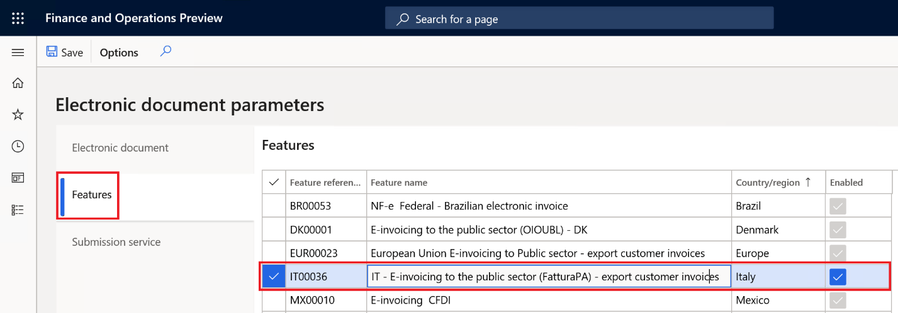

#### Configure electronic documents

1. Go to **Organization administration \> Setup \> Electronic document parameters**.
2. On the **Electronic document** tab, select **Add**, and enter the tables that are required to generate Italian e-invoices:

    - **Table name:** Customer invoice journal
    - **Table name:** Project invoice

3. For each table, define a related document context:

    - For **Customer invoice journal**, select **Customer invoice context**.
    - For **Project invoice**, select **Project invoice context**.

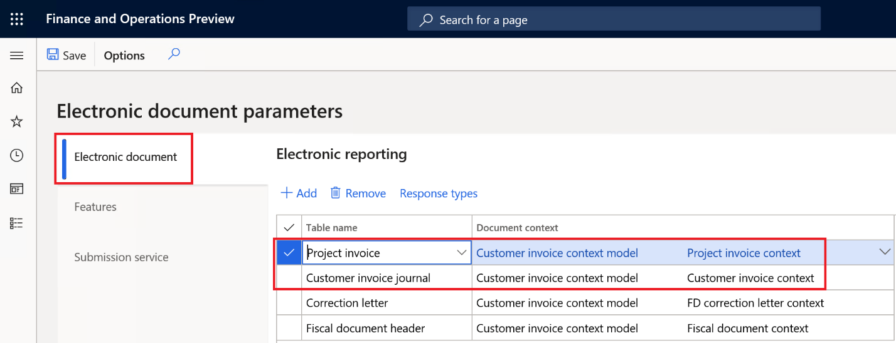

## Electronic invoice processing

During processing in Finance, you will complete these tasks:

1. Generate Italian e-invoices through Electronic invoicing
2. View the execution logs and review the results of processing

### Generate electronic invoices

After you turn on the **Configurable Electronic invoicing integration** feature and activate the **IT00036** feature, the old Finance process for generating Italian e-invoices can no longer be used. It's replaced by a new process that is named **Submit electronic documents**.

You can submit the documents manually, based on your demand for e-invoice documents.

> [!NOTE]
> Before you continue, verify that the setup that is required for Italian e-invoices was completed. For more information, see [Customer electronic invoices](./emea-ita-e-invoices.md). Be aware that some of the setup steps that are described in that topic might be unavailable because of Electronic invoicing activation.

1. Go to **Organization administration \> Periodic \> Electronic documents \> Submit electronic documents**.
2. For the first submission of any document, set the **Resubmit documents** option to **No**. If you must resubmit a document through the service, set this option to **Yes**.
3. On the **Records to include** FastTab, select **Filter** to open the **Inquiry** dialog box, where you can build a query to select documents for submission.

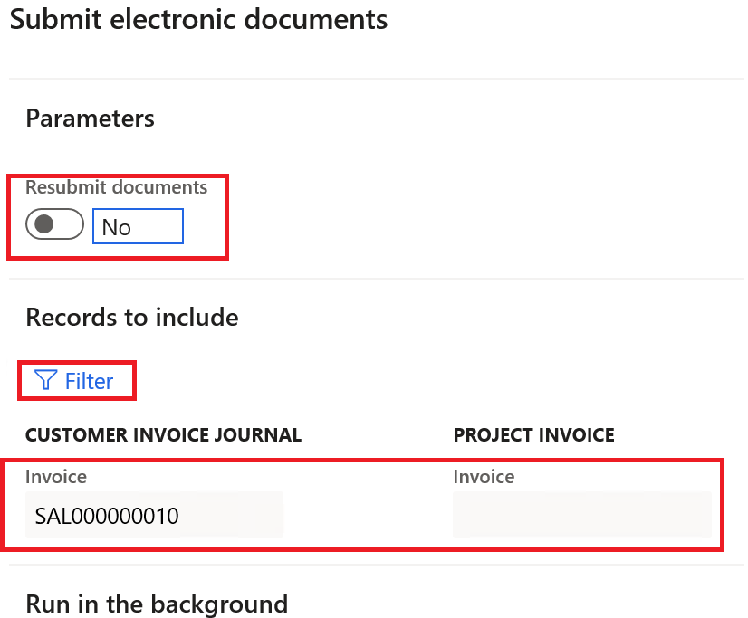

#### Filter query

1. In the **Inquiry** dialog box, configure the filtering conditions for both sales invoices and project invoices, or leave the conditions blank to include all unsubmitted invoices.

    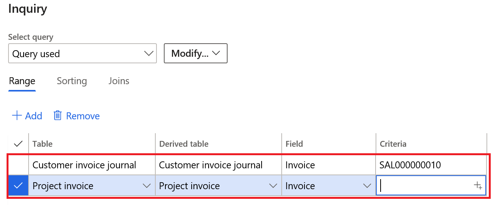

2. Select **OK** to close the **Inquiry** dialog box.
3. Select **OK** submit the selected documents.

> ![NOTE]
> During your first attempt to submit a document through the service, you will be prompted to confirm the connection with Electronic invoicing. Select **Click here to connect to Electronic Document Submission Service**.

#### View submission logs

You can view the submission logs for all submitted documents.

1. Go to **Organization administration \> Periodic \> Electronic documents \> Electronic document submission log**.
2. In the **Document type** field, select **Customer invoice journal** or **Project invoice** to filter for the required electronic documents.

    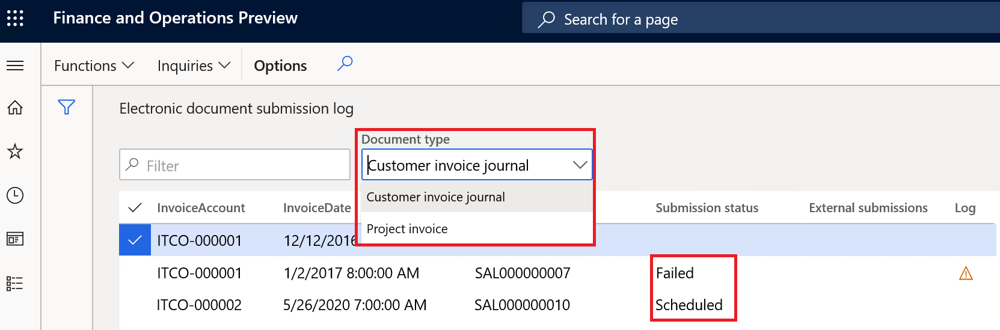

    The value that is shown in the **Submission status** column represents the status of the submission process. It indicates whether the process ran as configured and whether additional action is required.

3. On the Action Pane, select **Inquiries \> Submission details** to view the details of the submission execution logs.

    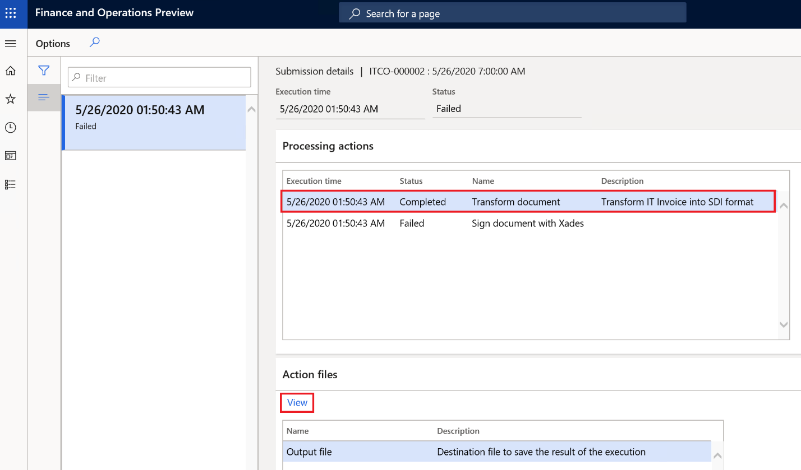

4. On the **Processing actions** FastTab, you can view the execution log for the actions that are configured in the feature version that was set up in RCS. The **Status** column shows whether the action was successfully run.
5. On the **Action files** FastTab, you can view the intermediate files that were generated during execution of the actions. You can select **View** to download the output XML file in **FatturaPA** format and view its content.

## Related topics

- [Electronic invoicing overview](e-invoicing-service-overview.md)
- [Get started with Electronic invoicing](e-invoicing-get-started.md)
- [Set up Electronic invoicing](e-invoicing-setup.md)

[!INCLUDE[footer-include](../../includes/footer-banner.md)]
