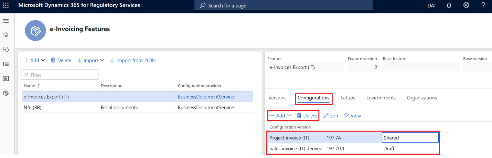
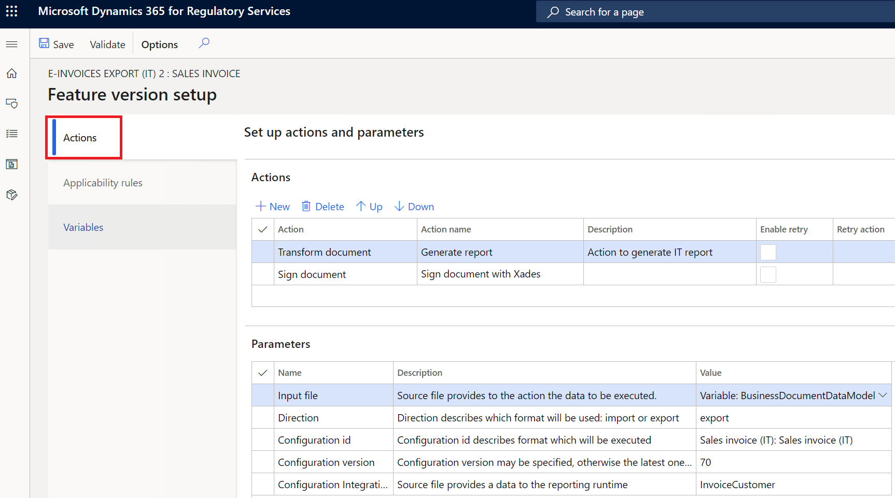

---
# required metadata

title: Get started with e-Invoicing services for Italy
description: This topic provides information about getting started with the e-Invoicing service for Italy in Dynamics 365 Finance and Dynamics 365 Supply chain management.
author: gionoder
manager: AnnBe
ms.date: 06/25/2020
ms.topic: article
ms.prod: 
ms.service: dynamics-ax-platform
ms.technology: 

# optional metadata

ms.search.form: 
# ROBOTS: 
audience: Application User
# ms.devlang: 
ms.reviewer: kfend
ms.search.scope: Core, Operations
# ms.tgt_pltfrm: 
ms.custom: 97423
ms.assetid: 
ms.search.region: Global
# ms.search.industry: 
ms.author: janeaug
ms.search.validFrom: 2020-07-08
ms.dyn365.ops.version: AX 10.0.12

---

# Get started in e-Invoicing services for Italy

[!include [banner](../includes/banner.md)]
[!include [banner](../includes/preview-banner.md)]

> [!IMPORTANT]
> The e-Invoicing service for Italy may not currently support all the functions that are available for electronic invoices in Dynamics 365 Finance and Dynamics 365 Supply chain management. 

In this topic, you will learn how to enable e-Invoicing services for Italy. This topic will guide you through the configuration steps which are country-dependent in Regulatory Configuration Services (RCS) and in Finance. The topic will also walk you through the process for submitting electronic invoices that are generated in the Italy-specific “**FatturaPA**” format through the service, and how to acknowledge the results of processing over the status of electronic invoices.

## Prerequisites

To complete these steps, the following must be complete:

- Complete the steps described in the topic, Get started with e-invoicing service

## Regulatory Configuration Services setup

During the RCS setup you will:

- Import the **e-invoicing feature** for the export of customers electronic invoices in the **FatturaPA** format.
- Review the format configurations required to generate, submit, and receive responses regarding electronic invoices.
- Configure the events that will support electronic invoices submission scenarios.
- Publish the e-Invoicing feature.

The e-Invoicing feature is the generic name of the resource that will be configured and published to consume the e-invoicing service server. In this case, the export of customers electronic invoices is the e-invoicing feature we want to set up.

## Adding e-invoicing features

1. Sign into your RCS account and go to the **Globalization features workspace**.
2. Select **Features \> e-Invoicing** tile.
3. Select **Import** to import the e-Invoicing feature from the Global repository.  

> [!NOTE]
> If you don’t see the list of available features, select **Synchronize**. 

4. Select the **e-Invoices Export (IT)** feature, and then select **Import**.

> [!NOTE]
> After you import the **e-Invoices Export (IT)** feature from the Global repository, all the settings described in the next sections will be also imported.

## Create a new version of the feature, e-Invoices Export (IT)

1. On the **e-Invoicing Features** page, select the **Versions** tab.
2. Select **New**. 

3. On the **Configurations** tab, configure the Electronic Reporting (ER) formats that are associated with the e-Invoicing feature.
4. Select **Add** to manage the configurations versions.

   Through this step you are adding and configuring the ER formats of different files that are used to export Italian e-invoices. For Italian FattauraPA e-invoices, use the following standard configurations, or the actual customized configurations you use for e-Invoicing:

   - **Sales invoice (IT)**
   - **Project invoice (IT)**

   When you create an e-invoicing feature that is derived from another e-invoicing feature, all ER formats are inherited from the original feature.

5. Select a specific ER format file configuration.
6. Select **Edit** or **View** to open the **ER format designer**.

7. Use the **Format designer** to edit and view the ER format file configurations.

## E-invoicing feature setup

1. On the **e-Invoicing Features** page, select the **Setups** tab.
2. Select **Add**, **Delete** or **Edit** to manage the e-invoicing feature setups.

In this step you are configuring the events that are applicable to electronic invoices including generating the XML output files in FatturaPA format and digital signing (if required).

## Sales invoice feature setup 

1. On the **e-Invoicing Features** page, on the **Setups** tab, in the **Feature setup** list, select **Sales invoice**.
2. Select **Edit**.
3. On the **Feature version setup** page, select the **Actions** tab to manage the Actions list.

> [!NOTE]
> Actions define a list of operations to be run in sequential order, to accomplish the full execution of the event.

| **Action ID** | **Action name**     | **Action description**                              |
|---------------|---------------------|-----------------------------------------------------|
| 1             | Transform document  | Creates the e-invoice XML file in FatturaPA format. |
| 2             | Sign document       | Applies a digital signature to the XML file .       |

4. Select the **Applicability rules** tab to view and maintain the applicability rules.

> [!NOTE]
> Applicability rules define the context where the action is going to be executed.

5. Select the **Variables** tab to view and maintain the variables.

6. Define the public variables that are required to execute the actions.

## Project invoice feature setup 

The steps and settings needed to complete Project invoice feature setup are very similar to those listed for Sales invoice feature setup. Refer to the Sales invoice procedures when working on Project invoices.

## Assign the e-invoicing feature to the environment

1. On the **e-Invoicing Features** page, on the **Environments** tab, select **Enable**.
2. Select the **Environment**, and in the **Effective from** field, select the date on which the environment will be effective.
3. Select **Enable**. 

## Publishing the e-invoicing feature

You can publish the e-Invoicing feature by changing the version status to **Completed** or **Published**.

### Change the version status to Completed 

1. On the **e-Invoicing Features** page, on the **Versions** tab, select the **Draft** version of the e-Invoicing feature.
2. Select **Change status** \> **Complete**. 

### Change the version status to Published 

1. On the **e-Invoicing Features** page, on the **Versions** tab, select the **Completed** version of the e-Invoicing feature.
2. Select **Change status** \> **Publish**.

## Set up e-Invoicing service integration in Finance

During the time that you set up Finance, you will:

- Import the ER data model, ER data model mapping, and the context configurations for FatturaPA e-invoices.
- Configure the certificate required for digital signature of Italian e-invoices.

## Import the ER data model, data model mapping, and formats

1. Go to the **Electronic reporting** workspace and verify that the **Business Document Service** configuration provider is **Active**.
2. Select **Repositories**.
3. Select **Global resource**.
4. Select **Open**, and then select to import the **Invoice model**, **Invoice model mapping**, and the **Customer invoice context model**.

### Enable export of customers electronic invoices Feature for Italy

1. Go to **Organization administration \> Setup \> Electronic document parameters.**
2. On the **Features** tab, in the **Features** list, locate **IT00036** in the **Feature reference** column and select the **Enabled** check box.

### Configure Electronic documents

1. Go to **Organization administration \> Setup \> Electronic document parameters**.
2. On the **Electronic document** tab, select **Add** and enter the tables required for Italian e-invoices generation:

    - **Table name** = Customer invoice journal
    - **Table name** = Project invoice

3. For each table, define a related document context.

    - For **Customer invoice journal**, select **Customer invoice context**.
    - For **Project invoice**, select **Project invoice context**.

## Electronic invoice processing

During processing in Finance, you will:

- Generate Italian e-invoices through the e-invoicing service
- View the execution logs and acknowledge the results of processing

## Generate electronic invoices

After you enable the **Configurable e-Invoicing Service integration** feature and activate the **IT00036** feature, the legacy Finance process for Italian e-invoices generation can no longer be used and is replaced by a new process called **Submit electronic documents**.

You can submit the documents manually, based on your demand for e-invoice documents.

Verify that the setup required for Italian e-invoices was completed. For more information, see [Customer electronic invoices](https://nam06.safelinks.protection.outlook.com/?url=https%3A%2F%2Fdocs.microsoft.com%2Fen-us%2Fdynamics365%2Ffinance%2Flocalizations%2Femea-ita-e-invoices&data=02%7C01%7Cilyako%40microsoft.com%7C5bf724af97684b0fc1f408d803a6a90d%7C72f988bf86f141af91ab2d7cd011db47%7C1%7C0%7C637263361621227134&sdata=lfKJcYsBu1%2FiQQnSzvocpSnkofXWt9ygzZDnyYTv8ug%3D&reserved=0).  

> [!NOTE]
> Some setup steps described in the topic may be unavailable due to **e-invoicing service** activation.

1. Go to **Organization administration \> Periodic \> Electronic documents \> Submit electronic documents**.
2. Set the **Resubmit documents** field to **No** for the first submission of any document. Set the **Resubmit documents** field to **Yes** when you need
 to resubmit documents through the service.
3. On the **Records to include** FastTab, select **Filter** to build the query to select documents for submission.

### Filter query

1. Configure the filtering conditions for both Sales and Project invoices or leave the conditions empty to include all unsubmitted invoices.

2. Select **OK** button to close the **Filter query dialog** page.
3. Select **OK** submit the selected documents.

>![NOTE]
> During your first attempt to submit a document through the services, you will be asked to confirm the connection with the e-invoicing service. Select **Click here to connect to Electronic Document Submission Service**.

### View submission logs

You can view the submission logs for all submitted documents.

1. Go to **Organization administration \> Periodic \> Electronic documents \> Electronic document submission log.**
2. In the **Document type** field, select **Customer invoice journal** or **Project invoice** to filter required electronic documents.

The status displayed in **Submission status** column represents the status of the submission process, whether the process ran as configured, and if additional action is required.

3. Select **Inquires** \> **Submission details**. The page will show you the details of submission execution logs.

4. In the **Processing actions** section, you can view the execution log of the actions as configured in the **Feature version** set up in RCS. The **Status** column displays if the action was successfully executed.
5. In the **Action files** pane, view the intermediate files that were generated along the execution of actions. If you select **View**, you can download the output XML file in **FatturaPA** format and see its content.

## Related topics

- [E-Invoicing service overview](e-invoicing-service-overview.md)
- [Get started with e-Invoicing services](e-invoicing-get-started.md)
- [Set up e-Invoicing](e-invoicing-setup.md)

