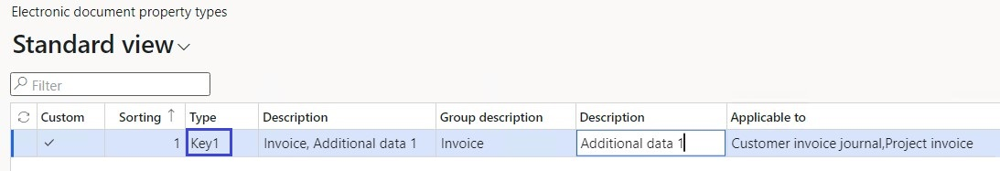
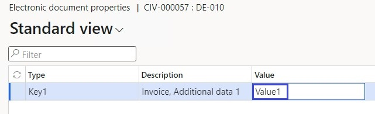

# Get started with Electronic invoicing for Poland

[!include [banner](../includes/banner.md)]

This article provides information that will help you get started with Electronic invoicing for Poland. It guides you through the configuration steps that are country-dependent in Regulatory Configuration Service (RCS) and in Microsoft Dynamics 365 Finance or Dynamics 365 Supply Chain Management. These steps complement the steps that are described in [Set up Electronic invoicing](e-invoicing-set-up-overview.md).

## Prerequisites

Before you begin the procedures in this article, complete the following prerequisites:

- The legal entity must be registered as a taxpayer in Poland and must have a valid tax identification number (*Numer identyfikacji podatkowej*, or NIP).
- A valid certificate for digital signing must be obtained from the appropriate authorities.
- Become familiar with Electronic invoicing as it's described in [Electronic invoicing overview](e-invoicing-service-overview.md).
- Sign up for RCS, and set up Electronic invoicing. For more information, see the following articles:

    - [Sign up for and install the Electronic Invoicing service](e-invoicing-sign-up-install.md)
    - [Set up Azure resources for Electronic invoicing](e-invoicing-set-up-azure-resources.md)
    - [Install the add-in for microservices in Lifecycle Services](e-invoicing-install-add-in-microservices-lcs.md)

- Activate the integration between your Finance or Supply Chain Management app and the Electronic Invoicing service as described in [Activate and setup integration with Electronic invoicing](e-invoicing-activate-setup-integration.md).
- Create certificates and secrets in Azure Key Vault, and set up Key Vault as described in [Customer certificates and secrets](e-invoicing-customer-certificates-secrets.md):

    - The secret for the legal entity's tax identification number
    - The secret that will contain the public key that is provided by the Polish National system for electronic invoicing ([KSeF](https://www.podatki.gov.pl/ksef))
    - The certificate for digital signing

- Make sure that the following Electronic reporting (ER) format configurations are imported. For more information, see [Import Electronic reporting (ER) configurations](../../fin-ops-core/dev-itpro/analytics/electronic-reporting-import-ger-configurations.md).

    - Sales e-invoice (PL)
    - Project e-invoice (PL)
    - Advance e-invoice (PL)

## Country-specific configuration for the Polish electronic invoice (PL) feature

Some of the parameters from the **Polish electronic invoice (PL)** electronic invoicing feature are published with default values. Before you deploy the electronic invoicing feature to the service environment, review the default values, and update them as required so that they better reflect your business operations.

1. Import the latest version of the **Polish electronic invoice (PL)** Globalization feature as described in [Import features from the Global repository](e-invoicing-import-feature-global-repository.md).
2. Create a copy of the imported Globalization feature, and select your configuration provider for it, as described in [Create a Globalization feature](e-invoicing-create-new-globalization-feature.md).
3. On the **Versions** tab, verify that the **Draft** version is selected.
4. On the **Setups** tab, in the grid, select the **Submit batch** feature setup, and then select **Edit**.
5. On the **Processing pipeline** tab, in the **Processing pipeline** section, select the **(Preview) KSeF send batch to e-invoice system** action.
6. In the **Parameters** section, select **Client ID**, and then select the name of the secret that you previously created for the legal entity's tax identification number.
7. Select **Certificate name**, and then select the name of the digital certificate that you created.
8. Select **Public key**, and then select the name of the secret that you created for the public key.
9. Select **Service URI**, and make sure that a valid URI is configured. To get the testing and production URIs, go to the website of the Polish National system for electronic invoicing ([KSeF](https://www.podatki.gov.pl/ksef)).
10. In the **Processing pipeline** section, select the **(Preview) KSeF get batch status from e-invoice system** action.
11. In the **Parameters** section, select **Service URL**, and make sure that a valid URL is configured.
12. Select **Save**, and close the page.
13. On the **Setups** tab, in the grid, select the **Submit customer invoice** feature setup, and then select **Edit**.
14. On the **Applicability rules** tab, in the **LegalEntityID** field, make sure that a valid legal entity code is configured in the **Value** column.
15. Select **Save** (if you made any changes), and close the page.
16. Repeat steps 13 through 15 for the **Submit project invoice** and **Submit advance invoice** feature setups.

## Finance configuration

Some additional parameters must be configured directly in Finance.

1. Make sure that the country-specific ER configurations that are required for Poland are imported. For more information, see [Set up Electronic invoicing parameters](e-invoicing-set-up-parameters.md).
2. Go to **Organization administration** \> **Setup** \> **Electronic document parameters**.
3. In the **Electronic document** section, add records for the **Customer Invoice journal**, **Project invoice** and **Advance invoice** table names.
4. For each table name, set the **Document context** and **Electronic document model mapping** fields in accordance with step 1.
5. For the **Customer Invoice journal** table name, select **Response types**.
6. Create a response type that has the same name that was defined for the related variable of the **To client** type in the corresponding feature setups in RCS. Enter the following values:

    - In the **Submission status** field, select **Pending**.
    - In the **Model mapping** field, select **KSeF response data import format (PL)**.

7. Repeat steps 5 through 6 for the **Project invoice** and **Advance invoice** electronic documents.
8. In the **Feature management** workspace, the **Export channels for electronic invoicing integration** feature must be enabled. For more information, see [Feature management overview](../../fin-ops-core/fin-ops/get-started/feature-management/feature-management-overview.md).
9. In the **Electronic reporting** workspace, on the **Reporting configurations** tile, select the **Customer invoice context model** configuration.
10. Select **Create configuration**, and then, in the drop-down dialog box, select the **Derive from Name: Customer invoice context model, Microsoft** option to create a derived configuration.
11. Open the derived configuration for editing in the designer, and select **Map model to datasource**.
12. Open the **DataChannel** definition for editing in designer. In the **Data sources** tree, expand the **$Context\_Channel** container.
13. In the **Value** field, select **Edit**, and enter the data channel name. The value is the name of the data channel that is configured in the **Export channel** section for the **Submit batch** feature setup in RCS.
14. Save your changes, and complete the derived configuration.
15. Go to **Organization administration** \> **Setup** \> **Electronic document parameters**.
16. On the **Integration channels** tab, add a channel that has the same name that was used in step 13.
17. In the **Company** column, enter a required legal entity code. In the **Document context** column, refer to the derived configuration.
18. Save your changes, and close the page.

## Finance business data configuration

### Prerequisites

The primary address of the legal entity must be in Poland.

### Configure legal entity data

#### Enter a legal entity's address

1. Go to **Organization administration** \> **Organizations** \> **Legal entities**.
2. Select a legal entity, and then, on the **Addresses** FastTab, add a valid primary address for the legal entity.

> [!NOTE]
> Make sure that the following mandatory address elements are defined: country/region code, ZIP/postal code, city, and building number.

#### Enter a legal entity's tax registration number

1. Go to **Organization administration** \> **Organizations** \> **Legal entities**.
2. Select a legal entity, and then, on the **Tax registration** FastTab, in the **Tax registration number** field, enter a valid tax registration number for the legal entity. This number will be used as the seller's tax identification number (NIP).

### Configure customer data

#### Enter a customer's address

1. Go to **Accounts receivable** \> **Customers** \> **All customers**.
2. Select a customer, and then, on the **Addresses** FastTab, add a valid address for the customer.

> [!NOTE]
> For addresses in Poland, make sure that the following mandatory elements are defined: country/region code, ZIP/postal code, city, and building number. For foreign addresses, make sure that at least the following mandatory elements are defined: country/region code and city.

#### Enter a customer's tax registration number

1. Go to **Accounts receivable** \> **Customers** \> **All customers**.
2. Select a customer, and then, on the **Invoice and delivery** FastTab, in the **Tax exempt number** field, enter a valid tax registration number for the customer. This number will be used as the buyer's tax identification number (NIP).

### Configure additional data

You can add any additional arbitrary data to invoices. This data will be put in a special section of electronic invoices that is named *DodatkowyOpis*.

#### Configure electronic document properties

1. Go to **Accounts receivable** \> **Setup** \> **Electronic document property types**.
2. Select **New** to add a property type.
2. In the **Type** field, enter the value to use as an additional data key (*Klucz*) in the resulting XML file of an e-invoice.
3. Select **Applicability** to add an applicable table.
4. On the **Electronic document property type applicability setup** page, in **Table name** field, select **Customer invoice journal** and **Project invoice**.
5. Add as many additional document properties as you require.
6. Save your changes, and return to the **Electronic document property types** page.

    

#### Enter additional data

Follow these steps to enter additional invoice data.

1. Go to **Accounts payable** \> **Inquiries and reports** \> **Invoice** \> **Invoice journal**.
2. Select an invoice in the list, and then, on the Action Pane, on the **Invoice** tab, in the **Properties** group, select **Electronic document properties**.
3. Enter a required value. This value will be used in the *Wartosc* field in the resulting XML file of an e-invoice.

    

> [!NOTE]
> You can enter additional data for project invoices in a similar way at **Project management and accounting** \> **Project invoices** \> **Project invoice**.

## Issue electronic invoices

When you've completed all the required configuration steps, you can generate and submit electronic invoices for posted invoices. For more information about how to generate electronic invoices, see [Issue electronic invoices in Finance and Supply chain management](e-invoicing-issuing-electronic-invoices-finance-supply-chain-management.md).

> [!NOTE]
> For Polish electronic invoice submission, additional steps must be completed in addition to the standard procedure that was described earlier.

In Poland, the standard submission procedure just generates electronic invoices and stores them on the service side. It doesn't actually submit them to KSeF. To submit the electronic invoices, follow these steps.

1. Go to **Organization administration** \> **Periodic** \> **Electronic documents** \> **Run submission process in export channels**.
2. In the **Channel** field, select the channel that you [previously created](#channel). Then select **OK**.

You can inquire about the results of the submission at **Organization administration** \> **Periodic** \> **Electronic documents** \> **Electronic document submission log**).

## Receive incoming electronic invoices

Complete the following additional configuration steps for the same version of the **Polish electronic invoice (PL)** electronic invoicing feature that's used for outgoing invoice submission.

1. In RCS, on the **Globalization features** tile, on the **Electronic invoicing** tile, select the same version of the **Polish electronic invoice (PL)** electronic invoicing feature that was configured for outgoing invoices submission.
2. On the **Setups** tab, in the grid, select **Import vendor invoice**, and then select **Edit**.
3. On the **Import channel** tab, in the **Parameters** section, select the **Data channel** parameter. Then, in the **Value** field, define the name of the data channel. Alternatively, leave the default value unchanged. Whatever you do, make a note of the value, because you will use it in later configuration steps.
4. Select the **Service URI** parameter, and make sure that a valid URI is configured.
5. Select the **Client ID** parameter, and then select the name of the secret that contains the client identifier.
6. Select the **Certificate name** parameter, and then select the name of the digital certificate that you created.
7. Select the **Start date** parameter, and then define the initial date for the first receipt of invoices from KSEF. All invoices that have dates between the **Start date** value and the current receiving date will be downloaded. Each successive receiving process will start from the date of the previous process.
8. On the **Applicability rules** tab, in the **Channel** field, make sure that the **Value** column contains the same import channel name that you previously defined.
9. On the **Variables** tab, make a note of the **OutputFile** name, because you will use it in later configuration steps.
10. Select **Save**, and close the page. 

### Finance configuration

Some additional parameters must be configured directly in Finance.

1. Make sure that the following Electronic Reporting configurations are imported:

    - Vendor invoice import (PL)
    - Vendor invoice Mapping to destination (PL)

2. In the **Electronic reporting** workspace, on the **Reporting configurations** tile, select the **Customer invoice context model** configuration.
3. Select **Create configuration**, and then, in the drop-down dialog box, select **Derive from Name: Customer invoice context model, Microsoft** to create a derived configuration.

    > [!NOTE]
    > The derived configuration must differ from the [configuration](#ExportChannel) that's used for the invoice *submission* setup. 

4. Open the derived configuration for editing in the designer, and then select **Map model to datasource**.
5. Open the **DataChannel** definition for editing in the designer.
6. In the **Data sources** tree, expand the **$Context\_Channel** container.
7. In the **Value** field, select **Edit**, and then enter the data channel name.
8. Save your changes, and complete the derived configuration.
9. Go to **Organization administration** \> **Setup** \> **Electronic document parameters**.
10. On the **Integration channels** tab, in the **Channels** section, in the **Channel** field, enter the same import channel name that you created earlier.
11. In the **Channels** section, in the **Company** field, select a required legal entity. In the **Document context** field, select the configuration that you created earlier.
12. In the **Import sources** section, in the **Name** field, enter the same **OutputFile** name that you [created earlier](#OutputFile).
13. In the **Data entity name** field, select **Vendor invoice header**. In the **Model mapping** field, reference the **Vendor invoice import (PL)** configuration.
14. Select **Save**, and close the page.

### Configure Finance business data

You must configure the following types of master data to provide a match for incoming electronic invoices:

- Vendors
- Products
- Units

#### Vendors 
 
1. Go to **Accounts payable** \> **Vendors** \> **All vendors**, and select a vendor.
2. On the **Invoice and delivery** FastTab, in the **Tax exempt number** field, enter a valid value. The vendor's tax exempt number is used to identify the vendor during the import process for incoming electronic invoices. If no vendor that has matching data is found in the system, the import process fails, and a related error message is shown.

#### Products

1. Go to **Product information management** \> **Products** \> **Released products**, and select a product.
2. On the Action Pane, on the **Purchase** tab, in the **Related information** group, select **External item description**.
3. In the **Vendor relation** field, select the vendor or vendor group that the product's external identification is being set up for.
4. In the **External item number** field, enter the identification number of the product for a specific vendor or the group of vendors. External item numbers are used to identify the product during the import process for incoming electronic invoices. If no product that has matching criteria is found in the system, the import process fails, and a related error message is shown.

#### Units

1. Go to **Organization administration** \> **Setup** \> **Units** \> **Units**.
2. Select a unit, and then select **External codes**.
3. On the **External codes** page, in the **Overview** section, in the **Code** field, enter a code that corresponds to the selected unit.
4. In the **Value** section, in the **Value** field, enter the external code to match with the unit codes from incoming electronic invoices during the import process.

    > [!NOTE]
    > External unit codes make sense only if incoming electronic invoices contain explicitly defined units. Otherwise, you can skip step 4. 

### Receive electronic invoices

Follow these steps to receive electronic invoices.

1. Go to **Organization administration** \> **Periodic** \> **Electronic documents** \> **Receive electronic documents**.
2. Select **OK**, and then close the page.

During the import process, the system tries to automatically match incoming electronic vendor invoices with existing purchase orders. If no purchase order is found, the system raises a warning but continues to import the products on invoice lines as **Non-stock** items, expecting that the products belong to an item model group where the **Stocked product** checkbox is cleared in the inventory policy. Otherwise, the import process fails, and a related error message is shown.

To view the receipt logs for electronic invoices, go to **Organization administration** \> **Periodic** \> **Electronic documents** \> **Electronic document receipt log**.

To view successfully received invoices, go to **Accounts payable** \> **Invoices** \> **Pending vendor invoices**.

## Additional resources

- [Electronic invoicing overview](e-invoicing-service-overview.md)
- [Get started with Electronic invoicing service administration](e-invoicing-get-started-service-administration.md)
- [Get started with Electronic invoicing](e-invoicing-get-started.md)

[!INCLUDE[footer-include](../../includes/footer-banner.md)]
