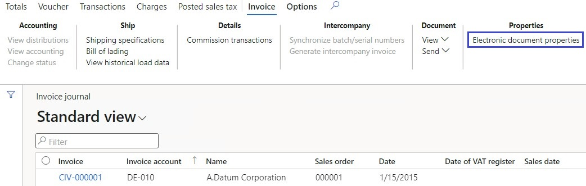

---
# required metadata

title: Electronic invoicing for Poland
description: This topic provides information that will help you get started with Electronic invoicing for Poland in Microsoft Dynamics 365 Finance and Dynamics 365 Supply Chain Management.
author: ilkond
ms.date: 05/12/2022
ms.topic: article
ms.prod: 
ms.technology: 

# optional metadata

ms.search.form: 
# ROBOTS: 
audience: Application User
# ms.devlang: 
ms.reviewer: kfend
# ms.tgt_pltfrm: 
ms.custom: 574537
ms.assetid: 
ms.search.region: Poland
# ms.search.industry: 
ms.author: janeaug
ms.search.validFrom: 2022-07-15
ms.dyn365.ops.version: AX 10.0.28

---

# Get started with Electronic invoicing for Poland

[!include [banner](../includes/banner.md)]

This topic provides information that will help you get started with Electronic invoicing for Poland. It guides you through the configuration steps that are country-dependent in Regulatory Configuration Service (RCS). These steps complement the steps that are described in [Set up Electronic invoicing](e-invoicing-set-up-overview.md).

## Prerequisites

Before you begin the procedures in this topic, complete the following prerequisites:

- The legal entity must be registered as a Taxpayer in Poland and have a valid tax identification number - **NIP** (*Numer identyfikacji podatkowej*).
- A valid certificate for digital signing must be preliminary obtained from the respective authorities.
- Become familiar with Electronic invoicing as it's described in [Electronic invoicing overview](e-invoicing-service-overview.md).
- Sign up for RCS, and set up Electronic invoicing. For more information, see the following topics:

    - [Sign up for and install the Electronic Invoicing service](e-invoicing-sign-up-install.md)
    - [Set up Azure resources for Electronic invoicing](e-invoicing-set-up-azure-resources.md)
    - [Install the add-in for microservices in Lifecycle Services](e-invoicing-install-add-in-microservices-lcs.md)
	
- Activate the integration between your Microsoft Dynamics 365 Finance or Dynamics 365 Supply Chain Management application and the Electronic Invoicing service as described in [Activate and setup integration with Electronic invoicing](e-invoicing-activate-setup-integration.md).
- Create certificates and secrets in Azure Key Vault, and set it up it as described in [Customer certificates and secrets](e-invoicing-customer-certificates-secrets.md). 
    - The secret for the legal entity tax identification number.
    - The secret that will contain the public key provided by Polish National system for electronic invoicing [KSEF](https://www.podatki.gov.pl/ksef).
    - The certificate for digital signing.
- Make sure that the following Electronic Reporting format configurations are imported. For moe information, see [Import Electronic reporting (ER) configurations](../../fin-ops-core/dev-itpro/analytics/electronic-reporting-import-ger-configurations.md)
    - Sales e-invoice (PL).
    - Project e-invoice (PL).
    - Advance e-invoice (PL).

## Country-specific configuration for the Polish electronic invoice (PL) feature

Some of the parameters from the **Polish electronic invoice (PL)** electronic invoicing feature are published with default values. Before you deploy the electronic invoicing feature to the service environment, review the default values, and update them as required so that they better reflect your business operation.

1. Import the latest version of the **Polish electronic invoice (PL)** Globalization feature as described in [Import features from the Global repository](e-invoicing-import-feature-global-repository.md).
2. Create a copy of the imported Globalization feature, and select your configuration provider for it, as described in [Create a Globalization feature](e-invoicing-create-new-globalization-feature.md).
3. On the **Versions** tab, verify that the **Draft** version is selected.
4. On the **Setups** tab, in the grid, select the **Submit batch** feature setup and click on the **Edit** button.
5. On the **Processing pipeline** tab, in the **Processing pipeline** section, select the **(Preview) KSeF send batch to e-invoice system** action.
6. In the **Parameters** section, select **Client ID**, and then select the name of the secret previously created for the legal entity tax identification number.
7. In the **Parameters** section, select **Certificate name**, and then select the name of the digital certificate that you created.
8. In the **Parameters** section, select **Public key**, and then select the name of the secret created for the public key.
9. In the **Parameters** section, select **Service URL**, and make sure that a valid URL is configured. To get the testing and production URLs, go to the website of Polish National system for electronic invoicing [KSEF](https://www.podatki.gov.pl/ksef).
10. On the **Processing pipeline** tab, in the **Processing pipeline** section, select the **(Preview) KSeF get batch status from e-invoice system** action.
11. In the **Parameters** section, select **Service URL**, and make sure that a valid URL is configured.
12. Select **Save**, and close the page.
13. On the **Setups** tab, in the grid, select the **Submit customer invoice** feature setupand click on the **Edit** button.
14. On the **Applicability rules** tab, in the **LegalEntityID** field, make sure that a valid Legal entity code is configured in the **Value** column.
15. Select **Save** (if changes were made), and close the page.
16. Repeat the steps 13 through 15 for the **Submit project invoice** and **Submit advance invoice** feature setups.

## Microsoft Dynamics D365 Finance configuration

Some of the parameters must be additionally configured directly in Microsoft Dynamics D365 Finance. 

1. Make sure that country specific Electronic reporting configurations required for Poland are imported. For more information, see: [Set up Electronic invoicing parameters](e-invoicing-set-up-parameters.md)
2. In the **Organization administration** module, in the **Setup** section, open the **Electronic documents parameters** form.
3. In the **Electronic document** section, add new records for the **Customer Invoice journal**, **Project nvoice** and **Advance invoice** table names. 
4. For each table name, fill in **Document context** and **Electronic document model mapping** in accordance with point 1.
5. In the **Electronic document** section, for the **Customer Invoice journal** table name, select **Response types** menu.
6. Create a new **Response type** with the same name as was defined for the related variable of **To client** type in the respective feature setups in RCS. Enter the following values:
   - select **Pending** in the **Submission status** field.
   - select **KSeF response data import format (PL)** in the **Model mapping** field.
7. Repeat the steps 5 through 6 for the **Project nvoice** and **Advance invoice** electronic documents.
8. In the **Feature management** workspace, the **Export channels for electronic invoicing integraion** feature must be enabled. For more information, see [Feature management overview](../../fin-ops-core/fin-ops/get-started/feature-management/feature-management-overview.md).
9. On the **Electronic reporting** workspace, on the **Reporting configurations** tile, select **Customer invoice context model** configuration.
10. Select the **Create configuration** menu and the **Derive from Name: Customer invoice context model, Microsoft** option to create a derived configuration.
11. Open the derived configuration for editting in **Designer** and select the **select Map model to datasource** menu.
12. Open the **DataChannel** definition for editting in **Designer**. In the **Data sources** tree, expand the **$Context_Channel** container.
13. In the **Value** field, select **Edit** and enter the data channel name. This is the name of the **Data channel** configured in RCS, in the **Export chanel** section for the **Submit batch** feature setup.
14. Save changes and complete the derived configuration.
15. In the **Organization administration** module, in the **Setup** section, open the **Electronic documents parameters** form.
16. In the **Integration channels** section, add a new channel with the same name as was used in step 13.
17. Enter a required Legal entity code in the **Company** column and refer to the derived configuration in the **Document context** column.
18. Save changes and and close the page.

## Microcost Dynamics D365 Finance business data configuration

### Prerequisites

The primary address of the legal entity must be in Poland.

### Configure legal entity data

#### Enter a legal entity's address

1. Go to **Organization administration** \> **Organizations** \> **Legal entities**.
2. Select a legal entity, and then, on the **Addresses** FastTab, add a valid primary address for the legal entity.
> [!NOTE]
> Make shure that the following mandatory address elements are defined: Country code, ZIP code, City and Building number.

#### Enter a legal entity's tax registration number

1. Go to **Organization administration** \> **Organizations** \> **Legal entities**.
2. Select a legal entity, and then, on the **Tax registration** FastTab, in the **Tax registration number** field, enter a valid tax registration number for the legal entity. This number will be used as the seller's Tax identification number (**NIP**).

### Configure customer data

#### Enter a customer's address

1. Go to **Accounts receivable** \> **Customers** \> **All customers**.
2. Select a customer, and then, on the **Addresses** FastTab, add a valid address for the customer.
> [!NOTE]
> Make shure that for addressed located in Poland the following mandatory elements are defined: Country code, ZIP code, City and Building number. For foreign addresses at least the following mandatory elements are defined: Country code and City.

#### Enter a customer's tax registration number

1. Go to **Accounts receivable** \> **Customers** \> **All customers**.
2. Select a customer, and then, on the **Invoice and delivery** FastTab, in the **Tax exempt number** field, enter a valid tax registration number for the customer. This number will be used as the buyer's Tax identification number (**NIP**).

### Configure additional data

You can add to invoices any additional arbitrary data which will be placed in a special section *DodatkowyOpis* of electronic invoices.

#### Configure electronic document properties

1. Go to **Accounts receivable** > **Setup** > **Electronic document property types**.
2. Select **New** to add a property type.
2. In the **Type** field, enter the value which will be then used as an additional data key (*Klucz*) in the resulting XML file of an e-invoice. 
3. Select **Applicability** to add an applicable table. 
4. On the **Electronic document property type applicability setup** page, in **Table name** field, select **Customer invoice journal** and **Project invoice**.
5. Add as many additional document properties as you need.
6. Save and return to the **Electronic document property types** page.

   

#### Enter additional data

Follow these steps to enter additional invoice data.

1. Go to **Accounts payable** \> **Inquiries and reports** \> **Invoice** \> **Invoice journal**.
2. Select an invoice in the list, and then select **Electronic document properties**.

    

3. Enter a required value. This value will be used in the *Wartosc* field in the resulting XML file of an e-invoice.

    
    
> [!NOTE]
> Similarly, you can enter additional data for Project invoices in **Project management and accounting** \> **Project Invoices** \> **Project invoicei**.

## Issue electronic invoices

When you've completed all the required configuration steps, you can generate and sumbit electronic invoices for posted invoices. For more information about how to generate electronic invoices, see [Issue electronic invoices in Finance and Supply chain management](e-invoicing-issuing-electronic-invoices-finance-supply-chain-management.md).

> [!NOTE]
> For Polish electronic invoices submission, there are the steps that must be performed additionally to the standard procedure described above.

In Poland, the standard submission procedure will generate electronic invoices and store it on the service side witout actual submission to KSeF. To perform submission, do the following steps:
1. In the **Organization administration** module, select **Periodic**, then select **Electronic documents** and open **Run submission process in export channels** form.
2. In the **Channel** field, select the channel previously created on the [step 16](#channel) of the **Microsoft Dynamics D365 Finance configuration** section.

## Privacy notice

Enabling the **Polish electronic invoice (PL)** feature might require that limited data be sent. This data includes the organization's tax registration ID. The data will be transmitted to third-party agencies that have been authorized by the tax authority to send electronic invoices to that tax authority in the predefined format that is required for integration with the government's web service. An administrator can enable and disable the feature by going to **Organization administration** \> **Setup** \> **Electronic document parameters**. On the **Features** tab, select the row that contains the **Polish electronic invoice (PL)** feature, and then make the appropriate selection. Data that is imported from external systems into this Dynamics 365 online service are subject to our [privacy statement](https://go.microsoft.com/fwlink/?LinkId=512132). For more information, see the "Privacy notice" section in country-specific feature documentation.

## Additional resources

- [Electronic invoicing overview](e-invoicing-service-overview.md)
- [Get started with Electronic invoicing service administration](e-invoicing-get-started-service-administration.md)
- [Get started with Electronic invoicing](e-invoicing-get-started.md)

[!INCLUDE[footer-include](../../includes/footer-banner.md)]
