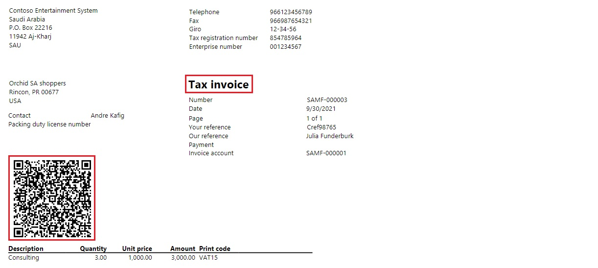

---
# required metadata

title: Electronic invoicing for Poland
description: This topic provides information that will help you get started with Electronic invoicing for Poland in Microsoft Dynamics 365 Finance and Dynamics 365 Supply Chain Management.
author: ilkond
ms.date: 05/12/2022
ms.topic: article
ms.prod: 
ms.technology: 

# optional metadata

ms.search.form: 
# ROBOTS: 
audience: Application User
# ms.devlang: 
ms.reviewer: kfend
# ms.tgt_pltfrm: 
ms.custom: 574537
ms.assetid: 
ms.search.region: Poland
# ms.search.industry: 
ms.author: janeaug
ms.search.validFrom: 2022-07-15
ms.dyn365.ops.version: AX 10.0.28

---

# Electronic invoicing for Poland

[!include [banner](../includes/banner.md)]

This topic provides information that will help you get started with Electronic invoicing for Poland. It guides you through the configuration steps that are country-dependent in Regulatory Configuration Service (RCS). These steps complement the steps that are described in [Set up Electronic invoicing](e-invoicing-set-up-overview.md).

## Prerequisites

Before you begin the procedures in this topic, complete the following prerequisites:

- Become familiar with Electronic invoicing as it's described in [Electronic invoicing overview](e-invoicing-service-overview.md).
- Sign up for RCS, and set up Electronic invoicing. For more information, see the following topics:

    - [Sign up for and install the Electronic Invoicing service](e-invoicing-sign-up-install.md)
    - [Set up Azure resources for Electronic invoicing](e-invoicing-set-up-azure-resources.md)
    - [Install the add-in for microservices in Lifecycle Services](e-invoicing-install-add-in-microservices-lcs.md)
	
- Activate the integration between your Microsoft Dynamics 365 Finance or Dynamics 365 Supply Chain Management application and the Electronic Invoicing service as described in [Activate and setup integration with Electronic invoicing](e-invoicing-activate-setup-integration.md).
- Create a digital certificate secret in Azure Key Vault, and set it up it as described in [Customer certificates and secrets](e-invoicing-customer-certificates-secrets.md). 
- 
## Country-specific configuration for the Polish electronic invoice (PL) feature

Some of the parameters from the **Polish electronic invoice (PL)** electronic invoicing feature are published with default values. Before you deploy the electronic invoicing feature to the service environment, review the default values, and update them as required so that they better reflect your business operation.

1. Import the latest version of the **Polish electronic invoice (PL)** Globalization feature as described in [Import features from the Global repository](e-invoicing-import-feature-global-repository.md).
2. Create a copy of the imported Globalization feature, and select your configuration provider for it, as described in [Create a Globalization feature](e-invoicing-create-new-globalization-feature.md).
3. On the **Versions** tab, verify that the **Draft** version is selected.
4. On the **Setups** tab, in the grid, select the **Sales invoice derived** feature setup.
5. Select **Edit**.
6. On the **Processing pipeline** tab, in the **Processing pipeline** section, select **Sign ZZZZZZZZZZZZZZZZZZZZZZZZZZZZZ**.
7. In the **Parameters** section, select **Certificate name**, and then select the name of the digital certificate that you created.
8. In the **Processing pipeline** section, select **Integrate with ZZZZZZZZZZZZZZZZZZZZZZZ**. Repeat this step for the two occurrences of this action.
9. In the **Parameters** section, select **Web service URL** and **Login service URL**. Then review the URL parameters. To get the testing and production URL, go to the website of Polish National system for electronic invoicing [KSEF](https://www.podatki.gov.pl/ksef).
10. Select **Save**, and close the page.
11. Repeat the steps 4 through 10 for the **Project invoice derived** and **Advance invoice derived** feature setups ZZZZZZZZZZZZZZZZZZZZ.

## Country-specific configuration for the Polish electronic invoice (PL) application setup

There are parameters that must be set up in your Finance or Supply Chain Management environment. You can complete this setup in either of two places:

- Directly in your Finance or Supply Chain Management environment. For more information, see [Setup Electronic Invoicing parameters](e-invoicing-set-up-parameters.md).
- In RCS. In the scope of electronic invoicing feature setup, you can define all parameters and then deploy them directly to your Finance or Supply Chain Management environment when you deploy the electronic invoicing feature.

For both options, the parameters are the same. If you're setting up your first feature in the Electronic Invoicing service, we recommend that you follow these steps to set up the parameters in RCS and then deploy them to your connected application.

> [!NOTE]
> Some electronic invoicing feature versions might contain a predefined set of application-specific parameters for Finance or Supply Chain Management. In this case, you should verify that the data is correct. Otherwise, manually set the parameters.

1. Find the copy of the **Polish electronic invoice (PL)** Globalization feature that you created.
2. On the **Versions** tab, verify that the **Draft** version is selected.
3. On the **Setups** tab, select **Application setup**.
4. In the **Connected applications** field, select the application where you want to deploy the parameters.
5. On the **Electronic document types** page, select **Add** to create a record.
6. In the **Table name** field, add **CustInvoiceJour**.
7. In the **Context** field, add a reference to the **Customer invoice context** mapping name. The configuration is **Customer invoice context model**.
8. In the **Electronic document mapping** field, add a reference to the **Customer invoice** mapping name. The configuration is **Invoice model mapping**.
9. Select **Save**.
10. On **Response types** page, select **Add**.
11. In the **Response type** field, enter **Response**.
12. In the **Description** field, enter **Process response**.
13. In the **Submission status** field, select **Pending**.
14. In the **Model mapping** field, select **Response message import**. The configuration is **PL ZZZZZZZZZZZZZZ**.
15. Select **Save**.
16. Select **Add**.
17. In the **Response type** field, enter **ResponseData**.
18. In the **Description** field, enter **Process response data**.
19. In the **Submission status** field, select **Pending**.
20. In the **Data entity name** field, select **SalesInvoiceHeaderV2Entity**.
21. In the **Model mapping** field, select **Response data import**. The configuration is **PL ZZZZZZZZZZZZZZ**.
22. Select **Save**, and close the page.
23. Close the page.

To deploy a feature to the service environment and an application setup to the Finance or Supply Chain Management connected application, see [Complete, publish, and deploy a Globalization feature](e-invoicing-complete-publish-deploy-globalization-feature.md)

## Microcost Dynamics D365 configuration

### Prerequisites

The primary address of the legal entity must be in Poland.

### Configure legal entity data

#### Enter a legal entity's address

1. Go to **Organization administration** \> **Organizations** \> **Legal entities**.
2. Select a legal entity, and then, on the **Addresses** FastTab, add a valid primary address for the legal entity.
> [!NOTE]
> Make shure that the following mandatory address elements are defined: Country code, ZIP code, City and Building number.

#### Enter a legal entity's tax registration number

1. Go to **Organization administration** \> **Organizations** \> **Legal entities**.
2. Select a legal entity, and then, on the **Tax registration** FastTab, in the **Tax registration number** field, enter a valid tax registration number for the legal entity. This number will be used as the seller's Tax identification number (**NIP**).

### Configure customer data

#### Enter a customer's address

1. Go to **Accounts receivable** \> **Customers** \> **All customers**.
2. Select a customer, and then, on the **Addresses** FastTab, add a valid address for the customer.
> [!NOTE]
> Make shure that for addressed located in Poland the following mandatory elements are defined: Country code, ZIP code, City and Building number. For foreign addresses at least the following mandatory elements are defined: Country code and City.

#### Enter a customer's tax registration number

1. Go to **Accounts receivable** \> **Customers** \> **All customers**.
2. Select a customer, and then, on the **Invoice and delivery** FastTab, in the **Tax exempt number** field, enter a valid tax registration number for the customer. This number will be used as the buyer's Tax identification number (**NIP**).

### Configure additional data

Electronic properties.

### Issue electronic invoices

When you've completed all the required configuration steps, you can generate electronic invoices for posted invoices. For more information about how to generate electronic invoices, see [Issue electronic invoices in Finance and Supply chain management](e-invoicing-issuing-electronic-invoices-finance-supply-chain-management.md).

## Privacy notice

Enabling the **Polish electronic invoice (PL)** feature might require that limited data be sent. This data includes the organization's tax registration ID. The data will be transmitted to third-party agencies that have been authorized by the tax authority to send electronic invoices to that tax authority in the predefined format that is required for integration with the government's web service. An administrator can enable and disable the feature by going to **Organization administration** \> **Setup** \> **Electronic document parameters**. On the **Features** tab, select the row that contains the **Polish electronic invoice (PL)** feature, and then make the appropriate selection. Data that is imported from external systems into this Dynamics 365 online service are subject to our [privacy statement](https://go.microsoft.com/fwlink/?LinkId=512132). For more information, see the "Privacy notice" section in country-specific feature documentation.

## Additional resources

- [Electronic invoicing overview](e-invoicing-service-overview.md)
- [Get started with Electronic invoicing service administration](e-invoicing-get-started-service-administration.md)
- [Get started with Electronic invoicing](e-invoicing-get-started.md)

[!INCLUDE[footer-include](../../includes/footer-banner.md)]
