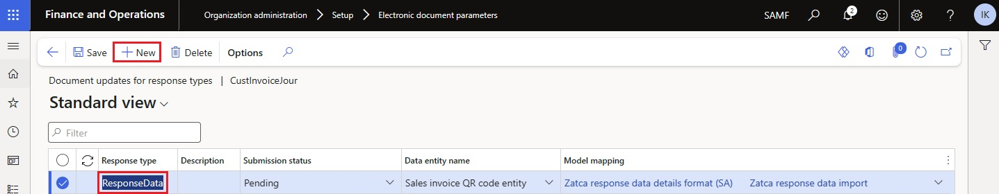

# Get started with Electronic invoicing for Saudi Arabia - Phase two

[!include [banner](../includes/banner.md)]

This article provides information that will help you get started with phase two of Electronic invoicing for Saudi Arabia. This article guides you through the configuration steps that are country-dependent in Regulatory Configuration Service (RCS) and in Microsoft Dynamics 365 Finance or Dynamics 365 Supply Chain Management. These steps complement the steps that are described in [Set up Electronic invoicing](e-invoicing-set-up-overview.md).

### Prerequisites

Before you begin the procedures in this article, complete the following prerequisites: 

- Become familiar with Electronic invoicing as it's described in [Electronic invoicing overview](e-invoicing-service-overview.md).
- Sign up for RCS, and set up Electronic invoicing. For more information, see the following articles:

    - [Sign up for and install the Electronic Invoicing service](e-invoicing-sign-up-install.md)
    - [Set up Azure resources for Electronic invoicing](e-invoicing-set-up-azure-resources.md)
    - [Install the add-in for microservices in Lifecycle Services](e-invoicing-install-add-in-microservices-lcs.md)

- Activate the integration between your Finance app and the Electronic Invoicing service as described in [Activate and setup integration with Electronic invoicing](e-invoicing-activate-setup-integration.md).
- Learn how to create certificates and secrets in Azure Key Vault, and set up Key Vault as described in [Customer certificates and secrets](e-invoicing-customer-certificates-secrets.md). 
- In Microsoft Dataverse, configure virtual entities for Finance and Supply Chain Management. For more information, see [Configure Dataverse virtual entities](../../fin-ops-core/dev-itpro/power-platform/admin-reference.md).
- Enable the **CustomerPaymentMethodEntity** virtual entity. For more information, see [Enable Microsoft Dataverse virtual entities](../../fin-ops-core/dev-itpro/power-platform/enable-virtual-entities.md).
- Add the Dataverse endpoint as a connected application in the RCS instance. For more information, see [Create a connected application](e-invoicing-connected-applications.md#create-a-connected-application).
- Import the **Saudi Arabian Zatca submission (SA)** and **Saudi Arabian ZATCA compliance check (SA)** electronic invoicing features into RCS from the Global repository. For more information, see [Import features from the Global repository](e-invoicing-import-feature-global-repository.md).
- Make sure that the following Electronic reporting (ER) format configurations are imported. For more information, see [Import Electronic reporting (ER) configurations](../../fin-ops-core/dev-itpro/analytics/electronic-reporting-import-ger-configurations.md).

    - Sales e-invoice (SA)
    - Project e-invoice (SA)
    - Retail fiscal document format (for Retail-specific scenarios, if required)

## Country-specific configuration for the Saudi Arabian Zatca submission (SA) Electronic invoicing feature

> [!NOTE]
> All the configuration steps in this chapter are described for  **Saudi Arabian Zatca submission (SA)** electronic invoicing feature. This assumes that the [onboarding](#onboarding) process is completed and Production Cryptographic Stamp Identifier (PCSID) is obtained. If you are in the middle of the onboarding process and only Compliance  Cryptographic Stamp Identifier (CCSID) is received then do the same configuration steps for **Saudi Arabian ZATCA compliance check (SA)** electronic invoicing feature. 

Some of the parameters from the **Saudi Arabian Zatca submission (SA)** electronic invoicing feature are published with default values. Before you deploy the electronic invoicing feature to the service environment, review the default values, and update them as required so that they better reflect your business operations.

1. In RCS, in the **Globalization feature** workspace, in the **Features** section, select the **Electronic invoicing** tile.
2. On the **Electronic invoicing features** page, verify that the **Saudi Arabian Zatca submission (SA)** Electronic invoicing feature is selected.
3. On the **Versions** tab, verify that the **Draft** version is selected.
4. On the **Configurations** tab, go to **Application specific parameters** for a selected configuration. In the **Lookups** section, make sure that **PaymentMethodSubstitutionLookup** lookup is selected.
5. In the **Conditions** section, select **Add** to add a condition.
6. In the **Name** column for the new condition, select the method of payment that is defined in the application. Then, in the **Lookup result** column, select a standardized method of payment code according to [UN/EDIFACT Code list 4461](https://unece.org/fileadmin/DAM/trade/untdid/d16b/tred/tred4461.htm).
7. Add specific conditions for each method of payment that is defined in the system, and save your changes.

    > [!NOTE]
    > In the **Name** column, you can select the **\*Blank\*** or **\*Not blank\*** placeholder value instead of a specific method of payment.

8. On the **Setups** tab, select **Edit** for the selected configuration. 
9. In the **Processing pipeline** section, turn on the **Export result** option for the **Transform document** action.
10. In Key Vault, create certificates and secrets for Cryptographic Stamp Identifiers (CSIDs). For more information, see [Customer certificates and secrets](e-invoicing-customer-certificates-secrets.md).

    > [!NOTE]
    > Depending on your place in the [onboarding](#onboarding) process, create a Compliance CSID (CCSID) or a Production CSID (PCSID).

11. In the **Globalization feature** workspace, select the **Environment setup** related link, and then, on the **Service environments** menu, select the environment to use for the feature deployment.
12. In **Number sequences** section, add a record for the number sequence that should be used to count submitted electronic invoices.

    

13. In the **Globalization feature** workspace, in the **Features** section, select the **Electronic invoicing** tile, and then select the draft version of the **Saudi Arabian Zatca submission (SA)** electronic invoicing feature. 
14. On the **Setups** menu, select the **Sales invoice** feature setup, and then select **Edit**.
15. On the **Processing pipeline** tab, in the **Processing pipeline** section, select the **Get next number sequence value** action. 
16. In the **Parameters** section, in the **Value** field, select the number sequence that you created in step 12.
17. In the **Processing pipeline** section, select **Prepare document for submit for Saudi Arabia Zatca service**, and then follow these steps:

    1. In the **Parameters** section, select the **Invoice counter value** name. 
    2. In the **Value** field, select **Get next number sequence value: Number sequence value**.
    3. Select the **Invoice counter name** name.
    4. In the **Value** field, select **Get next number sequence value: Number sequence name**.

18. In the **Processing pipeline** section, select **Integrate with Saudi Arabia Zatca service**, and then follow these steps:

    1. In the **Parameters** section, select **Web service URL**.
    2. In the **Value** field, enter the URL of the development portal or the production environment that is provided by the Saudi Arabian tax authority (ZATCA).
    3. Select the **API method name** name.
    4. In the **Value** field, select **Invoice clearance** for tax invoices or **Invoice reporting** for simplified invoices.
    5. Select the **Certificate name** name.
    6. In the **Value** field, select **CCSID** or **PCSID**, depending on your place in the [onboarding](#onboarding) process.
    7. Select the **Secret name** name.
    8. In the **Value** field, select **CCSIDSecret** or **PCSIDSecret**, depending on your place in the onboarding process. 

19. Repeat steps 13 through 17 for the **Project invoice** and **Retail simplified invoice** feature setup. 
19. Complete, publish, and deploy the **Saudi Arabian Zatca submission (SA)** feature to the service environment. For more information, see [Deploy the Electronic invoicing feature to Service environment](e-invoicing-get-started.md#deploy-the-electronic-invoicing-feature-to-service-environment).
20. Deploy the **Saudi Arabian Zatca submission (SA)** feature to the connected application. For more information, see [Deploy the Electronic invoicing feature to Connected application](e-invoicing-get-started.md#deploy-the-electronic-invoicing-feature-to-connected-application).

## Finance configuration

When tax invoices are cleared, ZATCA generates a QR code that contains the digital signature for that clearance. This QR code must be imported back into Finance, together with other clearance information that the tax authority returns as result of the submission of the tax invoices. To achieve this result, you must configure the response types in Finance. 

Follow these steps to complete the configuration.

1. Make sure that the country-specific ER configurations that are required for Saudi Arabia are imported. For more information, see [Set up Electronic invoicing parameters](e-invoicing-set-up-parameters.md)
2. Go to **Organization administration** \> **Setup** \> **Electronic document parameters**.
3. In the **Electronic document** section, add records for the **Customer Invoice journal**, **Project invoice** and **Fiscal transaction document** table names. 
4. For each table name, set the **Document context** and **Electronic document model mapping** fields in accordance with step 1.
5. For the **Customer Invoice journal** table name, select **Response types**.
6. Create a response type that has the same name that was defined for the related variable in the corresponding feature setups in RCS. 
7. In the **Submission status** field, select **Pending**.
8. In the **Data entity name** field, select **Sales invoice QR code entity**.
9. In the **Model mapping** field, select **Zatca response data import**.

    

For more information about business data configuration and processing in Finance, see [Customer electronic invoices in Saudi Arabia](emea-sau-e-invoices.md).

## Electronic invoicing onboarding in Saudi Arabia
Onboarding is mandatory for all taxpayers who are subject to electronic invoicing in Saudi Arabia. Taxpayers and their software for e-invoicing must be onboarded ZATCA. As a result of the onboarding process, taxpayers obtain CSIDs, which are required for integration with the electronic invoicing portal that is managed by ZATCA and for further submission of electronic invoices.

Onboarding is an essential part of the Electronic invoicing configuration. For more information about the onboarding process, see [Electronic invoicing onboarding in Saudi Arabia](e-invoicing-sa-onboarding.md).

## Additional resources

- [Electronic invoicing overview](e-invoicing-service-overview.md)

[!INCLUDE[footer-include](../../includes/footer-banner.md)]
