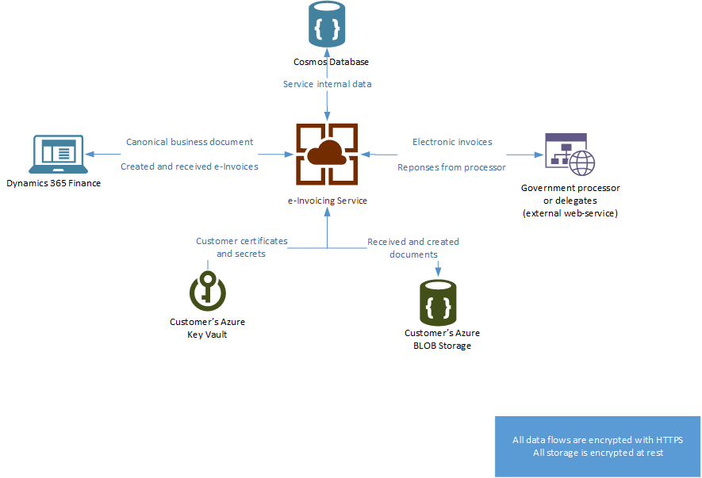

---
# required metadata

title: Electronic invoicing add-on overview
description: This topic provides information about the Electronic invoicing add-on in Microsoft Dynamics 365 Finance and Dynamics 365 Supply Chain Management.
author: gionoder
manager: AnnBe
ms.date: 09/22/2020
ms.topic: article
ms.prod: 
ms.service: dynamics-ax-platform
ms.technology: 

# optional metadata

ms.search.form: 
# ROBOTS: 
audience: Application User
# ms.devlang: 
ms.reviewer: kfend
# ms.search.scope: Core, Operations
# ms.tgt_pltfrm: 
ms.custom: 97423
ms.assetid: 
ms.search.region: Global
# ms.search.industry: 
ms.author: janeaug
ms.search.validFrom: 2020-07-08
ms.dyn365.ops.version: AX 10.0.12

---

# Electronic invoicing add-on overview

[!include [banner](../includes/banner.md)]

The Electronic invoicing add-on for Microsoft Dynamics 365 Finance and Dynamics 365 Supply Chain Management is a hyper-scalable multitenant service that enables configurable processing of electronic invoice documents and configurable document exchange. The processing and integration rules are fully configurable, and the logic is run outside Finance and Supply Chain Management. The service is targeted mainly at e-invoice processing in business-to-government scenarios, but it can be custom-configured for other purposes.

The Electronic invoicing add-on can help you achieve the following goals:

- Fast and easy adoption of country/region-specific requirements
- Standardized implementations of an Electronic invoicing add-on solution
- Enhanced traceability of document history
- Shorter implementation cycle
- Reduced total cost of ownership (TCO)
- Easily adjustable configurations that don't required code changes
- Simplified configuration packaging
- Built-in export, import, and integration, and easy extensibility in the processing of e-invoice documents
- Easy reuse of the same export, import, and integration configurations across companies

To use the Electronic invoicing add-on, you must install it from your project in Microsoft Dynamics Lifecycle Services (LCS). Next, follow the setup procedure to turn on the integration with Finance or Supply Chain Management. For more information, see [Get started with the Electronic invoicing add-on](e-invoicing-get-started.md).

## Availability

Initially, the Electronic invoicing add-on is available to selected customers through a preview program. Later, the preview will be opened to a wider range of customers. Finally, the service will become generally available. Because functionality that addresses country/region-specific requirements might be limited at different phases of the release, you should always check the most up-to-date documentation that highlights the coverage and scope of supported country/region-specific solutions.

The Electronic invoicing add-on is deployed in the following Azure geographies:

- United States
- Europe

> [!NOTE]
> The Electronic invoicing add-on doesn't support on-premises deployments.

## Extended configurability

The Electronic invoicing add-on can be used in scenarios where you must create and send an electronic document to the designated parties. It's specifically designed for running a configurable flow of processing actions, based on received data. The configurability options that are available in Finance and Supply Chain Management are limited to document transformation. The service extends these options by adding the configurable integrations that are available in it. In addition, all the electronic invoice functionalities that were previously available, such as Brazilian Nota fiscal eletrônica (NF-e), Mexican Comprobante Fiscal Digital por Internet (CFDI), or other Western European Universal Business Language (UBL)/Pan-European Public Procurement OnLine (PEPPOL) functionalities, will use configurations for export and import, and to enable integrations with external web services.

## Feature highlights

- Out-of-box integration with Finance and Supply Chain management
- Consistent user experience for the configuration and monitoring of the e-invoice process for all countries or regions
- Faster, easier, and less expensive adoption of Electronic invoicing add-on solutions in new countries or regions
- Configuration of the service through the Regulatory Configuration Service (RCS) and Globalization feature setup
- Transformation of business data into multiple e-invoice formats (XML, JavaScript Object Notation \[JSON\], TXT, and comma-separated values \[CSV\]) by using configurations that are defined in RCS:

    - Electronic reporting formats that are available for countries or regions where configurability for e-invoice transformation isn't available

- Configurable submission of e-invoices to external web services, including certification handling through digital signatures:

    - Built-in, easily extendable, and configurable integration with additional content for several countries

    > [!NOTE]
    > Currently, a limited number of direct submissions are supported. For more information, see the [Availability](#availability) section earlier in this topic. Support will be extended in the future.

- Handling of responses from web services, including configurable exception message handling
- Support for electronic signatures (for example, by using the XMLDSig signing algorithm)
- Batch processing of e-invoice messages

## Architecture and data flow

When the Electronic invoicing add-on is installed from LCS, and the required setup is completed in all required applications, a secure connection is established. The service is currently located in data centers in the United States and Europe. Therefore, the service location might differ from the location of the related Finance or Supply Chain Management instance. After you complete the setup of the Electronic invoicing add-on and turn on the integration, whenever an electronic invoice is sent, master data and transactional data that are related to a specific document are sent to the Electronic invoicing add-on.

> [!NOTE]
> If your electronic invoice or any other document contains personal data, verify that your use of this feature meets the General Data Protection Regulation (GDPR) and other regulations that are related to the transfer of personal data.

### High-level description of the data flow

1. The client sends a canonical business document to the service.
2. Based on the context information that is received from the client, the service selects the applicable processing flow.
3. The service runs the processing actions. These actions might include transforming the business document into an electronic invoice, applying an electronic signature, and submitting the document to an external web service.
4. All the received and processed documents are stored in the customer's Azure Blob storage.
5. All the tenant secrets and certificates that were used for processing are stored in the customer's Azure key vault.
6. The service provides on-demand information to the client about the processing status of the business document that was sent.
7. The client receives information about the completed processing execution and makes all the log information available. It also makes the document that was created or received during flow processing available.

The following illustration shows how data flows to and from the Electronic invoicing add-on.

## Privacy notice
Enabling and using Electronic invoicing may require sending limited data, which includes the organization tax registration ID. This will be transmitted to third-party agencies authorized by the tax authorities for purposes of sending electronic invoices in the predefined formats required for integration with these government’s web services. Data imported from these external systems into this Dynamics 365 online service are subject to our [privacy statement](https://go.microsoft.com/fwlink/?LinkId=512132). Consult the Privacy notice sections in country-specific feature documentation for more information.

## Additional resources

- [Get started with the Electronic invoicing add-on](e-invoicing-get-started.md)
- [Get started with the Electronic invoicing add-on for Brazil](e-invoicing-bra-get-started.md)
- [Get started with the Electronic invoicing add-on for Mexico](e-invoicing-mex-get-started.md)
- [Get started with the Electronic invoicing add-on for Italy](e-invoicing-ita-get-started.md)
- [Set up the Electronic invoicing add-on](e-invoicing-setup.md)
