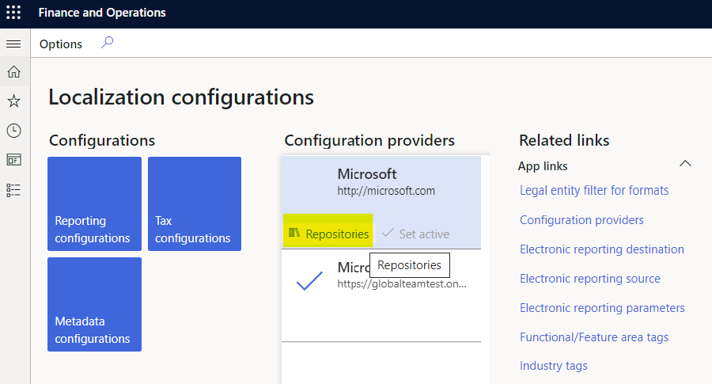

---
# required metadata

title: Set up Electronic invoicing parameters
description: This topic explains how to set up the electronic invoicing parameters.
author: dkalyuzh
ms.date: 12/15/2021
ms.topic: article
ms.prod: 
ms.technology: 

# optional metadata

ms.search.form: 
audience: Application User
# ms.devlang: 
ms.reviewer: kfend
# ms.tgt_pltfrm: 
ms.custom: 
ms.assetid: 
ms.search.region: 
# ms.search.industry: 
ms.author: leguo
ms.search.validFrom: 
ms.dyn365.ops.version: 

---

# Set up Electronic invocing parameters 

[!include [banner](../includes/banner.md)]

The process to submit electronic documents to the Electronic invoicing service requires a message to be generated in your Dynamics 365 Finance or Dynamics 365 Supply Chain management environment in unified structure that corresponds to the structure of Electronic reporting invoice model and metadata, known as context. For more information, see [Electronic invoicing overview](e-invoicing-service-overview.md).

The message is created by Electronic reporting (ER) which makes the structure of the message customizable and flexible. Before you can submit documents to Electronic invoicing and process responses, you must import ER configurations from the Global repository and define them in parameters.

These steps are optional, and aren't required if you set up your connected application directly from RCS by completing the steps in the following topics:
 - [Set up Regulatory configuration services (RCS)](e-invoicing-set-up-rcs.md)
 - [Complete!!:(TBC) Work with Application setup] - note to PM to see about this topic.

To review, adjust, or set up electronic documents directly in your Finance or Supply Chain management environment, complete the following steps.

## Import Electronic reporting (ER) configurations from the Global repository
 1. Sign in to your Finance or Supply Chain management environment and then go to the **Electronic reporting** workspace.
 2. From the list of **Configuration providers**, select the Microsoft configuration provider, and then select **Repositories**.
	
     

 3. Select **Global**, and on the Action Pane, select **Open**.
 4. Import the ER models:
  
    - **Customer invoice context model**
    - **Invoice model**
    - **Fiscal documents** (for Brazilian scenarios, if required)
    - **Response message model***
 
 5. Verify that **Invoice model mapping** and **Fiscal documents mapping** (for Brazilian scenarios, if required) were imported automatically. If they weren't, import them and then close the page.

## Setup Electronic document parameters
 1. Go to **Organization administration** > **Setup** > **Electronic document parameters**.
 2. On the **Electronic document** tab, in the **Electronic reporting** table, select **Add**.
 3. Depending on the scenarios you want to support, enter the following information in the grid and then save the changes.
 
	  | Table name | Document context | Electronic document model mapping | Required for features |
	  |--------------|---------------------|---------------------------|--------------------------------------------------|
	  | CustInvoiceJour|
Mapping name: ***Customer invoice context***

Configuration: ***Customer invoice context model***
|
Mapping name: ***Customer Invoice***

Configuration: ***Invoice model mapping***
|
Austrian electronic invoices (AT)

Belgian electronic invoice (BE)

Danish electronic invoice (DK)

Egyptian electronic invoice (EG)

Estonian electronic invoice (EE)

Finish electronic invoice (FI)

French electronic invoice (FR)

German electronic invoice (DE)

FatturaPA (IT)

Dutch electronic invoice (NL)

Norwegian electronic invoice (NO)

Spanish electronic invoice (ES)

PEPPOL electronic invoice

Saudi Arabian electronic invoice (SA)
|
	  |ProjInvoiceJour|
Mapping name: ***Customer invoice context***

Configuration: ***Customer invoice context model***
|
Mapping name: ***Project Invoice***

Configuration: ***Invoice model mapping***
|
Austrian electronic invoices (AT)

Belgian electronic invoice (BE)

Danish electronic invoice (DK)

Egyptian electronic invoice (EG)

Estonian electronic invoice (EE)

Finish electronic invoice (FI)

French electronic invoice (FR)

German electronic invoice (DE)

FatturaPA (IT)

Dutch electronic invoice (NL)

Norwegian electronic invoice (NO)

Spanish electronic invoice (ES)

PEPPOL electronic invoice

Saudi Arabian electronic invoice (SA)
|
	  |FiscalDocument_BR|
Mapping name: ***Fiscal document context***

Configuration: ***Customer invoice context model***
|
Mapping name: ***Fiscla documents mapping***

Configuration: ***Fiscal documents mapping***
|Brazilian NF-e (BR)|
	  |Correction letter|
Mapping name: ***FD correction letter context***

Configuration: ***Customer invoice context model***
|
Mapping name: ***Correction letter mapping***

Configuration: ***Fiscal documents mapping***
|Brazilian NF-e (BR)|
	  |Service Fiscal document|
Mapping name: ***Fiscal document context***

Configuration: ***Customer invoice context model***
|
Mapping name: ***Fiscla documents mapping***

Configuration: ***Fiscal documents mapping***
|Brazilian NFS-e ABRASF Curitiba (BR)|
  
  If you derive a new configuration from the mentioned one, define the new configuration.
  
  To set up the rules to process responses from the Electronic invoicing service, and update Finance and Supply chain management data as the result of invoices that are processed by the service, set up **Response types**. In most scenarios, this setup is country-specific. Therefore, we recommend that you to follow the country-specific instructions. For more information, see [Country specific scenarios](e-inv_country-specific_availability.md)
 
 To deactivate legacy Electronic reporting functionality for some of the features and activate additional functional capabilities in Finance and Supply Chain management for particular country-specific scenarios, enable the corresponding feature on the **Features** tab of the Electronic document parameters page.
		
  
	
  By enabling the new feature, the legacy functionality will be deactivated for the corresponding Country/regions and Feature name.

  
