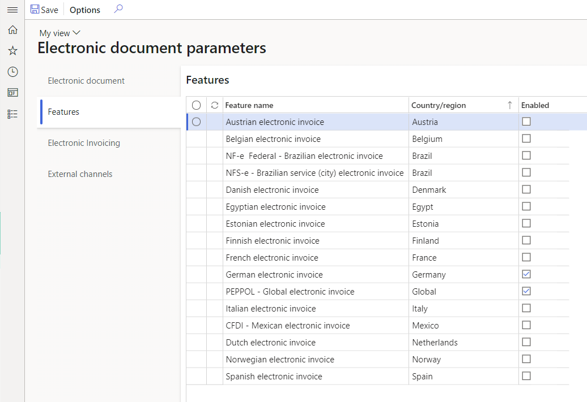

---
# required metadata

title: Setup Electronic Invoicing parameters
description: This topic provides description of the setup of the parameters in Finance and Supply Chain management
author: dkalyuzh
ms.date: 12/15/2021
ms.topic: article
ms.prod: 
ms.technology: 

# optional metadata
---

# Setup Electronic invocing parameters in Finance and Supply Chain management

[!include [banner](../includes/banner.md)]

Submission process of electronic documents to Electronic invoicing service requires generation of the message in your Dynamics 365 Finance and Supply Chain management in unified structure that corresponds to the structure of Electronic reporting Invoice model, and metadata known as Context. See [Electronic invoicing overview](e-inv_overview_electronic-invoicing-overview.md) for more details.

The message is created by Electronic reporting, making the structure of the message customizable and flexible. Before you can submit documents to Electronic invoicing, and process responses, you must import ER configurations from Global repository and define them in parameters.

These steps are optional, and are not required if you setup your connected application directly from RCS by completion of the following instructions:
 - [Setup Regulatory Configuration Services (RCS)](e-inv_tut-setup-electronic-invoicing_setup-RC.md)
 - [Complete!!:(TBC) Work with Application setup]

If you want to review, adjust, or setup from the scratch electronic documents directly in your Finance and Supply Chain management, do the next steps.

## Import Electronic reporting (ER) configurations from Global repository
 1. Sign in to your Finance or Supply Chain management instance.
 2. Select the **Electronic reporting** workspace.
 3. From the list of **Configuration providers**, select Microsoft configuration provider and then select **Repositories**.
	
   

 4. Select **Global** and on Action Pane select **Open**.
 5. Import ER models ***Customer invoice context model***, ***Invoice model***, ***Fiscal documents*** (for Brazilian scenarios, if required), and ***Response message model***.
 6. Check if ***Invoice model mapping*** and ***Fiscal documents mapping*** (for Brazilian scenarios, if required) were not imported automatically, import them.
 7. Close the form 

## Setup Electronic document parameters
 1. Go to **Organization administration** > **Setup** > **Electronic document parameters**.
 2. In the tab **Electronic document** in **Electronic reporting** table select **Add**.
 3. Depending on the scenarios you want to support, enter the following information in the grid and then save the changes.
 
  |Table name|Document context|Electronic document model mapping|Required for features|
  |--------------|---------------------|---------------------------|--------------------------------------------------|
  |CustInvoiceJour|
Mapping name: ***Customer invoice context***

Configuration: ***Customer invoice context model***
|
Mapping name: ***Customer Invoice***

Configuration: ***Invoice model mapping***
|
Austrian electronic invoices (AT)

Belgian electronic invoice (BE)

Danish electronic invoice (DK)

Egyptian electronic invoice (EG)

Estonian electronic invoice (EE)

Finish electronic invoice (FI)

French electronic invoice (FR)

German electronic invoice (DE)

FatturaPA (IT)

Dutch electronic invoice (NL)

Norwegian electronic invoice (NO)

Spanish electronic invoice (ES)

PEPPOL electronic invoice

Saudi Arabian electronic invoice (SA)
|
  |ProjInvoiceJour|
Mapping name: ***Customer invoice context***

Configuration: ***Customer invoice context model***
|
Mapping name: ***Project Invoice***

Configuration: ***Invoice model mapping***
|
Austrian electronic invoices (AT)

Belgian electronic invoice (BE)

Danish electronic invoice (DK)

Egyptian electronic invoice (EG)

Estonian electronic invoice (EE)

Finish electronic invoice (FI)

French electronic invoice (FR)

German electronic invoice (DE)

FatturaPA (IT)

Dutch electronic invoice (NL)

Norwegian electronic invoice (NO)

Spanish electronic invoice (ES)

PEPPOL electronic invoice

Saudi Arabian electronic invoice (SA)
|
  |FiscalDocument_BR|
Mapping name: ***Fiscal document context***

Configuration: ***Customer invoice context model***
|
Mapping name: ***Fiscla documents mapping***

Configuration: ***Fiscal documents mapping***
|Brazilian NF-e (BR)|
  |Correction letter|
Mapping name: ***FD correction letter context***

Configuration: ***Customer invoice context model***
|
Mapping name: ***Correction letter mapping***

Configuration: ***Fiscal documents mapping***
|Brazilian NF-e (BR)|
  |Service Fiscal document|
Mapping name: ***Fiscal document context***

Configuration: ***Customer invoice context model***
|
Mapping name: ***Fiscla documents mapping***

Configuration: ***Fiscal documents mapping***
|Brazilian NFS-e ABRASF Curitiba (BR)|
  
  If you derived a new configuration from the mentioned one, define your configuration.
  
  To setup the rules of processing responses from Electronic invoicing service, and updating Finance and Supply chain management data as the result of invoices processing by the service, you should setup **Response types**. In most scenarios this setup is country specific, thus we recommend you to follow instructions per country specific scenarios: [Country specific scenarios](e-inv_country-specific_availability.md)
  
 >[!NOTES]
 >For more details we recommend you to follow articles describing setup of the country specific parameters: [Country specific scenarios](e-inv_country-specific_availability.md).
 
 To deactivate legacy Electronic reporting functionality for some of the features, as well as activate additional functional capabilities in Finance and Supply Chain management for particular country specific scenarios, enable corresponding feature in **Features** tab:
		
  
	
  This will result in deactivation of legacy hardcoded functionality for the corresponding Country/regions and Feature name.

  
