---
# required metadata

title: Set up the Electronic invoicing add-on
description: This topic explains how to set up the Electronic invoicing add-on in Microsoft Dynamics 365 Finance and Dynamics 365 Supply Chain Management.
author: gionoder
manager: AnnBe
ms.date: 09/22/2020
ms.topic: article
ms.prod: 
ms.service: dynamics-ax-platform
ms.technology: 

# optional metadata

ms.search.form: 
# ROBOTS: 
audience: Application User
# ms.devlang: 
ms.reviewer: kfend
ms.search.scope: Core, Operations
# ms.tgt_pltfrm: 
ms.custom: 97423
ms.assetid: 
ms.search.region: Global
# ms.search.industry: 
ms.author: janeaug
ms.search.validFrom: 2020-07-08
ms.dyn365.ops.version: AX 10.0.12

---

# Set up the Electronic invoicing add-on

[!include [banner](../includes/banner.md)]
[!include [banner](../includes/preview-banner.md)]

Electronic invoicing add-on feature setup is the process of creating the required configuration through the Regulatory Configuration Services (RCS) environment and publishing that configuration to the Electronic invoicing add-on server. The setup lets you create the configurable rules that enable the Electronic invoicing add-on to use a secure protocol over the internet to communicate and exchange data with a third-party entity through web services.

The configurability relies on the Electronic reporting (ER) format configuration as a means to build content that is sent and received through digital files. It also relies on the orchestration of communication actions to send requests to and receive responses from third-party web services without requiring that you write code.

## Overview

"The Electronic invoicing add-on feature" is the generic name for the resource that is configured and published to consume the Electronic invoicing add-on server. The feature setup combines, among other things, the use of ER configuration formats to create configurable export and import files, and the use of actions and actions flows to enable the creation of configurable rules to send requests, import responses, and parse the response contents.

The following illustration shows the main components of an Electronic invoicing add-on feature.

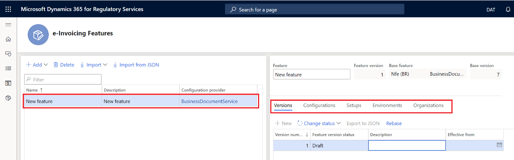

Because of variations in invoice formats and action flows, the feature setup might vary according to country or region, or according to business requirements.

## Set up the Electronic invoicing add-on feature

The setup process must be completed in your RCS environment. Follow these steps to create a new Electronic invoicing add-on feature.

1. Sign in to your RCS environment.
2. In the **Globalization features** workspace, in the **Features** section, select the **Electronic invoicing add-on** tile.
3. On the **Electronic invoicing add-on features** page, select **Import** to import the ER data model configuration from the Global repository.
4. Select **Add** to create an Electronic invoicing add-on feature. You can either create the feature from the scratch or derive it from an existing Electronic invoicing add-on feature.

    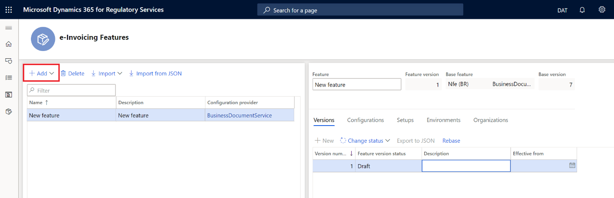

> [!NOTE]
> When you create a new Electronic invoicing add-on feature, it has a version number, and its default status is set to **Draft**.

### Configurations

Configurations hold the ER format configurations that are required for transformations and to create the files that will be exchanged during the communication with third-party web services. An Electronic invoicing add-on feature can have as many ER file format configurations as are required, based on the integration technical specification that is provided by the web service provider.

Follow these steps to add ER formats to the Electronic invoicing add-on feature.

1. On the **Electronic invoicing add-on features** page, on the **Configurations** tab, select **Add** to add ER file format configurations for the Electronic invoicing add-on feature.

    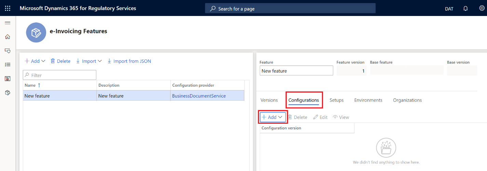

    > [!NOTE]
    > When you create an Electronic invoicing add-on feature from scratch, you must manually add all the ER file format configurations. When you derive an Electronic invoicing add-on feature from an existing feature, the ER file format configurations are automatically created, because they are inherited from the original Electronic invoicing add-on feature.

2. Select **Edit** to open the **Format designer** page, where you can edit the ER file format configuration.

    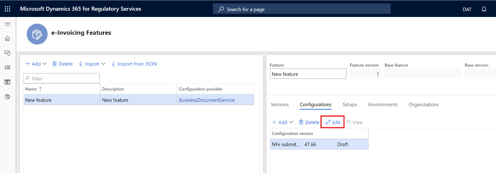

    > [!NOTE]
    > While you're editing the format, the status of the configuration version is set to **Draft**.

3. Use the **Format designer** page to change the file format configuration. For more information, see [Create electronic document configurations](https://docs.microsoft.com/dynamics365/fin-ops-core/dev-itpro/analytics/electronic-reporting-configuration).

    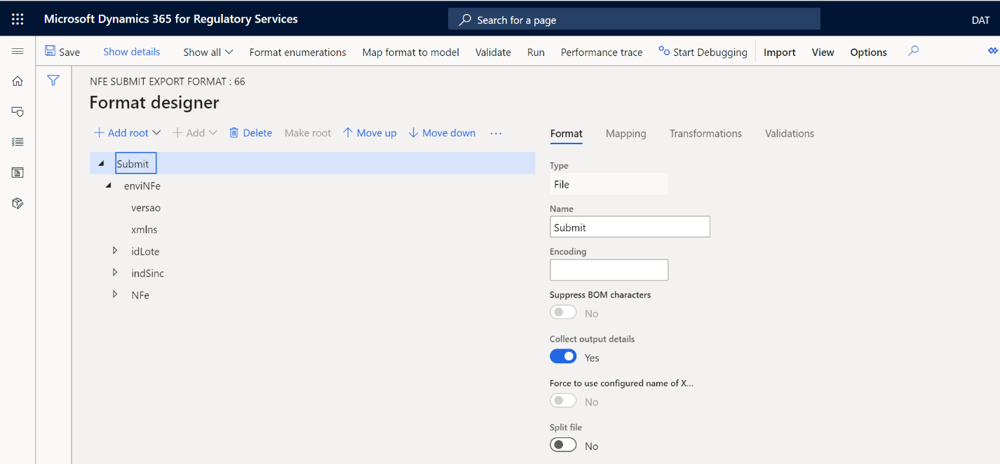

### Feature setups

Feature setups encapsulate the rules for communication and security with a third-party web service. An Electronic invoicing add-on feature can have as many feature setups as are required, based on the business rule that you want to accomplish.

Follow these steps to add feature setups to the Electronic invoicing add-on feature.

1. On the **Electronic invoicing add-on features** page, on the **Setups** tab, select **Add** to add feature setups to the Electronic invoicing add-on feature.

    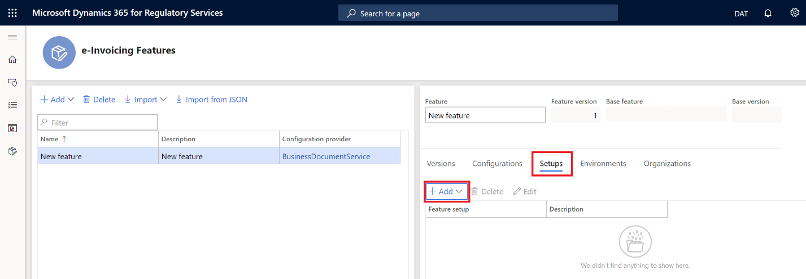

    > [!NOTE]
    > When you create an Electronic invoicing add-on feature from scratch, you must manually add all the feature setups that you require. When you derive an Electronic invoicing add-on feature from an existing feature, all feature setups are automatically created, because they are inherited from the original Electronic invoicing add-on feature.

2. Select **Edit** to edit the feature version setup.

    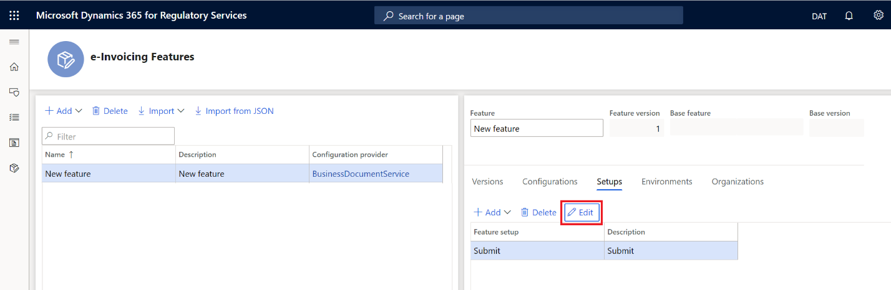

3. Use the **Feature version setup** page to configure actions, applicability rules, and variables.

    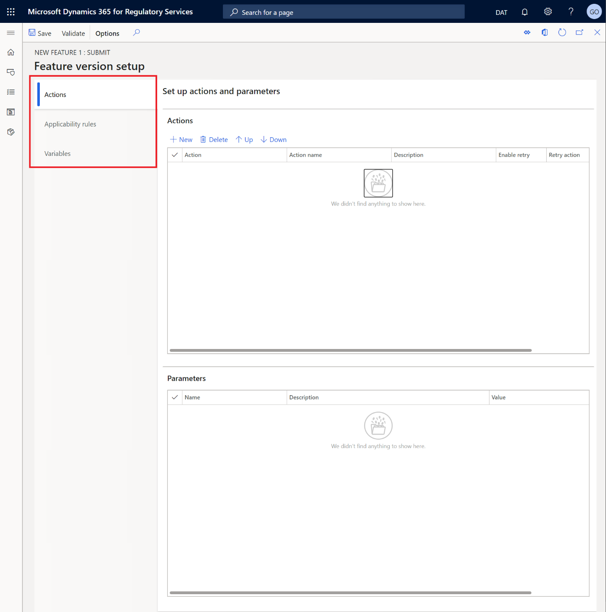

### Actions

Actions are a predefined list of operations that are run in sequential order. This list represents the breakdown of the steps that are required for full execution of the Electronic invoicing add-on feature. The actions can encapsulate, in the same Electronic invoicing add-on feature, communication in both directions: sending a request for a destination, and receiving a response and parsing its contents.

Each action contains a predefined list of parameters that are required for the action to accomplish its purpose. Additional parameters might optionally be provided.

#### Actions FastTab

On the **Feature versions setup** page, on the **Actions** tab, on the **Actions** FastTab, follow one or both of these steps to manage actions:

- Select **New** or **Delete** to add new actions or delete existing actions.
- Select **Up** or **Down** to move selected actions up or down in the grid and therefore change the order that they are run in. Actions are run in the order in which they appear in the grid, from top to bottom.

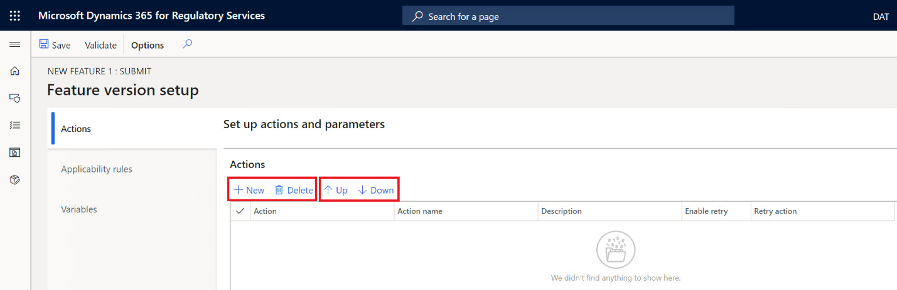

The following table describes the fields that are available on the **Actions** FastTab.

| Field        | Description |
|--------------|-------------|
| Action       | There are eight predefined actions:<ul><li><strong>Sign document</strong></li><li><strong>FileStoreActionName</strong></li><li><strong>Transform document</strong></li><li><strong>Process response</strong></li><li><strong>Call REST web service</strong></li><li><strong>Call Mexican PAC service</strong></li><li><strong>Call Brazilian SEFAZ service</strong></li><li><strong>Call Italian SDI service</strong></li></ul> |
| Action name  | The name of the action and its execution order. |
| Description  | A description of the action. |
| Enable retry | A selected check box indicates that the action can be retried if the previous attempt is unsuccessful. |
| Retry action | In the event of a retry, the action that the retry is started from. The retry then ends on the current action (inclusive retry). For actions that have them, the **Minimum back off** and **Maximum back off** parameters specify the minimum number and maximum number of retries. |

#### Parameters FastTab

The **Parameters** FastTab lists the parameters for the action that is selected on the **Actions** FastTab.

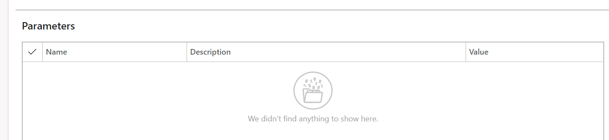

The following table describes the fields that are available on the **Parameters** FastTab.

| Field       | Description |
|-------------|-------------|
| Name        | A predefined list of parameters. For more information, see the [List of parameters by action](#list-of-parameters-by-action) section. |
| Description | A description of the parameter. |
| Value       | The value of the parameter. |

#### List of parameters by action

The available parameters vary, depending on the action that is selected on the **Actions** FastTab.

###### Action: Sign document

| Parameter                             | Description |
|---------------------------------------|-------------|
| Input file                            | The input XML document file that must be signed by using an electronic signature. |
| Certificate name                      | The name of the certificate in storage. |
| Signature type                        | The type of signature to use. |
| Signature method name                 | The name of the signature method that is used to generate an electronic signature. |
| Digest method name                    | The digest method that is used to generate a digest string in the digital signature. |
| Canonicalization method name          | The canonicalization method that is used to calculate the signature hash. |
| Reference attribute name              | The attribute name that indicates where the reference ID should be inserted in the signature element. |
| Name of element to sign               | The name of the XML element in the document that must be signed by using an electronic signature. If no element is specified, the root of the document is signed. |
| Name of element to insert signature   | The name of the XML element where a generated digital signature should be inserted. If no element is specified, the signature is inserted in the root of the document. |
| XLST file with digest transform       | The Extensible Stylesheet Language Transformations (XSLT) file that contains digest transformation rules to generate the digest string for an electronic signature. |
| Path to insert digest string          | The path, in **\<elementName\>.\<Attribute.Path\>** format, of the location where the generated digest string must be inserted. |
| Certificate number location           | The name of the element and attribute where the certificate number should be put. |
| Location of certificate data          | The name of the element and attribute where certificate data (base64) must be inserted. |
| Certificate number is in ASCII format | A value that specifies whether the number of the certificate is encoded in ASCII format. |

###### Action: FileStoreActionName

| Parameter  | Description |
|------------|-------------|
| Input file | The input file to store. |

###### Action: Transform document

| Parameter                       | Description |
|---------------------------------|-------------|
| Input file                      | The source file that provides the data that must be run to the action. |
| Direction                       | A value that indicates whether the import format or the export format should be used. |
| Configuration ID                | The format that should be run. |
| Configuration version           | If no configuration version is specified, the most recent version will be used. |
| Configuration integration point | The source file that provides data to the reporting runtime. |

###### Action: Process response

| Parameter                    | Description |
|------------------------------|-------------|
| Input file                   | The response to analyze. |
| Reporting configuration list | A list of configurations that is used to parse responses. |

###### Action: Call REST web service

| Parameter                   | Description |
|-----------------------------|-------------|
| Web service URL             | The URL to send requests to. |
| Web request timeout         | The maximum amount of time (in milliseconds) to wait for a web service response. |
| Request operation type      | The type of HTTP request operation (for example, **GET**, **POST**, or **DELETE**). |
| Certificate names           | The certificate names. |
| Response body encoding      | The expected encoding of the HTTP response body, so that it can be decoded correctly. |
| HTTP request content type   | The HTTP request content-type header input. |
| HTTP request content body   | The HTTP request body. (The body can be empty.) |
| HTTP parameter query values | Parameter query values that are used to fill the URL with variable parameters. |
| Request route               | The route path for the HTTP request. The variable parameters can be written in **\{paramName\}** notation. Here is an example: **"api/{id}/submit"**. |
| Route parameter list        | The route parameters, in key-value notation, that are used to insert variables into the route. |
| Custom HTTP headers         | The custom HTTP headers to put into the request. |
| HTTP request cookies        | A list of cookies, in key-value notation, to put into the HTTP cookies header request. |
| Security protocol           | The security protocol to use for HTTP requests to communicate with the server. (By default, Transport Layer Security \[TLS\] 1.2 is used.) |

###### Action: Call Mexican PAC service

| Parameter                | Description |
|--------------------------|-------------|
| Input file               | The file that contains XML data that will be sent to the web service as a method input parameter. |
| URL address              | The web service address (endpoint). |
| Web method (action) name | The name of the web method (action) that must be run. |
| Certificates             | The certificate chain that is required for client authentication by the web service. The client certificate should be the last certificate in the chain. The root and intermediate certificates should be first. |
| Web request timeout      | The maximum amount of time (in milliseconds) to wait for a web service response. |
| Retry interval           | The interval between attempts to call and receive a response from the web service. If no interval is specified, no additional retries will be made after the first call is unsuccessful. |
| Retry count              | The maximum number of retry attempts to call and retrieve a response from the web service. |
| Retry till               | The maximum time (in milliseconds) that retry calls can continue. |
| Minimum back off         | The minimum back-off rate for exponential calculation of retry intervals. |
| Maximum back off         | The maximum back-off rate for exponential calculation of retry intervals. |
| Security protocol        | The security protocol to use for HTTP requests to communicate with the server. (By default, TLS 1.2 is used.) |

###### Action: Call Brazilian SEFAZ service

| Parameter                | Description |
|--------------------------|-------------|
| Input file               | The file that contains XML data that will be sent to the web service as a method input parameter. |
| URL address              | The web service address (endpoint). |
| Web method (action) name | The name of the web method (action) that must be run. |
| Certificates             | The certificate chain that is required for client authentication by the web service. The client certificate should be the last certificate in the chain. The root and intermediate certificates should be first. |
| Web request timeout      | The maximum amount of time (in milliseconds) to wait for a web service response. |
| Retry interval           | The interval between attempts to call and receive a response from the web service. If no interval is specified, no additional retries will be made after the first call is unsuccessful. |
| Retry count              | The maximum number of retry attempts to call and retrieve a response from the web service. |
| Retry till               | The maximum time (in milliseconds) that retry calls can continue. |
| Minimum back off         | The minimum back-off rate for exponential calculation of retry intervals. |
| Maximum back off         | The maximum back-off rate for exponential calculation of retry intervals. |
| Security protocol        | The security protocol to use for HTTP requests to communicate with the server. (By default, TLS 1.2 is used.) |

###### Action: Call Italian SDI service

| Parameter                | Description |
|--------------------------|-------------|
| Input file               | The file that contains XML data that will be sent to the web service as a method input parameter. |
| URL address              | The web service address (endpoint). |
| Web method (action) name | The name of the web method (action) that must be run. |
| Certificates             | The certificate chain that is required for client authentication by the web service. The client certificate should be the last certificate in the chain. The root and intermediate certificates should be first. |
| Web request timeout      | The maximum amount of time (in milliseconds) to wait for a web service response. |
| Retry interval           | The interval between attempts to call and receive a response from the web service. If no interval is specified, no additional retries will be made after the first call is unsuccessful. |
| Retry count              | The maximum number of retry attempts to call and retrieve a response from the web service. |
| Retry till               | The maximum time (in milliseconds) that retry calls can continue. |
| Minimum back off         | The minimum back-off rate for exponential calculation of retry intervals. |
| Maximum back off         | The maximum back-off rate for exponential calculation of retry intervals. |
| Security protocol        | The security protocol to use for HTTP requests to communicate with the server. (By default, TLS 1.2 is used.) |

### Applicability rules

Applicability rules let you create logical rules that determine the usage context for the feature setup. Thus, the matching between the context given by the business document that is sent for processing, along with the applicability rule criteria, determine which Electronic invoicing add-on feature is used to process that submission.

#### Set up applicability rules

1. On the **Feature version setup** page, on **Applicability rules** tab, select **New** to add an applicability rule.

    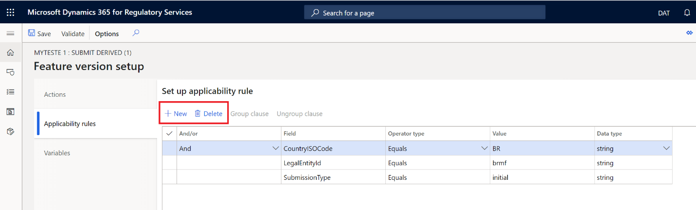

2. In the grid, select the clauses that should be grouped.
3. Select **Group clause**.

    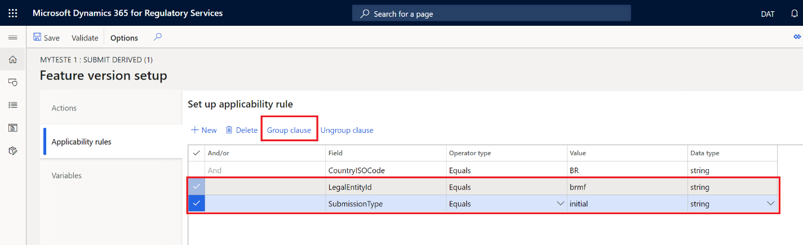

    When clauses are grouped, a new column is added to the grid. This column specifies the logical operator for the grouped clauses.

    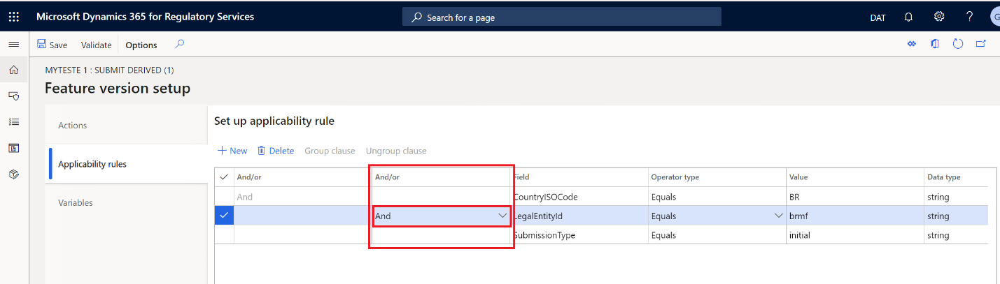

To ungroup clauses, select the grouped clauses to ungroup, and then select **Ungroup clause**.

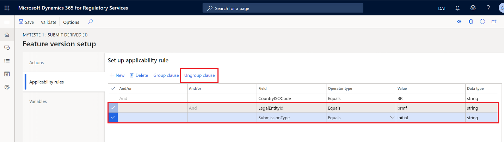

> [!NOTE]
> When you ungroup a clause, always start from the innermost grouping level.

The following table describes the fields that are available on the **Applicability rules** tab.

| Field         | Description |
|---------------|-------------|
| And/or        | The logical operator. |
| Field         | The field to use to construct the rule. |
| Operator type | The type of operator:<ul><li>Equal</li><li>Not equal</li><li>Greater than/Less than</li><li>Greater than or equal to/Less than or equal to</li><li>Contains</li><li>Begin with</li></ul> |
| Value         | The criterion for the rule. |

### Variables

You can create variables and then use them as the input value for a parameter of a specific action. You can also use them to exchange, between the Electronic invoicing add-on services and the client, information that is the result of execution of a specific action as part of the flow of submissions.

#### Set up variables

- On the **Feature version setup** page, on the **Variables** tab, select **New** or **Delete** to manage variables.

    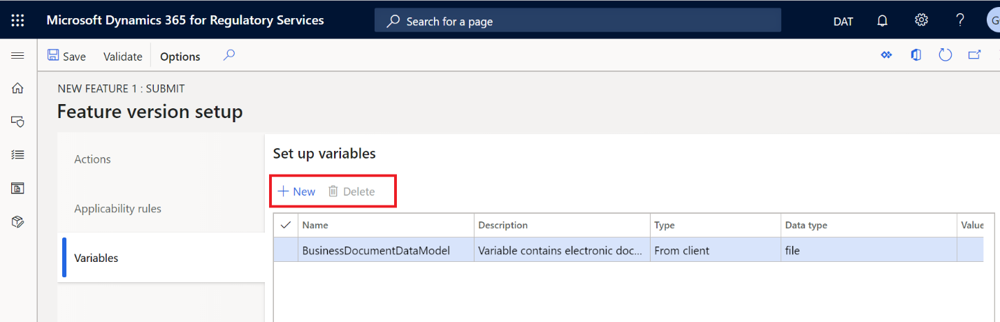

The following table describes the fields that are available on the **Variables** tab.

| Field       | Description |
|-------------|-------------|
| Name        | The name of the variable. |
| Description | A brief description of the variable. |
| Type        | The type of variable:<ul><li><strong>Constant</strong> – The content of the variable is fixed.</li><li><strong>From client</strong> – The content of the variable is acquired from the Microsoft Dynamics 365 client during execution of the submission process.</li><li><strong>To client</strong> – The content of the variable is made available for import by the Microsoft Dynamics 365 client during execution of the submission process.</li></ul> |
| Data type   | The data type of the variable:<ul><li>Boolean</li><li>Date</li><li>Number</li><li>UUID</li><li>String</li><li>File</li></ul> |
| Value       | The value of the variable or the name of the action that sets the value of the variable. |

### Validate the feature setup

- On the **Feature version setup** page, on the Action Pane, select **Validate** to validate the feature version setup.

   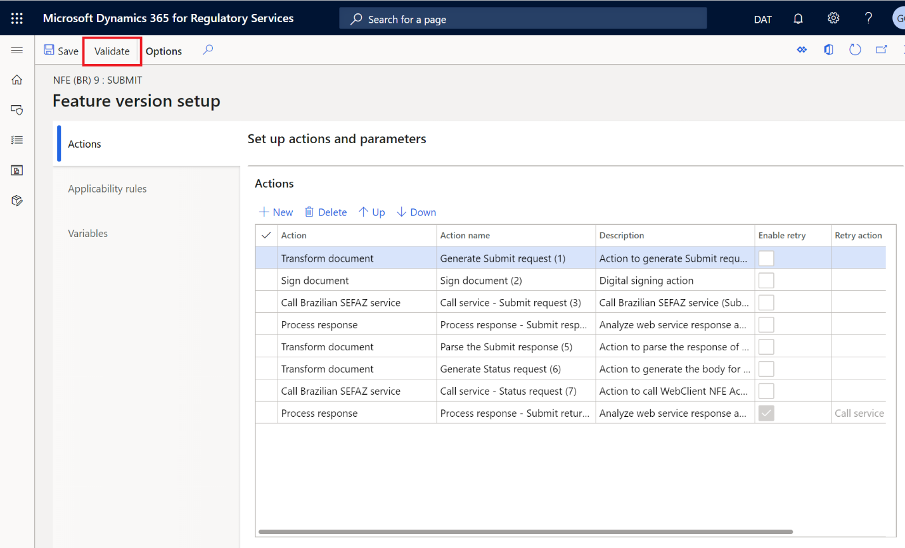

The validation checks the consistency of the whole configuration. For example, if a specific parameter for an action is mandatory but its value remains blank, the validation detects this inconsistency, and you receive a warning.

## Environments

An Electronic invoicing add-on environment must be associated with the Electronic invoicing add-on feature and enabled for it. Electronic invoicing add-on environments must be created and published in advance, through the configuration of Globalization features in your organization's RCS account.

Follow these steps to enable an Electronic invoicing add-on environment for the Electronic invoicing add-on feature.

1. On the **Electronic invoicing add-on features** page, on the **Environments** tab, select **Enable** to add an Electronic invoicing add-on environment.
2. In the **Effective from** field, enter the date when the new environment becomes effective.

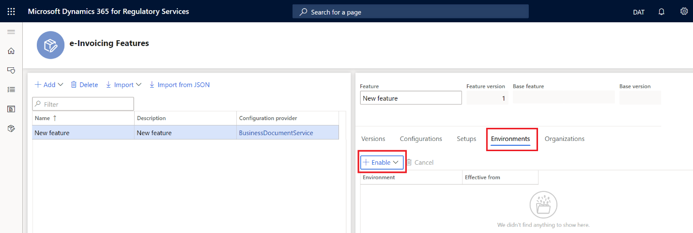

## Organizations

The Electronic invoicing add-on feature can be shared across multiple organizations.

- On the **Electronic invoicing add-on features** page, on the **Organizations** tab, select **Share with** to add the organization that you want to share the Electronic invoicing add-on feature with.

To stop sharing the Electronic invoicing add-on feature with the organization, select **Unshare**.

## Versions

Versions help control the lifecycle of the Electronic invoicing add-on feature by managing its status. You can create a new version of an existing Electronic invoicing add-on feature, or, when all configuration for the Electronic invoicing add-on feature is completed, you can change the feature's status to **Complete** and then to **Publish**.

### Create a new version of an existing Electronic invoicing add-on feature

1. On the **Electronic invoicing add-on features** page, in the grid on the left, select the Electronic invoicing add-on feature.
2. On **Versions** tab, select **New** to add a new version of the Electronic invoicing add-on feature.

### Change the status of the Electronic invoicing add-on feature

Follow these steps to manage the lifecycle of the Electronic invoicing add-on feature.

1. On the **Electronic invoicing add-on features** page, in the grid on the left, select the Electronic invoicing add-on feature.
2. On **Versions** tab, select **Change status**, and then change the status from **Draft** to **Complete**.
3. You're prompted to confirm that you want to complete the Electronic invoicing add-on feature and all its components. Select **Yes** to confirm the action or **No** to cancel it.

    > [!NOTE]
    > When you select **Yes**, the status of configuration versions, which are components of the Electronic invoicing add-on feature, is automatically changed from **Draft** to **Completed**.

4. Select **Change status**, and then change the status from **Complete** to **Publish**.
5. You're prompted to confirm that you want to publish the Electronic invoicing add-on feature and all its components to the Global repository. Select **Yes** to confirm the action or **No** to cancel it.

    > [!NOTE]
    > When you select **Yes**, the status of configuration versions is automatically changed from **Completed** to **Shared**.
