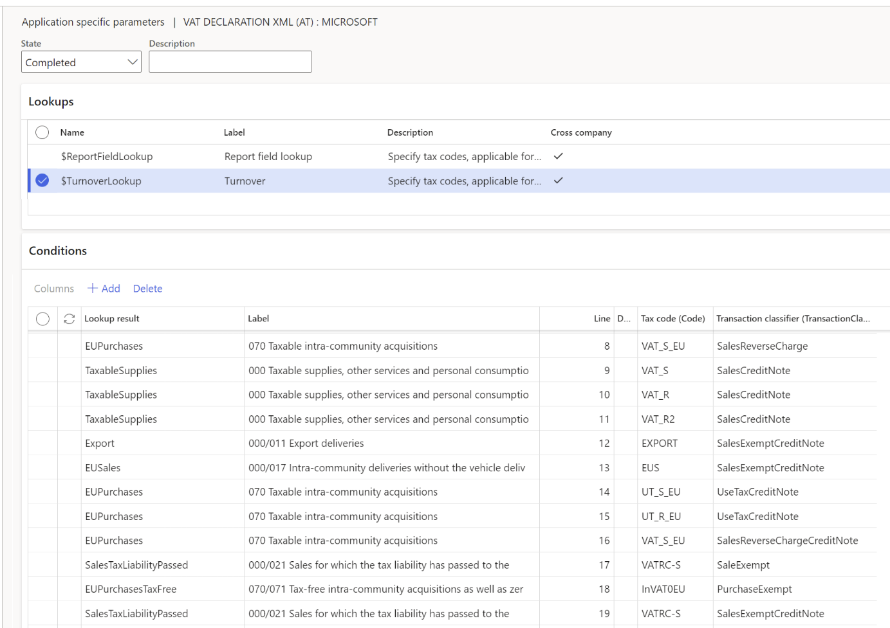
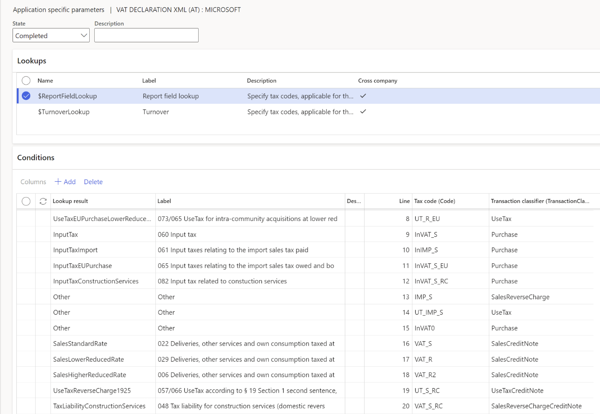

# VAT declaration (Austria)

[!include[banner](../includes/banner.md)]

This article describes how to set up and generate an advance value-added tax (VAT) declaration U30 for Austria in the official XML format. It also describes how to preview the VAT declaration in Microsoft Excel.

To automatically generate the report, you must first create enough sales tax codes to keep a separate VAT accounting for each box on the VAT declaration. Additionally, in the application-specific parameters of the Electronic reporting (ER) format for the VAT declaration, you must associate sales tax codes with the lookup result of the lookups for the boxes on the VAT declaration.

For Austria, you must configure two lookups: **Turnover lookup** and **Report field lookup**. For more information about how to set up application-specific parameters, see the [Set up application-specific parameters for VAT declaration fields](#set-up-application-specific-parameters-for-vat-declaration-fields) section later in this article.

In the following table, the "Lookup result" column shows the lookup result that is preconfigured for a specific VAT declaration row in the VAT declaration format. Use this information to correctly associate sales tax codes with the lookup result and then with the row of the VAT declaration.

## VAT declaration overview

The VAT declaration in Austria contains the following information.

### SECTION 4 – CALCULATION OF SALES TAX

**Deliveries, other services and own consumption**

| Box | XML element | Description                                                                                                                                                             | Lookup          | Lookup result                                                                                                                                                                                                                                         |
|-----|-------------|-------------------------------------------------------------------------------------------------------------------------------------------------------------------------|-----------------|-------------------------------------------------------------------------------------------------------------------------------------------------------------------------------------------------------------------------------------------------------|
| 000 | KZ000       | Total amount of the assessment basis for deliveries and other services (excluding the self-consumption listed below) including down payments (each excluding sales tax) | Turnover lookup | TaxableSupplies (000) SalesTaxLiabilityPassed (000/021) Export (000/011) Subcontracting (000/012) ShippingAviationEtc (000/015) EUSales (000/017) EUSalesNewVehicles (000/018) RealEstateSales (000/019) SmallBusiness (000/016) OtherSales (000/020) |
| 001 | KZ001       | plus self-consumption                                                                                                                                                   | Turnover lookup | SelfConsumption (001)                                                                                                                                                                                                                                 |
| 021 | KZ021       | less sales for which the tax liability has passed to the recipient of the service                                                                                       | Turnover lookup | SalesTaxLiabilityPassed (000/021)                                                                                                                                                                                                                     |
| \-  | \-          | **TOTAL**                                                                                                                                                               | **-**           | **KZ000 + KZ001 – KZ021**                                                                                                                                                                                                                             |

**Tax-free deliveries WITH input tax deduction or zero rate**

| Box | XML element | Description                                                                                                                                                                                           | Lookup          | Lookup result                 |
|-----|-------------|-------------------------------------------------------------------------------------------------------------------------------------------------------------------------------------------------------|-----------------|-------------------------------|
| 011 | KZ011       | Export deliveries                                                                                                                                                                                     | Turnover lookup | Export (000/011)              |
| 012 | KZ012       | Subcontracting                                                                                                                                                                                        | Turnover lookup | Subcontracting (000/012)      |
| 015 | KZ015       | Shipping, aviation, cross-border passenger transport, diplomats, advance travel services in other countries/regions, etc. And zero rate delivery of protective masks from April 14, 2020 to July 31, 2020 | Turnover lookup | ShippingAviationEtc (000/015) |
| 017 | KZ017       | Intra-community deliveries without the vehicle deliveries to be listed separately below                                                                                                               | Turnover lookup | EUSales (000/017)             |
| 018 | KZ018       | Provided deliveries of new vehicles to buyers without a VAT number or by vehicle suppliers in accordance with Art. 2                                                                                  | Turnover lookup | EUSalesNewVehicles (000/018)  |

**Tax-free deliveries WITHOUT input tax deduction**

| Box | XML element | Description                                                                                                     | Lookup          | Lookup result                                                                       |
|-----|-------------|-----------------------------------------------------------------------------------------------------------------|-----------------|-------------------------------------------------------------------------------------|
| 019 | KZ019       | Real estate sales                                                                                               | Turnover lookup | RealEstateSales (000/019)                                                           |
| 016 | KZ016       | Small business owner                                                                                            | Turnover lookup | SmallBusiness (000/016)                                                             |
| 020 | KZ020       | Other tax-free sales without input tax deduction                                                                | Turnover lookup | OtherSales (000/020)                                                                |
| \-  | \-          | **Total amount** of taxable supplies, other services and personal consumption (including taxable down payments) | \-              | **[KZ000 + KZ001 – KZ021] – KZ011 – KZ015 – KZ017 – KZ018 – KZ019 – KZ016 – KZ020** |

**Taxable deliveries**

| Box | XML element | Description                                                                                                                                                                                                                     | Tax base/Tax amount | Lookup              | Lookup result                                                               |
|-----|-------------|---------------------------------------------------------------------------------------------------------------------------------------------------------------------------------------------------------------------------------|---------------------|---------------------|-----------------------------------------------------------------------------|
| 022 | KZ022       | 20% normal tax rate                                                                                                                                                                                                             | Tax base            | Report field lookup | SalesStandardRate (022)                                                     |
| 029 | KZ029       | 10% reduced tax rate                                                                                                                                                                                                            | Tax base            | Report field lookup | SalesLowerReducedRate (029)                                                 |
| 006 | KZ006       | 13% reduced tax rate                                                                                                                                                                                                            | Tax base            | Report field lookup | SalesHigherReducedRate (006)                                                |
| 037 | KZ037       | 19% for Jungholz und Mittelberg                                                                                                                                                                                                 | Tax base            | Report field lookup | SalesSomeTerritories (037)                                                  |
| 052 | KZ052       | 10% flat-rate tax for agricultural and forestry operations                                                                                                                                                                      | Tax base            | Report field lookup | SalesFlatRateHigher (052)                                                   |
| 007 | KZ007       | 7% flat-rate tax for agricultural and forestry operations                                                                                                                                                                       | Tax base            | Report field lookup | SalesFlatRateLower (007)                                                    |
| 009 | KZ009       | 5% for sales according to § 28 Section 52 Z 1 from 1.7.2020 to 31.12.2020                                                                                                                                                       | Tax base            | Report field lookup | SalesSuperReduced (009)                                                     |
| 056 | KZ056       | Tax liability according to § 11 Sections 12 and 14, § 16 Section 2 as well as according to Art. 7 Section 4                                                                                                                     | Tax amount          | Report field lookup | TaxLiabilityReverseCharge1116 (056) UseTaxReverseCharge1116 (056/060)       |
| 057 | KZ057       | Tax liability according to § 19 Section 1 second sentence, § 19 Section 1c, 1e as well as according to § 25 Section 5                                                                                                           | Tax amount          | Report field lookup | TaxLiabilityReverseCharge1925 (057) UseTaxReverseCharge1925 (057/066)       |
| 048 | KZ048       | Construction services                                                                                                                                                                                                           | Tax amount          | Report field lookup | TaxLiabilityConstructionServices (048) UseTaxConstructionServices (048/082) |
| 044 | KZ044       | Security property, conditional property and land in foreclosure proceedings                                                                                                                                                     | Tax amount          | Report field lookup | TaxLiabilitySecurityPropertyEtc (044) UseTaxSecurityPropertyEtc (044/087)   |
| 032 | KZ032       | Scrap and waste materials, regulation BGBl. II No. 129/2007; video game consoles, laptops, tablet computers, gas and electricity, gas and electricity certificates, metals, investment gold, regulation BGBl. II No. 369 / 2013 | Tax amount          | Report field lookup | TaxLiabilityScrapLaptopGasEtc (032) UseTaxScrapLaptopGasEtc (032/089)       |

**Intra-community acquisitions**

| Box | XML element | Description                                                   | Lookup          | Lookup result                                  |
|-----|-------------|---------------------------------------------------------------|-----------------|------------------------------------------------|
| 070 | KZ070       | Total amount of the tax base for intra-community acquisitions | Turnover lookup | EUPurchases (070) EUPurchasesTaxFree (070/071) |
| 071 | KZ071       | Tax free and zero rated intra-community acquisitions          | Turnover lookup | EUPurchasesTaxFree (070/071)                   |
| \-  | \-          | **Total amount of taxable intra-community acquisitions**      | \-              | **KZ070 – KZ071**                              |

**Taxable Intra-community acquisitions**

| Box | XML element | Description                                                                                | Lookup              | Lookup result                                                                                                                                                 |
|-----|-------------|--------------------------------------------------------------------------------------------|---------------------|---------------------------------------------------------------------------------------------------------------------------------------------------------------|
| 072 | KZ072       | 20% Normal tax rate                                                                        | Report field lookup | TaxLiabilityEUPurchaseStandardRate (072) UseTaxEUPurchaseStandardRate (072/065) TaxLiabilityEUPurchaseNewVehicles (072) UseTaxEUPurchaseNewVehicles (072/064) |
| 073 | KZ073       | 10% reduced tax rate                                                                       | Report field lookup | TaxLiabilityEUPurchaseLowerReducedRate (073) UseTaxEUPurchaseLowerReducedRate (073/065)                                                                       |
| 008 | KZ008       | 13% reduced tax rate                                                                       | Report field lookup | TaxLiabilityEUPurchaseHigherReducedRate (008)  UseTaxEUPurchaseHigherReducedRate (008/065)                                                                     |
| 088 | KZ088       | 19% for Jungholz and Mittelberg                                                            | Report field lookup | TaxLiabilityEUPurchaseSomeTerritories (088) UseTaxEUPurchaseSomeTerritories (088/065)                                                                         |
| 010 | KZ010       | 5% for sales in accordance with § 28 Section 52 Z 1 from July 1, 2020 to December 31, 2020 | Report field lookup | TaxLiabilityEUPurchaseSuperReducedRate (010) UseTaxEUPurchaseSuperReducedRate (010/065)                                                                       |

**Non-taxable Intra-community acquisitions**

| Box | XML element | Description                                                                                                                                           | Lookup          | Lookup result                     |
|-----|-------------|-------------------------------------------------------------------------------------------------------------------------------------------------------|-----------------|-----------------------------------|
| 076 | KZ076       | Total amount of the tax base for intra-community acquisitions                                                                                         | Turnover lookup | EUPurchasesNonTaxable (076)       |
| 077 | KZ077       | Acquisitions in accordance with Art. 3 Paragraph 8, second sentence, which are deemed to be taxed domestically in accordance with Art. 25 Paragraph 2 | Turnover lookup | EUPurchaseTaxedDomestically (077) |

### SECTION 5 – CALCULATION OF THE DEDUCTIBLE INPUT TAX

| Box | XML element | Description                                                                                                                                                               | Lookup              | Lookup result                                                                                                                                                                                                                               |
|-----|-------------|---------------------------------------------------------------------------------------------------------------------------------------------------------------------------|---------------------|---------------------------------------------------------------------------------------------------------------------------------------------------------------------------------------------------------------------------------------------|
| 060 | KZ060       | Total contribution of the input tax (without the following related expenses)                                                                                              | Report field lookup | InputTax (060)  UseTaxReverseCharge1116 (056/060)                                                                                                                                                                                            |
| 061 | KZ061       | Input taxes relating to the import sales tax paid                                                                                                                         | Report field lookup | InputTaxImport (061)                                                                                                                                                                                                                        |
| 083 | KZ083       | Input taxes relating to the import sales tax owed and booked on the tax account                                                                                           | Report field lookup | InputTaxImportTaxAccount (083)                                                                                                                                                                                                              |
| 065 | KZ065       | Input taxes from intra-community acquisitions                                                                                                                             | Report field lookup | InputTaxEUPurchase (065) UseTaxEUPurchaseSuperReducedRate (010/065) UseTaxEUPurchaseSomeTerritories (088/065) UseTaxEUPurchaseHigherReducedRate (008/065) UseTaxEUPurchaseLowerReducedRate (073/065) UseTaxEUPurchaseStandardRate (072/065) |
| 066 | KZ066       | Input tax related to the tax liability according to § 19 Section 1 second sentence, § 19 Section 1c, 1e as well as according to Art. 25 Section 5                         | Report field lookup | InputTaxReverseCharge1925 (066) UseTaxReverseCharge1925 (057/066)                                                                                                                                                                           |
| 082 | KZ082       | Input taxes on construction services                                                                                                                                      | Report field lookup | InputTaxConstructionServices (082) UseTaxConstructionServices (048/082)                                                                                                                                                                     |
| 087 | KZ087       | Input taxes on security property, conditional property and land in foreclosure proceedings                                                                                | Report field lookup | InputTaxSecurityPropertyEtc (087) UseTaxSecurityPropertyEtc (044/087)                                                                                                                                                                       |
| 089 | KZ089       | Input taxes on scrap and waste materials, video game consoles, laptops, tablet computers, gas and electricity, gas and electricity certificates, metals, investment gold) | Report field lookup | InputTaxScrapLaptopGasEtc (089) UseTaxScrapLaptopGasEtc (032/089)                                                                                                                                                                           |
| 064 | KZ064       | Input tax for intra-community deliveries of new vehicles from vehicle suppliers                                                                                           | Report field lookup | InputTaxEUPurchaseNewVehicles (064) UseTaxEUPurchaseNewVehicles (072/064)                                                                                                                                                                   |
| 062 | KZ062       | Not deductible input tax in accordance with § 12 Section 3 in conjunction with Sections 4 and 5                                                                           | Report field lookup | InputTaxNotDeductible (062)                                                                                                                                                                                                                 |
| 063 | KZ063       | Correction in accordance with § 12, Sections 10 and 11                                                                                                                    | Report field lookup | InputTaxCorrection12-10-11 (063)                                                                                                                                                                                                            |
| 067 | KZ067       | Correction in accordance with § 16                                                                                                                                        | Report field lookup | InputTaxCorrection16 (067)                                                                                                                                                                                                                  |
| \-  | \-          | **Total amount of deductible input tax**                                                                                                                                  | \-                  | **KZ060 + KZ061 + KZ083 + KZ065 + KZ066 + KZ082 + KZ087 + KZ089 + KZ064 – KZ062 – KZ063 - KZ067**                                                                                                                                           |
| 090 | KZ090       | Other corrections                                                                                                                                                         | Report field lookup | OtherCorrections (090)                                                                                                                                                                                                                      |
| \-  | \-          | **Advance payment / surplus**                                                                                                                                             | \-                  | **022.Tax + 029.Tax + 006.Tax + 037.Tax + 052.Tax + 007.Tax + 009.Tax + KZ056 + KZ057 + KZ048 + KZ044 + KZ032 + 072.Tax + 073.Tax + 008.Tax + 088.Tax + 010.Tax – [Total amount of deductible input tax] + KZ090**                          |

## Purchase reverse charge VAT

If you configure sales tax codes to post incoming acquisition tax (reverse charge VAT) by using use tax, associate your sales tax codes with the lookup result of **Report field lookup** that contains "UseTax" in the name.

Alternatively, you can configure two separate sales tax codes: one for VAT due and one for VAT deduction. Then associate each code with the corresponding lookup results of **Report field lookup**.

For example, for intra-community acquisitions at a normal rate, you configure sales tax code **UT_S_EU** with use tax, and associate it with the **UseTaxEUPurchaseStandardRate** lookup result of **Report field lookup**. In this case, amounts that use the **UT_S_EU** sales tax code are reflected in boxes 072 and 065.

Alternatively, you configure two sales tax codes:

   - **VAT_S_EU**, which has a tax rate value of -20 percent
   - **InVAT_S_EU**, which has a tax rate value of 20 percent

You then associate the codes with lookup results in the following way:

   - Associate **VAT_S_EU** with the **TaxLiabilityEUPurchaseStandardRate** lookup result of **Report field lookup**.
   - Associate **InVAT_S_EU** with the **InputTaxEUPurchase** lookup result of **Report field lookup**.

In this case, amounts that use the **VAT_S_EU** sales tax code are reflected in box 072. Amounts that use the **InVAT_S_EU** sales tax code are reflected in box 065.

For more information about how to configure reverse charge VAT, see [Reverse charges](emea-reverse-charge.md).

## Configure system parameters

To generate a VAT declaration, you must configure the VAT number of your organization.

1. Go to **Organization administration** > **Organizations** > **Legal entities**.
2. Select the legal entity, and then select **Registration IDs**.
3. Select or create the address in Austria, and then, on the **Registration ID** FastTab, select **Add**.
4. In the **Registration type** field, select the registration type that is dedicated to Austria, and that uses the **VAT ID** registration category.
5. In the **Registration number** field, enter the VAT number.
6. On the **General** tab, in the **Effective** field, enter the date when the number becomes effective.

For more information about how to set up registration categories and registration types, see [Registration IDs](emea-registration-ids.md).

## Set up a VAT declaration for Austria

### Import ER configurations

Open the **Electronic reporting** workspace, and import the following versions or later of these ER formats:

- VAT Declaration XML (AT) version 101.23
- VAT Declaration Excel (AT) version 101.23.17

### Set up application-specific parameters for VAT declaration fields

To automatically generate a VAT declaration, associate sales tax codes in the application and lookup results in the ER configuration.

> [!NOTE]
> We recommend that you enable the feature, **Use application specific parameters from previous versions of ER formats** in the **Feature management** workspace. When this feature is enabled, parameters that are configured for the earlier version of an ER format automatically become applicable for the later version of the same format. If this feature isn't enabled, you must configure application-specific parameters explicitly for each format version. The **Use application specific parameters from previous versions of ER formats** feature is available in the **Feature management** workspace starting in Finance version 10.0.23. For more information about how to set up the parameters of an ER format for each legal entity, see [Set up the parameters of an ER format per legal entity](../../fin-ops-core/dev-itpro/analytics/er-app-specific-parameters-set-up.md).

#### Set up Turnover lookup

Follow these steps to define which sales tax codes generate which boxes in the following subsections of section 4, "Calculation of sales tax":

- Deliveries, other services and own consumption
- Tax-free deliveries WITH input tax deduction or zero rate
- Tax-free deliveries WITHOUT input tax deduction
- Intra-community acquisitions
- Non-taxable Intra-community acquisitions

1. Go to **Workspaces** > **Electronic reporting**, and select **Reporting configurations**.
2. Select the **VAT declaration XML (AT)** configuration, and then select **Configurations** > **Application specific parameters setup**.
3. On the **Application specific parameters** page, on the **Lookups** FastTab, select **Turnover lookup**.
4. On the **Conditions** FastTab, set the following fields to associate the sales tax codes and operations.

<table>
<tbody>
<tr>
<td>

<strong>Field</strong>

</td>
<td>

<strong>Description</strong>

</td>
</tr>
<tr>
<td>

Lookup result

</td>
<td>

Select the value of the turnover. For more information about the turnover values and their assignment to VAT declaration rows, see the <a href="#VAT_declaration_overview_1">VAT declaration overview</a> section earlier in this article.

</td>
</tr>
<tr>
<td>

Tax code

</td>
<td>

Select the sales tax code to associate with the operation. Posted tax transactions that use the selected sales tax code will be collected in the appropriate declaration box.

We recommend that you separate sales tax codes in such a way that one sales tax code generates amounts in only one declaration box.

</td>
</tr>
<tr>
<td>

Transaction classifier

</td>
<td>

If you created enough sales tax codes to determine a declaration box, select <strong>*Not blank*</strong>.

If you didn't create enough sales tax codes so that one sales tax code generates amounts in only one declaration box, you can set up a transaction classifier. The following transaction classifiers are available:

&middot;&nbsp;&nbsp;&nbsp;&nbsp;&nbsp;&nbsp;&nbsp; <strong>Purchase</strong>

&middot;&nbsp;&nbsp;&nbsp;&nbsp;&nbsp;&nbsp;&nbsp; <strong>PurchaseExempt</strong> (tax-exempt purchase)

&middot;&nbsp;&nbsp;&nbsp;&nbsp;&nbsp;&nbsp;&nbsp; <strong>PurchaseReverseCharge</strong> (tax receivable from a purchase reverse charge)

&middot;&nbsp;&nbsp;&nbsp;&nbsp;&nbsp;&nbsp;&nbsp; <strong>Sales</strong>

&middot;&nbsp;&nbsp;&nbsp;&nbsp;&nbsp;&nbsp;&nbsp; <strong>SalesExempt</strong> (tax-exempt sale)

&middot;&nbsp;&nbsp;&nbsp;&nbsp;&nbsp;&nbsp;&nbsp; <strong>SalesReverseCharge</strong> (tax payable from a purchase reverse charge or a sales reverse charge)

&middot;&nbsp;&nbsp;&nbsp;&nbsp;&nbsp;&nbsp;&nbsp; <strong>Use tax</strong>

For each transaction classifier, a classifier for the credit note is also available. For example, one of these classifiers is <strong>PurchaseCreditNote</strong> (purchase credit note).

</td>
</tr>
</tbody>
</table>

> [!NOTE]
> Be sure to associate all sales tax codes with lookup results. If any sales tax codes should not generate values in the previously mentioned subsections of section 4, associate them with the **Other** lookup result.

### Set up the Report field lookup

Follow these steps to define which sales tax codes generate which boxes in the following subsections of section 4, "Calculation of sales tax," and in section 5, "Calculation of the deductible input tax":

- Taxable deliveries
- Taxable Intra-community acquisitions

1. On the **Application specific parameters** page, on the **Lookups** FastTab, select **Report field lookup**.
2. On the **Conditions** FastTab, associate the sales tax codes and report fields.

    > [!NOTE]
    > Be sure to associate all sales tax codes with lookup results. If any sales tax codes should not generate values in the previously mentioned subsections of section 4, or in section 5, associate them with the **Other** lookup result.
    > 
    > 

3. In the **State** field, change the value to **Completed**.
4. On the Action Pane, select **Export** to export the settings of the application-specific parameters.
5. Select the **VAT declaration Excel (AT)** configuration, and then, on the Action Pane, select **Import** to import the parameters that you configured for **VAT declaration XML (AT)**.
6. In the **State** field, select **Completed**.

### Set up the VAT reporting format for preview amounts in Excel

1. In the **Feature management** workspace, enable the **VAT statement format reports** feature.
2. Go to **General ledger** > **Setup** > **General ledger parameters**.
3. On the **Sales tax** tab, on the **Tax options** FastTab, in the **VAT statement format mapping** field, select the **VAT declaration Excel (AT)** ER format.

    This format will be printed when you run the **Report sales tax for settlement period** report. It will also be printed when you select **Print** on the **Sales tax payments** page.

4. If you must report the corrections, on the **Special report** section, set **Include corrections** to **Yes**.
5. On the **Tax authorities** page, select the tax authority, and in the **Report layout** field, select **Default**.

If you're configuring the VAT declaration in a legal entity that has [multiple VAT registrations](emea-reporting-for-multiple-vat-registrations.md), follow these steps.

1. Go to **General ledger** > **Setup** > **General ledger parameters**.
2. On the **Sales tax** tab, on the **Electronic reporting for countries/regions** FastTab, on the line for **AUT**, select the **VAT Declaration Excel (AT)** ER format.

## Set up electronic messages

### Download and import the data package that has example settings for electronic messages

The data package contains electronic message settings to generate the VAT declaration in XML format and preview it in Excel. You can extend these settings or create your own. For more information about how to work with electronic messaging and create your own settings, see [Electronic messaging](../general-ledger/electronic-messaging.md).

1. In [LCS](https://lcs.dynamics.com/v2), in the Shared asset library, select **Data package** as the asset type, and then download **AT VAT declaration EM package**. The downloaded file is named **AT VAT declaration EM package.zip**.
2. In Dynamics 365 Finance, in the **Data management** workspace, select **Import**.
3. On the **Import** FastTab, in the **Group name** field, enter a name for the job.
4. On the **Selected entities** FastTab, select **Add file**.
5. In **Add file** dialog box, verify that the **Source data format** field is set to **Package**, select **Upload and add**, and then select the zip file that you downloaded earlier.
6. Select **Close**.
7. After the data entities are uploaded, on the Action Pane, select **Import**.
8. Go to **Tax** > **Inquiries and reports** > **Electronic messages** > **Electronic messages**, and validate the electronic message processing that you imported (**AT VAT declaration**).

### Configure electronic messages

1. Go to **Tax** > **Setup** > **Electronic messages** > **Populate records actions**.
2. Select the line for **AT Populate VAT return records**, and then select **Edit query**.
3. Use the filter to specify the settlement periods to include on the report.
4. If you must report tax transactions from other settlement periods in a different declaration, create a new **Populate records** action, and select the appropriate settlement periods.

## Preview the VAT declaration in Excel

### Preview the VAT declaration in Excel from the Report sales tax for settlement period periodic task

1. Go to **Tax** > **Periodic tasks** > **Declarations** > **Sales tax** > **Report sales tax for settlement period**.

2.  Set the following fields.

    | Field                     | Description                                    |
    |---------------------------|------------------------------------------------|
    | Settlement period         | Select the settlement period.                  |
    | Sales tax payment version | Select one of the following values:            |
    | From date                 | Select the start date of the reporting period. |

    - **Original**: Generate a report for the sales tax transactions of the original sales tax payment or before the sales tax payment is generated.
    - **Corrections**: Generate a report for the sales tax transactions of all the subsequent sales tax payments for the period.
    - **Total list**: Generate a report for all the sales tax transactions for the period, including the original and all corrections.

3. Select **OK**, and review the Excel report.

### Settle and post sales tax

1. Go to **Tax \> Periodic tasks \> Declarations \> Sales tax \> Settle and post sales tax**.
2. Set the following fields.

    | Field                     | Description                                    |
    |---------------------------|------------------------------------------------|
    | Settlement period         | Select the settlement period.                  |
    | Sales tax payment version | Select one of the following values:            |
    | From date                 | Select the start date of the reporting period. |

    - **Original**: Generate the original sales tax payment for the settlement period.
    - **Latest corrections**: Generate a correction sales tax payment after the original sales tax payment for the settlement period was created.

3. Select **OK**.

### Preview the VAT declaration in Excel from a sales tax payment

1. Go to **Tax** > **Inquiries and reports** > **Sales tax inquiries** > **Sales tax payments**, and select a sales tax payment line.
2. Select **Print report**. Select **OK** and review the Excel file that is generated for the selected sales tax payment line.

    > [!NOTE]
    > The report is generated only for the selected line of the sales tax payment. If you must generate, for example, a corrective declaration that contains all corrections for the period, or a replacement declaration that contains original data and all corrections, use the **Report sales tax for settlement period** periodic task.

## Generate a VAT declaration from electronic messages

When you use electronic messages to generate the report, you can collect tax data from multiple legal entities. For more information, see the [Run a VAT declaration for multiple legal entities](#run-a-vat-declaration-for-multiple-legal-entities) section later in this article.

The following procedure applies to the example electronic message processing that you imported earlier from the LCS Shared asset library.

1. Go to **Tax** > **Inquiries and reports** > **Electronic messages** > **Electronic messages**.
2. In the left pane, select **AT VAT declaration**.
3. On the **Messages** FastTab, select **New**, and then, in the **Run processing** dialog box, select **OK**.
4. Select the message line that is created, enter a description, and then specify the start and end dates for the declaration.

    > [!NOTE]
    > Steps 5 through 7 are optional.

5. Optional: On the **Messages** FastTab, select **Collect data**, and then select **OK**. The sales tax payments that were generated earlier are added to the message. For more information, see the [Settle and post sales tax](#settle-and-post-sales-tax) section earlier in this article. If you skip this step, you can still generate a VAT declaration by using the **Tax declaration version** field in the **Declaration** dialog box.
6. Optional: On the **Message items** FastTab, review the sales tax payments that are transferred for processing. By default, all sales tax payments of the selected period that weren't included in any other message of the same processing are included.
7. Optional: Select **Original document** to review the sales tax payments, or select **Delete** to exclude sales tax payments from processing. If you skip this step, you can still generate a VAT declaration by using the **Tax declaration version** field in the **Declaration** dialog box.
8. On the **Messages** FastTab, select **Update status**. In the **Update status** dialog box, select **Ready to generate**, and then select **OK**. Verify that the message status is changed to **Ready to generate**.
9. Select **Generate report**. To preview the VAT declaration amounts, in the **Run processing** dialog box, select **Preview report**, and then select **OK**.
10. In the **Electronic reporting parameters** dialog box, set the following fields, and then select **OK**.

    | **Field**               | **Description**                                                                                                                                                                                                            |
    |-------------------------|----------------------------------------------------------------------------------------------------------------------------------------------------------------------------------------------------------------------------|
    | Settlement period       | Select the settlement period. If you selected **Collect data** in step 5, you can disregard this field. The report will be generated for the sales tax transactions that are included in the collected sales tax payments. |
    | Tax declaration version | Select one of the following values:                                                                                                                                                                                        |

    - **Original**: Generate a report for the sales tax transactions of the original sales tax payment or before the sales tax payment is generated.
    - **Corrections**: Generate a report for the sales tax transactions of all the subsequent sales tax payments for the period.
    - **Total list**: Generate a report for all the sales tax transactions for the period, including the original and all corrections.

    If you selected **Collect data** in step 5, you can disregard this field. The report will be generated for the sales tax transactions that are included in the collected sales tax payments.

11. Select the **Attachments** button (paper clip symbol) in the upper-right corner of the page, and then select **Open** to open the file. Review the amounts in the Excel document.
12. Select **Generate report**.
13. To generate a VAT declaration in XML format, in the **Run processing** dialog box, select **Generate report**, and then select **OK**.
14. In the **Electronic reporting parameters** dialog box, set the fields as described earlier, set the following additional fields, and then select **OK**.

    | **Field**                                                      | **Description**                                                                                                                                                                                                 |
    |----------------------------------------------------------------|-----------------------------------------------------------------------------------------------------------------------------------------------------------------------------------------------------------------|
    | Transfer of invoices                                           | Set this option to **Yes** if you will send copies of invoices to the responsible tax office by post.                                                                                                           |
    | Use of surplus                                                 | Set this option to **Yes** if you're applying to use the surplus.                                                                                                                                               |
    | Other tax-free sales without input tax deduction - explanation | Enter four characters to provide a more detailed explanation of § 6,paragraph 1 Z for other tax-free sales without input tax deduction (box 020). The value is exported to the **\<VST\>** element of the file. |

15. Select the **Attachments** button (paper clip symbol) in the upper-right corner of the page, download the file, and use it for your submission to the tax authority.

## Run a VAT declaration for multiple legal entities

To use the formats to report the VAT declaration for a group of legal entities, you must first set up the application-specific parameters of the ER formats for sales tax codes from all required legal entities.

### Set up electronic messages to collect tax data from several legal entities

Follow these steps to set up electronic messages to collect data from multiple legal entities.

1. Go to **Workspaces** > **Feature management**.
2. Find and select the **Cross-company queries for the populate records actions** feature in the list, and then select **Enable now**.
3. Go to **Tax** > **Setup** > **Electronic messages** > **Populate records actions**.
4. On the **Populate records action** page, select the line for **AT Populate VAT return records**.

   In the **Datasources setup** grid, a new **Company** field is available. For existing records, this field shows the identifier of the current legal entity.

5. In the **Datasources setup** grid, add a line for each additional legal entity that must be included in reporting. For each new line, set the following fields.

    | Field                  | Description                                                                                                                   |
    |------------------------|-------------------------------------------------------------------------------------------------------------------------------|
    | Name                   | Enter a value that will help you understand where this record comes from. For example, enter **VAT payment of Subsidiary 1**. |
    | Message item type      | Select **VAT return**. This value is the only value that is available for all the records.                                    |
    | Account type           | Select **All**.                                                                                                               |
    | Master table name      | Specify **TaxReportVoucher** for all the records.                                                                             |
    | Document number field  | Specify **Voucher** for all the records.                                                                                      |
    | Document date field    | Specify **TransDate** for all the records.                                                                                    |
    | Document account field | Specify **TaxPeriod** for all the records.                                                                                    |
    | Company                | Select the ID of the legal entity.                                                                                            |
    | User query             | This checkbox is automatically selected when you define criteria by selecting **Edit query**.                                 |

6. For each new line, select **Edit query**, and specify a related settlement period for the legal entity that is specified in the **Company** field on the line.

    When the setup is completed, the **Collect data** function on the **Electronic messages** page collects sales tax payments from all legal entities that you defined.

[!INCLUDE[footer-include](../../includes/footer-banner.md)]
