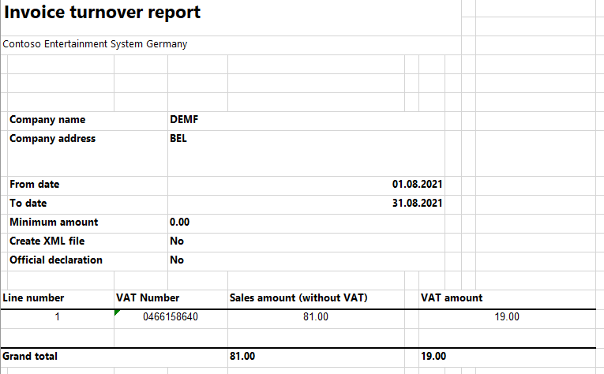

---
# required metadata

title: Annual VAT listing of domestic sales
description: This topic provides information about Belgium annual VAT listing of domestic sales or Invoice turnover report.
author: andosip
ms.date: 09/09/2021
ms.topic: article
ms.prod: 
ms.technology: 

# optional metadata

ms.search.form: 
audience: Application User
# ms.devlang: 
ms.reviewer: kfend
# ms.tgt_pltfrm: 
ms.custom: 
ms.assetid: 
ms.search.region: Belgium
# ms.search.industry: 
ms.author: anasyash
ms.search.validFrom: 2016-02-28
ms.dyn365.ops.version: AX 7.0.0

---

# Annual VAT listing of domestic sales

[!include [banner](../includes/banner.md)]

The **Invoice turnover** report is sent to the authorities once per year. It's used to report the turnover for Belgian VAT-obliged customers, if that turnover exceeds a specific amount. The report includes invoices from customer transactions where the customers have an enterprise number that is formatted according to the guidelines of the Belgian authorities.

The following fields are shown on the **Invoice turnover** report:

- VAT sum
- Turnover sum
- Declarant reference
- Number of clients
- Replaced declaration (if necessary)
- Company's VAT number
- Company's name
- Company's Post code
- Company's country ISO code
- Declaration period
- Customer's VAT number
- Customer's turnover
- Customer's VAT amount

## Setup

### Preliminary steps

Import the latest version of the following Electronic reporting (ER) configurations:

  - Invoice turnover report model
  - Invoice turnover report (BE)

For more information, see [Download ER configurations from the Global repository of Configuration service](../../fin-ops-core/dev-itpro/analytics/er-download-configurations-global-repo.md).

### Create registration types for company codes

You must create two registration types for company codes: one for the VAT ID and one for the enterprise number.

1. Go to **Organization administration** > **Global address book** > **Registration types** > **Registration types**.
2. On the Action Pane, select **New** to create the registration type for the VAT ID.
3. In the **Enter registration type details** dialog box, in the **Name** field. enter a name for the new registration type. For example, enter **VAT ID**.
4. In the **Country/region** field, select **BEL**.
5. Select **Create**.
6. On the Action Pane, select **New** to create the registration type for the enterprise number.
7. In the **Enter registration type details** dialog box, in the **Name** field, enter a name for the new registration type. For example, enter **ENTNUM**.
8. In the **Country/region** field, select **BEL**.
9. Select **Create**.

### Match the registration types with registration categories

1. Go to **Organization administration** > **Global address book** > **Registration types** > **Registration categories**.  
2. For the registration type for the VAT ID, select the **VAT ID** registration category.
3. For the registration type for the enterprise number, select the **Enterprise ID (COID)** registration category.

### Set up a VAT ID and enterprise number for your company

1. Go to **Organization administration** > **Organizations** > **Legal entities**.
2. In the grid, select your company.
3. On the Action Pane, select **Registration IDs**.
4. On the **Registration ID** FastTab, select **Add**.
5. In the **Registration type** field, select one of the registration types that you created earlier.
6. Enter your company's VAT ID or enterprise number, depending on the registration type that you selected in the previous step.
7. Repeat steps 4 through 6 for the other registration type that you created earlier.

### Set up a VAT ID and enterprise number for all your company's Belgian customers

1. Go to **Accounts receivable** > **Customers** > **All customers**.
2. On the Action Pane, select **Registration IDs**.
3. On the **Registration ID** FastTab, select **Add**.
4. In the **Registration type** field, select one of the registration types that you created earlier.
5. Enter your customer's VAT ID or enterprise number, depending on the registration type that you selected in the previous step.
6. Repeat steps 3 through 5 for the other registration type that you created earlier.

### Create number sequence codes for the Invoice turnover report

1. Go to **Organization administration** > **Number sequences** > **Number sequences**.
2. Create a number sequence.
3. On the **Segments** FastTab, remove all the lines, and then select **Add**.
4. In the **Segment** field, select **Alphanumeric**.
5. In the **Value** field, enter **\#\#\#\#\#\#\#\#\#**.
6. On the **General** FastTab, in the **Setup** section, set the **Continuous** option to **Yes**.
7. Go to **General ledger** > **Ledger setup** > **General ledger parameters**.
8. On the **Number sequence** tab, in the **Number sequence code** field for the **Annual sales list ID** reference, select the number sequence that you just created.

## Generate the Invoice turnover report

1. Go to **Tax** > **Inquiries and reports** > **Sales tax reports** > **Invoice turnover report – Belgium**.
2. In the **Invoice turnover report** dialog box, set the following fields.

    | Field                                 | Description                                                                                                           |
    |---------------------------------------|-----------------------------------------------------------------------------------------------------------------------|
    | From date                             | Select the start date of the report.                                                                                  |
    | To date                               | Select the end date of the report.                                                                                    |
    | Amount                                | The minimum amount to include on the report. This amount is the total invoiced amount by the customer, excluding VAT. |
    | Generate file                         | Set this option to **Yes** to generate an .xml file.                                                                  |
    | File name                             | Enter a name for the reporting file.                                                                                  |
    | Generate report                       | Set this option to **Yes** to generate an .xlsx file.                                                                 |
    | Report file name                      | Enter a name for the .xlsx file.                                                                                      |
    | Official declaration                  | Set this option to **Yes** to indicate that this report is final.                                                     |
    | Replaced Invoice turnover declaration | If you must replace a report, enter the number of the replaced declaration.                                           |
    | Format mapping                        | Select **Invoice turnover report (BE)** to generate the **Invoice turnover** report.                                  |

## Example

1. In [Microsoft Dynamics Lifecycle Services (LCS)](https://lcs.dynamics.com/Logon/Index), in the Shared asset library, download the latest version of the following ER configurations:

    - Invoice turnover report model
    - Invoice turnover report (BE)

2. Go to **Organization administration** > **Global address book** > **Registration types** > **Registration types**, and follow these steps:

    1. On the Action Pane, select **New**.
    2. In the **Enter registration type details** dialog box, in the **Name** field, enter **VAT ID**.
    3. In the **Country/region** field, select **BEL**.
    4. Select **Create**.
    5. On the Action Pane, select **New**.
    6. In the **Enter registration type details** dialog box, in the **Name** field, enter **ENTNUM**.
    7. In the **Country/region** field select **BEL**.
    8. Select **Create**.

3. Go to **Organization administration** > **Global address book** > **Registration types** > **Registration categories**, and follow these steps:

    1. On the Action Pane, select **New**.
    2. In the **Registration type** field, select **VAT ID**.
    3. In the **Registration category** field, select **VAT ID**.
    4. On the Action Pane, select **New**.
    5. In the **Registration type** field, select **ENTNUM**.
    6. In the **Registration category** field, select **Enterprise ID (COID)**.

4. Go to **Organization administration** > **Global address book** > **Addresses** > **Address setup**, and follow these steps:

    1. On the **ZIP/postal codes** tab, select **New**.
    2. In the **Country/region** field, select **BEL**.
    3. In the **ZIP/postal code** field, enter **B-1014**.
    4. On the Action Pane, select **Save**.

5. Go to **Organization administration** > **Organizations** > **Legal entities**, and follow these steps:

    1. In the grid, select **DEMF**.
    2. On the **Addresses** FastTab, select **Edit**.
    3. In the **Edit address** dialog box, in the **Country/region** field, select **BEL**.
    4. In the **ZIP/postal code** field, select **B-1014**.
    5. On the **Tax registration** FastTab, in the **Tax registration number** field, enter **0466.158.640**.
    6. On the Action Pane, select **Registration IDs**.
    7. On the **Registration ID** FastTab, select **Add**.
    8. In the **Registration type** field, select **ENTNUM**.
    9. In the **Registration number** field, enter **BTW BE 0466.158.640**.
    10. Select **Add**.
    11. In the **Registration type** field, select **VAT ID**.
    12. In the **Registration number** field, enter **BE 0466.158.640**.

6. Go to **Tax** > **Setup** > **Sales tax** > **Tax exempt numbers**, and follow these steps:

    1. On the Action Pane, select **New**.
    2. In the **Country/region** field, select **BEL**.
    3. In the **Tax exempt number** field, enter **BTW BE 0420.429.375**.

7. Go to **Accounts receivable** > **Customers** > **All customers**, and follow these steps:

    1. In the grid, select **DE-010**.
    2. On the **Addresses** FastTab, select **Edit**.
    3. In the **Country/region** field, select **BEL**.
    4. On the **Invoice and delivery** FastTab, in the **Sales tax** section, in the **Tax exempt number** field, select **BTW BE 0420.429.375**.
    5. On the Action Pane, on the **Customer** tab, in the **Registration** section, select **Registration IDs**.
    6. On the **Registration ID** FastTab, select **Add**.
    7. In the **Registration type** field, select **VAT ID**.
    8. In the **Registration number** field, enter **BE 0420.429.375**.
    9. Select **Add**.
    10. In the **Registration type** field, select **VAT ID**.
    11. In the **Registration number** field, enter **BTW BE 0420.429.375**.

8. Go to **Organization administration** > **Number sequences** > **Number sequences**, and follow these steps:

    1. On the Action Pane, on the **Number sequence** tab, in the **New** section, select **Number sequence**.
    2. On the **Identification** FastTab, in the **Number sequence code** field, enter **Gene\_BE01**.
    3. On the **Scope parameters** FastTab, in the **Scope** field, select **Company**.
    4. In the **Company** field, select **DEMF**.
    5. On the **Segments** FastTab, remove all the lines, and then select **Add**.
    6. In the **Segment** field, select **Alphanumeric**.
    7. In the **Value** field, enter **\#\#\#\#\#\#\#\#\#**.
    8. On the **General** FastTab, in the **Setup** section. set the **Continuous** option to **Yes**.

9. Go to **General ledger** > **Journal setup** > **Posting journals**. On the Action Pane, select **Create**.
10. Go to **General ledger** > **Ledger setup** > **General ledger parameters**. On the **Number sequence** tab, in the **Number sequence code** field for the **Annual sales list ID** reference, select **Gene\_BE01**.
11. Go to **Accounts receivable** > **Invoices** > **All free text invoices**, and follow these steps:

    1. On the Action Pane, select **New**.
    2. On the **Free text invoice header** FastTab, in the **Customer** section, in the **Customer account** field, select **DE-010**.
    3. On the **Invoice lines** FastTab, in the **Main account** field, select **110130**.
    4. Make sure that the **Sales tax group** field is set to **AR-DOM**.
    5. In the **Item sales tax group** field, select **FULL**.
    6. In the **Unit price** field, enter **100**.
    7. On the Action Pane, select **Post**.
    8. In the **Post free text invoice** dialog box, select **OK**.

12. Go to **Tax** > **Inquiries and reports** > **Sales tax reports** > **Invoice turnover report – Belgium**, and follow these steps:

    1. On the **Parameters** FastTab, in the **Criteria** section, in the **From date** and **To date** fields, set the interval for the report that corresponds to the dates of the free text invoice that you created earlier.
    2. In the **Export options** section, set the **Generate file** option to **Yes**.
    3. In the **Electronic reporting** section, in the **Format mapping** field, select **Invoice turnover report (BE)**.
    4. Select **OK**, and review the file for the report. The following table shows the values for the example report.

        | Field name                     | Value                                |
        |--------------------------------|--------------------------------------|
        | ClientListingsNbr              | 1                                    |
        | ClientListing VATAmountSum     | 19                                   |
        | TurnOverSum                    | 100                                  |
        | ClientsNbr                     | 1                                    |
        | SequenceNumber                 | 1                                    |
        | common:VATNumber               | 0466158640                           |
        | common:Name                    | Contoso Entertainment System Germany |
        | common:PostCode                | B-1014                               |
        | common:CountryCode             | BE                                   |
        | Client SequenceNumber          | 1                                    |
        | CompanyVATNumber issuedBy="BE" | 0420429375                           |
        | TurnOver                       | 100                                  |
        | VATAmount                      | 19                                   |

5. Review the report in .xlsx format.

    
    

[!INCLUDE[footer-include](../../includes/footer-banner.md)]
