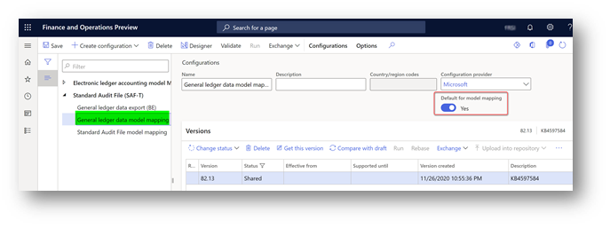
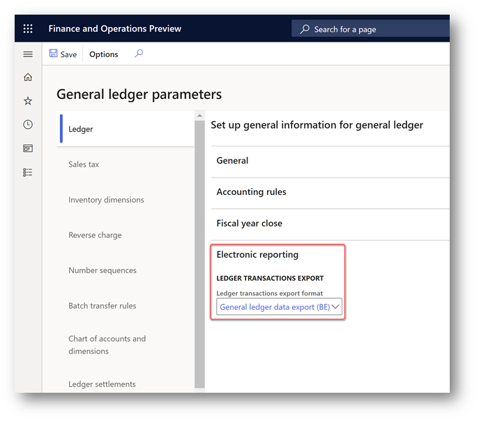
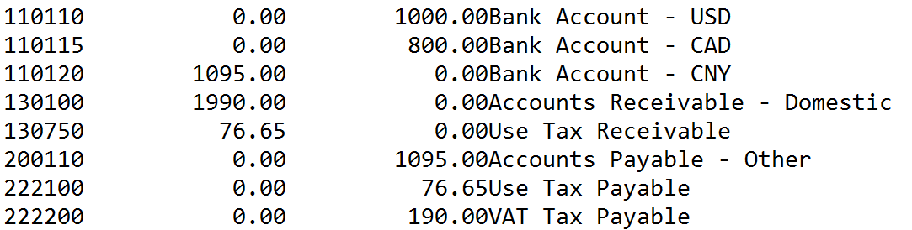

---
# required metadata

title: Export ledger transactions
description: This topic provides information about how to export ledger account balances to a plain text (ASCII) file in .CED format for Belgium.
author: anasyash
manager: AnnBe
ms.date: 09/17/2020
ms.topic: article
ms.prod: 
ms.service: dynamics-ax-applications
ms.technology: 

# optional metadata

ms.search.form: TaxReportExtraFieldsBE
audience: Application User
# ms.devlang: 
ms.reviewer: kfend
ms.search.scope: Core, Operations
# ms.tgt_pltfrm: 
ms.custom: 273103
ms.search.region: Belgium
# ms.search.industry: 
ms.author: roschlom
ms.dyn365.ops.version: AX 7.0.1
ms.search.validFrom: 2016-05-31

---

# Export ledger transactions

[!include [banner](../includes/banner.md)]

The feature described in this topic is used to export the total balance of each ledger account for a specific period to a plain text (ASCII) file in .CED format. You can then import the generated file into third-party software to create an accounting report according to country/region-specific requirements.

This functionality is available for legal entities that have their primary address in Belgium.

## Prerequisites

### Create posting journals

1. Go to **General ledger** \> **Journal setup** \> **Posting journals**.
2. On the **Journal setup** page, select **Create**. Posting journals and corresponding number sequences are automatically created.

## Export ledger transactions to a plain text file in CED format

### Setup

1. From [Microsoft global repository](https://docs.microsoft.com/en-us/dynamics365/fin-ops-core/dev-itpro/analytics/er-download-configurations-global-repo), import the latest versions of the Electronic reporting (ER) configurations for the following report format:

| **Dynamics 365 Finance version**          | **Configuration name**                                                                                           |
|-------------------------------------------|------------------------------------------------------------------------------------------------------------------|
| before 10.0.16                            | **Ledger transaction export format (BE)** under Ledger accounting reports > Ledger transaction export (BE) model |
| starting from 10.0.16                     | **General ledger data export (BE)** under **Standard Audit File (SAF-T)** model                                  |

> 

2. After importing, you must have the following versions, or later versions, of ER configurations:

| **ER configuration name**         | **Type**           | **Version** | **Description**                                                                                                             |
|-----------------------------------|--------------------|-------------|-----------------------------------------------------------------------------------------------------------------------------|
| Standard Audit File (SAF-T)       | Model              | 82          | The common ER model for Standard Audit Files.                                                                               |
| General ledger data model mapping | Model mapping      | 82.13       | The model mapping that defines data sources for General ledger data.                                                        |
| General ledger data export (BE)   | Format (exporting) | 82.8        | The text format representing general ledger data which can be further used for importing into third-party software (Accon). |

**Note:** After all the ER configurations from the preceding table are imported,
set the **Default for model mapping** option to **Yes** for the **General ledger
data model mapping** configuration on the Configurations page.

> 

3. To use (starting from 10.0.16 version) **General ledger data export (BE)** format, define its ER configuration name in new general ledger parameter. Open **General ledger** > **Ledger setup** > **General ledger parameters** page, Expand **Electronic reporting** fast tab and select **Ledger** tab. Select **General ledger data export (BE)** format in **Ledger transactions export** field under **Ledger transactions export** group and save new setting.

> 

### Generate “Export ledger transactions” report

1.	In Dynamics 365 Finance, go to **General ledger** \> **Periodic tasks** \> **Export ledger transactions**.
2.	If your Dynamics 365 Finance version is lower then 10.0.16, in the **Export ledger transactions to an ASCII file in CED format** dialog box, in the **Format mapping** field, select the **Ledger transaction export format (BE)** format that you just downloaded, and then select **OK**. Starting from the version 10.0.16 you can specify the ER format in General ledger parameters. When ER format is defined in parameters of general ledger, system will use it for report generation.
3. Specify reporting period in **From date** and **To date** fields of the Electronic report parameters dialog page.
4. If accounting currency of your Legal entity is different than EURO and you want to generate the report in EURO, mark “Recalculate to Euro” parameter on the dialog page. 
In case when accounting currency is not EURO but reporting currency is EURO and you select “Recalculate to Euro” parameter, report will be generated with amounts stored in general ledger in reporting currency. 
In case when neither accounting no reporting currency are EURO and you select “Recalculate to Euro” parameter, report will automatically recalculate amounts in accounting currency to EURO by using the exchange rate stored in the system on the date of each transaction in general ledger. In this case, time of the report generation may take longer time then time of the report generation without recalculation.
5.	When you generate “Export ledger transactions” report for long period, it is recommended to run it in batch. To run the report in batch, expand “Run in the background” fast tab of the dialog, mark the “Batch processing” parameter and specify other parameters of the batch if needed. Follow up the report generation via “Electronic reporting jobs” page.
6. Select **OK** to generate and download the .txt file.

    For example, you post the following ledger transactions in the DEMF company.

| **Date**        | **Transaction type** | **Main account**          | **Offset account**        | **Amount net** | **VAT amount** | **Sales tax code** |
|-----------------|----------------------|---------------------------|---------------------------|----------------|----------------|--------------------|
| January 1, 2020 | Customer invoice     | 110110 – Bank account USD |                           | 1,000          | 190            | VAT19              |
| January 1, 2020 | Vendor invoice       |                           | 110120 – Bank account CNY | 1,095          | 76.65          | EU7                |
| January 1, 2020 | Customer invoice     | 110115 – Bank account CAD |                           | 800            | 0              | EUS                |

In this case, the file that is generated contains the following data.

Here is an explanation of the columns in this file:

- The first column shows the ledger account code.
- The second column shows the debit balance on the ledger account.
- The third column shows the credit balance on the ledger account.
- The fourth column shows the name of the ledger account.

> [!NOTE]
> To post ledger transactions for customer invoices, go to **Accounts receivable** \> **Invoices** \> **All free text invoices**. For vendor invoices, go to **Accounts payable** \> **Invoices** \> **Invoice journal**.
