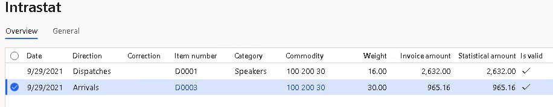

# Belgium Intrastat

[!include [banner](../includes/banner.md)]

You can use the **Intrastat** page to generate and report information about trade among European Union (EU) countries. The Belgium Intrastat declaration contains information about the trade of goods for reporting.

The following fields are included in the Belgium Intrastat declaration.

| Field on the Intrastat declaration | Corresponding field on the Intrastat journal page | Description | Arrivals | Dispatches |
|-------------------------|-------------------------|-------------------------|-------------------------|-------------------------|
| EXTRF | **Direction** | The record type.<ul><li>For arrivals, the code "19" is printed.</li><li>For dispatches, the code "29" is printed.</li></ul> | X | X |
| EXCNT | **Country/region** (in the **Dispatch/destination** section) | The International Organization for Standardization (ISO) code for the country or region of the partner (counterparty). | X | X |
| EXTTA | **Transaction code** (in the **Codes** section) | The code that indicates the nature of the transaction. Companies in Belgium use two-digit transaction codes. | X | X |
| EXREG | No corresponding field | The state/province code in the main address of the legal entity. | X | X |
| EXTGO | **Commodity** (in the **Codes** section) | The commodity code, which is an eight-digit Intrastat nomenclature code. | X | X |
| EXWEIGHT | **Weight** (in the **Data** section) | The net mass in kilograms. The unit itself ("kg") isn't printed. | X | X |
| EXUNITS | **Quantity of additional units** (in the **Unit** section) | For some commodities, you must report the supplementary unit. The unit itself (for example, "pairs" or "dozens") isn't reported. | X | X |
| EXTXVAL | **Invoice value** (in the **Invoice value** section) | The invoice value in euros. | X | X |
| EXCNTORI | **Country/region of origin** (in the **Country/region of origin** section) | The ISO code of the country or region where the commodities were produced or manufactured. | Not applicable | X |
| PERTNERID | **Tax exempt number** (in the **General** section) | The customer's foreign value-added tax (VAT) number in an EU member state. | Not applicable | X |

For declarations that exceed the total limit that has been set by the authorities, an extended report should be declared that includes the following additional fields.

| File field name | Intrastat journal field                       | Description                                | Arrivals | Dispatches |
|-----------------|-----------------------------------------------|--------------------------------------------|----------|------------|
| EXTPC           | **Transport** (in the **Codes** section)      | The Intrastat code for the transport mode. | X        | X          |
| EXDELTRM        | **Delivery terms** (in the **Codes** section) | The Intrastat code for the delivery terms. | X        | X          |

For more information, go to [www.intrastat.be](http://www.intrastat.be/).

## Set up Intrastat

### Import Electronic reporting configurations

To set up Intrastat, import the latest version of the following Electronic reporting (ER) configurations:

- Intrastat model
- Intrastat report
- Intrastat (BE)

For more information, see [Download ER configurations from the Global repository of Configuration service](../../fin-ops-core/dev-itpro/analytics/er-download-configurations-global-repo.md).

### Set up foreign trade parameters

1. In Microsoft Dynamics 365 Finance, go to **Tax** &gt; **Setup** &gt; **Foreign trade** &gt; **Foreign trade parameters**.
2. On the **Intrastat** tab, on the **Electronic reporting** FastTab, in the **File format mapping** field, select **Intrastat (BE)**
3. In the **Report format mapping** field, select **Intrastat report**.
4. On the **Commodity code hierarchy** FastTab, in the **Category hierarchy** field, select **Intrastat**.
5. In the **Transaction code** field, select the transaction code for property transfers. You use this code for transactions that produce actual or planned transfers of property against compensation (financial or otherwise). You also use it for corrections. Belgium companies use two-digit transaction codes. For more information, see [Intrastat - Info](https://www.nbb.be/statistics/foreign-trade/intrastat-info).
6. In the **Credit note** field, select the transaction code for the return of goods.
7. On the **Country/region properties** tab, in the **Country/region** field, list all the countries or regions that your company does business with. For each country that is part of the EU, select **EU** in the **Country/region type** field, so that the country appears on your Intrastat report.
8. On the **Number sequences** FastTab, set the number sequences for the **Intrastat archive ID** and **XML file number** references.

### Set up an address format

To set up an address format that includes state or province information, follow these steps.

1. Go to **Organization administration** > **Global address book** > **Addresses** > **Address setup**.
2. On the **Address format** tab, select **New** to create new address format. To update an existing format, select it in the grid.
3. In the **Configure address component** section, select **Add**.
4. In the **Address application object** field, select **State/province**. Then activate the corresponding box in the **New line** column.
5. Add the address objects that are required by the authorities.
6. On the **Country/region** tab, in the grid, select **BEL**.
7. In the **Address format** field, select the address format that you created earlier.

### Set up province Intrastat codes

1. Go to **Organization administration** > **Global address book** > **Addresses** > **Address setup**.
2. On the **State/province** tab, create regions for Belgium. Here are some examples.

    | Region          | Intrastat code |
    |-----------------|----------------|
    | Flemish region  | 1              |
    | Walloon region  | 2              |
    | Brussels region | 3              |

### Set up the product parameters for the Intrastat declaration

1. Go to **Product information management** > **Products** > **Released products**.
2. In the grid, select a product.
3. On the **Foreign trade** FastTab, in the **Intrastat** section, in the **Commodity** field, select a commodity code.
4. In the **Origin** section, in the **Country/region** field, select the product's country or region of origin.
5. On the **Manage inventory** FastTab, in the **Net weight** field, enter the product's weight in kilograms.

### Set up the transport method and mode of delivery

1. Set up transport codes.

    1. Go to **Tax** > **Setup** > **Foreign trade** > **Transport method**.
    2. On the Action Pane, select **New**.
    3. In the **Transport** field, enter a unique code. Belgium companies use one-digit transport codes.

2. Set up mode of delivery Intrastat codes.

    1. Go to **Procurement and sourcing** > **Setup** > **Distribution** > **Terms of delivery**.
    2. In the grid, select a set of terms of delivery.
    3. On the **General** FastTab, in the **Intrastat code** field, enter a unique code.

3. Go to **Tax** > **Setup** > **Foreign trade** > **Compression of Intrastat**, and select the fields that should be compared when Intrastat information is summarized. For Belgium Intrastat, select the following fields:

    - Commodity
    - Transaction code
    - Country of origin/destination
    - State
    - Country/region of origin
    - Direction
    - Country/region
    - Country/region of sender
    - Transport
    - Delivery terms
    - Correction
    - Invoice

### Set up the VAT number of the trading partner

1. Go to **Accounts receivable** > **Customers** > **All customers**.
2. In the grid, select a customer.
3. On the Action Pane, on the **Customer** tab, in the **Registration** group, select **Registration IDs**.
4. On the **Registration ID** FastTab, select **Add** to create a registration ID.
5. In the **Registration type** field, select **VATID**.
6. In the **Registration number** field, enter the company's VAT number.
7. On the Action Pane, select **Save**. Then close the page.
8. On the customer's page, on the **Invoice and delivery** FastTab, in the **Sales tax** section, in the **Tax exempt number** field, select the registration ID that you created earlier.

For more information about registration IDs, see [Registration IDs](emea-registration-ids.md).

## Intrastat transfer

On the **Intrastat** page, on the Action Pane, you can select **Transfer** to automatically transfer the information about intracommunity trade from your sales orders, free text invoices, purchase orders, vendor invoices, vendor product receipts, project invoices, and transfer orders. Only documents that have an EU country as the country or region of destination (for dispatches) or consignment (for arrivals) will be transferred.

Alternatively, you can manually enter transactions by selecting **New** on the Action Pane.

### Generate an Intrastat report

1. Go to **Tax** > **Declarations** > **Foreign trade** > **Intrastat**.
2. On the Action Pane, select **Output** &gt; **Report**.
3. In the **Intrastat Report** dialog box, enter the start and end dates for the report.
4. Set the **Generate file** option to **Yes** to generate a .xml file, and then enter the name of the .xml file for the Intrastat report.
5. Set the **Generate report** option to **Yes** to generate an .xlsx file, and then enter a name for the file.
6. In the **Direction** field, select **Arrivals** if the report is about intracommunity arrivals, **Dispatches** if the report is about intracommunity dispatches, or **Both** if the report combines information about intracommunity arrivals and dispatches.
7. In the **File format mapping** section, in the **Declaration type** field, select **Replace** for an original declaration and for corrections that should overwrite the information that has already been reported for the selected reporting period. Select **Append** for corrections that should be added to the information that has already been reported in the reporting period.
8. In the **Email** field, enter your email address. The response will be sent to this address.
9. In the **Reporting date** field, select the report creation date and time.
10. In the **Language** field, enter **nld**, **fra**, or **deu** to indicate the language for the response.
11. Set the **Extended report** option to **Yes** to generate the extended report if the report's totals exceed the total limit that has been set by the authorities.
12. Select **OK**, and review the generated reports.

### Review an Intrastat archive

1. On the Action Pane, select **Intrastat archive**, and then select the report.
2. Select the **General** tab to view the file information.

    | Field                 | Description                                                                                                                      |
    |-----------------------|----------------------------------------------------------------------------------------------------------------------------------|
    | Intrastat archive ID  | The unique sequence number for the Intrastat report.                                                                             |
    | File name             | The name that the user specified for the Intrastat file report.                                                                  |
    | Created date and time | The date and time when the Intrastat declaration was created.                                                                    |
    | Number of lines       | The total number of lines on the Intrastat report.                                                                               |
    | Extended reporting    | A value of **Yes** indicates that the user set the **Extended report** option to **Yes** when they created the Intrastat report. |
    | User ID               | The unique ID of the user who created the Intrastat report.                                                                      |

3. On the Action Pane, select **Details** to review the lines for the selected Intrastat report.

## Example

The following example shows how to set up Belgium Intrastat and create the Intrastat report. It uses the **DEMF** legal entity.

1. Go to **Organization administration** > **Organization** > **Legal entities**, and select the **DEMF** legal entity.
2. On the **Addresses** FastTab, select **Edit**.
3. In the **Country/region** field, select **BEL** (Belgium).
4. Import the latest version of the following ER configurations:

    - Intrastat model
    - Intrastat report
    - Intrastat (BE)

### Set up an address format

To set up an address format that includes county information, follow these steps.

1. Go to **Organization administration** > **Global address book** > **Addresses** > **Address setup**.
2. On the **Address format** tab, in the grid, select **0001**.
3. In the **Configure address component** section, verify that the **Address application object** field is set to **State or province**, and the corresponding box in the **New line** column is activated.
4. On the **Country/region** tab, in the grid, select **BEL**.
5. In the **Address format** field, select **0001**.

### Set up state/province Intrastat codes

1. Go to **Organization administration** > **Global address book** > **Addresses** > **Address setup**.
2. On the **State/province** tab, select **New**.
3. In the **Country/region** field, select **BEL**.
4. In the **State** field, enter **Brussels**.
5. In the **Intrastat code** field, enter **3**.
6. Go to **Organization administration** > **Organization** > **Legal entities**, and select the **DEMF** legal entity.
7. On the **Addresses** FastTab, select **Edit**.
8. In the **State** field, select **Brussels**. The code for this state/province will be printed in the **Code of region of origin/destination** section of the Intrastat report.

### Set up posting journals

1. Go to **General ledger** > **Journal setup** > **Posting journals**.
2. On the Action Pane, select **Create**.

### Set up foreign trade parameters

1. Go to **Tax** > **Setup** > **Foreign trade** > **Foreign trade parameters**.
2. On the **Intrastat** tab, on the **General** FastTab, in the **Transaction** **code** field, select **11**.
3. On the **Electronic reporting** FastTab, in the **File format mapping** field, select **Intrastat (BE)**.
4. In the **Report format mapping** field, select **Intrastat Report**.
5. On the **Commodity code hierarchy** FastTab, verify that the **Category hierarchy** field is set to **Intrastat**.
6. On the **Country/region properties** tab, select **New**.
7. In the **Party country/region** field, select **BEL**. Then, in the **Country/region type** field, select **Domestic**.
8. In the **Party country/region** field, select **DEU** (Germany). Then, in the **Country/region type** field, select **EU**.

### Set up product information

1. Go to **Product information management** > **Products** > **Released** **products**.
2. In the grid, select **D0001**.
3. On the **Foreign trade** FastTab, in the **Intrastat** section, in the **Commodity** field, select **100 200 30**.
4. In the **Origin** section, in the **Country/region** field, select **BEL**.
5. On the **Manage inventory** FastTab, in the **Weight measurements** section, in the **Net weight** field, enter **2**.
6. On the Action Pane, select **Save**.
7. In the grid, select **D0003**.
8. On the **Foreign trade** FastTab, in the **Intrastat** section, in the **Commodity** field, select **100 200 30**.
9. In the **Origin** section, in the **Country/region** field, select **DEU**.
10. On the **Manage inventory** FastTab, in the **Weight measurements** section, in the **Net weight** field, enter **5**.
11. On the Action Pane, select **Save**.

### Change the site address

1. Go to **Warehouse management** > **Setup** > **Warehouse** > **Sites**.
2. In the grid, select **1**.
3. On the **Addresses** FastTab, select **Edit**.
4. In the **Edit address** dialog box, in the **Country/region** field, select **BEL**.
5. Select **OK** to close the **Edit address** dialog box.

### Set up a transport method

1. Create a new transport method.

    1. Go to **Tax** > **Setup** > **Foreign trade** > **Transport method**.
    2. On the Action Pane, select **New**.
    3. In the **Transport** field, enter **3**.
    4. In the **Description** field, enter **Road transport**.

2. Assign the transport method to the mode of delivery. In this way, you set up the default values that are used for the transport method when the corresponding mode of delivery is selected.

    1. Go to **Procurement and sourcing** > **Setup** > **Distribution** > **Modes of delivery**.
    2. In the grid, select **10**.
    3. On the **Foreign trade** FastTab, in the **Transport** field, select **3**.

3. Select the default mode of delivery for a customer.

    1. Go to **Accounts receivable** > **Customers** > **All customers**.
    2. In the grid, select **DE-016**.
    3. On the **Invoice and delivery** FastTab, in the **Mode of delivery** field, select **10**.

4. Select the default mode of delivery for a vendor.

    1. Go to **Accounts payable** > **Vendors** > **All vendors**.
    2. In the grid, select **DE-001**.
    3. On the **Invoice and delivery** FastTab, in the **Mode of delivery** field, select **10**.

### Set up codes for terms of delivery

1. Set up the Intrastat code for the terms of delivery.

    1. Go to **Procurement and sourcing** > **Setup** > **Distribution** > **Terms of delivery**.
    2. In the grid, select **CIF**.
    3. On the **General** FastTab, in the **Intrastat code** field, enter **CIF**.

2. Select the default delivery terms for a customer.

    1. Go to **Accounts receivable** > **Customers** > **All customers**.
    2. In the grid, select **DE-016**.
    3. On the **Invoice and delivery** FastTab, in the **Delivery terms** field, select **CIF**.

3. Select the default delivery terms for a vendor.

    1. Go to **Accounts payable** > **Vendors** > **All vendors**.
    2. In the grid, select **DE-001**.
    3. On the **Invoice and delivery** FastTab, in the **Delivery terms** field, select **CIF**.

### Verify the EU customer's tax-exempt number code

1. Go to **Accounts receivable** > **Customers** > **All customers**.
2. In the grid, select **DE-016**.
3. On the **Invoice and delivery** FastTab, in the **Sales tax** section, verify that the **Tax exempt number** field is set to **DE9012**.

### Create a sales order with an EU customer

1. Go to **Accounts receivable** > **Orders** > **All sales orders**.
2. On the Action Pane, select **New**.
3. In the **Create sales order** dialog box, on the **Customer** FastTab, in the **Customer** section, in the **Customer account** field, select **DE-016**.
4. On the **General** FastTab, in the **Storage dimensions** section, in the **Site** field, select **1**.
5. In the **Warehouse** field, select **11**.
6. On the **Address** tab, verify that the **Address** field is set to **Teichgasse 12, Kiel, 24103, DEU**, because the vendor is from Germany.
7. Select **OK**.
8. On the **Header** tab, on the **Delivery** FastTab, verify that the **Delivery terms** field is set to **CIF**.
9. On the **Lines** tab, on the **Sales order lines** FastTab, in the **Item number** field, select **D0001**. Then, in the **Quantity** field, enter **8**.
10. On the **Line details** FastTab, on the **Foreign trade** tab, verify that the **Transaction code** field is set to **11**, the **Transport** field is set to **3**, the **Commodity** field is set to **100 200 30**, and the **Country/region of origin** field is set to **BEL**.
11. On the Action Pane, select **Save**.
12. On the Action Pane, on the **Invoice** tab, in the **Generate** group, select **Invoice**.
13. In the **Posting invoice** dialog box, on the **Parameters** FastTab, in the **Parameter** section, in the **Quantity** field, select **All**.
14. Select **OK** to post the invoice.

### Transfer the transaction to the Intrastat journal and review the result

1. Go to **Tax** > **Declarations** > **Foreign trade** > **Intrastat**.
2. On the Action Pane, select **Transfer**.
3. In the **Intrastat (Transfer)** dialog box, in the **Parameters** section, set the **Customer invoice** option to **Yes**.
4. Select **Filter**.
5. In the **Intrastat Filter** dialog box, on the **Range** tab, select the first line, and verify that the **Field** field is set to **Date**.
6. In the **Criteria** field, select the current date.
7. Select **OK** to close the **Intrastat Filter** dialog box.
8. Select **OK** to close the **Intrastat (Transfer)** dialog box, and review the result. The line represents the sales order that you created earlier.

    

9. Select the transaction line, and then select the **General** tab to view more details.

    

10. On the Action Pane, select **Output** &gt; **Report**.
11. In the **Intrastat Report** dialog box, on the **Parameters** FastTab, in the **Date** section, select the month of the sales order that you created.
12. In the **Export** **options** section, set the **Generate file** option to **Yes**. Then, in the **File name** field, enter the required name.
13. Set the **Generate report** option to **Yes**. Then, in the **Report file name** field, enter the required name.
14. In the **Direction** field, select **Dispatches**.
15. Set the **Extended report** option to **Yes**.
16. Select **OK**, and review the report in text format that is generated. The following table shows the values in the example report.

    | Record type | Partner country/region | Transaction code | Code of region of origin/destination | Commodity codes | Net mass | Invoice value | Country/region of origin | Customer's VAT number | Mode of transport | Delivery terms |
    |-------------|-----------------|------------------|--------------------------------------|-----------------|----------|---------------|-------------------|-----------------------|-------------------|----------------|
    | 29          | DE              | 11               | 3                                    | 10020030        | 16       | 2632          | BE                | DE9012                | 3                 | CIF            |
> [!NOTE]
> The **Code of region of origin/destination** field is set to the Intrastat code of the state or province in the main address of the legal entity. In this example, the code **3** represents the Brussels state/province.

17. Review the generated report file.

    

### Create a purchase order

1. Go to **Accounts payable** > **Purchase orders** > **All purchase orders**.
2. On the Action Pane, select **New**.
3. In the **Create purchase order** dialog box, in the **Vendor account** field, select **DE-001**.
4. In the **Site** field, select **1**.
5. In the **Warehouse** field, select **11**.
6. Select **OK**.
7. On the **Header** Tab, on the **Delivery** FastTab, verify that the **Mode of delivery** field is set to **10**, and the **Delivery terms** field is set to **CIF**.
8. On the **Lines** tab, on the **Purchase order lines** FastTab, in the **Item number** field, select **D0003**. Then, in the **Quantity** field, enter **6**.
9. On the **Line details** FastTab, on the **Foreign trade** tab, verify that the **Transaction code** is set to **11**, the **Transport** field is set to **3**, the **Commodity** field is set to **100 200 30**, and the **Country/region of origin** field is set to **DEU**.
10. On the Action Pane, on the **Purchase** tab, in the **Actions** group, select **Confirm**.
11. On the Action Pane, on the **Invoice** tab, in the **Generate** group, select **Invoice**.
12. On the Action Pane, select **Default from**. In the **Default quantity for lines** field, select **Ordered quantity**. Then select **OK**.
13. On the **Vendor Invoice header** FastTab, in the **Invoice identification** section, in the **Number** field, enter **00001**.
14. On the Action Pane, select **Post** to post the invoice.

### Create an Intrastat declaration for arrivals

1. Go to **Tax** > **Declarations** > **Foreign trade** > **Intrastat**.
2. On the Action Pane, select **Transfer**.
3. In the **Intrastat (Transfer)** dialog box, set the **Vendor invoice** option to **Yes**.
4. Select **OK** to transfer the transactions, and review the Intrastat journal.

    

5. Review the **General** tab for the purchase order.

    

6. On the Action Pane, select **Output** > **Report**.
7. In the **Intrastat Report** dialog box, on the **Parameters** FastTab, in the **Date** section, select the month of the purchase order that you created.
8. In the **Export** **options** section, set the **Generate file** option to **Yes**. Then, in the **File name** field, enter the required name.
9. Set the **Generate report** option to **Yes**. Then, in the **Report file name** field, enter the required name.
10. In the **Direction** field, select **Arrivals**.
11. Set the **Extended report** option to **Yes**.

12. Select **OK**, and review the report in text format that is generated. The following table shows the values in the example report.

    | Record type | Partner country/region | Transaction code | Code of region of origin/destination | Commodity codes | Net mass | Invoice value | Mode of transport | Delivery terms |
    |-------------|-----------------|------------------|--------------------------------------|-----------------|----------|---------------|-------------------|----------------|
    | 19          | DE              | 11               | 3                                    | 10020030        | 30       | 965           | 3                 | CIF            |

> [!NOTE]
> The **Code of region of origin/destination** field is set to the Intrastat code of the state or province in the main address of the legal entity. In this example, the code **3** represents the Brussels state/province.

13. Review the generated Excel report.

    
    

[!INCLUDE[footer-include](../../includes/footer-banner.md)]
