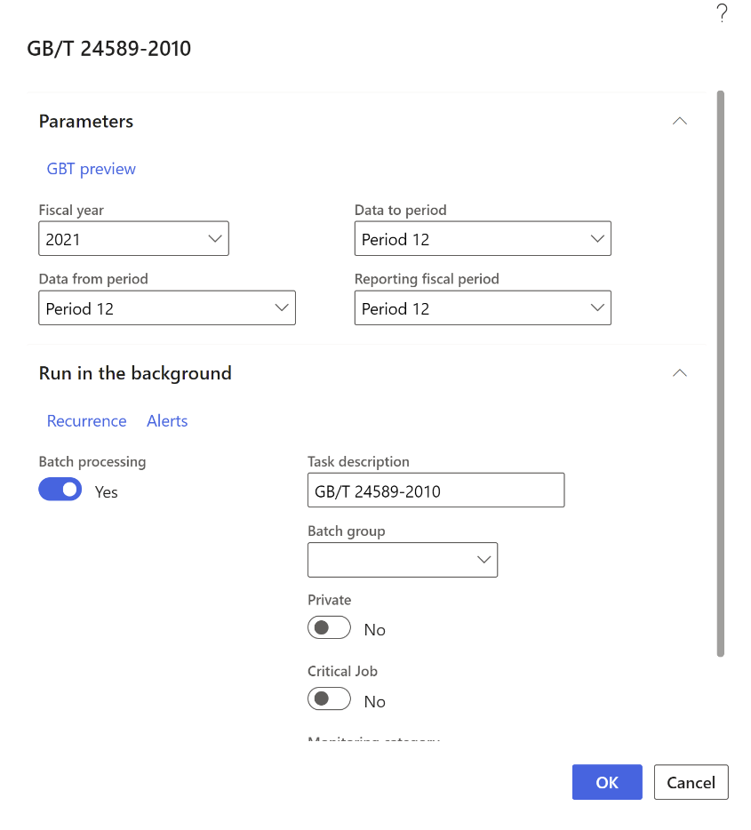
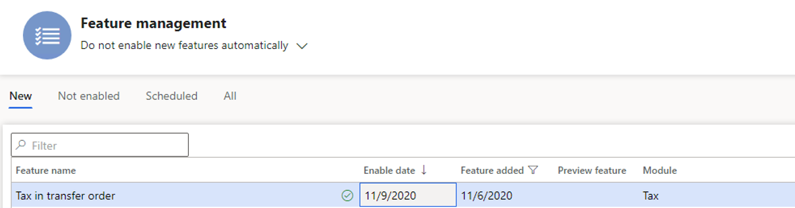

---
# required metadata

title: Journal reports
description: This topic provides information about unrealized and realized value-added tax (VAT) for Thailand. 
author: anasyash
ms.date: 03/31/2021
ms.topic: article
ms.prod: 
ms.technology: 

# optional metadata

ms.search.form: TaxTable, VendParameters, CustParameters
audience: Application User
# ms.devlang: 
ms.reviewer: kfend
ms.search.scope: Core, Operations
# ms.tgt_pltfrm: 
ms.custom: 265924
ms.assetid: 829a101f-e329-48b9-baf8-e36670ff43c8
ms.search.region: Thailand
# ms.search.industry: 
ms.author: anasyash
ms.search.validFrom: 2016-11-30
ms.dyn365.ops.version: Version 1611

---

# Journal reports (Posting journals)

[!include [banner](../includes/banner.md)]

Periodically, Belgian companies must print a report for each journal.
The report provides a chronological list of all the postings to the
general ledger accounts for each journal. These reports prove the
integrity of the accountancy and are used during financial audits to
reconcile VAT settlement with the postings on the corresponding general
ledger accounts.

There are five types of reports you can generate.

- **Purchase journal** - Provides an overview of all purchases.

- **Sales journal** - Provides an overview of all sales.

- **Financial journal** - Provides an overview of all financial
    entries.

- **Other journal** - Provides an overview of all diverse operations.

- **Overview journal** - Provides an overview of all the printed
    journals.

These reports are available only to legal entities whose primary address
is in Belgium.

Each report consists of several sections and summaries including:

-   A detailed overview of the postings to the general ledger accounts.

-   A summary of the postings to the general ledger accounts.

-   A detailed overview of tax posting.

-   A summary of tax posting.

-   A summary of the tax amount boxes used in the selected journal.

You can set the following parameters when you generate a report.

| **Field** | **Description** |
|-------------------------|-------------------------|
| Journal | Select the name of the sales journal to use to post transactions to the general ledger account. |
| From date | Select or enter the start date of the reporting period. |
| To date | Select or enter the end date of the reporting period. |
| Final print | Set to **Yes** to print the final version of the report. When you select **Final print**, the following occurs: <ol style="list-style-type: decimal"> <li>The **From date** you selected must belong to the period following the period of the last final printout end date. This validation depends on the value entered in the **Journal** field. If the field is empty, all of the posting journals that belong to this type (purchase, sales, financial, or other) are validated.</li> <li>The page number of the report is sequential. The page number of the previous periods +1 is used as basis for the new numbering. Page numbering starts at zero for each new fiscal year.</li> <li>A new line is added in the final print form for each posting journal.</li> </ol> |
| Compress | Select this option to group amounts on the same ledger account in the same voucher into one line. <ul> <li>When set to **No**, each transaction is shown on a separate line.</li> <li>When set to **Yes**, transactions are grouped by account and shown as one summarized line.</li> </ul> |

## Setup

The reports are linked to the posting journals in the general ledger by
number sequences. For each posting journal, select the journal type,
either purchase, sales, other, or financial, or you can leave the field
empty.

1.  Go to **General ledger** &gt; **Journal setup** &gt; **Posting
    journals**.

2.  On the Action Pane select **Create** to generate posting journals
    automatically. The posting journals are created to correspond with
    the number sequence codes.

    To create a posting journal manually, select **New**.

3.  Select a posting journal and in the **Belgian journal reports**
    section, in the **Journal type** field, select the journal type.

4.  Go to **Tax** &gt; **Indirect taxes** &gt; **Sales tax** &gt; **Item
    sales tax groups**.

5.  Select an item sales tax group, and in the **Reporting type** field,
    select where the item sales tax line amount will be included on the
    European Union (EU) sales list.

    - **Blank** - The sales tax line amount is included in the **Not
        assigned** column.

    - **Item** - The sales tax line amount is included in the
 **Items** column.

    - **Service** - The sales tax line amount is included in the
 **Services** column.

    - **Investment** - The sales tax line amount is included in the
 **Investment** column.

## Sales journals report

The **Sales journals** report displays and prints a summary of sales
transactions, such as sales invoices and credit memos that are posted to
the general ledger. This report summarizes the following:

-   The payment transactions per voucher and general ledger account.

-   The overall debits and credits per general ledger account.

-   The tax details per tax code and voucher number, including the tax base amount and tax amount distribution against goods, services, and investments.

-   A list of the tax postings sorted by their corresponding tax reporting codes.

This report is typically used by collections agents, collections
managers, chief financial officers, accounts receivable clerks, accounts
receivable managers, and financial controllers to review the status of
the invoices and the cash process.

Go to **General ledger** &gt; **Inquiries and reports** &gt; **Journal
reports** &gt; **Sales journals** and set the parameters to generate the
report.

## Purchase journals report

The **Purchase journals** report displays and prints a summary of the
transactions in a purchase journal. This report is typically used by
accounts payable coordinators and accountants.

Go to **General ledger** &gt; **Inquiries and reports** &gt; **Journal
reports** &gt; **Purchase journals** and set the parameters to generate
the report.

## Financial journal report

The **Financial journals** report displays and prints a summary of
financial transactions, such as customer payments and vendor payments,
that are posted to the general ledger account. This report summarizes
the following:

-   The payment transactions per voucher and general ledger account.

-   The overall debits and credits per general ledger account.

-   The tax details per tax code and voucher number, including the tax
    base amount and tax amount distribution against goods, services, and
    investments.

-   A list of the tax postings sorted by their corresponding tax
    reporting codes.

This report is typically used by chief executive officers, chief
financial officers, compliance managers, accounting managers, accounting
supervisors, and financial controllers to review the status of the
general ledger process.

Go to **General ledger** &gt; **Inquiries and reports** &gt; **Journal
reports** &gt; **Financial journals** and set the parameters to generate
the report.

## Other journal report

The **Other journal** report displays and prints a summary of the posted
transactions that are not categorized under sales, purchases, or
financials. This report is typically used by accountants, accounting
managers, clerks, accounting supervisors, and compliance managers to
inquire into journal transactions.

Go to **General ledger** &gt; **Inquiries and reports** &gt; **Journal
reports** &gt; **Other journals** and set the parameters to generate the
report.

## Overview journal report

The **Overview journal** report displays and prints a summary of the
posted transactions that aren't categorized under sales, purchases, or
financials.

This report is typically used by accountants, accounting managers,
clerks, accounting supervisors, and compliance managers to inquire into
journal transactions.

## Example

The following example shows how you can set up posting journals and
generate and print the posting journals reports. This example uses the
FRRT legal entity.

1.  Go to **Organization administration** &gt; **Organization** &gt;
 **Legal entities**, and select the FRRT legal entity.

2.  On the **Address** FastTab, select **Edit**. In the
 **Country/region** field, select BEL (Belgium).

3.  Go to **General ledger** &gt; **Journal Setup** &gt; **Posting
    journals**.

4.  On the Action Pane, select **Create**.

5.  Set the **Journal type** for the journals according to the following
    table.

| **Journal** | **Journal type** |
|-------------------------|-------------------------|
| Acco_46 | Sales |
| Acco_67 | Purchase |
| JourNdF | Financial |
| ODComptabl | Other |

1.  Go to **Tax** &gt; **Indirect taxes** &gt; **Sales tax** &gt; **Item
    sales tax groups**.

2.  Select the **NORMAL** item sales tax group and in the **Reporting
    type** field, select **Item**.

3.  Go to **Tax** &gt; **Indirect taxes** &gt; **Sales tax** &gt;
 **Sales tax authorities**.

4.  Select the **TAXFRA** and on the **General** FastTab, in the
 **Report layout** field, select **Belgium report layout**.

5.  Go to **Tax** &gt; **Setup** &gt; **Sales tax** &gt; **Sales tax
    reporting codes** and create the following reporting codes.

| **Reporting layout** | **Reporting code** | **Report text** |
|-------------------------|-------------------------|-------------------------|
| Belgium reporting layout | 03 | Taxable supplies and services at a sales tax rate of 21 percent. The delivery of a product or service transactions at a sales tax rate of 21 percent. |
| Belgium reporting layout | 54 | VAT that is payable on the turnover that is included in codes **01**, **02**, and **03**. |
| Belgium reporting layout | 81 | Amount of all purchases of goods, raw materials, and consumables, and related acquisition costs, excluding VAT deductible. |
| Belgium reporting layout | 59 | Amount of deductible VAT. |

For more information, see [Set up sales tax reporting
codes](https://docs.microsoft.com/dynamics365/finance/localizations/emea-bel-intervat-tax-declaration#set-up-sales-tax-reporting-codes).

1.  Go to **Tax** &gt; **Indirect taxes** &gt; **Sales tax** &gt;
 **Sales tax codes**.

2.  Select **TVA19.6**, and on the **Report setup** FastTab, in the
 **Sale** section, select the following:

    -   In the **Taxable sales** field, select 03.

    -   In the **Sales tax payable** field, select 54.

3.  In the **Purchase** section, select the following:

    -   In the **Tax purchases** field, select 81.

    -   In the **Sales tax receivable**, select 59.

### Print the Sales journal report

To print the **Sales journal** report, follow these steps:

1.  Go to **Accounts receivable** &gt; **Invoices** &gt; **All free text
    invoices**.

2.  Select **New** and create a new free text invoice with the following
    information:

    -   In the **Customer** **account** field, select 1001.

    -   In the **Date field,** select 4/15/2021.

    -   On the **Invoice lines** FastTab, in the **Main account** field,
        select **701000**.

    -   In the **Sales tax group** field, select VE-DOM.

    -   In the **Item sales tax group** field, select NORMAL.

    -   In the **Quality** field, enter 1.

    -   In the **Unit price** field, enter 100.

3.  Post the free text invoice.

4.  Go to **General ledger** &gt; **Inquiries and reports** &gt;
 **Journal reports** &gt; **Sales journals.**

5.  In the **Criteria** section, in the **Journal** field, select
    Acco\_46.

6.  In the **From date** field, select 4/1/2021.

7.  In the **To date** field, select 4/30/2021.

8.  In the **Final print** field, select **Yes**. Select **OK** to
    review the report.

### Print the Purchase journal report

To print the **Purchase journal** report, follow these steps:

1.  Go to **Accounts payable** &gt; **Purchase orders** &gt; **All
    purchase orders**.

2.  Select **New** and create a new purchase order with the following
    information:

    -   In the **Vendor account** field, select **1001**.

    -   In the **Item number** field, select **0001**.

    -   In the **Quality** field, enter 3.

    -   On the **Line details** FastTab, on the **Setup** tab, in the
 **Sales tax** section, in the **Item sales tax group**, select
 **NORMAL**. In the **Sales tax group**, select **VE-DOM**.

3.  Go to **Purchase** &gt; **Actions** &gt; **Confirm**.

4.  Go to **Invoice** &gt; **Generate** &gt; **Invoice**.

5.  In the **Invoice identification** section, in the **Number** field,
    enter INVNUM\_001.

6.  In the **Invoice dates** section, in the **Invoice date** field,
    select 4/12/2021.

7.  In the **Posting date** field, select 4/12/2021.

8.  Post the order.

9.  Go to **General ledger** &gt; **Inquiries and reports** &gt;
 **Journal reports** &gt; **Purchase journals.**

10. In the **Criteria** section, in the **Journal** field, select
 **Acco\_67**.

11. In the **From date** field, select 4/1/2021.

12. In the **To date** field, select 4/30/2021.

13. In the **Final print** field, select **Yes**. Select **OK** to view
    the report.

### Print the Financial journal report

To print the **Financial journal** report, follow these steps:

1.  Go to **General ledger** &gt; **Journal entries** &gt; **General
    journals**.

2.  Create a new journal. In the **Name** field, select **JourNdF**.

3.  Select **Lines**, and enter the following information:

    -   In the **Date** field, select **4/15/2021**.

    -   In the **Account type** field, select **Customer**.

    -   In the **Account** field, select **1001**.

    -   In the **Credit** field, enter 100.

    -   In the **Offset account type** field, select **Bank**.

    -   In the **Offset account** field, select **FRRT OPER**.

    -   In the **Item sales tax group** field, select **NORMAL**.

    -   In the **Sales tax group** field, select **VE-DOM**.

4.  Post the journal.

5.  Go to **General ledger** &gt; **Inquiries and reports** &gt;
 **Journal reports** &gt; **Financial journals.**

6.  In the **Criteria** section, in the **Journal** field, select
 **JourNdF**.

7.  In the **From date** field, select 4/1/2021.

8.  In the **To date** field, select 4/30/2021.

9.  In the **Final print** field select **Yes**. Select **OK** to review
    the report.

Print the Other journal report

To print the **Other journal** report, follow these steps:

1.  Go to **General ledger** &gt; **Journal entries** &gt; **General
    journals**.

2.  Create a new journal. In the **Name** field, select ODComptabl.

3.  Go to **Lines** and enter the following information:

    -   In the **Date** field, select 4/15/2021.

    -   In the **Account type** field, select **Customer**.

    -   In the **Account** field, select **1001**.

    -   In the **Debit** field, enter 100.

    -   In the **Offset account type** field, select **Bank**.

    -   In the **Offset account** field, select **FRRT OPER**.

    -   In the **Item sales tax group** field, select **NORMAL**.

    -   In the **Sales tax group** field, select **VE-DOM**.

4.  Post the journal.

5.  Go to **General ledger** &gt; **Inquiries and reports** &gt;
 **Journal reports** &gt; **Other journals.**

6.  In the **Criteria** section, in the **Journal** field, select
    ODComptabl.

7.  In the **From date** field, select 5/1/2021.

8.  In the **To date** field, select 5/31/2021.

9.  In the **Final print** field, select **Yes**.

10. Select **OK** and review the report result.

Print overview journal report

To print the **Overview journal** report, follow these steps:

1.  Go to **General ledger** &gt; **Inquiries and reports** &gt;
 **Journal reports** &gt; **Overview journals.**

2.  In the **From date** field, select 4/1/2021.

3.  In the **To date** field, select 5/31/2021.

4.  Select **OK** and review the report result.

