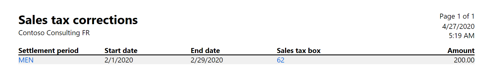
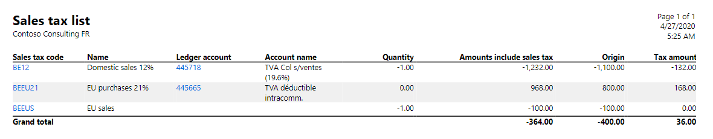
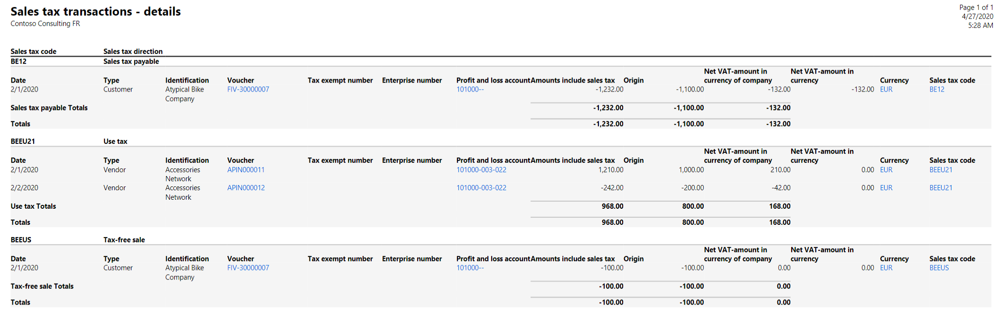
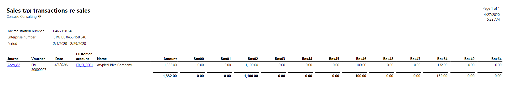
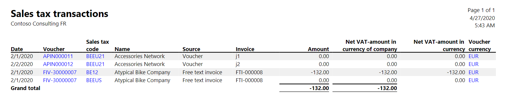
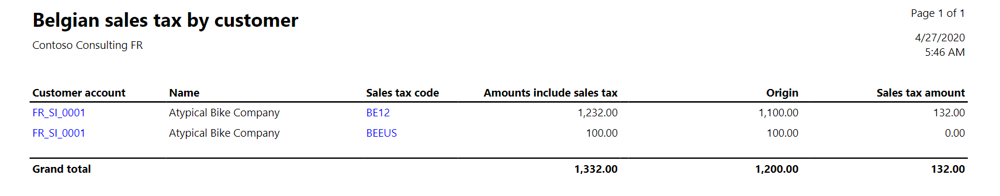
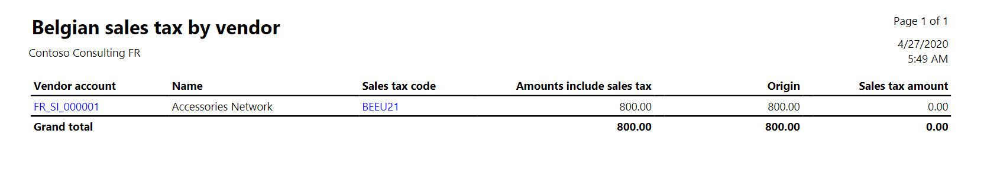
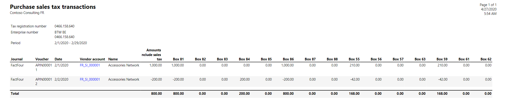

# Reconciliation reports for Belgium

[!include [banner](../includes/banner.md)]

> [!NOTE]
> This feature has been replaced with the VAT declaration functionality. For more information, see [VAT declaration (Belgium)](emea-bel-vat-declaration-belgium.md).

Dynamics 365 Finance has evolved into purpose-built applications to help you manage specific business functions. For more information about these changes, see [Dynamics 365 Licensing Guide](https://go.microsoft.com/fwlink/?LinkId=866544).

This article describes the standard reports that are provided to help you with the INTERVAT tax declaration and reconciliation analysis.

Based on the sales tax entries for selected periods, the Belgian periodic value-added tax (VAT) declaration combines sales tax amounts into boxes (sales tax reporting codes) by sorting, splitting, and totaling information in specific ways. Therefore, control reports are required, so that the amounts in the VAT declaration can be verified in detail. The rest of this article describes the reports that include details of the data in the VAT declaration.

Screenshots presented in this article show data based on transactions from an example in the article, [INTERVAT tax declaration](emea-bel-intervat-tax-declaration.md).

## Sales tax correction
The **Sales tax correction** report gives a printed overview of INTERVAT tax corrections. The correction amount is listed for each settlement period and sales tax box. (Sales tax boxes are Belgium-specific fields that are used to group VAT sales tax amounts in the VAT declaration. You set up these boxes in the **Sales tax reporting codes** table.)

To print the **Sales tax correction** report, go to **Tax** \> **Declarations** \> **Sales tax** \> **Additional sales tax report boxes**, and then click **Tax corrections** \> **Print.**

## Sales tax list - Belgium
Use the **Sales tax list - Belgium** report to view information about posted sales tax. The report gives details about the sales tax code, name, ledger account, account name, quantity, amount inclusive of sales tax, origin, and tax amount. The parameters for this report give you lots of flexibility. You can get a very precise report by selecting the voucher, date, or sales tax code parameters. Use a filter to set up report parameters.

To print the **Sales tax list - Belgium** report, go to **Tax** \> **Inquiries and reports** \> **Sales tax reports** \> **Sales tax list - Belgium**.

## Sales tax transactions - Details  Belgium
Use the **Sales tax transactions - Details - Belgium** report to view and print information about posted sales tax transactions for a specified period and a specific range of sales tax codes. The transactions are listed by sales tax code. For each transaction, you can see the customer or vendor, the voucher number, the account that the sales tax base amount (origin) is posted to, the sales tax base amount, the amount inclusive of sales tax, the sales tax amount, the sales tax charge, and the sales tax direction. The amounts are summed for each tax code. The amounts for the Sales tax receivable and Sales tax payable sales tax directions are summed in a grand total. The report also lists sales tax codes that have other sales tax directions, such as Use tax.

To print the **Sales tax transactions - Details - Belgium** report, go to **Tax** \> **Inquiries and reports** \> **Sales tax reports** \> **Sales tax transactions - Details - Belgium**.

## Sales tax transactions re sales
You can use the **Sales tax transactions re sales** report to retrieve sales tax transaction resale information that is specific to Belgium. This information includes relevant details such as the journal, voucher, date, customer account, name, amount, and sales tax reporting codes. This report is created-by tax exempt number, enterprise number, and period. Account managers and bookkeepers generate this report periodically or as it's required.

> [!NOTE]
> The number of boxes should be added dynamically, based on the posting of purchases.

To print the **Sales tax transactions re sales** report, go to **Tax** \> **Inquiries and reports** \> **Sales tax reports** \> **Sales tax transactions re sales**.

## Sales tax transactions - Belgium

The **Sales tax transactions - Belgium** report shows the Belgian sales tax transactions that have been posted. The report gives details about the date, voucher, sales tax code, name, source, invoice, amount, net VAT amount in the company currency, net VAT amount in the voucher currency and voucher currency.

You can sort the report by voucher, date, voucher currency, sales tax code, and source. The **Voucher**, **Sales tax code**, and **Voucher currency** fields provide drill-through. The parameters for this report give you lots of flexibility. You can get a very precise report by selecting the voucher, date, or sales tax code parameters. Use a filter to set up report parameters.

To print the **Sales tax transactions - Belgium** report, go to **Tax** \> **Inquiries and reports** \> **Sales tax reports** \> **Sales tax transactions - Belgium**.

## Sales tax by customer - Belgium

Control reports are required, so that the amounts in the VAT declaration can be verified in detail on a customer. For each customer account and sales tax code, the following information is printed:

-   Customer account number
-   Sales tax code
-   Amount inclusive of sales tax
-   Origin
-   Sales tax amount
-   Total per customer account
-   Grand total for all customer accounts

This report can be generated as follows:

-   For one customer account or all customer accounts
-   For one sales tax code or all sales tax codes
-   For one specific date or a range of dates

The parameters for this report give you lots of flexibility. You can get a very precise report by selecting the customer account, date, or sales tax code parameters. Use a filter to set up report parameters more precisely.  To print the **Sales tax** **by customer - Belgium** report, click **Tax** &gt; **Inquiries and reports** &gt; **Sales tax reports** &gt; **Sales tax** **by customer - Belgium**.

## Sales tax by vendor - Belgium

Control reports are required, so that the amounts in the VAT declaration can be verified in detail on a vendor. For each vendor account and sales tax code, the following information is printed:

-   Vendor account number
-   Sales tax code
-   Amount inclusive of sales tax
-   Origin
-   Sales tax amount
-   Total per vendor account
-   Grand total for all vendor accounts

This report can be generated as follows:

-   For one vendor account or all vendor accounts
-   For one sales tax code or all sales tax codes
-   For one specific date or a range of dates

The parameters for this report give you lots of flexibility. You can get a very precise report by selecting the vendor account, date, or sales tax code parameters. Use a filter to set up report parameters more precisely. 
To print the **Sales tax** **by vendor - Belgium** report, click **Tax** &gt; **Inquiries and reports** &gt; **Sales tax reports** &gt; **Sales tax** **by vendor - Belgium**.

## Purchase sales tax transactions
The **Purchase sales tax transactions** report shows transactions that have a purchase duty. The purchase duty is calculated and posted together with sale tax payments. Both purchase duties and sales taxes are reported for the settlement period. 
The settlement period is defined per sales tax authority on the **Sales tax settlement periods** page. 
The information in the header section of the report provides includes relevant details such as the tax exempt number, enterprise number, period. 
The information in the details section includes the journal, voucher, date, vendor account, name, amount inclusive of sales tax, and sales tax reporting codes. This report is an external report. The accountant or accounting manager periodically generates it and submits to the appropriate authorities. 
To print the **Purchase sales tax transactions** report, click **Tax** &gt; **Inquiries and reports** &gt; **Sales tax reports** &gt;**Purchase sales tax transactions**.

> [!NOTE]
> We recommend you enable the **(Belgium) Report corrections in purchase sales tax transactions report** feature in the **Feature management** workspace. With this feature enabled, the purchases posted as corrections in settled sales tax periods are reflected in the **Purchase sales tax transactions report** in the same period as the [INTERVAT tax declaration](emea-bel-intervat-tax-declaration.md), specifically in the report for the current open period.

[!INCLUDE[footer-include](../../includes/footer-banner.md)]
