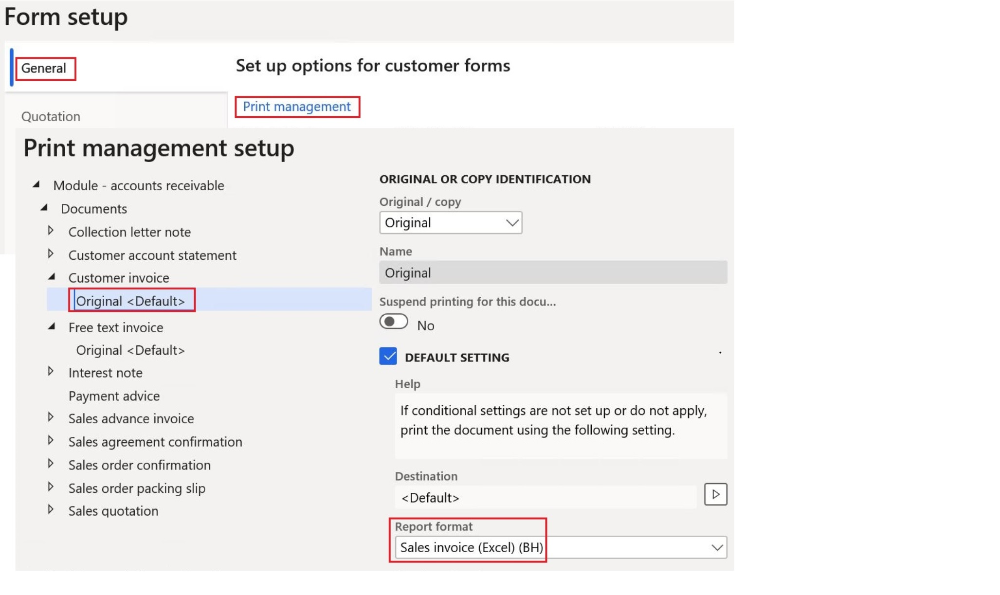

---
# required metadata

title: Configure invoice layout for Bahrain
description: This topic explains how to configure the invoice layout for Bahrain.
author: ilkond
manager: AnnBe
ms.date: 08/27/2020
ms.topic: article
ms.prod: 
ms.service: dynamics-ax-applications
ms.technology: 

# optional metadata

ms.search.form: 
audience: Application User
# ms.devlang: 
ms.reviewer: kfend
ms.search.scope: Core, Operations
# ms.tgt_pltfrm: 
# ms.custom: 
ms.search.region: Bahrain
# ms.search.industry: 
ms.author: ilyako
ms.search.validFrom: 2020-06-03
ms.dyn365.ops.version: 10.0.13

---

# Configure invoice layout for Bahrain

[!include [banner](../includes/banner.md)]

<table>
<tbody>
<tr>
<td><strong>Country/region</strong></td>
<td>BHR - Bahrain</td>
</tr>
<tr>
<td><strong>Feature title</strong></td>
<td>Configure invoice layout for Bahrain</td>
</tr>
<tr>
<td><strong>Feature reference</strong></td>
<td>BH-00003</td>
</tr>
<tr>
<td><strong>Blueprint classification</strong></td>
<td>INVOICING: Invoice layout / e-invoicing</td>
</tr>
<tr>
<td><strong>Configurable</strong></td>
<td>Yes. See the list of configurations in the <a href="#ERConfigs">Import Electronic reporting configurations</a> section.</td>
</tr>
<tr>
<td><strong>Internal reference</strong></td>
<td><a href="https://vstsmbs.visualstudio.com/Compliance/_queries/edit/3982346">Compliance 3982346</a></td>
</tr>
<tr>
<td><strong>First available</strong></td>
<td>2020 Release Wave 2 (Monthly update 10.0.13)</td>
</tr>
<tr>
<td><strong>Feature update history</strong></td>
<td></td>
</tr>
<tr>
<td><strong>Feature management</strong></td>
<td>Activation isn't required. See the information about related features in the <a href="#features">Turn on features</a> section.</td>
</tr>
<tr>
<td><strong>Business need</strong></td>
<td>The layout of printable invoices must comply with Bahraini legal requirements.</td>
</tr>
<tr>
<td><strong>Feature description</strong></td>
<td>This topic explains how to configure printable invoice layouts to ensure compliance with Bahraini legal requirements. Bahrain-specific invoice layouts are implemented by using the concept of <i>configurable business documents</i>. For more information about configurable business documents, see <a href="../../fin-and-ops/dev-itpro/analytics/er-business-document-management.md">Business document management overview</a>.</td>
</tr>
</tbody>
</table>

## Prerequisites

The primary address of the legal entity must be in Bahrain.

## Turn on features

In the **Feature management** workspace, turn on the following features:

- (Bahrain) Credit invoicing layout for sales and project invoice reports
- Convert Electronic reporting outbound documents from Microsoft Office formats to PDF

For more information about how to turn on features, see [Feature management overview](../../fin-and-ops/get-started/feature-management/feature-management-overview.md).

## Import Electronic reporting configurations

In the **Electronic reporting** workspace, import the following Electronic reporting (ER) formats from the repository:

- Sales invoice (Excel) (BH)
- Free text invoice (Excel) (BH)
- Project invoice (Excel) (BH)
- Project contract line items (Excel) (BH)
- Project manage invoice (Excel) (BH)

> [!NOTE]
> These formats are derived from related standard formats, based on the invoice model, and they use the invoice model mapping. All required additional configurations will be automatically imported.

For more information about how to import ER configurations, see [Download Electronic reporting configurations from Lifecycle Services](../../dev-itpro/analytics/download-electronic-reporting-configuration-lcs.md).

## Configure conversion to PDF

By default, invoices are generated as Microsoft Excel files. To enable their conversion to PDF format, follow these steps.

1. In the **Electronic reporting** workspace, in the **Related links** section, select **Electronic reporting destination**.
2. On the **Electronic reporting destination** page, create destinations for the following related formats:

    - Sales invoice (Excel) (BH)
    - Free text invoice (Excel) (BH)
    - Project invoice (Excel) (BH)
    - Project contract line items (Excel) (BH)
    - Project manage invoice (Excel) (BH)
 
3. For each format, follow these steps:

    1. Select the **Convert to PDF** check box.
    2. In the **Page orientation** field, select **Portrait**.
    3. Select **Settings**, and then, on the **Destination settings** page, on the **Screen** tab, set the **Enabled** option to **Yes** to enable printing to the screen.

## Configure parameters

### Configure Print management 

1. Go to **Accounts receivable** \> **Setup** \> **Forms** \> **Forms setup**.
2. On the **Form setup** page, on the **General** tab, select **Print management**.
3. On the **Print management setup** page, define the references to the imported formats for the following documents:

    - **Customer invoice:** In the **Report format** field, select **Sales invoice (Excel) (BH)**.
    - **Free text invoice:** In the **Report format** field, select **Free text invoice (Excel) (BH)**.

    

4. Go to **Project management and accounting** \> **Setup** \> **Forms** \> **Forms setup**.
5. On the **Form setup** page, on the **General** tab, select **Print management**.
6. On the **Print management** page, define the references to the imported formats for the following documents:

    - **Project invoice without billing rules:** In the **Report format** field, select **Project invoice (Excel) (BH)**.
    - **Project invoice with billing rules:** In the **Report format** field, select **Project contract line items (Excel) (BH)**.
    - **User defined project invoice:** In the **Report format** field, select **Project manage invoice (Excel) (BH)**.

### Configure sales tax specification

1. Go to **Accounts receivable** \> **Setup** \> **Forms** \> **Forms setup**.
2. On the **Form setup** page, on the **General** tab, in the **Sales tax specification** field, select **Registration and company currency**.

    

3. Go to **Project management and accounting** \> **Setup** \> **Forms** \> **Forms setup**.
4. On the **Form setup** page, on the **General** tab, in the **Sales tax specification** field, select **Registration and company currency**.

### Configure packing slip specification

1. Go to **Accounts receivable** \> **Setup** \> **Forms** \> **Forms setup**.
2. On the **Form setup** page, on the **Invoice** tab, select the **Print packing slip specifications** check box.

    

3. Go to **Project management and accounting** \> **Setup** \> **Forms** \> **Forms setup**.
4. On the **Form setup** page, on the **Invoice** tab, select the **Print packing slip specifications** check box.

### Activate credit invoicing 

1. Go to **Accounts receivable** \> **Setup** \> **Accounts receivable parameters**.
2. On the **Accounts receivable parameters** page, on the **Updates** tab, on the **Invoice** FastTab, set the **Apply the credit invoicing layout into sales and project invoice reports** option to **Yes**.

## Generate invoices

After you've completed all the previous procedures in this topic, you can print invoices that are based on sales orders and free text invoices, in accordance with Bahraini legal requirements.
