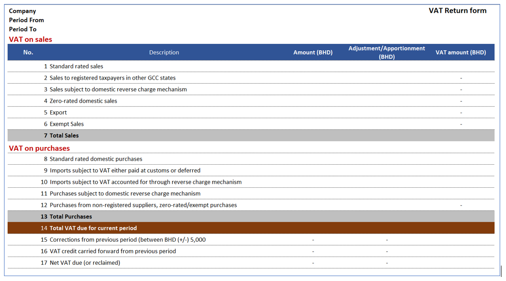
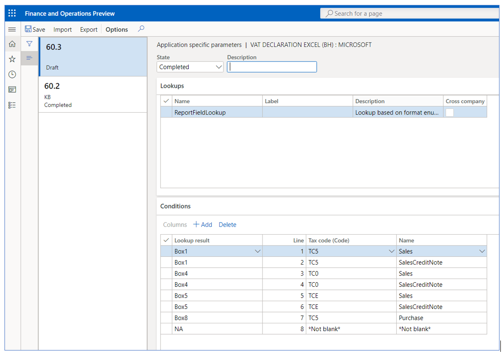

---
# required metadata

title: VAT declaration for Bahrain
description: This topic explains how to configure and generate the VAT return form for Bahrain.
author: sndray
ms.date: 08/28/2020
ms.topic: article
ms.prod: 
ms.technology: 

# optional metadata

ms.search.form: 
audience: Application User
# ms.devlang: 
ms.reviewer: kfend
# ms.tgt_pltfrm: 
# ms.custom: 
ms.search.region: Bahrain
# ms.search.industry: 
ms.author: sndray
ms.search.validFrom: 2020-06-03
ms.dyn365.ops.version: 10.0.13

---

# VAT declaration for Bahrain (BH-00002)

[!include [banner](../includes/banner.md)]

## Overview

This topic explains how to set up and generate the VAT return form for legal entities in Bahrain.

The VAT return form for Bahrain is the official document that summarizes the total output VAT tax amount due, the total input VAT tax amount recoverable, and the related VAT tax amount  liability. The form is used for all types of taxpayers and should be completed manually through the tax authority portal. The VAT return form is commonly referred to as *VAT return filing*.

The VAT return form in Dynamics 365 Finance includes the following reports:

 - VAT return form, which provides a breakdown of amounts, adjustments, and VAT amount per line item in the VAT return form as is described in the legislation.
 - Sales transactions details grouped by box classification from Box1 to Box6.
 - Purchase transaction details grouped by box classification from Box8 to Box12.
 
 
## Prerequisites

- The primary address of the legal entity must be in Bahrain.

In the **Feature management** workspace, enable the following features:
- (Bahrain) Category hierarchy for Sales and purchase tax report.

For more information about how to enable features, see [Feature management overview](../../fin-ops-core/fin-ops/get-started/feature-management/feature-management-overview.md).

In the **Electronic reporting** workspace, import the following Electronic Reporting formats from the repository:

 - VAT declaration Excel (BH)

> [!NOTE]
> The formats above are based on **Tax declaration model** and use **Tax declaration model mapping**. These additional configurations will be automatically imported.

For more information about how to import Electronic Reporting configurations, see [Download Electronic reporting configurations from Lifecycle Services](../../fin-ops-core/dev-itpro/analytics/download-electronic-reporting-configuration-lcs.md).

## Download Electronic reporting configurations

The implementation of the VAT return form for Bahrain is based on Electronic reporting (ER) configurations. For more information about the capabilities and concepts of configurable reporting, see [Electronic reporting](../../fin-ops-core/dev-itpro/analytics/general-electronic-reporting.md).

For production and user acceptance testing (UAT) environments, follow the instructions [Download Electronic reporting configurations from Lifecycle Services](../../fin-ops-core/dev-itpro/analytics/download-electronic-reporting-configuration-lcs.md).

To generate the VAT return form and related reports in a Bahrain legal entity, you need to upload the following configurations:
  - Tax declaration model.version.64.xml 
  - Tax declaration model mapping.version.64.90.xml 
  - VAT Declaration Excel (BH).version.64.6 or a later version
 
After you've finished downloading the ER configurations from Lifecycle Services (LCS) or the global repository, complete the following steps.

 1. Go to the **Electronic reporting workspace**. Select the **Reporting configurations** tile. 
 2. On the **Configurations** page, on the Action Pane, select **Exchange** > **Load from XML file**.
 3. Upload all the files in the order in which they are listed in the previous bullets. After all the configurations are uploaded, the configuration tree should be present in Finance.
 
### Set up application-specific parameters

The VAT declaration form includes a set of boxes (lines) that correspond to specific parts of the VAT return process. Each box should include information about the base, adjustment, and VAT amounts. To include the requirements established by the form, you must configure each box with the information that is automatically provided from the sales tax transactions generated from sales, purchases, or other operations where VAT tax is posted through the sales tax code configuration.

#### Example

**Line/Box1 - Standard rated sales:**  Per legal definition, this box includes the total amount of standard rated goods and services (excluding collected VAT) sold during the current period in The Kingdom of Bahrain, and the VAT that was collected on the sale or adjustments to similar sales made in the previous reporting periods. Examples of adjustments include:

- The return of goods and services by customers on which you have declared/paid VAT to NBR (National Bureau for Revenue).
- Sales made to tourists under a VAT refunds for tourist scheme and refunded to the refund operator.
- Bad debt write-off on standard-rated receivables.

In Finance, you can have a specific sales tax code implemented that represents and calculates the operations at a standard sales rate. In this example, it is necessary to configure **Box1** as follows.

The Application-specific parameters option let the users to establish the criteria of how the tax transactions will be collected and calculated in each box (line) of the declaration form when the report is generated depending on the configuration of sales tax code.

1. In the Electronic reporting workspace, select **Configurations** > **Setup** to set up the rules to identify the tax transaction into the related box of the VAT return form.
2. Select the current version. On the **Lookups** FastTab, select the lookup name **ReportFieldLookup**. This lookup identifies the list of boxes (lines) in the VAT form required by tax authority. 
3. On the **Conditions** FastTab, select **Add**, and in the new line in the **Lookup result** column, select the related line of VAT return form.
4. In the **Tax code (Code)** column, select the sales tax code that is used to calculate the related line of VAT return form.
5. In the **Name** column, select the tax transaction classification where the sales tax code is used.
6. Repeat steps 3-5 for all VAT return form boxes (lines) and the combination of sales tax code and tax transaction types configured in your legal entity.
7. Select **Add** again, and then follow these steps to include the final record line:
   a. In the **Lookup result** column, select **NA**.
   b. In the **Tax code (Code)** column, select **Not blank**.
   c. In the **Name column**, select **Not blank**.

By adding this last record (NA), you define the following rule: When the tax code and name that is passed as an argument doesn't satisfy any of the previous rules, the transactions will not be included in the VAT return form. Although this rule is not used when generating the report, the rule does help to avoid errors in report generation when there is a missing rule configuration. 
	
8. In the **State** field, select **Completed**, and then select **Save**. 
9. Close the **Application specific parameters** page.

The following table represent an example of how the user needs to configure these parameters to establish the configuration between the different boxes in the declaration form and sales tax code configuration implemented in Finance.

|     Lookup result     |     Label                                                                                 |     Tax code (Code)     |     Name                               |
|-----------------------|-------------------------------------------------------------------------------------------|-------------------------|----------------------------------------|
|     Box1              |     Standard rated   sales                                                                |     VAT_ST              |     Sales                              |
|     Box1Adj           |     Standard rated   sales adjustment                                                     |     VAT_STA             |     Sales                              |
|     Box1              |     Standard rated   sales                                                                |     VAT_ST              |     SalesCreditNote                    |
|     Box1Adj           |     Standard rated   sales adjustment                                                     |     VAT_STA             |     SalesCreditNote                    |
|     Box3              |     Sales   subject to domestic reverse charge mechanism                                  |     VAT_RV              |     SalesReverseCharge                 |
|     Box3Adj           |     Sales   subject to domestic reverse charge mechanism adjustment                       |     VAT_RVA             |     SalesReverseCharge                 |
|     Box3              |     Sales   subject to domestic reverse charge mechanism                                  |     VAT_RV              |     SalesReverseChargeCreditNote       |
|     Box3Adj           |     Sales   subject to domestic reverse charge mechanism adjustment                       |     VAT_RVA             |     SalesReverseChargeCreditNote       |
|     Box4              |     Zero-rated   domestic sales                                                           |     VAT_0%              |     Sales                              |
|     Box4Adj           |     Zero-rated   domestic sales adjustment                                                |     VAT_0%A             |     Sales                              |
|     Box4              |     Zero-rated   domestic sales                                                           |     VAT_0%              |     SalesCreditNote                    |
|     Box4Adj           |     Zero-rated   domestic sales adjustment                                                |     VAT_0%A             |     SalesCreditNote                    |
|     Box5              |     Export                                                                                |     VAT_EXP             |     Sales                              |
|     Box5Adj           |     Export   adjustment                                                                   |     VAT_EXPA            |     Sales                              |
|     Box5              |     Export                                                                                |     VAT_EXP             |     SalesCreditNote                    |
|     Box5Adj           |     Export   adjustment                                                                   |     VAT_EXPA            |     SalesCreditNote                    |
|     Box6              |     Exempt   Sales                                                                        |     VAT_EXE             |     SaleExempt                         |
|     Box6Adj           |     Exempt   Sales Adjustment                                                             |     VAT_EXE             |     SaleExempt                         |
|     Box6              |     Exempt   Sales                                                                        |     VAT_EXE             |     SaleExemptCreditNote               |
|     Box6Adj           |     Exempt   Sales Adjustment                                                             |     VAT_EXE             |     SalesExemptCreditNote              |
|     Box8              |     Standard rated   domestic purchases                                                   |     VAT_ST              |     Purchase                           |
|     Box8adj           |     Standard rated   domestic purchases adjustment                                        |     VAT_ST              |     Purchase                           |
|     Box8              |     Standard rated   domestic purchases                                                   |     VAT_ST              |     PurchaseCreditNote                 |
|     Box8adj           |     Standard rated   domestic purchases adjustment                                        |     VAT_ST              |     PurchaseCreditNote                 |
|     Box9              |     Imports subject to   VAT either paid at customs or deferred                           |     VAT_IMP             |     Purchase                           |
|     Box9Adj           |     Imports subject to   VAT either paid at customs or deferred adjustment                |     VAT_IMPA            |     Purchase                           |
|     Box9              |     Imports subject to   VAT either paid at customs or deferred                           |     VAT_IMP             |     PurchaseCreditNote                 |
|     Box9Adj           |     Imports subject to   VAT either paid at customs or deferred adjustment                |     VAT_IMPA            |     PurchaseCreditNote                 |
|     Box10             |     Imports subject to   VAT accounted for through reverse charge mechanism               |     VAT_IRV             |     PurchaseReverseCharge              |
|     Box10Adj          |     Imports subject to   VAT accounted for through reverse charge mechanism adjustment    |     VAT_IRVA            |     PurchaseReverseCharge              |
|     Box10             |     Imports subject to   VAT accounted for through reverse charge mechanism               |     VAT_IRV             |     PurchaseReverseChargeCreditNote    |
|     Box10Adj          |     Imports subject to   VAT accounted for through reverse charge mechanism adjustment    |     VAT_IRVA            |     PurchaseReverseChargeCreditNote    |
|     Box11             |     Purchases subject   to domestic reverse charge mechanism                              |     VAT_PRV             |     PurchaseReverseCharge              |
|     Box11Adj          |     Purchases subject   to domestic reverse charge mechanism adjustment                   |     VAT_PRVA            |     PurchaseReverseCharge              |
|     Box11             |     Purchases subject   to domestic reverse charge mechanism                              |     VAT_PRV             |     PurchaseReverseChargeCreditNote    |
|     Box11Adj          |     Purchases subject   to domestic reverse charge mechanism adjustment                   |     VAT_PRVA            |     PurchaseReverseChargeCreditNote    |
|     Box12             |     Purchases from   non-registered suppliers, zero-rated/exempt purchases                |     VAT_0%              |     Purchase                           |
|     Box12Adj          |     Purchases from   non-registered suppliers, zero-rated/exempt purchases adjustment     |     VAT_0%A             |     Purchase                           |
|     Box12             |     Purchases from   non-registered suppliers, zero-rated/exempt purchases                |     VAT_0%              |     PurchaseCreditNote                 |
|     Box12Adj          |     Purchases from   non-registered suppliers, zero-rated/exempt purchases adjustment     |     VAT_0%A             |     PurchaseCreditNote                 |
|     Box12             |     Purchases from   non-registered suppliers, zero-rated/exempt purchases                |     VAT_EXE             |     PurchaseExempt                     |
|     Box12Adj          |     Purchases from   non-registered suppliers, zero-rated/exempt purchases adjustment     |     VAT_EXEA            |     PurchaseExempt                     |
|     Box12             |     Purchases from   non-registered suppliers, zero-rated/exempt purchases                |     VAT_EXE             |     PurchaseExemptCreditNote           |
|     Box12Adj          |     Purchases from   non-registered suppliers, zero-rated/exempt purchases adjustment     |     VAT_EXEA            |     PurchaseExemptCreditNote           |
|     Box15             |     Corrections from   previous period (between BHD (+/-) 5,000                           |     VAT_COR             |     Sales                              |
|     Box15             |     Corrections from   previous period (between BHD (+/-) 5,000                           |     VAT_COR             |     SalesCreditNote                    |
|     Box15             |     Corrections from   previous period (between BHD (+/-) 5,000                           |     VAT_COR             |     Purchase                           |
|     Box15             |     Corrections from   previous period (between BHD (+/-) 5,000                           |     VAT_COR             |     PurchaseCreditNote                 |
|     NA                |     Not applicable                                                                        |     *Not blank*         |     *Not blank*                        |

Box2 and Box2Ajd represent the total amount of sales to GCC states and all adjustments to sales to registered customers in GCC states will be treated as exports (Box5 and Box5Adj) until integrated GCC customs system goes live. After the tax authority enables this option, then the configuration should be changed to achieve the original requirement. 

To avoid issues when the report is generated, create all mappings where the sales tax codes are posted. For example, if the line has SalesCreditNote as the name of the operation is omitted in this configuration, and tax transactions are posted by using sales tax code VAT_ST, you will encounter issues when the report is generated. We recommend that you use the **Tax > Inquire > Posted sales tax** menu to review all posted sales tax codes and those that are not included in this mapping of the configuration.

The following table provides the available values in the **Name** column. This information will help you understand how the tax transactions are classified and assigned to the related sales tax code.

| Classifier value                | Condition |
|---------------------------------|-----------|
| PurchaseCreditNote              | <ul><li>Credit note</li><li>Tax direction = Sales tax receivable</li></ul> |
| Purchase                        | <ul><li>Not credit note</li><li>Tax direction = Sales tax receivable</li></ul> |
| SalesCreditNote                 | <ul><li>Credit note</li><li>Tax direction = Sales tax payable</li></ul> |
| Sales                           | <ul><li>Not credit note</li><li>Tax direction = Sales tax payable</li></ul> |
| PurchaseExemptCreditNote        | <ul><li>Credit note</li><li>Tax direction = Tax-free purchase</li></ul> |
| PurchaseExempt                  | <ul><li>Not credit note</li><li>Tax direction = Tax-free purchase</li></ul> |
| SalesExemptCreditNote           | <ul><li>Credit note</li><li>Tax direction = Tax-free sales</li></ul> |
| SaleExempt                      | <ul><li>Not credit note</li><li>Tax direction = Tax-free sales</li></ul> |
| UseTaxCreditNote                | <ul><li>Credit note</li><li>Tax direction = Use tax</li></ul> |
| UseTax                          | <ul><li>Not credit note</li><li>Tax direction = Use tax</li></ul> |
| PurchaseReverseChargeCreditNote | <ul><li>Credit note</li><li>Tax direction = Sales tax receivable</li><li>ReverseCharge_W = Yes</li></ul> |
| PurchaseReverseCharge           | <ul><li>Not credit note</li><li>Tax direction = Sales tax receivable</li><li>ReverseCharge_W = Yes</li></ul> |
| SalesReverseChargeCreditNote    | <ul><li>Credit note</li><li>Tax direction = Sales tax payable</li><li>ReverseCharge_W = Yes</li></ul> |
| SalesReverseCharge              | <ul><li>Not credit note</li><li>Tax direction = Sales tax payable</li><li>ReverseCharge_W = Yes</li></ul> |

## Set up General ledger parameters

To generate the VAT return form report in Microsoft Excel format, you must define an ER format on the **General ledger parameters** page.

1. Go to **Tax** > **Setup** > **General ledger parameters**.
2. On the **Sales tax** tab, in the **Tax options** section, in the **VAT statement format mapping** field, select **VAT Declaration Excel (BH)**. If you leave the field blank, the standard sales tax report will be generated in SSRS format.
3. Select the **Category hierarchy**. This category enables the C\commodity code in Foreign trade tab transactions to allow users to select and classify goods and services. The description of this classification is detailed in sales and purchase transaction reports.

## Generate a VAT return report
The process of preparing and submitting a VAT return report for a period is based on sales tax payment transactions that were posted during the Settle and post sales tax job. For more information about sales tax settlement and reporting, see [Sales tax overview](../general-ledger/indirect-taxes-overview.md).

Complete the following steps to generate the tax declaration report.

1. Go to **Tax > Declarations** > **Sales tax** > **Report sales tax for settlement period** or **Settle and post sales tax**.
2. Select the **Settlement period**.
3. Select the from date.
4. Select the sales tax payment version.
5. Select **OK** to confirm the above steps. 
6. Enter the amount of credit from the previous period, if applicable, or leave the amount as zero.
7. In the **Generate details** field, select one of the following available options. The VAT return form is always generated in this process.
   - **All** - Generate sales and purchase tax transactions details reports.
   - **None** - Generate only the VAT declaration return form.
   - **Purchase transactions**
   - **Sales transactions**
  

[!INCLUDE[footer-include](../../includes/footer-banner.md)]