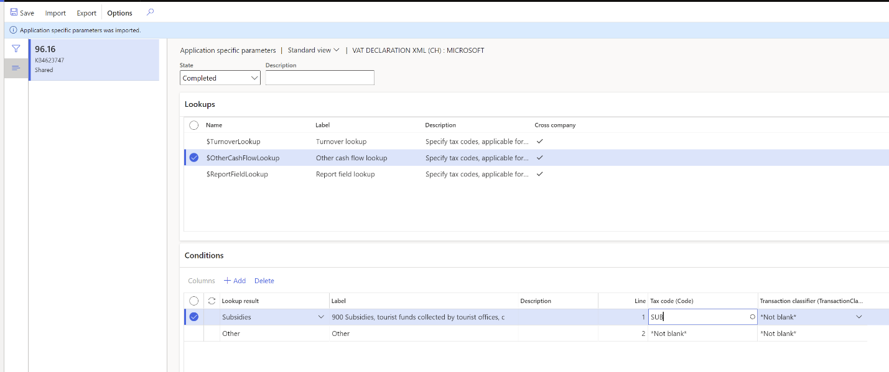

# VAT declaration (Switzerland)

[!include [banner](../includes/banner.md)]

## Overview

This article describes how to set up and generate a value-added tax (VAT) declaration for Switzerland in the official XML format (eCH-0217 eMWST standard). It also describes how to preview the VAT declaration in Microsoft Excel.

To automatically generate the report, you must first create enough sales tax codes to keep a separate VAT accounting for each box on the VAT declaration. Additionally, in the application-specific parameters of the Electronic reporting (ER) format for the VAT declaration, you must associate sales tax codes with the lookup result of the lookups for the boxes on the VAT declaration.

For Switzerland, you must configure three lookups: **Turnover lookup**, **Report field lookup**, and **Other cash flow lookup**. For more information about how to set up application-specific parameters, see the [Set up application-specific parameters for VAT declaration fields](#set-up-application-specific-parameters-for-vat-declaration-fields) section later in this article.

In the following table, the "Lookup result" column shows the lookup result that is preconfigured for a specific VAT declaration row in the VAT declaration format. Use this information to correctly associate sales tax codes with the lookup result and then with the row of the VAT declaration.

### VAT declaration overview

The VAT declaration in Switzerland contains the following information.

**SECTION I - TURNOVER**

| Line           | XML element                   | Description                                                                                                                                                                                                                                                               | Lookup          | Lookup result                                                                                                                                    |
|----------------|-------------------------------|---------------------------------------------------------------------------------------------------------------------------------------------------------------------------------------------------------------------------------------------------------------------------|-----------------|--------------------------------------------------------------------------------------------------------------------------------------------------|
| 200            | totalConsideration            | The total amount of agreed or collected consideration, including consideration from supplies where the option for taxation has been exercised, transfers of supplies according to the notification procedure, and supplies that are provided abroad (worldwide turnover). | Turnover lookup | TaxableSupplies TaxableSupplies22 SuppliesToForeignCountries SuppliesAbroad TransferNotificationProcedure SuppliesExemptFromTax VariousDeduction |
| 205            | opted                         | Consideration that is reported in line 200 from supplies that are exempt from the tax without credit (article 21), and where the option for taxation according to article 22 has been exercised.                                                                          | Turnover lookup | TaxableSupplies22                                                                                                                                |
| **Deductions** |                               |                                                                                                                                                                                                                                                                           |                 |                                                                                                                                                  |
| 220            | suppliesToForeignCountries    | Supplies that are exempt from the tax, such as exports (article 23), and supplies that are provided to institutional and individual beneficiaries that are exempt from liability for tax (article 107, paragraph 1, lit. a).                                              | Turnover lookup | SuppliesToForeignCountries                                                                                                                       |
| 221            | suppliesAbroad                | Supplies that are provided abroad (the place of supply is abroad).                                                                                                                                                                                                        | Turnover lookup | SuppliesAbroad                                                                                                                                   |
| 225            | transferNotificationProcedure | Transfers of supplies according to the notification procedure (article 38). You should submit Form 764.                                                                                                                                                                   | Turnover lookup | TransferNotificationProcedure                                                                                                                    |
| 230            | suppliesExemptFromTax         | Supplies that are provided in Swiss territory that is exempt from the tax without credit (article 21), and where the option for taxation according to article 22 hasn't been exercised.                                                                                   | Turnover lookup | SuppliesExemptFromTax                                                                                                                            |
| 235            | reductionOfConsideration      | Reduction of consideration, such as discounts and rebates.                                                                                                                                                                                                                | Turnover lookup | ReductionOfConsideration                                                                                                                         |
| 280            | variousDeduction              | Miscellaneous, such as land value and purchase prices in the event of margin taxation.                                                                                                                                                                                    | Turnover lookup | VariousDeduction                                                                                                                                 |
| 289            | Not applicable                | Total lines220 through280.                                                                                                                                                                                                                                                | Total           | 220 + 221 + 225 + 230 + 235 + 280                                                                                                                |
| 299            | Not applicable                | Taxable turnover (Line 200 minus Line 289).                                                                                                                                                                                                                               | Total           | 200 – 289                                                                                                                                        |

**SECTION II - TAX CALCULATION**

**Tax due**

| Line | XML element                           | Description                                                 | Lookup              | Lookup result                                                                                                                                             |
|------|---------------------------------------|-------------------------------------------------------------|---------------------|-----------------------------------------------------------------------------------------------------------------------------------------------------------|
| 302  | supplierTaxRate / tax rate tax amount | Supplies from January 1, 2018, at a standard rate.          | Report field lookup | SuppliesStandardRate                                                                                                                                      |
| 312  | supplierTaxRate / tax rate tax amount | Supplies from January 1, 2018, at a reduced rate.           | Report field lookup | SuppliesReducedRate                                                                                                                                       |
| 342  | supplierTaxRate / tax rate tax amount | Supplies from January 1, 2018, at an accommodation rate.    | Report field lookup | SuppliesAccomodationRate                                                                                                                                  |
| 382  | acquisitionTax / tax rate tax amount  | Acquisition tax for supplies from January 1, 2018           | Report field lookup | SuppliesAcquisitionTax  UseTaxAcquisitionTax (This result is also reported in full on line 400.)  UseTaxInvestmentsAquisitionTax (This result is also reported in full on line 405.)  Non-deductible tax amount, if any is reported on line 415 |
| 301  | supplierTaxRate / tax rate tax amount | Supplies up to December 31, 2017, at a standard rate.       | Report field lookup | SuppliesOldStandardRate                                                                                                                                   |
| 311  | supplierTaxRate / tax rate tax amount | Supplies up to December 31, 2017, at a reduced rate.        | Report field lookup | SuppliesOldReducedRate                                                                                                                                    |
| 341  | supplierTaxRate / tax rate tax amount | Supplies up to December 31, 2017, at an accommodation rate. | Report field lookup | SuppliesAccomodationOldRate                                                                                                                               |
| 381  | acquisitionTax / tax rate tax amount  | Acquisition tax for supplies up to December 31, 2017        | Report field lookup | SuppliesAcquisitionTaxOldRate                                                                                                                             |
| 399  | Not applicable                        | Total amount of tax due (Lines 301 through 382).            | Total               | 302 + 312 + 342 + 382 + 301 + 311 + 341 + 381                                                                                                             |

**Input tax**

| Line | XML element                 | Description                                                                                                                                                         | Lookup              | Lookup result                                                                                                                                    |
|------|-----------------------------|---------------------------------------------------------------------------------------------------------------------------------------------------------------------|---------------------|--------------------------------------------------------------------------------------------------------------------------------------------------|
| 400  | inputTaxMaterialAndServices | Input tax on the cost of materials and supplies of services.                                                                                                        | Report field lookup | InputTaxMaterialAndServices (reported in full)  UseTaxAcquisitionTax (reported in full)  Non-deductible tax amount, if any is reported on line 415 |
| 405  | inputTaxInvestments         | Input tax on investments and other operating costs.                                                                                                                 | Report field lookup | InputTaxInvestments (reported in full)  UseTaxInvestmentsAquisitionTax (reported in full)  Non-deductible tax amount, if any is reported on line 415                                                 |
| 410  | subsequentInputTaxDeduction | De-taxation (article 32). You should enclose a detailed list.                                                                                                       | Report field lookup | SubsequentInputTaxDeduction                                                                                                                      |
| 415  | inputTaxCorrections         | Correction of the input tax deduction, both mixed use (article 30) and own use (article 31).                                                                        | Report field lookup | InputTaxCorrections (reported in full but with the sign inverted) Also non-deductible tax amount of transactions from lines 400, 405 is reported here                                                                                 |
| 420  | inputTaxReductions          | Reduction of the input tax deduction: the flow of funds that aren't deemed to be in consideration, such as subsidies and tourist charges (article 33, paragraph 2). | Report field lookup | InputTaxReductions (reported in full with the sign inverted)                                                                                     |
| 479  | Not applicable              | Total lines 400 through 420.                                                                                                                                        | Total               | 400 + 405 + 410 – 415 – 420                                                                                                                      |
| 500  | Not applicable              | The amount that is payable.                                                                                                                                         | Total               | 399 – 479, if 399-479 is positive                                                                                                                |
| 510  | Not applicable              | The credit in favor of the taxable person.                                                                                                                          | Total               | 479 – 399, if 479–399 is positive                                                                                                              |

**SECTION III - OTHER CASH FLOWS**

| Line | XML element | Description                                                                                                                                                               | Lookup                 | Lookup result |
|------|-------------|---------------------------------------------------------------------------------------------------------------------------------------------------------------------------|------------------------|---------------|
| 900  | subsidies   | Subsidies, tourist funds that are collected by tourist offices, contributions from cantonal water, and sewage or waste funds (article 18, paragraph 2, lit. a through c). | Other cash flow lookup | Subsidies     |
| 910  | donations   | Donations, dividends, payments of damages, and so on (article 18, paragraph 2, lit. d through l).                                                                         | Other cash flow lookup | Subsidies     |

#### Purchase reverse charge VAT

If you configure sales tax codes to post incoming acquisition tax (reverse charge VAT) by using use tax, associate your sales tax codes with the lookup result of **Report field lookup** that contains "UseTax" in the name.

Alternatively, you can configure two separate sales tax codes: one for VAT due and one for VAT deduction. Then associate each code with the corresponding lookup results of **Report field lookup**.

For example, for supplies from January 1, 2018 - acquisition tax, you configure sales tax code **UT_S_RC** with use tax, and associate it with the **UseTaxAcquisitionTax** lookup result of **Report field lookup**. In this case, amounts that use the **UT_S_RC** sales tax code are reflected on lines 382 and 400 with the full amount, and on line 415 with the non-deductible amount, if there is any.

Alternatively, you configure two sales tax codes:

- **VAT_S_RC**, which has a tax rate value of -7.7 percent
- **InVAT_S_RC**, which has a tax rate value of 7.7 percent

You then associate the codes with lookup results in the following way:

- Associate **VAT_S_RC** with the **SuppliesAcquisitionTax** lookup result of **Report field lookup**.
- Associate **InVAT_S_RC** with the **InputTaxMaterialAndServices** lookup result of **Report field lookup**.

In this case, amounts that use the **VAT_S_RC** sales tax code will be reflected on line 382. Amounts that use the **InVAT_S_RC** sales tax code will be reflected on line 400 with full amount, and on line 415 with the non-deductible amount.

For more information about how to configure reverse charge VAT, see [Reverse charges](emea-reverse-charge.md).

## Configure system parameters

To generate a VAT declaration, configure the UID (company identification number).

1. Go to **Organization administration** > **Organizations** > **Legal entities**.
2. Select the legal entity, and then select **Registration IDs**.
3. Select or create the address in Switzerland, and then, on the **Registration ID** FastTab, select **Add**.
4. In the **Registration type** field, select the registration type that is dedicated to Switzerland, and that uses the **Enterprise ID (COID)** registration category.
5. In the **Registration number** field, enter the UID number in the following format: CHE-123.456.789.
6. On the **General** tab, in the **Effective** field, enter the date when the number becomes effective.
7. Repeat these steps to set up a line with the VAT number. In this case, select the registration type that uses the **VAT Id** registration category, and enter the number in the following format: CHE-123.456.789 TVA/MWST/IVA.

For more information about how to set up registration categories and registration types, see [Registration IDs](emea-registration-ids.md).

## Set up a VAT declaration for Switzerland

### Import ER configurations

Open the **Electronic reporting** workspace, and import the following versions or later of these ER formats:

- VAT Declaration XML (CH) version 96.16
- VAT Declaration Excel (CH) version 96.16.9

### <a name="set-up-application-specific-parameters-for-vat-declaration-fields">Set up application-specific parameters for VAT declaration fields</a>

To automatically generate a VAT declaration, associate sales tax codes in the application and lookup results in the ER configuration.

> [!NOTE]
> We recommend that you enable the feature, **Use application specific parameters from previous versions of ER formats** in the **Feature management** workspace. When this feature is enabled, parameters that are configured for the earlier version of an ER format automatically become applicable for the later version of the same format. If this feature is not enabled, you must configure application-specific parameters explicitly for each format version. The **Use application specific parameters from previous versions of ER formats** feature is available in the **Feature management** workspace starting in Finance version 10.0.23. For more information about how to set up the parameters of an ER format for each legal entity, see [Set up the parameters of an ER format per legal entity](../../fin-ops-core/dev-itpro/analytics/er-app-specific-parameters-set-up.md).

#### Set up Turnover lookup

Follow these steps to define which sales tax codes generate which boxes in section I, "Turnover."

1. Go to **Workspaces** > **Electronic reporting**, and select **Reporting configurations**.
2. Select the **VAT declaration XML (CH)** configuration, and then select **Configurations** > **Application specific parameters setup**.
3. On the **Application specific parameters** page, on the **Lookups** FastTab, select **Turnover lookup**.
4. On the **Conditions** FastTab, set the following fields to associate the sales tax codes and operations.

   | Field                  | Description                                                                                                                                                                                                                                                                                                         |
   |------------------------|---------------------------------------------------------------------------------------------------------------------------------------------------------------------------------------------------------------------------------------------------------------------------------------------------------------------|
   | Lookup result          | Select the value of the turnover. For more information about the turnover values and their assignment to VAT declaration rows, see the [VAT declaration overview](#vat-declaration-overview) section earlier in this article.                                                                                         |
   | Tax code               | Select the sales tax code to associate with the operation. Posted tax transactions that use the selected sales tax code will be collected in the appropriate declaration box. We recommend that you separate sales tax codes in such a way that one sales tax code generates amounts in only one declaration box.   |
   | Transaction classifier | If you created enough sales tax codes to determine a declaration box, select **\*Not blank\***. If you didn't create enough sales tax codes so that one sales tax code generates amounts in only one declaration box, you can set up a transaction classifier. The following transaction classifiers are available:  - **Purchase** - **PurchaseExempt** (tax-exempt purchase)  - **PurchaseReverseCharge** (tax receivable from a purchase reverse charge)  - **Sales**  - **SalesExempt** (tax-exempt sale)  - **SalesReverseCharge** (tax payable from a purchase reverse charge or a sales reverse charge)  - **Use tax**   For each transaction classifier, a classifier for the credit note is also available. For example, one of these classifiers is **PurchaseCreditNote** (purchase credit note).|

   > [!NOTE]
   > Associate all sales tax codes with lookup results. If any sales tax codes should not generate values in section I, associate with the **Other** lookup result.

   

#### Set up Report field lookup

Follow these steps to define which sales tax codes generate which boxes in section II, "Tax calculation."

1. On the **Application specific parameters** page, on the **Lookups** FastTab, select **Report field lookup**.
2. On the **Conditions** FastTab, associate the sales tax codes and report fields.

   > [!NOTE]
   > Be sure to associate all sales tax codes with lookup results. If any sales tax codes should not generate values in section II, associate them with the **Other** lookup result.

   

#### Set up Other cash flow lookup

Follow these steps to define which sales tax codes generate the amount in section III, "Other cash flows."

1. On **Application specific parameters** page, on the **Lookups** FastTab, select **Other cash flow lookup**.
2. On the **Conditions** FastTab, associate the sales tax codes and other cash flow elements.

   > [!NOTE]
   > As the last line in the setup, create a line where you associate the **\*Not blank\*** value of the tax code with the **Other** lookup result. This line indicates that all other sales tax codes that aren't defined in previous rows don't generate amounts in section III.

   

 3. In the **State** field, change the value to **Completed**.
 4. On the Action Pane, select **Export** to export the settings of the application-specific parameters.
 5. Select the **VAT declaration Excel (CH)** configuration, and then, on the Action Pane, select **Import** to import the parameters that you configured for **VAT declaration XML (CH)**.
 6. In the **State** field, select **Completed**.

### Set up the VAT reporting format for preview amounts in Excel

1. In the **Feature management** workspace, enable the **VAT statement format reports** feature.
2. Go to **General ledger \> Setup \> General ledger parameters**.
3. On the **Sales tax** tab, on the **Tax options** FastTab, in the **VAT statement format mapping** field, select the **VAT declaration Excel (CH)** ER format.

   This format will be printed when you run the **Report sales tax for settlement period** report. It will also be printed when you select **Print** on the **Sales tax payments** page.

4. On the **Tax authorities** page, select the tax authority, and then, in the **Report layout** field, select **Default**.

If you're configuring the VAT declaration in a legal entity that has [multiple VAT registrations](emea-reporting-for-multiple-vat-registrations.md), follow these steps.

1. Go to **General ledger** > **Setup** > **General ledger parameters**.
2. On the **Sales tax** tab, on the **Electronic reporting for countries/regions** FastTab, on the line for **CHE**, select the **VAT Declaration Excel (CH)** ER format.

## Set up electronic messages

### Download and import the data package that has example settings for electronic messages

The data package contains electronic message settings that are used to generate the VAT declaration in XML format and preview it in Excel. You can extend these settings or create your own. For more information about how to work with electronic messaging and create your own settings, see [Electronic messaging](../general-ledger/electronic-messaging.md).

1. In [LCS](https://lcs.dynamics.com/v2), in the Shared asset library, select **Data package** as the asset type, and then download **CH VAT declaration EM package**. The downloaded file is named **CH VAT declaration EM package.zip**.
2. In Finance, in the **Data management** workspace, select **Import**.
3. On the **Import** FastTab, in the **Group name** field, enter a name for the job.
4. On the **Selected entities** FastTab, select **Add file**.
5. In **Add file** dialog box, verify that the **Source data format** field is set to **Package**, select **Upload and add**, and then select the zip file that you downloaded earlier.
6. Select **Close**.
7. After the data entities are uploaded, on the Action Pane, select **Import**.
8. Go to **Tax** > **Inquiries and reports** > **Electronic messages** > **Electronic messages**, and validate the electronic message processing that you imported (**CH VAT declaration**).

### Configure electronic messages

1. Go to **Tax** > **Setup** > **Electronic messages** > **Populate records actions**.
2. Select the line for **CH Populate VAT return records**, and then select **Edit query**.
3. Use the filter to specify the settlement periods to include on the report.
4. If you must report tax transactions from other settlement periods in a different declaration, create a new **Populate records** action, and select the appropriate settlement periods.

## Preview the VAT declaration in Excel

### Preview the VAT declaration in Excel from the Report sales tax for settlement period periodic task

1. Go to **Tax** > **Periodic tasks** > **Declarations** > **Sales tax** > **Report sales tax for settlement period**.
2. Set the following fields.

   | Field                     | Description                                    |
   |---------------------------|------------------------------------------------|
   | Settlement period         | Select the settlement period.                  |
   | Sales tax payment version | Select one of the following values:  - **Original**: Generate a report for the sales tax transactions of the original sales tax payment or before the sales tax payment is generated.  - **Corrections**: Generate a report for the sales tax transactions of all the subsequent sales tax payments for the period.   - **Total list**: Generate a report for all the sales tax transactions for the period, including the original and all corrections.            |
   | From date                 | Select the start date of the reporting period. |

3. Select **OK**, and review the Excel report.

### <a name="settle-and-post-sales-tax"> Settle and post sales tax</a>

1. Go to **Tax** > **Periodic tasks** > **Declarations** > **Sales tax** > **Settle and post sales tax**.
2. Set the following fields.

   | Field                     | Description                                    |
   |---------------------------|------------------------------------------------|
   | Settlement period         | Select the settlement period.                  |
   | Sales tax payment version | Select one of the following values:   - **Original**: Generate the original sales tax payment for the settlement period.   - **Latest corrections**: Generate a correction sales tax payment after the original sales tax payment for the settlement period was created.          |
   | From date                 | Select the start date of the reporting period. |

3. Select **OK**.

### Preview the VAT declaration in Excel from a sales tax payment

1. Go to **Tax** > **Inquiries and reports** > **Sales tax inquiries** > **Sales tax payments**, and select a sales tax payment line.
2. Select **Print report**.
3. In the **Electronic report parameters** dialog box, set the fields as explained earlier in this article. Then review the Excel file that is generated for the selected sales tax payment line.

   > [!NOTE]
   > The report is generated only for the selected line of the sales tax payment. If you must generate, for example, a corrective declaration that contains all corrections for the period, or a replacement declaration that contains original data and all corrections, use the **Report sales tax for settlement period** periodic task.

## Generate a VAT declaration from electronic messages

When you use electronic messages to generate the report, you can collect tax data from multiple legal entities. For more information, see the [Run a VAT declaration for multiple legal entities](#run-a-vat-declaration-for-multiple-legal-entities) section later in this article.

The following procedure applies to the example electronic message processing that you imported earlier from the LCS Shared asset library.

1. Go to **Tax \> Inquiries and reports \> Electronic messages \> Electronic messages**.
2. In the left pane, select **CH VAT declaration**.
3. On the **Messages** FastTab, select **New**, and then, in the **Run processing** dialog box, select **OK**.
4. Select the message line that is created, enter a description, and then specify the start and end dates for the declaration.

   > [!NOTE]
   >  Steps 5 through 7 are optional.

5. Optional: On the **Messages** FastTab, select **Collect data**, and then select **OK**. The sales tax payments that were generated earlier are added to the message. For more information, see the [Settle and post sales tax](#settle-and-post-sales-tax) section earlier in this article. If you skip this step, you can still generate a VAT declaration by using the **Tax declaration version** field in the **Declaration** dialog box.
6. Optional: On the **Message items** FastTab, review the sales tax payments that are transferred for processing. By default, all sales tax payments of the selected period that weren't included in any other message of the same processing are included.
7. Optional: Select **Original document** to review the sales tax payments, or select **Delete** to exclude sales tax payments from processing. If you skip this step, you can still generate a VAT declaration by using the **Tax declaration version** field in the **Declaration** dialog box.
8. On the **Messages** FastTab, select **Update status**. In the **Update status** dialog box, select **Ready to generate**, and then select **OK**. Verify that the message status is changed to **Ready to generate**.
9. Select **Generate report**. To preview the VAT declaration amounts, in the **Run processing** dialog box, select **Preview report**, and then select **OK**.
10. In the **Electronic reporting parameters** dialog box, set the following fields, and then select **OK**.

      | **Field**               | **Description**    |
      |-------------------------|---------------------|
      | Settlement period       | Select the settlement period. If you selected **Collect data** in step 5, you can disregard this field. The report will be generated for the sales tax transactions that are included in the collected sales tax payments. |
      | Tax declaration version | Select one of the following values:  -**Original**: Generate a report for sales tax transactions of the original sales tax payment or before the sales tax payment is generated.  -**Corrections**: Generate a report for sales tax transactions of all the subsequent sales tax payments for the period.  - **Total list**: Generate a report for all sales tax transactions for the period, including the original and all corrections.               |
    
    If you selected **Collect data** in step 5, you can disregard this field. The report will be generated for the sales tax transactions that are included in the collected sales tax payments.

11. Select the **Attachments** button (paper clip symbol) in the upper-right corner of the page, and then select **Open** to open the file. Review the amounts in the Excel document.
12. Select **Generate report**.
13. To generate a VAT declaration in XML format, in the **Run processing** dialog box, select **Generate report**, and then select **OK**.
14. In the **Electronic reporting parameters** dialog box, set the fields as described earlier in this procedure, and then select **OK**.

## <a name="run-a-vat-declaration-for-multiple-legal-entities">Run a VAT declaration for multiple legal entities</a>

To use the formats to report the VAT declaration for a group of legal entities, you must first set up the application-specific parameters of the ER formats for sales tax codes from all required legal entities.

### Set up electronic messages to collect tax data from several legal entities

Follow these steps to set up electronic messages to collect data from multiple legal entities.

1. Go to **Workspaces** > **Feature management**.
2. Find and select the **Cross-company queries for the populate records actions** feature in the list, and then select **Enable now**.
3. Go to **Tax** > **Setup** > **Electronic messages** > **Populate records actions**.
4. On the **Populate records action** page, select the line for **CH Populate VAT return records**.

   In the **Datasources setup** grid, a new **Company** field is available. For existing records, this field shows the identifier of the current legal entity.

5. In the **Datasources setup** grid, add a line for each additional legal entity that must be included in reporting. For each new line, set the following fields.

   | Field                  | Description                                                                                                                   |
   |------------------------|-------------------------------------------------------------------------------------------------------------------------------|
   | Name                   | Enter a value that will help you understand where this record comes from. For example, enter **VAT payment of Subsidiary 1**. |
   | Message item type      | Select **VAT return**. This value is the only value that is available for all the records.                                    |
   | Account type           | Select **All**.                                                                                                               |
   | Master table name      | Specify **TaxReportVoucher** for all the records.                                                                             |
   | Document number field  | Specify **Voucher** for all the records.                                                                                      |
   | Document date field    | Specify **TransDate** for all the records.                                                                                    |
   | Document account field | Specify **TaxPeriod** for all the records.                                                                                    |
   | Company                | Select the ID of the legal entity.                                                                                            |
   | User query             | This checkbox is automatically selected when you define criteria by selecting **Edit query**.                                 |

6. For each new line, select **Edit query**, and specify a related settlement period for the legal entity that is specified in the **Company** field on the line.

   When the setup is completed, the **Collect data** function on the **Electronic messages** page collects sales tax payments from all legal entities that you defined.
