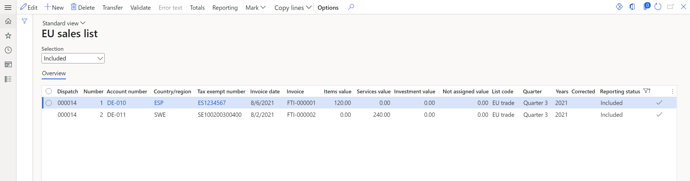

# EU Sales list for Czech Republic
This article provides information about the EU sales list report for the Czech Republic. The Czech Republic EU sales list report contains information about the sale of goods and services for reporting in XML format. The following fields are included on the Czech Republic EU sales list report:

- **EU sales list header:**
    
    - Reporting period
    - Date of the report creation
    - Existence of a correction
    - Tax authority ID
    - Company's tax registration number
    - Taxpayer type identification
    - Company country name
    - Name and title of a natural person
    - Company name
    - Company name appendix
    - Company street and street number
    - Company district
    - Company postcode
    - Company location
    - Name and role of the person authorizing the report
    - Name and telephone number of the person submitting the report

- **EU sales list lines:**
   
    - Customer VAT ID
    - Transaction type
    - Number of all invoices by transaction type per customer
    - Amount of all invoices by transaction type per customer

## Setup

For general setup information, see [EU Sales list reporting](emea-eu-sales-list.md#prerequisites).

> [!NOTE] 
> The value from the **Tax registration number** field on the **Tax registration** FastTab of the **Legal entities** page is used in the .xml and .xlsx files for the EU sales list report.

**Set up the address format**

1. In Microsoft Dynamics 365 Finance, go to **Organization administration** > **Global address book** > **Addresses** > **Address setup**.
2. On the **Country/region** tab, in the **Country/region** field, select **CZE**.
3. Select the address format in the **Address format** field.
4. On the **Address format** tab, set cursor on the line with the address format selected earlier.
5. In the **Configure address component** section, add a **District** line after the **ZIP/postal code** line.
6. Add a **Street number** line after the **Street** line.
7. For the **Street number** and **District** lines, select the **New line** checkbox.
8. On the Action Pane, select **Save**.

### Set up information about the company

1. Go to **Organization administration** > **Organizations** > **Legal entities**.
2. In the grid, select your company.
3. On the **Addresses** FastTab, set the city, ZIP/postal code, street, street number, and district for the primary address that should be shown on the EU sales list report.

### Import Electronic reporting configurations

In [Microsoft Dynamics Lifecycle Services (LCS)](https://lcs.dynamics.com/Logon/Index), import the latest versions of the following Electronic reporting (ER) configurations for the EU sales list:

- EU Sales list model
- EU Sales list by columns report
- EU Sales list by rows report
- EU Sales list (CZ)

For more information, see [Download Electronic reporting configurations from Lifecycle Services](../../fin-ops-core/dev-itpro/analytics/download-electronic-reporting-configuration-lcs.md).

### Set up a sales tax authority

1. In Finance, go to **Tax** > **Indirect taxes** > **Sales tax** > **Sales tax authorities**.
2. Create a sales tax authority.
3. In the **Authority identification** field, enter the code of the tax authority. This value is reported in the **c_ufo** field in the **VetaP** section of the report.
4. On the Action Pane, select **Save**.

### Set up foreign trade parameters

1. Go to **Tax** > **Setup** > **Foreign trade** > **Foreign trade parameters**.
2. On the **EU sales list** tab, set **Report cash discount** option to **Yes** if a cash discount should be included in the value when a transaction is included in the EU sales list.
3. On the **Electronic reporting** FastTab, in the **File format mapping** field, select **EU Sales list (CZ)**.
4. In the **Report format mapping** field, select **EU Sales list by rows report** or **EU Sales list by columns report**.
5. On the **Other** FastTab, set the following fields:
    
    - In the **Authorized by** field, select the person who is authorizing the report.
    - In the **Role** field, enter the role of the person who is authorizing the report.
    - In the **Filled by** field, select the person who is submitting the report. Note that the main telephone number of the person submitting the report will be shown in the EU sales list report.

6. On the **Country/region properties** tab, select **New**, and specify the following information:
    
    - In the **Country/region** column, select **CZE**.
    - In the **Country/region type** column, select **Domestic**.

7. List all the countries or regions that your company does business with. For each country that is part of the EU, in the **Country/region type** field, select **EU**.
8. On the **Company information** FastTab, set the following fields:
    
    - In the **Legal entity** field, select your company.
    - In the **Authority** field, select the tax authority that you created earlier.
    - In the **Company name appendix** field, enter an appendix of the company name.
    - In the **Legal entity address** field, select the address that you created earlier.

9. On the Action Pane, select **Save**.

### Set up general ledger parameters

1. Go to **General ledger** > **Ledger setup** > **General ledger parameters**.
2. On the **Sales tax** tab, on the **VAT statement** FastTab, set the following fields. The values will be shown in the XML EU sales list report:
    
    - In the **Taxpayer type** field, select **Corporation** or **Individual**.
    - In the **Natural person title** field, enter the title of the natural person.
    - In the **Natural person first name** field, enter the first name of the natural person.
    - In the **Natural person last name** field, enter the last name of the natural person.

## Work with the EU sales list

For general information about which types of transactions are included in the EU sales list, how to generate the EU sales list report, and how to close the EU sales list reporting period, see [EU Sales list reporting](emea-eu-sales-list.md#working-with-the-esl). When you create a customer invoice, in addition to using the main codes in the **List code** field, you can use the **Property movement** code for sale items.

### Generate the EU sales list report

1. Go to **Tax** > **Declarations** > **Foreign trade** > **EU sales list**.
2. Transfer transactions. In addition to the main codes in the **List code** column, you can use the **Property movement** code for sale items.
3. On the Action Pane, select **Reporting**.
4. In the **EU sales list reporting** dialog box, on the **Parameters** FastTab, set the following fields.

    | Field            | Description                                                                         |
    |------------------|-------------------------------------------------------------------------------------|
    | Reporting period | Select **Monthly** or **Quarterly**.                                                |
    | From date        | Select the start date for the report.                                               |
    | Generate file    | Set this option to **Yes** to generate an .xml file for your EU sales list report.  |
    | File name        | Enter the name of the .xml file.                                                    |
    | Generate report  | Set this option to **Yes** to generate an .xlsx file for your EU sales list report. |
    | Report file name | Enter the name of the .xlsx file.                                                   |
    | Tax authority code to file the report | Enter the Tax authority code that's reported in the **c_pracufo** field, in the **VetaP** section of the report. |

5. Select **OK**, and review the generated reports.

### Generate a corrective EU sales list report

1. Go to **Tax** > **Declarations** > **Foreign trade** > **EU sales list**.
2. For each corrected line where the reporting status is set to **Reported** or **Closed**, select **Copy lines** \> **To adjusted lines with status Included** on the Action Pane to create corrective lines. Two corrective lines appear. One has a positive invoice amount, and the other has a negative invoice amount.
3. On the line that has a positive amount, enter a new (correct) amount. Leave the line that has a negative amount as it is.
4. On the Action Pane, select **Reporting**.
5. In the **EU sales list reporting** dialog box, on the **Parameters** FastTab, in addition to setting the general fields for generating a report, set the **Correction** option to **Yes**.

## Example

For information about how to create a general setup, create postings, and transfer transactions by using the **DEMF** legal entity for the Czech Republic, see [Example for generic EU Sales list](emea-eu-sales-list-example.md). However, for this example, create **CZ100200300** as the company's VAT ID.

**Set up the address format**

1. Go to **Organization administration** > **Global address book** > **Addresses** > **Address setup**.
2. On the **Country/region** tab, in the **Country/region** field, select **CZE**.
3. Select **0016** in the **Address format** field.
4. On the **Address format** tab, set cursor on the line with the address format selected earlier.
5. In the **Configure address component** section, add a **District** line after the **ZIP/postal code** line.
6. Add a **Street number** line after the **Street** line.
7. For the **Street number** and **District** lines, select the **New line** checkbox.
8. On the Action Pane, select **Save**.

### Set up information about the company

1. Go to **Organization administration** > **Organizations** > **Legal entities**.
2. Select the **DEMF** legal entity.
3. In the **Name** field, enter **Contoso Entertainment System Czech Republic**.
4. On the **Addresses** FastTab, select **Edit**.
5. In the **Edit address** dialog box, set the following fields.

    | Field               | Value           |
    |---------------------|-----------------|
    | Name or description | Primary address |
    | Purpose             | Business        |
    | Country/region      | CZE             |
    | ZIP/postal code     | 19800           |
    | Street              | Ulitsa          |
    | Street number       | 35              |
    | City                | Gorod           |
    | District            | 1               |
    | Primary             | Yes             |

6. Select **OK**.

### Set up foreign trade parameters

1. Go to **Tax** > **Setup** > **Foreign trade** > **Foreign trade parameters**.
2. On the **EU sales list** tab, on the **Other** FastTab, set the following fields:
    
    - In the **Authorized by** field, select **Charlie Carson**.
    - In the **Role** field, enter **Accountant**.
    - In the **Filled by** field, select **Jodi Christiansen**.

3.  On the **Company information** FastTab, set the following fields:
    
    - In the **Legal entity** field, select **DEMF**.
    - In the **Authority** field, select **TA**.
    - In the **Company name appendix** field, enter **CNAppendix**.
    - In the **Legal entity address** field, select the address that you created earlier.

4.  On the Action Pane, select **Save**.

### Set up general ledger parameters

1. Go to **General ledger** > **Ledger setup** > **General ledger parameters**.
2. On the **Sales tax** tab, on the **VAT statement** FastTab, set the following fields:
    
    - In the **Taxpayer type** field, select **Corporation**.
    - In the **Natural person title** field, enter **Natural person title**.
    - In the **Natural person first name** field, enter **Aaron**.
    - In the **Natural person last name** field, enter **Con**.

### Set up a sales tax authority

1. Go to **Tax** > **Indirect taxes** > **Sales tax** > **Sales tax authorities**.
2. On the Action Pane, select **New**.
3. In the **Authority** field, enter **TA**.
4. In the **Authority identification** field, enter **23**.
5. On the Action Pane, select **Save**.

**Create an EU sales list report**

1. Go to **Tax** > **Declarations** > **Foreign trade** > **EU sales list**.
2. On the Action Pane, select **Reporting**.
3. In the **EU sales list reporting** dialog box, on the **Parameters** FastTab, set the following fields:
   
    - In the **Reporting period** field, select **Monthly**.
    - In the **From date** field, select **8/1/2021** (August 1, 2021).

4. Select **OK**, and review the report in XML format that is generated. The following tables show the values on the example report.

    **EU sales list header**

    | Field  | Value    | Comment  |
    |--------|----------|----------|
    | k_uladis    | DPH    |  &nbsp;  |
    | dokument       | SHV     |  &nbsp;  |
    | rok            | 2021      | The reporting year.     |
    | Mesic          | 08    | The reporting period. **Note:** If the reporting period is **Quarter**, this field is named **ctvrt** instead of **mesic**.    |
    | shvies_forma   | R       | If the **Correction** option is set to **No**, this field is set to **R**. If the **Correction** option is set to **Yes**, this field is set to **N**.  |
    | d_poddp        | 24.09.2021   | The date when the report was created.  |
    | c_ufo          | 451    | The code related to the tax authority ID.   |
    | c_pracufo      | 2012   | The tax authority ID.   |
    | dic            | 203/118/12345      | The company's tax registration number.    |
    | typ_ds         | P        | If the **Taxpayer type** field is set to **Individual**, this field is set to **F**. If the **Taxpayer type** field is set to **Corporation**, this field is set to **P**. |
    | stat           | Czech Republic     | The name of the company's country/region.     |
    | prijmeni       | Con      | The last name of the natural person.     |
    | jmeno          | Aaron     | The first name of the natural person.    |
    | titul          | Natural person title        | The title of the natural person.    |
    | zkrobchjm      | Contoso Entertainment System Czech Republic | The company's name.    |
    | dodobchjm      | CNAppendix    | The value from the **Company name appendix** field.   |
    | naz_obce       | Gorod        | The company's city.     |
    | ulice          | Ulitsa      | The company's street.    |
    | c_pop          | 35         | The company's street number. If the **Street number** field on the **Legal entity** page is blank, this field is set to **0**.   |
    | c_orient       | 1        | The company's district.     |
    | psc            | 19800      | The company's ZIP/postal code.    |
    | opr_prijmeni   | Carson   | The last name of the person who is authorizing the report.   |
    | opr_jmeno      | Charlie     | The first name of the person who is authorizing the report.    |
    | opr_postaveni  | Accountant    | The role of the person who is authorizing the report.   |
    | sest_prijmeni  | Christiansen     | The last name of the person who is submitting the report.    |
    | sest_jmeno     | Jodi         | The first name of the person who is submitting the report.    |
    | sest_telef     | 425-555-5049   | The telephone number of the person who is submitting the report.       |

    **EU sales list lines**

    | Field       | Line 1 value | Line 2 value | Comment   |
    |-------------|--------------|--------------|-----------|
    | k_stat      | ES           | SE           | The country/region code.   |
    | c_vat       | 1234567      | 100200300400 | The customer's VAT ID without the country/region code.  |
    | k_pln_eu    | 0            | 3            | The transaction type. The value is **0** for item records, **3** for service records, **1** for triangular records, and **2** for records where the **List code** field is set to **Property movement**. |
    | pln_pocet   | 1            | 1            | The number of all invoices by transaction type per customer.     |
    | pln_hodnota | 120          | 240          | The amount of all invoices by transaction type per customer.     |

5. Review the report in Excel format that is generated.

    

**Create a corrective EU sales list report**

1. Go to **Tax** > **Declarations** > **Foreign trade** > **EU sales list**.
2. Verify that the grid includes one service line and one item line.

    

3. Select a service line, and then, on the Action Pane, select **Mark** \> **Mark as reported**.
4. In the **Criteria** field, enter **8/2/2021** (August 2, 2021). Then select **OK**.
5. In the **Selection** field, select **Reported**.
6. Select a service line, and then, on the Action Pane, select **Copy lines** \> **To adjusted lines with status Included**.
7. In the **Selection** field, select **Included**.
8. On the corrective line that has a positive amount, in the **Services value** field, enter **25**.
9. On the Action Pane, select **Reporting**.
10. In the **EU sales list reporting** dialog box, on the **Parameters** FastTab, set the following fields:
    
    - In the **Reporting period** field, select **Monthly**.
    - In the **From date** field, select **8/1/2021** (August 1, 2021).
    - Set the **Correction** option to **Yes**.

11. Select **OK**, and review the report in XML format that is generated. The following tables show the values on the example report.

    **EU sales list header**

    | Field          | Value                                       |
    |----------------|---------------------------------------------|
    | k_uladis       | DPH                                         |
    | dokument       | SHV                                         |
    | shvies_forma   | N                                           |
    | d_poddp        | 24.09.2021                                  |
    | c_ufo          | 451                                         |
    | c_pracufo      | 2012                                          |
    | dic            | 203/118/12345                               |
    | typ_ds         | P                                           |
    | stat           | Czech Republic                              |
    | prijmeni       | Con                                         |
    | jmeno          | Aaron                                       |
    | titul          | Natural person title                        |
    | zkrobchjm      | Contoso Entertainment System Czech Republic |
    | dodobchjm      | CNAppendix                                  |
    | naz_obce       | Gorod                                       |
    | ulice          | Ulitsa                                      |
    | c_pop          | 35                                          |
    | c_orient       | 1                                           |
    | psc            | 19800                                       |
    | opr_prijmeni   | Carson                                      |
    | opr_jmeno      | Charlie                                     |
    | opr_postaveni  | Accountant                                  |
    | sest_prijmeni  | Christiansen                                |
    | sest_jmeno     | Jodi                                        |
    | sest_telef     | 425-555-5049                                |

    **EU sales list lines**

    | Field       | Line 1 value | Line 2 value | Comment    |
    |-------------|--------------|--------------|------------|
    | k_storno    | A            |   &nbsp;     | The source (corrected) line identifier.    |
    | K_stat      | SE           | SE           | The country/region code.    |
    | C_vat       | 100200300400 | 100200300400 | The customer's VAT ID without the country/region code.    |
    | k_pln_eu    | 3            | 3            | The transaction type. The value is **0** for item records, **3** for service records, **1** for triangular records, and **2** for records where the **List code** field is set to **Property movement**. |
    | pln_pocet   | 1            | 1            | The number of sources and corrective lines per customer.  |
    | pln_hodnota | 240          | 25           | The amount of sources and corrective lines per customer.  |
