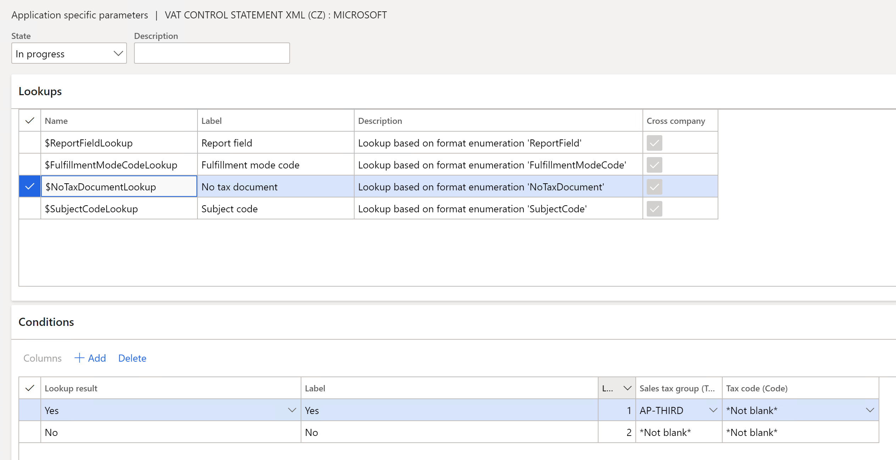

---
# required metadata

title: VAT declaration (Czech Republic)
description: This topic provides information about the value-added tax (VAT) declaration for the Czech Republic. 
author: anasyash
ms.date: 01/04/2022
ms.topic: article
ms.prod: 
ms.technology: 

# optional metadata

ms.search.form:  
audience: Application User
# ms.devlang: 
ms.reviewer: kfend
# ms.tgt_pltfrm: 
# ms.custom: 
ms.assetid: 
ms.search.region: Czech Republic
# ms.search.industry: 
ms.author: anasyash
ms.search.validFrom: 2017-07-20
ms.dyn365.ops.version: 10.0.13

---

# VAT declaration (Czech Republic)

[!include [banner](../includes/banner.md)]

This topic provides information about the value-added tax (VAT) declaration for the Czech Republic. It includes instructions for setting up and generating the VAT declaration and the VAT control statement.

## VAT declaration overview

### VAT declaration

This section describes the sections and rows of the VAT declaration, calculations, and the relations between the VAT declaration and the VAT control statement.

To automatically generate the VAT declaration and the VAT control statement, you must first create enough sales tax codes to keep a separate VAT accounting for each box on the VAT declaration. Additionally, in the application-specific parameters of the VAT declaration format and the VAT control statement format, you must associate sales tax codes with the lookup result of the lookup for the VAT declaration boxes. For more information about how to set up application-specific parameters, see the [Set up parameters for declaration fields](#set-up-parameters-for-declaration-fields) section later in this topic.

In the table in section 1, the "Lookup result" column shows the lookup result that is preconfigured for a specific VAT declaration row in the VAT declaration format and the VAT control statement format. Use this information to correctly associate sales tax codes with the lookup result and then with the row of the VAT declaration.

> [!NOTE]
> If you configure sales tax codes to post incoming reverse charge VAT by using use tax, you should associate your sales tax codes with the lookup result that contains "UseTax" in the name. For example, for intra-community purchases, configure the **EUPurchaseGoodsUseTaxStandard** lookup result for **Use tax** sales tax codes, or configure the **EUPurchaseGoodsVATPayableStandard** lookup result for sales tax codes that have a reverse charge. For more information about how to configure reverse charge VAT, see [Reverse charges](emea-reverse-charge.md).

The VAT declaration format in the Czech Republic contains the following sections:

- [Section 1: Taxable transactions](#taxabletransactions)
- [Section 2: Other supplies and supplies that originate outside of the Czech Republic with the right to deduct](#othersupplies)
- [Section 3: Additional data](#additionaldata)
- [Section 4: VAT deduction](#vatreduction)
- [Section 5: Reduction of the right to deduct](#righttodeduct)
- [Section 6: Tax calculation](#taxcalculation)

### Section 1: Taxable transactions

| Row | Control statement section | Description                                                            | Rate           | Tax base (XML element) | Tax payable (XML element) | Lookup result |
|-----|---------------------------|------------------------------------------------------------------------|----------------|------------------------|---------------------------|---------------|
| 1   | A4/A5                     | Domestic sales of goods and services                                   | Standard       | obrat23                | dan23                     | DomesticSalesVATPayableStandard – VATAdjustmentCustomerBadDebtsStandard |
| 2   | A4/A5                     | Domestic sales of goods and services                                   | Reduced        | obrat5                 | dan5                      | <ul><li>DomesticSalesVATPayableReduced – VATAdjustmentCustomerBadDebtsReduced</li><li>DomesticSalesVATPayableReduced2 – VATAdjustmentCustomerBadDebtsReduced2</li></ul> |
| 3   | A2                        | Intra-community purchase of goods                                      | Standard       | p\_zb23                | dan\_pzb23                | <ul><li>EUPurchaseGoodsVATPayableStandard</li><li>EUPurchaseGoodsUseTaxStandard</li></ul> |
| 4   | A2                        | Intra-community purchase of goods                                      | Reduced        | p\_zb5                 | dan\_pzb5                 | <ul><li>EUPurchaseGoodsVATPayableReduced</li><li>EUPurchaseGoodsVATPayableReduced2</li><li>EUPurchaseGoodsUseTaxReduced</li><li>EUPurchaseGoodsUseTaxReduced2</li></ul> |
| 5   | A2                        | Intra-community purchase of services                                   | Standard       | p\_sl23\_e             | dan\_psl23\_e             | <ul><li>EUPurchaseServicesVATPayableStandard</li><li>EUPurchaseServicesUseTaxStandard</li></ul> |
| 6   | A2                        | Intra-community purchase of services                                   | Reduced        | p\_sl5\_e              | dan\_psl5\_e              | <ul><li>EUPurchaseServicesVATPayableReduced</li><li>EUPurchaseServicesVATPayableReduced2</li><li>EUPurchaseServicesUseTaxReduced</li><li>EUPurchaseServicesUseTaxReduced2</li></ul> |
| 7   | Not applicable            | Import of goods                                                        | Standard       | dov\_zb23              | dan\_dzb23                | <ul><li>ImportGoodsVATPayableStandard</li><li>ImportGoodsUseTaxStandard</li></ul> |
| 8   | Not applicable            | Import of goods                                                        | Reduced        | dov\_zb5               | dan\_dzb5                 | <ul><li>ImportGoodsVATPayableReduced</li><li>ImportGoodsUseTaxReduced</li></ul> |
| 9   | A2                        | Intra-community purchase of new means of transport                     | Not applicable | p\_dop\_nrg            | dan\_pdop\_nrg            | <ul><li>EUPurchaseNewTransportVATPayable</li><li>EUPurchaseNewTransportUseTax</li></ul> |
| 10  | B1                        | Purchase of goods and services under the domestic reverse charge (\§92) | Standard       | rez\_pren23            | dan\_rpren23              | <ul><li>DomesticPurchaseReverseChargeVATPayableStandard</li><li>DomesticPurchaseReverseChargeUseTaxStandard</li></ul> |
| 11  | B1                        | Purchase of goods and services under the domestic reverse charge (\§92) | Reduced        | rez\_pren5             | dan\_rpren5               | <ul><li>DomesticPurchaseReverseChargeVATPayableReduced</li><li>DomesticPurchaseReverseChargeVATPayableReduced2</li><li>DomesticPurchaseReverseChargeUseTaxReduced</li><li>DomesticPurchaseReverseChargeUseTaxReduced2</li></ul> |
| 12  | A2                        | Other purchases with an obligation to pay VAT                          | Standard       | p\_sl23\_z             | dan\_psl23\_z             | <ul><li>OtherPurchasesVATPayableStandard</li><li>OtherPurchasesUseTaxStandard</li></ul> |
| 13  | A2                        | Other purchases with an obligation to pay VAT                          | Reduced        | p\_sl5\_z              | dan\_psl5\_z              | <ul><li>OtherPurchasesVATPayableReduced</li><li>OtherPurchasesVATPayableReduced2</li><li>OtherPurchasesUseTaxReduced</li><li>OtherPurchasesUseTaxReduced2</li></ul> |

## Section 2: Other supplies and supplies that originate outside of the Czech Republic with the right to deduct

| Row | Control statement section | Description                                                         | Tax base (XML element) | Report field (lookup result) |
|-----|---------------------------|---------------------------------------------------------------------|------------------------|------------------------------|
| 20  | Not applicable            | Intra-community sales of goods                                      | dod\_zb                | EUSalesGoods |
| 21  | Not applicable            | Intra-community sales of services                                   | pln\_sluzby            | EUSalesServices |
| 22  | Not applicable            | Export of goods                                                     | pln\_vyvoz             | ExportGoods |
| 23  | Not applicable            | Intra-community sales of new transport to a non-taxable person      | dod\_dop\_nrg          | EUSalesNewTransport |
| 24  | Not applicable            | Intra-community consignment of goods                                | pln\_zaslani           | EUConsignmentGoods |
| 25  | A1                        | Sales of goods and services under the domestic reverse charge (\§92) | pln\_rez\_pren         | DomesticSalesReverseCharge |
| 26  | A3 and other              | Other tax deductible transactions                                   | pln\_ost               | <ul><li>OtherSalesWithRightToDeduct</li><li>OtherSalesWithRightToDeductGoldInvestment</li></ul> |

## Section 3: Additional data

| Row | Control statement section | Description                                                | Tax base (XML element) | Tax amount (XML element) | Report field (lookup result) |
|-----|---------------------------|------------------------------------------------------------|------------------------|--------------------------|------------------------------|
| 30  | Not applicable            | Simplified triangular intra-community acquisition of goods | tri\_pozb              | Not applicable           | SimplifiedTriangularEUPurchaseGoods |
| 31  | Not applicable            | Simplified triangular intra-community sale of goods        | tri\_dozb              | Not applicable           | SimplifiedTriangularEUSalesGoods |
| 32  | Not applicable            | Import of exempt goods                                     | dov\_osv               | Not applicable           | ImportGoodsVATExempt |
| 33  | A4                        | VAT amount adjustment for bad debts – creditor             | Not applicable         | opr\_verit               | 
Informative value that is included in rows 1 and 2:
<ul><li>VATAdjustmentCustomerBadDebtsStandard</li><li>VATAdjustmentCustomerBadDebtsReduced</li><li>VATAdjustmentCustomerBadDebtsReduced2</li></ul> |
| 34  | B2                        | VAT amount adjustment for bad debts – debtor               | Not applicable         | opr\_dluz                | 
Informative value that is included in rows 40 and 41:
<ul><li>VATAdjustmentVendorBadDebtsStandard</li><li>VATAdjustmentVendorBadDebtsReduced</li><li>VATAdjustmentVendorBadDebtsReduced2</li></ul> |

## Section 4: VAT deduction

| Row | Control statement section | Description                                                         | Rate     | Tax base (XML element) | Full tax deduction (XML element) | Tax deduction adjustment (XML element) | Report field (lookup result) |
|-----|---------------------------|---------------------------------------------------------------------|----------|------------------------|----------------------------------|------------------------------------------|------------------------------|
| 40  | B2/B3                     | From taxable purchases                                              | Standard | pln23                  | odp\_taz23\_nar                  | odp\_tuz23                                | 
**Full deduction:**
<ul><li>PurchaseVATDeductionStandard</li><li>AcquiredAssetsStandard – VATAdjustmentVendorBadDebtsStandard</li></ul>
**Deduction adjustment:**
<ul><li>PurchaseVATDeductionAdjustStandard</li><li>AcquiredAssetsAdjustStandard – VATAdjustmentVendorBadDebtsAdjustStandard</li></ul> |
| 41  | B2/B3                     | From taxable purchases                                              | Reduced  | pln5                   | odp\_tuz5\_nar                   | odp\_tuz5                                 | 
**Full deduction:**
<ul><li>PurchaseVATDeductionReduced</li><li>PurchaseVATDeductionReduced2</li><li>AcquiredAssetsReduced – VATAdjustmentVendorBadDebtsReduced – VATAdjustmentVendorBadDebtsReduced2</li></ul>
**Deduction adjustment:**
<ul><li>PurchaseVATDeductionAdjustReduced</li><li>PurchaseVATDeductionAdjustReduced2 – VATAdjustmentVendorBadDebtsAdjustReduced – VATAdjustmentVendorBadDebtsAdjustReduced2</li><li>AcquiredAssetsAdjustReduced</li></ul> |
| 42  | Not applicable            | From import of goods when the Tax authority is the customs office | Not applicable      | dov\_cu                 | odp\_cu\_nar                       | odp\_cu                                   | 
**Full deduction:**
<ul><li>ImportVATDeductionTaxAdminCustomsOffice</li></ul>
**Deduction adjustment:**
<ul><li>ImportVATDeductionAdjustTaxAdminCustomsOffice</li></ul> |
| 43  | Not applicable            | From taxable transactions reported in rows 3 through 13                 | Standard | nar\_zdp23              | od\_zdp23                         | odkr\_zdp23                               | 
**Full deduction:**
<ul><li>VATDeductionFromPurchasesWithBATPayableStandard</li><li>EUPurchaseGoodsUseTaxStandard (row 3)</li><li>EUPurchaseServicesUseTaxStandard (row 5)</li><li>ImportGoodsUseTaxStandard (row 7)</li><li>EUPurchaseNewTransportUseTax (row 9)</li><li>DomesticPurchaseReverseChargeUseTaxStandard (row 10)</li><li>OtherPurchasesUseTaxStandard (row 12)</li></ul>
**Deduction adjustment:**
<ul><li>VATDeductionAdjustFromPurchasesWithVATPayableStandard</li></ul> |
| 44  | Not applicable            | From taxable transactions reporting in rows 3 through 13                | Reduced  | nar\_zdp5               | od\_zdp5                          | odkr\_zdp5                                | 
**Full deduction:**
<ul><li>VATDeductionFromPurchasesWithVATPayableReduced</li><li>EUPurchaseGoodsUseTaxReduced (row 4)</li><li>EUPurchaseGoodsUseTaxReduced2 (row 4)</li><li>EUPurchaseServicesUseTaxReduced (row 6)</li><li>EUPrchaseServicesUseTaxReduced2 (row 6)</li><li>ImportGoodsUseTaxReduced (row 8)</li><li>DomesticPurchaseReverseChargeUseTaxReduced (row 11)</li><li>DomesticPurchaseReverseChargeUseTaxReduced (row 11)</li><li>OtherPurchasesUseTaxReduced (row 13)</li><li>OtherPurchasesUseTaxReduced2 (row 13)</li></ul>
**Deduction adjustment:**
<ul><li>VATDeductionAdjustFromPurchasesWithVATPayableReduced</li></ul> |
| 45  | Not applicable            | Correction of tax deductions                                        | Not applicable      | Not applicable                    | odp\_rez\_nar                      | odp\_rezim                                | 
**Full deduction:**
<ul><li>VATDeductionCorrection</li></ul>
**Deduction adjustment:**
<ul><li>VATDeductionAdjustCorrection</li></ul> |
| 46  | Not applicable            | Total deduction (40 + 41 + 42 + 43 + 44 + 45)                 | Not applicable      | Not applicable                    | odp\_sum\_nar                      | odp\_sum\_kr                               | |
| 47  | Not applicable            | Value of acquired assets defined in \§ 4 para. d) ae)        | x        | nar\_maj                | od\_maj                           | odkr\_maj                                 | 
Informative value that is included in rows 40 and 41.

**Full deduction:**
<ul><li>AcquiredAssetsStandard</li><li>AcquiredAssetsReduced</li></ul>
**Deduction adjustment:**
<ul><li>AcquiredAssetsAdjustStandard</li><li>AcquiredAssetsAdjustReduced</li></ul> |

### Section 5: Reduction of the right to deduct

| Row | Description                                                                                    | Tax base (XML element) | Comment |
|-----|------------------------------------------------------------------------------------------------|------------------------|---------|
| 50  | Exempt sales                                                                                   | plnosv\_kf             | Application-specific parameter lookup result: **SalesVATExempt**. |
| 51  | Value of sales not included in calculation of coefficient row 53 – with the right to deduct    | pln\_nkf               | 
Informative value: Only for the December declaration. This value is related to all transactions from January through December.

The user manually enters the amount in the **Value of the taxable sales not included in calculation of the coefficient** parameter in the report dialog box.
 |
| 51  | Value of sales not included in calculation of coefficient row 53 – without the right to deduct | plnosv\_nkf            | 
Informative value: Only for the December declaration. This value is related to all transactions from January through December.

The user manually enters the amount in the **Value of the taxable sales not included in calculation of the coefficient** parameter in the report dialog box.
 |
| 52  | Part of the reduced tax deduction (with deduction adjustment): pro rata coefficient            | koef\_p20\_nov         | 
The pro-rata coefficient.

User input parameter: **Pro rata coefficient**.
 |
| 52  | Part of the reduced tax deduction (with deduction adjustment): deduction amount                | dp\_uprav\_kf          | Automatically calculated as Deduction amount = 46.odp\_sum\_kr × 52.koef\_p20\_nov. |
| 53  | Settlement of tax deduction – New pro rata coefficient                                         | koef\_p20\_vypor       | 
Only for the December declaration.

The new pro rata coefficient.

The user manually enters the amount in the **New pro rata coefficient** parameter.

You can manually calculate this amount, based on all declaration amounts that occurred from January through December, in the following way:
<ol><li>Calculate **Value of taxable sales** as rows (1 + 2 + 20 + 21 + 22 + 23 + 24 + 25 + 26 + 31).TaxBase.</li><li>Calculate **Value of exempt sales** as row 50.TaxBase.</li><li>Calculate **New pro rata coefficient** as **Value of taxable sales** – **Value of taxable sales not included in calculation of coefficient** – **Value of exempt sales not included in calculation of coefficient**.</li></ol> |
| 53  | Settlement of tax deduction – Change of deduction                                              | vypor\_odp             | 
Only for the December declaration.

The adjustment of the tax deduction.

This line reflects the correction of annual VAT deductions, based on the actual pro-rata coefficient versus the estimated pro rata coefficient that was applied during the year.

The user manually enters the amount in the **Value of annual settlement of tax deduction** parameter in the report dialog box.

You can manually calculate this amount, based on all declaration amounts that occurred from January through December, in the following way:

Row 46.Tax deduction adjustment × (**New pro rata coefficient** – **Pro rata coefficient**)
|

### Section 6: Tax calculation

| Row | Description                          | Value       | Comment |
|-----|--------------------------------------|-------------|---------|
| 60  | Tax deduction adjustment             | uprav\_odp  | 
Only for the December declaration.

Lookup result for the application-specific parameter: **VATDeductionAdjustmentFA**.

For all fixed assets that the taxpayer claimed a VAT deduction for, the taxpayer must monitor how the fixed assets are used. If the entitlement to the VAT deduction changes during the monitoring period, the taxpayer must adjust the relevant VAT deduction in the VAT statement for December of the year when the entitlement to VAT deduction has changed.

Set up a special sales tax code for the tax deduction adjustment that occurs because of a change in fixed asset usage, and manually post the tax transaction for 100 percent of the tax amount when you must adjust the VAT deduction on this line.
 |
| 61  | Tax refund                           | dan\_vrac   | 
Lookup result for the application-specific parameter: **TaxRefund**.

Under some conditions, a taxpayer must refund a partial amount of the VAT that was paid by a customer. For example, an individual from a third country or region paid Czech VAT for goods that they purchased in the Czech Republic and then transported to a third country or region.

In this case, the taxpayer will declare the appropriate transaction on row 1 or 2 in the VAT statement, and can then claim a tax refund on row 61 after all the conditions that are stipulated by the Czech VAT Act are met.

Set up a special sales tax code for the tax refund to the individuals, and manually post the tax transaction for 100 percent of the tax amount when you must show the tax refund on this line.
 |
| 62  | Total tax payable                    | dan\_zocelk | Automatically calculated as rows 1 + 2 + 3 + 4 + 5 + 6 + 7 + 8 + 9 + 10 + 11 + 12 + 13 – 61. |
| 63  | Total tax deduction                  | odp\_zocelk | Automatically calculated as row 46.Full tax deduction + row 52.Deduction + row 53.Change of deduction + row 60. |
| 64  | Tax to be paid                       | dano\_da    | Automatically calculated as row 62 – row 63 if 62 is \> 63. |
| 65  | Excess deduction                     | dano\_no    | Automatically calculated as row 63 – row 62 if 63 is \> 62. |
| 66  | Adjustment for additional tax return | dano        | Automatically calculated as row 62 – row 63. |

## VAT control statement

The following sections provide an overview of the sections in the VAT control statement.

### Section A1: Sale of goods and services under domestic reverse charges

Section A1 shows the documents that generate the amount in row 25 of the VAT declaration. It contains the following information about each document.

| Field                                          | XML element   |
|------------------------------------------------|---------------|
| Tax document number                            | c\_evid\_dd   |
| VAT number of the customer (numeric part only) | ic\_odb       |
| 
Date

(This field specifies the date of the VAT register.)
 | duzp          |
| Subject code                                   | kod\_pred\_pl |
| Tax base                                       | zakl\_dane1   |

To automatically determine the subject code for the document, set up enough reverse charge item groups, and associate them with items (products), items groups, or procurement categories. For more information, see the [Set up reverse charge item groups](#set-up-reverse-charge-item-groups) section later in this topic. For more information about how to configure reverse charges, see [Reverse charge VAT](emea-reverse-charge.md). If you will post incoming reverse charges in the vendor invoice journals that aren't associated with products, you should have enough item sales tax groups to differentiate the subject codes of the reverse charges.

You must also associate the pairs of reverse charge item groups and tax codes with the result of the **\$SubjectCodeLookup** lookup in the application-specific parameters of the **VAT control statement (CZ)** format. For more information about how to set up application-specific parameters, see the [Set up parameters for subject codes](#set-up-parameters-for-subject-codes) section later in this topic.

The following subject codes are available in the **VAT control statement XML (CZ)** format.

| Code                     | Description                                                                   |
|--------------------------|-------------------------------------------------------------------------------|
| GoldDelivery             | 1. Gold delivery (\§92b)                                                      |
| TangibleAssetDelivery    | 3. Delivery of tangible assets (\§92d)                                        |
| ConstructionInstallation | 4. Construction or installation (\§92e)                                       |
| GoodsAnnex5              | 5. Goods listed in Annex 5 of the VAT Act (\§92c)                             |
| AllowancesGasEmission    | 11. Transfer of allowances and greenhouse gas emissions                       |
| CerealsIndustrialCrops   | 12. Cereals and industrial crops                                              |
| Metals                   | 13. Metals, including precious metals                                         |
| MobilePhones             | 14. Mobile phones                                                             |
| Integrated circuits      | 15. Integrated circuits and printed circuit boards                            |
| PortableDevices          | 16. Portable devices for automatic data processing (e.g. tablets or notebook) |
| VideoGameConsole         | 17. Video game consoles                                                       |

### Section B1: Purchase of goods and services under the domestic reverse charge (§92)

Section B1 contains the information that is included in the documents and used to generate the amounts in rows 10 and 11 of the VAT declaration.

This section contains the following information about each document.

| Field                                               | XML element   |
|-----------------------------------------------------|---------------|
| Tax document number                                 | c\_evid\_dd   |
| VAT number of the vendor (numeric part only)        | dic\_dod      |
| 
Date

(This field specifies the date of the vendor VAT register or the incoming vendor invoice.)
 | duzp          |
| Subject code                                        | kod\_pred\_pl |
| Tax base at standard rate                           | zakl\_dane1   |
| Tax amount at standard rate                         | dan1          |
| Tax base at first reduced rate                      | zakl\_dane2   |
| Tax amount at first reduced rate                    | dan2          |
| Tax base at second reduced rate                     | zakl\_dane3   |
| Tax amount at second reduced rate                   | dan3          |

To automatically determine the subject code for the document, you should use the same settings that were described for section A1.

For more information about how to define the date of the vendor VAT register, see [Date of vendor VAT register](emea-date-vendor-vat-register.md).

### Section A2: Purchases with reverse charge, excluding domestic reverse charge, with an obligation to pay VAT

Section A2 shows the documents that generate the amounts in rows 3, 4, 5, 6, and 9 (Intra-community purchase of goods, Intra-community purchase of services, and Intra-community purchase of new means of transport), and rows 12 and 13 (Other purchases with an obligation to pay VAT) of the VAT declaration.

This section contains the following information about each document.

| Field                                                                  | XML element |
|------------------------------------------------------------------------|-------------|
| Tax document number                                                    | c\_evid\_dd |
| VAT number of the vendor from another Member State (numeric part only) | vatid\_dod  |
| Country that allocated the VAT number to the vendor                    | k\_stat     |
| 
Date

(This field specifies the date of the VAT register.)
 | Dppd        |
| Tax base at standard rate                                              | zakl\_dane1 |
| Tax amount at standard rate                                            | dan1        |
| Tax base at first reduced rate                                         | zakl\_dane2 |
| Tax amount at first reduced rate                                       | dan2        |
| Tax base at second reduced rate                                        | zakl\_dane3 |
| Tax amount at second reduced rate                                      | dan3        |

### Section A3: Transactions with the special scheme of gold sales

Section A3 shows the documents that generate the amount in row 25 of the VAT declaration, and other sales where there is the right to deduct incoming VAT.

To automatically determine the transactions, set up a special sales tax code for these transactions, and associate it with the **OtherSalesWithRightToDeductGoldInvestment** lookup result of **\$ReportFieldLookup** in the application-specific parameters of the VAT declaration format and the VAT control statement format.

This section contains the following information about each document.

| Field                                                         | XML element      |
|---------------------------------------------------------------|------------------|
| Tax document number                                           | c\_evid\_dd      |
| VAT number of the customer (numeric part only) if it exists   | vatid\_odb       |
| Country that allocated the VAT number to the customer         | k\_stat          |
| 
Date

(This field specifies the date of the VAT register.)
 | dup              |
| The value of the sales                                        | osv\_plneni      |
| Place of residence of the customer if there is no VAT number  | m\_pobytu\_sidlo |
| First and last name of the customer if there is no VAT number | jm\_prijm\_obch  |
| Date of birth of the customer if there is no VAT number       | d\_narozeni      |

## Section A4: Taxable sales with amounts above 10,000 including VAT and all VAT adjustments made for customer bad debts

Sections A4 and A5 show the documents that generate the amounts in rows 1 and 2 of the VAT declaration.

Information about VAT amount adjustments for customer bad debts is also shown in row 33 of the VAT declaration.

To automatically determine the amount of VAT adjustment for bad debts, create a special tax code, and use it to post the write-off of the customer bad debts. For more information, see the [Write off customer bad debts by using the Write off function](#write-off-customer-bad-debts-by-using-the-write-off-function) section later in this topic. Also associate this sales tax code with the **VATAdjustmentCustomerBadDebtsStandard**, **VATAdjustmentCustomerBadDebtsReduced**, and **VATAdjustmentCustomerBadDebtsReduced2** lookup results of **\$ReportFieldLookup** in the application-specific parameters of the VAT declaration format and the VAT control statement format.

This section contains the following information about each document.

| Field                                                                                                                                              | XML element  |
|----------------------------------------------------------------------------------------------------------------------------------------------------|--------------|
| Tax document number                                                                                                                                | c\_evid\_dd    |
| VAT number of the customer                                                                                                                         | dic\_odb      |
| Date (VAT register)                                                                                                                                | Dppd         |
| 
Fulfillment mode code:
<ul><li>**0** – Normal filling</li><li>**1** – Special scheme for travel service</li><li>**2** – Special regime for second-hand goods</li></ul> | kod\_rezim\_pl |
| Tax base at standard rate                                                                                                                          | zakl\_dane1   |
| Tax amount at standard rate                                                                                                                        | dan1         |
| Tax base at first reduced rate                                                                                                                     | zakl\_dane2   |
| Tax amount at first reduced rate                                                                                                                   | dan2         |
| Tax base at second reduced rate                                                                                                                    | zakl\_dane3   |
| Tax amount at second reduced rate                                                                                                                  | dan3         |
| 
Flag of VAT adjustment for bad debts:
<ul><li>**N** – The document isn't a VAT adjustment of bad debts.</li><li>**P** – The document is a VAT adjustment of bad debts.</li></ul> | zdph\_44      |

To automatically determine the fulfillment mode code, associate sales tax codes with the lookup result of **\$FulfillmentModeCodeLookup** in the application-specific parameters of the VAT control statement format. For more information about how to set up application-specific parameters, see the [Set up parameters for fulfillment mode codes](#set-up-parameters-for-fulfillment-mode-codes) section later in this topic.

The following fulfillment mode codes are available in the XML of the VAT control statement format.

| Code                            | Description                                          |
|---------------------------------|------------------------------------------------------|
| NormalFilling                   | 0. Normal filling                                    |
| SpecialSchemeForTravelService   | 1. \§ 89 ZDPH (special scheme for travel service)    |
| SpecialRegimeForSecondHandGoods | 2. \§ 90 ZDPH (special regime for second-hand goods) |

### Section B2: Taxable purchases with an amount above 10,000 including VAT and all VAT adjustments made for vendor bad debts

Sections B2 and B3 show the documents that generate the amounts in rows 40 and 41 of the VAT declaration.

Information about VAT amount adjustments for vendor bad debts is also shown in row 34 of the VAT declaration.

To automatically determine the amount of VAT adjustment for bad debts, create a special tax code, and use it to post the write-off of vendor bad debts. For more information, see the section [Manually write off vendor bad debts](#manually-write-off-vendor-bad-debts) section later in this topic. Associate this sales tax code with the **VATAdjustmentVendorBadDebtsStandard**, **VATAdjustmentVendorBadDebtsReduced**, and **VATAdjustmentVendorBadDebtsReduced2** lookup results of **\$ReportFieldLookup** in the application-specific parameters of the VAT declaration format and the VAT control statement format.

Section B2 contains the following information about each document.

| Field                                                                                                                                               | XML element |
|-----------------------------------------------------------------------------------------------------------------------------------------------------|-------------|
| Tax document number                                                                                                                                 | c\_evid\_dd |
| VAT number of the vendor                                                                                                                            | dic\_dod    |
| 
Date

(This field specifies the date of the vendor VAT register or the incoming vendor invoice.)
                                                              | Dppd        |
| Tax base at standard rate                                                                                                                           | zakl\_dane1 |
| Tax amount at standard rate                                                                                                                         | dan1        |
| Tax base at first reduced rate                                                                                                                      | zakl\_dane2 |
| Tax amount at first reduced rate                                                                                                                    | dan2        |
| Tax base at second reduced rate                                                                                                                     | zakl\_dane3 |
| Tax amount at second reduced rate                                                                                                                   | dan3        |
| 
Flag of VAT adjustment for bad debts:
<ul><li>**N** – The document isn't a VAT adjustment of bad debts.</li><li>**P** – The document is a VAT adjustment of bad debts.</li></ul> | zdph\_44     |
| 
Flag of the proportional right of deduction: Yes/No

**Note:** Out of the box, this field is set to **No**.
 | pomer       |

### Section A5: Taxable sales with an amount below 10 000 including VAT, and when there is no obligation to issue a tax document

Sections A4 and A5 show the documents that generate the amounts in rows 1 and 2 of the VAT declaration.

Section A5 contains one line that has the following information for all the documents that are included in this section.

| Field                             | XML element |
|-----------------------------------|-------------|
| Tax base at standard rate         | zakl\_dane1 |
| Tax amount at standard rate       | dan1        |
| Tax base at first reduced rate    | zakl\_dane2 |
| Tax amount at first reduced rate  | dan2        |
| Tax base at second reduced rate   | zakl\_dane3 |
| Tax amount at second reduced rate | dan3        |

### Section B3: Taxable purchases with an amount below 10,000 including VAT

Sections B2 and B3 show the documents that generate the amounts in rows 40 and 41 of the VAT declaration.

Section B3 contains one line that has the following information for all the documents that are included in this section.

| Field                             | XML element |
|-----------------------------------|-------------|
| Tax base at standard rate         | zakl\_dane1 |
| Tax amount at standard rate       | dan1        |
| Tax base at first reduced rate    | zakl\_dane2 |
| Tax amount at first reduced rate  | dan2        |
| Tax base at second reduced rate   | zakl\_dane3 |
| Tax amount at second reduced rate | dan3        |

## Set up the VAT declaration

To begin to work with the VAT declaration, you should download electronic reporting formats. In [Microsoft Dynamics Lifecycle Services (LCS)](https://lcs.dynamics.com/V2), in the Shared asset library, download the latest versions of the following Electronic reporting (ER) configurations for the VAT declaration format:

- **Tax declaration model**
- **Tax declaration model mapping**
- **VAT declaration XML (CZ)** – This configuration is in XML format DPHDP3.
- **VAT declaration Excel (CZ)** – This configuration can be used to preview VAT declaration amounts in Microsoft Excel. Be aware that the Excel template is in English only. If the report must be printed in another language, you must do a small customization to translate the Excel template into another language, and you must attach this customization to your derived configuration.
- **VAT control statement (CZ)** – This configuration is in XML format DPHKH1.

For more information, see [Download Electronic reporting configurations from Lifecycle Services](../../fin-ops-core/dev-itpro/analytics/download-electronic-reporting-configuration-lcs.md).

## Set up application-specific parameters for formats

### Set up parameters for declaration fields

To automatically generate a VAT declaration, you should associate sales tax codes in the application and report fields in the ER configuration.

1. Go to **Workspaces \> Electronic reporting**, and select **Reporting configurations**.
2. Select the **VAT declaration XML (CZ)** configuration, and then select **Configurations \> Application specific parameters setup**.
3. On the **Lookups** FastTab, select the **\$ReportFieldLookup** lookup.
4. On the **Conditions** FastTab, associate the sales tax codes and report fields.

    | Column          | Description |
    |-----------------|-------------|
    | Lookup result   | Select the report field for setup. For more information about the report fields and their assignment to VAT declaration rows, see the [VAT declaration overview](#overview) section earlier in this topic. |
    | Tax code (Code) | 
Select the sales tax code to associate with the report field. Posted tax transactions that use the selected sales tax code will be collected in the appropriate report field.

We recommend that you separate sales tax codes in such a way that one sales tax code generates amounts in only one report field.
 |
    | Name            | 
If you didn't create enough sales tax codes so that one sales tax code generates amounts in only one report field, you can set up a transaction classifier. The following transaction classifiers are available:
<ul><li>**Purchase**</li><li>**PurchaseExempt** (tax-exempt purchase)</li><li>**PurchaseReverseCharge** (tax receivable from a purchase reverse charge)</li><li>**Sales**</li><li>**SalesExempt** (tax-exempt sale)</li><li>**SalesReverseCharge** (tax payable from a purchase reverse charge or a sales reverse charge)</li><li>**Use tax**</li></ul>For each transaction classifier, a classifier for the credit note is also available. For example, one of these classifiers is **PurchaseCreditNote** (purchase credit note). |

5. To prevent the format from throwing an exception error message because of missed setup when you run the report, create the following line as the last line in the parameters.

    | Lookup result | Tax code (Code) | Name          |
    |---------------|-----------------|---------------|
    | Other         | \*Not blank\*   | \*Not blank\* |

    > [!IMPORTANT]
    > This line must be the last line in the parameters.
    >
    > If you create this line, make sure that you set up parameters for all sales tax codes in the system. Then, if any sales tax codes are missing in the setup, tax transactions that use those codes won't be collected for VAT declaration. If you don't create this line, and any tax transactions use sales tax codes that aren't configured in the application-specific parameters, you will receive an error message when you run the report.

6. In the **State** field, select **Completed**, and review the parameters.

    

7. On the Action Pane, select **Export** to export the parameters to an XML file.
8. Select the **VAT declaration Excel (CZ**) configuration, and then, on the Action Pane, select **Import** to import the parameters that you configured for **VAT declaration XML (CZ)**. 
9. In the **State** field, select **Completed**.
10. Select the **VAT control statement XML (CZ)** configuration, and then select the same values that you selected in step 4.
11. In the **State** field, select **Completed**.

### Set up parameters for subject codes 

To automatically classify a transaction by using the subject code of a reverse charge in sections A1 and B1 of the VAT control statement, associate pairs of reverse charge item groups and item sales tax groups in the application, and then supply the codes to the ER configuration.

1. Go to **Workspaces \> Electronic reporting**, and select **Reporting configurations**.
2. Select the **VAT control statement XML (CZ)** configuration, and then select **Configurations \> Application specific parameters setup**.
3. On the **Lookups** FastTab, select **\$SubjectCodeLookup**.
4. On the **Conditions** FastTab, associate reverse charge item groups and subject codes.

    | Column                              | Description |
    |-------------------------------------|-------------|
    | Lookup result                       | Select the subject code. For the full list of subject codes, see the [Section A1: Sale of goods and services under domestic reverse charge](#sectiona1) section earlier in this topic. |
    | Reverse charge code (Code)          | Select the reverse charge item group to associate with the selected subject code. For some transactions, if you post incoming reverse charge transactions that don't have a reference to the product, you must associate the item sales tax group with the subject code. In this case, select **\*Blank\*** in this field. To prevent an exception error from being generated when transactions don't have a reverse charge, the application-specific parameters must always include one line where the **Lookup result** field is set to **Other** and the **Reverse charge code (Code)** field is set to **\*Blank\***. This line must be the last line in the setup. |
    | Item sales tax group (TaxItemGroup) | Select the item sales tax group to associate with the selected subject code. You must select a specific item sales tax group if you don't have an appropriate reverse charge item group that will be used when you post incoming reverse charge transactions that don't have a reference to the product (for example, transactions from the vendor invoice journal). Otherwise, for all lines, you can select **\*Not blank\*** in this column. |

5. To prevent the format from failing and throwing an exception error message because of missed setup, set up the following line as the last line.

    | Lookup result | Reverse charge code (Code) | Item sales tax group (TaxItemGroup) | Comment |
    |---------------|----------------------------|-------------------------------------|---------|
    | Other         | \*Blank\*                  | \*Not blank\*                       | This line must be set up to prevent an error message from being generated for transactions that don't have a reverse charge code. |

### Set up parameters for fulfillment mode codes

To automatically classify a transaction by using the fulfillment mode code in section A4 of the VAT control statement, associate sales tax codes in the application and fulfillment subjects mode codes in the ER configuration.

1. Go to **Workspaces \> Electronic reporting**, and select **Reporting configurations**.
2. Select the **VAT control statement XML (CZ)** configuration, and then select **Configurations \> Application specific parameters setup**.
3. On the **Lookups** FastTab, select **\$FulfillmentModeCodeLookup**.
4. On the **Conditions** FastTab, associate the sales tax codes and fulfillment subjects mode codes.

    | Column          | Description |
    |-----------------|-------------|
    | Lookup result   | Select a fulfillment code. For the full list of codes, see the [Section A4: Taxable sales with amounts above 10,000 including VAT and all VAT adjustments made for customer bad debts](#sectionA4) section earlier in this topic. |
    | Tax code (Code) | Select the sales tax code. |

5. If you have transactions that use only normal filling, you can create the following line in the setup. Otherwise, set up the same line that you set up as the last line of the preceding setup, to prevent the format from failing and throwing an exception error message because of missed setup.

    | Lookup result | Tax code (Code) |
    |---------------|-----------------|
    | NormalFilling | \*Not blank\*   |

### Set up parameters for no obligation to issue a tax document

A sales transaction can automatically be classified as fulfilling the condition that there was no obligation to issue a tax document, so that the transaction should be shown in section A5, regardless of the threshold. To automatically classify a sales transaction in this way, associate pairs of sales tax groups and sales tax codes from the application with **Yes** or **No** conditions in the ER configuration.

1. Go to **Workspaces \> Electronic reporting**, and select **Reporting configurations**.
2. Select the **VAT control statement XML (CZ)** configuration, and then select **Configurations \> Application specific parameters setup**.
3. On the **Lookups** FastTab, select **\$NoTaxDocument**.
4. On the **Conditions** FastTab, associate sales tax groups and sales tax codes.

    | Column          | Description |
    |-----------------|-------------|
    | Lookup result   | Select **Yes** if there is no obligation to issue a tax document. This situation typically occurs because the customer isn't registered for VAT purposes. |
    | Sales tax group | Select the sales tax group to associate with the customer if there is no obligation to issue tax document. If you can determine the condition by using only a sales tax code, select **\*Not blank\***. |
    | Tax code (Code) | Select the sales tax code to assign to the transaction if there is no obligation to issue a tax document. If you can determine conditions by using only a sales tax group, select **\*Not blank\***. |

5. To prevent the format from failing and throwing an exception because of missed setup, create the following line as the last line in the setup.

    | Lookup result | Sales tax group (TaxGroup) | Tax code (Code) |
    |---------------|----------------------------|-----------------|
    | No            | \*Not blank\*              | \*Not blank\*   |

6. Review the parameters.

    

7. Update the **State** field for all the parameters to **Completed**.

## Download and import the Data management package that has example settings for Electronic messages

The data package that includes example settings contains Electronic message settings that are used to generate the VAT declaration and the VAT control statement, and to preview the VAT declaration in Excel. You can extend these settings or create your own. For more information about how to work with electronic messaging and create your own settings, see [Electronic messaging](../general-ledger/electronic-messaging.md).

1. In LCS, in the Shared asset library, select **Data package** as the asset type, and then download the **CZ VAT EM declaration package** package. The downloaded file is named **CZ VAT declaration EM package.zip**.
2. In the **Data management** workspace, select **Import**.
3. In the **Job details** section, set the following values:

    - In the **Name** field, enter a name for the job.
    - In the **Data source format** field, select **Package**.

4. In the **Upload data file** field, select **Upload**, and then select the **CZ VAT declaration EM package.zip** file that you downloaded.
5. After the data entities are uploaded, select **Import**.
6. Go to **Tax \> Inquiries and reports \> Electronic messages \> Electronic messages**, and validate the electronic message processing that you imported.

    | Processing            | Processing code | Description                                 |
    |-----------------------|-----------------|---------------------------------------------|
    | VAT declaration       | DPHDP3          | VAT declaration in the Czech Republic       |
    | VAT control statement | DPHKH1          | VAT control statement in the Czech Republic |

## Configure Electronic messages

1. Go to **Tax \> Setup \> Electronic messages \> Additional fields**, and select the line that has an additional field.
2. On the **Value** FastTab, add the following values for the field.

    | Additional field     | Value |
    |----------------------|--------|
    | DataBoxID            | Enter the company's Data box ID. |
    | MainEconomicActivity | Enter the code for company's main economic activity. |
    | TaxAuthorityToFile   | Enter the code of the tax authority that the declaration file will be sent to. |
    | ProRataCoef          | Enter the pro rata coefficient that was applied during the year. If you must apply a pro rata coefficient in the declaration, enter the decimal value between 0 and 1, and use a comma as the separator. |

3. Go to **Tax \> Setup \> Electronic messages \> Electronic message processing**, and select the line that has processing. 
4. On the **Message additional fields** FastTab, set up the default values for declaration parameters.

    | Processing                                               | Additional field         | Comment | XML element |
    |----------------------------------------------------------|--------------------------|---------|-------------|
    | DPHKH1 (VAT control statement)                           | \<DataBoxID\>            | Select the Data box ID that you entered earlier. | id\_dats |
    | DPHDP3 (VAT declaration)                                 | \<MainEconomicActivity\> | Select the main economic activity code that you entered earlier. | c\_okec |
    | DPHDP3 (VAT declaration), DPHKH1 (VAT control statement) | \<TaxAuthorityToFile\>   | Select the tax authority code that you entered earlier. | c\_pracufo |
    | DPHDP3 (VAT declaration), DPHKH1 (VAT control statement) | \<ReportPeriodicity\>    | Select the frequency of declaration submission in the reporting year: **Monthly** or **Quarterly**. | <ul><li>**Ctvrt** – For a quarterly report, the element will be filled with the quarter number.</li><li>**Mesic** – For a monthly report, the element will be filled with the month number.</li></ul> |
    | DPHDP3 (VAT declaration)                                 | \<TaxpayerType\>         | Select the taxpayer type: **Taxpayer**, **Group**, or **Other**. | typ\_platce |
    | DPHDP3 (VAT declaration), DPHKH1 (VAT control statement) | \<TaxpayerLegalForm\>    | Select the form of the taxpayer: **Person** or **Organization**. | typ\_ds |
    | DPHDP3 (VAT declaration)                                 | \<ProRataCoef\>          | Select the pro rata coefficient that you entered earlier. | koef\_p20\_nov |
    | DPHDP3 (VAT declaration), DPHKH1 (VAT control statement) | \<NullDeclaration\>      | Select **No**, which is the default value. This field indicates whether you submit a null declaration. You should be able to change the default value during declaration processing. | 
**VAT declaration:**
<ul><li>Trans = "N" if Yes</li><li>Trans = "A" if No</li></ul>
**VAT control statement:**
<ul><li>vyzva\_odp = "B" if Yes</li></ul> |

5. Go to **Tax \> Setup \> Electronic messages \> Populate records actions**, select the line, and then select **Edit query**.
6. Use the filter to specify the settlement periods that should be included in the report. 
7. If you must report tax transactions from other settlement periods in a different declaration, create a new **Populate records** action, and select the appropriate settlement periods.

## Configure system parameters and master records

You should complete the following setup before you generate a VAT declaration.

| Page                           | Description |
|--------------------------------|-------------|
| Legal entities (**Organization administration \> Organizations \> Legal entities**) | The tax registration type should be assigned to the **VAT ID** tax registration category. For more information, see [Set up VAT ID](tasks/eur-00015-vat-id.md). |
| Legal entities                 | 
On the **Addresses** FastTab, define the primary address for the legal entity.

On the **Contact information** FastTab, in the **Phone** and **Email** fields, select **Primary**.
 |
| Tax authorities (**Tax \> Indirect taxes \> Sales tax \> Sales tax authorities**) | Create the tax authority where the tax declaration is provided. Enter the tax authority code in the **Authority identification** field. |
| All customers (**Accounts receivable \> Customers \> All customers**), All vendors (**Accounts payable \> Vendors \> All vendors**) | Set up VAT IDs for customers and vendors. For more information, see [Registration of vendor VAT ID](tasks/eur-00015-registration-vendor-vat-id.md). |
| General ledger parameters (**General ledger \> Setup \> Ledger setup \> General ledger parameters**) | 
On the **Sales tax** tab, on the **Tax options** FastTab, in the **VAT statement format mapping** field, select **VAT declaration Excel (CZ)**.

This format will be printed when you run the **Report sales tax for settlement period** report. It will also be printed when you select **Print** on the **Sales tax payments** page.
 |
| General ledger parameters       | On the **Sales tax** tab, in the **Special report** section, set the **Date of VAT register** option to **Yes**. |
| General ledger parameters       | 
On the **Sales tax** tab, on the **VAT statement** FastTab, define the following parameters for the company:
<ul><li>**Taxpayer status**</li><li>**Taxpayer type**</li><li>**Main economic activity**</li><li>**Factor** – Enter the pro rata coefficient that was applied during the year.</li></ul>
You can configure the same information about the company in the additional fields for Electronic messages.

When you run the declaration, you will be able to select the source of the information about the company in the **Tax jurisdiction** field. For local fields that are available for the legal entity in the Czech Republic, select **The Czech Republic**. For additional fields for Electronic messages, select **Default**.
 |

## Set up reverse charge item groups

For more information about how to set up and use reverse charge functionality, see [Reverse charge VAT](emea-reverse-charge.md).

1. Go to **Tax \> Setup \> Sales tax \> Reverse charge item groups**, and create a group.
2. On the **Setup** FastTab, in the **Sales/purchase** field, select **Purchase**.
3. Create a line, and select an item code, item group, or procurement category code to associate the purchase with the new reverse charge item group. 
4. In the **Item code** field, select **Table**, **Group**, or **Category**.
5. If you selected **Table** or **Group** in the **Item code** field, in the **Item relation** field, select an item code or item group, respectively.
6. If you selected **Category** in the **Item code** field, in the **Category** field, select a procurement category.
7. On the **Setup** FastTab, in the **Sales/purchase** field, select **Sales**, and associate the item, item group, or procurement category as described in steps 4 through 6.

## Generate a VAT declaration

### Generate a VAT declaration from Electronic messages

The following steps are applicable to the example electronic message processing that is available from LCS.

To generate the XML file for the VAT declaration, follow these steps.

1. Go to **Tax \> Inquiries and reports \> Electronic messages \> Electronic messages**.
2. In the left pane, select the report format to generate. For example, select **DPHDP3**.
3. On the **Messages** FastTab, select **New**, and then, in the **Run processing** dialog box, select **OK**.
4. Select the message line that is created, enter a description, and then specify the start and end dates for the declaration.
5. On the **Messages** FastTab, select **Collect data**, and then select **OK**.
6. On the **Message items** FastTab, review the sales tax payments that are transferred for processing. By default, any sales tax payments of the selected period that weren't included in any other message of the same processing are included.
7. Optional: Select **Original document** to review the sales tax payments, or select **Delete** to exclude sales tax payments from processing. If you skip this step, you can still generate a VAT declaration by using the **Tax declaration version** field in the declaration dialog box.
8. On the **Message additional fields** FastTab, validate the value of the \<**NullDeclaration\>** option. Set it to **Yes** if you're reporting a null declaration.
9. On the **Messages** FastTab, select **Update status**. In the **Update status** dialog box, select the **Ready to generate** action, and then select **OK**. Validate that the message status is changed to **Ready to generate**.
10. Select **Generate report**. To preview the VAT declaration amounts, in the **Run processing** dialog box, select **Preview DPHDP3 in Excel**, and then select **OK**. 
11. In the **Electronic reporting parameters** dialog box, enter the parameters of the VAT declaration, and then select **OK**. For information about the parameters that are available, see the table in step 14. 
12. If you generate an Excel file together with a VAT declaration preview, select **Attachments** in the upper-right corner of the page, and then select **Open** to open the file. Review the amounts that are in the Excel document.
13. On the **Messages** FastTab, select **Generate report**. In the **Run processing** dialog box, select **Generate DPHDP3** to generate an XML file, and then select **OK**.
14. In the **Electronic reporting parameters** dialog box, enter the following information.

    | Field                                                                                                                               | Description |
    |-------------------------------------------------------------------------------------------------------------------------------------|-------------|
    | Tax settlement period                                                                                                               | If you selected **Collect data** in step 5, leave this field blank. Otherwise, select the applicable settlement period. |
    | Tax declaration version                                                                                                             | 
If you selected **Collect data** in step 5, leave this field blank. In this case, the report will be generated for sales tax transactions that are included in the collected sales tax payments. Otherwise, select one of the following values:
<ul><li>**Original** – Generate a report for sales tax transactions of the original sales tax payment or before the sales tax payment is generated (the **Sales tax payment version** field is set to **Original**).</li><li>**Corrections** – Generate a report for sales tax transactions of all the subsequent sales tax payments for the period (the **Sales tax payment version** field is set to **Latest corrections**).</li><li>**Total list** – Generate a report for all sales tax transactions for the period, including the original and all corrections.</li></ul> |
    | Tax jurisdiction                                                                                                                    | Select **Default** to use the information about the company that is included in the additional fields for Electronic messages. Select **The Czech Republic** to use the company information in the local Czech fields on the **General ledger parameters** page. |
    | Contact person                                                                                                                      | Select the employee who created the report. The first name, last name, and telephone number of the employee will be exported to the XML file. |
    | Signatory                                                                                                                           | Select the employee who signed the report. The first name, last name, and position of the employee in the company will be exported to the XML file. |
    | Correction reason date                                                                                                              | Enter the date when the reason for submission of the supplementary declaration occurred. This field is applicable to supplementary and supplementary/corrective declarations. |
    | New pro rata coefficient                                                                                                            | For the December declaration, enter the new pro rata coefficient that you calculated based on the annual data.
This value will be exported to row 53 of the declaration.
 |
    | Next year report periodicity                                                                                                        | For the December declaration, specify the periodicity of the declaration for the next year, if it differs from the current periodicity. |
    | Value of exempt sales not included in calculation of coefficient, Value of taxable sales not included in calculation of coefficient | 
For the December declaration, specify the amounts of exempt sales and taxable sales, respectively, that aren't included in the calculation of the new coefficient, if your company had these sales during the year.

This amount will be exported to row 51 of the declaration.
 |
    | Value of annual settlement of tax deduction                                                                                         | 
For the December declaration, specify the amount of annual tax deduction adjustment that is caused by application of the new pro rata coefficient.

This amount will be exported to row 53 of the declaration.
 |

15. Select **OK**. When the declaration in XML format has been generated, the status of the message is changed to **Generated**.

    

    If an error occurs while the report is being generated, the status of the message is changed to **Technical error**.

16. Select **Attachments**, and then select **Open** to open the file. Review the file. If it looks correct, update the status to **Approved**. Select **Update status**, and then, in the **Update status** dialog box, select **Approve**, and then select **OK**.

    If you must delete a message, you can select **Allow delete** and then select **OK**.

    If the message status is **Technical error**, you can update the message status to one of the initial statuses: **Created** or **Ready to generate**.

17. On the **Action log** FastTab, review all user actions for the current message.
18. When you've finished generating the VAT declaration, manually send the generated file to the tax authority.

### Generate a VAT control statement from Electronic messages

To generate the XML file for the VAT control statement, follow these steps.

1. Go to **Tax \> Inquiries and reports \> Electronic messages \> Electronic messages**.
2. In the left pane, select the report format to generate. For example, select **DPHKH1**.
3. Follow steps 3 through 9 of the previous procedure to create the message and update its status to **Ready to generate**.
4. On the **Messages** FastTab, select **Generate report**. In the **Run processing** dialog box, select **Generate DPHKH1** to generate the XML file, and then select **OK**.
5. In the **Electronic reporting parameters** dialog box, enter the following information.

    | Field                                                                                                               | Description |
    |---------------------------------------------------------------------------------------------------------------------|-------------|
    | Tax settlement period, Tax declaration version, Contact person, Signatory, Correction reason date, Declaration type | Set these fields as described in the table in step 14 of the previous procedure. |
    | Reference number                                                                                                    | Enter the reference number, if applicable. |
    | Threshold                                                                                                           | Enter the threshold amount to split documents between sections A4/A5 and B2/B3. For example, for the year 2020, enter **10000**. |

### Generate a VAT declaration in Excel from the Report sales tax for settlement period periodic task.

1. Go to **Tax \> Periodic tasks \> Declarations \> Sales tax \> Report sales tax for settlement period**.
2. Enter the following information.

    | Field                     | Description |
    |---------------------------|-------------|
    | Settlement period         | Select the settlement period. |
    | Sales tax payment version | 
Select one of the following values:
<ul><li>**Original** – Generate a report for sales tax transactions of the original sales tax payment or before the sales tax payment is generated (the **Sales tax payment version** field is set to **Original**).</li><li>**Corrections** – Generate a report for sales tax transactions of all the subsequent sales tax payments for the period (the **Sales tax payment version** field is set to **Latest corrections**).</li><li>**Total list** – Generate a report for all sales tax transactions for the period, including the original and all corrections.</li></ul> |
    | From date                 | Select the first date of the reporting period. |

3. Select **OK**, and review the Excel file that is generated.

### Generate VAT declaration in Excel from Sales tax payments

1. Go to **Tax \> Periodic tasks \> Declarations \> Sales tax \> Settle and post sales tax**.
2. Enter the following information.

    | Field                     | Description |
    |---------------------------|-------------|
    | Settlement period         | Select the settlement period. |
    | Sales tax payment version | 
Select one of the following values:
<ul><li>**Original** – Generate the original sales tax payment for the settlement period.</li><li>**Latest corrections** – Generate a correction sales tax payment after the original sales tax payment for the settlement period was created.</li></ul> |
    | From date                 | Select the first date of the reporting period. |

3. Select **OK**. 
4. Go to **Tax \> Inquiries and reports \> Sales tax inquiries \> Sales tax payments**, and review the sales tax payment line that is generated.

## Run a VAT declaration for several legal entities

To use the formats to report the VAT declaration for a group of several legal entities, you should first set up the application-specific parameters of the ER formats for each of the legal entities.

### Set up Electronic messages to collect data from several legal entities

1. Go to **Workspaces \> Feature management**, find **Cross-company queries for the populate records actions** in the list, and then select **Enable now** to turn on the feature.
2. Go to **Tax \> Setup \> Electronic messages \> Populate records actions**.

    On the **Populate records action** page, in the **Datasources setup** grid, a new **Company** field is available. For existing records, this field shows the identifier of the current legal entity.

3. In the **Datasources setup** grid, add a line for each additional legal entity that must be included in reporting, and enter the following information.

    | Field                  | Description |
    |------------------------|-------------|
    | Name                   | Enter a text value that will help you understand where this record comes from. For example, enter **VAT payment of Subsidiary 1**. |
    | Message item type      | Select **VAT return**. This value is the only value that is available for all the records. |
    | Account type           | Select **All**. |
    | Master table name      | Specify **TaxReportVoucher** for all the records. |
    | Document number field  | Specify **Voucher** for all the records. |
    | Document date field    | Specify **TransDate** for all the records. |
    | Document account field | Specify **TaxPeriod** for all the records. |
    | Company                | Select the ID of the legal entity. |
    | User query             | The check box is automatically selected when you define criteria by selecting **Edit query**. |

4. For each new line, select **Edit query**, and specify a related settlement period for the legal entity that is specified in the **Company** field on the line.

When this setup is completed, the **Collect data** function on the **Electronic messages** page will collect sales tax payments from all legal entities that you define here.

### Generate a VAT declaration for several legal entities

The following prerequisites must be in place before you can complete this procedure:

- The **Date of VAT register** field on the **Sales tax** tab of the **General ledger parameters** page must have the same value for all the legal entities that you collect data for.
- A sales tax payment must be posted for the reporting period in all legal entities.

To generate a VAT declaration for multiple legal entities, follow these steps.

1. Go to **Tax \> Inquiries and reports \> Electronic messages \> Electronic messages**.
2. In the left pane, select the report format to generate. For example, select **DPHDP3**.
3. On the **Messages** FastTab, select **New**, and then, in the **Run processing** dialog box, select **OK**.
4. Select the message line that was created, enter a description, and then specify the start and end dates for the declaration.
5. On the **Messages** FastTab, select **Collect data**, and then select **OK**.
6. On the **Message items** FastTab, review the sales tax payments that are transferred for processing. On each line, the **Company** field indicates the legal entity where the sales tax payment is processed.
7. To review the sales tax payments, select **Original document**.
8. To exclude some sales tax payments from processing, select **Delete**.
9. Process the declaration. After the file is generated, review the report, and verify that it contains all the tax transactions that are included in the selected sales tax payments.

## Attach a file or a note to the VAT declaration

You can attach a file or a text note to the XML file for the VAT declaration. Attached files will be exported as Base64 binary file attachments to the **Prilohy** XML element. Attached text notes will be exported to the **VetaR** sections of the XML file. 

1. Go to **Organization administration \> Document management \> Active document tables**, and then, in the **Table name** field, select **Sales tax payment**.
2. Go to **Tax \> Inquiries and reports \> Sales tax inquiries \> Sales tax payments**, select a line that has a sales tax payment, and then select the **Attachments** button in the upper-right corner.
3. On the **Attachments for Sales tax payments** page, follow one of these steps:

    - To attach a file, select **New \> File**, and add a file attachment.
    - To add a text note, select **New \> Note**, and then enter information in the **Description** and **Notes** fields.

## Post a VAT adjustment for bad debts

### Write off customer bad debts by using the Write off function

1. On the **All customers** page, create a customer.
2. On the **All free text invoices** page, create and post a free text invoice.
3. On the **Sales tax codes** page, create a sales tax code that is named **WRITEOFF21**. This sales tax code will be used to write off bad debts at 21 percent of the VAT rate.
4. Go to **General ledger \> Ledger setup \> Journal setup \> Journal names**, and create a general ledger journal that is named **WriteOff**. In the **Journal type** field, select **Daily**.
5. Go to **Accounts receivable \> Setup \> Account receivable parameters**, and then, on the **Collections** tab, on the **Write-off** FastTab, in the **Write-off journal** field, select the **WriteOff** journal. Set the **Separate sales tax** option to **Yes**.
6. Go to **Accounts receivable \> Customers \> All customers**, select the customer record that you created in step 1, and then select **Collections \> Write off**. In the **Write off** dialog box, set the **Write-off date**, **Reason code**, and **Description** fields, and then select **OK**.
7. Go to **General ledger \> Journal entries \> General journals**, select the **writeOff** journal that was automatically generated, and then select **Lines**. Review the three lines that were created:

    - first line has **Customer** account type and the total invoice amount that includes VAT
    - second line has **Ledger** account type and the invoice amount without VAT
    - third line has **Ledger** account type and the VAT amount

8. Select the line that has the VAT amount. Then, on the **General** tab, in the **Sales tax code** field, select the **WRITEOFF21** sales tax code that you created in step 3.
9. Post the journal, and then review the posted sales tax transaction:

    - The **Sales tax direction** field should be set to **Sales tax payable**.
    - The **Amount origin** field should equal the invoice amount without VAT.
    - The **Actual sales tax amount** field should equal the VAT amount.

10. In the **Electronic reporting** workspace, select the configuration that has the VAT declaration format, select **Configurations \> Application specific parameters \> Set up**, and then create the following lines.

    | Lookup result                         | Tax code (Code) | Name              |
    |---------------------------------------|-----------------|-------------------|
    | VATAdjustmentCustomerBadDebtsStandard | WRITEOFF19      | Sales             |
    | VATAdjustmentCustomerBadDebtsStandard | WRITEOFF19      | Sales credit note |

### Manually write off vendor bad debts

The following procedure provides an example that shows how to write off vendor bad debts.

1. Go to **Accounts payable \> Vendors \> All vendors**, and create a vendor record.
2. Create and post a vendor invoice.
3. On the **Sales tax codes** page, review the settings of the **WRITEOFF21** sales tax code. Alternatively, create a new vendor before you write off the vendor bad debts.
4. Create a sales tax group that is named **WRITEOFF**. Then, on the **Setup** FastTab, add a line that uses the **WRITEOFF21** sales tax code.
5. On the **Items sales tax groups** page, select the appropriate item sales tax group. Then, on the **Setup** FastTab, add a line that uses the **WRITEOFF21** sales tax code.
6. On the **Daily general journal** page, create a line for manually writing off the vendor invoice, and enter the following information.

    | Field               | Description |
    |---------------------|-------------|
    | Date                | Enter the date. |
    | Account type        | Select **Vendor**. |
    | Account             | Select the vendor account that you just created. |
    | Debit               | Enter the write-off amount. |

7. On the **General** tab, select the **WRITEOFF** sales tax group and the item sales tax group that you selected in step 5.
8. Settle the open vendor invoice, and post the journal. Then review the following information in the posted sales tax transaction:

    - The **Sales tax direction** field should be set to **Sales tax receivable**.
    - The value of the **Amount origin** field should equal the invoice amount without VAT.
    - The value of the **Actual sales tax amount** field should equal the VAT amount.

9. In the **Electronic reporting** workspace, select the configuration that has the VAT declaration format, select **Configurations \> Application specific parameters \> Set up**, and then create the following lines.

    | Lookup result                       | Tax code (Code) | Name                 |
    |-------------------------------------|-----------------|----------------------|
    | VATAdjustmentVendorBadDebtsStandard | WRITEOFF19      | Purchase             |
    | VATAdjustmentVendorBadDebtsStandard | WRITEOFF19      | Purchase credit note |

## Post a tax amount correction

The following procedure provides an example that shows how to post a correction of VAT deduction (row 45).

1. On the **Sales tax codes** page, create a sales tax code that is named **CORR**. This code will be used specifically for corrections to the VAT deduction that is reflected in row 45 of the VAT declaration.
2. Go to **General ledger \> Journal entries \> General journals**, and select the daily journal. Then select **Lines**, and create the following journal line.

    | Field               | Description |
    |---------------------|-------------|
    | Date                | Enter the date. |
    | Account type        | Select **Ledger**. |
    | Account             | Select the ledger account that is used to post the VAT deduction. |
    | Description         | Enter a description of the transaction. |
    | Debit               | Enter the increased VAT deduction amount. |
    | Offset account type | Select **Ledger**. |
    | Offset account      | Select the ledger account that is used to offset the posting of the VAT deduction. |
 
3. On the **General** tab, in the **Sales tax code** field, select the **CORR** sales tax code that you just created.
4. Post the journal, and then review the following information in the posted sales tax transaction:

    - The **Sales tax direction** field should be set to **Sales tax receivable**.
    - The **Amount origin** field should be set to **0** (zero).
    - The value of the **Actual sales tax amount** field should equal the debit amount.

5. In the **Electronic reporting** workspace, select the configuration that has the VAT declaration format, select **Configurations \> Application specific parameters \> Set up**, and then create the following lines.

    | Lookup result          | Tax code (Code) | Name                 |
    |------------------------|-----------------|----------------------|
    | VATDeductionCorrection | CORR            | Purchase             |
    | VATDeductionCorrection | CORR            | Purchase credit note |

[!INCLUDE[footer-include](../../includes/footer-banner.md)]
