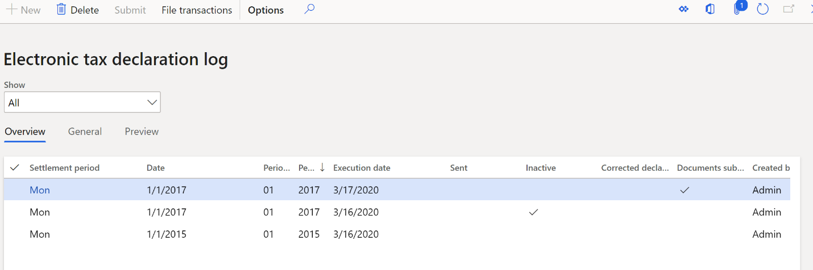
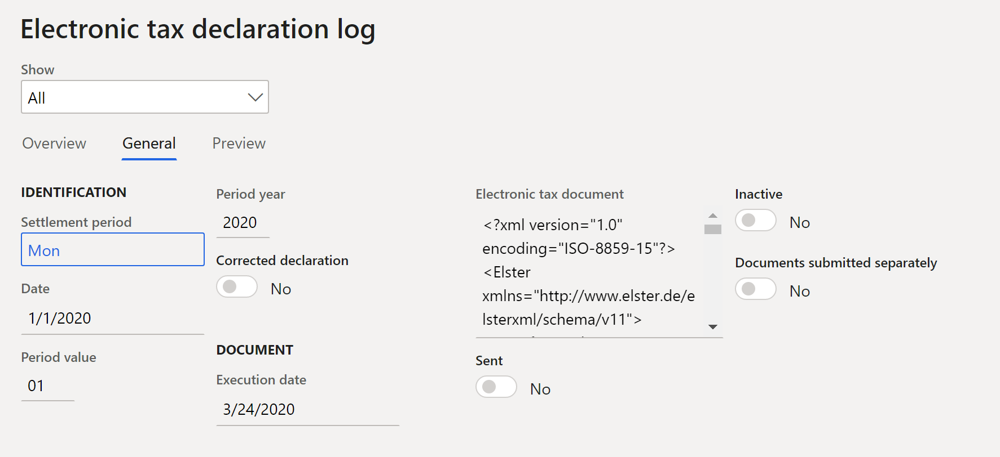
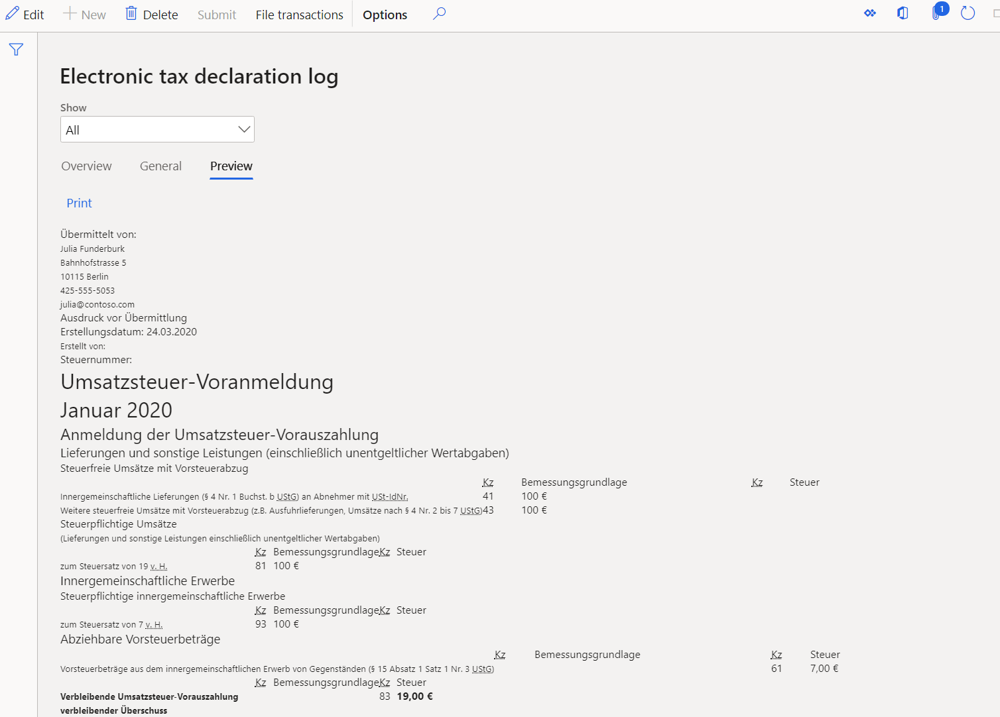
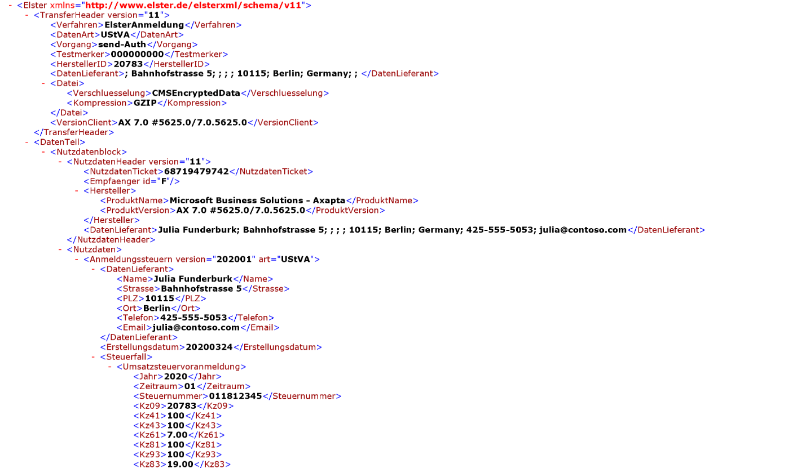
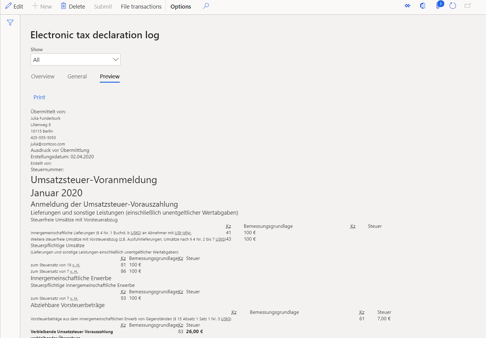
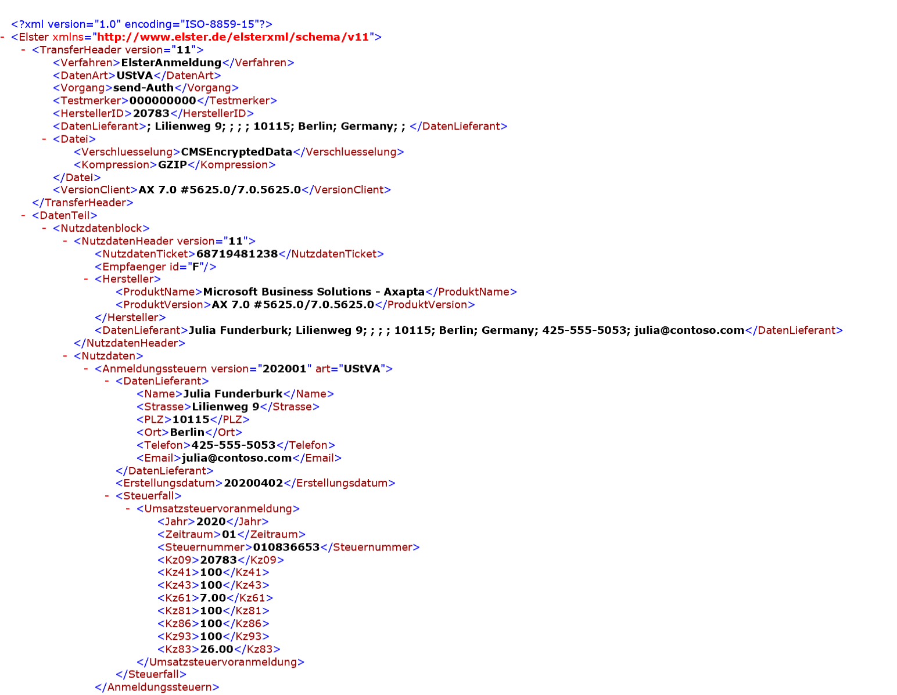
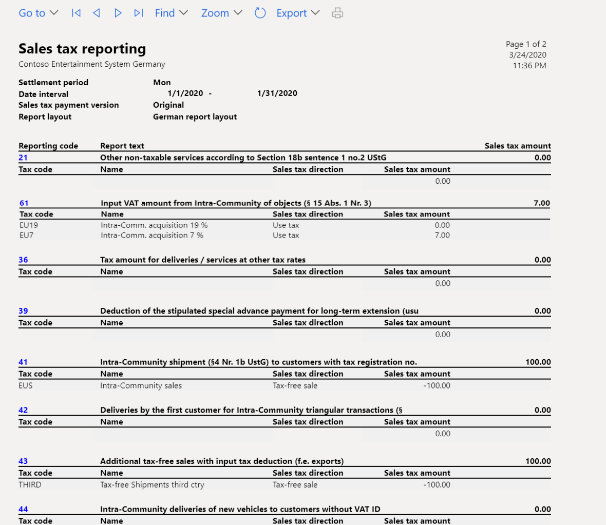
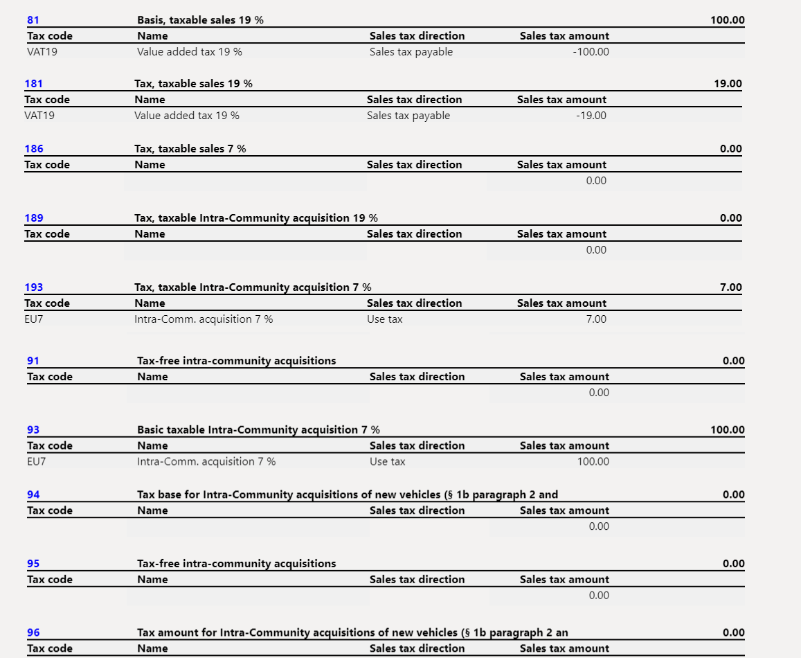

---
# required metadata

title: VAT declaration for Germany
description: This topic provides information about how to generate QR-bills and process incoming QR-bills.
author: anasyash
ms.date: 03/24/2022
ms.topic: article
ms.prod: 
ms.technology: 

# optional metadata

ms.search.form: 
audience: Application User
# ms.devlang: 
ms.reviewer: kfend
# ms.tgt_pltfrm: 
# ms.custom: 
ms.search.region: Germany
# ms.search.industry: 
ms.author: anasyash
ms.search.validFrom: 2019-06-01
ms.dyn365.ops.version: 10.0.0

---

# VAT declaration for Germany

[!include [banner](../includes/banner.md)]

> [!IMPORTANT]
  > This feature is deprecated. For more information, see [Removed and deprecated features](../get-started/removed-deprecated-features-finance.md#elster-declaration-for-germany-design-based-on-reporting-codes).
  > For more information about VAT declaration, see [VAT declaration (Germany)](emea-deu-vat-declaration-germany.md)
  
This topic explains how to set up and generate the value-added tax (VAT) declaration for legal entities in Germany.

For general information about how to set up the VAT statement, see [VAT reporting for Europe](emea-vat-reporting.md).

## Set up sales tax reporting codes for VAT reporting

Set up sales tax reporting codes by following the instructions in [Set up sales tax reporting codes](../general-ledger/tasks/set-up-sales-tax-reporting-codes.md). The following table provides an example of sales tax reporting codes for Germany.

<table width="614">
<thead>
<tr>
<td width="75">

<strong>Code</strong>

</td>
<td width="340">

<strong>Description</strong>

</td>
<td width="95">

<strong>Element in the XML file of the VAT declaration</strong>

</td>
<td width="104">

<strong>Tax base or tax amount</strong>

</td>
</tr>
</thead>
<tbody>
<tr>
<td colspan="4" width="614">

<strong>Tax-free sales with input tax deduction for intra-community supplies (&sect;4, no. 1, letter b of the UStG [Umsatzsteuergesetz</strong><strong>, or </strong><strong>VAT law])</strong>

</td>
</tr>
<tr>
<td width="75">

41

</td>
<td width="340">

Intra-community shipment (&sect;4, no. 1b of the UStG) to customers with tax registration.

</td>
<td width="95">

Kz41

</td>
<td width="104">

Tax base

</td>
</tr>
<tr>
<td width="75">

44

</td>
<td width="340">

Intra-community deliveries of new vehicles to customers without a VAT ID.

</td>
<td width="95">

Kz44

</td>
<td width="104">

Tax base

</td>
</tr>
<tr>
<td width="75">

49

</td>
<td width="340">

Intra-community deliveries of new vehicles outside a company.

</td>
<td width="95">

Kz49

</td>
<td width="104">

Tax base

</td>
</tr>
<tr>
<td width="75">

43

</td>
<td width="340">

Additional tax-free sales with input tax deduction (for example, exports).

</td>
<td width="95">

Kz43

</td>
<td width="104">

Tax base

</td>
</tr>
<tr>
<td colspan="4" width="614">

<strong>Tax-free sales without input tax deduction (for example, sales according to &sect;4, no. 8 through 28 of the UStG)</strong>

</td>
</tr>
<tr>
<td width="75">

48

</td>
<td width="340">

Tax-free sales without input tax deduction.

</td>
<td width="95">

Kz48

</td>
<td width="104">

Tax base

</td>
</tr>
<tr>
<td colspan="4" width="614">

<strong>Taxable sales</strong>

</td>
</tr>
<tr>
<td width="75">

81

</td>
<td width="340">

Tax base for deliveries or services that are charged at 19 percent.

</td>
<td width="95">

Kz81

</td>
<td width="104">

Tax base

</td>
</tr>
<tr>
<td width="75">

181

</td>
<td width="340">

Tax amount for deliveries or services that are charged at 19 percent.

</td>
<td width="95">

Not shown separately in the XML file but considered in the total (Kz83)

</td>
<td width="104">

Tax amount

</td>
</tr>
<tr>
<td width="75">

86

</td>
<td width="340">

Tax base for deliveries or services that are charged at 7 percent.

</td>
<td width="95">

Kz86

</td>
<td width="104">

Tax base

</td>
</tr>
<tr>
<td width="75">

186

</td>
<td width="340">

Tax amount for deliveries or services that are charged at 7 percent.

</td>
<td width="95">

Not shown separately in the XML file but considered in the total (Kz83)

</td>
<td width="104">

Tax amount

</td>
</tr>
<tr>
<td width="75">

35

</td>
<td width="340">

Tax base for deliveries or services at other tax rates.

</td>
<td width="95">

Kz35

</td>
<td width="104">

Tax base

</td>
</tr>
<tr>
<td width="75">

36

</td>
<td width="340">

Tax amount for deliveries or services at other tax rates.

</td>
<td width="95">

Kz36

</td>
<td width="104">

Tax amount

</td>
</tr>
<tr>
<td width="75">

77

</td>
<td width="340">

Deliveries of agricultural and forestry businesses, according to &sect;24 of the UStG, to customers who have a VAT ID.

</td>
<td width="95">

Kz77

</td>
<td width="104">

Tax base

</td>
</tr>
<tr>
<td width="75">

76

</td>
<td width="340">

Tax base of turnover that tax is payable for, according to &sect;24 of the UStG (sawmill products, beverages and alcoholic liquids, such as wine).

</td>
<td width="95">

Kz76

</td>
<td width="104">

Tax base

</td>
</tr>
<tr>
<td width="75">

80

</td>
<td width="340">

Tax amount of turnover that tax is payable for, according to &sect;24 of the UStG (sawmill products, beverages and alcoholic liquids, such as wine).

</td>
<td width="95">

Kz80

</td>
<td width="104">

Tax amount

</td>
</tr>
<tr>
<td colspan="4" width="614">

<strong>Intra-community acquisitions and VAT payable for such acquisitions</strong>

</td>
</tr>
<tr>
<td width="75">

91

</td>
<td width="340">

Tax-free intra-community acquisitions.

</td>
<td width="95">

Kz91

</td>
<td width="104">

Tax base

</td>
</tr>
<tr>
<td width="75">

89

</td>
<td width="340">

Tax base for the acquisition of goods from countries in the European Union (EU), charged at 19 percent.

</td>
<td width="95">

Kz89

</td>
<td width="104">

Tax base

</td>
</tr>
<tr>
<td width="75">

189

</td>
<td width="340">

Tax amount for the acquisition of goods from countries in the EU, charged at 19 percent.

</td>
<td width="95">

Not shown separately in the XML file but considered in the total (Kz83)

</td>
<td width="104">

Tax amount

</td>
</tr>
<tr>
<td width="75">

93

</td>
<td width="340">

Tax base for the acquisition of goods from countries in the EU, charged at 7 percent.

</td>
<td width="95">

Kz93

</td>
<td width="104">

Tax base

</td>
</tr>
<tr>
<td width="75">

193

</td>
<td width="340">

Tax amount for the acquisition of goods from countries in the EU, charged at 7 percent.

</td>
<td width="95">

Not shown separately in the XML file but considered in the total (Kz83)

</td>
<td width="104">

Tax amount

</td>
</tr>
<tr>
<td width="75">

95

</td>
<td width="340">

Tax base for the acquisition of goods from countries in the EU at other tax rates.

</td>
<td width="95">

Kz95

</td>
<td width="104">

Tax base

</td>
</tr>
<tr>
<td width="75">

98

</td>
<td width="340">

Tax amount for the acquisition of goods from countries in the EU at other tax rates.

</td>
<td width="95">

Kz98

</td>
<td width="104">

Tax amount

</td>
</tr>
<tr>
<td width="75">

94

</td>
<td width="340">

Tax base for intra-community acquisitions of new vehicles (&sect;1b, paragraphs 2 and 3 of the UStG) from suppliers without a VAT ID, at the general tax rate.

</td>
<td width="95">

Kz94

</td>
<td width="104">

Tax base

</td>
</tr>
<tr>
<td width="75">

96

</td>
<td width="340">

Tax amount for intra-community acquisitions of new vehicles (&sect;1b, paragraphs 2 and 3 of the UStG) from suppliers without a VAT ID, at the general tax rate.

</td>
<td width="95">

Kz96

</td>
<td width="104">

Tax amount

</td>
</tr>
<tr>
<td colspan="4" width="614">

<strong>Additional information about sales</strong>

</td>
</tr>
<tr>
<td width="75">

42

</td>
<td width="340">

Deliveries by the first customer for intra-community triangular transactions (&sect;25b of the UStG).

</td>
<td width="95">

Kz42

</td>
<td width="104">

Tax base

</td>
</tr>
<tr>
<td width="75">

60

</td>
<td width="340">

Taxable sales of the performing entrepreneur that the service recipient owes the tax for, according to &sect;13b (5) of the UStG.

</td>
<td width="95">

Kz60

</td>
<td width="104">

Tax base

</td>
</tr>
<tr>
<td width="75">

21

</td>
<td width="340">

Other non-taxable services according to &sect;18b, sentence 1, no. 2 of the UStG.

</td>
<td width="95">

Kz21

</td>
<td width="104">

Tax base

</td>
</tr>
<tr>
<td width="75">

45

</td>
<td width="340">

Other non-taxable sales (where the place of performance isn't in Germany).

</td>
<td width="95">

Kz45

</td>
<td width="104">

Tax base

</td>
</tr>
<tr>
<td colspan="4" width="614">

<strong>Beneficiary as tax debtor (&sect;13b of the UStG)</strong>

</td>
</tr>
<tr>
<td width="75">

46

</td>
<td width="340">

Tax base for other services in accordance with &sect;3a (2) UStG of an entrepreneur that is located in the rest of the community (&sect;13b (1) of the UStG).

</td>
<td width="95">

Kz46

</td>
<td width="104">

Tax base

</td>
</tr>
<tr>
<td width="75">

47

</td>
<td width="340">

Tax amount for other services in accordance with &sect;3a (2) UStG of an entrepreneur that is located in the rest of the community (&sect;13b (1) of the UStG).

</td>
<td width="95">

Kz47

</td>
<td width="104">

Tax amount

</td>
</tr>
<tr>
<td width="75">

73

</td>
<td width="340">

Tax base of turnover that is covered by the property transfer tax law &ndash; in particular, deliveries of land for which the performing entrepreneur has opted for tax liability in accordance with &sect;9 (3) of the UStG.

</td>
<td width="95">

Kz73

</td>
<td width="104">

Tax base

</td>
</tr>
<tr>
<td width="75">

74

</td>
<td width="340">

Tax amount of turnover that is covered by the property transfer tax law &ndash; in particular, deliveries of land for which the performing entrepreneur has opted for tax liability in accordance with &sect;9 (3) of the UStG.

</td>
<td width="95">

Kz74

</td>
<td width="104">

Tax amount

</td>
</tr>
<tr>
<td width="75">

84

</td>
<td width="340">

Tax base of other services (&sect;13b (2), no. 1, 2, and 4 through 11 of the UStG).

</td>
<td width="95">

Kz84

</td>
<td width="104">

Tax base

</td>
</tr>
<tr>
<td width="75">

85

</td>
<td width="340">

Tax amount of other services (&sect;13b (2), no. 1, 2, and 4 through 11 of the UStG).

</td>
<td width="95">

Kz85

</td>
<td width="104">

Tax amount

</td>
</tr>
<tr>
<td colspan="4" width="614">

<strong>Deductible input tax amounts</strong>

</td>
</tr>
<tr>
<td width="75">

66

</td>
<td width="340">

Tax on input from invoices of other companies (&sect;15, paragraph 1, no. 1 of the UStG).

</td>
<td width="95">

Kz66

</td>
<td width="104">

Tax amount

</td>
</tr>
<tr>
<td width="75">

61

</td>
<td width="340">

Input VAT amount from intra-community acquisitions of objects (&sect;15, paragraph 1, no. 3 of the UStG).

</td>
<td width="95">

Kz61

</td>
<td width="104">

Tax amount

</td>
</tr>
<tr>
<td width="75">

62

</td>
<td width="340">

Import sales tax that is incurred (&sect;15, paragraph 1, no. 2 of the UStG).

</td>
<td width="95">

Kz62

</td>
<td width="104">

Tax amount

</td>
</tr>
<tr>
<td width="75">

67

</td>
<td width="340">

Input tax amounts from services within the meaning of &sect;13b of the UStG (&sect;15, paragraph 1, clause 1, no. 4 of the UStG).

</td>
<td width="95">

Kz67

</td>
<td width="104">

Tax amount

</td>
</tr>
<tr>
<td width="75">

63

</td>
<td width="340">

Input tax amounts that are calculated according to general average rates (&sect;23 and &sect;23a of the UStG).

</td>
<td width="95">

Kz63

</td>
<td width="104">

Tax amount

</td>
</tr>
<tr>
<td width="75">

64

</td>
<td width="340">

Correction of input tax deduction (&sect;15a of the UStG).

</td>
<td width="95">

Kz64

</td>
<td width="104">

Tax amount

</td>
</tr>
<tr>
<td width="75">

59

</td>
<td width="340">

Input tax deduction for intra-community deliveries of new vehicles outside a company (&sect;2a of the UStG) and small businesses within the meaning of &sect;19 (1) of the UStG (&sect;15 (4a) of the UStG).

</td>
<td width="95">

Kz59

</td>
<td width="104">

Tax amount

</td>
</tr>
<tr>
<td colspan="4" width="614">

<strong>Other tax amounts</strong>

</td>
</tr>
<tr>
<td width="75">

65

</td>
<td width="340">

Tax because of changes in the form of taxation, and after-tax on taxed down payments, and so on, because of changes in tax rate.

</td>
<td width="95">

Kz65

</td>
<td width="104">

Tax amount

</td>
</tr>
<tr>
<td width="75">

69

</td>
<td width="340">

Tax amounts that are shown incorrectly or unjustifiably on invoices (&sect;14c of the UStG), and also tax amounts that are <strong>owed</strong> in accordance with &sect;6a (4), sentence 2; &sect;17 (1), sentence 6; and &sect;25b (2) of the UStG, or <strong>tax amounts that are owed</strong> by an outsourcer or warehouse keeper in accordance with &sect;13a (2) 1, no. 6 of the UStG.

</td>
<td width="95">

Kz69

</td>
<td width="104">

Tax amount

</td>
</tr>
<tr>
<td width="75">

39

</td>
<td width="340">

Deduction of the stipulated special advance payment for long-term extension (which usually will be completed only in the last advance notification of the taxation period).

</td>
<td width="95">

Kz39

</td>
<td width="104">

Tax amount

</td>
</tr>
<tr>
<td width="75">

83

</td>
<td width="340">

Total VAT amount (VAT advance payment or VAT surplus).

On the VAT declaration in XML format, the value in this box is automatically calculated as the sum of reporting codes 181, 186, 36, 80, 189, 193, 98, 96, 47, 74, and 85, minus reporting codes 66, 61, 62, 67, 63, 64, 59, 69, and 39.

</td>
<td width="95">

Kz83

</td>
<td width="104">

Tax amount

</td>
</tr>
</tbody>
</table>

&nbsp;

&nbsp;

> [!NOTE]
> For sample forms of advance VAT returns that include declaration row codes, see [Forms in the VAT procedure for the year 2020](https://umsatzsteuer-voranmeldung-2020.taxpool.net/Umsatzsteuer-Voranmeldung-2020.pdf).

## Prerequisite

Before you begin, go to the **General ledger parameters** page and expand the **Tax options** FastTab. In the **Special report** field group, make sure that the **Include corrections** parameter isn't enabled. 

## Set up sales tax codes

Set up sales tax codes by following the instructions in [Sales tax codes for VAT reporting](emea-vat-reporting.md#sales-tax-codes-for-vat-reporting) and [Sales tax overview](../general-ledger/indirect-taxes-overview.md).

> [!NOTE]
> In a German legal entity, sales tax codes for tax-free sales should be set up according to the following rules:
>
> - The tax rate is more than 0 (zero).
> - The tax code is marked as **Exempt** on the **Sales tax groups** page.

## Create a VAT declaration in XML format

1. In [Microsoft Dynamics Lifecycle Services (LCS)](https://lcs.dynamics.com/V2), in the **Shared asset library**, download the latest versions of the Electronic reporting (ER) configurations for the VAT declaration format:

    - **Elster (DE)**

    For more information, see [Download Electronic reporting configurations from Lifecycle Services](../../fin-ops-core/dev-itpro/analytics/download-electronic-reporting-configuration-lcs.md).

2. Go to **Tax** \> **Setup** \> **Sales tax** \> **Electronic tax declaration setup**.
3. In the **Format mapping** field, select the **Elster (DE)** format that you downloaded earlier.
4. Go to **Tax \> Declarations \> Sales tax \> Report sales tax for settlement period**.
5. In the **Report sales tax for settlement period** dialog box, set the following fields.

| **Field**                 | **Description**                                                                                                                                                                                                                                                                         |
|---------------------------|-----------------------------------------------------------------------------------------------------------------------------------------------------------------------------------------------------------------------------------------------------------------------------------------|
| Settlement period         | Select the applicable reporting period.                                                                                                                                                                                                                                                 |
| From date                 | Enter the first date of the sales tax settlement period that sales tax should be calculated for. This value corresponds to the date in the **From** field on the **Sales tax settlement periods** page.                                                                                 |
| Transaction date          | Enter the date when the sales tax report is calculated. The default value is the current date. The sales tax payment is calculated for all transactions that were posted during the settlement period.                                                                                  |
| Sales tax payment version | Select the type of sales tax settlement. If this sales tax settlement is the first sales tax settlement for the period, select **Original**. If a sales tax settlement has already been generated, select **Latest corrections**. For more information, see [Create a sales tax payment](../general-ledger/tasks/create-sales-tax-payment.md). |

6. Select **OK**.
7. In the **German sales tax report** dialog box, set the following fields.

| **Field**                      | **Description**                                                                                                                                                 |
|--------------------------------|-----------------------------------------------------------------------------------------------------------------------------------------------------------------|
| Create electronic tax document | Set this option to **Yes** to create an electronic document that contains the details of the report.                                                            |
| Documents submitted separately | Set this option to **Yes** if the printed report isn't submitted together with the electronic document. In the XML file, code Kz22 should have the value **1**. |

8. Select **OK**. A new line is created on the **Electronic tax declaration log** page (**Tax** \> **Declarations** \> **Sales tax** \> **Electronic tax declaration log**).

## Preview the XML file

1. Go to **Tax** \> **Declarations** \> **Sales tax** \> **Electronic tax declaration log**.
2. On the **Electronic tax declaration log** page, select the **Preview** tab to preview the reported values.
3. To review or save the XML file for further submission (outside of the system), select the line on the **Electronic tax declaration log** page, and then select the paper clip symbol in the upper-right corner.
4. The **Document handling** page appears and shows the generated file. Select **Open** at the top of the page to open the file in the application that is associated with the .xml extension in your system.

## Submission the VAT declaration to ELSTER

ELSTER (Elektronische Steuererklärung, or electronic tax declaration) is a German online tax office system that was designed by the Federal Central Tax Office for online submission of tax declarations.

The [Developers area](https://www.elster.de/elsterweb/entwickler/infoseite/download_eric_28.) of the ELSTER website provides examples that show how developers can interact with ELSTER Rich Client (ERiC) for the submission of VAT declarations in XML file format. Examples are provided for C++, C\#, and Java. To access this area of the website, you must be [registered as a developer](https://www.elster.de/elsterweb/registrierung-entwickler). An example might help you create your own executable file that you can use to submit XML files via ERiC. To use an executable file to submit XML files to ELSTER, you must download ERiC dynamics-link libraries (DLLs).

For more information about ERiC releases, see [ELSTER website](https://www.elster.de/elsterweb/entwickler/infoseite/eric).

##  Example

The following example shows how you can set up sales tax codes and sales tax reporting codes, post transactions, and generate the German VAT declaration.

1. Go to **Tax** \> **Indirect taxes** \> **Sales tax** \> **Sales tax codes**, and set up the following sales tax codes.

| **Sales tax code** | **Percentage** | **Description**                                                                       |
|--------------------|----------------|---------------------------------------------------------------------------------------|
| VAT19              | 19             | Domestic sales at a rate of 19 percent.                                               |
| VAT7               | 7              | Domestic sales at a rate of 7 percent.                                                |
| InVAT19            | 19             | Domestic purchases at a rate of 19 percent.                                           |
| InVAT7             | 7              | Domestic purchases at a rate of 7 percent.                                            |
| EU19               | 19             | EU purchases at a rate of 19 percent, where the **Use tax** option is set to **Yes**. |
| EU7                | 7              | EU purchases at a rate of 7 percent, where the **Use tax** option is set to **Yes**.  |
| EUS                | 19             | EU sales where the **Exempt** option is set to **Yes**.                               |
| THIRD              | 19             | Export sales where the **Exempt** option is set to **Yes**.                           |

2. On the **Sales tax codes** page, on the **Report setup** FastTab, assign reporting codes to sales tax codes.

The following table shows how to assign the sales tax reporting codes to sales tax codes.

| **Sales tax code** | **Taxable sales** | **Tax-free sale** | **Sales tax payable** | **Taxable purchases** | **Sales tax receivable** | **Taxable import** | **Use tax** | **Offset use tax** |
|--------------------|-------------------|-------------------|-----------------------|-----------------------|--------------------------|--------------------|-------------|--------------------|
| VAT19              | 81                |                   | 181                   |                       |                          |                    |             |                    |
| VAT7               | 86                |                   | 186                   |                       |                          |                    |             |                    |
| InVAT19            |                   |                   |                       |                       | 66                       |                    |             |                    |
| InVAT7             |                   |                   |                       |                       | 66                       |                    |             |                    |
| EU19               |                   |                   |                       |                       |                          | 89                 | 189         | 61                 |
| EU7                |                   |                   |                       |                       |                          | 93                 | 193         | 61                 |
| EUS                |                   | 41                |                       |                       |                          |                    |             |                    |
| THIRD              |                   | 43                |                       |                       |                          |                    |             |                    |

> [!NOTE]
> The preceding configuration is just an example and depends on the structure of the sales tax codes that are used. If you want values to be calculated and transferred to the sales tax report, for each tax code that is used in the sales tax payment process, you must set a relevant sales tax reporting code in one or more fields on the **Report setup** FastTab.

3. Go to **Tax \> Setup \> Sales tax \> Electronic tax declaration setup**.
4. In the **Format mapping** field, select the **Elster (DE)** format that you downloaded earlier.
5. Post the following transactions. For example, for customer invoices, go to **Accounts receivable** \> **Invoices** \> **All free text invoices**. For vendor invoices, go to **Accounts payable \> Invoices \> Invoice journal**.

| **Date**        | **Transaction type**      | **Amount net** | **VAT amount** | **Sales tax code** | **Expected tax base – reporting code** | **Expected tax amount – reporting code** |
|-----------------|---------------------------|----------------|----------------|--------------------|----------------------------------------|------------------------------------------|
| January 1, 2020 | Customer invoice          | 100            | 19             | VAT19              | 81                                     | 181                                      |
| January 1, 2020 | Vendor invoice (EU)       | 100            | 7              | EU7                | 93                                     | 193 – Tax payable 61 – Tax deduction     |
| January 1, 2020 | Customer invoice (EU)     | 100            | 0              | EUS                | 41                                     | Not applicable                           |
| January 1, 2020 | Customer invoice (export) | 100            | 0              | THIRD              | 43                                     | Not applicable                           |

6. Go to **Tax** \> **Declarations** \> **Sales tax** \> **Report sales tax for settlement period**.
7. In the **Report sales tax for settlement period** dialog box, set the following fields to the specified values:

    - **Settlement period:** Mon
    - **From date:** 1/1/2020

8. Select **OK**.
9. In the **German sales tax report** dialog box, select the **Create electronic tax document** check box.
10. Select **OK**.
11. Go to **Tax** \> **Declarations** \> **Sales tax** \> **Electronic tax declaration log**, and select the required line.
12. On the **Electronic tax declaration log** page, select the **General** tab, and review the general information.

13. Select the **Preview** tab, and review the reported values.

14. Select the paper clip symbol in the upper-right corner.
15. Select **Open** at the top of the page, and review the XML file.

### Correction transactions

1.  Post a new transaction. For example, to post a customer invoice, go to **Accounts receivable** \> **Invoices** \> **All free text invoices**.

| **Date**        | **Transaction type**        | **Amount net** | **VAT amount** | **Sales tax code** | **Expected tax base – Reporting code** | **Expected tax amount – Reporting code** |
|-----------------|-----------------------------|----------------|----------------|--------------------|----------------------------------------|------------------------------------------|
| January 1, 2020 | Customer invoice (domestic) | 100            | 7              | VAT7               | 86                                     | 186                                      |

2. Go to **Tax** \> **Declarations** \> **Sales tax** \> **Report sales tax for settlement period**.
3. In the **Report sales tax for settlement period** dialog box, set the following fields to the specified values:

    - **Settlement period:** Mon
    - **From date:** 1/1/2020

4. Select **OK**.
5. In the **German sales tax report** dialog box, select the **Create electronic tax document** check box.
6. Select **OK**.
7. Go to **Tax** \> **Declarations** \> **Sales tax** \> **Electronic tax declaration log**, and select the required line.
8. Select the **Preview** tab, and review the reported values.

    

    A correction transaction is added to the declaration in codes **86** and **83**.

9. Select the paper clip symbol in the upper-right corner.
10. Select **Open** at the top of the page, and review the XML file.

    

    A correction transaction is added to the declaration in codes **86** and **83**.

## Review sales tax report amounts 

You can optionally review sales tax amount in SSRS report.

### Set up the report layout for sales tax authorities

1. Go to **Tax** \> **Indirect taxes** \> **Sales tax** \> **Sales tax authorities**.
2. On the **Sales tax authorities** page, select the sales tax authority that will be used in the sales tax codes for the sales tax settlement period.
3. In the **Report layout** field, select **German report layout**.

###  Generate a sales tax payment and print the German sales tax report

At the end of the VAT reporting period, calculate the sales tax amounts for the settlement period.

1. Go to **Tax** \> **Declarations** \> **Sales tax** \> **Settle and post sales tax**.
2. In the **Settle and post sales tax** dialog box, set the required fields as described [earlier](#createvatdecxmlformat).
3. Select **OK**.
4. In the **German sales tax report** dialog box, set the **Create electronic tax document** option to **No**.
5. Select **OK** to generate the sales tax payment and review the report.

If you post transactions as described in step 5 of the [example](#example) earlier in this topic, you will see the following data.

### Print a sales tax payment report from a sales tax payment

1. Go to **Tax** \> **Inquiries and reports** \> **Sales tax payments**.
2. On the **Sales tax payment** page, select the record, and then select **Print report**.
3. In the dialog box, set the fields as described in the previous section, and then select **OK**.

### Report sales tax for the settlement period

You can also generate the German sales tax report by using the **Report sales tax for settlement period** inquiry.

1. Go to **Tax** \> **Declarations** \> **Sales tax** \> **Report sales tax for settlement period**.
2. In the **Report sales tax for settlement period** dialog box, set the **Settlement period** and **From date** fields as described in the [Generate a sales tax payment and print the German sales tax report](#generatesalestaxpayment) section earlier in this topic.
3. In the **Sales tax payment version** field, select one of the following values:

- **Original** – Generate a report for sales tax transactions of the first posted settlement calculation for the period.
- **Corrections** – Generate a report for sales tax transactions of subsequent settlement calculations for the period.
- **Total list** – Generate a report for all sales transactions for the period. These transactions include original and corrected transactions.

4. Select **OK**.
5. Go to **Tax** \> **Declarations** \> **Sales tax** \> **Settle and post sales tax**.
6. In the **Settle and post sales tax** dialog box, in the **Sales tax payment version** field, select **Original**.
7.  Print the report, and review the data.

| **Reporting code** | **Sales tax amount** |
|--------------------|----------------------|
| 41                 | 100                  |
| 43                 | 100                  |
| 61                 | 7                    |
| 81                 | 100                  |
| 93                 | 100                  |
| 181                | 19                   |
| 193                | 7                    |

8. Go to **Tax** \> **Declarations** \> **Sales tax** \> **Settle and post sales tax**.
9. In the **Settle and post sales tax** dialog box, in the **Sales tax payment version** field, select **Latest corrections**.
10. Go to **Tax** \> **Declarations** \> **Sales tax** \> **Report sales tax for settlement period**.
11. In the **Report sales tax for settlement period** dialog box, in the **Sales tax payment version** field, select **Corrections**. The following table shows the result.

| **Reporting code** | **Sales tax amount** |
|--------------------|----------------------|
| 86                 | 100                  |
| 186                | 7                    |

12. Go to **Tax** \> **Declarations** \> **Sales tax** \> **Report sales tax for settlement period**.
13. In the **Report sales tax for settlement period** dialog box, in the **Sales tax payment version** field, select **Total list**. The following table shows the result.

| **Reporting code** | **Sales tax amount** |
|--------------------|----------------------|
| 41                 | 100                  |
| 43                 | 100                  |
| 61                 | 7                    |
| 81                 | 100                  |
| 86                 | 100                  |
| 93                 | 100                  |
| 181                | 19                   |
| 186                | 7                    |
| 193                | 7                    |

[!INCLUDE[footer-include](../../includes/footer-banner.md)]
