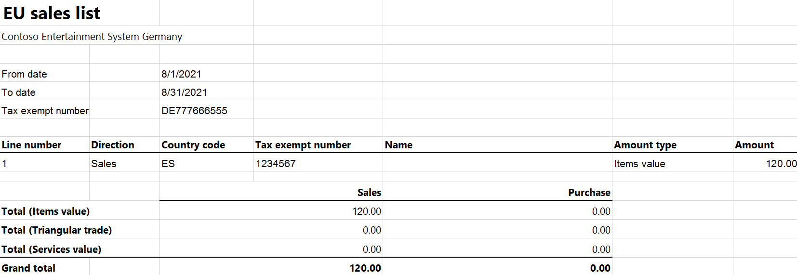

---
# required metadata

title: EU Sales list for Germany
description: This topic provides information about the European Union (EU) sales list report for Germany.
author: AKroshkina
ms.date: 03/02/2022
ms.topic: article
ms.prod: 
ms.technology: 

# optional metadata

#ms.search.form:
audience: IT Pro, Application User
# ms.devlang: 
ms.reviewer: kfend
# ms.suite: 
# ms.tgt_pltfrm: 
# ms.custom: 
ms.search.region: 
# ms.search.industry: 
ms.author: anasyash
ms.dyn365.ops.version: 
ms.search.validFrom: 
---

# EU Sales list for Germany

[!include [banner](../includes/banner.md)]

This topic provides information about the European Union (EU) sales list report. The German EU sales list report contains information about the sale of goods and services for reporting in text format.
The following fields are included on the German EU sales list report:

- **EU sales list header:**

    - EU sales list registration ID
    - Date of the report creation
    - Company name
    - Street
    - Postcode
    - Location

- **EU sales list lines:**

    - Company VAT ID
    - Existence of a correction
    - Reporting period
    - Report issue year
    - Customer VAT ID
    - Total amount of items
    - Total amount of services
    - Total amount of the triangular trade
    - Existence of a notice or revocation

- **EU sales list footer:**

    - Company VAT ID
    - Reporting period
    - Total amount
    - Number of EU sales list lines

## Setup

For general setup information, see [EU Sales list reporting](emea-eu-sales-list.md#prerequisites).

### Set up company information

Create a registration type, and assign it to the **VAT ID** registration category for Germany and all the countries or regions that your company does business with. For more information, see [Registration IDs](emea-registration-ids.md).

1. Go to **Organization administration** > **Organizations** > **Legal entities**.
2. In the grid, select your company.
3. On the **Addresses** FastTab, set the city, ZIP/postal code, and street for the primary address that will be shown on the EU sales list report.
4. On the Action Pane, select **Registration IDs**.
5. On the **Registration ID** FastTab, select **Add**.
6. On the **Overview** tab, in the **Registration type** field, select the registration type that you created.
7. Enter your company's value-added tax (VAT) ID.
8. Optional: On the **General** tab, in the **General** section, change the period when the VAT ID is used.
9. Close this page.

   > [!NOTE]
   > If the **VAT exempt number export** field in the **Intrastat** section on the **Foreign trade and logistics** FastTab is set (that is, it isn't blank), that value will be used, instead of the VAT ID that you created, in the .txt and .xlsx files for the EU sales list report.

### Import Electronic reporting configurations

In [Microsoft Dynamics Lifecycle Services (LCS)](https://lcs.dynamics.com/Logon/Index), import the latest version of the following Electronic reporting (ER) configurations for the EU sales list:

- EU Sales list model
- EU Sales list by columns report
- EU Sales list by rows report
- EU Sales list (DE)

For more information, see [Download Electronic reporting configurations from Lifecycle Services](../../fin-ops-core/dev-itpro/analytics/download-electronic-reporting-configuration-lcs.md).

### Set up foreign trade parameters

1. In Dynamics 365 Finance, go to **Tax** > **Setup** > **Foreign trade** > **Foreign trade parameters**.
2. On the **EU sales list** tab, set the **Report cash discount** option to **Yes** if a cash discount should be included in the value when a transaction is included in the EU sales list.
3. On the **Electronic reporting** FastTab, in the **File format mapping** field, select **EU Sales list (DE)**.
4. In the **Report format mapping** field, select **EU Sales list by rows report** or **EU Sales list by columns report**.
5. On the **Country/region properties** tab, select **New**, and set the following fields:

    - In the **Country/region** field, select **DEU**.
    - In the **Country/region type** field, select **Domestic**.

6. List all the countries or regions that your company does business with. For each country that is part of the EU, in the **Country/region type** field, select **EU**.

## Work with the EU sales list

For general information about which types of transactions are included in the EU sales list, how to generate the EU sales list report, and how to close the EU sales list reporting period, see [EU Sales list reporting](emea-eu-sales-list.md#working-with-the-esl).

### Generate the EU sales list report

1. Go to **Tax** > **Declarations** > **Foreign trade** > **EU sales list**.
2. Transfer transactions in the usual way.
3. Optional: To create correction files, follow these steps.

    1. For corrective lines, select the checkbox in the **Corrected** column.
    2. In the **EU sales list reporting** dialog box, on the **Parameters** FastTab, set the **Correction** option to **Yes**.
    3. On the **Records to include** FastTab, apply a filter to show only corrective lines.

4. On the Action Pane, select **Reporting**.
5. In the **EU sales list reporting** dialog box, on the **Parameters** FastTab, set the following fields.

    | Field                         | Description                                                                                                               |
    |-------------------------------|---------------------------------------------------------------------------------------------------------------------------|
    | Reporting period              | Select **Monthly** or **Quarterly**.                                                                                      |
    | From date                     | Select the start date for the report.                                                                                     |
    | Generate file                 | Set this option to **Yes** to generate a .txt file for your EU sales list report.                                         |
    | File name                     | Enter the name of the .txt file.                                                                                          |
    | Generate report               | Set this option to **Yes** to generate an .xlsx file for your EU sales list report.                                       |
    | Report file name              | Enter the name of the .xlsx file.                                                                                         |
    | EU Sales List Registration ID | Enter the registration ID for the EU sales list.                                                                          |
    | Correction                    | Set this option to **Yes** to create correction files.                                                                    |
    | Notification type             | Leave this field set to **None** if no notification or revocation exists. Otherwise, select **Notice** or **Revocation**. |

6. Select **OK**, and review the generated reports.

## Example

For information about how to create a general setup, create postings, and transfer transactions by using the **DEMF** legal entity for Germany, see [Example for generic EU Sales list](emea-eu-sales-list-example.md).

### Create an EU sales list report

1. Go to **Tax** > **Declarations** > **Foreign trade** > **EU sales list**.
2. On the Action Pane, select **Reporting**.
3. In the **EU sales list reporting** dialog box, on the **Parameters** FastTab, set the following fields:

    - In the **Reporting period** field, select **Monthly**.
    - In the **From date** field, select **8/1/2021** (August 1, 2021).
    - Set the **Generate file** option to **Yes**.
    - In the **File name** field, enter **DE-007F**.
    - Set the **Generate report** option to **Yes**.
    - In the **Report file name** field, enter **DE-007R**.
    - In the **EU Sales List Registration ID** field, enter **DE1234**.

4. Select **OK**, and review the report in text format that is generated. The following tables show the values on the example report.

    **EU sales list header**

    | Field                         | Value                                |
    |-------------------------------|--------------------------------------|
    | Record type                   | 0                                    |
    | EU sales list registration ID | DE1234                               |
    | Date of the report creation   | 20211115                             |
    | Company name                  | Contoso Entertainment System Germany |
    | Company street                | Bahnhofstraße 5                      |
    | Company postcode              | 10115                                |
    | Company location              | Berlin                               |

    **EU sales list lines**

    | Field | Line 1 value | Comment |
    |-------------------------|-------------------------|-------------------------|
    | Record type | 1 | The value **1** represents item and service records. |
    | Company VAT ID | DE777666555 |  |
    | Existence of a correction | 10 | If the **Correction** option is set to **No**, this field is set to **10**. If the **Correction** option is set to **Yes**, this field is set to **11**. |
    | Reporting period | 28 | If the **Reporting period** field in the **EU sales list reporting** dialog box is set to **Monthly**, this field is set to a number from **21** (January) through **32** (December). The value **28** corresponds to the month of August. If the **Reporting period** field in the **EU sales list reporting** dialog box is set to **Quarterly**, this field is set to a number from **01** (first quarter) through **04** (fourth quarter). |
    | Report issue year | 21 |  |
    | Customer VAT ID | ES1234567 |  |
    | Sum of all invoices by customer | 000000120.00 |  |
    | Transaction code |  | For an item record, this field is blank. For a service record, it's set to **S**. For a triangular trade record, it's set to **T**. |
    | Existence of a notice | 10 | If the **Notification type** field is set to a value other than **Notice**, this field is set to **10**. If the **Notification type** field is set to **Notice**, this field is set to **11**. |
    | Existence of a revocation | 10 | If the **Notification type** field is set to a value other than **Revocation**, this field is set to **10**. If the **Notification type** field is set to **Revocation**, this field is set to **11**. |

    **EU sales list footer**

    | Field                         | Value         |
    |-------------------------------|---------------|
    | Record type                   | 2             |
    | Company VAT ID                | DE777666555   |
    | Reporting period              | 28            |
    | Report issue year             | 21            |
    | Total amount                  | 000000120\.00 |
    | Number of EU sales list lines | 00001         |

5. Review the report in Excel format that is generated.

    
    
    
[!INCLUDE[footer-include](../../includes/footer-banner.md)]
