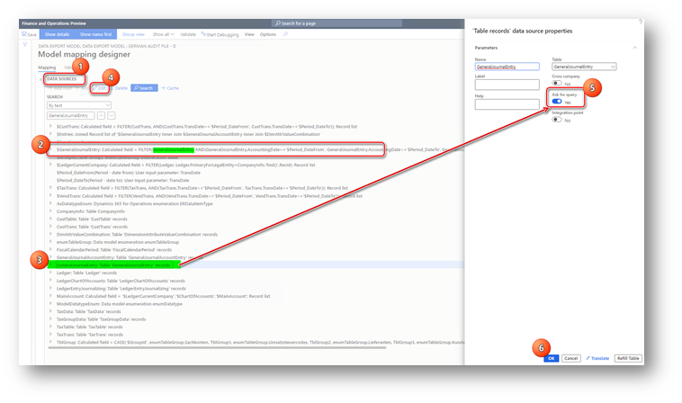
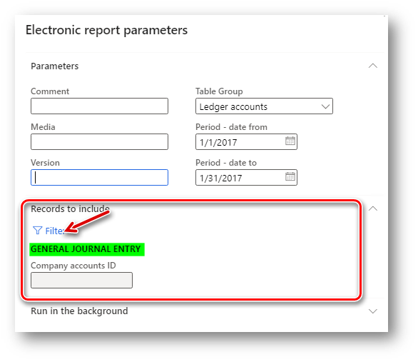

---
# required metadata

title: Add filters to an audit file configuration
description: This topic explains how to add a data filter in the German audit file.
author: liza-golub
ms.date: 02/09/2021
ms.topic: article
ms.technology: 

# optional metadata

ms.search.form: ERWorkspace
audience: Application User
ms.reviewer: kfend
# ms.tgt_pltfrm: 
ms.search.region: Austria, Germany
# ms.search.industry: 
ms.author: elgolu

---

# Add filters to an audit file configuration

[!include [banner](../includes/banner.md)]

This topic explains how to add a filter for data in the German audit file. For example, you can add a filter for the **Posting layer** field in the **General journal entry** table.

As explained in [German audit file (GDPdU/GoBD) overview](emea-deu-gdpdu-audit-data-export.md#sachkontobuchungen), the **SPEZIALBUCHUNG** (Posting layer) field of **Sachkontobuchungen** data set is collected from the **$GeneralJournalEntry/PostingLayer** electronic reporting data source path. To add the possibility of filtering data in the report by the **SPEZIALBUCHUNG** (Posting layer) field, complete the following steps:

1. Go to **Workspaces** > **Electronic reporting**, and then select **Reporting configurations**.
2. In the configuration tree, select the **Data export model** configuration, and derive it by creating a format that will be used in your company.
3. Select the derived configuration, and on the Action Pane, select **Designer**. 
4. On the **Data model** page, on the Action Pane, select **Map model to datasource**.
5. On the **Model to datasource mapping** page, select the **Group** definition. On the Action Pane, select **Designer**, and then search for “$GeneralJournalEntry” data source in the **Data sources** section on the **Model mapping design** page.

  “$GeneralJournalEntry” data source is a calculated record list that sources data from the **GeneralJournalEntry** table (this can be observed from the formula for “$GeneralJournalEntry”).
  
6. In the **Data sources** section on the **Model mapping design** page, search for **GeneralJournalEntry** and select this table.
7. In the **Data sources** section, select **Edit** and then select the **Ask for query** check box for the **GeneralJournalEntry** table. Select **OK**.

8. Save, close, and complete the configuration.
9. Unmark the **Default for model mapping** parameter for the parent configuration, **Data export model**, if it was marked. Select your derived configuration as **Default for model mapping**. 

With this change, when you run **Data export** periodic tasks, you will see **Records to include** on the FastTab in the dialog box for the report for the **General journal entry** table. Select **Filter** to specify conditions for general ledger entries filtering.

To filter by the **Posting layer** field in the **General journal entry** table, select **Posting layer** in the **Field** column, and then select the necessary posting layer in the **Criteria** column.
