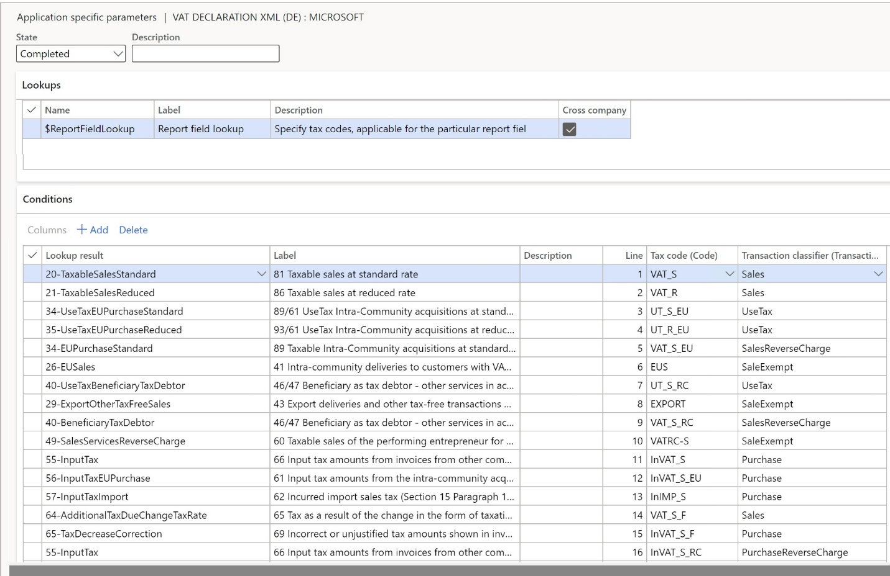

# VAT declaration (Germany)

[!include [banner](../includes/banner.md)]

This article describes how to set up and generate an advance value-added tax (VAT) declaration for Germany in the official XML format. This article also explains how to preview the VAT declaration in Microsoft Excel.

To automatically generate the report, create enough sales tax codes to keep a separate VAT accounting for each box on the advance VAT declaration. Additionally, in the application-specific parameters of the Electronic reporting (ER) format for the advance VAT declaration, associate sales tax codes with the lookup result of the lookups for the boxes on the VAT declaration.

For Germany, you must configure **Report field lookup**. For more information about how to set up application-specific parameters, see the [Set up application-specific parameters for VAT declaration fields](#set-up-application-specific-parameters-for-vat-declaration-fields) section later in this article.

In the following table, the "Lookup result" column shows the lookup result that is preconfigured for a specific VAT declaration row in the VAT declaration format. Use this information to correctly associate sales tax codes with the lookup result and then with the row of the VAT declaration.

### VAT declaration overview

The advance VAT declaration in Germany contains the following information.

**SECTION – DELIVERIES AND OTHER SERVICES**

**Taxable sales**

| Row | Box – tax base | Box – tax amount | Description     | Lookup result         |
|-----|--------------- |------------------|-----------------|-----------------------|
| 12  | 81             | Without code     | Taxable sales at a tax rate of 19 percent. | 20-TaxableSalesStandard 73-BadDebtsWriteOffStandard (81/50) – with minus sign  |
| 13  | 86             | Without code     | Taxable sales at a tax rate of 7 percent.  | 21-TaxableSalesReduced 73-BadDebtsWriteOffReduced (86/50) – with minus sign  |
| 14  | 87             | *No tax amount*  | Taxable sales at a tax rate of 0 percent.  | 14-TaxableSalesZeroRates 73-BadDebtsWriteOffZeroRate (87/50) – with minus sign  |
| 15  | 35             | 36               | Taxable sales at other tax rates.          | 22-TaxableSalesOtherRates 73-BadDebtsWriteOffOtherRates (35/36/50) – with minus sign   |
| 16  | 77             | *No tax amount*  | Deliveries from agricultural and forestry businesses in accordance with section 24 of the German VAT Act (UStG) to customers that have a VAT ID number. | 23-EUSalesAverageRate24 73-BadDebtsWriteOffEUSalesAverageRate24 (77/50) – with minus sign |
| 17  | 76             | 80               | Sales that a tax must be paid for, according to section 24 of UStG (sawmill products, beverages, and alcoholic liquids).     | 24-SalesAverageRate24 73-BadDebtsWriteOffSalesAverageRate24 (76/80/50)      |

**Tax-free sales with input tax deduction**

| Row | Box – tax base | Box – tax amount | Description                                                                       | Lookup result                       |
|-----|----------------|------------------|-----------------------------------------------------------------------------------|-------------------------------------|
| 18  | 41             | *No tax amount*  | Intra-community deliveries to customers that have a VAT ID.                       | 26-EUSales                          |
| 19  | 44             | *No tax amount*  | Intra-community deliveries of new vehicles to buyers that don't have a VAT ID.    | 27-EUSalesNewVehicles               |
| 20  | 49             | *No tax amount*  | Intra-community deliveries of new vehicles outside a company.                     | 28-EUSalesNewVehiclesOutsideCompany |
| 21  | 43             | *No tax amount*  | Other tax-free sales that have an input tax deduction, such as export deliveries. | 29-ExportOtherTaxFreeSales          |

**Tax free sales without input tax deduction**

| Row | Box – tax base | Box – tax amount | Description                                            | Lookup result                           |
|-----|----------------|------------------|--------------------------------------------------------|-----------------------------------------|
| 22  | 48             | *No tax amount*  | Tax free sales that don't have an input tax deduction. | 30-TaxFreeSalesWithoutInputTaxDeduction |

**Intra-community acquisitions**

| Row | Box – tax base | Box – tax amount | Description                                                                                                                   | Lookup result                                                    |
|-----|----------------|------------------|-------------------------------------------------------------------------------------------------------------------------------|------------------------------------------------------------------|
| 23  | 91             | *No tax amount*  | Tax-free intra-community acquisitions of some objects and investment gold.                                                    | 33-TaxFreeEUPurchase                                             |
| 24  | 89             | Without code     | Taxable intra-community acquisitions at a tax rate of 19 percent.                                                             | 34-EUPurchaseStandard 34-UseTaxEUPurchaseStandard (89/61)        |
| 25  | 93             | Without code     | Taxable intra-community acquisitions at a tax rate of 7 percent.                                                              | 35-EUPurchaseReduced 35-UseTaxEUPurchaseReduced (93/61)          |
| 26  | 90             | *No tax amount*  | Taxable intra-community acquisitions at a tax rate of 0 percent.                                                              | 26-EUPurchaseZeroRate 26-UseTaxEUPurchaseZeroRate (90/61)          |
| 27  | 95             | 98               | Taxable intra-community acquisitions at other tax rates.                                                                      | 36-EUPurchaseOtherRates 36-UseTaxEUPurchaseOtherRates (95/98/61) |
| 28  | 94             | 96               | Taxable intra-community acquisitions of new vehicles from suppliers that don't have a VAT ID number, at the general tax rate. | 37-EUPurchaseVehicles 37-UseTaxEUPurchaseVehicles (94/96/61)     |

**SECTION – BENEFICIARY AS TAX DEBTOR**

| Row | Box – tax base | Box – tax amount | Description                                                                        | Lookup result                                                                                        |
|-----|----------------|------------------|------------------------------------------------------------------------------------|------------------------------------------------------------------------------------------------------|
| 29  | 46             | 47               | Other services of an entrepreneur, based on the rest of the Community area.        | 40-BeneficiaryTaxDebtor 40-UseTaxBeneficiaryTaxDebtor (46/47/66)                                                                              |
| 30  | 73             | 74               | Sales that fall under section 13b (2) no. 3 of UStG.                               | 41-BeneficiaryTaxDebtorRealEstateTransfer 41-UseTaxBeneficiaryTaxDebtorRealEstateTransfer (73/74/67) |
| 31  | 84             | 85               | Other services that fall under section 13b (2) no. 1, 2, and 4 through 12 of UStG. | 42-BeneficiaryTaxDebtorOther 42-UseTaxBeneficiaryTaxDebtorOther (84/85/67)                           |

**SECTION – SUPPLEMENTARY INFORMATION ON SALES**

| Row | Box – tax base  | Box – tax amount | Description                                                                                                | Lookup result                                                                                    |
|-----|-----------------|------------------|------------------------------------------------------------------------------------------------------------|--------------------------------------------------------------------------------------------------|
| 32  | 42              | *No tax amount*  | Deliveries by the first customer in the case of intra-community triangular transactions.                   | 48-DeliveriesFirstCustomerEUTriangular                                                           |
| 33  | 60              | *No tax amount*  | Taxable sales of the performing entrepreneur that the recipient of the service owes the tax according for. | 49-SalesServicesReverseCharge                                                                    |
| 34  | 21              | *No tax amount*  | Other non-taxable services.                                                                                | 50-OtherServicesNonTaxable                                                                       |
| 35  | 45              | *No tax amount*  | Other non-taxable sales when the place of performance isn't in Germany.                                    | 51-OtherSalesNonTaxable                                                                          |
| 36  | *No tax amount* | *No tax amount*  | VAT.                                                                                                       | Total of lines 12 to 17 and 24 to 31 |

**SECTION – DEDUCTIBLE INPUT TAX**

| Row | Box – tax amount | Description                                                                                                | Lookup result                                                                                                                                                                |
|-----|------------------|------------------------------------------------------------------------------------------------------------|------------------------------------------------------------------------------------------------------------------------------------------------------------------------------|
| 37  | 66               | Input invoice tax amounts from other companies, services, and intra-community triangular transactions.     | 55-InputTax 40-UseTaxBeneficiaryTaxDebtor (46/47/66) 74-BadDebtsWriteOffInputTax (66/37) – with minus sign                                                                   |
| 38  | 61               | Input tax amounts from the intra-community acquisition of goods.                                           | 56-InputTaxEUPurchase 34-UseTaxEUPurchaseStandard (89/61) 35-UseTaxEUPurchaseReduced (93/61) 36-UseTaxEUPurchaseOtherRates (95/98/61) 37-UseTaxEUPurchaseVehicles (94/96/61) |
| 39  | 62               | Incurred import sales tax.                                                                                 | 57-InputTaxImport                                                                                                                                                            |
| 40  | 67               | Input tax amounts from services within the meaning of section 13b of UStG.                                        | 58-InputTaxServices 41-UseTaxBeneficiaryTaxDebtorRealEstateTransfer (73/74/67) 42-UseTaxBeneficiaryTaxDebtorOther (84/85/67)                                                 |
| 41  | 63               | Input tax amounts that are calculated according to general average rates.                                  | 59-InputTaxAverageRates 74-BadDebtsWriteOffInputTaxAverageRates (63/37) – with minus sign                                                                                    |
| 42  | 59               | Input tax deduction for intra-community deliveries of new vehicles outside a company and small businesses. | 60-InputTaxEUPurchaseNewVehicles 74-BadDebtsWriteOffInputTaxEUPurchaseNewVehicles (59/37) – with minus sign                                                                  |
| 43  | 64               | Correction of the input tax deduction.                                                                     | 61-InputTaxCorrection                                                                                                                                                        |
| 44  | \-               | The remaining amount.                                                                                      | Line 36 minus lines 37 to 43  |

**SECTION – OTHER TAX AMOUNTS**

| Row | Box – tax amount | Description  | Lookup result           |
|-----|------------------|--------------|-------------------------|
| 45  | 65               | Tax because of a change in the form of taxation and additional tax on taxed down payments because of change in the tax rate.                                                                                                                                        | 64-AdditionalTaxDueChangeTaxRate              |
| 46  | 69               | Incorrect or unjustified tax amounts that are shown on invoices, and tax amounts that are owed in accordance with section 6a (4) sentence 2, section 17 (1) sentence 7, or section 25b (2) of UStG, or that are owed by an outsourcing company or warehouse keeper. | 65-TaxDecreaseCorrection                      | 
| 47  | \-               | Sales tax prepayment/surplus. | Sum of lines 44 to 46 |
| 48  | 39               | Deduction of the fixed special advance payment for permanent extension. This row is typically filled in only with the last advance notification of the tax period.                                                                                                  | User input parameter in the report dialog box |
| 49  | 83               | The remaining advance sales tax payment and remaining excess. Include a minus sign in front of the amount.                                                                                                                                                          | Row 44 + Row 45 – Row 46 – Row 44 |

**SECTION – SUPPLEMENTARY INFORMATION ON REDUCTIONS**

| Row | Box – tax base | Box – tax amount | Description                                                            | Lookup result                                                                                                                                                                                                    |
|-----|----------------|------------------|------------------------------------------------------------------------|------------------------------------------------------------------------------------------------------------------------------------------------------------------------------------------------------------------|
| 50  | 50             | \-               | Reduction of the tax base on lines 12 through 17.                      | 73-BadDebtsWriteOffStandard (81/50) 73-BadDebtsWriteOffReduced (86/50) 73-BadDebtsWriteOffOtherRates (35/36/50) 73-BadDebtsWriteOffZeroRate (87/50) 73-BadDebtsWriteOffEUSalesAverageRate24 (77/50) 73-BadDebtsWriteOffSalesAverageRate24 (76/80/50) |
| 51  | \-             | 37               | Reduction of the deductible input tax amounts (on line 37 from invoices from other companies (Section 15 paragraph 1 sentence 1 number 1 UStG) and on lines 41 and 42). | 74-BadDebtsWriteOffInputTax (66/37) 74-BadDebtsWriteOffInputTaxAverageRates (63/37) 74-BadDebtsWriteOffInputTaxEUPurchaseNewVehicles (59/37)                                                                     |

#### Purchase reverse charge VAT

If you configure sales tax codes to post incoming reverse charge VAT by using use tax, associate your sales tax codes with the lookup result of **Report field lookup** that contains "UseTax" in the name.

Alternatively, you can configure two separate sales tax codes: one for VAT due and one for VAT deduction. Then associate each code with the corresponding lookup results of **Report field lookup**.

For example, for taxable intra-community acquisitions at a standard rate, you configure sales tax code **UT_S_EU** with use tax and associate it with the **34-UseTaxEUPurchaseStandard** lookup result of **Report field lookup**. In this case, amounts that use the **UT_S_EU** sales tax code are reflected in boxes 089 and 061 (rows 34 and 56).

Alternatively, you configure two sales tax codes:

  - **VAT_S_EU**, which has a tax rate value of -19 percent
  - **InVAT_S_EU**, which has a tax rate value of 19 percent

You then associate the codes with lookup results of **Report field lookup** in the following way:

  - Associate **VAT_S_EU** with the **34-EUPurchaseStandard** lookup result.
  - Associate **InVAT_S_EU** with the **56-InputTaxEUPurchase** lookup result.

In this case, amounts that use the **VAT_S_EU** sales tax code are reflected in box 089 (row 34). Amounts that use the **InVAT_S_EU** sales tax code are reflected in box 061 (row 56).

For more information about how to configure reverse charge VAT, see [Reverse charges](emea-reverse-charge.md).

## Configure system parameters

To generate a VAT declaration, you must configure the tax number (Steuernummer) of your organization.

1. Go to **Organization administration** > **Organizations** > **Legal entities**.
2. Select the legal entity, and then select **Registration IDs**.
3. Select or create the address in Germany, and then, on the **Registration ID** FastTab, select **Add**.
4. In the **Registration type** field, select the registration type that is dedicated to Germany, and that uses the **VAT ID** registration category.
5. In the **Registration number** field, enter the VAT number (Steuernummer).
6. On the **General** tab, in the **Effective** field, enter the date when the number becomes effective.

For more information about how to set up registration categories and registration types, see [Registration IDs](emea-registration-ids.md).

## Set up a VAT declaration for Germany

### Import ER configurations

Open the **Electronic reporting** workspace, and import the following ER configurations to prepare Finance to generate VAT return for Germany:

| Number | ER configuration name | Type | Description |
|---|---|---|---|
| 1 | Tax declaration model | Model | A generic model for different tax declarations. |
| 2 | Tax declaration model mapping | Model mapping | A generic model mapping for VAT declarations. |
| 3 | VAT Declaration XML (DE) | Format (exporting) | A VAT return in XML format for Germany. |
| 4 | VAT Declaration Excel (DE) | Format (exporting) | A VAT return preview file in Microsoft Excel format for Germany. |

### Set up application-specific parameters for VAT declaration fields

To automatically generate a VAT declaration, associate sales tax codes in the application and lookup results in the ER configuration.

> [!NOTE]
> We recommend that you enable the feature, **Use application specific parameters from previous versions of ER formats** in the **Feature management** workspace. When this feature is enabled, parameters that are configured for the earlier version of an ER format automatically become applicable for the later version of the same format. If this feature isn't enabled, you must configure application-specific parameters explicitly for each format version. The **Use application specific parameters from previous versions of ER formats** feature is available in the **Feature management** workspace starting in Finance version 10.0.23. For more information about how to set up the parameters of an ER format for each legal entity, see [Set up the parameters of an ER format per legal entity](../../fin-ops-core/dev-itpro/analytics/er-app-specific-parameters-set-up.md).

Follow these steps to define which sales tax codes generate which boxes on the VAT declaration.

1. Go to **Workspaces** > **Electronic reporting**, and select **Reporting configurations**.
2. Select the **VAT declaration XML (DE)** configuration, and then select **Configurations \> Application specific parameters setup**.
3. On the **Application specific parameters** page, on the **Lookups** FastTab, select **Report field lookup**.
4. On the **Conditions** FastTab, set the following fields to associate the sales tax codes and report fields.

    | Field                  | Description                                                                                                                                                                                                                                                                                                          |
    |------------------------|----------------------------------------------------------------------------------------------------------------------------------------------------------------------------------------------------------------------------------------------------------------------------------------------------------------------|
    | Lookup result          | Select the value of the report field. For more information about the values and their assignment to VAT declaration rows, see the [VAT declaration overview](#vat-declaration-overview) section earlier in this article.                                                                                               |
    | Tax code               | Select the sales tax code to associate with the report field. Posted tax transactions that use the selected sales tax code will be collected in the appropriate declaration box. We recommend that you separate sales tax codes in such a way that one sales tax code generates amounts in only one declaration box. |
    | Transaction classifier | If you created enough sales tax codes to determine a declaration box, select **\*Not blank\***. If you didn't create enough sales tax codes so that one sales tax code generates amounts in only one declaration box, you can set up a transaction classifier. The following transaction classifiers are available: -   **Purchase** -   **PurchaseExempt** (tax-exempt purchase) -   **PurchaseReverseCharge** (tax receivable from a purchase reverse charge) -   **Sales** -   **SalesExempt** (tax-exempt sale) -   **SalesReverseCharge** (tax payable from a purchase reverse charge or a sales reverse charge) -   **Use tax**.  For each transaction classifier, a classifier for the credit note is also available. For example, one of these classifiers is **PurchaseCreditNote** (purchase credit note). Be sure to create two lines for each sales tax code: one that has the transaction classifier value and one that has the transaction classifier for credit note value. |

    > [!NOTE]
    > Associate all sales tax codes with lookup results. If any sales tax codes should not generate values on the VAT declaration, associate them with the **Other** lookup result.

    

5. In the **State** field, change the value to **Completed**.
6. On the Action Pane, select **Export** to export the settings of the application-specific parameters.
7. Select the **VAT declaration Excel (DE)** configuration, and then, on the Action Pane, select **Import** to import the parameters that you configured for **VAT declaration XML (DE)**.
8. In the **State** field, select **Completed**.

### Set up \"Manufacture ID\" (HerstellerID) application-specific parameter for VAT Declaration XML (DE)

If a company is registered in Germany, you can submit the VAT declaration by using the web interface [Mein ELSTER](https://www.elster.de/eportal/login/softpse) or by using the [ElsterFormular](https://www.elster.de/elsterweb/infoseite/elsterformular). Direct submissions of VAT return in an XML format to the German tax office Elster RIch Client (ERIC) software isn't supported in Finance. 

To automatically generate a VAT return in XML format which can be further submitted to German tax office using ERIC software (Elster RIch Client), set up a **Manufacture ID** (`HerstellerID`) application-specific parameter. This application-specific parameter is supported in VAT Declaration XML (DE) starting from version 101.23. Generated XML files can't be submitted to German tax office using ERIC software without `HerstellerID`.

Follow these steps to define the **Manufacture ID** (`HerstellerID`).

1. Go to **Workspaces** > **Electronic reporting**, and select **Reporting configurations**.
2. Select the **VAT declaration XML (DE)** configuration, and then select **Configurations** \> **Application specific parameters setup**.
3. On the **Application specific parameters** page, on the **Lookups** FastTab, select **ReportParameters**.
4. On the **Conditions** FastTab, set the following fields.

    | Column                 | Description                                |
    |------------------------|--------------------------------------------|
    | Lookup result          | Select \"Manufacture ID\" (`HerstellerID`).  |
    | Value                  | Specify a \"Manufacture ID\" (`HerstellerID`) of the software which is used for submission of VAT return in XML format to German tax office using ERIC software. |

5. In the **State** field, change the value to **Completed**.

### Set up the VAT reporting format for preview amounts in Excel

1. In the **Feature management** workspace, find and enable the **VAT statement format reports** feature.
2. Go to **General ledger** > **Setup** > **General ledger parameters**.
3. On the **Sales tax** tab, on the **Tax options** FastTab, in the **VAT statement format mapping** field, select **VAT declaration Excel (DE)**.

   This format is printed when you run the **Report sales tax for settlement period** report. It's also printed when you select **Print** on the **Sales tax payments** page.

4. If you must report the corrections, on the **Special report** section, set **Include corrections** to **Yes**.
5. On the **Tax authorities** page, select the tax authority, and in the **Report layout** field, select **Default**.

If you're configuring the VAT declaration in a legal entity that has [multiple VAT registrations](emea-reporting-for-multiple-vat-registrations.md), follow these steps:

1. Go to **General ledger** > **Setup** > **General ledger parameters**.
2. On the **Sales tax** tab, on the **Electronic reporting for countries/regions** FastTab, on the line for **DEU**, select the **VAT Declaration Excel (DE)** ER format.

## Set up electronic messages

### Download and import the data package that has example settings for electronic messages

The data package contains electronic message settings that are used to generate the VAT declaration in XML format and then preview it in Excel. You can extend these settings or create your own. For more information about how to work with electronic messaging and create your own settings, see [Electronic messaging](../general-ledger/electronic-messaging.md).

1. In [Microsoft Dynamics Lifecycle Services(LCS)](https://lcs.dynamics.com/v2), in the Shared asset library, select **Data package** as the asset type, and then download **DE VAT declaration EM package**. The downloaded file name is **DE VAT declaration EM package.zip**.
2. In Dynamics 365 Finance, in the **Data management** workspace, select **Import**.
3. On the **Import** FastTab, in the **Group name** field, enter a name for the job.
4. On the **Selected entities** FastTab, select **Add file**.
5. In **Add file** dialog box, verify that the **Source data format** field is set to **Package**, select **Upload and add**, and then select the zip file that you downloaded earlier.
6. Select **Close**.
7. After the data entities are uploaded, on the Action Pane, select **Import**.
8. Go to **Tax** > **Inquiries and reports** > **Electronic messages** > **Electronic messages**, and validate the electronic message processing that you imported.

### Configure electronic messages

1. Go to **Tax** > **Setup** > **Electronic messages** > **Populate records actions**.
2. Select the line for **DE Populate VAT return records**, and then select **Edit query**.
3. Use the filter to specify the settlement periods to include on the report.
4. If you must report tax transactions from other settlement periods in a different declaration, create a new **Populate records** action, and select the appropriate settlement periods.

## Preview the VAT declaration in Excel

### Preview the VAT declaration in Excel from the Report sales tax for settlement period periodic task

1. Go to **Tax** > **Periodic tasks** > **Declarations** > **Sales tax** > **Report sales tax for settlement period**.
2. In the **Settlement period** field, select a value.
3. In the **Sales tax payment version** field, select one of the following values:

    - **Original**: Generate a report for the sales tax transactions of the original sales tax payment or before the sales tax payment is generated.
    - **Corrections**: Generate a report for the sales tax transactions of all the subsequent sales tax payments for the period.
    - **Total list**: Generate a report for all the sales tax transactions for the period, including the original and all corrections.

4. In the **From date** field, select the start date of the reporting period.
5. Select **OK**, and review the Excel report.

### Settle and post sales tax

1. Go to **Tax** > **Periodic tasks** > **Declarations** > **Sales tax** > **Settle and post sales tax**.
2. In the **Settlement period** field, select a value.
3. In the **Sales tax payment version** field, select one of the following values:

    - **Original**: Generate the original sales tax payment for the settlement period.
    - **Latest corrections**: Generate a correction sales tax payment after the original sales tax payment for the settlement period was created.

4. In the **From date** field, select the start date of the reporting period.
5. Select **OK**.

### Preview the VAT declaration in Excel from a sales tax payment

1. Go to **Tax** > **Inquiries and reports** > **Sales tax inquiries** > **Sales tax payments**, and select a sales tax payment line.
2. Select **Print report**, and then select **OK**.
3. Review the Excel file that is generated for the selected sales tax payment line.

    > [!NOTE]
    > The report is generated only for the selected line of the sales tax payment. If you want to generate, for example, a corrective declaration that contains all the corrections for the period, or a replacement declaration that contains the original data and all corrections, use the **Report sales tax for settlement period** periodic task.

## Generate a VAT declaration from electronic messages

When you use electronic messages to generate the report, you can collect tax data from multiple legal entities. For more information, see the [Run a VAT declaration for multiple legal entities](#run-a-vat-declaration-for-multiple-legal-entities) section later in this article.

The following procedure applies to the electronic message processing example that you imported from the LCS Shared asset library.

1. Go to **Tax** > **Inquiries and reports** > **Electronic messages** > **Electronic messages**.
2. In the left pane, select **DE VAT declaration**.
3. On the **Messages** FastTab, select **New**, and then, in the **Run processing** dialog box, select **OK**.
4. Select the message line that is created, enter a description, and then specify the start and end dates for the declaration.

    > [!NOTE]
    > Steps 5 through 7 are optional.

5. Optional: On the **Messages** FastTab, select **Collect data**, and then select **OK**. The sales tax payments that were generated earlier are added to the message. For more information, see the [Settle and post sales tax](#settle-and-post-sales-tax) section earlier in this article. If you skip this step, you can still generate a VAT declaration by using the **Tax declaration version** field in the **Declaration** dialog box.
6. Optional: On the **Message items** FastTab, review the sales tax payments that are transferred for processing. By default, all sales tax payments of the selected period that weren't included in any other message of the same processing are included.
7. Optional: Select **Original document** to review the sales tax payments, or select **Delete** to exclude sales tax payments from processing. If you skip this step, you can still generate a VAT declaration by using the **Tax declaration version** field in the **Declaration** dialog box.
8. On the **Messages** FastTab, select **Update status**. In the **Update status** dialog box, select **Ready to generate**, and then select **OK**. Verify that the message status is changed to **Ready to generate**.
9. Select **Generate report**. To preview the VAT declaration amounts, in the **Run processing** dialog box, select **Preview report**, and then select **OK**.
10. In the **Electronic reporting parameters** dialog box, set the following fields, and then select **OK**.

    | **Field**                                   | **Description**                                                                                                                                                                                                              |
    |---------------------------------------------|------------------------------------------------------------------------------------------------------------------------------------------------------------------------------------------------------------------------------|
    | Settlement period                           | Select the settlement period. If you selected **Collect data** in step 5, you can leave this field blank. The report will be generated for the sales tax transactions that are included in the collected sales tax payments. |
    | Tax declaration version                     | Select one of the following values: -   **Original** – Generate a report for the sales tax transactions of the original sales tax payment or before the sales tax payment is generated. -   **Corrections** – Generate a report for the sales tax transactions of all the subsequent sales tax payments for the period. -   **Total list** – Generate a report for all the sales tax transactions for the period, including the original and all corrections.|
    | Tax representative | Select the party that's a tax representative for VAT declaration, if applicable. Information about the selected party is exported to the **DatenLieferant** XML element. |
    | Contact person | Select a person in the organization who is a data supplier. Information about selected person is exported to the **DatenLieferant** XML element. |
    | Corrective return | Select **Yes** if this is corrective VAT declaration. In this case, XML element KZ10 will have a value of **1**.|
    | Supporting documents | Select **Yes** if you also send supporting documents. In this case, XML element KZ22 will have a value of **1**.|
    | The SEPA direct debit mandate will be revoked as an exception| Select **Yes** if the SEPA direct debit mandate will be revoked as an exception for this pre-registration period. For example, because of offsetting requests. Any remaining balance is to be paid separately. In this case, XML element KZ26 will have a value of **1**. |
    | Offsetting of the reimburcement amount desired | Select **Yes** if offsetting of the reimbursement amount wanted or if the reimbursement amount has been assigned. In this case, XML element KZ29 will have a value of **1**. |
    | Special advance payment permanent extension | Enter the deduction amount of the fixed special advance payment for permanent extension. This deduction amount is usually only completed in the last pre-registration of the tax period. The amount is exported in row 67 (box 39) and XML element KZ39 of the VAT declaration. |

11. Select **Attachments** in the upper-right corner of the page, and then select **Open**.
12. Review the amounts in the Excel document, and then select **Generate report**.
13. To generate a VAT declaration in XML format, in the **Run processing** dialog box, select **Generate report**, and then select **OK**.
14. In the **Electronic reporting parameters** dialog box, set the fields as described in step 10.
15. Select **Attachments** in the upper-right corner of the page, download the file, and use it for your submission to the tax authority.

## Run a VAT declaration for multiple legal entities

To use the formats to report the VAT declaration for a group of legal entities, you must first set up the application-specific parameters of the ER formats for sales tax codes from all required legal entities.

### Set up electronic messages to collect tax data from several legal entities

Follow these steps to set up electronic messages that will collect data from multiple legal entities.

1. Go to **Workspaces** > **Feature management**.
2. Find and select the **Cross-company queries for the populate records actions** feature in the list, and then select **Enable now**.
3. Go to **Tax** > **Setup** > **Electronic messages \> Populate records actions**.
4. On the **Populate records action** page, select the line for **DE Populate VAT return records**.

   In the **Datasources setup** grid, a new **Company** field is available. For existing records, this field shows the identifier of the current legal entity.

5. In the **Datasources setup** grid, add a line for each additional legal entity that must be included in reporting. For each new line, set the following fields.

    | Field                  | Description                                                                                                                   |
    |------------------------|-------------------------------------------------------------------------------------------------------------------------------|
    | Name                   | Enter a value that will help you understand where this record comes from. For example, enter **VAT payment of Subsidiary 1**. |
    | Message item type      | Select **VAT return**. This value is the only value that is available for all the records.                                    |
    | Account type           | Select **All**.                                                                                                               |
    | Master table name      | Specify **TaxReportVoucher** for all the records.                                                                             |
    | Document number field  | Specify **Voucher** for all the records.                                                                                      |
    | Document date field    | Specify **TransDate** for all the records.                                                                                    |
    | Document account field | Specify **TaxPeriod** for all the records.                                                                                    |
    | Company                | Select the ID of the legal entity.                                                                                            |
    | User query             | This checkbox is automatically selected when you define criteria by selecting **Edit query**.                                 |

6. For each new line, select **Edit query**, and specify a related settlement period for the legal entity that is specified in the **Company** field on the line.

When the setup is completed, the **Collect data** function on the **Electronic messages** page collects sales tax payments from all legal entities that you defined.

[!INCLUDE[footer-include](../../includes/footer-banner.md)]
