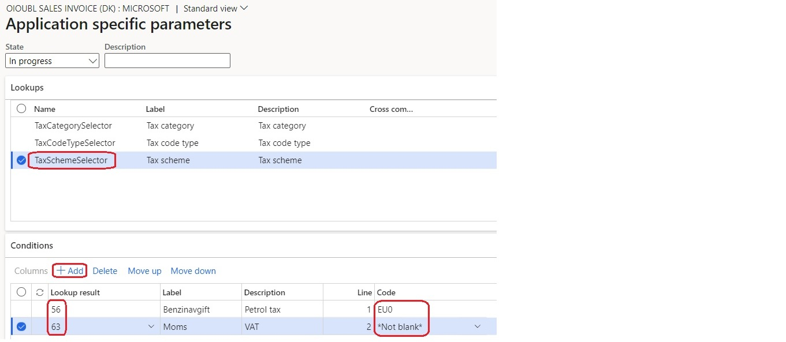

---
# required metadata

title: Customer electronic invoices in Denmark
description: This topic explains how to set up and process electronic invoices for in Denmark.
author: ilkond
ms.date: 12/14/2021
ms.topic: article
ms.prod: 
ms.technology: 

# optional metadata

ms.search.form: 
audience: Application User
# ms.devlang: 
ms.reviewer: kfend
# ms.tgt_pltfrm: 
# ms.custom: 
ms.search.region: Norway
# ms.search.industry: 
ms.author: ilyako
ms.search.validFrom: 2021-01-01
ms.dyn365.ops.version: 10.0.21

---

# Customer electronic invoices in Denmark

[!include [banner](../includes/banner.md)]

This topic provides information about how to configure and issue customer electronic invoices in Denmark using the specific [OIOUBL](http://www.oioubl.info/Classes/da/Invoice.html)** format of electronic invoices.

## Prerequisites

The primary address of the legal entity must be in Denmark.

## Import Electronic reporting configurations

In the **Electronic reporting** workspace, import the following Electronic reporting (ER) formats from the repository:

- OIOUBL Sales invoice (DK)
- OIOUBL Project invoice (DK)
- OIOUBL Sales credit note (DK)
- OIOUBL Project credit note (DK)

> [!NOTE]
> Any other required configurations are imported automatically.

For more information about how to import ER configurations, see [Download Electronic reporting configurations from Lifecycle Services](../../fin-ops-core/dev-itpro/analytics/download-electronic-reporting-configuration-lcs.md).

### Reference the imported ER format configurations

1. Go to **Accounts receivable** > **Setup** > **Accounts receivable parameters**.
2. On the **Electronic documents** tab, on the **Electronic reporting** FastTab, select the imported formats for electronic documents:

    - **Sales and Free text invoice**: OIOUBL Sales invoice (DK)
    - **Sales and Free text credit note**: OIOUBL Sales credit note (DK)
    - **Project invoice**: OIOUBL Project invoice (DK)
    - **Project credit note**: OIOUBL Project credit note (DK)

## Configure parameters

### Configure legal entity parameters

1. Go to **Organization administration** > **Organizations** > **Legal entities**.
2. On the **Tax registration** FastTab, in the **Tax registration number** field, enter the company's VAT number.
3. On the **Bank account information** FastTab, in the **Routing number** field, enter the company's registration number.
4. In the **FI-Creditor ID** field, enter the creditor's identification number if you plant to use **FIK** payments.

### Configure methods of payment

According to OIOUBL standards, the payment method codes in the XML file output of electronic invoices must be compliant with the official list of standardized codes: [OIOUBL Payment Means Codes](http://www.oioubl.info/codelists/en/urn_oioubl_codelist_paymentmeanscode-1.1.html).
The system supports the following predefined codes of payment methods and provides automatic conversion to the official codes.

| Internal payment method code | Official payment method code|
|------------------------------|-----------------------------|
| DK:BANK                      | 42                          |
| DK:FIK                       | 93                          |
| DK:GIRO                      | 50                          |
| All other codes              | 97                          |

Complete the following steps to configure methods of payment.

1. Go to **Accounts receivable** > **Setup** > **Payments setup** > **Methods of payment**.
2. Create a new method or select an existing method of payment to configure.
3. On the **General** FastTab, in the **Posting** section, in the **Account type** field, select **Bank**.
4. In the **Payment account** field, enter the company's bank account assosiated with this method of payment.

    > [!NOTE]
    > The company bank account must already be set up under **Cash and bank management** > **Bank accounts** > **Bank accounts**.

### Units of measure configuration

1. Go to **Organization administration** > **Setup** > **Units** > **Units**.
2. Select a unit ID in the list, and then select **External codes**.
3. On the **External codes** page, in the **Overview** section, in the **Code** field, enter a code that corresponds to the selected unit ID.
4. In **Value** section, in **Value** field, enter the external code that should be used as the recommended unit of measure code according to [Codes for Units of Measure Used in International Trade](https://docs.oasis-open.org/ubl/prd1-UBL-2.1/cva/UBL-DefaultDTQ-2.1.html#d27e1).

### Sales tax codes configuration

When you generate electronic invoices in OIOUBL format, the tax information must be hierarchically structured in a specific way in the output XML file.

The top level of hierarchy is **Tax Scheme**. For the official list of tax schemes applicable for OIOUBL format, see [OIOUBL Tax Schemes](http://oioubl.info/documents/da/da/Kodelister/OIOUBL_CODE_TaxSchemeID-1.5.pdf). 

The next level of tax data grouping within the tax scheme is **Tax Category**. For the official list of tax categories applicable for OIOUBL format, see [OIOUBL Tax Categories](http://oioubl.info/documents/da/da/Kodelister/OIOUBL_CODE_TAXCATEGORYID.pdf). 

For some taxes, the additional attribute, **Tax Type Code** must be also defined.

Tax schemes, tax categories, and tax type codes can be assosiated with sales tax codes using **Application specific parameters**. See the next section about how to configure application-specific parameters.

### Configure application-specific parameters 

1. In the **Electronic reporting** workspace, on the **Reporting configurations** tile, in the list of configurations, select a required configuration. For example, **OIOUBL Sales invoice (DK)**.
2. On the **Configurations** menu, in the **Application specific parameters** section, use **Setup** for the selected configuration.
3. On the **Application specific parameters** page, in the **Lookups** grid, select **TaxSchemeSelector**.
4. In the **Condtitons** grid, configure the correspondence between internal sales tax codes and official tax schemes codes. 
5. Select **Add** to add a new condition and in the **Code** column for the new condition, select the sales tax code that is defined in the system. 

    > [!NOTE]
    > In the **Code** column, you can select the **"Blank"** or **"Not blank"** placeholder value instead of a specific sales tax code.
    
    

6. In the **Lookup result** column, select a corresponding official tax schemes code.
7. In the **Lookups** grid, select **TaxCategorySelector**.
8. In the **Condtitons** grid, configure the correspondence between internal sales tax codes and official tax categories codes.
9. In the **Lookups** grid, select **TaxCodeTypeSelector**.
10. In the **Condtitons** grid, configure the correspondence between internal sales tax codes and tax type codes. If no tax type code is required, use the value, **Not applicable**.
11. In the **State** field, select **Completed** and then save your changes.

Application-specific parameters must be configured for the following configurations:

- OIOUBL Sales invoice (DK)
- OIOUBL Project invoice (DK)
- OIOUBL Sales credit note (DK)
- OIOUBL Project credit note (DK)

### Configure customer parameters

1. Go to **Accounts receivable** > **Customers** > **All customers**, and select a customer.
2. On the **Invoice and delivery** FastTab, set the **eInvoice** option to **Yes** to enable electronic invoice generation.
3. Set the **eInvoice attachment** option to **Yes** to attach a PDF copy of the printable invoice to the electronic invoice.
4. In the **Tax exempt number** field, enter the customer's VAT exempt number.
5. In the **EAN** field, enter the customer's identification number which will be used as the **Endpoint ID** in the output XML file of the electronic invoice.
6. On the **Sales demographics** FastTab, in the **Primary contact** field, select a person who will be considered as buyer's contact.
   
   > [!NOTE]
   > All available contact persons must already be defined for this customer.

## Export customer electronic invoices

### Send e-invoices

When an invoice is posted, you can generate an electronic invoice by selecting **Send** > **Original** for the selected invoice.

### View e-invoices

To inquire about the XML files of electronic invoices that have been generated, follow these steps.

1. Go to **Organization administration** > **Electronic reporting** > **Electronic reporting jobs**.
2. Select a job, and then select **Show files**.

    

3. Select **Open** to download the file that contains the electronic invoice.

    If generating the electronic invoices fails because of errors, select **Show log** > **Message details** to view more details about the error message.

    

### Send e-invoices to ER destinations

You can set up ER destinations for electronic invoice formats. In this case, output XML files that contain electronic invoices are automatically sent to the defined destinations immediately after the invoices are posted. When you post the invoices, you must turn on the **Print invoice** parameter.

For more information about ER destinations, see [Electronic reporting destinations](../../fin-ops-core/dev-itpro/analytics/electronic-reporting-destinations.md).

[!INCLUDE[footer-include](../../includes/footer-banner.md)]
