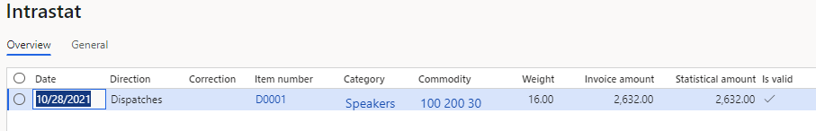
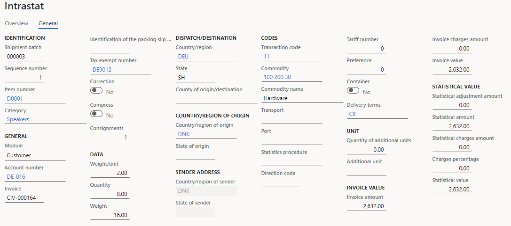
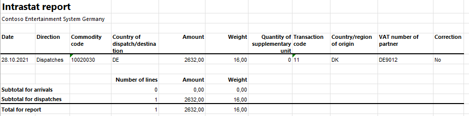
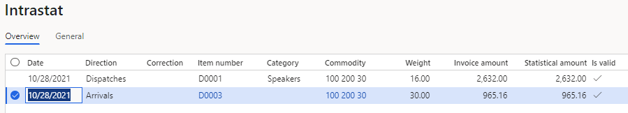
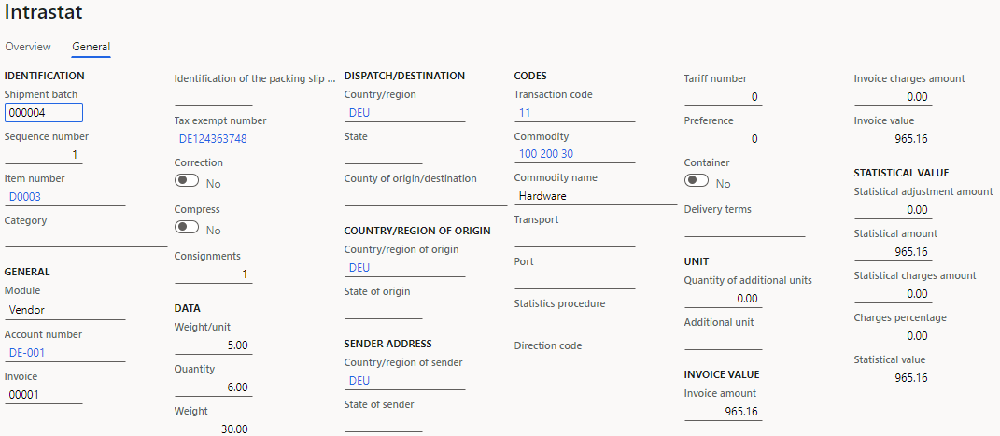
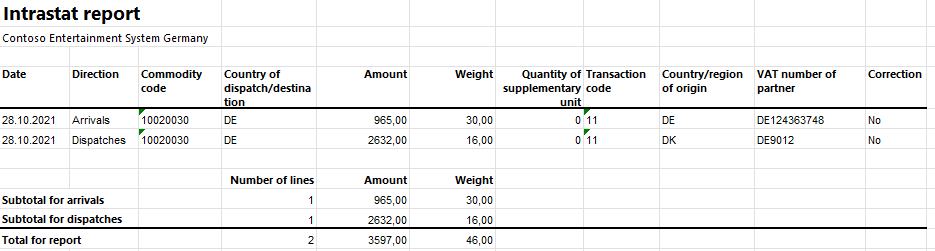

# Danish Intrastat

[!include [banner](../includes/banner.md)]

You can use the **Intrastat** page to generate and report information about trade among European Union (EU) countries/region. The Danish Intrastat declaration contains information about the trade of goods for reporting.

The following fields are included in the Danish Intrastat declaration.

| Intrastat report field      | Description                                                                                             | Arrivals       | Dispatches |
|-----------------------------|---------------------------------------------------------------------------------------------------------|----------------|------------|
| Item code                   | The commodity code, which is an eight-digit Intrastat nomenclature code.                                | X              | X          |
| Partner country             | The International Organization for Standardization (ISO) code for the country or region of the partner. | X              | X          |
| Transaction type            | The code that indicates the nature of the transaction.                                                  | X              | X          |
| Supplementary units         | The additional quantity, if the item code requires it.                                                  | X              | X          |
| Net weight                  | The net mass in kilograms. The unit itself ("kg") isn't printed.                                        | X              | X          |
| Invoice value               | The invoice value in Danish kroner (DKK).                                                               | X              | X          |
| Reference № 2               | The internal reference number for the records.                                                          | X              | X          |
| Item recipient's VAT number | The customer's foreign value-added tax (VAT) number in an EU member state.                              | Not applicable | X          |
| Origin                      | The ISO code of the country or region where the commodities were produced or manufactured.              | Not applicable | X          |

## Set up Intrastat

### Import Electronic reporting configurations

To set up Intrastat, import the latest version of the following Electronic reporting (ER) configurations:

- Intrastat model
- Intrastat report
- Intrastat (DK)

For more information, see [Download ER configurations from the Global repository of Configuration service](../../fin-ops-core/dev-itpro/analytics/er-download-configurations-global-repo.md).

### Set up foreign trade parameters

1. In Microsoft Dynamics 365 Finance, go to **Tax** > **Setup** > **Foreign trade** > **Foreign trade parameters**.
2. On the **Intrastat** tab, on the **Electronic reporting** FastTab, in the **File format mapping** field, select **Intrastat (DK)**.
3. In the **Report format mapping** field, select **Intrastat report**.
4. On the **Commodity code hierarchy** FastTab, in the **Category hierarchy** field, select **Intrastat**.
5. In the **Transaction code** field, select the transaction code for property transfers. You use this code for transactions that produce actual or planned transfers of property against compensation (financial or otherwise).
6. In the **Credit note** field, select the transaction code for the return of goods.
7. On the **Country/region properties** tab, in the **Country/region** field, list all the countries or regions that your company does business with. For each country that is part of the EU, select **EU** in the **Country/region type** field, so that the country appears on your Intrastat report.

### Set up the product parameters for the Intrastat declaration

1. Go to **Product information management** > **Products** > **Released products**.
2. In the grid, select a product.
3. On the **Foreign trade** FastTab, in the **Intrastat** section, in the **Commodity** field, select a commodity code.
4. In the **Origin** section, in the **Country/region** field, select the product's country or region of origin.
5. On the **Manage inventory** FastTab, in the **Net weight** field, enter the product's weight in kilograms.

### Set up compression of Intrastat

- Go to **Tax** > **Setup** > **Foreign trade** > **Compression of Intrastat**, and select the fields that should be compared when Intrastat information is summarized. For Danish Intrastat, select the following fields:

    - Commodity
    - Transaction code
    - Country/region of origin
    - Direction
    - Tax exempt number
    - Country/region
    - Country/region of sender
    - Correction
    - Invoice

### Set up the VAT number of the trading partner

1. Go to **Accounts receivable** > **Customers** > **All customers**.
2. In the grid, select a customer.
3. On the Action Pane, on the **Customer** tab, in the **Registration** group, select **Registration IDs**.
4. On the **Registration ID** FastTab, select **Add** to create a registration ID.
5. In the **Registration type** field, select **VATID**.
6. In the **Registration number** field, enter the company's VAT number.
7. On the Action Pane, select **Save**. Then close the page.
8. On the customer page, on the **Invoice and delivery** FastTab, in the **Sales tax** section, in the **Tax exempt number** field, select the registration ID that you created earlier.

For more information about registration IDs, see [Registration IDs](emea-registration-ids.md).

## Intrastat transfer

On the **Intrastat** page, on the Action Pane, you can select **Transfer** to automatically transfer the information about intracommunity trade from your sales orders, free text invoices, purchase orders, vendor invoices, vendor product receipts, project invoices, and transfer orders. Only documents that have an EU country as the country or region of destination (for dispatches) or consignment (for arrivals) will be transferred.

Alternatively, you can manually enter transactions by selecting **New** on the Action Pane.

### Generate an Intrastat report

1. Go to **Tax** > **Declarations** > **Foreign trade** > **Intrastat**.
2. On the Action Pane, select **Output** &gt; **Report**.
3. In the **Intrastat Report** dialog box, enter the start and end dates for the report.
4. Set the **Generate file** option to **Yes** to generate a .txt file, and then enter the name of the .txt file for the Intrastat report.
5. Set the **Generate report** option to **Yes** to generate an .xlsx file, and then enter a name for the file.
6. Set the **Only corrections** option to **Yes** to generate an Intrastat report that includes only correction transactions that indicate the return of goods.
7. Select **OK**, and review the generated reports.

## Example

The following example shows how to set up Danish Intrastat and create the Intrastat report. It uses the **DEMF** legal entity.

1. Import the latest version of the following ER configurations:

    - Intrastat model
    - Intrastat report
    - Intrastat (DK)

2. Go to **Organization administration** > **Organization** > **Legal entities**, and select the **DEMF** legal entity.
3. On the **Addresses** FastTab, select **Edit**.
4. In the **Country/region** field, select **DNK** (Denmark).

### Set up foreign trade parameters

1. Go to **Tax** > **Setup** > **Foreign trade** > **Foreign trade parameters**.
2. On the **Intrastat** tab, on the **General** FastTab, in the **Transaction** **code** field, select **11**.
3. On the **Electronic reporting** FastTab, in the **File format mapping** field, select **Intrastat (DK)**.
4. In the **Report format mapping** field, select **Intrastat Report**.
5. On the **Commodity code hierarchy** FastTab, verify that the **Category hierarchy** field is set to **Intrastat**.
6. On the **Country/region properties** tab, select **New**.
7. In the **Party country/region** field, select **DNK**. Then, in the **Country/region type** field, select **Domestic**.
8. In the **Party country/region** field, select **DEU** (Germany). Then, in the **Country/region type** field, select **EU**.

### Set up product information

1. Go to **Product information management** > **Products** > **Released** **products**.
2. In the grid, select **D0001**.
3. On the **Foreign trade** FastTab, in the **Intrastat** section, in the **Commodity** field, select **100 200 30**.
4. In the **Origin** section, in the **Country/region** field, select **DNK**.
5. On the **Manage inventory** FastTab, in the **Weight measurements** section, in the **Net weight** field, enter **2**.
6. On the Action Pane, select **Save**.
7. In the grid, select **D0003**.
8. On the **Foreign trade** FastTab, in the **Intrastat** section, in the **Commodity** field, select **100 200 30**.
9. In the **Origin** section, in the **Country/region** field, select **DEU**.
10. On the **Manage inventory** FastTab, in the **Weight measurements** section, in the **Net weight** field, enter **5**.
11. On the Action Pane, select **Save**.

### Change the site address

1. Go to **Warehouse management** > **Setup** > **Warehouse** > **Sites**.
2. In the grid, select **1**.
3. On the **Addresses** FastTab, select **Edit**.
4. In the **Edit address** dialog box, in the **Country/region** field, select **DNK**.
5. Select **OK** to close the **Edit address** dialog box.

### Verify the EU customer's tax-exempt number code

1. Go to **Accounts receivable** > **Customers** > **All customers**.
2. In the grid, select **DE-016**.
3. On the **Invoice and delivery** FastTab, in the **Sales tax** section, verify that the **Tax exempt number** field is set to **DE9012**.

### Create a sales order with an EU customer

1. Go to **Accounts receivable** > **Orders** > **All sales orders**.
2. On the Action Pane, select **New**.
3. In the **Create sales order** dialog box, on the **Customer** FastTab, in the **Customer** section, in the **Customer account** field, select **DE-016**.
4. On the **General** FastTab, in the **Storage dimensions** section, in the **Site** field, select **1**.
5. In the **Warehouse** field, select **11**.
6. On the **Address** tab, verify that the **Address** field is set to **Teichgasse 12, Kiel, 24103, DEU**, because the vendor is from Germany.
7. Select **OK**.
8. On the **Lines** tab, on the **Sales order lines** FastTab, in the **Item number** field, select **D0001**. Then, in the **Quantity** field, enter **8**.
9. On the **Line details** FastTab, on the **Foreign trade** tab, verify that the **Transaction code** field is set to **11**, the **Commodity** field is set to **100 200 30**, and the **Country/region of origin** field is set to **DNK**.
10. On the Action Pane, select **Save**.
11. On the Action Pane, on the **Invoice** tab, in the **Generate** group, select **Invoice**.
12. In the **Posting invoice** dialog box, on the **Parameters** FastTab, in the **Parameter** section, in the **Quantity** field, select **All**.
13. Select **OK** to post the invoice.

### Transfer the transaction to the Intrastat journal and review the result

1. Go to **Tax** > **Declarations** > **Foreign trade** > **Intrastat**.
2. On the Action Pane, select **Transfer**.
3. In the **Intrastat (Transfer)** dialog box, in the **Parameters** section, set the **Customer invoice** option to **Yes**.
4. Select **Filter**.
5. In the **Intrastat Filter** dialog box, on the **Range** tab, select the **Customer invoice journal** line, and verify that the **Field** field is set to **Date**.
6. In the **Criteria** field, select the current date.
7. Select **OK** to close the **Intrastat Filter** dialog box.
8. Select **OK** to close the **Intrastat (Transfer)** dialog box, and review the result. The line represents the sales order that you created earlier.

    

9. Select the transaction line, and then select the **General** tab to view more details.

    

10. On the Action Pane, select **Output** &gt; **Report**.
11. In the **Intrastat Report** dialog box, on the **Parameters** FastTab, in the **Date** section, select the month of the sales order that you created.
12. In the **Export** **options** section, set the **Generate file** option to **Yes**. Then, in the **File name** field, enter the required name.
13. Set the **Generate report** option to **Yes**. Then, in the **Report file name** field, enter the required name.
14. Select **OK**, and review the report in text format that is generated. The following table shows the values in the example report.

    | Item code  | Partner country | Transaction type | Supplementary units | Net weight | Invoice value | Reference number | Item recipient's VAT number | Origin |
    |------------|-----------------|------------------|---------------------|------------|---------------|------------------|-----------------------------|--------|
    | 100 200 30 | DE              | 11               | 0                   | 16         | 2632          | 0000031          | DE9012                      | DNK    |

15. Review the generated report file.

    

### Create a purchase order

1. Go to **Accounts payable** > **Purchase orders** > **All purchase orders**.
2. On the Action Pane, select **New**.
3. In the **Create purchase order** dialog box, in the **Vendor account** field, select **DE-001**.
4. In the **Site** field, select **1**.
5. In the **Warehouse** field, select **11**.
6. Select **OK**.
7. On the **Lines** tab, on the **Purchase order lines** FastTab, in the **Item number** field, select **D0003**. Then, in the **Quantity** field, enter **6**.
8. On the **Line details** FastTab, on the **Foreign trade** tab, verify that the **Transaction code** is set to **11**, the **Commodity** field is set to **100 200 30**, and the **Country/region of origin** field is set to **DEU**.
9. On the Action Pane, on the **Purchase** tab, in the **Actions** group, select **Confirm**.
10. On the Action Pane, on the **Invoice** tab, in the **Generate** group, select **Invoice**.
11. On the Action Pane, select **Default from**. In the **Default quantity for lines** field, select **Ordered quantity**. Then select **OK**.
12. On the **Vendor Invoice header** FastTab, in the **Invoice identification** section, in the **Number** field, enter **00001**.
13. In the **Invoice dates** section, in the **Invoice date** field, select the current date.
14. On the Action Pane, select **Post** to post the invoice.

### Create an Intrastat declaration for arrivals

1. Go to **Tax** > **Declarations** > **Foreign trade** > **Intrastat**.
2. On the Action Pane, select **Transfer**.
3. In the **Intrastat (Transfer)** dialog box, set the **Vendor invoice** option to **Yes**.
4. Select **Filter**.
5. In the **Intrastat Filter** dialog box, on the **Range** tab, select the **Vendor invoice journal** line, and verify that the **Field** field is set to **Date**.
6. In the **Criteria** field, select the current date.
7. Select **OK** to close the **Intrastat Filter** dialog box.
8. Select **OK** to transfer the transactions, and review the Intrastat journal.

    

9. Review the **General** tab for the purchase order.

    

10. On the Action Pane, select **Output** &gt; **Report**.
11. In the **Intrastat Report** dialog box, on the **Parameters** FastTab, in the **Date** section, select the month of the purchase order that you created.
12. In the **Export** **options** section, set the **Generate file** option to **Yes**. Then, in the **File name** field, enter the required name.
13. Set the **Generate report** option to **Yes**. Then, in the **Report file name** field, enter the required name.
14. Select **OK**, and review the report in text format that is generated. The following table shows the values for arrivals in the example report.

    | Item code  | Partner country | Transaction type | Supplementary units | Net weight | Invoice value | Reference number |
    |------------|-----------------|------------------|---------------------|------------|---------------|------------------|
    | 100 200 30 | DE              | 11               | 0                   | 30         | 965           | 0000041          |

15. Review the generated Excel report.

    
    
[!INCLUDE[footer-include](../../includes/footer-banner.md)]
