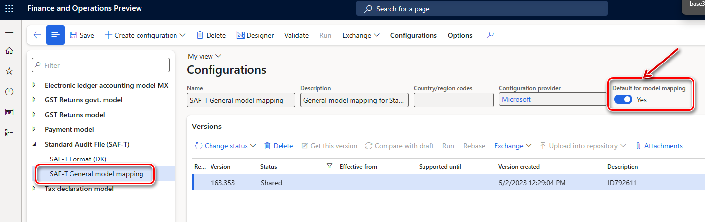

# Standard Audit File for Tax (SAF-T) for Denmark

[!include [banner](../includes/banner.md)]

[!include [banner](../includes/preview-banner.md)]

This article describes how to prepare Finance to work with the SAF-T report and generate the file in XML format according to requirements to SAF-T in Denmark.

> [!NOTE]
> Use of the [One voucher](../general-ledger/one-voucher.md) functionality introduces a limitation on further SAF-T reporting for some scenarios that are subject to SAF-T. Specifically, a bank statement scenario must be posted by using different vouchers for transactions that have different counteragent accounts. For more information about how to use the One voucher functionality and SAF-T, see the [SAF-T report and One voucher](#one-voucher) section later in this article.

## Setup

To start to work with the **SAF-T** report for Denmark, complete the following steps:

1. [Turn on features in Feature management.](#features)
2. [Import Electronic reporting configurations.](#import)
3. [Set up application-specific parameters for the **SAF-T Format (DK)** configuration.](#application)
4. [Select the SAT-T format in General ledger parameters.](#satt)
5. [Create a contact person for your company.](#contact)
6. [Configure Registration number of the legal entity.](#registration-id)
7. [Configure Standard chart of accounts.](#coa)

### Turn on features in Feature management

1. Go to **Feature management**, and select the **All** tab.
2. In the feature list, find and select the following features:

    - [Standard Audit File for Tax (SAF-T) electronic report](https://learn.microsoft.com/en-us/dynamics365/finance/general-ledger/standard-audit-file.md)
    - Optimize datasets memory consumption at ER reports runtime

3. Select **Enable now**.

### Import Electronic reporting configurations

In Finance, import the following versions or later of these Electronic reporting (ER) configurations from the Global repository.

For more information about how to download ER configurations, see [Download ER configurations from the Global repository](../../fin-ops-core/dev-itpro/analytics/er-download-configurations-global-repo.md).

| ER configuration name       | Type          | Version | Description |
|-----------------------------|---------------|---------|-------------|
| Standard Audit File (SAF-T) | Model         | 164     | The common data model for different audit reports. |
| SAF-T General model mapping | Model mapping | 164.354 | The model mapping that provides general data source mapping. |
| SAF-T Format (DK)           | Format        | 164.21 | The XML format that represents the SAF-T report in accordance with the requirements for Denmark. |

Import the most recent versions of the configurations. The version description usually includes the number of the Microsoft Knowledge Base (KB) article that explains the changes that were introduced in the configuration version.

> [!IMPORTANT]
> After all the ER configurations from the previous table are imported, set the **Default for model mapping** option to **Yes** for the **SAF-T General model mapping** configuration.
>
> 

The **SAF-T General model mapping** configuration provides general data source mapping for the following master data:

- **GeneralLedgerAccounts** – General ledger.
- **Customers** – Purchasers and other debtors.
- **Suppliers** – Suppliers and other creditors.
- **TaxTable** – Tax type tables that are used in the legal entity's accounting system. Examples include value-added tax (VAT), corporate income tax, and excise taxes.
- **UOMTable** – Table for units of measurement.
- **AnalysisTypeTable** – Data tables for analytical accounting. This data is used to provide details of transaction data. Examples include unit costs, additional costs, a cost center, or a project.
- **MovementTypeTable** – Stock movement types.
- **Products** – Products and services.
- **PhysicalStock** – Data about the stock that is contained in the file.

The **SAF-T General model mapping** configuration also provides general data source mapping for the following transactional data:

- **GeneralLedgerEntries** – General ledger entries.
- **Sales invoices** – Initial sales documents.
- **PurchaseInvoices** – Accounting documents for purchases and acquisitions.
- **Payments** – Payments.
- **MovementOfGoods** – Information about the movement of goods. For example, movement occurs when goods are recorded, when goods are written off after they are sold or used in production, and when finished products, determined loss, and defective goods are recorded.
- **AssetTransactions** – Economic transactions or events for tangible or intangible economic assets, and for financial assets.

### Set up application-specific parameters for the SAF-T Format (DK) configuration

> [!NOTE]
> We recommend that you enable the feature, **Use application specific parameters from previous versions of ER formats** in the **Feature management** workspace. When this feature is enabled, parameters that are configured for the earlier version of an ER format automatically become applicable for the later version of the same format. If this feature is not enabled, you must configure application-specific parameters explicitly for each format version. The **Use application specific parameters from previous versions of ER formats** feature is available in the **Feature management** workspace starting in Finance version 10.0.23. For more information about how to set up the parameters of an ER format for each legal entity, see [Set up the parameters of an ER format per legal entity](../../fin-ops-core/dev-itpro/analytics/er-app-specific-parameters-set-up.md).

> [!NOTE]
> We recommend that you enable the **Accelerate the ER labels storage** feature in the **Feature management** workspace. This feature helps improve network bandwidth utilization and overall system performance because, in most cases, ER labels of a single language are used when you work with a single ER configuration. The **Accelerate the ER labels storage** feature is available in the **Feature management** workspace as of Finance version 10.0.25. For more information about how to set up the parameters of an ER format for each legal entity, see [Performance](../../fin-ops-core/dev-itpro/analytics/er-design-multilingual-reports.md#performance).

1. In Electronic reporting, open the **Configurations** page. 
2. In the configuration tree, under **Standard Audit File (SAF-T)**, select **SAF-T Format (DK)**.
3. Make sure that you're working in the company that you want to set up the application-specific parameters for.
4. Select **Configurations** \> **Application-specific parameters**, and then, on the Action Pane, select **Setup**.
5. In the list on the left, select the last version of the configuration.
6. Provide the mapping for **ReportTaxCodes_LOOKUP** lookup field. Define the mapping between the sales tax codes that are used by the company and the standard tax codes of Denmark. 
Select the value **Other** as the last condition in the list. 
The **Tax Code** column must be set to **\*Not blank\***. 
In the **Line** column, verify that **Other** is the last condition in the table. 
At least one line that has **\*Not blank\*** values must be set up.
7. When you've finished setting up the lookup fields, in the **State** field select **Completed**, and then save the configuration.

### Select the SAT-T format in General ledger parameters

1. Go to **General ledger** \> **Setup** \> **General ledger parameters**.
2. On the **Standard Audit File for Tax** FastTab, in the **Standard Audit File for Tax (SAF-T)** field, select **SAF-T Format (DK)**.

### Create a contact person for your company

The **Company** node of the SAF-T report must include information for a contact. This node is located under the **Header** node. To set up contact information that will be reported to SAF-T, follow these steps.

1. Go to **Sales and marketing** \> **Relationships** \> **Contacts** \> **All contacts**.
2. Select **New** to create a new contact for your legal entity. Be sure to select **Legal entity** in the **Contact for** field. 
3. Check by **Party ID** value to make sure that you select the legal entity that SAF-T will be reported from.

###  Configure Registration number of the legal entity

To generate a SAF-T, you must configure the Registration number.

1. Go to **Organization administration** > **Organizations** > **Legal entities**.
2. Select the legal entity, and then select **Registration IDs**.
3. Select or create the address in Denmark, and then, on the **Registration ID** FastTab, select **Add**.
4. In the **Registration type** field, select the registration type that is dedicated to Denmark, and that uses the **VAT Id** registration category.
5. In the **Registration number** field, enter the tax number.
6. On the **General** tab, in the **Effective** field, enter the date when the number becomes effective.

For more information about how to set up registration categories and registration types, see [Registration IDs](emea-registration-ids.md).

###  Configure Standard chart of accounts (Standardkontoplan)

In Danish SAF-T report, main accounts that are used in Finance must be associated with Danish standard accounts. To associate **Main accounts** that are used in Finance with Danish standard accounts use the [Consolidation account groups and additional consolidation accounts](https://learn.microsoft.com/en-us/dynamics365/finance/budgeting/consolidation-account-groups-consolidation-accounts.md) functionality:

1. Create a [Consolidation account group](https://learn.microsoft.com/en-us/dynamics365/finance/general-ledger/tasks/create-consolidation-groups#create-a-consolidation-account-group). For example, \"Standardkontoplan\".
2. [Add accounts to consolidation account group](https://learn.microsoft.com/en-us/dynamics365/finance/general-ledger/tasks/create-consolidation-groups#add-accounts-to-consolidation-account-group). Specify Standard account in **Consolidation account** field (this value is to be reported in `<StandardAccountID>` field of SAF-T under `Master data > GeneralLedgerAccounts > Account` node). Optionaly specify Standard account name or description in **Consolidation account name** field (this value is not used in SAF-T).

## Generate the SAF-T report

To generate the SAF-T report, go to **General ledger** \> **Inquiries and reports** \> **Standard Audit File for Tax (SAF-T)** \> **Standard Audit File for Tax (SAF-T)**.

The following table describes the fields in the report dialog box.

| Field name | Description |
|------------|-------------|
| **From date** and **To date** | Specify the start and end dates of the period that the report should include data for. The start date is reflected in the **Header** \> **SelectionCriteria** \> **PeriodStart** node of the SAF-T. The end date is reflected in the **Header** \> **SelectionCriteria** \> **PeriodEnd** node. The period for one file or one part of a file can't be shorter than one month and longer than a reporting period. |
| **Print zero balance** | This check box affects the data that is reported in the **MasterFiles** \> **GeneralLedgerAccounts** node of the SAF-T. Select this check box to include all the main accounts of your company, even main accounts that have a zero balance during the specified period. Clear the check box to include only main accounts that have a non-zero balance or transactions during the specified period. |
| **Export all Customers** | This check box affects the data that is reported in the **MasterFiles** \> **Customers** node of the SAF-T. Select this check box to include all the customers of your company, even customers that have a zero balance during the specified period. Clear the check box to include only customers that have a non-zero balance or transactions during the specified period. |
| **Export all Suppliers** | This check box affects the data that is reported in the **MasterFiles** \> **Suppliers** node of the SAF-T. Select this check box to include all the suppliers of your company, even suppliers that have a zero balance during the specified period. Clear the check box to include only suppliers that have a non-zero balance or transactions during the specified period. |
| **Export all Analysis types** | This check box affects the data that is reported in the **MasterFiles** \> **AnalysisTypeTable** node of the SAF-T. Select this check box to include all the dimensions of your company. Clear the check box to include only dimensions that are used in transactions that are reported during the specified period. |
| **Export all Products** | This check box affects the data that is reported in the **MasterFiles** \> **Products** node of the SAF-T. Select this check box to include all the products of your company, even products that have zero physical stock during the specified period. Clear the check box to include only products that have non-zero physical stock or transactions during the specified period. |
| **Export all Sales tax codes** | This check box affects the data that is reported in the  **MasterFiles** \> **TaxTable** node of the SAF-T. Select this check box to include all the sales tax codes of your company. Clear the check box to include only sales tax codes that are used in transactions that are reported during the specified period. |
| **Consolidation account group** | Select the **Consolidation account group** set up to [Configure Standard chart of accounts (Standardkontoplan)](#coa). |
| **Header Comment** | Specify your comment to SAF-T. It can contain any further generic comments on the audit file. Maximum length is 256 characters.  |
| **Tax Accounting Basis** | Select one of the following values from the list: <li>Invoice Accounting <li>Cash Accounting <li>Delivery <li>Other |
| **Tax Entity** | Select one of the following values from the list: <li>Company <li>Division <li>Branch reference |

