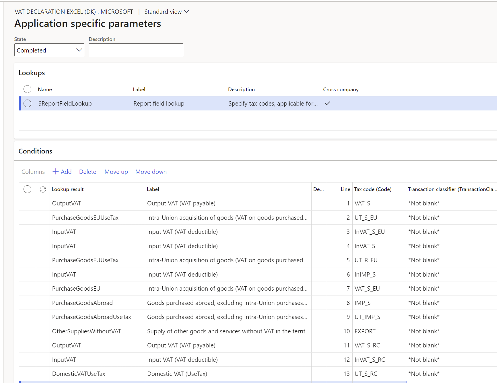

# Preview a VAT declaration in Excel format

[!include [banner](../includes/banner.md)]

This article describes how to set up a value-added tax (VAT) declaration for Denmark and preview it in Microsoft Excel.

## Prerequisites

To automatically generate a VAT declaration in Excel or XML format, first create enough sales tax codes to keep a separate VAT accounting for each box of the VAT declaration. Additionally, in the application-specific parameters of the Electronic reporting (ER) format for the VAT declaration, associate sales tax codes with the lookup results for the boxes on the VAT declaration. For more information about the structure of the VAT declaration of Denmark and lookup results for boxes of the VAT declaration, see [VAT declaration of Denmark overview](emea-dnk-vat-declaration-denmark.md).

## Configure system parameters

To generate a VAT declaration, you must configure the VAT number.

1. Go to **Organization administration** \> **Organizations** \> **Legal entities**.
2. Select the legal entity, and then select **Registration IDs**.
3. Select or create the address in Denmark, and then, on the **Registration ID** FastTab, select **Add**.
4. In the **Registration type** field, select the registration type that's dedicated to Denmark, and that uses the **VAT ID** registration category.
5. In the **Registration number** field, enter the tax number.
6. On the **General** tab, in the **Effective** field, enter the date when the number becomes effective.

For more information about how to set up registration categories and registration types, see [Registration IDs](emea-registration-ids.md).

## Import ER configurations

Open the **Electronic reporting** workspace, and import the following ER configurations.

| Number | ER configuration name | Type | Description |
|--------|-----------------------|------|-------------|
| 1      | Tax declaration model | Model | A generic model for different tax declarations. |
| 2      | Tax declaration model mapping | Model mapping | A generic model mapping for VAT declarations. |
| 3      | VAT Declaration Excel (DK) | Format (exporting) | A VAT return in Excel format for preview. |
| 4      | VAT Declaration XML (DK) | Format (exporting) | A VAT return in XML format for submission to the Danish Tax Agency (Skattestyrelsen). Import this format to submit VAT returns directly from Dynamics 365 Finance. |

For more information, see [Download ER configurations from the Global repository of Configuration service](../../fin-ops-core/dev-itpro/analytics/er-download-configurations-global-repo.md).

> [!NOTE]
> After all the ER configurations from the preceding table are imported, under the **Tax declaration model**, set the **Default for model mapping** option to **Yes** for the **Tax declaration model mapping** configuration.

## Set up application-specific parameters for VAT declaration fields

> [!NOTE]
> We recommend that you enable the **Use application specific parameters from previous versions of ER formats** feature in the **Feature management** workspace. When this feature is enabled, parameters that are configured for an earlier version of an ER format automatically become applicable for later versions of the same format. If this feature isn't enabled, you must explicitly configure application-specific parameters for each format version. The **Use application specific parameters from previous versions of ER formats** feature is available in the **Feature management** workspace as of Finance version 10.0.23. For more information about how to set up the parameters of an ER format for each legal entity, see [Set up the parameters of an ER format per legal entity](../../fin-ops-core/dev-itpro/analytics/er-app-specific-parameters-set-up.md).

To automatically generate a VAT declaration, associate sales tax codes in the application and lookup results in the ER configuration.

Follow these steps to define which sales tax codes generate specific boxes on the VAT declaration.

1. Go to **Workspaces** \> **Electronic reporting**, and select **Reporting configurations**.
2. Select the **VAT declaration Excel (DK)** configuration, and then select **Configurations** \> **Application specific parameters setup**.
3. On the **Application specific parameters** page, on the **Lookups** FastTab, select **Report field lookup**.
4. On the **Conditions** FastTab, set the following fields to associate the sales tax codes and report fields.

    | Field | Description |
    |-------|-------------|
    | Lookup result | Select the value of the report field. For more information about the values and their assignment to VAT declaration rows, see [VAT declaration](emea-dnk-vat-declaration-denmark.md#vat-declaration). |
    | Tax code | Select the sales tax code to associate with the report field. Posted tax transactions that use the selected sales tax code are collected in the appropriate declaration box. We recommend that you separate sales tax codes so that one sales tax code generates amounts in only one declaration box. |
    | Transaction classifier | 
If you created enough sales tax codes so that one sales tax code generates amounts in only one declaration box, select **\*Not blank\***. Otherwise, you can set up a transaction classifier. The following transaction classifiers are available:
<ul><li>**Purchase**</li><li>**PurchaseExempt** (tax-exempt purchase)</li><li>**PurchaseReverseCharge** (tax receivable from a purchase reverse charge)</li><li>**Sales**</li><li>**SalesExempt** (tax-exempt sale)</li><li>**SalesReverseCharge** (tax payable from a purchase reverse charge or a sales reverse charge)</li><li>**Use tax**</li></ul>
For each transaction classifier, a classifier for the credit note is also available. For example, one of these classifiers is **PurchaseCreditNote** (purchase credit note).

Be sure to create two lines for each sales tax code: one line that has the transaction classifier value and one line that has the transaction classifier for the credit note value.
 |

    > [!NOTE]
    > Associate all sales tax codes with lookup results. If any sales tax codes should not generate values on the VAT declaration, associate them with the **Other** lookup result.

5. In the **State** field, change the value to **Completed**.

If you plan to submit a VAT return directly to the Danish Tax Agency from Finance, export the completed setup of application-specific parameters for the **VAT declaration Excel (DK)** configuration as an XML file. Then import that file for the **VAT declaration XML (DK)** configuration. Change the value in the **State** field to **Completed** for the **VAT declaration XML (DK)** configuration.

## Set up the VAT statement format mapping for preview in Excel

1. In the **Feature management** workspace, find and select the **VAT statement format reports** feature in the list, and then select **Enable now**.
2. Go to **General ledger** \> **Setup** \> **General ledger parameters**.
3. On the **Sales tax** tab, on the **Tax options** FastTab, in the **VAT statement format mapping** field, select the **VAT declaration Excel (DK)** ER format.

    This format is printed when you run the **Report sales tax for settlement period** report. It's also printed when you select **Print** on the **Sales tax payments** page.

4. On the **Tax authorities** page, select the tax authority, and then, in the **Report layout** field, select **Default**.

If you're configuring the VAT declaration in a legal entity that has [multiple VAT registrations](emea-reporting-for-multiple-vat-registrations.md), follow these steps.

1. Go to **General ledger** \> **Setup** \> **General ledger parameters**.
2. On the **Sales tax** tab, on the **Electronic reporting for countries/regions** FastTab, on the line for **DNK**, select the **VAT Declaration Excel (DK)** ER format.

## Preview the VAT declaration in Excel

### Preview the VAT declaration in Excel from the Report sales tax for settlement period periodic task

1. Go to **Tax** \> **Periodic tasks** \> **Declarations** \> **Sales tax** \> **Report sales tax for settlement period**.
2. In the **Settlement period** field, select a value.
3. In the **Sales tax payment version** field, select one of the following values:

    - **Original** – Generate a report for the sales tax transactions of the original sales tax payment or before the sales tax payment is generated.
    - **Corrections** – Generate a report for the sales tax transactions of all the subsequent sales tax payments for the period.
    - **Total list** – Generate a report for all the sales tax transactions for the period, including the original and all corrections.

4. In the **From date** field, select the start date of the reporting period.
5. Select **OK**, and review the Excel report.

### Settle and post sales tax

1. Go to **Tax** \> **Periodic tasks** \> **Declarations** \> **Sales tax** \> **Settle and post sales tax**.
2. In the **Settlement period** field, select a value.
3. In the **Sales tax payment version** field, select one of the following values:

    - **Original** – Generate the original sales tax payment for the settlement period.
    - **Latest corrections** – Generate a correction sales tax payment after the original sales tax payment for the settlement period was created.

4. In the **From date** field, select the start date of the reporting period.
5. Select **OK**.

### Preview the VAT declaration in Excel from a sales tax payment

1. Go to **Tax** \> **Inquiries and reports** \> **Sales tax inquiries** \> **Sales tax payments**, and select a sales tax payment line.
2. Select **Print report**, and then select **OK**.
3. Review the Excel file that's generated for the selected sales tax payment line.

> [!NOTE]
> The report is generated only for the selected line of the sales tax payment. If you must generate, for example, a corrective declaration that contains all corrections for the period, or a replacement declaration that contains original data and all corrections, use the **Report sales tax for settlement period** periodic task.

[!INCLUDE[footer-include](../../includes/footer-banner.md)]
