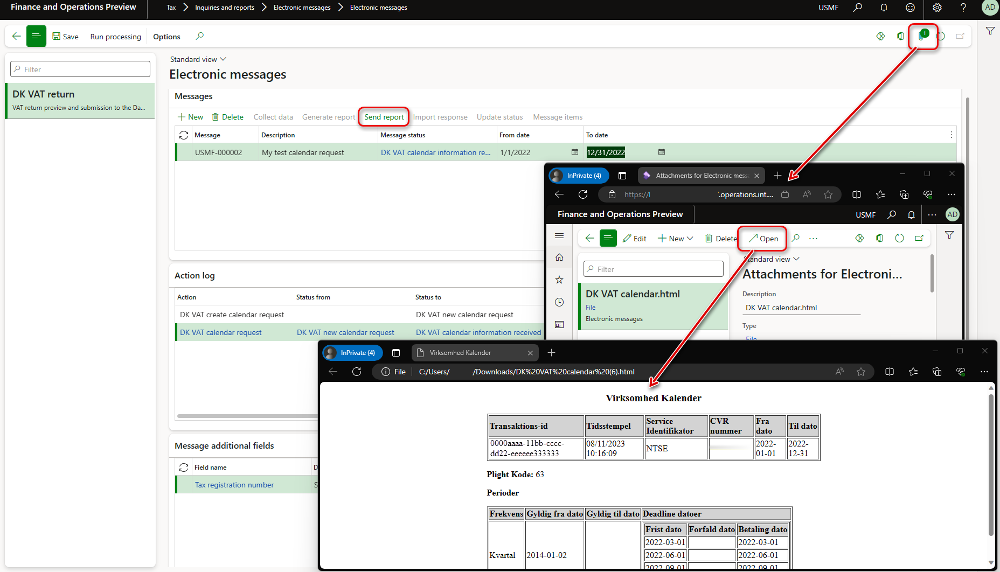
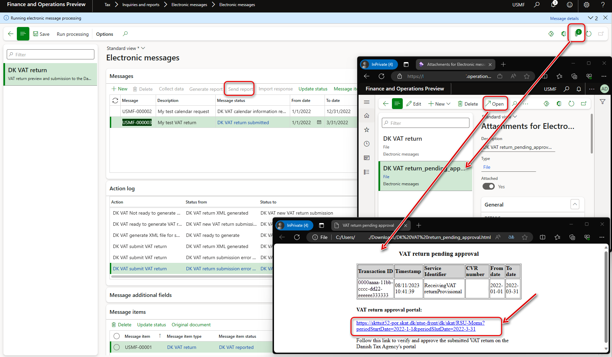

# Submit a VAT return in XML format to the Danish Tax Agency

[!include [banner](../includes/banner.md)]

This article describes how to prepare your Microsoft Dynamics 365 Finance environment to generate a value-added tax (VAT) return in XML format and submit it to the Danish Tax Agency (Skattestyrelsen).

## Prerequisites

To automatically generate a VAT declaration in Excel or XML format, first create enough sales tax codes to keep a separate VAT accounting for each box of the VAT declaration. Additionally, in the application-specific parameters of the Electronic reporting (ER) format for the VAT declaration, associate sales tax codes with the lookup results for the boxes on the VAT declaration. For more information about the structure of the VAT declaration of Denmark and lookup results for boxes of the VAT declaration, see [VAT declaration of Denmark overview](emea-dnk-vat-declaration-denmark.md).

Before you start to prepare your Finance environment for direct submission of VAT returns in XML format to the Danish Tax Agency, complete the required setup in [Preview a VAT declaration in Excel format](emea-dnk-vat-declaration-preview.md).

To submit your VAT return directly to the Danish Tax Agency, contact the Danish Tax Agency at <momsapi@sktst.dk>, and provide your Central Business Register (CVR) number. You can also learn more at [Skat.dk/momsapi](https://skat.dk/data.aspx?oid=2234574) (in Danish). The Danish Tax Agency will give you access to the test environment (endpoints and certificates) and provide a short guide about what you must do to gain access to the production environment.

## Set up Azure Key Vault for certificate storage

To submit your VAT return, you must obtain certificates from the Danish Tax Agency. These certificates must be stored in your Azure Key Vault storage. Follow these steps to set up Key Vault for certificate storage.

1. Go to **System administration** \> **Setup** \> **System parameters**.
2. On the **General** tab, set the **Use advanced certificate store** option to **Yes**.
3. Upload the certificate to Key Vault.
4. Go to **System administration** \> **Setup** \> **Key Vault parameters**.
5. Select **New**, and enter values in the **Name** and **Description** fields.
6. On the **General** FastTab, set the following fields:

    - **Key Vault URL** – Enter the default Key Vault URL.
    - **Key Vault client** – Enter the interactive client ID of the Azure Active Directory (Azure AD) application that's associated with Key Vault storage for authentication.
    - **Key Vault secret key** – Enter a secret key that's associated with the Azure AD application that's used for authentication with Key Vault storage.

7. On the **Secrets** FastTab, select **Add**, and create lines for Key Vault secrets for the Danish Tax Agency server and client certificates.

For more information about how to set up Key Vault parameters, see [Set up the Azure Key Vault client](setting-up-azure-key-vault-client.md).

## Set up electronic messages

### Enable the \[EM\] Executable class action type feature

To submit your VAT return directly to the Danish Tax Agency from Finance, you must enable the **\[EM\] Executable class action type** feature in Feature management.

1. Go to **Workspaces** \> **Feature management**.
2. On the **All** tab, find and select the **\[EM\] Executable class action type** feature in the list.
3. Select **Enable now**.

### Get the data package that contains example settings for electronic messages

A data package is available that contains example settings for electronic message functionality that enables the following three scenarios in your Finance environment.

#### Scenario 1: Preview a VAT declaration in Excel without collecting sales tax payments (for any open period that has any from and to dates)

This scenario consists of the following actions.

| Action | Description |
|--------|-------------|
| DK VAT create preview in Excel | This action creates a new electronic message and lets you generate a VAT declaration in Excel format for a specified period. |
| DK VAT preview declaration | This action lets you generate a VAT declaration in Excel format for a period that's defined by the **From date** and **To date** values of the electronic message by running an ER format that's specified for this action. (By default, the **VAT Declaration Excel (DK)** ER format is used.) The generated report is attached to the electronic message. |

#### Scenario 2: Request information from the Danish Tax Agency about VAT obligation periods for the period that's specified in an electronic message

This scenario consists of the following actions.

| Action | Description |
|--------|-------------|
| DK VAT create calendar request | This action creates a new electronic message and lets you generate a request about VAT obligation periods (calendar) of the legal entity for a specified period and send it to the Danish Tax Agency. |
| DK VAT calendar request | This action lets you request information about VAT obligation periods of the legal entity directly from the Danish Tax Agency for a period that's defined by the **From date** and **To date** values of the electronic message by running the [EMVATSendCalendar\_DK](#calendar-request) executable class. The response from the Danish Tax Agency can be viewed in a web browser as an HTML file that's attached to the electronic message. |

#### Scenario 3: Generate a VAT return electronic file and submit it to the Danish Tax Agency

This scenario consists of the following actions.

| Action | Description |
|--------|-------------|
| DK VAT create VAT return for submission | This action creates a new electronic message and lets you generate a VAT return of the legal entity for a specified period and send it to the Danish Tax Agency. |
| DK VAT collect sales tax payment records | This action runs the [DK VAT collect sales tax payment records](#populate-records) populate records action to collect the sales tax payment transactions that must be included in the VAT return. |
| DK VAT ready to generate VAT return | This action changes the status of the electronic message to **Ready to generate** so that an electronic file for the VAT return can be generated. |
| DK VAT Not ready to generate VAT return | This action changes the status of the electronic message back to **DK VAT new VAT return submission** so that sales tax payment records can be collected again. |
| DK VAT preview VAT declaration in Excel | This action lets you generate a VAT declaration in Excel format, based on collected sales tax payment transactions for selected electronic message, by running an ER format that's specified for this action. (By default, the **VAT Declaration Excel (DK)** ER format is used.) |
| DK VAT generate XML file for submission | This action lets you generate a VAT return in XML format, based on collected sales tax payment transactions for the selected electronic message, by running an ER format that's specified for this action. (By default, the **VAT Declaration XML (DK)** format is used.) | 
| DK VAT submit VAT return | This action sends the generated VAT return in XML format to the Danish Tax Agency by running the [EMVATSendReturnController\_DK](#return-submission) executable class. It then receives a link for further approval of the information that was sent. The received link is attached to the electronic message in HTML format. |
| DK VAT return approved | This action changes the status of the electronic message to **DK VAT return approved** so that receipt information can be received from the Danish Tax Agency. |
| DK VAT receipt request | This action lets you send a request about the receipt for the previously approved period directly to the Danish Tax Agency by running the [EMVATSendReceiptController\_DK](#receipt-request) executable class. The response from the Danish Tax Agency can be viewed in a web browser as an HTML file that's attached to the electronic message. |

For more information about how to work with electronic messaging and create your own settings, see [Electronic messaging](../general-ledger/electronic-messaging.md).

#### Import the data package

Follow these steps to import the data package that contains example settings for electronic message functionality that enables the three preceding scenarios in your Finance environment.

1. In [Microsoft Dynamics Lifecycle Services](https://lcs.dynamics.com/v2), in the Shared asset library, select **Data package** as the asset type, and then download **DK VAT return - Skattestyrelsen EM package**. The downloaded file is named **DK VAT return - Skattestyrelsen EM package v\#.zip**.
2. In Finance, in the **Data management** workspace, select **Import**.
3. On the **Import** FastTab, in the **Group name** field, enter a name for the job.
4. On the **Selected entities** FastTab, select **Add file**.
5. In the **Add file** dialog box, verify that the **Source data format** field is set to **Package**, select **Upload and add**, and then select the file that you downloaded from Lifecycle Services.
6. Select **Close**.
7. After the data entities are uploaded, on the Action Pane, select **Import** or **Import now**.

    

8. Go to **Tax** \> **Inquiries and reports** \> **Electronic messages** \> **Electronic messages**, and validate the electronic message processing that you imported (**DK VAT return**).

### Define a sales tax settlement period

1. Go to **Tax** \> **Setup** \> **Electronic messages** \> **Populate records actions**.
2. Select the line for **DK VAT collect sales tax payment records**, and then select **Edit query**.
3. Use the filter to specify the settlement periods to include on the report.

### Save the executable class parameters for Electronic messaging

The **DK VAT return** electronic message processing uses three executable classes. These executable classes enable a connection to the three web services of the Danish Tax Agency.

- `VirksomhedKalenderHent` (*Company Calendar Download*) – Return dates that the legal entity must submit VAT returns by. These dates are required when VAT returns are submitted.
- `ModtagMomsangivelseForeloebig` (*Receive Provisional VAT declaration*) – Submit a draft of the VAT returns to Skat.dk, together with the required field information. The web service returns a deep link to Skat.dk. The legal entity can use this link to access and approve the submitted VAT returns.
- `MomsangivelseKvitteringHent` (*VAT declaration Receipt Download*) – Provide a receipt for the VAT returns, if the legal entity has approved them. This web service also includes information about how to pay an outstanding balance.

Before you use these classes for the first time, you must save the parameters.

1. Go to **Tax** \> **Setup** \> **Electronic messaging** \> **Executable class settings**.
2. Specify the parameters of each of the following executable classes by selecting **Parameters** on the Action Pane.

    | Executable class | Description | Parameters |
    |------------------|-------------|------------|
    | DK VAT calendar request | This class retrieves company calendar information. | <ul><li>**Service url** – Specify the HTTPS address of an endpoint of the `VirksomhedKalenderHent` web service, as provided by the Danish Tax Agency.</li><li>**Client certificate** – Select a client certificate that's stored in your key vault.</li><li>**Server certificate** – Select a server certificate that's stored in your key vault.</li><li>**Request timeout** – Enter a suitable request time-out value, in seconds. If you leave the value set to **0** (zero), the default time-out of 60 seconds is used.</li><li>**Transaction identifier additional field** – Select **DK VAT transaction identifier**.</li><li>**Tax registration number additional field** – Select **Tax registration number**.</li></ul> |
    | DK VAT return submission | This class sends the VAT return to the Danish VAT return APIs. | <ul><li>**Service url** – Specify the HTTPS address of an endpoint of the `ModtagMomsangivelseForeloebig` web service, as provided by the Danish Tax Agency.</li><li>**Client certificate** – Select a client certificate that's stored in your key vault.</li><li>**Server certificate** – Select a server certificate that's stored in your key vault.</li><li>**Request timeout** – Enter a suitable request time-out value, in seconds. If you leave the value set to **0** (zero), the default time-out of 60 seconds is used.</li><li>**Transaction identifier additional field** – Select **DK VAT transaction identifier**.</li><li>**Tax registration number additional field** – Select **Tax registration number**.</li></ul> |
    | DK VAT return receipt request | This class retrieves VAT receipt information from the Danish Tax Agency. | <ul><li>**Service url** – Specify the HTTPS address of an endpoint of the `MomsangivelseKvitteringHent` web service, as provided by the Danish Tax Agency.</li><li>**Client certificate** – Select a client certificate that's stored in your key vault.</li><li>**Server certificate** – Select a server certificate that's stored in your key vault.</li><li>**Request timeout** – Enter a suitable request time-out value in seconds. If you leave the value set to **0** (zero), the default time-out of 60 seconds is used.</li><li>**Transaction identifier additional field** – Select **DK VAT transaction identifier**.</li><li>**Tax registration number additional field** – Select **Tax registration number**.</li></ul> |

3. Select **OK** in the dialog box for each executable class to save the specified parameters.

### Set up security roles for electronic message processing

Different groups of users might require access to the **DK VAT return** electronic message processing. You can limit access to the processing, based on security groups that are defined in the system.

Follow these steps to limit access to the **DK VAT return** electronic message processing.

1. Go to **Tax** \> **Setup** \> **Electronic messages** \> **Electronic message processing**.
2. Select the **DK VAT return** electronic message processing, and then, on the **Security roles** FastTab, add the security groups that must work with it. If no security group is defined for the processing, only a system admin can view it on the **Electronic messages** page.

### Set up a tax registration number

The **DK VAT return - Skattestyrelsen EM package** setup file provides the **Tax registration number** field for the **DK VAT return** electronic message processing. This field enables a VAT registration number that's independent of the legal entity's primary address and the registration ID that has been defined for companies that must report VAT returns by using the **DK VAT return** electronic message processing. Therefore, legal entities that have multiple VAT registrations can easily submit VAT returns that are specific to their VAT registration in Denmark. For more information about how to support filing for multiple VAT registrations, see [Multiple VAT registration numbers](emea-multiple-vat-registration-numbers.md).

Follow these steps to define the VAT registration number that the **DK VAT return** electronic message processing must use to submit VAT returns.

1. Go to **Tax** \> **Setup** \> **Electronic messages** \> **Electronic messages processing**.
2. Select the **DK VAT return** electronic message processing, and then, on the **Message additional fields** FastTab, in the **Tax registration number** field, define the VAT registration number that should be used to send the VAT return.
3. Save your changes.

If the VAT registration number isn't specified in the **Tax registration number** additional field of the **DK VAT return** electronic message processing, the system retrieves it from the registration ID that's defined in the properties of the legal entity that's associated with the **VAT ID** registration category. For more information, see [Registration type](emea-registration-ids.md#registration-type-creation) and [Registration category](emea-registration-ids.md#supported-registration-categories).

## Generate a VAT declaration from electronic messages and submit it to the Danish Tax Agency

When you use electronic messages to generate the report, you can collect tax data from multiple legal entities. For more information, see the [Generate a VAT declaration for multiple legal entities](#run-vat-declaration) section later in this article.

The following procedures apply to the example **DK VAT return** electronic message processing that you imported earlier from the Shared asset library in Lifecycle Services. This processing supports the following scenarios:

- Preview a VAT declaration in Excel without collecting sales tax payments (for any open period that has any from and to dates).
- Request information from the Danish Tax Agency about VAT obligation periods for the period that's specified in an electronic message.
- Generate a VAT return electronic file and submit it to the Danish Tax Agency.

### Preview a VAT declaration in Excel without collecting sales tax payments

1. Go to **Tax** \> **Inquiries and reports** \> **Electronic messages** \> **Electronic messages**.
2. In the left pane, select **DK VAT return**.
3. On the **Messages** FastTab, select **New**.
4. In the **Run processing** dialog box, in the **Action** field, select **DK VAT create preview in Excel**. Then select **OK**. A new message in **DK VAT new preview** status is created.
5. Select the message line that's created, enter a description, and then specify the start and end dates for the declaration.
6. Select **Generate report**.
7. To preview the VAT declaration amounts, in the **Run processing** dialog box, in the **Action** field, select **DK VAT preview declaration**. Then select **OK**.
8. In the **Electronic reporting parameters** dialog box, set the fields as described in [Preview the VAT declaration in Excel](emea-dnk-vat-declaration-preview.md#preview-vat-excel), and then select **OK**.
9. Select the **Attachments** button (paperclip symbol), and then select **Open** to open the file. Review the amounts in the Excel document.

### Request information about VAT obligation periods from the Danish Tax Agency

1. Go to **Tax** \> **Inquiries and reports** \> **Electronic messages** \> **Electronic messages**.
2. In the left pane, select **DK VAT return**.
3. On the **Messages** FastTab, select **New**.
4. In the **Run processing** dialog box, in the **Action** field, select **DK VAT create calendar request**. Then select **OK**. A new message in **DK VAT new calendar request** status is created.
5. Select the message line that's created, enter a description, and then specify the start and end dates for the declaration.
6. Select **Send report**.
7. In the **Run processing** dialog box, in the **Action** field, select **DK VAT calendar request**. Then select **OK**. The request is sent to the Danish Tax Agency, and the response that includes information about obligation periods is attached to the electronic message in HTML format.
8. Select the **Attachments** button (paperclip symbol), and then select **Open** to open the file. Review the information from the response in your web browser.

### Generate a VAT return electronic file and submit it to the Danish Tax Agency

1. Go to **Tax** \> **Inquiries and reports** \> **Electronic messages** \> **Electronic messages**.
2. In the left pane, select **DK VAT return**.
3. On the **Messages** FastTab, select **New**.
4. In the **Run processing** dialog box, in the **Action** field, select **DK VAT create VAT return for submission**. Then select **OK**. A new message in **DK VAT new VAT return submission** status is created.
5. Select the message line that's created, enter a description, and then specify the start and end dates for the declaration.
6. On the **Messages** FastTab, select **Collect data**, and then select **OK**. The sales tax payments that were generated earlier are added to the message. For more information, see [Settle and post sales tax](emea-dnk-vat-declaration-preview.md#settle-and-post-sales-tax).
7. On the **Message items** FastTab, review the sales tax payments that were transferred for processing. By default, all sales tax payments of the selected period that weren't included in any other message of the same processing are included.
8. Optional: Select **Original document** to review the sales tax payments, or select **Delete** to exclude sales tax payments from processing. 
9. On the **Messages** FastTab, select **Update status**.
10. In the **Update status** dialog box, in the **Action** field, select **DK VAT ready to generate VAT return**. Then select **OK**. Verify that the message status is changed to **Ready to generate**.
11. Optional: Follow these steps:

    1. Select **Generate report**.
    2. To preview the VAT declaration amounts, in the **Run processing** dialog box, select **DK VAT preview VAT declaration in Excel**, and then select **OK**.
    3. In the **Electronic reporting parameters** dialog box, set the fields as described in [Preview the VAT declaration in Excel](emea-dnk-vat-declaration-preview.md#preview-vat-excel), and then select **OK**.
    4. Select the **Attachments** button (paperclip symbol), and then select **Open** to open the file. Review the amounts in the Excel document.

12. Select **Generate report** to generate the VAT return in XML format that can be submitted to the Danish Tax Agency.
13. In the **Run processing** dialog box, select **DK VAT generate XML file for submission**, and then select **OK**.
14. In the **Electronic reporting parameters** dialog box, set the fields as described in [Preview the VAT declaration in Excel](emea-dnk-vat-declaration-preview.md#preview-vat-excel), and then select **OK**.
15. Select the **Attachments** button (paperclip symbol), and then select **Open** to open the file. Review your VAT return in XML format.
16. Select **Send report** to submit the VAT return in XML format to the Danish Tax Agency.
17. In the **Run processing** dialog box, in the **Action** field, select **DK VAT submit VAT return**. Then select **OK**. Your VAT return is transferred to the Danish Tax Agency, and the response is attached to the electronic message as an HTML file (**DK VAT return\_pending\_approval.html**). In the response, the Danish Tax Agency sends you a link that you must use to approve your VAT return.
18. Select the **Attachments** button (paperclip symbol), and then select **Open** to open the HTML file in your browser. The HTML file contains a link to approve your VAT return in the **Godkendelsesportal for momsangivelse (VAT return approval portal)** section. Select this link to approve the VAT return.

    

19. After the VAT return is approved, on the **Messages** FastTab, select **Update status**.
20. In the **Update status** dialog box, in the **Action** field, select **DK VAT return approved**. Then select **OK**. Verify that the message status is changed to **DK VAT return approved**.
21. For an approved VAT return, you can request receipt information from the Danish Tax Agency. In the **Run processing** dialog box, select **Send report**, and then, in the **Action** field, select **DK VAT receipt request**. Then select **OK**. The receipt request is sent to the Danish Tax Agency, and the response is attached to the electronic message as an HTML file (**DK VAT return payment.html**).
22. Select the **Attachments** button (paperclip symbol), and then select **Open** to open the file. Review the information from the response in your web browser.
23. To request the receipt information again, select **Update status** to change the electronic message status back to **DK VAT return approved**. Then select **Send report** to repeat the **DK VAT receipt request** action.

## Generate a VAT declaration for multiple legal entities

To use the formats to report the VAT declaration for a group of legal entities, first set up the application-specific parameters of the ER formats for sales tax codes from all required legal entities.

### Set up electronic messages to collect tax data from several legal entities

Follow these steps to set up electronic messages to collect data from multiple legal entities.

1. In the **Feature management** workspace, find and select the **Cross-company queries for the populate records actions** feature in the list, and then select **Enable now**.
2. Go to **Tax** \> **Setup** \> **Electronic messages** \> **Populate records actions**.
3. On the **Populate records action** page, select the line for **DK VAT collect sales tax payment records**.

    In the **Datasources setup** grid, a new **Company** field is available. For existing records, this field shows the identifier of the current legal entity.

4. In the **Datasources setup** grid, add a line for each additional legal entity that must be included in reporting. For each new line, set the following fields.

    | Field | Description |
    |-------|-------------|
    | Name | Enter a value that will help you understand where this record comes from. For example, enter **VAT payment of Subsidiary 1**. |
    | Message item type | Select **VAT return**. This value is the only value that's available for all the records. |
    | Account type | Select **All**. |
    | Master table name | Specify **TaxReportVoucher** for all the records. |
    | Document number field | Specify **Voucher** for all the records. |
    | Document date field | Specify **TransDate** for all the records. |
    | Document account field | Specify **TaxPeriod** for all the records. |
    | Company | Select the ID of the legal entity. |
    | User query | This checkbox is automatically selected when you define criteria by selecting **Edit query**. |

5. For each new line, select **Edit query**, and specify a related settlement period for the legal entity that's specified in the **Company** field on the line.

When the setup is completed, the **Collect data** function on the **Electronic messages** page collects sales tax payments from all legal entities that you defined.

[!INCLUDE[footer-include](../../includes/footer-banner.md)]
