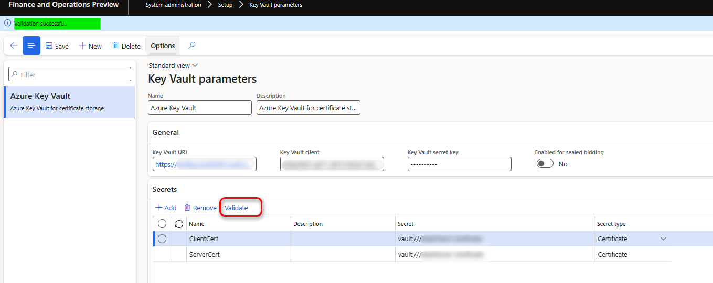
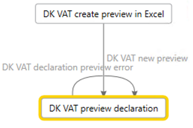
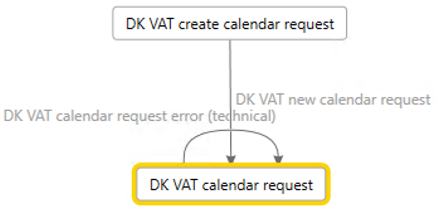
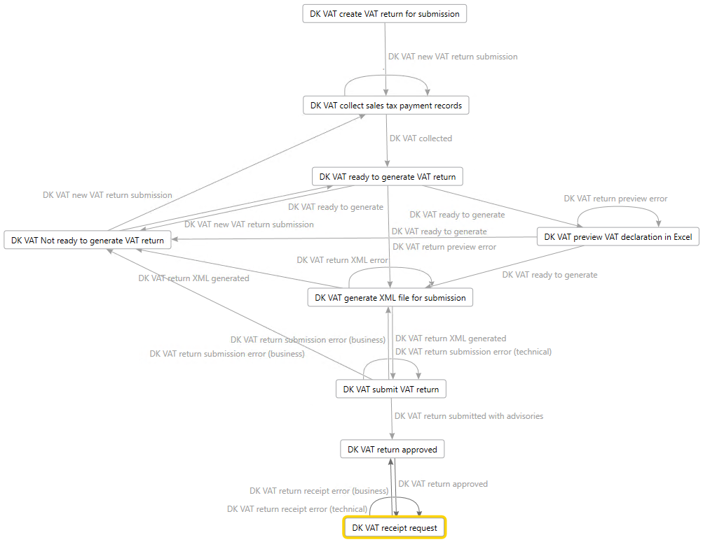
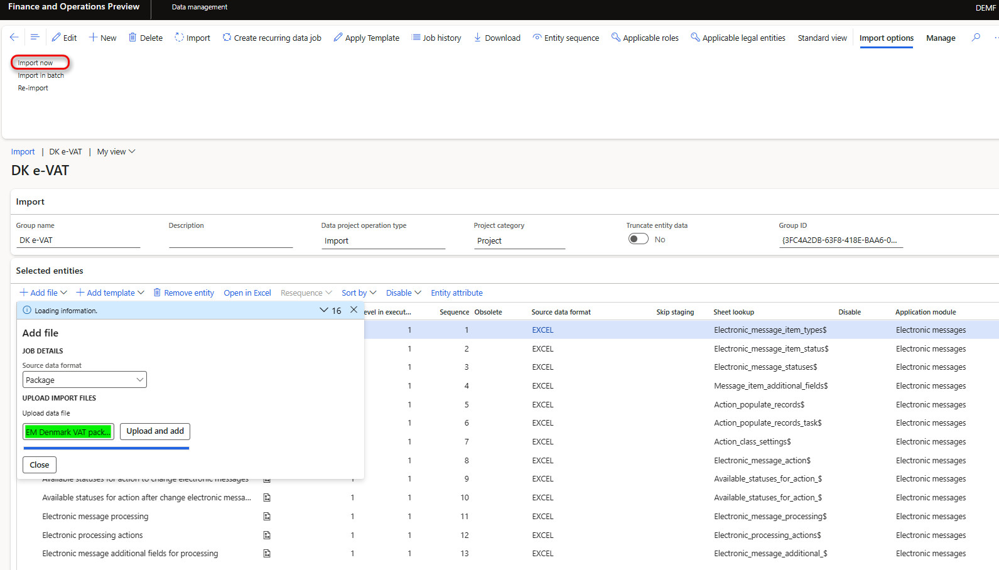
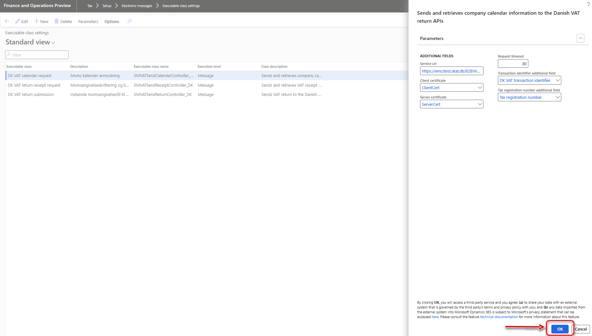

# Submit VAT return in XML to the Danish Tax Agency

[!include [banner](../includes/banner.md)]

This article describes how to prepare your Finance to generate VAT return in XML format and submit it to the Danish Tax Agency.

## Prerequisites

To automatically generate the VAT declaration in Excel or XML format, first create enough sales tax codes to keep a separate VAT accounting for each box of VAT declaration. 
Additionally, in the application-specific parameters of the Electronic reporting (ER) format for the VAT declaration, associate sales tax codes with the lookup results for the boxes on the VAT declaration.
For more information about structure of VAT declaration of Denmark and lookup results for boxes of VAT declaration, see [Overview of VAT declaration of Denmark](emea-dnk-vat-declaration-denmark.md) section.

Before you start to prepare your Finance for direct submission of VAT return in XML to the Danish Tax Agency, complete the setup necessary for [Preview VAT declaration in Excel format](emea-dnk-vat-declaration-preview.md).

To submit your VAT return directly to the Danish Tax Agency you need to contact the Danish Tax Agency (Skattestyrelsen) at `momsapi@sktst.dk` and provide your CVR number. You can also see more here: [skat.dk/momsapi](https://skat.dk/data.aspx?oid=2234574) (Danish). From the Danish Tax Agency you will get access the test environment (endpoints and certificates) and you will also get a short guide on what you need to do to get access to the production environment.

## Set up Azure Key Vault for certificate storage

certificates obtained from the Danish Tax Agency to submit your VAT return must be stored in your Azure Key Vault storage.

To set up Azure Key Vault for certificate storage, follow these steps:

1. Go to **System administration** > **Setup** > **System parameters**.
2. On the **General** tab, set the **Use advanced certificate store** option to **Yes**.
3. Upload the certificate to KeyVault.
4. Go to **System administration** > **Setup** > **Key Vault parameters**.
5. Select **New** and set the **Name** and **Description** fields.
6. On the **General** FastTab, set the following fields:

    - **Key Vault URL**: Enter the default Azure Key Vault URL.
    - **Key Vault client**: Enter the interactive client ID of the Azure Active Directory (Azure AD) application that is associated with Key Vault storage for authentication.
    - **Key Vault secret key**: Enter a secret key that is associated with the Azure AD application that's used for authentication to Key Vault storage.

7. On the **Secrets** FastTab, select **Add**, and create lines for Key Vault secrets for the the Danish Tax Agency server and client certificates.

    

For more information about how to set up Key Vault parameters, see [Set up the Azure Key Vault client](setting-up-azure-key-vault-client.md).

## Set up electronic messages

### Enable \[EM\] Executable class action type feature

To submit your VAT return directly to the Danish Tax Agency from Finance, you must enable **\[EM\] Executable class action type** feature in **Feature management**.

1. Go to **Workspaces** \> **Feature management**.
2. On the **All** tab, find and select the **\[EM\] Executable class action type** feature in the list.
3. Select **Enable now**.

### Download and import the data package that has example settings for electronic messages

The data package contains settings of electronic message functionality that enables the following scenario in your Finance.

#### Preview VAT declaration in Excel without collecting Sales tax payments (for any open period with any From and To dates)

#### Request information about VAT obligation periods from Skattestyrelsen for the period specified in electronic message

#### Generate VAT return electronic file and submit it to Skattestyrelsen

For more information about how to work with electronic messaging and create your own settings, see [Electronic messaging](../general-ledger/electronic-messaging.md).

To import the data package that contains settings of electronic message functionality that enable the listed scenario in your Microsoft Dynamics 365 Finance follow these steps.

1. In [Microsoft Dynamics Lifecycle Services (LCS)](https://lcs.dynamics.com/v2), in the Shared asset library, select **Data package** as the asset type, and then download **EM Denmark VAT package**. The downloaded file is named **EM Denmark VAT package.zip**.
2. In Finance, in the **Data management** workspace, select **Import**.
3. On the **Import** FastTab, in the **Group name** field, enter a name for the job.
4. On the **Selected entities** FastTab, select **Add file**.
5. In the **Add file** dialog box, verify that the **Source data format** field is set to **Package**, select **Upload and add**, and then select the zip file that you downloaded earlier.
6. Select **Close**.
7. After the data entities are uploaded, on the Action Pane, select **Import**.

    

8. Go to **Tax** > **Inquiries and reports** > **Electronic messages** > **Electronic messages**, and validate the electronic message processing that you imported - **DK VAT return**.

### Define a sales tax settlement period

1. Go to **Tax** > **Setup** > **Electronic messages** > **Populate records actions**.
2. Select the line for **DK VAT collect sales tax payment records**, and then select **Edit query**.
3. Use the filter to specify the settlement periods to include on the report.
4. If you must report tax transactions from other settlement periods in a different declaration, create a new **Populate records** action, and select the appropriate settlement periods.

### Save the executable class parameters for Electronic messaging

**DK VAT return** Electronic message processing uses three executable classes. These executable classes enable connection to the three Web Services of the the Danish Tax Agency.

- `VirksomhedKalenderHent` - *Company Calendar Download*: return dates for which the legal entity has to submit VAT Returns by. These dates are required, when submitting VAT Returns.
- `ModtagMomsangivelseForeloebig` - *Receive Provisional VAT declaration*: submit a draft of the VAT Returns to skat.dk with all the fields you need to fill in. The Web Service returns a deep link to skat.dk, where the legal entity can access the submitted VAT Returns and approve it.
- `MomsangivelseKvitteringHent` - *VAT declaration Receipt Download*: provide a receipt for the VAT Returns given that the legal entity has approved it. This service also includes payment information on how to pay any outstanding balance.

Before you use these classes for the first time, you must save its parameters.

1. Go to **Tax** \> **Setup** \> **Electronic messaging** \> **Executable class settings** and specify the following parameters of the executable classes by using **Parameters** button on the Action pane.

| Executable class | Description | Parameters |
|------------------|-------------|------------|
| DK VAT calendar request | Retrieves company calendar information. |  **-Service url**: specify an `https` address of an endpoint of `VirksomhedKalenderHent` Web service provided by the Danish Tax Agency  **-Client certificate**: select a client certificate stored in your Azure Key Vault  **-Server certificate:**  select a server certificate stored in your Azure Key Vault  **-Request timeout:** enter a suitable request timeout value in seconds. If left at 0, it defaults to 60 seconds.   **-Transaction identifier additional field:** select **DK VAT transaction identifier** **-Tax registration number additional field:** select **Tax registration number** |
| DK VAT return submission | Sends VAT return to the Danish VAT return APIs. |  **-Service url**: specify an `https` address of an endpoint of `ModtagMomsangivelseForeloebig` Web service provided by the Danish Tax Agency  **-Client certificate**: select a client certificate stored in your Azure Key Vault  **-Server certificate:**  select a server certificate stored in your Azure Key Vault  **-Request timeout:** enter a suitable request timeout value in seconds. If left at 0, it defaults to 60 seconds.   **-Transaction identifier additional field:** select **DK VAT transaction identifier** **-Tax registration number additional field:** select **Tax registration number** |
| DK VAT return receipt request | Retrieves VAT receipt information from the Danish Tax Agency. |  **-Service url**: specify an `https` address of an endpoint of `MomsangivelseKvitteringHent` Web service provided by the Danish Tax Agency  **-Client certificate**: select a client certificate stored in your Azure Key Vault  **-Server certificate:**  select a server certificate stored in your Azure Key Vault  **-Request timeout:** enter a suitable request timeout value in seconds. If left at 0, it defaults to 60 seconds.   **-Transaction identifier additional field:** select **DK VAT transaction identifier** **-Tax registration number additional field:** select **Tax registration number** |

3. Select **OK** button on a dialog page of each executable class to save specified parameters.

### Set up security roles for electronic message processing

Different groups of users might require access to the **DK VAT return** processing. You can limit access to the processing, based on security groups that are defined in the system.

Follow these steps to limit access to the **DK VAT return** processing.

1. Go to **Tax** \> **Setup** \> **Electronic messages** \> **Electronic message processing**.
2. Select the **DK VAT return** processing, and then, on the **Security roles** FastTab, add the security groups that must work with it. If no security group is defined for the processing, only a system admin can see it on the **Electronic messages** page.

### Set up Tax registration number

The **EM Denmark VAT package** setup file provides the **Tax registration number** additional field for **DK VAT return** EM processing. This field enables a VAT registration number that is independent of the legal entity's primary address and registration ID to be defined for the company that must report VAT returns by using the **DK VAT return** EM processing. Therefore, legal entities that have multiple VAT registrations can easily submit VAT returns that are specific to their VAT registration in Denmark. For more information about how to support filing for multiple VAT registrations, see [Multiple VAT registration numbers](emea-multiple-vat-registration-numbers.md).

Follow these steps to define the VAT registration number that the **DK VAT return** EM processing must use to submit VAT returns.

1. Go to **Tax** \> **Setup** \> **Electronic messages** \> **Electronic messages processing**, and select the **DK VAT return** EM processing.
2. On the **Message additional fields** FastTab, in the **Tax registration number** field, define the VAT registration number that should be used to send the VAT return.
3. Save your changes.

If the VAT registration number isn't specified in the **Tax registration number** additional field of the **DK VAT return** EM processing, the system retrieves it from the registration ID that is defined in the properties of the legal entity that is associated with the **VAT ID** registration category. For more information, see [Registration type](emea-registration-ids.md#registration-type-creation) and [Registration category](emea-registration-ids.md#supported-registration-categories).

## Generate a VAT declaration from electronic messages and submit it to the Danish Tax Agency

When you use electronic messages to generate the report, you can collect tax data from multiple legal entities. For more information, see the [Run a VAT declaration for multiple legal entities](#run-vat-declaration) section later in this article.

The following procedures apply to the **DK VAT return** EM processing example that you imported earlier from the LCS Shared asset library. This processing supports the following scenarios:

- Preview VAT declaration in Excel without collecting Sales tax payments (for any open period with any From and To dates)
- Request information about VAT obligation periods from Skattestyrelsen for the period specified in electronic message
- Generate VAT return electronic file and submit it to Skattestyrelsen

### Preview VAT declaration in Excel without collecting Sales tax payments

1. Go to **Tax \> Inquiries and reports \> Electronic messages \> Electronic messages**.
2. In the left pane, select **DK VAT return**.
3. On the **Messages** FastTab, select **New**, and then, in the **Run processing** dialog box, select **DK VAT create preview in Excel** in the **Action** filed and click **OK**. A new message in **DK VAT new preview** status is created.
4. Select the message line that is created, enter a description, and then specify the start and end dates for the declaration.
5. Select **Generate report**. To preview the VAT declaration amounts, in the **Run processing** dialog box, select **DK VAT preview declaration** in the **Action** field, and then select **OK**.
6. In the **Electronic reporting parameters** dialog box, set the fields as described in the [Preview the VAT declaration in Excel](emea-dnk-vat-declaration-preview.md#preview-vat-excel) section earlier in this article, and then select **OK**.
11. Select the **Attachments** button (paper clip symbol) in the upper-right corner of the page, and then select **Open** to open the file. Review the amounts in the Excel document.

### Request information about VAT obligation periods from Skattestyrelsen

1. Go to **Tax \> Inquiries and reports \> Electronic messages \> Electronic messages**.
2. In the left pane, select **DK VAT return**.
3. On the **Messages** FastTab, select **New**, and then, in the **Run processing** dialog box, select **DK VAT create calendar request** in the **Action** filed and click **OK**. A new message in **DK VAT new calendar request** status is created.
4. Select the message line that is created, enter a description, and then specify the start and end dates for the declaration.
5. Select **Send report**, in the **Run processing** dialog box, select **DK VAT calendar request** in the **Action** field, and then select **OK**. Request is sent to the Danish Tax Agency and response with information about obligation periods is attached to the electronic message in HTML format.
6. Select the **Attachments** button (paper clip symbol) in the upper-right corner of the page, and then select **Open** to open the file. Review the information from the response in your browser.

### Generate VAT return electronic file and submit it to Skattestyrelsen

1. Go to **Tax \> Inquiries and reports \> Electronic messages \> Electronic messages**.
2. In the left pane, select **DK VAT return**.
3. On the **Messages** FastTab, select **New**, and then, in the **Run processing** dialog box, select **DK VAT create VAT return for submission** in the **Action** filed and click **OK**. A new message in **DK VAT new VAT return submission** status is created.
4. Select the message line that is created, enter a description, and then specify the start and end dates for the declaration.
5. On the **Messages** FastTab, select **Collect data**, and then select **OK**. The sales tax payments that were generated earlier are added to the message. For more information, see the [Settle and post sales tax](emea-dnk-vat-declaration-preview.md#settle-and-post-sales-tax) section earlier in this article.
6. On the **Message items** FastTab, review the sales tax payments that are transferred for processing. By default, all sales tax payments of the selected period that weren't included in any other message of the same processing are included.
7. Optional: Select **Original document** to review the sales tax payments or select **Delete** to exclude sales tax payments from processing. 
8. On the **Messages** FastTab, select **Update status**. In the **Update status** dialog box, select **DK VAT ready to generate VAT return** in the **Action** field, and then select **OK**. Verify that the message status is changed to **Ready to generate**.
9. Optional: Select **Generate report**. To preview the VAT declaration amounts, in the **Run processing** dialog box, select **DK VAT preview VAT declaration in Excel**, and then select **OK**.
10. Optional: In the **Electronic reporting parameters** dialog box, set the fields as described in the [Preview the VAT declaration in Excel](emea-dnk-vat-declaration-preview.md#preview-vat-excel) section earlier in this article, and then select **OK**.
11. Optional: Select the **Attachments** button (paper clip symbol) in the upper-right corner of the page, and then select **Open** to open the file. Review the amounts in the Excel document.
12. Select **Generate report**. To generate the VAT return in XML format that can be further submitted to the Danish Tax Agency, in the **Run processing** dialog box, select **DK VAT generate XML file for submission**, and then select **OK**.
13. In the **Electronic reporting parameters** dialog box, set the fields as described in the [Preview the VAT declaration in Excel](emea-dnk-vat-declaration-preview.md#preview-vat-excel) section earlier in this article, and then select **OK**.
14. Select the **Attachments** button (paper clip symbol) in the upper-right corner of the page, and then select **Open** to open the file. Review the amounts in the Excel document.
15. Select **Send report** to submit VAT return in XML format to the Danish Tax Agency, in the **Run processing** dialog box, select **DK VAT submit VAT return** in the **Action** field and click **OK**. As a result of this action your VAT return is transferred to the Danish Tax Agency. In response, the Danish Tax Agency sends a link that you must use to approve your VAT return.
16. Select the **Attachments** button (paper clip symbol) in the upper-right corner of the page, and then use attached link to approve your VAT return.
17. When VAT return is approved, on the **Messages** FastTab, select **Update status**. In the **Update status** dialog box, select **DK VAT return approved** in the **Action** field, and then select **OK**. Verify that the message status is changed to **DK VAT return approved**.
18. For approved VAT return you can request a receipt information from the the Danish Tax Agency. Select **Send report**, in the **Run processing** dialog box, select **DK VAT receipt request** in the **Action** field and click **OK**. As a result, request for receipt is sent to the Danish Tax Agency and response is attached to the electronic message as HTML file.
19. Select the **Attachments** button (paper clip symbol) in the upper-right corner of the page, and then select **Open** to open the file. Review the information from the response in your browser.

##  Generate a VAT declaration for multiple legal entities

To use the formats to report the VAT declaration for a group of legal entities, you must first set up the application-specific parameters of the ER formats for sales tax codes from all required legal entities.

### Set up electronic messages to collect tax data from several legal entities

Follow these steps to set up electronic messages to collect data from multiple legal entities.

1. Go to **Workspaces** > **Feature management**.
2. Find and select the **Cross-company queries for the populate records actions** feature in the list, and then select **Enable now**.
3. Go to **Tax** > **Setup** > **Electronic messages** > **Populate records actions**.
4. On the **Populate records action** page, select the line for **DK VAT collect sales tax payment records**.

   In the **Datasources setup** grid, a new **Company** field is available. For existing records, this field shows the identifier of the current legal entity.

5. In the **Datasources setup** grid, add a line for each additional legal entity that must be included in reporting. For each new line, set the following fields.

    | Field                  | Description                                                                                                                   |
    |------------------------|-------------------------------------------------------------------------------------------------------------------------------|
    | Name                   | Enter a value that will help you understand where this record comes from. For example, enter **VAT payment of Subsidiary 1**. |
    | Message item type      | Select **VAT return**. This value is the only value that is available for all the records.                                    |
    | Account type           | Select **All**.                                                                                                               |
    | Master table name      | Specify **TaxReportVoucher** for all the records.                                                                             |
    | Document number field  | Specify **Voucher** for all the records.                                                                                      |
    | Document date field    | Specify **TransDate** for all the records.                                                                                    |
    | Document account field | Specify **TaxPeriod** for all the records.                                                                                    |
    | Company                | Select the ID of the legal entity.                                                                                            |
    | User query             | This checkbox is automatically selected when you define criteria by selecting **Edit query**.                                 |

6. For each new line, select **Edit query**, and specify a related settlement period for the legal entity that is specified in the **Company** field on the line.

When the setup is completed, the **Collect data** function on the **Electronic messages** page collects sales tax payments from all legal entities that you defined.

[!INCLUDE[footer-include](../../includes/footer-banner.md)]
