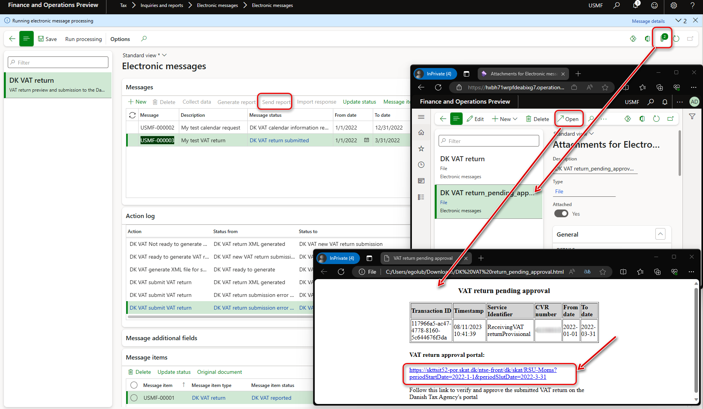

# Submit VAT return in XML to the Danish Tax Agency

[!include [banner](../includes/banner.md)]

This article describes how to prepare your Dynamics 365 Finance environment to generate a VAT return in XML format and submit it to the Danish Tax Agency.

## Prerequisites

To automatically generate the VAT declaration in Excel or XML format, you must first create enough sales tax codes to keep a separate VAT accounting for each box of VAT declaration. 
Additionally, in the application-specific parameters of the Electronic reporting (ER) format for the VAT declaration, associate sales tax codes with the lookup results for the boxes on the VAT declaration.
For more information about structure of VAT declaration of Denmark and lookup results for boxes of VAT declaration, see [Overview of VAT declaration of Denmark](emea-dnk-vat-declaration-denmark.md) section.

Before you start to prepare your Finance environment for direct submission of VAT returns in XML to the Danish Tax Agency, complete the setup necessary for [Preview VAT declaration in Excel format](emea-dnk-vat-declaration-preview.md).

To submit your VAT return directly to the Danish Tax Agency, contact the Danish Tax Agency (Skattestyrelsen) at `momsapi@sktst.dk` and provide your CVR number. You can also learn more at [skat.dk/momsapi](https://skat.dk/data.aspx?oid=2234574) (Danish). From the Danish Tax Agency you will get access the test environment (endpoints and certificates) and a short guide on what you need to do to get access to the production environment.

## Set up Azure Key Vault for certificate storage

Certificates you obtain from the Danish Tax Agency to submit your VAT return must be stored in your Azure Key Vault storage.

To set up Azure Key Vault for certificate storage, follow these steps:

1. Go to **System administration** > **Setup** > **System parameters**.
2. On the **General** tab, set **Use advanced certificate store** to **Yes**.
3. Upload the certificate to KeyVault.
4. Go to **System administration** > **Setup** > **Key Vault parameters**.
5. Select **New** and enter values in the **Name** and **Description** fields.
6. On the **General** FastTab, set the following fields:

    - **Key Vault URL**: Enter the default Azure Key Vault URL.
    - **Key Vault client**: Enter the interactive client ID of the Azure Active Directory (Azure AD) application that is associated with Key Vault storage for authentication.
    - **Key Vault secret key**: Enter a secret key that is associated with the Azure AD application that's used for authentication to Key Vault storage.

7. On the **Secrets** FastTab, select **Add**, and create lines for Key Vault secrets for the the Danish Tax Agency server and client certificates.

    

For more information about how to set up Key Vault parameters, see [Set up the Azure Key Vault client](setting-up-azure-key-vault-client.md).

## Set up electronic messages

### Enable \[EM\] Executable class action type feature

To submit your VAT return directly to the Danish Tax Agency from Finance, you must enable **\[EM\] Executable class action type** feature in **Feature management**.

1. Go to **Workspaces** \> **Feature management**.
2. On the **All** tab, find and select the **\[EM\] Executable class action type** feature in the list.
3. Select **Enable now**.

### Get the data package with example settings for electronic messages

The data package contains settings of electronic message functionality that enables the following three scenarios in your Finance.

#### Scenario 1: Preview VAT declaration in Excel without collecting Sales tax payments (for any open period with any From and To dates)

This scenario is composed of two actions:

- **DK VAT create preview in Excel**: this action creates a new electronic message and allows to further generate a VAT declaration in Excel format for a period specified.
- **DK VAT preview declaration**: this action allows to generate a VAT declaration in Excel format for the period specified as **From date** and **To date** of the electronic message by running an ER format specified for this action (by default, **VAT Declaration Excel (DK)**).

#### Scenario 2: Request information about VAT obligation periods from Skattestyrelsen for the period specified in electronic message

This scenario is composed of two actions:

- **DK VAT create calendar request**: this action creates a new electronic message and allows to further generate and send a request about VAT obligation periods (calendar) of the legal entity to Skattestyrelsen for a period specified.
- **DK VAT calendar request**: this action allows to request information about VAT obligation periods of the legal entity directly from Skattestyrelsen for a period specified as **From date** and **To date** of the electronic message by running [`EMVATSendCalendar_DK` executable class](#calendar-request). Received response from Skattestyrelsen can be observed in internet browser as HTML file attached to the electronic message. 

#### Scenario 3: Generate a VAT return electronic file and submit it to Skattestyrelsen

This scenario is composed of the steps described in the table below.

| Action | Description |
|--------|-------------|
| **DK VAT create VAT return for submission** | This action creates a new electronic message that allows to further generate and send a VAT return of the legal entity to Skattestyrelsen for a period specified. |
| **DK VAT collect sales tax payment records** | This action runs [**DK VAT collect sales tax payment records** populate records action](#populate-records) to collect those sales tax payment transactions that must be included into the VAT return. |
| **DK VAT ready to generate VAT return** | This action changes the status of the electronic message to **Ready to generate** that enables further generation of an electronic file for VAT return. |
| **DK VAT Not ready to generate VAT return** | This action changes the status of the electronic message back to **DK VAT new VAT return submission** that enables to collect sales tax payment records again. |
| **DK VAT preview VAT declaration in Excel** | This action allows to generate a VAT declaration in Excel format based on collected sales tax payment transactions for selected electronic message by running an ER format specified for this action (by default, **VAT Declaration Excel (DK)**). |
| **DK VAT generate XML file for submission** |  This action allows to generate a VAT return in XML format based on collected sales tax payment transactions for selected electronic message by running an ER format specified for this action (by default, **VAT Declaration XML (DK)**). | 
| **DK VAT submit VAT return** | This action sends generated VAT return in XML format to Skattestyrelsen by running [`EMVATSendReturnController_DK` executable class](#return-submission) , receives a link for the further approval of the informat that was sent. Received link is attached in HTML file to the electronic message. |
| **DK VAT return approved** | This action changes the status of the electronic message to **DK VAT return approved** that enables to retrieve a receipt information from Skattestyrelsen. |
| **DK VAT receipt request** | This action allows to send a request about receipt for the previously approved period directly from Skattestyrelsen by running [`EMVATSendReceiptController_DK` executable class](#receipt-request). Received response from Skattestyrelsen can be observed in HTML format as an attachment to the electronic message.

For more information about how to work with electronic messaging and create your own settings, see [Electronic messaging](../general-ledger/electronic-messaging.md).

To import the data package that contains the settings of electronic message functionality that enable the listed scenario in your Microsoft Dynamics 365 Finance environment, follow these steps.

1. In [Microsoft Dynamics Lifecycle Services (LCS)](https://lcs.dynamics.com/v2), in the Shared asset library, select **Data package** as the asset type, and then download **DK VAT return - Skattestyrelsen EM package**. The downloaded file is named **DK VAT return - Skattestyrelsen EM package v\#.zip**.
2. In Finance, in the **Data management** workspace, select **Import**.
3. On the **Import** FastTab, in the **Group name** field, enter a name for the job.
4. On the **Selected entities** FastTab, select **Add file**.
5. In the **Add file** dialog box, verify that the **Source data format** field is set to **Package**, select **Upload and add**, and then select the file that you downloaded from LCS.
6. Select **Close**.
7. After the data entities are uploaded, on the Action Pane, select **Import** or **Import now**.

    

8. Go to **Tax** > **Inquiries and reports** > **Electronic messages** > **Electronic messages**, and validate the electronic message processing that you imported, **DK VAT return**.

###  Define a sales tax settlement period

1. Go to **Tax** > **Setup** > **Electronic messages** > **Populate records actions**.
2. Select the line for **DK VAT collect sales tax payment records**, and then select **Edit query**.
3. Use the filter to specify the settlement periods to include on the report.

### Save the executable class parameters for Electronic messaging

**DK VAT return** electronic message processing uses three executable classes. These executable classes enable a connection to the three Web Services of the the Danish Tax Agency.

- `VirksomhedKalenderHent` - *Company Calendar Download*: Return dates for which the legal entity has to submit VAT returns by. These dates are required when submitting VAT returns.
- `ModtagMomsangivelseForeloebig` - *Receive Provisional VAT declaration*: Submit a draft of the VAT returns to skat.dk with the necessary field information. The Web Service returns a deep link to skat.dk, where the legal entity can access and approve the submitted VAT returns.
- `MomsangivelseKvitteringHent` - *VAT declaration Receipt Download*: Provide a receipt for the VAT returns given that the legal entity has approved it. This service also includes payment information on how to pay an outstanding balance.

Before you use these classes for the first time, you must save the parameters.

1. Go to **Tax** \> **Setup** \> **Electronic messaging** \> **Executable class settings** and specify the following parameters of the executable classes by selecting **Parameters** on the Action Pane.

| Executable class | Description | Parameters |
|------------------|-------------|------------|
|  DK VAT calendar request | Retrieves company calendar information. |  **- Service url** - Specify the `https` address of an endpoint of `VirksomhedKalenderHent` Web service provided by the Danish Tax Agency.   **- Client certificate** - Select a client certificate stored in your Azure Key Vault.  **- Server certificate** - Select a server certificate stored in your Azure Key Vault.   **- Request timeout** - Enter a suitable request timeout value in seconds. If left at zero (0), the value defaults to 60 seconds.   **-Transaction identifier additional field** - Select **DK VAT transaction identifier**.  **-Tax registration number additional field** - Select **Tax registration number**. |
| DK VAT return submission | Sends VAT return to the Danish VAT return APIs. |  **-Service url** - Specify the `https` address of an endpoint of `ModtagMomsangivelseForeloebig` Web service provided by the Danish Tax Agency.   **-Client certificate** - Select a client certificate stored in your Azure Key Vault.  **-Server certificate** - Select a server certificate stored in your Azure Key Vault.   **-Request timeout** - Enter a suitable request timeout value in seconds. If left at zero (0), the value defaults to 60 seconds.   **-Transaction identifier additional field** - Sselect **DK VAT transaction identifier**.  **-Tax registration number additional field** - Select **Tax registration number**. |
| DK VAT return receipt request | Retrieves VAT receipt information from the Danish Tax Agency. |  **-Service url** - Specify the `https` address of an endpoint of `MomsangivelseKvitteringHent` Web service provided by the Danish Tax Agency.   **-Client certificate** - Select a client certificate stored in your Azure Key Vault.  **-Server certificate** - Select a server certificate stored in your Azure Key Vault.   **-Request timeout** - Enter a suitable request timeout value in seconds. If left at zero (0), the value defaults to 60 seconds.   **-Transaction identifier additional field** - Select **DK VAT transaction identifier**.  **-Tax registration number additional field** - Select **Tax registration number**. |

3. Select **OK** on the dialog page of each executable class to save specified parameters.

   

### Set up security roles for electronic message processing

Different groups of users might require access to the **DK VAT return** processing. You can limit access to the processing, based on security groups that are defined in the system.

Follow these steps to limit access to the **DK VAT return** processing.

1. Go to **Tax** \> **Setup** \> **Electronic messages** \> **Electronic message processing**.
2. Select **DK VAT return** processing, and then, on the **Security roles** FastTab, add the security groups that must work with it. If no security group is defined for the processing, only a system admin can view it on the **Electronic messages** page.

### Set up a Tax registration number

The **DK VAT return - Skattestyrelsen EM package** setup file provides the **Tax registration number** field for **DK VAT return** EM processing. This field enables a VAT registration number that's independent of the legal entity's primary address and registration ID that's been defined for companies that must report VAT returns by using the **DK VAT return** EM processing. Therefore, legal entities that have multiple VAT registrations can easily submit VAT returns that are specific to their VAT registration in Denmark. For more information about how to support filing for multiple VAT registrations, see [Multiple VAT registration numbers](emea-multiple-vat-registration-numbers.md).

Follow these steps to define the VAT registration number that the **DK VAT return** EM processing must use to submit VAT returns.

1. Go to **Tax** \> **Setup** \> **Electronic messages** \> **Electronic messages processing**, and select the **DK VAT return** EM processing.
2. On the **Message additional fields** FastTab, in the **Tax registration number** field, define the VAT registration number that should be used to send the VAT return.
3. Save your changes.

If the VAT registration number isn't specified in the **Tax registration number** additional field of the **DK VAT return** EM processing, the system retrieves it from the registration ID that is defined in the properties of the legal entity associated with the **VAT ID** registration category. For more information, see [Registration type](emea-registration-ids.md#registration-type-creation) and [Registration category](emea-registration-ids.md#supported-registration-categories).

## Generate a VAT declaration from electronic messages and submit it to the Danish Tax Agency

When you use electronic messages to generate the report, you can collect tax data from multiple legal entities. For more information, see the [Run a VAT declaration for multiple legal entities](#run-vat-declaration) section later in this article.

The following procedures apply to the **DK VAT return** EM processing example that you imported earlier from the LCS Shared asset library. This processing supports the following scenarios:

- Preview VAT declaration in Microsoft Excel without collecting Sales tax payments for any open period with any From and To dates.
- Request information about VAT obligation periods from Skattestyrelsen for the period specified in electronic message.
- Generate VAT return electronic file and submit it to Skattestyrelsen.

### Preview VAT declaration in Excel without collecting Sales tax payments

1. Go to **Tax** \> **Inquiries and reports** \> **Electronic messages** \> **Electronic messages**.
2. In the left pane, select **DK VAT return**.
3. On the **Messages** FastTab, select **New**, and then, in the **Run processing** dialog box, in the **Action** field, select **DK VAT create preview in Excel** and then select **OK**. A new message in **DK VAT new preview** status is created.
4. Select the message line that is created, enter a description, and then specify the start and end dates for the declaration.
5. Select **Generate report**. To preview the VAT declaration amounts, in the **Run processing** dialog box, in the **Action** field,select **DK VAT preview declaration** and then select **OK**.
6. In the **Electronic reporting parameters** dialog box, set the fields as described in the [Preview the VAT declaration in Excel](emea-dnk-vat-declaration-preview.md#preview-vat-excel) section earlier in this article, and then select **OK**.
11. Select the **Attachments** button and then select **Open** to open the file. Review the amounts in the Excel document.

### Request information about VAT obligation periods from Skattestyrelsen

1. Go to **Tax** \> **Inquiries and reports** \> **Electronic messages** \> **Electronic messages**.
2. In the left pane, select **DK VAT return**.
3. On the **Messages** FastTab, select **New**, and then, in the **Run processing** dialog box, in the **Action** field, select **DK VAT create calendar request** and then select **OK**. A new message in **DK VAT new calendar request** status is created.
4. Select the message line that is created, enter a description, and then specify the start and end dates for the declaration.
5. Select **Send report**. In the **Run processing** dialog box, in the **Action** field, select **DK VAT calendar request** and then select **OK**. The equest is sent to the Danish Tax Agency and the response with information about obligation periods is attached to the electronic message in HTML format.
6. Select **Attachments** and then select **Open** to open the file. Review the information from the response in your browser.

   

### Generate VAT return electronic file and submit it to Skattestyrelsen

1. Go to **Tax** \> **Inquiries and reports** \> **Electronic messages** \> **Electronic messages**.
2. In the left pane, select **DK VAT return**.
3. On the **Messages** FastTab, select **New**, and then, in the **Run processing** dialog box, in the **Action** field, select **DK VAT create VAT return for submission** and then select **OK**. A new message in **DK VAT new VAT return submission** status is created.
4. Select the message line that is created, enter a description, and then specify the start and end dates for the declaration.
5. On the **Messages** FastTab, select **Collect data**, and then select **OK**. The sales tax payments that were generated earlier are added to the message. For more information, see the [Settle and post sales tax](emea-dnk-vat-declaration-preview.md#settle-and-post-sales-tax) section earlier in this article.
6. On the **Message items** FastTab, review the sales tax payments that are transferred for processing. By default, all sales tax payments of the selected period that weren't included in any other message of the same processing are included.
7. Optional - Select **Original document** to review the sales tax payments or select **Delete** to exclude sales tax payments from processing. 
8. On the **Messages** FastTab, select **Update status**. In the **Update status** dialog box, in the **Action** field, select **DK VAT ready to generate VAT return** and then select **OK**. Verify that the message status is changed to **Ready to generate**.
9. Optional:

   1. Select **Generate report**. To preview the VAT declaration amounts, in the **Run processing** dialog box, select **DK VAT preview VAT declaration in Excel**, and then select **OK**.
   2. In the **Electronic reporting parameters** dialog box, set the fields as described in the [Preview the VAT declaration in Excel](emea-dnk-vat-declaration-preview.md#preview-vat-excel) section earlier in this article, and then select **OK**.
   3. Select **Attachments**, and then select **Open** to open the file. Review the amounts in the Excel document.

10. Select **Generate report** to generate the VAT return in XML format that can be further submitted to the Danish Tax Agency, and then, in the **Run processing** dialog box, select **DK VAT generate XML file for submission** and then select **OK**.
11. In the **Electronic reporting parameters** dialog box, set the fields as described in the [Preview the VAT declaration in Excel](emea-dnk-vat-declaration-preview.md#preview-vat-excel) section earlier in this article, and then select **OK**.
12. Select **Attachments**, and then select **Open** to open the file. Review your VAT return in XML format.
13. Select **Send report** to submit VAT return in XML format to the Danish Tax Agency. In the **Run processing** dialog box, in the **Action** field, select **DK VAT submit VAT return**, and then select **OK**. As a result of this action your VAT return is transferred to the Danish Tax Agency and response is attached to electronic message as HTML file (`DK VAT return_pending_approval.html`). In response, the Danish Tax Agency sends you a link that you must use to approve your VAT return.
14. Select **Attachments**, and then select **Open** to open the HTML file in your browser. The HTML file contains a link to approve your VAT return in **Godkendelsesportal for momsangivelse (VAT return approval portal)** section. Select this link to approve the VAT return.

    

15. When the VAT return is approved, on the **Messages** FastTab, select **Update status**. In the **Update status** dialog box, in the **Action** field, select **DK VAT return approved**, and then select **OK**. Verify that the message status is changed to **DK VAT return approved**.
16. For an approved VAT return you can request a receipt information from the the Danish Tax Agency. In the **Run processing** dialog box, select **Send report**, and in the **Action** field, select **DK VAT receipt request**. Select **OK**. As a result, the receipt request is sent to the Danish Tax Agency and the response is attached to the electronic message as an HTML file (`DK VAT return payment.html`).
17. Select **Attachments**, and then select **Open** to open the file. Review the information from the response in your browser.
18. To request the receipt informaion again, select **Update status** to change the electronic message status back to **DK VAT return approved** and then select **Send report** to repeat the **DK VAT receipt request** action.

##  Generate a VAT declaration for multiple legal entities

To use the formats to report the VAT declaration for a group of legal entities, first set up the application-specific parameters of the ER formats for sales tax codes from all required legal entities.

### Set up electronic messages to collect tax data from several legal entities

Follow these steps to set up electronic messages to collect data from multiple legal entities.

1. Go to **Workspaces** > **Feature management**.
2. Find and select the **Cross-company queries for the populate records actions** feature in the list, and then select **Enable now**.
3. Go to **Tax** > **Setup** > **Electronic messages** > **Populate records actions**.
4. On the **Populate records action** page, select the line for **DK VAT collect sales tax payment records**.

   In the **Datasources setup** grid, a new **Company** field is available. For existing records, this field shows the identifier of the current legal entity.

5. In the **Datasources setup** grid, add a line for each additional legal entity that must be included in reporting. For each new line, set the following fields.

    | Field                  | Description                                                                                                                   |
    |------------------------|-------------------------------------------------------------------------------------------------------------------------------|
    | Name                   | Enter a value that will help you understand where this record comes from. For example, enter **VAT payment of Subsidiary 1**. |
    | Message item type      | Select **VAT return**. This value is the only value that is available for all the records.                                    |
    | Account type           | Select **All**.                                                                                                               |
    | Master table name      | Specify **TaxReportVoucher** for all the records.                                                                             |
    | Document number field  | Specify **Voucher** for all the records.                                                                                      |
    | Document date field    | Specify **TransDate** for all the records.                                                                                    |
    | Document account field | Specify **TaxPeriod** for all the records.                                                                                    |
    | Company                | Select the ID of the legal entity.                                                                                            |
    | User query             | This checkbox is automatically selected when you define criteria by selecting **Edit query**.                                 |

6. For each new line, select **Edit query**, and specify a related settlement period for the legal entity that is specified in the **Company** field on the line.

When the setup is completed, the **Collect data** function on the **Electronic messages** page collects sales tax payments from all legal entities that you defined.

[!INCLUDE[footer-include](../../includes/footer-banner.md)]
