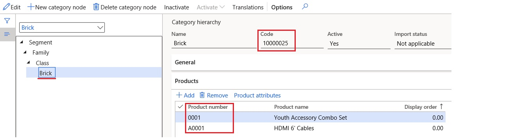

---
# required metadata

title: Customer electronic invoices in Egypt
description: This topic explains how to configure and submit customer electronic invoices in Egypt.
author: ikondo
manager: AnnBe
ms.date: 02/01/2021
ms.topic: article
ms.prod: 
ms.service: dynamics-ax-applications
ms.technology: 

# optional metadata

ms.search.form:  
# ROBOTS: 
audience: Application User
# ms.devlang: 
ms.reviewer: kfend
ms.search.scope: Core, Operations
# ms.tgt_pltfrm: 
ms.custom: 547940
ms.search.region: Egypt
# ms.search.industry: 
ms.author: ilyako
ms.search.validFrom: 2021-02-01
ms.dyn365.ops.version: 10.0.17

---

# Customer electronic invoices in Egypt

[!include [banner](../includes/banner.md)]

[!include [banner](../includes/preview-banner.md)]

According to Egyptian legal requirements, invoices that are issued for customers must be submitted to the Tax authority in an electronic format. Electronic invoice submission requires the following two-part system configuration:

1. **Electronic invoicing add-on** configuration. For more information, see [Get started with the Electronic invoicing add-on for Egypt](e-invoicing-eg-get-started.md).
2. **Microsoft Dynamics 365 Finance** configuration, which is covered in this topic.

## Prerequisites

- Electronic invoicing add-on configuration is completed, and all required parts for Egypt are ready to use.
- In the **Feature management** workspace, turn on the **Electronic invoicing add-on integration** feature. For more information, see [Feature management overview](../../fin-ops-core/fin-ops/get-started/feature-management/feature-management-overview.md).

## Enable electronic invoicing for Egypt

1. Go to **Organization administration** \> **Setup** \> **Electronic document parameters**.
2. On the **Features** tab, select the feature reference for **EG00008 E-invoicing for Egypt**.
3. Turn on the **Enabled** option for the selected feature reference.

## Configure registration numbers

> [!NOTE]
> If the **Enterprise ID (COID)** registration category already exists and has been assigned to a registration type, skip this procedure.

1. Go to **Organization administration** \> **Global address book** \> **Registration types** \> **Registration types**.
2. Create a registration type.
3. In the **Country/region** field, select **EGY - Egypt**.
4. Go to **Organization administration** \> **Global address book** \> **Registration types** \> **Registration categories**.
5. Create a registration category.
6. In the **Registration types** field, select the registration type that you created in step 2.
7. In the **Registration categories** field, select **Enterprise ID (COID)**.

## Configure electronic document property types

Follow these steps to configure the electronic document property type that is required to define the taxpayer activity code.

1. Go to **Accounts receivable** \> **Setup** \> **Electronic document property types**.
2. Create an electronic document property type.
3. In the **Type** field, enter **taxpayerActivityCode**.
4. On the Action Pane, select **Applicability**.
5. In the **Table name** field, select **CompanyInfo**.
6. Save and close the **Electronic document property type applicability setup** page.
7. Save and close the **Electronic document property types** page.

## Configure legal entity data

### Enter a legal entity address

1. Go to **Organization administration** \> **Organizations** \> **Legal entities**.
2. Select a legal entity.
3. On the **Addresses** FastTab, add a valid primary address for the selected legal entity.

### Enter a legal entity branch

1. Go to **Organization administration** \> **Organizations** \> **Legal entities**.
2. Select a legal entity.
3. On the **Statutory reporting** FastTab, in the **Branch/Subsidiary** field, enter a branch code for the selected legal entity.

### Enter the legal entity registration number

1. Go to **Organization administration** \> **Organizations** \> **Legal entities**.
2. Select a legal entity, and then, on the Action Pane, select **Registration IDs**.
3. On the **Registration ID** FastTab, select **Add** to create a registration ID.
4. In the **Registration type** field, select the registration type that you created in the [Configure registration numbers](#configure-registration-numbers) section earlier in this topic.
6. In the **Registration number** field, enter a valid legal entity registration number. This number can be obtained from the Tax authority.

### Enter an activity code for a legal entity

1. Go to **Organization administration** \> **Organizations** \> **Legal entities**.
2. Select a legal entity, and then, on the Action Pane, select **Electronic document properties**.
3. Select the line where the **Type** field is set to **taxpayerActivityCode**.
4. In the **Value** field, enter the taxpayer activity code.

## Configure customer data

### Enter a customer address

1. Go to **Accounts receivable** \> **Customers** \> **All customers**.
2. Select a customer.
3. On the **Addresses** FastTab, add a valid address for the selected customer.

### Enter the customer registration number

1. Go to **Accounts receivable** \> **Customers** \> **All customers**.
2. Select a customer, and then, on the Action Pane, on the **Customer** tab, in the **Registration** group, select **Registration IDs**.
3. On the **Registration ID** FastTab, select **Add** to create a registration ID.
5. In the **Registration type** field, select the registration type that you created in the [Configure registration numbers](#configure-registration-numbers) section earlier in this topic.
6. In the **Registration number** field, enter a valid customer registration number. This number can be obtained from the Tax authority.

## Configure sales tax codes

1. Go to **Tax** \> **Indirect taxes** \> **Sales tax** \> **Sales tax codes**.
2. Select a sales tax code, and then, on the Action Pane, on the **Sales tax code** tab, in the **Sales tax code** group, select **External codes**.
3. In **Overview** section, create a line for the selected sales tax code.
4. In **Value** section, in **Value** field, enter an external code to use for the selected sales tax code, according to the official codification for [tax types](https://sdk.sit.invoicing.eta.gov.eg/codes/tax-types/).
5. Go to **Tax** \> **Setup** \> **Sales tax** \> **Sales tax exempt codes**.
6. Define exempt codes that will be used as tax subtypes in the event of non-taxable operations.

## Configure unit codes

1. Go to **Organization administration** \> **Setup** \> **Units** \> **Units**.
2. Select a unit, and then, on the Action Pane, select **External codes**.
3. In **Overview** section, create a line for the selected unit.
4. In the **Value** section, in **Value** field, enter an external code to use for the selected unit, according to the official codification for [unit types](https://sdk.sit.invoicing.eta.gov.eg/codes/unit-types/).

## Configure products

According to Egyptian legal requirements, products on electronic invoices must use either Global Trade Item Number (GTIN) codes or GS1 - Global Product Classification (GPC) level 4 codes (brick codes).

### Enter GTIN codes

1. Go to **Product information management** \> **Products** \> **Released products**.
2. Select a product, and then, on the Action Pane, on the **Manage inventory** tab, in the **Warehouse** group, select **GTIN codes**.
3. Enter the GTIN code for the selected product.

### Configure GPC codes

1. Go to **Product information management** \> **Setup** \> **Categories and attributes** \> **Category hierarchies**.
2. Create a category hierarchy that is named **GPC**.
3. Create category nodes to implement the following four-level hierarchy: **Segment** \> **Family** \> **Class** \> **Brick**.
4. At the **Brick** level, in the **Code** field, enter the code that will be applicable to selected products.
5. On the **Products** FastTab, select **Add** to add all the products that the brick code will be applicable to.

> [!NOTE]
> If neither GTIN codes nor GPC codes are defined for products, internal product numbers will be used on electronic invoices. If no products or services are involved in invoicing, for example, free text invoices, or various operations in project invoices, line descriptions will be used.

## Submit electronic invoices

When you've completed all the required configuration steps, you can submit electronic invoices. For more information about how to submit electronic invoices, see [Issue electronic invoices in Finance and Supply chain management](e-invoicing-issuing-electronic-invoices-finance-supply-chain-management.md).

## Related topics

- [Electronic invoicing add-on overview](e-invoicing-service-overview.md)

[!INCLUDE[footer-include](../../includes/footer-banner.md)]
