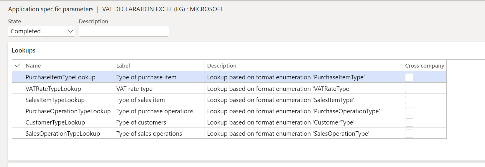
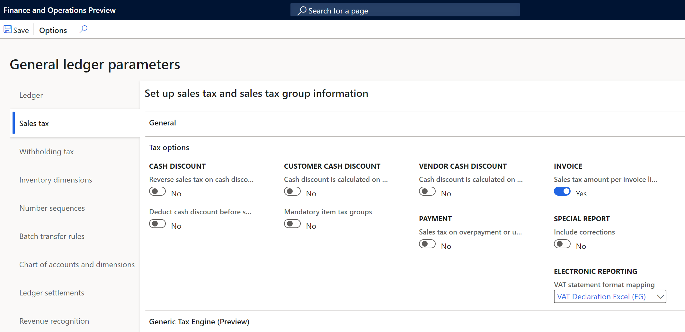

---
# required metadata

title: VAT declaration for Egypt
description: This topic explains how to configure and generate the VAT return form for Egypt.
author: sndray
ms.date: 06/03/2021
ms.topic: article
ms.prod:
ms.technology: 

# optional metadata

# ms.search.form:
audience: Application User, Developer, IT Pro
# ms.devlang: 
ms.reviewer: kfend
ms.search.scope:
# ms.tgt_pltfrm: 
# ms.custom: NotInTOC
ms.search.region: Global
# ms.search.industry:
ms.author: sndray
ms.search.validFrom: 2017-06-20
ms.dyn365.ops.version: 10.0.17
---

#  VAT declaration for Egypt (EG-00002)

[!include[banner](../includes/banner.md)]

[!include[banner](../includes/banner.md)]

This topic explains how to set up and generate the VAT return form and sales and purchase books for legal entities in Egypt.

The VAT return form for Egypt is the official document that summarizes the total output VAT tax amount due, the total input VAT tax amount recoverable, and the related VAT tax amount liability. The form is used for all types of taxpayers and should be completed manually through the tax authority portal. The VAT return form is commonly referred to as VAT return filing.

The VAT return form in Dynamics 365 Finance includes the following reports:

- VAT return form number 10, which provides a breakdown of amounts, adjustments, and VAT amount per line item in the VAT return form as described in the legislation.
- Sales transactions book
- Purchase transactions book

## Prerequisites
The primary address of the legal entity must be in Egypt.
In the **Feature management** workspace, enable the following feature:

   - (Egypt) Category hierarchy for Sales and purchase tax report.

For more information about how to enable features, see [Feature management overview](../../fin-ops-core/fin-ops/get-started/feature-management/feature-management-overview.md).

In the **Electronic reporting** workspace, import the following Electronic reporting format from the repository:

- VAT declaration Excel (EG)

> [!NOTE]
> The format above is based on the **Tax declaration model** and uses the **Tax declaration model mapping**. Additional configurations will be automatically imported.

For more information about how to import Electronic reporting configurations, see [Download Electronic reporting configurations from Lifecycle Services](../../fin-ops-core/dev-itpro/analytics/download-electronic-reporting-configuration-lcs.md).

## Download Electronic reporting configurations

The implementation of the VAT return form for Egypt is based on Electronic reporting (ER) configurations. For more information about the capabilities and concepts of configurable reporting, see [Electronic reporting](../../fin-ops-core/dev-itpro/analytics/general-electronic-reporting.md).

For production and user acceptance testing (UAT) environments, see [Download Electronic reporting configurations from Lifecycle Services](../../fin-ops-core/dev-itpro/analytics/download-electronic-reporting-configuration-lcs.md).

To generate the VAT return form and related reports in an Egypt legal entity, upload the following configurations:

- Tax declaration model.version.70.xml or later version
- Tax declaration model mapping.version.70.120.xml or a later version
- VAT Declaration Excel (EG).version.70.32  or a later version

After you download the ER configurations from Lifecycle Services (LCS) or the global repository, complete the following steps.

1. Go to the **Electronic reporting** workspace and select the **Reporting configurations** tile.
1. On the **Configurations** page, on the Action Pane, select **Exchange** > **Load from XML file**.
1. Upload the files in the order in which they are listed above. After all the configurations are uploaded, the configuration tree should be present in Finance.

## Set up application-specific parameters

The application-specific parameters let you establish the criteria of how tax transactions will be classified and calculated in each line when the report is generated. The determination is based on the configuration of the item sales tax group, sales tax group, sales tax code, and other criteria established in the lookup definition.

The sales and purchase book reports for Egypt include a set of columns that correspond to specific transaction classifications as types of operations, products, and documents that are specific for Egypt. Instead of including these new classifications as new entry data when the transactions are posted, the classifications will be determined based on different lookups introduced in **Configurations** > **Set up application-specific parameters** > **Setup** to meet the requirements of VAT reports for Egypt. 

These following lookup configurations are used to classify the transactions in purchase and sales VAT books reports:

- **PurchaseItemTypeLookup** > Column O: Item type
- **VATRateTypeLookup** > Column B: Tax Type
- **VATRateTypeLookup** > Column C: Table item type
- **PurchaseOperationTypeLookup** > Column A: Document type
- **CustomerTypeLookup** > Column A: Document type
- **SalesOperationTypeLookup** > Column N: Operation type
- **SalesItemTypeLookup** > Column O: Item type

Complete the following steps to set up the different lookups used to generate VAT declaration and related books reports. 

1. In the **Electronic reporting** workspace, select **Configurations** > **Setup** to set up the rules to identify the tax transaction in the related box of the VAT return form.
2. Select the current version, and on the **Lookups** FastTab, select the lookup name. For example, **SalesItemTypeLookup**. This lookup identifies the list of classifications in the Sales VAT book that are required by the tax authority.
3. On the **Conditions** FastTab, select **Add** and in the new line in the **Lookup result** column, select the related line that represents the classification in **Column O**.
4. In the **Sales tax group** column, select the sales tax group that is used to identify the classification. For example, **Domestic sales invoice**. You can also use item sales tax group, tax code, or the combination of tree attributes if the configuration is defined in another way. 
5. In the **Name** column, select the tax transaction classification.
6. Repeat steps 3-5 for all available lookups.
7. Select **Add** to include the final record line, and in the **Lookup result** column, select **Not applicable**. 
8. In the remainder columns, select **Not blank**. 
9. In the **State** field, select **Completed**.
10. Select **Save**, and then close the **Application specific parameters** page.

> [!NOTE]
> When you add the last record, **Not applicable**, you define the following rule: When the sales tax group, item sales tax group, tax code, and name that's passed as an argument doesn't satisfy any of the previous rules, the transactions aren't included in the sales VAT book. Although this rule isn't used when generating the report, the rule does help to avoid errors in report generation when there is a missing rule configuration.

The following tables represent an example of suggested configuration for the described lookup configurations. 

**SalesItemTypeLookup**

| Lookup result         | Line | Sales tax group    | Item sales tax group    | Tax code (Code) | Name                  |
|-----------------------|------|--------------------|-------------------------|-----------------|-----------------------|
| Domestic              | 1    | VAT_LOCAL          | *Not blank*             | *Not blank*     | Sales                 |
| Domestic              | 2    | VAT_LOCAL          | *Not blank*             | *Not blank*     | SalesCreditNote       |
| Domestic              | 3    | VAT_FINALC         | *Not blank*             | *Not blank*     | Sales                 |
| Domestic              | 4    | VAT_FINALC         | *Not blank*             | *Not blank*     | SalesCreditNote       |
| Domestic              | 5    | VAT_PUBLIO         | *Not blank*             | *Not blank*     | Sales                 |
| Domestic              | 6    | VAT_PUBLIO         | *Not blank*             | *Not blank*     | SalesCreditNote       |
| Export                | 7    | VAT_EXPORT         | *Not blank*             | *Not blank*     | Sales                 |
| Export                | 8    | VAT_EXPORT         | *Not blank*             | *Not blank*     | SalesCreditNote       |
| Machine and equipment | 9    | *Not blank*        | VAT_M&E                 | *Not blank*     | Sales                 |
| Machine and equipment | 10   | *Not blank*        | VAT_M&E                 | *Not blank*     | SalesCreditNote       |
| Parts machines        | 11   | *Not blank*        | VAT_PARTS               | *Not blank*     | Sales                 |
| Parts machines        | 12   | *Not blank*        | VAT_PARTS               | *Not blank*     | SalesCreditNote       |
| Exemptions            | 13   | VAT_EXE            | *Not   blank*           | *Not blank*     | SaleExempt            |
| Exemptions            | 14   | VAT_EXE            | *Not   blank*           | *Not blank*     | SalesExemptCreditNote |
| Not applicable        | 15   | *Blank*            | *Blank*                 | VAT_ADJ         | *Not blank*           |
| Not applicable        | 16   | *Not blank*        | *Not blank*             | *Not blank*     | *Not blank*           |

 **SalesOperationTypeLookup**

| Lookup result  | Line | Item sales tax group    | Tax code    | Name                  |
|----------------|------|-------------------------|-------------|-----------------------|
| Goods          | 1    | VAT_GOODS               | *Not blank* | Sales                 |
| Goods          | 2    | VAT_GOODS               | *Not blank* | SalesCreditNote       |
| Goods          | 3    | VAT_GOODS               | *Not blank* | SaleExempt            |
| Goods          | 4    | VAT_GOODS               | *Not blank* | SalesExemptCreditNote |
| Services       | 5    | VAT_SERV                | *Not blank* | Sales                 |
| Services       | 6    | VAT_SERV                | *Not blank* | SalesCreditNote       |
| Services       | 7    | VAT_SERV                | *Not blank* | SaleExempt            |
| Services       | 8    | VAT_SERV                | *Not blank* | SalesExemptCreditNote |
| Adjustments    | 9    | *Blank*                 | VAT_ADJ     | Sales                 |
| Adjustments    | 10   | *Blank*                 | VAT_ADJ     | SalesCreditNote       |
| Not applicable | 11   | *Not blank*             | *Not blank* | *Not blank*           |

**PurchaseItemTypeLookup**

| Lookup result          | Line | Item sales tax group    | Tax code    | Name                     |
|------------------------|------|-------------------------|-------------|--------------------------|
| Goods                  | 1    | VAT_GOODS               | *Not blank* | Purchase                 |
| Goods                  | 2    | VAT_GOODS               | *Not blank* | PurchaseCreditNote       |
| Services               | 3    | VAT_SERV                | *Not blank* | Purchase                 |
| Services               | 4    | VAT_SERV                | *Not blank* | PurchaseCreditNote       |
| Machine and equipment  | 5    | VAT_M&E                 | *Not blank* | Purchase                 |
| Machine and equipment  | 6    | VAT_M&E                 | *Not blank* | PurchaseCreditNote       |
| Parts machines         | 7    | VAT_PARTS               | *Not blank* | Purchase                 |
| Parts machines         | 8    | VAT_PARTS               | *Not blank* | PurchaseCreditNote       |
| Exemptions             | 9    | VAT_EXE                 | *Not bank*  | PurchaseExempt           |
| Exemptions             | 10   | VAT_EXE                 | *Not blank* | PurchaseExemptCreditNote |
| Not applicable         | 11   | *Not blank*             | *Not blank* | *Not blank*              |

**PurchaseOperationTypeLookup**

| Lookup result  | Line | Sales tax group  | Tax code    | Name                     |
|----------------|------|------------------|-------------|--------------------------|
| Domestic       | 1    | VAT_LOCAL        | *Not blank* | Purchase                 |
| Domestic       | 2    | VAT_LOCAL        | *Not blank* | PurchaseCreditNote       |
| Domestic       | 3    | VAT_LOCAL        | *Not blank* | PurchaseExempt           |
| Domestic       | 4    | VAT_LOCAL        | *Not blank* | PurchaseExemptCreditNote |
| Imported       | 5    | VAT_IMPORT       | *Not blank* | Purchase                 |
| Imported       | 6    | VAT_IMPORT       | *Not blank* | PurchaseCreditNote       |
| Imported       | 7    | VAT_IMPORT       | *Not blank* | PurchaseExempt           |
| Imported       | 8    | VAT_IMPORT       | *Not blank* | PurchaseExemptCreditNote |
| Adjustments    | 9    | *Blank*          | VAT_ADJ     | PurchaseCreditNote       |
| Adjustments    | 10   | *Blank*          | VAT_ADJ     | Purchase                 |
| Not applicable | 11   | *Not blank*      | *Not blank* | *Not blank*              |

**CustomerTypeLookup**

|    Lookup result    | Line | Sales tax group |
|---------------------|------|-----------------|
| Organization        |  1   | VAT_LOCAL       |
| Organization        |  2   | VAT_EXPORT      |
| Organization        |  3   | VAT_EXE         |
| Final consumer      |  4   | VAT_FINALC      |
| Public Organization |  5   | VAT_PUBLIO      |
| Not Applicable      |  6   | *Not blank*     |

**VATRateTypeLookup**

| Lookup result  | Line | Tax code (Code) |
|----------------|------|-----------------|
| GeneralGoods   | 1    | VAT_ST          |
| GeneralGoods   | 2    | VAT_RD          |
| FirstTable     | 3    | *Not blank*     |
| SecondTable    | 4    | *Not blank*     |
| Not applicable | 5    | *Not blank*     |

## Set up General ledger parameters

To generate the VAT return form report in Microsoft Excel format, define an ER format on the **General ledger parameters** page.

1. Go to **Tax** > **Setup** > **General ledger parameters**.
2. On the **Sales tax** tab, in the **Tax options** section, in the **VAT statement format mapping** field, select **VAT Declaration Excel (EG)**. If you leave the field blank, the standard sales tax report will be generated in SSRS format.
3. Select the **Category hierarchy**. This category enables the commodity code in Foreign trade tab transactions to allow users to select and classify goods and services. The description of this classification is detailed in sales and purchase transaction reports. This configuration is optional.

## Generate a VAT return report
The process to prepare and submit a VAT return report for a period is based on sales tax payment transactions that were posted during the Settle and post sales tax job. For more information about sales tax settlement and reporting, see [Sales tax overview](../general-ledger/indirect-taxes-overview.md).

Complete the following steps to generate the tax declaration report.

1. Go to **Tax** > **Declarations** > **Sales tax** > **Report sales tax for settlement period** or **Settle and post sales tax**.
2. Select the **Settlement period**.
3. Select the from date and then select the sales tax payment version.
5. Select **OK**. 
6. Enter the amount of credit from the previous period, if applicable, or leave the amount as zero.
7. In the **Reports details** field, select one of the following available options. 
   - **Purchase VAT book**: Generate the purchase tax transactions details report.
   - **Sales VAT book**: Generate the sales tax transactions details report.
   - **VAT declaration**: Generate only the VAT declaration return form.
8. Enter the name of person who is registered to assign the form.
9. Select the language. All reports are translated in **en-us** and **ar-eg**.
  
[!INCLUDE[footer-include](../../includes/footer-banner.md)]

