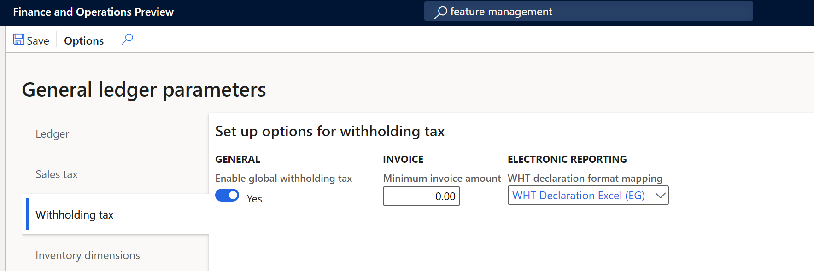

---
# required metadata

title: Withholding tax declaration for Egypt
description: This topic explains how to configure and generate the withholding tax declarations for Egypt.
author: sndray
ms.date: 03/08/2021
ms.topic: article
ms.prod:
ms.technology: 

# optional metadata

# ms.search.form:
audience: Application User, Developer, IT Pro
# ms.devlang: 
ms.reviewer: kfend
ms.search.scope:
# ms.tgt_pltfrm: 
# ms.custom: NotInTOC
ms.search.region: Global
# ms.search.industry:
ms.author: sndray
ms.search.validFrom: 2017-06-20
ms.dyn365.ops.version: 10.0.18
---

#  Withholding tax declaration for Egypt (EG-00005)

[!include[banner](../includes/banner.md)]
[!include[banner](../includes/preview-banner.md)]

## Overview
This topic explains how to set up and generate the withholding tax declaration and the withholding tax declaration forms 41 and 11 for legal entities in Egypt 

All Egyptian entities must prepare the form  41 which summarizes all taxes that are retained from local suppliers and service providers. In addition to form 41, form 11 must be generated to detail all of the retained taxed from foreign providers. 

The **Withholding tax declaration** report in Dynamics 365 Finance includes the following reports:

- Declaration form No. 41
- Declaration form No. 11
	
	
## Prerequisites
The primary address of the legal entity must be in Egypt.
In the **Feature management** workspace, the following feature must be enabled:

   - **Global withholding tax**

For more information about how to enable features, see [Feature management overview.](../../fin-ops-core/fin-ops/get-started/feature-management/feature-management-overview.md)

1. Go to **Tax** > **Setup** > **Parameters** > **General ledger parameters**, and on the **Withholding tax** tab, set **Enable global withholding tax** to **Yes**.
2. In the **Electronic reporting** workspace, import the following Electronic reporting formats from the repository:

	- WHT Declaration Excel (EG)

	> [!NOTE]
	> The format above is based on the **Tax declaration model** and uses the **Tax declaration model mapping**. This additional configuration is automatically imported.

For more information about how to import Electronic reporting configurations, see [Download Electronic reporting configurations from Lifecycle Services](../../fin-ops-core/dev-itpro/analytics/download-electronic-reporting-configuration-lcs.md).

## Download Electronic reporting configurations

The implementation of the WHT declaration forms for Egypt is based on Electronic reporting (ER) configurations. For more information about the capabilities and concepts of configurable reporting, see [Electronic reporting](../../fin-ops-core/dev-itpro/analytics/general-electronic-reporting.md).

For production and user acceptance testing (UAT) environments, follow the instructions in the topic, [Download Electronic reporting configurations from Lifecycle Services](../../fin-ops-core/dev-itpro/analytics/download-electronic-reporting-configuration-lcs.md).

To generate the Withholding declarations in an Egyptian legal entity, you need to upload the following configurations:

- Tax declaration model.version.82.xml or later version
- Tax declaration model mapping.version.82.133.xml or a later version
- WHT Declaration Excel (EG).version.82.21  or a later version

After you finish downloading the ER configurations from Lifecycle Services (LCS) or the global repository, complete the following steps.

1. Go to the **Electronic reporting** workspace and select the **Reporting configurations** tile.
1. On the **Configurations** page, on the Action Pane, select **Exchange > Load from XML file**.
1. Upload all the files in the order in which they are listed in the previous bullets. After all of the configurations are uploaded, the configuration tree should be present in Finance.

## Set up application-specific parameters

The application-specific parameters option lets users establish the criteria of how the tax transactions will be classified and calculated in each line of a generated report depending on the configuration of **withholding tax item group** or other criteria established in the definition of lookup.

Withholding declaration form 41 includes a specific column where the withholding tax transaction must be classified in accordance with the tax authority classification named **Discount code type**. Instead of including these new classifications as new entry data when the transactions are posted, the classifications will be determined based on the different lookups introduced in **Configurations** > **Set up application-specific parameters** > **Setup** to meet the requirements of withholding reports for Egypt. 

The following configuration is used to classify the transactions in the Withholding declaration form 41 report:

- **DiscountTaxTypeLookup**-> Column No 18 

Complete the following steps to set up the different lookups used to generate the WHT declaration and related books reports. 

1. In the **Electronic reporting** workspace, select **Configurations** > **Setup** to set up the rules to identify how transactions are classified in the WHT declaration report. 
2. Select the current version, and on the **Lookups** FastTab, select the lookup name. For example, **DiscountTaxTypeLookup**. This lookup identifies the list of discount types required by the tax authority.
3. On the **Conditions** FastTab, select **Add** and in the new line in the **Lookup result** column, select the related line that represents the classification in the **Column 18**.
4. In the **Withholding tax item group** column, select the related code that's used to identify the classification. For example, **Allowed discount**.  
5. Repeat steps 3 and 4 for all available lookups.
6. Select **Add** again to include the final record line, and in the **Lookup result** column, select **Not applicable**. 
7. In the remaining columns, select **Not blank**. 

> [!NOTE]

## Set up General ledger parameters

To generate the WHT declaration form reports in Microsoft Excel, define an ER format on the **General ledger parameters** page.

1. Go to **Tax** > **Setup** > **General ledger parameters**.
2. On the **Withholding tax** tab, in the **WHT declaration format mapping** field, select **WHT Declaration Excel (EG)**. If you leave the field blank, the standard sales tax report will be generated in SSRS format.

## Generate the Withholding declaration forms
The process of preparing and submitting a Withholding declaration form for a specific period is based on the withholding tax transactions posted during the settle and post payment tax job. For more information about global withholding tax, see [Global withholding tax](../general-ledger/global-withholding-tax-overview.md).

Complete the following steps to generate the tax declaration report.

1. Go to **Tax** > **Declarations** > **Withholding tax** > **Withholding tax payment*.
2. Select the settlement period and then select the from date for the report. 
3. Enter the transaction date and then select **OK**.
4. In the dialog box that opens, select one or more of the form types **Form No 41**, **Form No 11**, or **None**. If you select **None**, the standard report is generated. 
5. Select the language. All reports are translated in **en-us** and **ar-eg**.
6. Enter the branch and name of the bank where the tax payment will be paid.
7. Select the business type and then enter the check and document numbers. 
8. Enter the entity type. 
9. Enter the name of person registered to assign the form and select **OK** to confirm the report generation. 

 
[!INCLUDE[footer-include](../../includes/footer-banner.md)]
