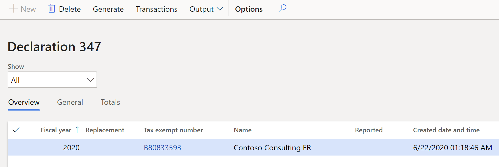
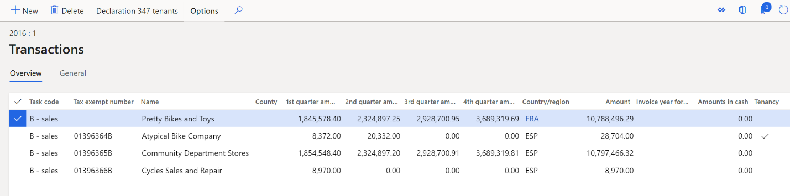
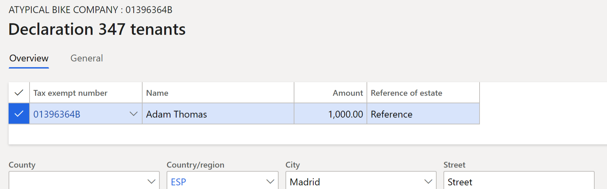
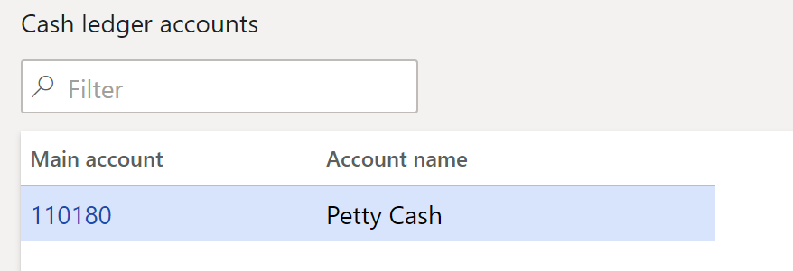
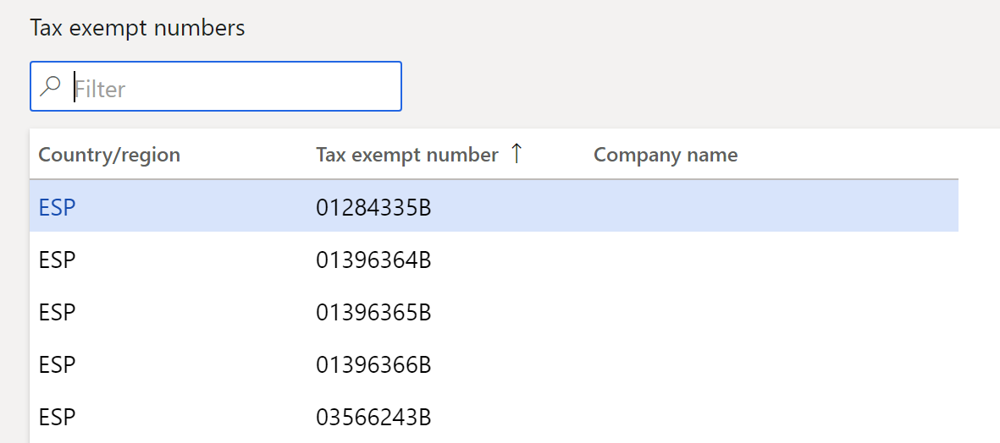
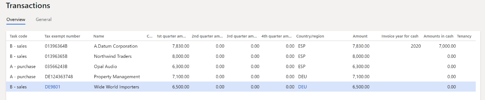
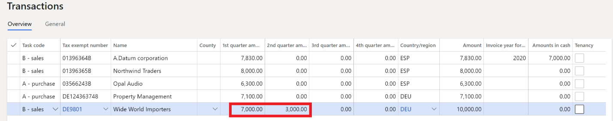
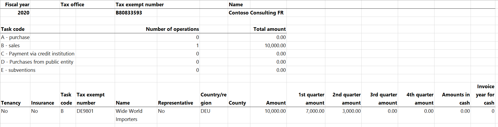

# Declaration 347 report
[!include [banner](../includes/banner.md)]

The Declaration 347 report must be electronically submitted to the tax authorities every year, during the first 20 days of March. It must include all the information from the previous fiscal year (January through December). All transactions over 3,000 euros must be included. Additionally, cash payment amounts that exceed 6,000 euros in a year must be included. Amounts are split per quarter over the year.

You can use the **Declaration 347** page to generate the Declaration 347 report. All invoices are grouped either by tax exempt number and customer/vendor number, or only by tax exempt number. The resulting aggregated line is included on the **Declaration 347** page if the total amount of invoices on the line exceeds the value of the **Minimum amount** field that is set in the **Declaration 347** dialog box. If some invoices are paid in cash, and the total amount of cash payments for invoices on the line exceeds the value of the **Minimum amount of payments in cash** field in the **Declaration 347** dialog box, this amount will be shown in the **Amounts in cash** field of the declaration.

## Prerequisites

The following prerequisites must be set up before you begin to work with the Declaration 347 report.

### Set up a legal entity

1.  Go to **Organization administration** \> **Organizations** \> **Legal entities**, and select your legal entity.
2.  On the **Addresses** FastTab, create an address.
3.  In the **Country/region** field, select **Spain**, and mark the address as **Primary**.
4.  Fill in the remaining address components.
5.  On the **Tax registration** FastTab, in the **Tax registration number** field, specify the tax registration number for your company.

### Set up contact information

1.  Go to **Organization administration** \> **Organizations** \> **Legal entities**.
2.  On the **Contact information** tab, add lines for **Phone** and **Email**, and set them to **Primary**.

### Set up tax exempt numbers

1.  Go to **Tax** \> **Setup** \> **Sales tax** \> **Tax exempt numbers**.
2.  For each tax exempt number, create a record on the page, and specify the following information:

    -   **Country/region:** Select the country or region of the tax registration of the counterparty.
    -   **Tax exempt number:** Enter the tax exempt number of the counterparty.
    -   **Company name:** (Optional) Enter the name of the counterparty.

## Setup

1.  In [Microsoft Dynamics Lifecycle Services (LCS)](https://lcs.dynamics.com/V2), in the Shared asset library, download the latest versions of the Electronic reporting (ER) configurations for the following VAT declaration formats:

    -   Declaration 347 export format (ES)
    -   Declaration 347 report format (ES)

For more information, see [Download Electronic reporting configurations from Lifecycle Services](../../fin-ops-core/dev-itpro/analytics/download-electronic-reporting-configuration-lcs.md).

2.  Go to **Tax** \> **Setup** \> **Sales tax** \> **Cash ledger accounts**.
3.  On the **Cash ledger accounts** page, specify the cash ledger accounts that are required for the Declaration 347.
4.  Go to **Tax \> Setup \> Sales tax \> 347 validation lists**.
5.  On the **Validation list** page, specify any sales tax groups that should be excluded from the Declaration 347.

## Generate the Declaration 347 report

1.  Go to **Tax \> Declarations \> Sales tax \> Declaration 347**.
2.  On the **Declaration 347** page, select **Generate**.
3.  In the **Declaration 347** dialog box, set the following fields.

| **Field**                          | **Description**                                                                                                               |
|------------------------------------|-------------------------------------------------------------------------------------------------------------------------------|
| Fiscal year                        | Enter the fiscal year to generate the Declaration 347 for.                                                                    |
| Surname + first name               | Enter the surname and name of the company representative for the Declaration 347.                                             |
| Minimum amount                     | Enter the minimum amount to report on the declaration.                                                                        |
| Minimum amount of payments in cash | Enter the minimum cash payment amount to report on the declaration.                                                           |
| Document number of the declaration | Enter the unique 13-character document identification code of the declaration.                                                |
| Replacement declaration            | Set this option to **Yes** to indicate that the declaration is being generated as a replacement for the original declaration. |
| Previous declaration number        | If you set the **Replacement declaration** option to **Yes**, enter the document number of the original declaration.          |
| Group only by tax exempt number    | Set this option to **Yes** to group all customer and vendor transactions by tax exempt number only.                           |

4.  Select **OK** to generate the data on the **Declaration 347** page.
5.  Review the information on the declaration.

The **General** tab has the following fields.

| Field                                | Description                                                                                                                                                                                                                                                                                                       |
|--------------------------------------|-------------------------------------------------------------------------------------------------------------------------------------------------------------------------------------------------------------------------------------------------------------------------------------------------------------------|
| Fiscal   year                        | The fiscal year for the   Declaration 347.                                                                                                                                                                                                                                                                        |
| Replacement                          | A selected check box indicates   that the declaration is a replacement declaration. This check box is   equivalent to the **Replacement declaration** option in the **Declaration   347** dialog box.                                                                                                          |
| Tax   exempt number                  | The tax exempt number of the   company that the Declaration 347 is generated for.                                                                                                                                                                                                                                 |
| Name                                 | The name of the company that the   Declaration 347 is generated for.                                                                                                                                                                                                                                              |
| Reported                             | Select this check box to   indicate that the Declaration 347 reporting is finished and has been sent to   the Spanish tax authorities.  When the **Reported** check box is   selected, the declaration lines can't be edited.                                                                                  |
| Minimum   amount                     | The minimum amount, in the   company's accounting currency, that was required to generate the Declaration   347. By default, all transactions that exceed 500,000 euros are included on   the declaration. This amount is filled in for the **Minimum amount**   field of the **Declaration 347** dialog box.  |
| Minimum   amount of payments in cash | The minimum amount of cash   payments required to report the cash payment amount.   This amount   is filled in from the **Minimum amount of payments in cash** field of the   **Declaration 347** dialog box.                                                                                                  |
| Presentation   type                  | Select the media type that is   used to declare the Declaration 347: - Telematic -   CD-R - Report  The default value is **Telematic**.                                                                                                                                                               |
| Presentation   date                  | The date when the report is   generated.                                                                                                                                                                                                                                                                          |
| Reported   by                        | The identifier (ID) of the user   who generated the report.                                                                                                                                                                                                                                                       |
| Telephone                            | The telephone number of the   contact person. This value is transferred from the setting that you defined   in the **Prerequisites** section earlier in this article.                                                                                                                                               |
| Contact                              | Enter the name of the contact   person.                                                                                                                                                                                                                                                                           |
| Document   number of the declaration | The document number of the   Declaration 347. This number is filled in from the **Document number of the   declaration** field of the **Declaration 347** dialog box.                                                                                                                                             |
| Previous   declaration number        | The document number of the   original Declaration 347. This number is filled in from the **Previous   declaration number** field of the **Declaration 347** dialog box.                                                                                                                                           |

The **Totals** tab shows the number of operations and the total amounts of purchases and sales.

6.  Select **Transactions** to review and modify the information for the aggregated customer transactions and vendor transactions before you generate the report as an ASCII file.

7.  On the **Transactions** page, on the **General** tab, review the following fields.

| Field                                       | Description                                                                                                                                                                                                                                                                                                                                                                                                                                                                                                                                                                                                                                                                  |
|---------------------------------------------|------------------------------------------------------------------------------------------------------------------------------------------------------------------------------------------------------------------------------------------------------------------------------------------------------------------------------------------------------------------------------------------------------------------------------------------------------------------------------------------------------------------------------------------------------------------------------------------------------------------------------------------------------------------------------|
| Task   code                                 | The task code that describes the   origin of the transaction: - **A - Purchase**: This task code is   automatically defined for purchase transactions. - **B - Sales**:   This task code is automatically defined for sales transactions. -   **C - Payment via credit institution**: Select this value if the transaction   is a payment that was made through a credit institution. - **D -   Purchases from public entity**: Select this value if the transaction is a   purchase from a public entity. - **E - Subventions**: Select this   value if the transaction is a subvention that is received from public   administrations or private companies. |
| Tax   exempt number                         | The tax exempt number of the   customer or vendor.                                                                                                                                                                                                                                                                                                                                                                                                                                                                                                                                                                                                                           |
| Name                                        | The name of the customer or   vendor.                                                                                                                                                                                                                                                                                                                                                                                                                                                                                                                                                                                                                                        |
| County                                      | The county of the customer or   vendor.                                                                                                                                                                                                                                                                                                                                                                                                                                                                                                                                                                                                                                      |
| Country/region                              | The International Organization   for Standardization (ISO) code for the customer's or vendor's country or   region.                                                                                                                                                                                                                                                                                                                                                                                                                                                                                                                                                          |
| 1st   quarter amount                        | The total amount of aggregated   transactions that were posted in the first quarter of the year.                                                                                                                                                                                                                                                                                                                                                                                                                                                                                                                                                                             |
| 2nd   quarter amount                        | The total amount of aggregated   transactions that were posted in the second quarter of the year.                                                                                                                                                                                                                                                                                                                                                                                                                                                                                                                                                                            |
| 3rd   quarter amount                        | The total amount of aggregated   transactions that were posted in the third quarter of the year.                                                                                                                                                                                                                                                                                                                                                                                                                                                                                                                                                                             |
| 4th   quarter amount                        | The total amount of aggregated   transactions that were posted in the fourth quarter of the year.                                                                                                                                                                                                                                                                                                                                                                                                                                                                                                                                                                            |
| Amount                                      | The total amount of the   aggregated transactions in the accounting currency.                                                                                                                                                                                                                                                                                                                                                                                                                                                                                                                                                                                                |
| Amount   settled                            | The amount in the accounting   currency.                                                                                                                                                                                                                                                                                                                                                                                                                                                                                                                                                                                                                                     |
| Amounts   in cash                           | The amount of payments in cash   for the transaction. This value is filled in only for customer transactions.                                                                                                                                                                                                                                                                                                                                                                                                                                                                                                                                                                |
| Invoice   year of cash                      | The year of the invoice that is   associated with cash payments on the transaction line. This field is set if   the **Amounts is cash** field is set.                                                                                                                                                                                                                                                                                                                                                                                                                                                                                                                        |
| Tenancy                                     | Select this check box to   indicate that the transaction is a tenancy process.                                                                                                                                                                                                                                                                                                                                                                                                                                                                                                                                                                                               |
| Representative                              | Select this check box to   indicate that the tax exempt number is attached to a legal representative of   the customer or vendor.                                                                                                                                                                                                                                                                                                                                                                                                                                                                                                                                            |
| Insurance   process                         | Select this check box to   indicate that the transaction is an insurance process.                                                                                                                                                                                                                                                                                                                                                                                                                                                                                                                                                                                            |
| Special   regime for cash accounting method | Select this check box to   indicate that the **Special regime for cash accounting** method is set up for   this period.                                                                                                                                                                                                                                                                                                                                                                                                                                                                                                                                                      |
| Deposit                                     | Select this check box to   indicate that the transaction is a deposit.                                                                                                                                                                                                                                                                                                                                                                                                                                                                                                                                                                                                       |
| Reverse   charge                            | Select this check box to   indicate that the reverse charge is used for this transaction.                                                                                                                                                                                                                                                                                                                                                                                                                                                                                                                                                                                    |

8.  If you selected the **Tenancy** check box on the **General** tab, select **Declaration 347 tenants** to add information about tenants.

9.  On the **Declaration 347 tenants** page, on the **Overview** tab, set the **Name**, **Amount**, **Reference of estate**, **County**, **Country/region**, **City**, and **Street** fields.
10.  On the **General** tab, set the **ZIP/postal code**, **Address abbreviation**, **Street No.**, **Entrance**, **Floor**, **Door**, and **Location code** fields for the building or property.
11.  Close the **Declaration 347 tenants** page and the **Transactions** page.
12.  On the **Declaration 347** page, select **Output \> Export to ASCII file**.
13.  In the **Export to ASCII file** dialog box, in the **Format mapping** field, select the **Declaration 347 export format (ES)** format that you downloaded earlier.
14.  In the **File name** field, enter the file name, and then select **OK**.
15.  Select **Output \> Print**.
16.  In the **Declaration 347** dialog box, in the **Format mapping** field, select the **Declaration 347 report format (ES)** format that you downloaded earlier.
17.  In the **File name** field, enter the file name, and then select **OK**. You can review the format of the report in the example later in this article.

## Generate the delta report

You can create a new Declaration 347 for the same period and use the delta report to view lines that differ from the lines of the original Declaration 347.

1.  Go to **Tax** \> **Declarations** \> **Sales tax** \> **Declaration 347**, and select **Generate** to generate the report that has corrections.
2.  In the **Declaration 347** dialog box, set the **Replacement declaration** option to **Yes** to identify this declaration as a correction of the original declaration.
3.  In the **Previous declaration number** field, enter the declaration number of the original declaration, and then select **OK**.
4.  Select **Output \> Delta report**.
5.  In the **Delta report** dialog box, in the **Format mapping** field, select the **Declaration 347 report format (ES)** format that you downloaded earlier.
6.  In the **File name** field, enter the file name, and then select **OK**. You can review the format of the report in the example later in this article.

## Example

Consider an example in the **DEMF** legal entity.

### Setup

1.  Go to **Organization administration** \> **Setup** \> **Organization** \> **Legal entities**.
2.  On the **Tax registration** FastTab, in the **Tax registration number** field, enter **B80833593**.
3.  Go to **Tax** \> **Setup** \> **Sales tax** \> **Cash ledger accounts**, and select **New** to create a line.
    

4.  Go to **Tax** \> **Setup** \> **Sales tax** \> **Tax exempt number** and select **New** to create a line.

### Customer transactions

1.  Go to **Accounts receivable** \> **Customers** \> **All customers**, and select customer **DE-010**.
2.  On the **Address** FastTab, set **ESP** as the country/region, and then, on the **Invoice and Delivery** FastTab, set the **Tax exempt number** field to **01396364B**.
3.  Select **Save**, and close page.
4.  Select customer **DE-011**.
5.  On the **Address** FastTab, set **ESP** as the country/region, and then, on the **Invoice and Delivery** FastTab, set the **Tax exempt number** field to **01396365B**.
6.  Select **Save**, and close page.
7.  Select customer **DE-012**.
8.  On the **Address** FastTab, set **ESP** as the country/region, and then, on the **Invoice and Delivery** FastTab, set the **Tax exempt number** field to **01396366B**.
9.  Select **Save**, and close page.
10. Select customer **DE-014**.
11. On the **Address** FastTab, verify that **DEU** is set as the country/region, and then, on the **Invoice and Delivery** FastTab, verify that the **Tax exempt number** field is set to **DE9801**.
12. Go to **Accounts receivable** \> **Invoices** \> **All free text invoices**, create the following four invoices, and then post them.

| **Invoice** | **Customer** | **Date**          | **Delivery address** | **Amount** |
|-------------|--------------|-------------------|----------------------|------------|
| FTI-000007  | DE-012       | February 1, 2020  | ESP                  | 4,000.00   |
| FTI-000008  | DE-010       | February 3, 2020  | ESP                  | 7,000.00   |
| FTI-000009  | DE-011       | February 5, 2020  | ESP                  | 8,000.00   |
| FTI-000010  | DE-014       | February 10, 2020 | DEU                  | 6,500.00   |

13. Go to **Accounts receivable** \> **Payments** \> **Customer payment journal**, create the following five payments, and then post them.

| **Date**          | **Account (tax exempt number)** | **Settled invoice** | **Credit** | **Offset account type** | **Offset account** |
|-------------------|---------------------------------|---------------------|------------|-------------------------|--------------------|
| February 20, 2020 | DE-012 (01396366B)              | FTI-000007          | 4,000      | Ledger                  | 110180             |
| February 25, 2020 | DE-010 (01396364B)              | FTI-000008          | 7,000      | Ledger                  | 110180             |
| February 27, 2020 | DE-011 (01396365B)              | FTI-000009          | 5,000      | Ledger                  | 110180             |
| March 1, 2020     | DE-011 (01396365B)              | FTI-000009          | 3,000      | Bank                    | DEMF OPER          |
| March 3, 2020     | DE-014 (DE9801)                 | FTI-000010          | 6,500      | Bank                    | DEMF OPER          |

### Vendor transactions

1.  Go to **Accounts payable** \> **Vendors** \> **All vendors**, and select vendor **DE-001**.
2.  On the **Address** FastTab, set **ESP** as the country/region, and then, on the **Invoice and Delivery** FastTab, set the **Tax exempt number** field to **03566243B**.
3.  Select **Save**, and close page.
4.  Select vendor **DE-01001**.
5.  On the **Address** FastTab, verify that **DEU** is set as the country/region, and then, on the **Invoice and Delivery** FastTab, set the **Tax exempt number** field to **DE124363748**.
6.  Go to **Accounts payable** \> **Invoices** \> **Invoice journal**, create the following two invoices, and then post them.

| **Invoice** | **Vendor** | **Date**         | **Vendor address** | **Amount** |
|-------------|------------|------------------|--------------------|------------|
| 1           | DE-001     | February 4, 2020 | ESP                | 6,300      |
| 2           | DE-01001   | February 7, 2020 | DEU                | 7,100      |

7.  Go to **Accounts payable** \> **Payments** \> **Vendor payment journal**, create the following two payments, and then post them.

| **Date**          | **Account** | **Invoice** | **Credit** | **Offset account type** | **Offset account** |
|-------------------|-------------|-------------|------------|-------------------------|--------------------|
| February 10, 2020 | DE-001      | 1           | 6,300      | Ledger                  | 110180             |
| February 15, 2020 | DE-01001    | 2           | 7,100      | Bank                    | DEMF OPER          |

### Generate Declaration 347 and Delta report

1.  Go to **Tax** \> **Declarations** \> **Sales tax** \> **Declaration 347**, select **Generate**, and fill the following fields with the following values:

    -   **Fiscal year** – 2020
    -   **Minimum amount** – 6000
    -   **Minimum amount of payments in cash** - 6000

2.  Select **OK**.
3.  Select the declaration line that was created, select **Transactions**, and review the data.

Notice the following details:

-   The line for customer **DE-012** wasn't transferred to the declaration because both amounts were less than 6,000.
-   On the line for customer **DE-011** (tax exempt number **01396365B**), because the payment amount in cash is less than 6,000 it was reset to 0 (zero).
-   On the line for vendor **DE-001** (tax exempt number **03566243B**), even though the payment was in cash, the cash payment amount is 0 (zero) because the **Amounts in cash** field is filled in only for customers.

4.  Close the **Transactions** page, and then, on the **Declaration 347** page, select **Generate** to generate the report that has corrections.
5.  Set the **Replacement declaration** option to **Yes** to identify this declaration as a correction of the original declaration.
6.  In the **Previous declaration number** field, enter the declaration number of the original declaration, and then select **OK**.
7.  Select the declaration line that is created, select **Transactions**, and edit the line for customer with tax exempt number **DE9801** in the following way:

-   The value in **1st quarter amount** column becomes 7000 instead of 6500
-   The value in **2nd quarter amount** column becomes 3000 instead of 0.

8.  Close the **Transactions** page.
9.  Select **Output \> Delta report**.
10.  In the **Format mapping** field, select **Declaration 347 report format (ES)**.
11.  In the **File name** field, enter the file name, and then select **OK**.
12.  Open downloaded file and review the data.

Notice that only the line that has corrections is printed on the report.

[!INCLUDE[footer-include](../../includes/footer-banner.md)]
