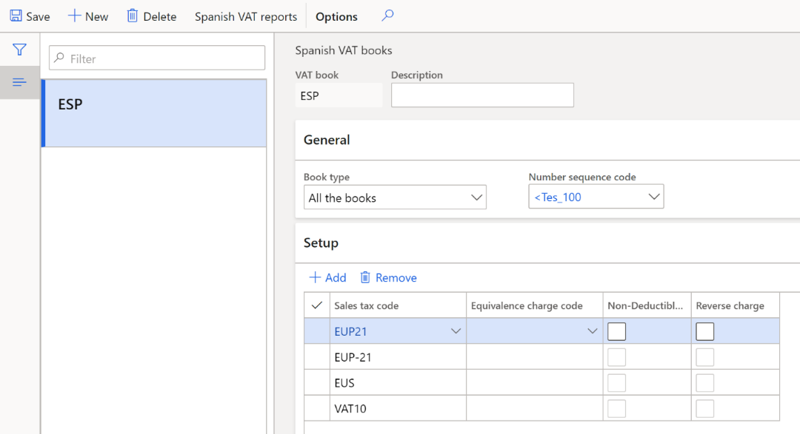
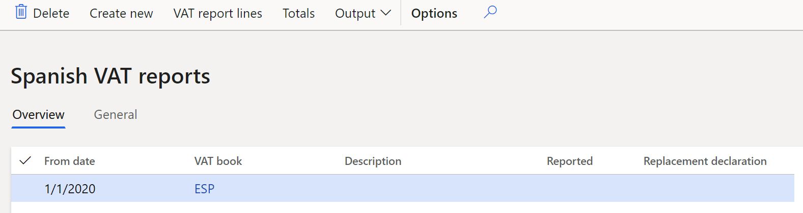
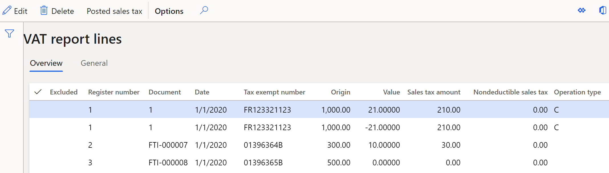
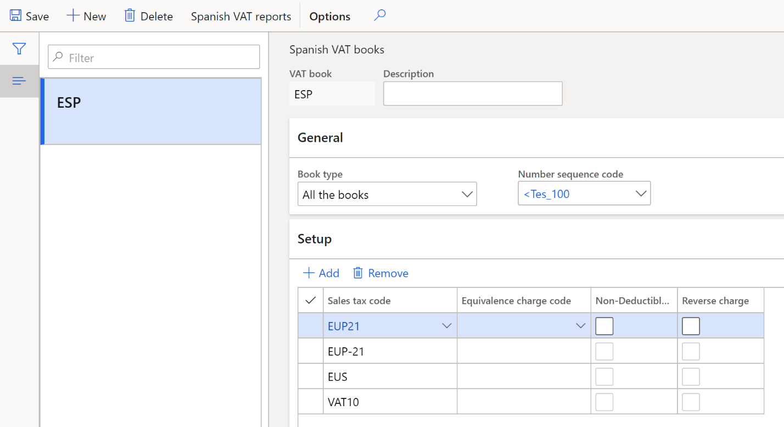
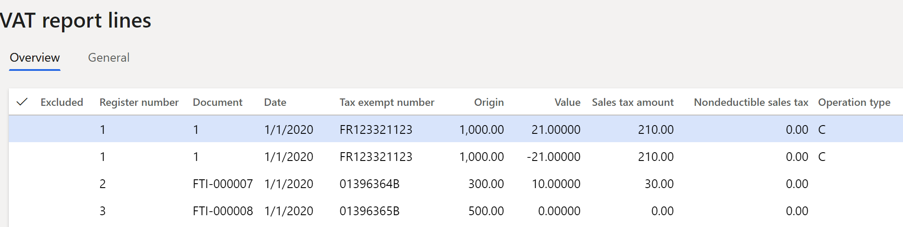
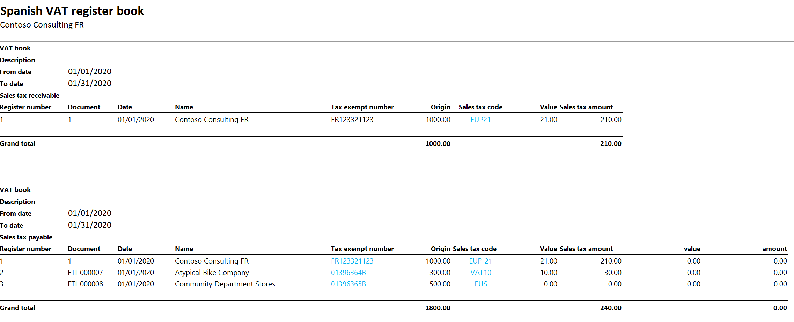

---
# required metadata

title: Report 340 for Spain
description: This topic provides information about how to set up and generate Report 340 for Spain.
author: ShylaThompson
manager: AnnBe
ms.date: 02/08/2018
ms.topic: article
ms.prod: 
ms.service: dynamics-ax-applications
ms.technology: 

# optional metadata

ms.search.form: ERWorkspace
audience: Application User
# ms.devlang: 
ms.reviewer: kfend
ms.search.scope: Core, Operations
# ms.tgt_pltfrm: 
# ms.custom: 
ms.search.region: Spain
# ms.search.industry: 
ms.author: epodkolz
ms.search.validFrom: 2016-11-30
ms.dyn365.ops.version: Version 1611

---

# Report 340 for Spain

[!include [banner](../includes/banner.md)]

Report 340 contains information about all invoices and taxes that are related to
the invoices that a company has issued or received during a specific period.
Report 340 should be submitted to the tax authorities during the first 20 days
after the reporting period. The reporting period can be a month or a quarter,
depending on the size of the company. The report can be uploaded to the tax
authorities' website, or it can be submitted by using a free software package
that is available from the tax authorities.

The file format for Report 340 consists of two record types that are based on
the file structure.

-   **Type 1** – This record type contains header information about the legal
    entity that generates the report.

-   **Type 2** – This record type contains information about the items and
    services that are purchased and sold by a legal entity during a specified
    period.

## Entries that are included in Report 340

Report 340 includes the following entries:

-   **Sales entries** – Value-added tax (VAT) report lines that correspond to
    sales invoices and project invoices.

-   **Sales credit memos (corrective invoices)** – VAT report lines that
    correspond to corrective sales invoices.

-   **Purchase entries** – VAT report lines that correspond to purchase
    invoices.

-   **Purchase credit memos** – VAT report lines that correspond to corrective
    purchase invoices.

-   **Auto-invoices and auto-credit memos** – VAT report lines that correspond
    to invoices and credit memos that are automatically created when goods or
    services are delivered by a vendor in the European Union (EU).

-   **Invoices that include equivalence charge** – Equivalence charge is a type
    of Spanish sales tax.

-   **Invoices including different VAT% or equivalence charge percentage (EC%)**
    – Invoices that have more than one VAT percentage or equivalence charge
    percentage.
    
## Generate a Spanish VAT book and export the Report 340 ASCII file

1.  In [Microsoft Dynamics Lifecycle Services (LCS)](https://lcs.dynamics.com/V2), in the Shared asset library,
    download the latest version of the Electronic reporting (ER) configurations
    for the following VAT declaration format:

-   VAT register book (ES)

For more information, see [Download Electronic reporting configurations from Lifecycle Services](https://docs.microsoft.com/dynamics365/dev-itpro/analytics/download-electronic-reporting-configuration-lcs).

2.  Go to **Tax \> Setup \> Sales tax \> Spanish VAT books**.

3.  In the **VAT book** and **Description** fields, enter a name and description
    for the VAT book.

4.  In **Book type** field select a book type: **Sales tax payable**, **Sales
    tax receivable**, or **All the books**.

5.  In the **Number sequence code** field, select a number sequence code.

6.  On the **Setup** FastTab, select **Add**, and then set the following fields
    to set up the sales tax codes that should be included in the VAT book.

| **Field**               | **Description**                                                                                                                                                                                                                                                                                                                          |
|-------------------------|------------------------------------------------------------------------------------------------------------------------------------------------------------------------------------------------------------------------------------------------------------------------------------------------------------------------------------------|
| Sales tax code          | Select a sales tax code.                                                                                                                                                                                                                                                                                                                 |
| Equivalence charge code | Select a sales tax code for equivalence charge, if equivalence charge is applicable.                                                                                                                                                                                                                                                     |
| Non-Deductible VAT      | Select the check box to activate non-deductible VAT for the sales tax code. If the VAT amount is non-deductible, purchasers aren't allowed to deduct it.                                                                                                                                                                                 |
| Reverse Charge          | Select the check box to activate reverse charges for the sales tax code. Reverse charges are part of the VAT law. In some cases, goods or services are purchased from a foreign company. When reverse charges are activated, the VAT on these goods and services is payable by the recipient company, not by the foreign seller company. |

7.  Select **Spanish VAT reports** to open the **Spanish VAT reports** page.

8.  Select **Create new** to create a report.

9.  In the **Spanish VAT list** dialog box, set the following fields.

<table>
<tbody>
<tr>
<td width="226">

<strong>Field</strong>

</td>
<td width="359">

<strong>Description</strong>

</td>
</tr>
<tr>
<td width="226">

VAT book

</td>
<td width="359">

Select a VAT book.

</td>
</tr>
<tr>
<td width="226">

Description

</td>
<td width="359">

Enter a description of the VAT book.

</td>
</tr>
<tr>
<td width="226">

Settlement period

</td>
<td width="359">

Select a settlement period.

</td>
</tr>
<tr>
<td width="226">

From date

</td>
<td width="359">

Enter the first date of the sales tax settlement period

</td>
</tr>
<tr>
<td width="226">

Method of numbering

</td>
<td width="359">

Select a numbering method:

&middot;&nbsp;&nbsp;&nbsp;&nbsp;&nbsp;&nbsp; <strong>Document number</strong> &ndash; The number of the VAT report line equals the invoice number.

&middot;&nbsp;&nbsp;&nbsp;&nbsp;&nbsp;&nbsp; <strong>Number sequence code</strong> &ndash; The number of the VAT report line is taken from the number sequence that is defined in the <strong>Number sequence code</strong> field on the <strong>Spanish</strong> <strong>VAT books</strong> page.

&middot;&nbsp;&nbsp;&nbsp;&nbsp;&nbsp;&nbsp; <strong>Manual</strong> &ndash; The numbering for VAT report lines is defined in the <strong>Manual numbering</strong> section of the dialog box.

&middot;&nbsp;&nbsp;&nbsp;&nbsp;&nbsp;&nbsp; <strong>340 sequence</strong> &ndash; VAT report lines are numbered separately for purchases and sales. In both cases, the line numbers start from 1.

</td>
</tr>
<tr>
<td width="226">

Start numbering  (in the <strong>Manual numbering</strong> section)

</td>
<td width="359">

Enter the first line number.

</td>
</tr>
<tr>
<td width="226">

Template  (in the <strong>Manual numbering</strong> section)

</td>
<td width="359">

Enter the template for the line number. For example, enter <strong>#####</strong>.

</td>
</tr>
<tr>
<td width="226">

Replacement declaration

</td>
<td width="359">

Set this option to <strong>Yes</strong> to replace the previous declaration.

</td>
</tr>
<tr>
<td width="226">

Previous declaration number

</td>
<td width="359">

Enter the 13-digit number of the previous declaration. This field can be edited only if the <strong>Replacement declaration</strong> option is set to <strong>Yes</strong>.

</td>
</tr>
<tr>
<td width="226">

Minimum payment account in cash

</td>
<td width="359">

Enter the minimum cash payment amount that should be reported in the declaration.

</td>
</tr>
</tbody>
</table>

10.  Select **OK** to create a line on the **Spanish VAT reports** page, based on
    the criteria that you defined in the previous step.

11.  Review the line that is created.

Note: You can't change the values in the **Settlement period**, **Method of numbering**, and **From date** fields on the **Spanish VAT reports** page.

12.  On the **General** tab, set the following fields.

<table>
<tbody>
<tr>
<td width="151">

<strong>Field</strong>

</td>
<td width="434">

<strong>Description</strong>

</td>
</tr>
<tr>
<td width="151">

Presentation type

</td>
<td width="434">

Select the type of media to use for the exported file:

&middot;&nbsp;&nbsp;&nbsp;&nbsp;&nbsp;&nbsp; <strong>Telematic</strong> &ndash; Upload the report to the tax authorities' website, or submit the report by using the free software that is provided by the tax authorities.

&middot;&nbsp;&nbsp;&nbsp;&nbsp;&nbsp;&nbsp; <strong>CD-R</strong> &ndash; Send the report to the tax authorities on a CD-ROM.

</td>
</tr>
<tr>
<td width="151">

Reported

</td>
<td width="434">

Set this option to <strong>Yes</strong> to indicate that the declaration has been reported. The <strong>Presentation date</strong> field will be set to the current date, and the <strong>Reported by</strong> field will be set to the user's ID.

</td>
</tr>
<tr>
<td width="151">

Contact person

</td>
<td width="434">

Enter the name of the contact person.

</td>
</tr>
<tr>
<td width="151">

Telephone

</td>
<td width="434">

Enter the telephone number of the contact person.

</td>
</tr>
<tr>
<td width="151">

Document number of the declaration

</td>
<td width="434">

Enter the four-digit document number.

If you enter a number that has fewer than four digits, leading zeros will be added to create a four-digit number. For example, if you enter <strong>1</strong>, the system automatically converts the value to <strong>0001</strong> and stores the new value.

</td>
</tr>
<tr>
<td width="151">

Electronic code

</td>
<td width="434">

Enter the 16-digit electronic code. This number is mandatory and is provided by the tax authorities.

</td>
</tr>
</tbody>
</table>

13.  Select **VAT report lines** to open the **VAT report lines** page. On this
    page, you can view the details of the VAT transactions that are transferred
    to the VAT report. If any of the lines that are automatically transferred
    don't have to be reported, you can edit or delete them.

14.  Select **Posted sales tax** to open **Posted sales tax** page. On this page,
    you can review the posted sales tax transactions.

15.  Close the **Posted sales tax** and **VAT report lines** pages.

16.  On the **Spanish VAT reports** page, select **Totals** to open the
    **Totals** page. On this page, you can view the following values:

- **Number of operations** – The total number of sales (or VAT payable) in the **Deliveries** section and the total number of purchases (or VAT receivable) in the **Acquisitions** section.

- **Amount** – The total amount of sales (or VAT payable) in the **Deliveries** section and the total number of purchases (or VAT receivable) in the **Acquisitions** section.

17.  Select **Output \> Export to ASCII file** to open the **Export to ASCII
    file** dialog box.

18.  In the **File name** field, enter a name for the file, and then select
    **OK**.

19.  Select **Output \> Print** to open **Spanish VAT register book** dialog box.

20.  In the **Format mapping** field, select the **VAT register book (ES)**
    format that you downloaded earlier, and then select **OK**.

## Example

1.  Go to **Tax \> Indirect taxes \> Sales tax \> Sales tax codes**, and create
    the following codes.

| **Sales tax code** | **Percentage** | **Description**                                                                                                                |
|--------------------|----------------|--------------------------------------------------------------------------------------------------------------------------------|
| VAT21              | 21             | Domestic sales at a rate of 21 percent.                                                                                        |
| VAT10              | 10             | Domestic sales at a rate of 10 percent.                                                                                        |
| VAT4               | 4              | Domestic sales at a rate of 4 percent.                                                                                         |
| EUP21              | 21             | EU purchases at a rate of 21 percent.                                                                                          |
| EUP-21             | \-21           | EU purchases at a rate of 21 percent, where the **Intra-community** option on the **Sales tax groups** page is set to **Yes**. |
| EUP10              | 10             | EU purchases at a rate of 10 percent.                                                                                          |
| EUP-10             | \-10           | EU purchases at a rate of 10 percent, where the **Intra-community** option on the **Sales tax groups** page is set to **Yes**. |
| EUP4               | 4              | EU purchases at a rate of 4 percent.                                                                                           |
| EUP-4              | \-4            | EU purchases at a rate of 4 percent, where the **Intra-community** option on the **Sales tax groups** page is set to **Yes**.  |
| EUS                | 0              | EU sales where the **Exempt** option is set to **Yes**.                                                                        |

> [!NOTE]
> For codes that have a negative tax percentage, the **Allow negative sales tax
percentage** option on the **Calculation** FastTab must be set to **Yes**.

2.  Set up sales tax. For instructions, see [Sales tax
    overview](https://github.com/MicrosoftDocs/Dynamics-365-Operations/blob/master/articles/finance/general-ledger/indirect-taxes-overview.md).

3.  Set up intra-community VAT for EU purchases. For instructions, see
    [Intra-community VAT for
    Spain](https://github.com/MicrosoftDocs/Dynamics-365-Operations/blob/master/articles/finance/localizations/emea-esp-intra-community-vat.md).

4.  Post the following transactions.

    For example, for customer invoices, go to **Accounts receivable \> Invoices \> All free text invoices**. For vendor invoices, go to **Accounts payable \> Invoices \> Invoice journal**.

| **Date**        | **Invoice** | **Tax exempt number** | **Transaction type** | **Amount net** | **VAT amount** | **Sales tax code** |
|-----------------|-------------|-----------------------|----------------------|----------------|----------------|--------------------|
| January 1, 2020 | FTI-000007  | 01396364B             | Customer invoice     | 500            | 0              | EUS                |
| January 1, 2020 | FTI-000008  | 01396365B             | Customer invoice     | 300            | 30             | VAT10              |
| January 1, 2020 | 1           | FR123321123           | Vendor invoice       | 1000           | 210            | EUP21 EUP-21       |

5.  Go to **Tax \> Setup \> Sales tax \> Spanish VAT books**.

6.  Select **New** to create a Spanish VAT book.

7.  On the **Setup** FastTab, add the following sales tax codes:

-   EUP21

-   EUP-21

-   EUS

-   VAT 10

8.  Select **Spanish VAT reports**.

9.  Select **Create new**.

10.  In the **Spanish VAT list** dialog box, set the following fields, and then
    select **OK**:

-   **VAT book:** ESP

-   **Settlement period:** Men

-   **From date:** 1/1/2020

11.  Select **VAT report lines**, and review the generated data.

12.  Select **Output \> Print**.

13.  In **Format mapping** field, select the **VAT register book (ES)** format
    that you downloaded earlier.

14.  Select **OK**, open the downloaded file, and review the data.

