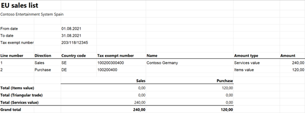
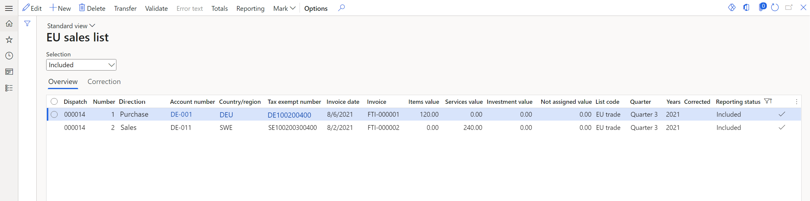

# EU sales list for Spain (Report 349)

[!include [banner](../includes/banner.md)]

This article provides information about the European Union (EU) sales list report for Spain, also known as Report 349. The Spanish EU sales list report contains information about sale and purchase of goods and services for reporting in text format.

The following fields are included on the Spanish EU sales list report:

- **EU sales list header:**

  - Declaration model
  - Reporting period
  - Company name
  - Company VAT ID
  - Method of filing a declaration
  - Name and primary telephone number of a contact person
  - Declaration number
  - Corrective declaration type
  - Replaced declaration number
  - Number of transactions
  - Total amount of lines
  - Number of corrections
  - Total amount of corrections
  - Existence of changing in periodicity

- **EU sales list lines:**

  - Fiscal year
  - Company tax registration number
  - Customer or vendor VAT ID
  - Customer or vendor name	
  - Delivery code
  - The total amount of items
  - The total amount of services
  - Total amount of triangular trade
  - Corrected period
  - Correction amount

## Setup
For general setup information, see [EU sales list reporting](emea-eu-sales-list.md).

> [!NOTE]
> The company name and the value from the **Tax registration number** field on the **Tax registration** FastTab of the **Legal entities** page are used in the .xlsx file for the EU sales list report.

### Set up company information
Create a registration type, and assign it to the **VAT ID** registration category for Spain and every country or region that your company does business with. For more information, see [Registration IDs](emea-registration-ids.md).

1. In Microsoft Dynamics 365 Finance, go to **Organization administration** > **Organizations** > **Legal entities**.
2. In the grid, select your company.
3. On the Action Pane, select **Registration IDs**.
4. On the **Registration ID** FastTab, select **Add**.
5. On the **Overview** tab, in the **Registration type** field, select the registration type that you created.
6. Enter your company's value-added tax (VAT) ID.
7. Optional: On the **General** tab, in the **General** section, you can change the period that the VAT ID is used for.
8. Close the page.

> [!NOTE]
> The VAT ID that you created is used in the .txt file of the EU sales list report. If the **VAT exempt number export** field in the **Intrastat** section on the **Foreign trade and logistics** FastTab is set (that is, it isn't blank), the value of that field is used instead of the VAT ID.

### Import Electronic reporting configurations
In [Microsoft Dynamics Lifecycle Services (LCS)](https://lcs.dynamics.com/Logon/Index), import the latest versions of the following Electronic reporting (ER) configurations for the EU sales list:

  - EU Sales list model
  - EU Sales list by columns report
  - EU Sales list by rows report
  - EU Sales list (ES)

For more information, see [Download Electronic reporting configurations from Lifecycle Services](../../fin-ops-core/dev-itpro/analytics/download-electronic-reporting-configuration-lcs.md).

### Set up foreign trade parameters

1. In Finance, go to **Tax** > **Setup** > **Foreign trade** > **Foreign trade parameters**.
2. On the **EU sales list** tab, set the **Transfer purchases** option to **Yes**.
3. Set the **Report cash discount** option to **Yes** if a cash discount should be included in the value when a transaction is included in the EU sales list.
4. On the **Electronic reporting** FastTab, in the **File format mapping** field, select **EU Sales list (ES)**.
5. In the **Report format mapping** field, select **EU Sales list by rows report** or **EU Sales list by columns report**.
6. On the C**ountry/region properties** tab, select **New**, and specify the following information:

    •	In the **Country/region** column, select **ESP**.
    •	In the **Country/region type** column, select **Domestic**.

7. List all the countries or regions that your company does business with. For each country that is part of the EU, in the **Country/region type** field, select **EU** to show trade with those countries on the **EU sales list** page.

### Create a contact for the person who is responsible for the report

1. Go to **Sales and marketing** > **Relationships** > **Contacts** > **All contacts**.
2. On the Action Pane, select **New**.
3. In the **Create contact** dialog box, in the **Contact for** field, select your company. Then select **Select**.
4. On the **Details** FastTab, set the **First name**, **Middle name**, **Last name prefix**, and **Last name** fields.
5. On the **Contact information** FastTab, set the **Phone** field. The value of this field is set as **Primary**.
6. Select **Save**.

> [!NOTE]
> Values from the **First name** and **Last name** fields and primary telephone number of the contact will be shown in the .txt file for the EU sales list report.

## Work with the EU sales list
For general information about which types of transactions are included in the EU sales list, how to generate the EU sales list report, and how to close the EU sales list reporting period, see [EU sales list reporting](emea-eu-sales-list.md#working-with-the-esl).

Before you generate the EU sales list report, you can add the **Delivery code** column and select the delivery code for the sale of items: **E - Normal delivery**, **H - Delivery of goods from a tax-exempt importation by an official tax representative**, or **M - Delivery of goods from a tax-exempt importation**.

> [!NOTE]
> For services and triangular trade, the **Delivery code** field isn't available.

### Generate the EU sales list report

1. Go to **Tax** > **Declarations** > **Foreign trade** > **EU sales list**.
2. Transfer transactions.
3. On the Action Pane, select **Reporting**.
4. In the **EU sales list reporting** dialog box, on the **Parameters** FastTab, set the following fields.

    |  Field  |  Description  |
    |---------|---------------|
    | Reporting period | Select **Monthly**, **Quarterly**, or **Yearly**. |
    | From date   | Select the start date for the report.   |
    | Change in periodicity   | Set this option to **Yes** to show the period change on the report.  |
    | Generate file  | Set this option to **Yes** to generate a .txt file for your EU sales list report.   |
    | File name   | Enter the name of the .txt file.  |
    | Generate report | Set this option to **Yes** to generate an .xlsx file for your EU sales list report.   |
    | Report file name  | Enter the name of the .xlsx file.  |
    | Document number of the declaration    | Enter the number of the declaration. The value consists of **349** followed by the 10 digits of the number.  |
    | Contact ID   | Select a contact for the person who is responsible for the report.  |
    | Presentation type   |  Select **Telematic** or **DVD**. |  
   
5. Select **OK**, and review the generated reports.

### Create a corrective EU sales list report

1. Go to **Tax** > **Declarations** > **Foreign trade** > **EU sales list**.
2. Transfer transactions.
3. Select a corrective line, and then switch to the **Correction** view.
4. On the Action Pane, select **Edit**.
5. Set the **Services** or **Items** option to **Yes**, depending on the type of line you selected.
6. In the **Fiscal year** field, enter the corrected year.
7. In the **Correction period** field, select **Month**, **Quarter**, or **Year**.
8. In the **Correction month or quarter** field, enter the number that corresponds to the corrected month or quarter.
9. In the **Amount** field, enter the declared base amount that is being corrected by the selected line.
10. Switch to the **Overview** view.
11. In the **Items value** or **Services value** field, enter the corrected amount, which is calculated by using the following formula:

    *n = d – (+) o*

     Here is an explanation of the formula:

     - n is the corrected amount that you should manually enter in the **Items value** or **Services value** field.
     - d is the declared base amount from the **Amount** field in the **Correction** view.
     - o is the amount of the **Items value** or **Services value** field after transactions are transferred to the **EU sales list** page. (In other words, it's the amount of the corrective document.)

12.	On the Action Pane, select **Reporting**.
13.	In the **EU sales list reporting** dialog box, on the **Parameters** FastTab, set the following fields in addition to the general fields that are used to generate a report.

    | Field | Description |
    |-------|-------------|
    | Correction | Select **Complementary** or **Replacement** to create a corrected file. |
    | Corrected declaration | Enter the document number of the previous EU sales list declaration that is being corrected. |

## Example
For general information about how to set up and transfer transactions, see [Example for generic EU Sales list](emea-eu-sales-list-example.md).
Before you begin, create the company VAT ID **ESB12345678**, and set the company's tax registration number to **222444666**.

For information about how to set up purchases and create a vendor invoice, see [Set up purchase transfers](emea-eu-sales-list-example.md#set-up-purchase-transfers).

### Create a contact for the person who is responsible for the report

1. Go to **Sales and marketing** > **Relationships** > **Contacts** > **All contacts**.
2. On the Action Pane, select **New**.
3. In the **Create contact** dialog box, in the **Contact for** field, select **Contoso Entertainment System Spain**. Then select **Select**.
4. In the **First name** field, select **Aaren Ekelund**. Then select **Select**.
5. Select **Save**.
6. In the grid, select **Aaren Ekelund**.
7. On the **Contact information** FastTab, on the line where the **Type** field is set to **Phone**, enter **75 555-5153** in the **Contact number/address** field.

### Create an EU sales list report

1. Go to **Tax** > **Declarations** > **Foreign trade** > **EU sales list**.
2. Add the **Delivery code** column.
3. On the Action Pane, select **Reporting**.
4. In the **EU sales list reporting** dialog box, on the **Parameters** FastTab, set the following fields:

    - In the **Reporting period** field, select **Monthly**.
    - In the **From date** field, select **8/1/2021** (August 1, 2021).
    - Set the **Generate file** option to **Yes**.
    - In the **File name** field, enter **ES-001F**.
    - Set the **Generate report** option to **Yes**.
    - In the **Report file name** field, enter **ES-001R**.
    - In the **Document number of the declaration** field, enter **3490000000001**.
    - In the **Contact ID** field, select **Aaren Ekelund**.
    - In the **Presentation type** field, select **Telematic**.

5. Select **OK**, and review the report in text format that is generated. The following tables show the values in the example report.

   **EU sales list header**

   | Field name | Field value | Comment |
   |------------|-------------|---------|
   |  Record type    | 1      |  &nbsp; |
   | Declaration model  |  349  |  &nbsp;     |
   | Fiscal year  |  2021   |  &nbsp;     |
   | Company VAT number  | B12345678    |  The company's VAT ID without the country/region code.  |
   | Company name  | CONTOSO ENTERTAINMENT SYSTEM SPAIN  |  &nbsp;     |
   | Media type |  T   | If the **Presentation type** field is set to **Telematic**, this field is set to **T**. Otherwise, this field is set to **C**.   |
   | Contact phone  | 755555153  |  &nbsp;     |
   | Contact name  | EKELUND AAREN |  &nbsp;     |
   | Declaration number  |  3490000000001 |  &nbsp;  |
   | Complementary declaration | &nbsp;  | If the **Correction** field is set to **Complementary**, this field is set to **C**. Otherwise, this field is blank. |
   | Replacement declaration  | &nbsp; |  If the **Correction** field is set to **Replacement**, this field is set to **S**. Otherwise, this field is blank.  |
   | Replaced declaration number  | 000000000000 |  &nbsp; |
   | Reporting period  | 08  | If the **Reporting period** field is set to **Monthly**, this field is set to a value from **01** (January) through **12** (December).  If the **Reporting period** field is set to **Quarterly**, this field is set to a value from **1T** (the first quarter) through **4T** (the fourth quarter).   If the **Reporting period** field is set to **Yearly**, this field is set to **0A**.      |
   | Number of transactions |  000000002  | The number of rows for items, services, and triangular trade. The number of rows for corrections is excluded. |
   | Total amount of transactions  | 000000000000360  | The total amount of items, services, and triangular trade. The amount of corrections is excluded.  |
   | Number of corrections  |  000000000  |  &nbsp;  |
   | Total amount of corrected lines  | 000000000000000  |  &nbsp; |
   | Change in periodicity  |  &nbsp; | If the **Change in periodicity** option is set to **Yes**, this field is set to **X**. Otherwise, this field is blank. |

   **EU sales list lines**
   
   | Field name | Line 1 | Line 2 | Comment |
   |------------|--------|--------|---------|
   | Record type   |  2  |   2    | &nbsp;  |
   | Declaration model  |  349  |  349  | &nbsp;  |
   | Fiscal year  |  2021  | 2021  | &nbsp;  |
   | Company VAT number  | 222444666  | 222444666  | The company's tax registration number.  |
   | Country code  |  DE   |  SE  | The country/region code.  |
   | Customer/Vendor VAT number   | 100200400  | 100200300400  | The customer's or vendor's VAT ID without the country/region code.        |
   | Operation code      | A      |  S     |  For a triangular trade record, the value is **T**.   For a service record, the value is **S** for sales and **I** for purchases.   For an item record, the value is **A** for purchases.   For sales, the value depends on the delivery code: **E** for the **E - Normal delivery** delivery code, **H** for the **H - Delivery of goods from a tax-exempt importation by an official tax representative** delivery code, or **M** for the **M - Delivery of goods from a tax-exempt importation** delivery code.  |
   | Record amount  |  0000000000120  | 0000000000240  |  The sum of all invoices by customer or vendor.  |

6. Review the report in Excel format that is generated. 

   
   
### Create a corrective EU sales list report

1. Go to **Tax** > **Declarations** > **Foreign trade** > **EU sales list**.
2. Verify that there are one service line and one item line in the EU sales list page.

  
  
3. Select an item line, and then follow these steps:

    1. Switch to the **Correction** view.
    2. On the Action Pane, select **Edit**.
    3. In the **Fiscal year** field, enter **2021**.
    4. In the **Correction period** field, select **Month**.
    5. In the **Correction month or quarter** field, enter **7**.
    6. In the **Amount** field, enter **333** as the declared base amount.
    7. Switch to the **Overview** view.
    8. In the **Items value** field, enter **213** (= 333 – 120).

4. Select a service line, and then follow these steps:

    1. Switch to the **Correction** view.
    2. In the **Fiscal year** field, enter **2021**.
    3. In the **Correction period** field, select **Month**.
    4. In the **Correction month or quarter** field, enter **7**.
    5. In the **Amount** field, enter **411** as the declared base amount.
    6. Switch to the **Overview** view.
    7. In the **Services value** field, enter **171** (= 411 – 240).

5.	On the Action Pane, select **Save**.
6.	On the Action Pane, select **Reporting**.
7.	In the **EU sales list reporting** dialog box, on the **Parameters** FastTab, set the following fields:

    1. In the **Reporting period** field, select **Monthly**.
    2. In the **From date** field, select **8/1/2021** (August 1, 2021).
    3. Set the **Generate file** option to **Yes**.
    4. In the **File name** field, enter **ES-002c**.
    5. In the **Document number of the declaration** field, enter **3490000000002**.
    6. In the **Contact ID** field, select the contact that you created earlier.
    7. In the **Presentation type** field, select **Telematic**.

8.	In the **Correction** field, select **Complementary**.
9.	In the **Corrected declaration** field, enter **3490000000001**.
10.	Select **OK**, and review the correction report in text format that is generated. The following tables show the values in the example report.

    **EU sales list header**
    
    | Field name | Field value |
    |------------|-------------|
    | Record type |  1         |
    | Declaration model           |     349        |
    | Fiscal year          |   2021          |
    | Company VAT number            |  B12345678           |
    | Company name           |  CONTOSO ENTERTAINMENT SYSTEM SPAIN           |
    | Media type          |   T          |
    | Contact phone           |   755555153          |
    | Contact name           | EKELUND AAREN            |
    | Declaration number            | 3490000000002            |
    | Complementary declaration           |  C           |
    | Replaced declaration number           | 3490000000001            |
    | Reporting period           |   08          |
    | Number of transactions           | 000000000            |
    | Total amount of transactions           | 000000000000000            |
    | Number of corrections           | 000000002            |
    | Total amount of rectified base amounts           | 000000000000360            |
    
    **EU sales list lines**
    
    | Field name | Line 1 | Line 2 |
    |------------|--------|--------|
    | Record type  |  2   |  2     |
    | Declaration model   |  349   |  349  |
    | Fiscal year   |  2021  |  2021  |
    | Company VAT number   | 222444666  | 222444666   |
    | Country code    |   DE   |  SE   |
    | Customer/Vendor VAT number    |  100200400   | 100200300400  |
    | Operation code    |  A   |  S   |
    | Corrected period   |   2021 07  |  2021 07 |
    | Rectified base amount  | 0000000000213  |  0000000000171   |
    | Declared base amount (Corrected amount)  |  0000000000333  | 0000000000411  |
  
  
[!INCLUDE[footer-include](../../includes/footer-banner.md)]
