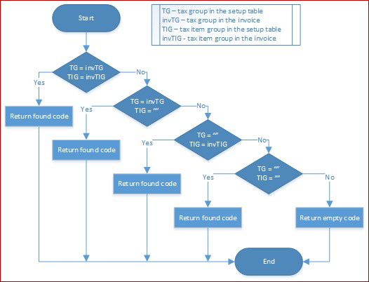

# Immediate Supply of Information on VAT (Suministro Inmediato de Información del IVA, SII)

[!include [banner](../includes/banner.md)]

According to R.D. 596/2016 in Spain, a new value-added tax (VAT) management system that is based on the Immediate Supply of Information on VAT (Suministro Inmediato de Información del IVA [SII]) allows for a two-way, automated relationship between the Spanish Tax Agency (La Agencia Estatal de Administración Tributaria [AEAT]) and the taxpayer. In this article, this system will be referred to as the SII system. Starting July 1, 2017, taxpayers who are subject to SII, and others who voluntarily adopt it, must send details of their billing records within four days through online filing on the AEAT website.

For more information about the SII system of Spain, see the [Immediate Supply of Information on VAT (SII) official website](https://www.agenciatributaria.es/AEAT.internet/en_gb/Inicio/La_Agencia_Tributaria/Campanas/Suministro_Inmediato_de_Informacion_en_el_IVA__SII_/Suministro_Inmediato_de_Informacion_en_el_IVA__SII_.shtml).

## Overview

Microsoft Dynamics 365 Finance supports the full cycle of processing, including the format generation and submission of the following reports to the SII system of Spain:

- 'Libro de registro de facturas Expedidas': **Record book of issued invoices**
- 'Libro de registro de facturas Recibidas': **Record book of received invoices**
- 'Libro de registro de determinadas operaciones intracomunitarias': **Record book of certain intra-community operations**
- 'Cobros sobre facturas registradas en el Libro de registro de Facturas Expedidas': **Payments for invoices registered in the record book of issued invoices**
- 'Pagos para facturas registradas en el Libro de registro de Facturas Recibidas': **Payments for invoices registered in the record book of received invoices**
- 'Cobros en Metálico': **Payments in cash**

As of Finance version 10.0.22, if you're using the [Tax Calculation](global-tax-calcuation-service-overview.md) service, and the [Support multiple VAT registration numbers](emea-multiple-vat-registration-numbers.md) feature is enabled in the **Feature management** workspace, you can [report the following reports to the SII system of Spain from a legal entity that has a primary address outside Spain](#multiple-vat):

- 'Libro de registro de facturas Expedidas': **Record book of issued invoices**
- 'Libro de registro de facturas Recibidas': **Record book of received invoices**

This article describes how to set up and use Finance to interoperate with the SII system of Spain. It includes information about how to complete the following tasks:

-   Import Electronic reporting (ER) configurations.
-   Set up Electronic messaging (EM) functionality.
-   Set up reporting to the SII system.
-   Work with EM functionality to interoperate with SII system.

## Import ER configurations

To prepare Finance to interoperate with the SII system, you must import the following ER configurations.

| **Number** | **Configuration name**                  | **Configuration type** |
|------------|-----------------------------------------|------------------------|
| **1**      | **Invoices Communication Model**        | **Model**              |
| 2          | SII model mapping                       | Model mapping          |
| 3          | SII Invoice Issued Format (ES)          | Format                 |
| 4          | SII Invoice Received Format (ES)        | Format                 |
| 5          | SII Intra-Community Format (ES)         | Format                 |
| 6          | SII Customer Payment Format (ES)        | Format                 |
| 7          | SII Vendor Payment Format (ES)          | Format                 |
| 8          | SII Collection in Cash Format (ES)      | Format                 |
| **9**      | **Electronic Messages framework model** | **Model**              |
| 10         | ES SII import model mapping             | Model mapping          |
| 11         | SII import format (ES)                  | Format                 |

> [!IMPORTANT]
> Be sure to import the most recent versions of these configurations. The version description usually includes the number of the Microsoft Knowledge Base (KB) article that explains the changes that were introduced in the configuration version.

> [!NOTE]
> After all the ER configurations from the preceding table are imported, set the **Default for model mapping option** to **Yes** for the **SII model mapping** and **ES SII import model mapping** configurations.

For more information about how to download ER configurations from the Microsoft global repository, see [Download ER configurations from the Global repository](../../fin-ops-core/dev-itpro/analytics/er-download-configurations-global-repo.md).

## Import a package of data entities that includes a predefined EM setup

Electronic message functionality is provided to maintain the different processes that are used in electronic reporting for different document types. For more information about electronic messages, see [Electronic messaging](../general-ledger/electronic-messaging.md).

The process of setting up the electronic message functionality to interoperate with the SII system has many steps. Because the names of some predefined entities are used in the ER configurations, it's important that you use a set of predefined values that are delivered in a package of data entities for the related tables, and that you import the ER configurations before you import the data entities.

1.  In [Microsoft Dynamics Lifecycle Service (LCS)](https://lcs.dynamics.com/v2), go to the Shared asset library, and select the **Data package** asset type.
2.  In the list of data package files, find and download **ES SII setup.zip**.

3.  After the file is downloaded, open Finance, and select the company that you will interoperate with the SII system from.
4.  Go to **Workspaces \> Data management**.
5.  In the **Data management** workspace, go to **Framework parameters \> Entity settings**, and select **Refresh entity list**. Wait for confirmation that the refresh has been completed. For more information about how to refresh the entity list, see [Entity list refresh](../../fin-ops-core/dev-itpro/data-entities/data-entities.md#entity-list-refresh).
6.  Validate that the source data and target data are correctly mapped. For more information, see [Validate that the source data and target data are mapped correctly](../../fin-ops-core/dev-itpro/data-entities/data-import-export-job.md#validate-that-the-source-data-and-target-data-are-mapped-correctly).
7.  Before the data entities are used for the first time to import the data from the package, sync the mapping of the source data and target data. In the list for the package, select a data entity, and then, on the Action Pane, select **Modify target mapping**.
8.  Above the grid for the package, select **Generate mapping** to create a mapping from scratch, and then save the mapping.
9.  Repeat steps 7 and 8 for every data entity in the package before you start the import.

For more information about data management, see [Data management overview](../../fin-ops-core/dev-itpro/data-entities/data-entities-data-packages.md).

Import data from the **ES SII setup.zip** file into the selected company. In the **Data management** workspace, select **Import**, specify a **Group name**, select **Add file**, and then, in the drop-down dialog box, set the **Source data format** field to **Package** and set the **Source data format** field to **Package**.

10.  Select **Upload and add**, select the **ES SII setup.zip** file on your computer, and upload it.
11.  After the data entities are uploaded, on the Action Pane, select **Import**.

You will receive a notification in **Action center**, or you can manually refresh the page to view the progress of the data import. When the import is completed, the **Execution summary** page shows the results.

After data entities are imported, you will find two types of electronic message processing: **SII** and **CollectionInCash**. This processing contains almost all the setup that is required in your legal entity.

| **Processing**   | **Name**                                                   | **Description**                                                                                                                                                                                                                                                                                                                                |
|------------------|------------------------------------------------------------|------------------------------------------------------------------------------------------------------------------------------------------------------------------------------------------------------------------------------------------------------------------------------------------------------------------------------------------------|
| SII              | Immediate Supply of Information (SII): Invoices, Payments  | This processing supports interoperation with the SII system to submit information about customer and vendor invoices, additional information about payments that are related to customer and vendor invoices where the **Special scheme code** value is set to **07**, and additional information that is related to intra-community invoices. |
| CollectionInCash | Immediate Supply of Information (SII): Collections in cash | This processing supports interoperation with the SII system to submit information about collections in cash reporting. This information is grouped by customer payment amounts that are evaluated from a specific account that is set up as a cash account, and that exceed the amount of 6,000 euros during the reporting period.             |

To review the imported processing, go to **Tax** \> **Setup** \> **Electronic messages** \> **Electronic message processing**.

The electronic message processing from the previous table works with the following electronic message item types.

| **Electronic messages item type** | **Description**                                                                                                                                                                                                                                                                                                                                                                                                               | **Processing**   |
|-----------------------------------|-------------------------------------------------------------------------------------------------------------------------------------------------------------------------------------------------------------------------------------------------------------------------------------------------------------------------------------------------------------------------------------------------------------------------------|------------------|
| FacturasProveedores               | **Vendor invoices**                                                                                                                                                                                                                                                                                                                                                                                                           | SII              |
| FacturasСliente                   | **Customer invoices**                                                                                                                                                                                                                                                                                                                                                                                                         | SII              |
| PagosCliente                      | **Customer payments:** Message items of this type are created for existing customer invoices where the **Special scheme code** value is set to **07**.                                                                                                                                                                                                                                                             | SII              |
| PagosProveedores                  | **Vendor payments:** Message items of this type are created for existing vendor invoices where the **Special scheme code** value is set to **07**.                                                                                                                                                                                                                                                                  | SII              |
| OperacionesIntracomunitarias      | **Intra-community operations:** Message items of this type are created for existing vendor invoices that meet specific intra-community criteria. For more information, see the description in the [Algorithm of to define the TipoOperacion (Intra-community operation type) additional field](#algorithm-to-define-the-tipooperacion-intra-community-operation-type-additional-field) section later in this article. | SII              |
| CobrosEnMetálico                  | **Collections in cash records:** Message items of this type are filled in from preliminary information that is collected about payment transactions that are posted from customers to specific cash accounts.                                                                                                                                                                                                                 | CollectionInCash |

To review the imported electronic message item types, go to **Tax** \> **Setup \> **Electronic messages** \> **Message item types**.

## Set up the internet address and certificates for the SII system

To interoperate with the SII system, you must use a security certificate that is provided by AEAT. There are two options for storing this sensitive data:

-   Azure Key Vault storage
-   Local storage

For more information about how to set up Key Vault, see [Setting up Azure Key Vault Client](https://support.microsoft.com/help/4040305/setting-up-azure-key-vault-client) and [Maintaining Azure Key Vault storage](https://support.microsoft.com/help/4040294/maintaining-azure-key-vault-storage).

1.  Go to **System administration** \> **Setup** \> **System parameters**.
2.  Set the **Use advanced certificate store** option to **No** to store sensitive data locally. Set the option to **Yes** to use Key Vault storage.
3.  If you set the **Use advanced certificate store** option to **Yes**, go to **System administration \> Setup \> Key Vault parameters** to set up the Key Vault parameters.
4.  Go to **Tax** \> **Setup** \> **Parameters** \> **Electronic messages** \> **Web service settings**.
5.  Enter the following information to define the internet address for web services.

| **Web service name** | **Description**                                                                                                                                                                                                                 | **Testing internet address**                               |
|----------------------|---------------------------------------------------------------------------------------------------------------------------------------------------------------------------------------------------------------------------------|------------------------------------------------------------|
| Cust invoice         | This web service is provided by AEAT. It's used to submit information about issued invoices, and it sends back a response that contains information about invoice processing on the SII system side.                            | `https://prewww1.aeat.es/wlpl/SSII-FACT/ws/fe/SiiFactFEV1SOAP`  |
| Vend invoice         | This web service is provided by AEAT. It's used to submit information about received invoices, and it sends back a response that contains information about invoice processing on the SII system side.                          | `https://prewww1.aeat.es/wlpl/SSII-FACT/ws/fr/SiiFactFRV1SOAP`  |
| Intra-community      | This web service is provided by AEAT. It's used to submit information about intra-community invoices, and it sends back a response that contains information about invoice processing on the SII system side.                   | `https://prewww1.aeat.es/wlpl/SSII-FACT/ws/oi/SiiFactOIV1SOAP`  |
| Cust payment         | This web service is provided by AEAT. It's used to submit information about payments from customers for specific invoice types, and it sends back a response that contains information about processing on the SII system side. | `https://prewww1.aeat.es/wlpl/SSII-FACT/ws/fe/SiiFactCOBV1SOAP` |
| Vend payment         | This web service is provided by AEAT. It's used to submit information about payments to vendors for specific invoice types, and it sends back a response that contains information about processing on the SII system side.     | `https://prewww1.aeat.es/wlpl/SSII-FACT/ws/fr/SiiFactPAGV1SOAP` |
| CollectionInCash     | This web service is provided by AEAT. It's used to submit information about payment transactions in cash from customers, and it sends back a response that contains information about processing on the SII system side.        | `https://prewww1.aeat.es/wlpl/SSII-FACT/ws/pm/SiiFactCMV1SOAP`  |

Internet addresses are subject to change by AEAT. Therefore, we recommend that you check for actual internet addresses on the [official website of the SII system](https://www.agenciatributaria.es/AEAT.internet/en_gb/SII.html). The official documentation also has information about the actual *production* internet addresses that you should set up.

6.  On the **General** tab, in the **Key vault certificate** field, select the security certificate that you set up for all web services that you will use for interoperation with the SII system: **Cust invoice**, **Vend invoice**, **Intra-community**, **Cust payment**, **Vend payment**, and **CollectionInCash**.

## Set up EM parameters for the SII system

After the data entities are imported into the database, complete the following tasks. When you've completed them, the electronic message functionality will be ready to use.

1.  Set up executable class parameters.
2.  Set up additional fields and automatically defined rules.
3.  Set up number sequences for electronic messages.
4.  Set up security roles for electronic message processing.

## Set up executable class parameters

Three executable classes are included in the two types of electronic messages processing (**SII** and **CollectionInCash**) that are used to interoperate with the SII system and imported into the system by using a package of data entities.

| **Executable class name**    | **Description**                                                                                                                                             |
|------------------------------|-------------------------------------------------------------------------------------------------------------------------------------------------------------|
| SIIGenerateItems             | This class fills in EM items of the following types: <ul><li>Customer invoice (FacturasСliente)</li><li>Vendor invoice (FacturasProveedores)</li><li>Customer payment (PagosCliente)</li><li>Vendor payment (PagosProveedores)</li><li>Intra-community operations (OperacionesIntracomunitarias)</li></ul>
For filled-in EM items, this class evaluates values for the following additional fields:
<ul><li>Invoice type (TipoFactura)</li><li>Summary reference (NumSerieFactura)</li><li>Special schema code (ClaveRegimenEspecialOTrascendencia)</li><li>Intracommunity transaction ID (TipoOperacion)</li></ul> |
| SIIPartyAttributesEvaluation | For filled-in EM items (in **Creado** status), this class evaluates the values for the following additional fields: <ul><li>Registration number (ID)</li><li>Tax ID type (IDType)</li><li>Party ISO code (CodigoPais)</li></ul>                                        |
| MonitorCollectionInCash      | This class monitors changes in the data of records of the **Collections in cash** report and then updates the status of EM items in the appropriate manner. |

### Set up the SIIGenerateItems executable class

1.  To set up parameters of the **SIIGenerateItems** executable class, go to **Tax** > **Setup** > **Electronic messages** > **Executable class settings**.
2.  On the **Executable class settings** page, select the **SIIGenerateItems** executable class that is associated with the **EMCreateItemsController** executable class name.
3.  On the Action Pane, select **Parameters**, and then, in the **Add new electronic message items** dialog box that appears, set the following values for the parameters of the executable class.

   In the **Additional fields** group:

   | **Parameter name**            | **Value**                          |
   |-------------------------------|------------------------------------|
   | Invoice type                  | TipoFactura                        |
   | Summary reference             | NumSerieFactura                    |
   | Special scheme code           | ClaveRegimenEspecialOTrascendencia |
   | Intracommunity transaction ID | TipoOperacion                      |

   In the **Message item types** group:

   | **Parameter name**            | **Value**                          |
   |-------------------------------|------------------------------------|
   | Customer invoices             | FacturasСliente                    |
   | Customer payments             | PagosCliente                       |
   | Vendor invoices               | FacturasProveedores                |
   | Vendor payments               | PagosProveedores                   |
   | Intracommunity operations     | OperacionesIntracomunitarias       |

As of Finance version 10.0.22, if you're using the [Tax Calculation](global-tax-calcuation-service-overview.md) service, and the [Support multiple VAT registration numbers](emea-multiple-vat-registration-numbers.md) feature is enabled in the **Feature management** workspace, an additional **Multiple Tax ID parameters** group will be visible in the **Add new electronic message items** dialog box. Set the following values for the parameters in this group.

   | **Parameter name**            | **Value**                          |
   |-------------------------------|------------------------------------|
   | Company Tax Id                | Select the VAT registration number of the company from the name of which you will be reporting to SII system of Spain in **Company Tax Id** field. |

4. Expand the **Records to include** FastTab and specify additional criteria to be applied to the datasources of Finance from which invoices will be populated in EM items. The following datasources are available:

   | **Datasources**               | **Description**                          |
   |-------------------------------|------------------------------------|
   | CUSTOMER INVOICE JOURNAL      | This datasource populates data from the **Customer invoice journal** table as EM items of **FacturasСliente** type for reporting to the SII system of Spain. |
   | VENDOR INVOICE JOURNAL        | This datasource populates data from the **Vendor invoice journal** table as EM items of **FacturasProveedores** type for reporting to the SII system of Spain. |
   | PROJECT INVOICE               | This datasource populates data from the **Project invoice** table as EM items of **FacturasСliente** type for reporting to the SII system of Spain. |
   | TRANSFER ORDER HISTORY        | This datasource populates data from the **Transfer order history** table as EM items of the **FacturasСliente** and **FacturasProveedores** types for reporting to the SII system of Spain. This datasource is available as of Finance version 10.0.22 if you're using the [Tax Calculation](global-tax-calcuation-service-overview.md) service and the [Support multiple VAT registration numbers](emea-multiple-vat-registration-numbers.md) feature is enabled in the **Feature management** workspace. For more information, see the [Reporting to the SII system of Spain for multiple VAT registrations](#multiple-vat) section later in this article. |

5.  Select **OK** to initiate the executable class.

### Set up the SIIPartyAttributesEvaluation executable class

1.  To set up parameters of the **SIIPartyAttributesEvaluation** executable class, go to **Tax \> Setup \> Electronic messages \> Executable class settings**.
2.  On the **Executable class settings** page, select the **SIIPartyAttributesEvaluation** executable class that is associated with the **EMAdditionalFieldsEvaluationController_ES** executable class name.
3.  On the Action Pane, select **Parameters**, and then, in the dialog box that appears, set the following values for the parameters of the executable class.

    | **Parameter name**  | **Value**  |
    |---------------------|------------|
    | Registration number | ID         |
    | Tax ID type         | IDType     |
    | Party ISO code      | CodigoPais |

4.  Select **OK** to initiate the executable class.

### Set up the MonitorCollectionInCash executable class

1.  To set up parameters of the **MonitorCollectionInCash** executable class, go to **Tax \> Setup \> Electronic messages \> Executable class settings**.
2.  On the **Executable class settings** page, select the **MonitorCollectionInCash** executable class that is associated with the **EMCheckChangesCollectionInCashController_ES** executable class name.
3.  On the Action Pane, select **Parameters**, and then in the dialog box that appears, set the following values for the parameters of the executable class.

    | **Parameter name** | **Value**            |
    |--------------------|----------------------|
    | Pending cancel     | CancelacionPendiente |
    | Corrected          | Corregido            |

4.  Select **OK** to initiate the executable class.

## Set up additional fields and automatically defined rules

EM items have additional fields that are included in the two types of electronic message processing (**SII** and **CollectionInCash**) that are used to interoperate with the SII system and imported into the system by using a package of data entities. Additional fields are associated with EM items and are required for their processing. The system automatically sets values for additional fields when actions are run, but you can manually set and adjust the values of additional fields before you submit the information to the SII system. Additional fields are named according to related elements of the report. For more information about what each related report element is, see the [official documentation for the SII system](https://www.agenciatributaria.es/AEAT.internet/en_gb/SII.html).

| **Additional field**               | **Description**                | **Type of processing where the field is used**                                                                                                                                                 | **Action/executable class that the field is set by**                                                                                                                                                                                                                                                               |
|------------------------------------|--------------------------------|------------------------------------------------------------------------------------------------------------------------------------------------------------------------------------------------|--------------------------------------------------------------------------------------------------------------------------------------------------------------------------------------------------------------------------------------------------------------------------------------------------------------------|
| TipoComunicacion                   | Communication type             | **SII** and **CollectionInCash**. This field is applicable only to the **FacturasСliente**, **FacturasProveedores**, **OperacionesIntracomunitarias**, and **CobrosEnMetálico** EM item types. | **GenerateMessageItem** action for **SII** processing. The default value is **A0**. The value is updated to **A1** during import of the response by the **ImportResponse** action when the invoice is successfully accepted by the SII system. **PopulateMessageItem** action for **CollectionInCash** processing. |
| ID                                 | Registration ID                | **SII** and **CollectionInCash**. This additional field is applicable to all EM item types.                                                                                                    | **EvaluationFields** action, **SIIPartyAttributesEvaluation** executable class.                                                                                                                                                                                                                                    |
| IDType                             | Counterparty ID type           | **SII** and **CollectionInCash**. This field is applicable to all EM item types.                                                                                                               | **EvaluationFields** action, **SIIPartyAttributesEvaluation** executable class.                                                                                                                                                                                                                                    |
| CodigoPais                         | ISO code                       | **SII** and **CollectionInCash**. This field is applicable to all EM item types.                                                                                                               | **EvaluationFields** action, **SIIPartyAttributesEvaluation** executable class.                                                                                                                                                                                                                                    |
| ClaveRegimenEspecialOTrascendencia | Special scheme code            | **SII** only. This field is applicable only to the **FacturasСliente** and **FacturasProveedores** EM item types.                                                                              | **GenerateMessageItem** action, **SIIGenerateItems** executable class. The default value is **01**. Setup of automatically defined rules is available.                                                                                                                                                                   |
| NumSerieFactura                    | Summary reference              | **SII** only. This field is applicable only to the **FacturasСliente** and **FacturasProveedores** EM item types.                                                                              | **GenerateMessageItem** action, **SIIGenerateItems** executable class.                                                                                                                                                                                                                                             |
| TipoFactura                        | Invoice type                   | **SII** only. This field is applicable only to the **FacturasСliente** and **FacturasProveedores** EM item types                                                                               | **GenerateMessageItem** action, **SIIGenerateItems** executable class. The default value is **F1**. Setup of automatically defined rules is available.                                                                                                                                                                   |
| TipoOperacion                      | Intra-community operation type | **SII** only. This field is applicable only to the **OperacionesIntracomunitarias** EM item type.                                                                                              | Manual definition. The default value is **A**. Setup of automatically defined rules is available and can be applied during execution of the **GenerateMessageItem** action.                                                                                                                                              |
| EmitidaPorTerceros                 | Issued by third parties        | **SII** only. This field is applicable only to the **FacturasСliente** EM item type.                                                                                                           | Manual definition only. The default value is **N**. Setup of automatically defined rules is available.                                                                                                                                                                                                                   |
| EntidadSucedidaNIF                 | Succeeded legal entity Tax ID  | **SII** only. This field is applicable only to the **FacturasСliente**, **FacturasProveedores**, and **OperacionesIntracomunitarias** EM item types.                                           | Manual definition. Setup of automatically defined rules is available.                                                                                                                                                                                                                                                    |
| EntidadSucedidaNombreRazon         | Succeeded legal entity name    | **SII** only. This field is applicable only to the **FacturasСliente**, **FacturasProveedores**, and **OperacionesIntracomunitarias** EM item types.                                           | Manual definition. Setup of automatically defined rules is available.                                                                                                                                                                                                                                                    |
| ReferenciaCatastral                | Cadastral reference            | **SII** only. This field is applicable only to the **FacturasСliente** EM item type.                                                                                                           | Manual definition. Setup of automatically defined rules is available.                                                                                                                                                                                                                                                    |
| SituacionInmueble                  | Property location              | **SII** only. This field is applicable only to the **FacturasСliente** EM item type.                                                                                                           | Manual definition. Setup of automatically defined rules is available.                                                                                                                                                                                                                                                    |

### Algorithm to define the value of the TipoComunicacion (Communication type) additional field

The **TipoComunicacion** (**Communication type**) additional field is automatically defined by the system for message items of the **FacturasСliente**, **FacturasProveedores**, **OperacionesIntracomunitarias**, and **CobrosEnMetálico** types. For a list of values that can be assigned to **TipoComunicacion**, see the [official documentation for the SII](https://www.agenciatributaria.es/AEAT.internet/en_gb/SII.html) system.

The following values are available for the **TipoComunicacion** additional field as part of the predefined setup for electronic messages.

| **Field value** | **Description (Spanish)**                                | **Description (English)** |
|-----------------|----------------------------------------------------------|---------------------------|
| A0              | Alta de facturas/registro                                | Invoice registration      |
| A1              | Modificación de facturas/registros (errores registrales) | Modification of invoices  |

The default value of the **TipoComunicacion** additional field is defined as **A0** on the **Message item additional fields** FastTab in the definition of **SII** and **CollectionInCash** processing (**Tax \> Setup \> Electronic messages \> Electronic message processing**). Later, when Finance receives a response from the SII system that the invoice was successfully accepted, the invoice's **TipoComunicacion** value is updated to **A1** by the **ImportResponse** action.

### Algorithm to define the value of the ID (Registration ID) additional field

The **ID** (**Registration ID**) additional field is automatically defined by the system for EM items of all types during the evaluation of additional fields. For counterparties that registered for VAT outside Spain, the value of the **ID** additional field is reported in the **ID** tag under the **IDOtro** tag of the report. For counterparties from Spain, the value is reported in the **NIF** tag.

The value of the **ID** additional field is defined by the **EvaluationFields** action that is associated with the **SIIPartyAttributesEvaluation** executable class. This class retrieves the tax exempt number that is specified for the invoice during invoice posting. If the tax exempt number isn't specified for an invoice before posting, the system collects the value for the **ID** additional field from the **Tax exempt number** field in the counterparty master data.

For counterparties from EU or outside of the EU, **ID** additionally field will be supplemented with related ISO code.

### Algorithm to define the IDType (Counterparty ID type) additional field

The **IDType** (**Counterparty ID type**) additional field is automatically defined by the system for EM items of all types during the evaluation of additional fields. For the list of values that can be set for **IDType**, see the [official documentation for the SII](https://www.agenciatributaria.es/AEAT.internet/en_gb/SII.html) system.

The following values are available for the **IDType** additional field as part of the predefined setup for electronic messages.

| **Field value** | **Description**                                                                |
|-----------------|--------------------------------------------------------------------------------|
| 02              | NIF-VAT                                                                        |
| 03              | Passport                                                                       |
| 04              | Official identification document issued by the country or region of residence. |
| 05              | Residence certificate                                                          |
| 06              | Other supporting document                                                      |
| 07              | Not registered                                                                 |

Value of the **IDType** additional field is reported in the **IDType** tag under the **IDOtro** tag of the report.

By default, for counterparties outside of Spain, when **Registration ID** is not defined in the counterparty's master data, the system defines the following values for the **IDType** additional field:

-   **02** – For EU counterparties
-   **04** – For third-country counterparties

When **Registration ID** is defined on the counterparty's master data, system analyzes the following types of the **Registration ID**:

1.  For Spanish counteragents:

    `TaxRegistrationTypesList::NotCensused`

    `TaxRegistrationTypesList::TAXID`

2.  For EU counteragents:

    `TaxRegistrationTypesList::TAXID`

    `TaxRegistrationTypesList::OfficialIdDoc`

    `TaxRegistrationTypesList::Passport`

    `TaxRegistrationTypesList::ResidenceCertificate`

    `TaxRegistrationTypesList::OtherIdDoc`

3.  All other counteragents:

    `TaxRegistrationTypesList::OfficialIdDoc`

    `TaxRegistrationTypesList::Passport`

    `TaxRegistrationTypesList::ResidenceCertificate`

    `TaxRegistrationTypesList::OtherIdDoc`

As a result of this analyzes system defines related **IDType**

| **Tax registration type** | **IDType in SII system**                                                                |
|-----------------|--------------------------------------------------------------------------------|
| `TaxRegistrationTypesList::TAXID`| 02                                                                         |
| `TaxRegistrationTypesList::Passpor`| 03                                                                       |
| `TaxRegistrationTypesList::OfficialIdDoc`| 04                                                                 |
| `TaxRegistrationTypesList::ResidenceCertificate`| 05                                                          |
| `TaxRegistrationTypesList::OtherIdDoc`| 06                                                                       |
| `TaxRegistrationTypesList::NotCensused`| 07                                                                       |

Sometimes, when a Spanish counteragent's tax exempt number (NIF) can't be found in the SII system's database, an invoice can't be accepted by the SII system. At the same time, a customer invoice where the counteragent isn't registered in the SII system's database can be sent to the SII system when related tax exempt number of the counteragent reported in the **IdOtro** tag by using an **IdType** value of **07**. In this case, the SII system will "accept with errors" the invoice.

You can manually adjust the value of the **IDType** additional field before you submit the invoice to the SII system.

### Algorithm to define the CodigoPais (ISO code) additional field

The **CodigoPais** (**ISO code**) additional field is automatically defined by the system for EM items of all types during the evaluation of additional fields. The value of the **CodigoPais** additional field is reported in the **CodigoPais** tag under the **IDOtro** tag of the report, and identifies the country or region of the tax registration number of the counterparty from the document.

By default, the system defines the value of the **CodigoPais** additional field as the International Organization for Standardization (ISO) county/region code from the primary address of the counterparty.

### Algorithm to define the NumSerieFactura (Summary reference) additional field

The **NumSerieFactura** (**Summary reference**) additional field is automatically defined by the system only for EM items of the **FacturasСliente** type. The value of the **NumSerieFactura** additional field is reported in the **NumSerieFacturaEmisorResumenFin** tag for summarized invoices. For customer invoices, it collects the value from the last ticket (**receipt ID**) that is related to the invoice in the reporting from the **Retail** module. Alternatively, it's filled with the invoice document number. (Therefore, the invoice isn't a summarized invoice.) If the value of the **NumSerieFactura** additional field differs from the value in the document number of the message item, the invoice is reported as summarized (that is, **\<NumSerieFacturaEmisorResumenFin\>** is printed). The value of the **NumSerieFactura** additional field can be manually updated as required. If you will report an invoice as a summarized invoice, make sure that the value of the **TipoFactura** field is updated to **F4**.

### Algorithm to define the TipoFactura (Invoice type) additional field

The **TipoFactura** (**Invoice type**) additional field is automatically defined by the system for EM items of the **FacturasСliente** and **FacturasProveedores** types. For the list of values that can be set for **TipoFactura**, see the [official documentation for the SII system](https://www.agenciatributaria.es/AEAT.internet/en_gb/SII.html).

The following values are available for the **TipoFactura** additional field as part of the predefined setup for electronic messages.

| **Field value** | **Description (Spanish)**                                                        | **Description (English)**                                                | **Algorithm**                                                                                                                            |
|-----------------|----------------------------------------------------------------------------------|--------------------------------------------------------------------------|------------------------------------------------------------------------------------------------------------------------------------------|
| F1              | Factura                                                                          | Invoice                                                                  | This value is the default value for all invoices if no specific logic is applied for a given invoice. The value can be manually edited.  |
| F2              | Factura Simplificada (ticket)                                                    | Simplified invoice                                                       | This value can be manually applied to an invoice\*.                                                                                      |
| F3              | Factura emitida en sustitución de facturas simplificadas facturadas y declaradas | Invoice issued to replace simplified invoices invoiced and declared      | This value can be manually applied to an invoice\*.                                                                                      |
| F4              | Asiento resumen de facturas                                                      | Invoice summary entry                                                    | If the system identities that the invoice is created as a summary invoice from the **Retail** module. This value can be manually edited. |
| F5              | Importaciones (DUA)                                                              | Imports (DUA)                                                            | This value can be manually applied to an invoice\*.                                                                                      |
| F6              | Justificantes contables                                                          | Accounting supporting documents                                          | This value can be manually applied to an invoice\*.                                                                                      |
| LC              | Aduanas – Liquidación complementaria                                             | Customs – Complementary clearance                                        | This value can be manually applied to an invoice\*.                                                                                      |
| R1              | Factura Rectificativa (Error fundadow en derecho y Art. 80 Uno Dos y Seis LIVA)  | Corrective Invoice (Error based on law and Art. 80 One Two and Six LIVA) | This value can be manually applied to an invoice\*.                                                                                      |
| R2              | Factura Rectificativa (Art. 80.3)                                                | Corrective Invoice (Art. 80.3)                                           | This value can be manually applied to an invoice\*.                                                                                      |
| R3              | Factura Rectificativa (Art. 80.4)                                                | Corrective Invoice (Art. 80.4)                                           | This value can be manually applied to an invoice\*.                                                                                      |
| R4              | Factura Rectificativa (Resto)                                                    | Rectifying Invoice (Rest)                                                | This value can be manually applied to an invoice\*.                                                                                      |
| R5              | Factura Rectificativa en facturas simplificadas                                  | Corrective invoice in simplified invoices                                | This value can be manually applied to an invoice\*.                                                                                      |

\* There are three ways to define a specific invoice type:

-   During invoice registration, before invoice posting, by applying a financial reason to the invoice
-   By setting up rules for additional field values
-   During manual invoice review in EM items before they are submitted to the SII system

The system defines the value of the **TipoFactura** additional field according to the following algorithm:

1.  Define the invoice type according to the financial reason code in the document.
2.  If the invoice type isn't defined in step 1, check whether the value is **F4** (summarized invoice).
3.  If the invoice type isn't defined in step 2, define it according to the setup of additional field values.
4.  If the invoice type isn't defined in step 3, set the value to **F1**.

Financial reasons can be specified for invoices that are posted from the following documents:

-   Sales order
-   Free text invoice
-   Purchase order
-   Projects
-   Vendor invoice journal (AP)
-   General ledger (GL) general journal

> [!NOTE]
> When you [report to SII system of Spain from legal entity with primary address out of Spain](#multiple-vat), you can specify financial reasons for invoices that are posted from the following documents only:
> - Purchase order
> - Vendor invoice journal (AP)
> - General ledger (GL) general journal

When you create an invoice from the types of documents that invoices can be created from, you can set up a specific reason for the invoice. The **GenerateMessageItem** action will analyze this reason, and the reason SII code will be set for the electronic message item.

To set up financial reasons, follow these steps.

1.  Go to **Organization administration \> Setup \> Financial reasons**.
2.  Select an existing line, or create a new line.
3.  In the **Invoice type** column, select the code that is applicable to the SII system.
4.  In the **SII code description** column, add a description. This description won't be used in reporting, but it might help users select the appropriate financial reason.

To enable the system to define the invoice type based on the setup of additional field values, follow these steps to define the rules.

1.  Go to **Tax \> Setup \> Electronic messages \> Additional fields**.
2.  In the list of additional fields on the left, select **TipoFactura**.
3.  On the **Value** FastTab, specify criteria:

    -   **Account type:** Select **Customer** or **Vendor**.
    -   **Account code:** Select **All**, **Group**, **Table**.
    -   **Account/Group number**
    -   **Sales tax group**
    -   **Item sales tax group**

     You can also specify effective and expiration dates for your rule.

### Algorithm to define the TipoRectificativa tag for a credit note

Both formats, **Libro de registro de facturas Recibidas** (invoices received) and **Libro de registro de facturas Expedidas** (invoices issued), must include a **TipoRectificativa** tag to report credit notes. This tag reports the type of credit note and can have one of the following values:

   - **I** (INCREMENTAL): Incremental
   - **S** (SUSTITUTIVA): Substitute

To report a credit note with an **I** value in the **TipoRectificativa** tag, before you post the credit note, when you specify the original invoice by using the **Credit invoicing** function, select **Correction for differences only** in the **Correction method** field in the **Credit invoicing** dialog box.

### Algorithm to define the TipoOperacion (Intra-community operation type) additional field

The **TipoOperacion** (**Intra-community operation type**) additional field is automatically defined by the system for EM items of the **OperacionesIntracomunitarias** type. For the list of values that can be set for **TipoOperacion**, see the [official documentation for the SII](https://www.agenciatributaria.es/AEAT.internet/en_gb/SII.html) system.

The following values are available for the **TipoOperacion** additional field as a part of the predefined setup of electronic messages.

| **Field value** | **Description (Spanish)**                                                                                                                                                             | **Description (English)**                                                                                                                          |
|-----------------|---------------------------------------------------------------------------------------------------------------------------------------------------------------------------------------|----------------------------------------------------------------------------------------------------------------------------------------------------|
| A               | El envío o recepción de bienes para la realización de los informes parciales o trabajos mencionados en el artículo 70, apartado uno, número 7º, de la Ley del Impuesto (Ley 37/1992). | Sending or receiving goods to carry out the partial reports or works mentioned in article 70, section 1, number 7, of the Tax Law (Law 37/1992). |
| B               | Las transferencias de bienes y las adquisiciones intracomunitarias de bienes comprendidas en los artículos 9, apartado 3º, y 16, apartado 2º, de la Ley del Impuesto (Ley 37/1992).   | Transfers of goods and intra-community acquisitions of goods included in articles 9, section 3, and 16, section 2, of the Tax Law (Law 37/1992).   |

The default value of the **TipoOperacion** additional field is defined as **A** on the **Message item additional fields** FastTab in the definition of **SII** processing (**Tax \> Setup \> Electronic messages \> Electronic message processing**).

To enable the system to define the intra-community operation type based on the setup of additional field values, follow these steps to define the rules.

1.  Go to **Tax \> Setup \> Electronic messages \> Additional fields**.
2.  In the list of additional fields on the left, select **TipoOperacion**.
3.  On the **Value** FastTab, specify criteria:

    -   **Account type:** select **Customer** or **Vendor**.
    -   **Account code:** Select **All**, **Group**, or **Table**.
    -   **Account/Group number**
    -   **Sales tax group**
    -   **Item sales tax group**

    You can also specify effective and expiration dates for your rule.

### Set up automatically defined rules for the ClaveRegimenEspecialOTrascendencia (Special scheme code) additional field

The **ClaveRegimenEspecialOTrascendencia** (**Special scheme code**) additional field is automatically defined by the system for message items of the **FacturasСliente** and **FacturasProveedores** types. For the list of values that can be set for **ClaveRegimenEspecialOTrascendencia**, see the [official documentation for the SII](https://www.agenciatributaria.es/AEAT.internet/en_gb/SII.html) system.

According to the official documentation for the SII system, the following values are available for the **ClaveRegimenEspecialOTrascendencia** additional field as part of the predefined setup of electronic messages.

| **Field value** | **Description**                                                                                                                                                                                                                              |
|-----------------|----------------------------------------------------------------------------------------------------------------------------------------------------------------------------------------------------------------------------------------------|
| 01              | General system transaction                                                                                                                                                                                                                   |
| 02              | Export                                                                                                                                                                                                                                       |
| 02              | Transactions for which a business person pays compensation for purchasing from individuals under the Special system for agricultural, livestock, and fisheries activities.                                                                      |
| 03              | Transactions to which the special system of used goods, works of art, antiquities, and collectibles applies.                                                                                                                                 |
| 04              | Special system for investment gold.                                                                                                                                                                                                          |
| 05              | Special system for travel agencies.                                                                                                                                                                                                          |
| 06              | Special system applicable to groups of entities and VAT (Advanced).                                                                                                                                                                          |
| 07              | Special cash basis system.                                                                                                                                                                                                                   |
| 08              | Transactions subject to IPSI / IGIC (Tax on Production, Services, and Imports / General Indirect Canary Islands Tax).                                                                                                                         |
| 09              | Invoicing of the provision of travel agency services acting as intermediaries in the name of and on behalf of other persons (Additional Provision 4, RD1619/2012).                                                                           |
| 10              | Collections on behalf of third parties of professional fees or industrial property, copyright, or other such rights by partners, associates or members undertaken by companies, associations, professional organizations, or other entities. |
| 11              | Business premises lease activities subject to withholding.                                                                                                                                                                                   |
| 12              | Business premises lease activities not subject to withholding.                                                                                                                                                                               |
| 13              | Business premises lease activities subject and not subject to withholding/Invoice corresponding to an import (reported without being associated with a DUA).                                                                                 |
| 14              | Invoice with VAT pending accrual on work certifications with Public Administration recipients for the first half of 2017.                                                                                                                    |
| 15              | Invoice with VAT pending accrual on transactions of a consecutive nature.                                                                                                                                                                    |
| 16              | First half 2017.                                                                                                                                                                                                                             |
| 17              | Operation under any of the regimes provided for in Chapter XI of Title IX (OSS and IOSS). |

You can set up automatically defined rules for any value from the preceding list. You can also adjust the list of possible values. For automatically defined rules, the following criteria are available:

-   **Account type:** Select **All**, **Customer**, or **Vendor**.
-   **Account code:** Select **All**, **Group**, or **Table**.

    > [!NOTE]
    > You can specify this criterion only when **Account type** is set to either **Customer** or **Vendor**.

-   **Account/Group number**

    > [!NOTE]
    > You can specify this criterion only when **Account code** is set to either **Group** or **Table**.

-   **Sales tax group**

-   **Item sales tax group**

You can also specify effective and expiration dates for your rule.

The algorithm that is used to search for the special scheme code for the register consists of three stages:

1.  Search among records where **Account code** is set to **Table** for the customer or vendor.
2.  If the record isn't found in stage 1, search among records where **Account code** is set to **Group** for the customer or vendor.
3.  If the record isn't found in stage 2, search among records where **Account code** is set to **All**.

During the search in each stage, valid dates of records are considered, and only records that are valid on the register date should be selected.

When **Sales tax group** and **Item sales tax group** columns are used in the setup, the algorithm remains the same, in that it still contains three main stages. However, the search during each stage differs. When the system searches for the special scheme code for the register in each stage, the sales tax group and item sales tax group are now considered. To get the sales tax group and item sales tax group for the invoice, the system selects the first tax transaction that is related to the current customer, vendor, or project invoice. The sales tax group and item sales tax group are then passed as parameters to the method for searching for special scheme codes.

The search by **Sales tax group** and **Item sales tax group** can be divided into four substages. All four substages are implemented for each of the three stages that were mentioned earlier, until a suitable record is found.

1.  Search for a record where both the **Sales tax group** and **Item sales tax group** fields have a value, and they match the values that were passed as parameters.
2.  If no record is found in substage 1, search for a record where the value of the **Sales tax group** matches the sales tax group that was passed as a parameter, but the **Item sales tax group** field is blank. (A blank field represents "any.")
3.  If no record is found in substage 2, search for a record where the **Sales tax group** field is blank, but the value of the **Item sales tax group** field matches the item sales tax group that was passed as a parameter.
4.  If no record is found in substage 3, search for a record where both the **Sales tax group** field and the **Item sales tax group** fields are blank.

The following illustration shows the algorithm schema for each of these four substages.

## Set up number sequences for electronic messages

To work with the Electronic messages functionality, you must define related number sequences.

1.  Go to **Tax** \> **Setup** \> **General ledger parameters**.
2.  On the **Number sequences** tab, set up two number sequences:

    -   Message
    -   Message item

## Set up security roles for electronic message processing

Different groups of users might require access to **SII** and **CollectionInCash** processing. You can limit access to the processing based on security groups that are defined in the system.

To limit access to **SII** and **CollectionInCash** processing, follow these steps.

1.  Go to **Tax \> Setup \> Electronic messages \> Electronic message processing**.
2.  Select **SII** or **CollectionInCash** processing, and then add the security groups that must work with that processing. If no security group is defined for the processing, only a system admin can see the processing on the **Electronic messages** page.

##  Set up exempt code types on issued and received invoice formats

To support the scenario of reporting exempt code types on issued and received invoices, complete the following steps.

1. Go to **Workspace** > **Electronic reporting**.
2. Go to **Reporting configurations**.
3. In the left pane, expand the **Invoices Communication Model** node.
4. Select the format configurations **SII Invoice Issued Format (ES)** with a version higher than 108.54 or **SII Invoice Received Format (ES)** with a version higher than 108.47.
5. Select **Configurations** > **Application specific parameters** > **Setup**
6. Select **ExemptionCauseTypeLookUp**
7. On the **Conditions** tab, select **Add**.
8. In the **Lookup result** field, select the applicable exemption type.
9. In the **Tax exempt code** field, enter the tax exempt code for each exemption type.
10. Select **Save** and close the page.
11. Select **Change status** > **Complete**.

## Additional setup in Finance for reporting to the SII system

### Exclude transactions that have a negative sales tax percentage from SII processing

Sometimes, companies in Spain set up sales tax codes that allow for negative tax percentages and that should not be reported to the SII system as VAT. To exclude invoices from reporting to the SII system if they have tax transactions where the sales tax code allows for negative tax percentages, in the **Reporting** section on the **Ledger** tab of the **General ledger parameters** page (**General ledger \> Setup \> General ledger parameters**), select the **Negative sales tax percentage** check box.

If the **Negative sales tax percentage** check box is cleared on the **General ledger parameters** page, the following behavior occurs:

-   Invoices that have only tax transactions that have negative sales tax percentages won't be filled in as electronic message items for SII processing.
-   Only sales tax transactions that have sales tax codes where the **Negative sales tax percentage** check box is cleared will be included in the XML file that is reported to the SII system.

The **Negative sales tax percentage** check box on the **General ledger parameters** page doesn't affect reporting of reverse change transactions.

### Sales tax code setup to identify different types of 0.00-percent VAT rates

In Spain, sales tax codes that have a rate of 0.00 percent are used in some scenarios. The following scenarios must be differentiated so that they can be correctly reported to the SII system:

-   **ImporteTAIReglasLocalizacion** – Transactions in euros that are performed with other Spanish areas that don't have VAT, but that do have some other internal indirect tax (for example, Canary Island, Ceuta, and Melilla).
-   **ImportePorArticulos7_14_Otros** – Other specific transactions in euros that are subject to art. 7.14.

To correctly report both the preceding scenarios that involve a VAT rate of 0.00 percent, set the value of the **Type of tax** field for sales tax codes (**Tax \> Indirect taxes \> Sales tax \> Sales tax codes**) as explained in the following table.

| **Tag in SII system**         | **Type of tax value** |
|-------------------------------|-----------------------|
| ImportePorArticulos7_14_Otros | VAT 0%                |
| ImporteTAIReglasLocalizacion  | Other                 |

### Intra-community sales tax reporting to the SII system

According to SII system rules, an extended set of parameters must be used when intra-community invoices are reported to the SII system. To submit additional information in a specific format for intra-community invoices, **SII** processing in Finance fills in the **OperacionesIntracomunitarias** message item type for invoices that were previously reported as standard invoices. The **GenerateMessageItem** action runs the **SIIGenerateItems** executable class. Based on the following criteria, it identifies invoices as invoices of the **OperacionesIntracomunitarias** message item type:

-   The **Intra-community** check box is selected for the sales tax group (**Tax \> Sales tax \> Sales tax group**) that is used in the sales tax transaction that is related to the invoice. Verify that the [Intra-community VAT for Spain](./emea-esp-intra-community-vat.md) feature is set up and used in your system.
-   The country/region of the primary address of the counterparty from the invoice is identified as **EU** in the **Country/region properties** section of the **Foreign trade parameters** page (**Tax \> Setup \> Foreign trade \> Foreign trade parameters**).
-   The counterparty is included in the SII intra-community setup (go to **Tax \> Setup \> Electronic messages \> Message item additional fields**, and then, in the **TipoOperacion** field, specify those counterparties for which invoices must be reported as intra-community invoices).

To verify that you correctly set up the parameters for the **SIIGenerateItems** executable class for the **TipoOperacion** additional field, follow these steps.

1.  Go to **Tax \> Setup \> Electronic messages \> Executable class settings**.
2.  Select the **SIIGenerateItems** executable class that is associated with the **EMCreateItemsController** executable class name.
3.  On the Action Pane, select **Parameters**, and then set up the **TipoOperacion** value for the **Intra-community operation ID** additional field.

### Set up sales tax codes to report the exempt code types on issued and received invoices files

In addition to the set up of Exempt code types on Issued and Received Invoice formats, Complete the following steps toadd exempt code types to sales tax codes for issues and received invoice fiels.

1. Go to **Tax** > **Indirect taxes** > **Sales tax** > **Sales tax groups**.
2. Select a **Sales tax group**.
3. For each sales tax code that is granted tax exemptions, on the **Setup** tab, select a **Sales tax code**.
5. In the **Exempt code** column, enter the **Exemption code type**. The code type must be the same code that you entered in the **ExemptionCauseType** lookup in the [Set up Exempt code types on Issued and Received Invoice formats](#exempt) section.
6. Select **Save**.

This set up drives the fulfilling of the 'CausaExencionType' tag on the issued and received invoices files.

### Set up item sales tax codes to flag the good investments on the received invoices file

To distinguish the acquisition of goods between investments and non-investments from received invoices, complete the following steps.

1. Go to **Tax** > **Indirect taxes** > **Sales tax** > **Sales tax codes** and select a sales tax code.
2. In **Report Setup**, **SII REPORT**, set **Classify as investment** to **Yes** to indicate that the selected sales tax code be reported as an investment.
3. Select **Save**.

This set up drives the fulfilling of the Bien 'Inversion' tag in the received invoices files.

## Reporting to the SII system of Spain for multiple VAT registrations

As of Finance version 10.0.22, if you're using the [Tax Calculation](global-tax-calcuation-service-overview.md) service, and the [Support multiple VAT registration numbers](emea-multiple-vat-registration-numbers.md) feature is enabled in the **Feature management** workspace, you can report the following reports to the SII system of Spain:

- 'Libro de registro de facturas Expedidas': **Record book of issued invoices**
- 'Libro de registro de facturas Recibidas': **Record book of received invoices**

After the **Support multiple VAT registration numbers** feature is enabled, provide the following setup so that you can report to the SII system from a legal entity with a primary address outside of Spain.

1. In the **Feature management** workspace, enable the **Sales tax declaration for multiple VAT registrations** feature.
2. On the **Tax calculation parameters** page, on the **Multiple VAT registrations** tab, select the **VAT declaration** check box.
3. Define the VAT registration number of the company from the name that you will be reporting to SII system of Spain in the **Company Tax Id** field in the [**SIIGenerateItems executable class**](#siigenerateitems) parameters.
4. Specify the **Transfer order history** data source on **Records to include** FastTab of the [**SIIGenerateItems executable class**](#siigenerateitems) parameters.

> [!NOTE]
> When the **Support multiple VAT registration numbers** and **Sales tax declaration for multiple VAT registrations** features are enabled, the SII system of Spain collects the value in the **NombreRazon** field from the **Name or description** field on the **Manage addresses** page instead of from the name of the legal entity.

## Use EM functionality to report to the SII system

EM functionality automatically runs actions that are included in the processing (**SII** or **CollectionInCash**), based on the status of messages and message items.

### Process for reporting invoices to the SII system

The **ES SII setup.zip** package provides the setup for **SII** processing in the EM functionality that supports interoperation with the SII system. The following illustration shows the schema for general **SII** processing. Manual user actions aren't included in this illustration but are explained later in this article.

### Actions of SII processing

The following table describes the general actions of **SII** processing.

| **Action**           | **Action type**              | **Description**                                                                                                                                                                                                                                                                                                                                  |
|----------------------|------------------------------|--------------------------------------------------------------------------------------------------------------------------------------------------------------------------------------------------------------------------------------------------------------------------------------------------------------------------------------------------|
| GenerateMessageItem  | Message execution level      | This action runs the **SIIGenerateItems** executable class to generate EM items for issued and received invoices, EM items for intra-community invoices, and EM items that are related to issued and received invoices where **Special scheme code** is set to **07**. Setup of the **SIIGenerateItems** executable class parameter is required. |
| EvaluationFields     | Message item execution level | This action runs the **SIIPartyAttributesEvaluation** executable class to calculate the values of the **ID**, **IDType**, and **CodigoPais** additional fields for EM items. Setup of the **SIIPartyAttributesEvaluation** executable class parameters is required.                                                                              |
| GenerateMessageCI    | Electronic reporting export  | This action runs the **SII Invoice Issued Format (ES)** format to create a package of invoices (EM items of the **FacturasСliente** type) that can be submitted to the SII system. By default, the package contains 10,000 invoices.                                                                                                             |
| GenerateMessageVI    | Electronic reporting export  | This action runs the **SII Invoice Received Format (ES)** format to create a package of invoices (EM items of the **FacturasProveedores** type) that can be submitted to the SII system. By default, the package contains 10,000 invoices.                                                                                                       |
| GenerateMessageIC    | Electronic reporting export  | This action runs the **SII Intra-Community Format (ES)** format to create a package of invoices (EM items of the **OperacionesIntracomunitarias** type) that can be submitted to the SII system. By default, the package contains 10,000 invoices.                                                                                               |
| GenerateMessageCP    | Electronic reporting export  | This action runs the **SII Customer Payment Format (ES)** format to create a package of invoices (EM items of the **PagosCliente** type) that can be submitted to the SII system. By default, the package contains 10,000 invoices.                                                                                                              |
| GenerateMessageVP    | Electronic reporting export  | This action runs the **SII Vendor Payment Format (ES)** format to create a package of invoices (EM items of the **PagosProveedores** type) that can be submitted to the SII system. By default, the package contains 10,000 invoices.                                                                                                            |
| SendMessageCI        | Web service                  | This action submits the XML file that is generated by **GenerateMessageCI** action to the **Cust invoice** web service.                                                                                                                                                                                                                          |
| SendMessageVI        | Web service                  | This action submits the XML file that is generated by **GenerateMessageVI** action to the **Vend invoice** web service.                                                                                                                                                                                                                          |
| SendMessageIC        | Web service                  | This action submits the XML file that is generated by **GenerateMessageIC** action to the **Intra-community** web service.                                                                                                                                                                                                                       |
| SendMessageCP        | Web service                  | This action submits the XML file that is generated by **GenerateMessageCP** action to the **Cust payment** web service.                                                                                                                                                                                                                          |
| SendMessageVP        | Web service                  | This action submits the XML file that is generated by **GenerateMessageVP** action to the **Vend payment** web service.                                                                                                                                                                                                                          |
| Re-GenerateMessageCI | GERExport                    | This action runs the **SII Invoice Issued Format (ES)** format to create a package of invoices (message items of the **FacturasСliente** type) that have a status of **Re-send item** and can be resubmitted to the SII system. By default, the package contains 10,000 invoices.                                                                |
| Re-GenerateMessageVI | GERExport                    | This action runs the **SII Invoice Received Format (ES)** format to create a package of invoices (EM items of the **FacturasProveedores** type) that have a status of **Re-send item** and can be resubmitted to the SII system. By default, the package contains 10,000 invoices.                                                               |
| Re-GenerateMessageIC | GERExport                    | This action runs the **SII Intra-Community Format (ES)** format to create a package of invoices (EM items of the **OperacionesIntracomunitarias** type) that have a status of **Re-send item** and can be resubmitted to the SII system. By default, the package contains 10,000 invoices.                                                       |
| ImportResponse       | GERImport                    | This action imports the response from the SII system, updates message and EM items statuses (**Correcto**, **AceptadoConErrores**, and **Incorrecto**), and logs action information that is related to the updated entities.                                                                                                                     |

Additionally, the following table describes the manual user actions that are included in **SII** processing to help you manage the reporting of specific messages and EM items via their status change.

| **Action**               | **Action type**               | **Description**                                                                                                                                                                                    |
|--------------------------|-------------------------------|----------------------------------------------------------------------------------------------------------------------------------------------------------------------------------------------------|
| UpdateMessageStatus      | Message level user processing | This manual user action resets the status of the electronic message from **ErTecnico_Generado** to **ToBeDeleted** so that you can identify and delete unsuccessful messages.                      |
| ExcludeMessageItem       | User processing               | This manual user action resets the status of the EM item from **Creado**, **Incorrecto**, **NoIncluido**, or **Preparado** to **Excluido**, and excludes the item from processing.                 |
| Update to initial status | User processing               | This manual user action resets the status of the EM item from **Excluido**, **Creado**, **EnProceso**, **Error**, **Incorrecto**, **NoIncluido**, or **Preparado** to **Creado** or **Preparado**. |
| User                     | User processing               | This manual user action resets the status of the EM item from **AceptadoConErrores**, **Correcto**, **Excluido**, or **Incorrecto** to **Creado** or **ResentirseDe**.                             |

> [!NOTE]
> If an EM item is successfully submitted to the SII system (that is, if it has **Correcto** or **AceptadoConErrores** status), its **TipoComunicacion** additional field is set to **A1**. When an EM item that is sent to the SII system has the **TipoComunicacion** additional field set to **A**1, the SII system updates the related record that was previously submitted.

### Run SII processing to report invoices

To report invoices to the SII system, follow these steps.

1.  Go to **Tax \> Inquiries and reports \> Electronic messages \> Electronic message items**.
2.  On the Action Pane, select **Run processing**.
3.  In the dialog box, in the **Processing** field, select **SII**.
4.  If you want to run all the possible actions for **SII** processing, clear the **Choose action** check box. If you want to run only a specific action, select the **Choose action** check box, and then, in the **Action** field, select the action to run.

### Run SII processing in batch mode for automated processing of interoperation with the SII system
To run SII processing in batch mode for automated processing of interoperation with the SII system, follow these steps:

1.  Go to **Tax** > **Inquiries and reports** > **Electronic messages** > **Electronic message items**.
2.  On the Action Pane, select **Run processing**.
3.  In the dialog box, in the **Processing** field, select **SII**.
4.  If you want to run all the possible actions for **SII** processing, clear the **Choose action** check box. If you want to run only a specific action, select the **Choose action** check box, and then, in the **Action** field, select the action to run.
5.  Define the parameters of the batch processing on the **Run in the background** FastTab in the **Run processing** dialog box. For more information about batch processing, see [Batch processing overview](../../fin-ops-core/dev-itpro/sysadmin/batch-processing-overview.md).

### Exclude an invoice from reporting to the SII system

To exclude an invoice from reporting to the SII system, follow these steps.

1.  Go to **Tax \> Inquiries and reports \> Electronic messages \> Electronic message items**.
2.  On the Action Pane, select **Update status** to update the status of the EM items to **Excluido**. Invoices that have a status of **Excluido** won't be included on the report.
3.  In the **Update status** dialog box, select **SII** processing. Then, in the **Action** field, select **ExcludeMessageItem**.
4.  In the **New status** field, select **Excluido**.
5.  On the **Records to include** FastTab, define additional criteria to specify which invoices must be excluded from further processing.

You can reverse the **Excluido** status of message items by selecting **Update to initial status**.

## Reporting collections in cash to the SII system

According to the official documentation for the SII system, companies in Spain must transmit the **Collections in cash** report for the previous year to the SII system at the beginning of each calendar year. The report must include information about any amounts over 6,000 euros that were received in cash from the same customer for transactions that were performed during the calendar year.

### Additional setup in Finance for reporting collections in cash to the SII system

To select customer payment transactions that are related to cash that must be reported to the SII system on the **Collections in cash** report, you must set up the main accounts where those transactions are reflected.

To set up accounts for payment transactions that are related to cash, go to **Tax \> Setup \> Sales tax \> Cash ledger accounts**. The **Cash ledger accounts** page is also used for the same purpose for Form 347.

### Prepare data to report collections in cash to the SII system

Before you report collections in cash data, the related amounts should be aggregated in the system.

To prepare data to report collections in cash to the SII system, follow these steps.

1.  Go to **Tax \> Declarations \> Sales tax \> Collections in cash reports**. Each **Collections in cash** report should be created and reported for one calendar year.
2.  On the Action Pane, select **Generate** to create a report for a year.
3.  In the **Fiscal year** field, enter the year to report collections in cash for.
4.  Set the **Minimum amount of payments in cash** field, and then select **OK** to generate the report.

After the **Collections in cash** report is generated, select **Lines** to review the report lines.

You can't delete the **Collections in cash** report, but you can rerun a report for the same year. If the **Collections in cash** report has already been generated for a period, when you start to generate report data for the same period, the amounts for each customer on the report are updated according to the currently registered data in the database. If previously settled amounts are reversed, and an amount in cash from a customer should no longer be reported, the related line will be deleted from the report. At the same time, if an additional settlement by a customer occurred in the selected year, the customer will be added to the report, together with the related amount in cash.

> [!NOTE]
> When there are reports for several years, if you rerun a report for an earlier year, information in later years might no longer be valid. The system warns you about this fact but doesn't prevent you from continuing. If you expect changes to a report for later period, you must rerun it.

### EM processing for reporting collections in cash to the SII system

Use the EM functionality to generate an XML report of data that is generated on the **Collections in cash report** page and submit it to the SII system.

The **ES SII setup.zip** package provides the setup for **CollectionInCash** processing in the EM functionality that supports interoperation with the SII system. The following illustration shows the schema for **CollectionInCash** processing.

### Actions of CollectionInCash processing

The following table describes the actions of **CollectionInCash** processing.

| **Action**               | **Action type**              | **Description**                                                                                                                                                                                                                                                                                                                                                                         |
|--------------------------|------------------------------|-----------------------------------------------------------------------------------------------------------------------------------------------------------------------------------------------------------------------------------------------------------------------------------------------------------------------------------------------------------------------------------------|
| PopulateMessageItem      | Populate records             | This action runs the **PopulateCollectionInCash** action of the **Populate records** type to add prepared records from the **Collections in cash reports** page to the **Message item** page.                                                                                                                                                                                           |
| EvaluationFields         | Message item execution level | This action runs the **SIIPartyAttributesEvaluation** executable class to calculate the values of the **ID**, **IDType**, and **CodigoPais** additional fields for EM items.                                                                                                                                                                                                            |
| GenerateMessageCIC       | Electronic reporting export  | This action runs the **SII Collection in Cash Format (ES)** format to create a package of EM items of the **CobrosEnMetálico** type that can be submitted to the SII system.                                                                                                                                                                                                            |
| SendMessageCIC           | Web service                  | This action submits the XML file that is generated by the **GenerateMessageCIC** action to the **CollectionInCash** web service.                                                                                                                                                                                                                                                        |
| ImportResponse           | Electronic reporting import  | This action runs the **SII Import Format (ES)** format to import the response from the SII system, update message and EM items statuses (**Correcto**, **AceptadoConErrores**, and **Incorrecto**), and log action information that is related to the updated entities.                                                                                                                 |
| MonitorCollectInCash     | Message item execution level | This action runs the **MonitorCollectionInCash** executable class to check whether there are any changes on the lines of the **Collection in cash** report for the related reporting period. The status of affected message items is changed to **CancelacionPendiente** or **Corregido.** Additional setup of the **MonitorCollectionInCash** executable class parameters is required. |
| Re-SendMessageCIC        | Electronic reporting export  | This action runs the **SII Collection in Cash Format (ES)** format to create a package of EM items of the **CobrosEnMetálico** type that have a status of **Re-send item** and can be resubmitted to the SII system.                                                                                                                                                                    |
| ExcludeMessageItem       | User processing              | This manual user action resets the status of the EM item from **Creado**, **Incorrecto**, **NoIncluido**, or **Preparado** to **Excluido**, and excludes the EM item from processing.                                                                                                                                                                                                   |
| Update to initial status | User processing              | This manual user action resets the status of the EM item from **Excluido**, **Creado**, **EnProceso**, **Error**, **Incorrecto**, **NoIncluido**, or **Preparado** to **Creado** or **Preparado**.                                                                                                                                                                                      |
| Update to Canceled       | User processing              | This manual user action resets the status of the EM item from **CancelacionPendiente** to **Cancelado**.                                                                                                                                                                                                                                                                                |

### Run CollectionInCash EM processing to report invoices

To use **CollectionInCash** processing to report invoices, follow these steps.

1.  Go to **Tax \> Inquiries and reports \> Electronic messages \> Electronic message items**.
2.  On the Action Pane, select **Run processing**.
3.  In the dialog box, in the **Processing** field, select **CollectionInCash**.
4.  If you want to run all possible actions for **CollectionInCash** processing, clear the **Choose action** check box. If you want to run only a specific action, select the **Choose action** check box, and then, in the **Action** field, select the action to run.

### Exclude a collection in cash record from reporting to the SII system

To exclude a collection in cash record from reporting to the SII system, follow these steps.

1.  Go to **Tax \> Inquiries and reports \> Electronic messages \> Electronic message items**.
2.  On the Action Pane, select **Update status** to update the status of the EM items to **Excluido**. EM items that have a status of **Excluido** won't be included on the report.
3.  In the **Update status** dialog box, select **CollectionInCash** processing. Then, in the **Action** field, select **Exclude message item**.
4.  In the **New status** field, select **Excluido**.
5.  On the **Records to include** FastTab, define additional criteria to specify which EM items must be excluded from further processing.

You can reverse the status of **Excluido** EM items by selecting **Update to initial status**.

### How the Collections in cash report affects electronic message items

Electronic message items of the **Collections in cash** (**CobrosEnMetálico**) type are related to lines on the **Collections in cash** report.

To maintain data integrity between these electronic message items and report lines, the system monitors changes on the **Collections in cash** report and automatically reflects the changes in the following way.

| **Action in the Collections in cash report** | **Reflection in the SII register**                                                                                                                                                                                                                                       |
|----------------------------------------------|--------------------------------------------------------------------------------------------------------------------------------------------------------------------------------------------------------------------------------------------------------------------------|
| A cash amount is updated during **Generation** function | If a related electronic message item was already registered, its status is changed back to **Corregido** (**Item corrected**). Therefore, this register must be resubmitted to SII system.                                                                               |
| A report line is deleted  during **Generation** function.                    | If a related SII line was already registered, its status is changed back to **Pending cancel**. Therefore, you should delete the related record in the SII system's database and then update the status of the line to **Canceled** by selecting **Status \> Canceled**. |
| A report line is added during **Generation** function.                      | This will be a new electronic message item. Use the standard process to register it in the SII system.                                                                                                                                                                   |

To maintain data integrity, lines on the **Collections in cash** report can't be manually deleted.

[!INCLUDE[footer-include](../../includes/footer-banner.md)]
