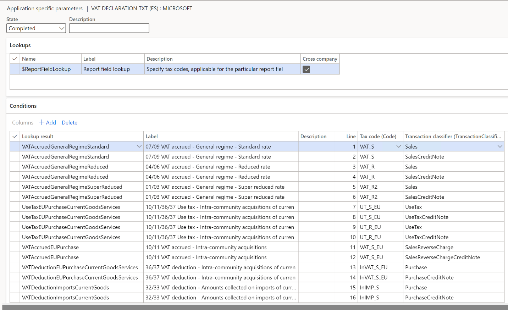

---
# required metadata

title: VAT declaration (Spain)
description: This topic describes how to set up and generate a value-added tax (VAT) declaration model 303 for Spain in the official TXT format.
author: anasyash
ms.date: 01/15/2022
ms.topic: article
audience: 
ms.reviewer: kfend 
ms.search.region: Global
ms.author: anasyash
ms.search.validFrom: 
---

# VAT declaration (Spain)

[!include [banner](../includes/banner.md)]

This topic describes how to set up and generate a value-added tax (VAT) declaration model 303 for Spain in the official TXT format. It also describes how to preview the VAT declaration in Microsoft Excel.

To automatically generate the report, first create enough sales tax codes to keep a separate VAT accounting for each box on the advance VAT declaration. Additionally, in the application-specific parameters of the Electronic reporting (ER) format for the advance VAT declaration, associate sales tax codes with the lookup result of the lookups for the boxes on the VAT declaration.

For Spain, you must configure **Report field lookup**. For more information about how to set up application-specific parameters, see the [Set up application-specific parameters for VAT declaration fields](#set-up) section later in this topic.

In the following table, the "Lookup result" column shows the lookup result that is preconfigured for a specific VAT declaration row in the VAT declaration format. Use this information to correctly associate sales tax codes with the lookup result and then with the row of the VAT declaration.

### VAT declaration overview

The advance VAT declaration in Spain contains the following information.

**SECTION – SETTLEMENT**

**VAT accrued**

| Box – tax base     | Box – rate %       | Box – tax amount | Description                                                                           | Lookup result / Total                                                                                                 |
|--------------------|--------------------|------------------|---------------------------------------------------------------------------------------|-----------------------------------------------------------------------------------------------------------------------|
| 01                 | 02                 | 03               | VAT accrued - General regime - Super reduced rate.                                    | VATAccruedGeneralRegimeSuperReduced UseTaxGeneralRegimeSuperReduced (also reported in boxes 28/29)                                     |
| 04                 | 05                 | 06               | VAT accrued - General regime - Reduced rate.                                          | VATAccruedGeneralRegimeReduced UseTaxGeneralRegimeReduced (also reported in boxes 28/29)                                               |
| 07                 | 08                 | 09               | VAT accrued - General regime - Standard rate.                                         | VATAccruedGeneralRegimeStandard UseTaxGeneralRegimeStandard (also reported in boxes 28/29)                                             |
| 10                 | Not applicable     | 11               | VAT accrued - Intra-community acquisitions of goods and services.                     | VATAccruedEUPurchase  UseTaxEUPurchaseCurrentGoodsServices (also reported in boxes 36/37) UseTaxEUPurchaseInvestmentGoods (also reported in boxes 38/39) |
| 12                 | Not applicable     | 13               | VAT accrued - Other operations with investment by the taxpayer (except EU purchases). | VATAccruedOtherOperationsInvestment UseTaxOtherOperationsInvestment (also reported in boxes 38/39)                                     |
| 14                 | Not applicable     | 15               | Modification of bases and fees                                                        | VATAccruedModifications UseTaxModificationsGoodsServices (also reported in boxes 36/37) UseTaxModificationsInvestment (also reported in boxes 38/39)    |
| 16                 | 17                 | 18               | Equivalence surcharge - Super reduced rate.                                           | EquivalenceSurchargeSuperReduced                                                                                      |
| 19                 | 20                 | 21               | Equivalence surcharge - Reduced rate.                                                 | EquivalenceSurchargeReduced                                                                                           |
| 22                 | 23                 | 24               | Equivalence surcharge - Standard rate.                                                | EquivalenceSurchargeStandard                                                                                          |
| 25                 | Not applicable     | 26               | Modifications bases and fees of the equivalence surcharge.                            | EquivalenceSurchargeModifications                                                                                     |
| **Not applicable** | **Not applicable** | **27**           | **Total VAT accrued.**                                                                | **[03] + [06] + [09] + [11] + [13] + [15] + [18] + [21] + [24] + [26]**                                               |

**VAT deductible**

| Box – tax base     | Box – tax amount | Description                                                                            | Lookup result / Total                                                                                                                                                  |
|--------------------|------------------|----------------------------------------------------------------------------------------|------------------------------------------------------------------------------------------------------------------------------------------------------------------------|
| 28                 | 29               | VAT deduction - Amounts collected in current internal operations.                      | VATDeductionCurrentInternalOperations UseTaxGeneralRegimeSuperReduced (also reported in boxes 01/03) UseTaxGeneralRegimeReduced (also reported in boxes 04/06) UseTaxGeneralRegimeStandard (also reported in boxes 07/09) |
| 30                 | 31               | VAT deduction - Amounts collected in internal operations with investment goods.        | VATDeductionInvestmentInternalOperations                                                                                                                               |
| 32                 | 33               | VAT deduction - Amounts collected on imports of current goods.                         | VATDeductionImportsCurrentGoods                                                                                                                                        |
| 34                 | 35               | VAT deduction - Amounts collected on imports of investment goods.                      | VATDeductionImportsInvestmentGoods                                                                                                                                     |
| 36                 | 37               | VAT deduction - Intra-community acquisitions of current goods and services.            | VATDeductionEUPurchaseCurrentGoodsServices UseTaxEUPurchaseCurrentGoodsServices (also reported in boxes 10/11) UseTaxEUPurchaseInvestmentGoods (also reported in boxes 10/11)                            |
| 38                 | 39               | VAT deduction - Intra-community acquisitions of investment goods.                      | VATDeductionEUPurchaseInvestmentGoods                                                                                                                                  |
| 40                 | 41               | VAT deduction - Rectification of deductions.                                           | VATDeductionRectification                                                                                                                                              |
| Not applicable     | 42               | 42 VAT deduction - Compensations Special Regime A.G. and P.                            | VATDeductionSpecialRegime                                                                                                                                              |
| Not applicable     | 43               | VAT deduction - Regularization on investment.                                          | VATDeductionRegularizationInvestment                                                                                                                                   |
| Not applicable     | 44               | VAT deduction - Annual regularization by application of the final pro rata percentage. | VATDeductionAnnualRegularizationProRata                                                                                                                                |
| **Not applicable** | **45**           | **Total to deduct.**                                                                   | **[29] + [31] + [33] + [35] + [37] + [39] + [41] + [42] + [43] + [44]**                                                                                                |
| **Not applicable** | **46**           | **General regime result.**                                                             | **[27] – [45]**                                                                                                                                                        |

**SECTION – ADDITIONAL INFORMATION**

| Box – tax base | Description                                                                      | Lookup result / User input parameter              |
|----------------|----------------------------------------------------------------------------------|---------------------------------------------------|
| 58        | Simplified regime result                                                     | User input parameter in the report dialog box |
| 59             | Intra-community deliveries of goods and services.                                | EUSales                                           |
| 60             | Exports and similar operations.                                                  | Exports                                           |
| 61             | Exempt operations or investments that give rise to the right to deduct.          | ExemptOperations                                  |
| 120            | Operations not subject to localization rules (except those included in box 123). | OperationsNotSubjectToLocalizationRules           |
| 122            | Operations subject to investment by the taxpayer.                                | OperationsSubjectToInvestmentByTaxpayer           |
| 123            | Operations not subject to localization rules covered by the OSS regimes.         | OperationsNotOSS                                  |
| 124            | Operations subject to and covered by the special OSS.                            | OperationsOSS                                     |

**SECTION – RESULT**

| Box – tax amount | Description                                                                                                                             | Lookup result / User input parameters / Total                                                         |
|------------------|-----------------------------------------------------------------------------------------------------------------------------------------|-------------------------------------------------------------------------------------------------------|
| 76               | Regularization of taxes according to art. 80.5 LIVA.                                                                                    | Regularizations80.5                                                                                   |
| **64**           | **Sum of results.**                                                                                                                     | **[46] + [58] + [76]**                                                                                |
| 65               | Not applicable                                                                                                                          | **Common territory** user input parameter in the report dialog box. The default value is 100 percent. |
| 66               | Attributable to the State Administration.                                                                                               | [64] × [65]                                                                                           |
| 77               | Import VAT settled by Customs pending entry.                                                                                            | ImportVATSettledByCustoms                                                                             |
| 68               | Annual regularization.                                                                                                                  | AnnualRegularization                                                                                  |
| 110              | Amounts to be compensated pending from previous periods.                                                                                | **Previous period amounts to compensate** user input parameter in the report dialog box               |
| 78               | Amounts to be offset from previous periods applied in this period.                                                                      | **Previous period amounts to offset** user input parameter in the report dialog box                   |
| **87**           | **Quotas to be offset from previous periods pending for subsequent periods.**                                                           | **[110] – [78]**                                                                                      |
| 68               | Exclusively for taxpayers who pay jointly to the State Administration and the Provincial Councils. Result of the annual regularization. | AnnualRegularization                                                                                  |
| **69**           | **Result.**                                                                                                                             | **[66] + [77] – [78] + [68]**                                                                         |
| 70               | To deduct (Exclusively in the case of supplementary self-assessment. Result of the previous statements.)                                | **To deduct supplementary declaration** user input parameter in the report dialog box                 |
| **71**           | **Settlement result.**                                                                                                                  | **[69] – [70]**                                                                                       |

#### Purchase reverse charge VAT

If you configure sales tax codes to post incoming reverse charge VAT by using use tax, associate your sales tax codes with the lookup result of **Report field lookup** that contains "UseTax" in the name.

Alternatively, you can configure two separate sales tax codes: one for VAT due and one for VAT deduction. Then associate each code with the corresponding lookup results of **Report field lookup**.

For example, for taxable intra-community acquisitions at a standard rate, you configure sales tax code **UT_S_EU** with use tax and associate it with the **UseTaxEUPurchaseCurrentGoodsServices** lookup result of **Report field lookup**. In this case, amounts that use the **UT_S_EU** sales tax code are reflected in boxes 10, 11, 36, and 37

Alternatively, you configure two sales tax codes:

- **VAT_S_EU**, which has a tax rate value of -21 percent
- **InVAT_S_EU**, which has a tax rate value of 21 percent

You then associate the codes with lookup results of **Report field lookup** in the following way:

- Associate **VAT_S_EU** with the **VATAccruedEUPurchase** lookup result.
- Associate **InVAT_S_EU** with the **VATDeductionEUPurchaseCurrentGoodsServices** lookup result.

In this case, amounts that use the **VAT_S_EU** sales tax code are reflected in boxes 10 and 11. Amounts that use the **InVAT_S_EU** sales tax code are reflected in boxes 36 and 37.

For more information about how to configure reverse charge VAT, see [Reverse charges](emea-reverse-charge.md).

## Configure system parameters

To generate a VAT declaration, you must configure the tax number (Numero de Identificacion Fiscal [NIF]) of your organization.

1. Go to **Organization administration** > **Organizations** > **Legal entities**.
2. Select the legal entity, and then select **Registration IDs**.
3. Select or create the address in Spain and then, on the **Registration ID** FastTab, select **Add**.
4. In the **Registration type** field, select the registration type that is dedicated to Spain and that uses the **VAT Id** registration category.
5. In the **Registration number** field, enter the tax number.
6. On the **General** tab, in the **Effective** field, enter the date when the number becomes effective.

For more information about how to set up registration categories and registration types, see [Registration IDs](emea-registration-ids.md).

## Set up a VAT declaration for Spain

### Import ER configurations

Open the **Electronic reporting** workspace, and import the latest versions of these ER formats:

- VAT Declaration Excel (ES)
- VAT Declaration TXT (ES)

For more information, see [Download ER configurations from the Global repository of Configuration service](../../fin-ops-core/dev-itpro/analytics/er-download-configurations-global-repo.md).

### Set up application-specific parameters for VAT declaration fields

To automatically generate a VAT declaration, associate sales tax codes in the application and lookup results in the ER configuration.

> [!NOTE]
> We recommend that you enable the **Use application specific parameters from previous versions of ER formats** feature in the **Feature management** workspace. When this feature is enabled, parameters that are configured for an earlier version of an ER format automatically become applicable for a later version of the same format. If this feature isn't enabled, you must explicitly configure application-specific parameters for each format version. The **Use application specific parameters from previous versions of ER formats** feature is available in the **Feature management** workspace as of Finance version 10.0.23. For more information about how to set up the parameters of an ER format for each legal entity, see [Set up the parameters of an ER format per legal entity](../../fin-ops-core/dev-itpro/analytics/er-app-specific-parameters-set-up.md).

Follow these steps to define which sales tax codes generate which boxes on the VAT declaration.

1. Go to **Workspaces** > **Electronic reporting**, and select **Reporting configurations**.
2. Select the **VAT declaration TXT (ES)** configuration, and then select **Configurations \> Application specific parameters setup**.
3. On the **Application specific parameters** page, on the **Lookups** FastTab, select **Report field lookup**.
4. On the **Conditions** FastTab, set the following fields to associate the sales tax codes and report fields.

   | Field                  | Description                                                                                                                                                                                                                                                                                                          |
   |------------------------|----------------------------------------------------------------------------------------------------------------------------------------------------------------------------------------------------------------------------------------------------------------------------------------------------------------------|
   | Lookup result          | Select the value of the report field. For more information about the values and their assignment to VAT declaration rows, see the [VAT declaration overview](#vat-declaration-overview) section earlier in this topic.                                                                                               |
   | Tax code               | Select the sales tax code to associate with the report field. Posted tax transactions that use the selected sales tax code will be collected in the appropriate declaration box. We recommend that you separate sales tax codes in such a way that one sales tax code generates amounts in only one declaration box. |
   | Transaction classifier | If you created enough sales tax codes to determine a declaration box, select **\*Not blank\***. If you didn't create enough sales tax codes so that one sales tax code generates amounts in only one declaration box, you can set up a transaction classifier. The following transaction classifiers are available:  -   **Purchase** -   **PurchaseExempt** (tax-exempt purchase) -   **PurchaseReverseCharge** (tax receivable from a purchase reverse charge) -   **Sales** -   **SalesExempt** (tax-exempt sale) -   **SalesReverseCharge** (tax payable from a purchase reverse charge or a sales reverse charge) -   **Use tax**.  For each transaction classifier, a classifier for the credit note is also available. For example, one of these classifiers is **PurchaseCreditNote** (purchase credit note). Be sure to create two lines for each sales tax code: one that has the transaction classifier value and one that has the transaction classifier for credit note value. |

   > [!NOTE]
   > Associate all sales tax codes with lookup results. If any sales tax codes should not generate values on the VAT declaration, associate them with the **Other** lookup result.

    

5. In the **State** field, change the value to **Completed**.
6. On the Action Pane, select **Export** to export the settings of the application-specific parameters.
7. Select the **VAT declaration Excel (ES)** configuration, and then, on the Action Pane, select **Import** to import the parameters that you configured for **VAT declaration XML (ES)**.
8. In the **State** field, select **Completed**.

### Set up the VAT reporting format for preview amounts in Excel

1. In the **Feature management** workspace, find and select the **VAT statement format reports** feature in the list, and then select **Enable now**.
2. Go to **General ledger** > **Setup** > **General ledger parameters**.
3. On the **Sales tax** tab, on the **Tax options** FastTab, in the **VAT statement format mapping** field, select the **VAT declaration Excel (ES)** ER format.

   This format is printed when you run the **Report sales tax for settlement period** report. It's also printed when you select **Print** on the **Sales tax payments** page.

4. On the **Tax authorities** page, select the tax authority, and then, in the **Report layout** field, select **Default**.

If you're configuring the VAT declaration in a legal entity that has [multiple VAT registrations](emea-reporting-for-multiple-vat-registrations.md),
follow these steps.

1. Go to **General ledger** \> **Setup** \> **General ledger parameters**.
2. On the **Sales tax** tab, on the **Electronic reporting for countries/regions** FastTab, on the line for **ESP**, select the **VAT Declaration Excel (ES)** ER format.

## Set up electronic messages

### Download and import the data package that has example settings for electronic messages

The data package contains electronic message settings that are used to generate the VAT declaration in XML format and preview it in Excel. You can extend these settings or create your own. For more information about how to work with electronic messaging and create your own settings, see [Electronic messaging](../general-ledger/electronic-messaging.md).

1. In [Microsoft Dynamics Lifecycle Services (LCS)](https://lcs.dynamics.com/v2), in the Shared asset library, select **Data package** as the asset type, and then download **ES VAT declaration EM package**. The downloaded file is named **ES VAT declaration EM package.zip**.
2. In Dynamics 365 Finance, in the **Data management** workspace, select **Import**.
3. On the **Import** FastTab, in the **Group name** field, enter a name for the job.
4. On the **Selected entities** FastTab, select **Add file**.
5. In the **Add file** dialog box, verify that the **Source data format** field is set to **Package**, select **Upload and add**, and then select the zip file that you downloaded earlier.
6. Select **Close**.
7. After the data entities are uploaded, on the Action Pane, select **Import**.
8. Go to **Tax** > **Inquiries and reports** > **Electronic messages** > **Electronic messages**, and validate the electronic message processing that you imported (**ES VAT declaration**).

### Configure electronic messages

1. Go to **Tax** \> **Setup** \> **Electronic messages** \> **Populate records actions**.
2. Select the line for **ES Populate VAT return records**, and then select **Edit query**.
3. Use the filter to specify the settlement periods to include on the report.
4. If you must report tax transactions from other settlement periods in a different declaration, create a new **Populate records** action, and select the appropriate settlement periods.

## Preview the VAT declaration in Excel

### Preview the VAT declaration in Excel from the Report sales tax for settlement period periodic task

1. Go to **Tax** \> **Periodic tasks** \> **Declarations** \> ****Sales tax \> **Report sales tax for settlement period**.
2. Set the following fields.

   | Field                                 | Description                                                                                                                                                                                                                          |
   |---------------------------------------|--------------------------------------------------------------------------------------------------------------------------------------------------------------------------------------------------------------------------------------|
   | Settlement period                     | Select the settlement period.                                                                                                                                                                                                        |
   | Sales tax payment version             | Select one of the following values: -**Original** – Generate a report for the sales tax transactions of the original sales tax payment or before the sales tax payment is generated. -**Corrections** – Generate a report for the sales tax transactions of all the subsequent sales tax payments for the period. -**Total list** – Generate a report for all the sales tax transactions for the period, including the original and all corrections.|
   | From date                             | Select the start date of the reporting period.                                                                                                                                                                                       |
   | Previous period amounts to compensate | Enter the amount that should be exported to box 110, "Amounts to be compensated pending from previous periods."                                                                                                                      |
   | Previous period amounts to offset     | Enter the amount that should be exported to box 78, "Amounts to be offset from previous periods applied in this period."                                                                                                             |
   | Common territory                      | Enter the amount of the percentage volume of operations in the common territory that should be exported to box 65. This percentage is used to calculate the amount in box 66, "Tax amount attributable to the State Administration." |
   | Simplified regime result              | Enter the amount that should be exported to box 58.                                                                                                                                                                                  |
   | To deduct supplementary declaration   | Enter the amount that should be exported to box 70, "To deduct (Exclusively in the case of supplementary self-assessment. Result of the previous statements.)."                                                                      |

3. Select **OK**, and review the Excel report.

### Settle and post sales tax

1. Go to **Tax** \> **Periodic tasks** \> **Declarations** \> **Sales tax** \> **Settle and post sales tax**.
2. Set the following fields.

   | Field                     | Description                                    |
   |---------------------------|------------------------------------------------|
   | Settlement period         | Select the settlement period.                  |
   | Sales tax payment version | Select one of the following values: -   **Original** – Generate the original sales tax payment for the settlement period.   -   **Latest corrections** – Generate a correction sales tax payment after the original sales tax payment for the settlement period was created.       |
   | From date                 | Select the start date of the reporting period. |

3. Select **OK**.

### Preview the VAT declaration in Excel from a sales tax payment

1. Go to **Tax** \> **Inquiries and reports** \> **Sales tax inquiries** \> **Sales tax payments**, and select a sales tax payment line.
2. Select **Print report**, and then select **OK**.
3. Review the Excel file that is generated for the selected sales tax payment line.

   > [!NOTE]
   > The report is generated only for the selected line of the sales tax payment. If you must generate, for example, a corrective declaration that contains all corrections for the period, or a replacement declaration that contains original data and all corrections, use the **Report sales tax for settlement period** periodic task.

## Generate a VAT declaration from electronic messages

When you use electronic messages to generate the report, you can collect tax data from multiple legal entities. For more information, see the [Run a VAT declaration for multiple legal entities](#run-a-vat-declaration-for-multiple-legal-entities) section later in this topic.

The following procedure applies to the electronic message processing example that you imported earlier from the LCS Shared asset library.

1. Go to **Tax** > **Inquiries and reports** > **Electronic messages** > **Electronic messages**.
2. In the left pane, select **ES VAT declaration**.
3. On the **Messages** FastTab, select **New**, and then, in the **Run processing** dialog box, select **OK**.
4. Select the message line that is created, enter a description, and then specify the start and end dates for the declaration.

   > [!NOTE]
   > Steps 5 through 7 are optional.

5. Optional: On the **Messages** FastTab, select **Collect data**, and then select **OK**. The sales tax payments that were generated earlier are added to the message. For more information, see the [Settle and post sales tax](#settle-and-post-sales-tax) section earlier in this topic. If you skip this step, you can still generate a VAT declaration by using the **Tax declaration version** field in the **Declaration** dialog box.
6. Optional: On the **Message items** FastTab, review the sales tax payments that are transferred for processing. By default, all sales tax payments of the selected period that weren't included in any other message of the same processing are included.
7. Optional: Select **Original document** to review the sales tax payments, or select **Delete** to exclude sales tax payments from processing. If you skip this step, you can still generate a VAT declaration by using the **Tax declaration version** field in the **Declaration** dialog box.
8. On the **Messages** FastTab, select **Update status**. In the **Update status** dialog box, select **Ready to generate**, and then select **OK**. Verify that the message status is changed to **Ready to generate**.
9. Select **Generate report**. To preview the VAT declaration amounts, in the **Run processing** dialog box, select **Preview report**, and then select **OK**.
10. In the **Electronic reporting parameters** dialog box, set the fields as described in the [Preview the VAT declaration in Excel from the Report sales tax for settlement period periodic task](#preview-the-vat-declaration-in-excel-from-the-report-sales-tax-for-settlement-period-periodic-task) section earlier in this topic, and then select **OK**.
11. Select the **Attachments** button (paper clip symbol) in the upper-right corner of the page, and then select **Open** to open the file.
12. Review the amounts in the Excel document, and then select **Generate report**.
13. To generate a VAT declaration in XML format, in the **Run processing** dialog box, select **Generate report**, and then select **OK**.
14. In the **Electronic reporting parameters** dialog box, set the following fields.

      | **Field**                                                                          | **Description**                                                                                                                                                                                                                      |
      |------------------------------------------------------------------------------------|--------------------------------------------------------------------------------------------------------------------------------------------------------------------------------------------------------------------------------------|
      | Settlement period                                                                  | Select the settlement period. If you selected **Collect data** in step 5, you can disregard this field. The report will be generated for the sales tax transactions that are included in the collected sales tax payments.           |
      | Tax declaration version                                                            | Select one of the following values:      -   **Original** – Generate a report for the sales tax transactions of the original sales tax payment or before the sales tax payment is generated.  -   **Corrections** – Generate a report for the sales tax transactions of all the subsequent sales tax payments for the period.     -   **Total list** – Generate a report for all the sales tax transactions for the period, including the original and all corrections. |
      | Type of declaration                                                                | Select the type of declaration:   -   **Income** – Select this value if the VAT settlement result is positive. This value is the default value. -   **Refund** – Select this value if the VAT settlement result is negative, and you're requesting a refund. -   **Request for compensation** – Select this value if the VAT settlement result is negative, and you aren't requesting a refund. -   **No activity** – Select this value if there was no activity during the period. -   **Tax current account – income** – Select this value if the VAT settlement result is positive, and tax flows are managed on a specific bank account. -   **Tax current account – refund** – Select this value if the VAT settlement result is negative, and tax flows are managed on a specific bank account.|
      | Taxpayer registered in the Monthly Refund Register                                 | Set this option to **Yes** or **No**.                                                                                                                                                                                                |
      | Joint self-assessment                                                              | Set this option to **Yes** if this declaration is a joint self-assessment.                                                                                                                                                           |
      | Taxpayer is under the special regime of the Cash criterion                         | Set this option to **No**.                                                                                                                                                                                                           |
      | Taxpayer is recipient of operations under the special regime of the cash criterion | Set this option to **No**.                                                                                                                                                                                                           |
      | Taxpayer voluntarily registered in the SII                                         | Set this option to **Yes** or **No**.                                                                                                                                                                                                |
      | Taxpayer exempted from the annual VAT return                                       | Set this option to **Yes** or **No**.                                                                                                                                                                                                |
      | Taxpayer with annual volume of operations other than zero                          | Set this option to **Yes** or **No**.                                                                                                                                                                                                |
      | Previous period amounts to compensate                                              | Enter the amount that should be exported to box 110, "Amounts to be compensated pending from previous periods."                                                                                                                      |
      | Previous period amounts to offset                                                  | Enter the amount that should be exported to box 78, "Amounts to be offset from previous periods applied in this period."                                                                                                             |
      | Common territory                                                                   | Enter the amount of the percentage volume of operations in the common territory that should be exported to box 65. This percentage is used to calculate the amount in box 66, "Tax amount attributable to the State Administration." |
      | Simplified regime result                                                           | Enter the amount that should be exported to box 58.                                                                                                                                                                                  |
      | Supplementary declaration                                                          | Set this option to **Yes** or **No**.                                                                                                                                                                                                |
      | Previous declaration supporting number                                             | Enter the number of the previous declaration that the supplementary declaration is being generated for.                                                                                                                              |
      | To deduct supplementary declaration                                                | Enter the amount that should be exported to box 70, "To deduct (Exclusively in the case of supplementary self-assessment. Result of the previous statements.)."                                                                      |
      | Declaration of no activity                                                         | Set this option to **Yes** or **No**.                                                                                                                                                                                                |
15. Select the **Attachments** button (paper clip symbol) in the upper-right corner of the page, download the file, and use it for your submission to the tax authority.

## Run a VAT declaration for multiple legal entities

To use the formats to report the VAT declaration for a group of legal entities, you must first set up the application-specific parameters of the ER formats for sales tax codes from all required legal entities.

### Set up electronic messages to collect tax data from several legal entities

Follow these steps to set up electronic messages to collect data from multiple legal entities.

1. Go to **Workspaces** \> **Feature management**.
2. Find and select the **Cross-company queries for the populate records actions** feature in the list, and then select **Enable now**.
3. Go to **Tax** \> **Setup** \> **Electronic messages** \> **Populate records actions**.
4. On the **Populate records action** page, select the line for **ES Populate VAT return records**.

   In the **Datasources setup** grid, a new **Company** field is available. For existing records, this field shows the identifier of the current legal entity.

5. In the **Datasources setup** grid, add a line for each additional legal entity that must be included in reporting. For each new line, set the following fields.

   | Field                  | Description                                                                                                                   |
   |------------------------|-------------------------------------------------------------------------------------------------------------------------------|
   | Name                   | Enter a value that will help you understand where this record comes from. For example, enter **VAT payment of Subsidiary 1**. |
   | Message item type      | Select **VAT return**. This value is the only value that is available for all the records.                                    |
   | Account type           | Select **All**.                                                                                                               |
   | Master table name      | Specify **TaxReportVoucher** for all the records.                                                                             |
   | Document number field  | Specify **Voucher** for all the records.                                                                                      |
   | Document date field    | Specify **TransDate** for all the records.                                                                                    |
   | Document account field | Specify **TaxPeriod** for all the records.                                                                                    |
   | Company                | Select the ID of the legal entity.                                                                                            |
   | User query             | This checkbox is automatically selected when you define criteria by selecting **Edit query**.                                 |

6. For each new line, select **Edit query**, and specify a related settlement period for the legal entity that is specified in the **Company** field on the line.

   When the setup is completed, the **Collect data** function on the **Electronic messages** page collects sales tax payments from all legal entities that you defined.

[!INCLUDE[footer-include](../../includes/footer-banner.md)]
