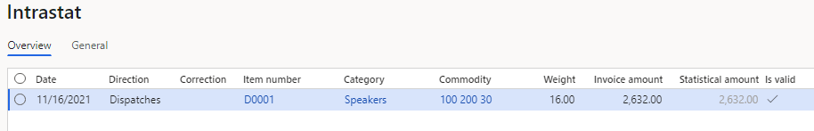
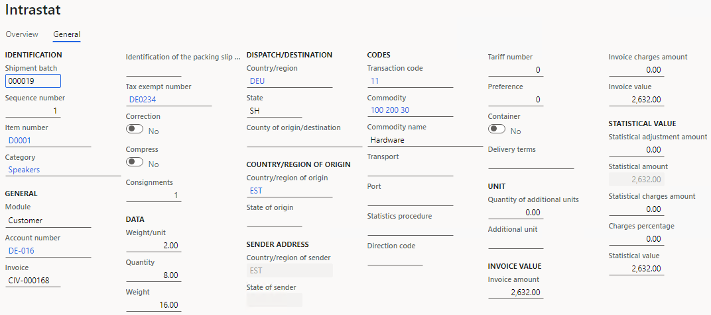
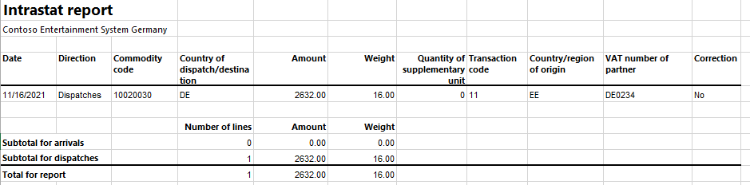
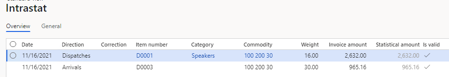
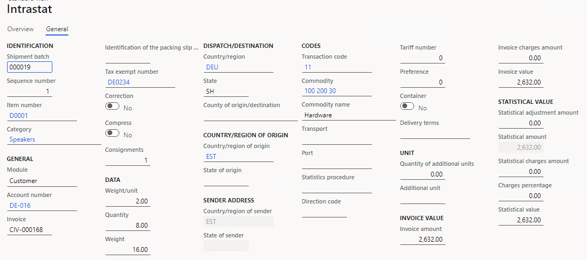
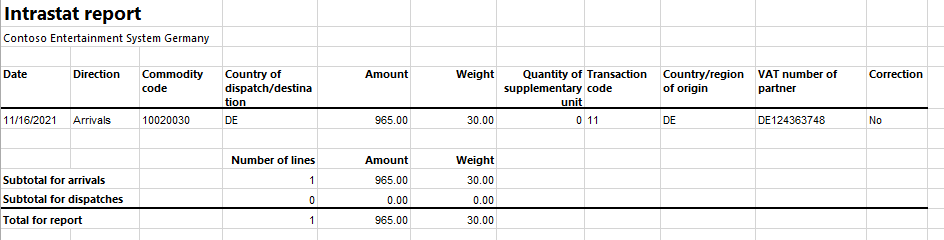

# Estonian Intrastat

[!include [banner](../includes/banner.md)]

The **Intrastat** page is used to generate and report information about trade among European Union (EU) countries/regions. The Estonian Intrastat declaration contains information about the trade of goods for reporting.

The following fields are included in the Estonian Intrastat declaration. All the fields except **VAT number of trading partner** are included for both arrivals and dispatches. The **VAT number of trading partner** field is included only for dispatches.

| Field name                    | Description                                                                                                          |
|-------------------------------|----------------------------------------------------------------------------------------------------------------------|
| EU member state               | The International Organization for Standardization (ISO) code of the country or region of the counterparty.          |
| VAT number of trading partner | The customer's foreign value-added tax (VAT) number in an EU member state.                                           |
| Nature of transaction         | The transaction code.                                                                                                |
| Country of origin             | The ISO code of the country or region where the goods were produced.                                                 |
| Commodity code                | The commodity code according to the Combined Nomenclature (CN) classification. This code is set on the product page. |
| Net mass                      | The net mass of the goods item in kilograms. The unit itself ("kg") isn't printed.                                   |
| Supplementary quantity        | The quantity in the supplementary unit of measure.                                                                   |
| Unit                          | The code of the unit of measure for the supplementary units.                                                         |
| Invoice amount                | The invoice value in euros.                                                                                          |
| Description of goods          | The trade name of the commodity.                                                                                     |
| Remark                        | This field is blank.                                                                                                 |

## Prerequisites

For the Estonian Intrastat report, the official regulations required that unique codes be used to report supplementary unit measures.

1. Go to **Organization administration** > **Setup** > **Units**.
2. Create supplementary unit measures for your products. In the **Unit** field, enter the Intrastat code for the measure. The value of the **Unit** field is printed in the **Unit** section of the Intrastat report. If the reported good doesn't require supplementary units, code **ZZZ** is automatically printed. You don't have to set up this code.

## Set up Intrastat

From the Global repository, import the latest version of the following Electronic reporting (ER) configurations:

- Intrastat model
- Intrastat report
- Intrastat (EE)

For more information, see [Download ER configurations from the Global repository of Configuration service](../../fin-ops-core/dev-itpro/analytics/er-download-configurations-global-repo.md).

### Set up VAT IDs

#### Set up the VAT number of a trading partner

##### Create a registration type for the company code

You must create VAT ID registration types for all the countries or regions that your company does business with.

1. In Microsoft Dynamics 365 Finance, go to **Organization administration** > **Global address book** > **Registration types** > **Registration types**.
2. On the Action Pane, select **New** to create a registration type for the VAT ID.
3. In the **Enter registration type details** dialog box, in the **Name** field, enter a name for the new registration type. For example, enter **VAT ID**.
4. In the **Country/region** field, select the country or region that your company does business with.
5. Select **Create**.

##### Match the registration type with a registration category

1. Go to **Organization administration** > **Global address book** > **Registration types** > **Registration categories**.
2. On the Action Pane, select **New** to create a link between a registration type and a registration category.
3. For the registration type for the VAT ID, select the **VAT ID** registration category.
4. Repeat steps 2 through 3 for the other registration types that you created for the countries or regions that your company does business with.

##### Create a customer's VAT registration number

1. Go to **Accounts receivable** > **Customers** > **All customers**.
2. In the grid, select a customer.
3. On the Action Pane, on the **Customer** tab, in the **Registration** group, select **Registration IDs**.
4. On the **Registration ID** FastTab, select **Add** to create a registration ID.
5. In the **Registration type** field, select the registration type that you created for the company code earlier in this article.
6. In the **Registration number** field, enter the company's VAT number.
7. On the Action Pane, select **Save**. Then close the page.

For more information, see [Registration IDs](emea-registration-ids.md).

Alternatively, you can create a customer's VAT registration number on the **Tax exempt number** page.

1. Go to **Tax** > **Setup** > **Sales tax** > **Tax exempt numbers**.
2. For each tax-exempt number, create a record that includes the following information:

    - In the **Country/region** field, select the tax registration of the counterparty.
    - In the **Tax exempt number** field, enter the tax-exempt number of the counterparty.
    - In the **Company name** field, enter the name of the counterparty.

3. Go to **Accounts receivable** > **Customers** > **All customers**.
4. In the grid, select a customer.
5. On the **Invoice and delivery** FastTab, in the **Sales tax** section, in the **Tax exempt number** field, select the registration number that you created earlier.

## Set up product parameters for the Intrastat declaration

1. Go to **Product information management** > **Products** > **Released products**.
2. In the grid, select a product.
3. On the **Foreign trade** FastTab, in the **Intrastat** section, in the **Commodity** field, select the commodity code. The name of the commodity will be printed in the **Description of goods** field on the Intrastat report.
4. In the **Statistics procedure** field, select the statistical sign, if it's required.
5. In the **Origin** section, in the **Country/region** field, select the product's country or region of origin.
6. On the **Manage inventory** FastTab, in the **Net weight** field, enter the product's weight in kilograms.

## Set up foreign trade parameters

1. Go to **Tax** > **Setup** > **Foreign trade parameters**.
2. On the **Intrastat** tab, on the **Electronic reporting** FastTab, in the **File format mapping** field, select **Intrastat (EE)**.
3. In the **Report format mapping** field, select **Intrastat report**.
4. On the **Commodity code hierarchy** FastTab, in the **Category hierarchy** field, select **Intrastat**.
5. In the **Transaction code** field, select the transaction code for property transfers. You use this code for transactions that produce actual or planned transfers of property against compensation (financial or otherwise). You also use it for corrections.
6. In the **Credit note** field, select the transaction code for the return of goods.
7. On the **Country/region properties** tab, in the **Country/region** field, list all the countries or regions that your company does business with. For each country that is part of the EU, select **EU** in the **Country/region type** field, so that the country appears on your Intrastat report. For Estonia, select **Domestic** in the **Country/region type** field.

## Set up compression of Intrastat

Go to **Tax** > **Setup** > **Foreign trade** > **Compression of Intrastat**, and select the fields that should be compared when Intrastat information is summarized. For Estonian Intrastat, select the following fields:

- Commodity
- Transaction code
- Country/region of origin
- Country/region of sender
- Correction
- Country/region
- Tax exempt number
- Invoice
- Direction

## Intrastat transfer

On the **Intrastat** page, on the Action Pane, you can select **Transfer** to automatically transfer the information about intracommunity trade from your sales orders, free text invoices, purchase orders, vendor invoices, vendor product receipts, project invoices, and transfer orders. Only documents that have an EU country as the country or region of destination or consignment will be transferred.

You can also manually enter transactions by selecting **New** on the Action Pane.

### Generate an Intrastat report

1. Go to **Tax** > **Declarations** > **Foreign trade** > **Intrastat**.
2. On the Action Pane, select **Output** &gt; **Report**.
3. In the **Intrastat Report** dialog box, enter the start date for the report.
4. Set the **Generate file** option to **Yes** to generate a .txt file, and then enter the name of the .txt file for the Intrastat report.
5. Set the **Generate report** option to **Yes** to generate an .xlsx file, and then enter a name for the file.
6. In the **Direction** field, select **Arrivals** if the report is about intracommunity arrivals or **Dispatches** if the report is about intracommunity dispatches.
7. Select **OK**, and review the generated reports.

## Example

This example shows how to post arrivals and dispatches for Intrastat by using the **DEMF** legal entity.

### Preliminary setup

1. Go to **Organization administration** > **Organization** > **Legal entities**, and select the **DEMF** legal entity.
2. On the **Addresses** FastTab, select **Edit**, and then, in the **Country/region** field, select **EST (Estonia)**.
3. Import the latest version of the following ER configurations:

    - Intrastat model
    - Intrastat report
    - Intrastat (EE)

### Set up VAT IDs

#### Create registration types for company codes

1. Go to **Organization administration** > **Global address book** > **Registration types** > **Registration types**.
2. On the Action Pane, select **New** to create a registration type for the VAT ID.
3. In the **Enter registration type details** dialog box, in the **Name** field, enter **VAT ID**.
4. In the **Country/region** field, select **DEU**.
5. In the **Restricted to** field, select **Organization**.
6. Select **Create**.

#### Match the registration type with a registration category

1. Go to **Organization administration** > **Global address book** > **Registration types** > **Registration categories**.
2. On the Action Pane, select **New** to create a link between the registration type and the registration category.
3. For the **VAT ID** registration type, select the **VAT ID** registration category.

#### Set up the customer's VAT registration number

1. Go to **Accounts receivable** > **Customers** > **All customers**.
2. In the grid, select **DE-016**.
3. On the Action Pane, on the **Customer** tab, in the **Registration** group, select **Registration IDs**.
4. On the **Registration ID** FastTab, select **Add** to create a registration ID.
5. In the **Registration type** field, select **VATID**.
6. In the **Registration number** field, enter **DE0234**.
7. On the Action Pane, select **Save**. Then close the page.

### Set up product information

1. Go to **Product information management** > **Products** > **Released** **products**.
2. In the grid, select **D0001**.
3. On the **Foreign trade** FastTab, in the **Intrastat** section, in the **Commodity** field, select **100 200 30**.
4. In the **Origin** section, in the **Country/region** field, select **EST**.
5. On the **Manage inventory** FastTab, in the **Weight measurements** section, in the **Net weight** field, enter **2**.
6. On the Action Pane, select **Save**.
7. In the grid, select **D0003**.
8. On the **Foreign trade** FastTab, in the **Intrastat** section, in the **Commodity** field, select **100 200 30**.
9. In the **Origin** section, in the **Country/region** field, select **DEU**.
10. On the **Manage inventory** FastTab, in the **Weight measurements** section, in the **Net weight** field, enter **5**.
11. On the Action Pane, select **Save**.

### Set up foreign trade parameters

1. Go to **Tax** > **Setup** > **Foreign trade** > **Foreign trade parameters**.
2. On the **Intrastat** tab, on the **General** FastTab, in the **Transaction** **code** field, select **11**.
3. On the **Electronic reporting** FastTab, in the **File format mapping** field, select **Intrastat (EE)**.
4. In the **Report format mapping** field, select **Intrastat Report**.
5. On the **Commodity code hierarchy** FastTab, verify that the **Category hierarchy** field is set to **Intrastat**.
6. On the **Country/region properties** tab, select **New**.
7. In the **Party country/region** field, select **EST**. Then, in the **Country/region type** field, select **Domestic**.
8. In the **Party country/region** field, select **DEU**. Then, in the **Country/region type** field, select **EU**.

### Change the site address

1. Go to **Warehouse management** > **Setup** > **Warehouse** &gt; **Sites**.
2. In the grid, select **1**.
3. On the **Addresses** FastTab, select **Edit**.
4. In the **Edit address** dialog box, in the **Country/region** field, select **EST**.
5. Select **OK**.

### Create a sales order with an EU customer

1. Go to **Accounts receivable** > **Orders** > **All sales orders**.
2. On the Action Pane, select **New**.
3. In the **Create sales order** dialog box, on the **Customer** FastTab, in the **Customer** section, in the **Customer account** field, select **DE-016**.
4. On the **General** FastTab, in the **Storage dimensions** section, in the **Site** field, select **1**.
5. In the **Warehouse** field, select **11**.
6. On the **Address** tab, verify that the **Address** field is set to **Teichgasse 12, Kiel, 24103, DEU**, because the customer is from Germany.
7. Select **OK**.
8. On the **Lines** tab, on the **Sales order lines** FastTab, in the **Item number** field, select **D0001**. Then, in the **Quantity** field, enter **8**.
9. On the **Line details** FastTab, on the **Foreign trade** tab, verify that the **Transaction code** field is set to **11**, the **Commodity** field is set to **100 200 30**, and the **Country/region of origin** field is set to **EST**.
10. On the Action Pane, select **Save**.
11. On the Action Pane, on the **Invoice** tab, in the **Generate** group, select **Invoice**.
12. In the **Posting invoice** dialog box, on the **Parameters** FastTab, in the **Parameter** section, in the **Quantity** field, select **All**.
13. Select **OK** to post the invoice.

### Transfer the transaction to the Intrastat journal and review the result

1. Go to **Tax** &gt; **Declarations** &gt; **Foreign trade** &gt; **Intrastat**.
2. On the Action Pane, select **Transfer**.
3. In the **Intrastat (Transfer)** dialog box, in the **Parameters** section, set the **Customer invoice** option to **Yes**.
4. Select **Filter**.
5. In the **Intrastat Filter** dialog box, on the **Range** tab, select the first line, and verify that the **Field** field is set to **Date**.
6. In the **Criteria** field, select the current date.
7. Select **OK** to close the **Intrastat Filter** dialog box.
8. Select **OK** to close the **Intrastat (Transfer)** dialog box, and review the result. The line represents the sales order that you created earlier.

   

9. Select the transaction line, and then select the **General** tab to view more details.

   

10. On the Action Pane, select **Output** &gt; **Report**.
11. In the **Intrastat Report** dialog box, on the **Parameters** FastTab, in the **Date** section, in the **From date** field, select the first day of the current month.
12. In the **To date** field, select the last day of the current month.
13. In the **Export** **options** section, set the **Generate file** option to **Yes**. Then, in the **File name** field, enter the required name.
14. Set the **Generate report** option to **Yes**. Then, in the **Report file name** field, enter the required name.
15. In the **Direction** field, select **Dispatches**.
16. Select **OK**, and review the report in text format that is generated. The following table shows the values in the example report.

    | Field name                    | Values               |
    |-------------------------------|----------------------|
    | EU member state               | DE                   |
    | VAT number of trading partner | DE0234               |
    | Nature of transaction         | 11                   |
    | Country of origin             | EE                   |
    | Commodity code                | 10020030             |
    | Net mass                      | 16                   |
    | Supplementary quantity        | 0                    |
    | Unit                          | ZZZ                  |
    | Invoice amount                | 2632                 |
    | Description of goods          | Hardware             |
    | Remark                        | This field is blank. |

17. Review the report in Excel format that is generated.

    

### Create a purchase order

1. Go to **Accounts payable** > **Purchase orders** > **All purchase orders**.
2. On the Action Pane, select **New**.
3. In the **Create purchase order** dialog box, in the **Vendor account** field, select **DE-001**.
4. In the **Site** field, select **1**.
5. In the **Warehouse** field, select **11**.
6. Select **OK**.
7. On the **Lines** tab, on the **Purchase order lines** FastTab, in the **Item number** field, select **D0003**. Then, in the **Quantity** field, enter **6**.
8. On the **Line details** FastTab, on the **Foreign trade** tab, verify that the **Transaction code** is set to **11**, the **Commodity** field is set to **100 200 30**, and the **Country/region of origin** field is set to **DEU**.
9. On the Action Pane, on the **Purchase** tab, in the **Actions** group, select **Confirm**.
10. On the Action Pane, on the **Invoice** tab, in the **Generate** group, select **Invoice**.
11. On the Action Pane, select **Default from**, and then, in the **Default quantity for lines** field, select **Ordered quantity**. Then select **OK**.
12. On the **Vendor Invoice header** FastTab, in the **Invoice identification** section, in the **Number** field, enter **0100**.
13. In the **Invoice dates** section, in the **Invoice date** field, select the current date. This date will be used for Intrastat transfer.
14. On the Action Pane, select **Post** to post the invoice.

### Create an Intrastat declaration for arrivals

1. Go to **Tax** > **Declarations** > **Foreign trade** > **Intrastat**.
2. On the Action Pane, select **Transfer**.
3. In the **Intrastat (Transfer)** dialog box, set the **Vendor invoice** option to **Yes**.
4. Select **Filter**.
5. In the **Intrastat Filter** dialog box, on the **Range** tab, select the **Vendor invoice journal** line, and verify that the **Field** field is set to **Date**.
6. In the **Criteria** field, select the current date.
7. Select **OK** to close the **Intrastat Filter** dialog box.
8. Select **OK** to transfer the transactions, and review the Intrastat journal.

    

9. Review the information on the **General** tab for the purchase order.

    

10. On the Action Pane, select **Output** > **Report**.
11. In the **Intrastat Report** dialog box, on the **Parameters** FastTab, in the **Date** section, in the **From date** field, select the first day of the current month.
12. In the **Export** **options** section, set the **Generate file** option to **Yes**. Then, in the **File name** field, enter the required name.
13. Set the **Generate report** option to **Yes**. Then, in the **Report file name** field, enter the required name.
14. In the **Direction** field, select **Arrivals**.
15. Select **OK**, and review the report in XML format that is generated. The following table shows the values in the example report.

    | Field name             | Values               |
    |------------------------|----------------------|
    | EU member state        | DE                   |
    | Nature of transaction  | 11                   |
    | Country of origin      | DE                   |
    | Commodity code         | 10020030             |
    | Net mass               | 30                   |
    | Supplementary quantity | 0                    |
    | Unit                   | ZZZ                  |
    | Invoice amount         | 965                  |
    | Description of goods   | Hardware             |
    | Remark                 | This field is blank. |

16. Review the report in Excel format that is generated.

    

[!INCLUDE[footer-include](../../includes/footer-banner.md)]
