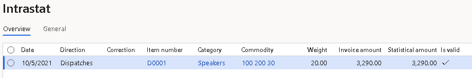
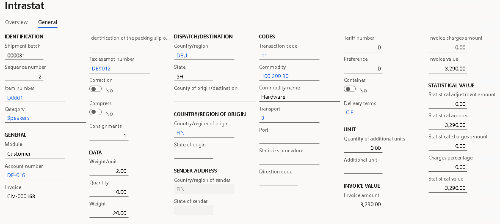
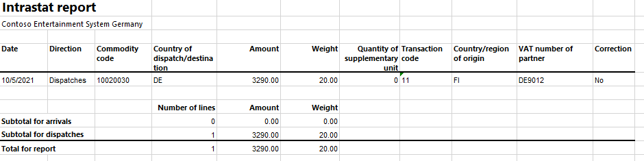
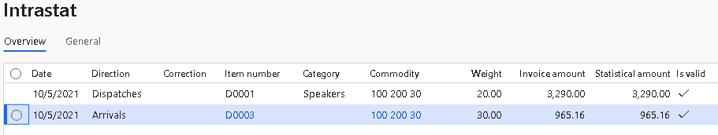
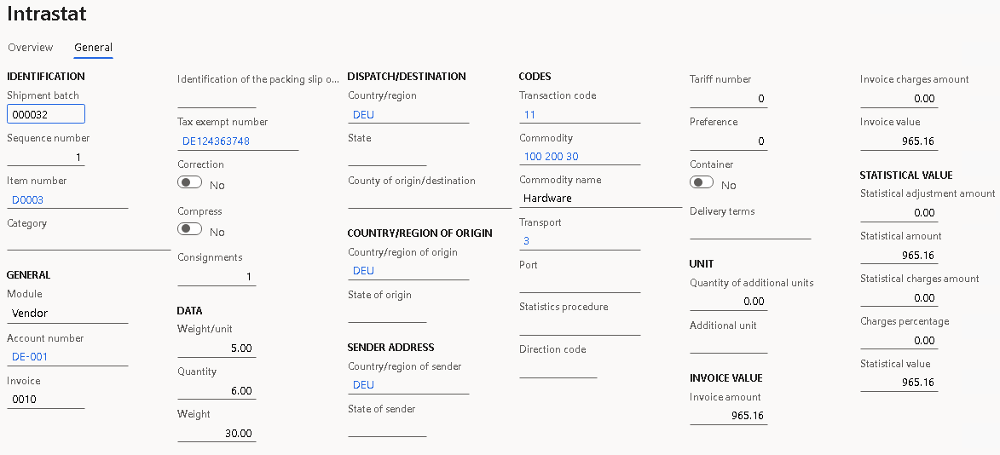
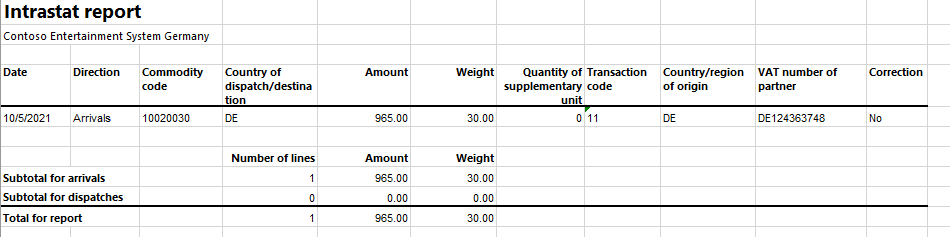

# Finnish Intrastat

[!include [banner](../includes/banner.md)]

The **Intrastat** page is used to generate and report information about trade among European Union (EU) countries/regions. The Finnish Intrastat declaration contains information about the trade of goods for reporting.

The following fields are included in the Finnish Intrastat declaration. All of the fields are included on arrivals and dispatches except for **VAT number of trading partner** which isn't included on arrivals.

| Field | Description |
|-------------------------|-------------------------|
| Data provider | The value-added tax (VAT) ID of the data provider. This ID is set on the **Registration IDs** tab of the **Legal entity** page. |
| Statistical period | The reporting period of the Intrastat report. |
| Declaration number | The direction of the Intrastat report. <ul><li>For an Intrastat report on arrivals, "1" is printed.</li><li>For an Intrastat report on dispatches, "2" is printed.</li> |
| Agent | The VAT number of the agent. This number is set in the **Tax exempt number** field on the **Agent** tab of the **Foreign trade parameters** page. |
| VAT number of trading partner | The tax-exempt number of the counterparty. |
| Commodity code | The commodity code according to the Combined Nomenclature (CN) classification. This code is set on the product page. |
| Country of consignment (arrivals) / Country of destination (dispatches) | The International Organization for Standardization (ISO) code of the country or region of the counterparty. |
| Country of origin | The ISO code of the country or region where the goods were produced. This code is set in the **Country of origin** field on the product page. |
| Nature of transaction | The transaction code. Companies in Finland use two-digit codes. |
| Mode of transport | The code of the mode of transport. Companies in Finland use one-digit transport codes. |
| Net mass | The net mass of the goods item in kilograms. The unit itself ("kg") itself isn't printed. |
| Supplementary unit | For some commodities, you must report the supplementary unit. The unit itself (for example, "pairs" or "dozens") isn't reported. |
| Invoice value | The invoice value. You can view the invoice value in the **Invoice amount** field in the Intrastat journal. |
| Statistical value | The statistical value. You can view the statistical value in the **Statistical value** field in the Intrastat journal. |

## Set up Intrastat

From the Global repository, import the latest version of the following Electronic reporting (ER) configurations:

- Intrastat model
- Intrastat report
- Intrastat (FI)

For more information, see [Download ER configurations from the Global repository of Configuration service](../../fin-ops-core/dev-itpro/analytics/er-download-configurations-global-repo.md).

### Set up VAT IDs

#### Create a registration type for the company code

1. Go to **Organization administration** > **Global address book** > **Registration types** > **Registration types**.
2. On the Action Pane, select **New** to create a registration type for the VAT ID.
3. In the **Enter registration type details** dialog box, in the **Name** field, enter a name for the new registration type. For example, enter **VAT ID**.
4. In the **Country/region** field, select **FIN**.
5. Select **Create**.

   You must also create VAT ID registration types for all the countries or regions that your company does business with.

#### Match the registration type with a registration category

1. Go to **Organization administration** > **Global address book** > **Registration types** > **Registration categories**.
2. On the Action Pane, select **New** to create a link between a registration type and a registration category.
3. For the registration type for the VAT ID, select the **VAT ID** registration category.
4. Repeat steps 2 through 3 for the other registration types that you created for the countries or regions that your company does business with.

#### Set up the VAT ID of the data provider for your company

1. Go to **Organization administration** > **Organizations** > **Legal entities**.
2. In the grid, select your company.
3. On the Action Pane, select **Registration IDs**.
4. On the **Registration ID** FastTab, select **Add**.
5. In the **Registration type** field, select the registration type that you created for the company code earlier in this article.
6. Enter the VAT ID of your company's data provider.

#### Set up the VAT number of a trading partner

##### Create a customer's VAT registration number

1. Go to **Accounts receivable** > **Customers** > **All customers**.
2. In the grid, select a customer.
3. On the Action Pane, on the **Customer** tab, in the **Registration** group, select **Registration IDs**.
4. On the **Registration ID** FastTab, select **Add** to create a registration ID.
5. In the **Registration type** field, select the registration type that you created for the company code earlier in this article.
6. In the **Registration number** field, enter the company's VAT number.
7. On the Action Pane, select **Save**. Then close the page.

For more information, see [Registration IDs](emea-registration-ids.md).

Alternatively, you can create a customer's VAT registration numbers by using the **Tax exempt number** page.

1. Go to **Tax** > **Setup** > **Sales tax** > **Tax exempt numbers**.
2. For each tax-exempt number, create a record that includes the following information:

    - **Country/region** – Select the tax registration of the counterparty.
    - **Tax exempt number** – Enter the tax-exempt number of the counterparty.
    - **Company name** – Enter the name of the counterparty.

3. Go to **Accounts receivable** > **Customers** > **All customers**.
4. In the grid, select a customer.
5. On the **Invoice and delivery** FastTab, in the **Sales tax** section, in the **Tax exempt number** field, select the registration number that you just created.

### Set up foreign trade parameters

1. Go to **Tax** > **Setup** > **Foreign trade parameters**.
2. On the **Intrastat** tab, on the **Electronic reporting** FastTab, in the **File format mapping** field, select **Intrastat (FI)**.
3. In the **Report format mapping** field, select **Intrastat report**.
4. On the **Commodity code hierarchy** FastTab, in the **Category hierarchy** field, select **Intrastat**.
5. In the **Transaction code** field, select the transaction code for property transfers. You use this code for transactions that produce actual or planned transfers of property against compensation (financial or otherwise). You also use it for corrections. Companies in Finland use two-digit transaction codes.
6. In the **Credit note** field, select the transaction code for the return of goods. You use this code for returns of goods.
7. On the **Country/region properties** tab, in the **Country/region** field, list all the countries or regions that your company does business with. For each country that is part of the EU, in the **Country/region type** field, select **EU**, so that the country appears on your Intrastat report.
8. On the **Agent** tab, add information about the company that is providing the statistical declaration. In the **Sales tax** section, in the **Tax exempt number** field, enter the VAT number of the agent.

### Set up the product parameters for the Intrastat declaration

1. Go to **Product information management** > **Products** > **Released products**.
2. In the grid, select a product.
3. On the **Foreign trade** FastTab, in the **Intrastat** section, in the **Commodity** field, select the commodity code.
4. In the **Origin** section, in the **Country/region** field, select the product's country or region of origin.
5. On the **Manage inventory** FastTab, in the **Net weight** field, enter the product's weight in kilograms.
6. Go to **Tax** > **Setup** > **Foreign trade** > **Compression of Intrastat**, and select the fields that should be compared when Intrastat information is summarized. For Finnish Intrastat, select the following fields:

    - Commodity
    - Transaction code
    - Country/region of origin
    - Transport
    - Country/region of sender
    - Country/region
    - Tax exempt number
    - Direction
    - Invoice

#### Set up the transport method

1. Go to **Tax** > **Setup** > **Foreign trade** > **Transport method**.
2. On the Action Pane, select **New**.
3. In the **Transport** field, enter a unique code. Companies in Finland use one-digit transport codes.

### Intrastat transfer

On the **Intrastat** page, on the Action Pane, you can select **Transfer** to automatically transfer the information about intracommunity trade from your sales orders, free text invoices, purchase orders, vendor invoices, vendor product receipts, project invoices, and transfer orders. Only documents that have an EU country as the country or region of destination (for dispatches) or consignment (for arrivals) will be transferred.

Alternatively, you can manually enter transactions by selecting **New** on the Action Pane.

#### Generate an Intrastat report

1. Go to **Tax** > **Declarations** > **Foreign trade** > **Intrastat**.
2. On the Action Pane, select **Output** > **Report**.
3. In the **Intrastat Report** dialog box, enter the start and end dates for the report.
4. Set the **Generate file** option to **Yes** to generate a .txt file, and then enter the name of the .txt file for the Intrastat report.
5. Set the **Generate report** option to **Yes** to generate an .xlsx file, and then enter a name for the file.
6. In the **Direction** field, select **Arrivals** if the report is about intracommunity arrivals or **Dispatches** if the report is about intracommunity dispatches.
7. Select **OK**, and review the generated reports.

## Example

This example shows how to post arrivals and dispatches for Intrastat. It uses the **DEMF** legal entity.

### Preliminary setup

1. Go to **Organization administration** > **Organization** > **Legal entities**, and select the **DEMF** legal entity.
2. On the **Addresses** FastTab, select **Edit**.
3. In the **Country/region** field, select **FIN (Finland)**.
4. Import the latest version of the following ER configurations:

    - Intrastat model
    - Intrastat report
    - Intrastat (FI)

### Set up VAT IDs

#### Create registration types for company codes

1. Go to **Organization administration** > **Global address book** > **Registration types** > **Registration types**.
2. Verify that the **VATID** registration type has been created for German VAT IDs.
3. On the Action Pane, select **New** to create a registration type for the VAT ID.
4. In the **Enter registration type details** dialog box, in the **Name** field, enter **VAT ID**.
5. In the **Country/region** field, select **FIN**.
6. Select **Create**.

#### Match the registration type with a registration category

1. Go to **Organization administration** > **Global address book** > **Registration types** > **Registration categories**.
2. Verify that the **VATID** registration type for Germany has been matched with the **VAT ID** registration category.
3. On the Action Pane, select **New** to create a link between the registration type and the registration category.
4. For the **VAT ID** registration type, select the **VAT ID** registration category.

#### Set up the VAT ID of the data provider for your company

1. Go to **Organization administration** > **Organizations** > **Legal entities**.
2. In the grid, select **DEMF**.
3. On the Action Pane, select **Registration IDs**.
4. On the **Registration ID** FastTab, select **Add**.
5. In the **Registration type** field, select **VAT ID**.
6. In the **Registration number** field, enter **FI02345678**.

#### Set up the customer's VAT registration number

1. Go to **Accounts receivable** > **Customers** > **All customers**.
2. In the grid, select **DE-016**.
3. On the Action Pane, on the **Customer** Tab, in the **Registration** group, select **Registration IDs**.
4. On the **Registration ID** FastTab, select **Add** to create a registration ID.
5. In the **Registration type** field, select **VATID**.
6. In the **Registration number** field, enter **DE9012**.
7. On the Action Pane, select **Save**. Then close the page.

### Set up foreign trade parameters

1. Go to **Tax** > **Setup** > **Foreign trade** > **Foreign trade parameters**.
2. On the **Intrastat** tab, on the **General** FastTab, in the **Transaction** **code** field, select **11**.
3. On the **Electronic reporting** FastTab, in the **File format mapping** field, select **Intrastat (FI)**.
4. In the **Report format mapping** field, select **Intrastat Report**.
5. On the **Commodity code hierarchy** FastTab, verify that the **Category hierarchy** field is set to **Intrastat**.
6. On the **Country/region properties** tab, select **New**.
7. In the **Party country/region** field, select **FIN**.
8. In the **Country/region type** field, select **Domestic**.
9. In the **Party country/region** field, select **DEU**. Then, in the **Country/region type** field, select **EU**.
10 On the **Agent** tab, on the **Agent** FastTab, in the **Sales tax** section, in the **Tax exempt number** field, enter **FI87654320**.

### Set up product information

1. Go to **Product information management** > **Products** > **Released** **products**.
2. In the grid, select **D0001**.
3. On the **Foreign trade** FastTab, in the **Intrastat** section, in the **Commodity** field, select **100 200 30**.
4. In the **Origin** section, in the **Country/region** field, select **FIN**.
5. On the **Manage inventory** FastTab, in the **Weight measurements** section, in the **Net weight** field, enter **2**.
6. On the Action Pane, select **Save**.
7. In the grid, select **D0003**.
8. On the **Foreign trade** FastTab, in the **Intrastat** section, in the **Commodity** field, select **100 200 30**.
9. In the **Origin** section, in the **Country/region** field, select **DEU**.
10. On the **Manage inventory** FastTab, in the **Weight measurements** section, in the **Net weight** field, enter **5**.
11. On the Action Pane, select **Save**.

### Change the site address

1. Go to **Warehouse management** > **Setup** > **Warehouse** > **Sites**.
2. In the grid, select **1**.
3. On the **Addresses** FastTab, select **Edit**.
4. In the **Edit address** dialog box, in the **Country/region** field, select **FIN**.
5. Select **OK**.

### Set up a transport method

1. Create a new transport method.

    1. Go to **Tax** > **Setup** > **Foreign trade** > **Transport method**.
    2. On the Action Pane, select **New**.
    3. In the **Transport** field, enter **3**.
    4. In the **Description** field, enter **Road transport**.

2. Assign the transport method to the mode of delivery. In this way, you set up the default values that are used for the transport method when the corresponding mode of delivery is selected.

    1. Go to **Procurement and sourcing** > **Setup** > **Distribution** > **Modes of delivery**.
    2. In the grid, select **10**.
    3. On the **Foreign trade** FastTab, in the **Transport** field, select **3**.

3. Select the default mode of delivery for a customer.

    1. Go to **Accounts receivable** > **Customers** > **All customers**.
    2. In the grid, select **DE-016.**
    3. On the **Invoice and delivery** FastTab, in the **Mode of delivery** field, select **10**.

4. Select the default mode of delivery for a vendor.

    1. Go to **Accounts payable** > **Vendors** > **All vendors**.
    2. In the grid, select **DE-001**.
    3. On the **Invoice and delivery** FastTab, in the **Mode of delivery** field, select **10**.

### Create a sales order with an EU customer

1. Go to **Accounts receivable** > **Orders** > **All sales orders**.
2. On the Action Pane, select **New**.
3. In the **Create sales order** dialog box, on the **Customer** FastTab, in the **Customer** section, in the **Customer account** field, select **DE-016**.
4. On the **General** FastTab, in the **Storage dimensions** section, in the **Site** field, select **1**.
5. In the **Warehouse** field, select **11**.
6. Select **OK**.
7. On the **Lines** tab, on the **Sales order lines** FastTab, in the **Item number** field, select **D0001**. Then, in the **Quantity** field, enter **10**.
8. On the **Line details** FastTab, on the **Foreign trade** tab, verify that the **Transaction code**, **Transport**, **Commodity**, and **Country/region of origin** fields are automatically set.
9. On the Action Pane, select **Save**.
10. On the Action Pane, on the **Invoice** tab, in the **Generate** group, select **Invoice**.
11. In the **Posting invoice** dialog box, on the **Parameters** FastTab, in the **Parameter** section, in the **Quantity** field, select **All**.
12. Select **OK** to post the invoice.

### Transfer the transaction to the Intrastat journal and review the result

1. Go to **Tax** > **Declarations** > **Foreign trade** > **Intrastat**.
2. On the Action Pane, select **Transfer**.
3. In the **Intrastat (Transfer)** dialog box, in the **Parameters** section, set the **Customer invoice** option to **Yes**.
4. Select **Filter**.
5. In the **Intrastat Filter** dialog box, on the **Range** tab, select the first line, and verify that the **Field** field is set to **Date**.
6. In the **Criteria** field, select the current date.
7. Select **OK** to close the **Intrastat Filter** dialog box.
8. Select **OK** to close the **Intrastat (Transfer)** dialog box, and review the result. The line represents the sales order that you created earlier.

    

9. Select the transaction line, and then select the **General** tab to view more details.

    

10. On the Action Pane, select **Output** &gt; **Report**.
11. In the **Intrastat Report** dialog box, on the **Parameters** FastTab, in the **Date** section, select the month of the sales order that you created.
12. In the **Export** **options** section, set the **Generate file** option to **Yes**. Then, in the **File name** field, enter the required name.
13. Set the **Generate report** option to **Yes**. Then, in the **Report file name** field, enter the required name.
14. In the **Direction** field, select **Dispatches**.
15. Select **OK**, and review the report in text format that is generated. The following table shows the values in the example report.

    | Field                               | Value      |
    |-------------------------------------|------------|
    | Data provider                       | FI02345678 |
    | Statistical period                  | 202110     |
    | Declaration number                  | 2          |
    | Agent                               | FI87654320 |
    | VAT number of trading partner       | DE9012     |
    | Commodity code                      | 10020030   |
    | Nature of transaction               | 11         |
    | Country of destination (dispatches) | DE         |
    | Country of origin                   | FI         |
    | Mode of transport                   | 3          |
    | Net mass                            | 20         |
    | Invoice value                       | 3290       |
    | Statistical value                   | 3290       |

16. Review the report in Excel format that is generated.

    

### Create a purchase order

1. Go to **Accounts payable** > **Purchase orders** > **All purchase orders**.
2. On the Action Pane, select **New**.
3. In the **Create purchase order** dialog box, in the **Vendor account** field, select **DE-001**.
4. Select **OK**.
5. On the **Header** tab, on the **Foreign** **trade** FastTab, verify that the **Transaction code** field is set to **11**.
6. On the **Lines** tab, on the **Purchase order lines** FastTab, in the **Item number** field, select **D0003**. Then, in the **Quantity** field, enter **6**.
7. On the **Line details** FastTab, on the **Foreign trade** tab, in the **Foreign trade** section, verify that the **Transaction code**, **Transport**, **Commodity**, and **Country/region of origin** fields are automatically set.
8. On the Action Pane, on the **Purchase** tab, in the **Actions** group, select **Confirm**.
9. On the Action Pane, on the **Invoice** tab, in the **Generate** group, select **Invoice**.
10. On the Action Pane, select **Default from**. In the **Default quantity for lines** field, select **Ordered quantity**. Then select **OK**.
11. On the **Vendor invoice header** FastTab, in the **Invoice identification** section, in the **Number** field, enter **0010**.
12. In the **Invoice dates** section, in the **Invoice date** field, select **10/5/2021** (October 5, 2021).
13. On the Action Pane, select **Post** to post the invoice.

### Create an Intrastat declaration for arrivals

1. Go to **Tax** > **Declarations** > **Foreign trade** > **Intrastat**.
2. On the Action Pane, select **Transfer**.
3. In the **Intrastat (Transfer)** dialog box, set the **Vendor invoice** option to **Yes**.
4. Select **OK** to transfer the transactions, and review the Intrastat journal.

    

5. Review the **General** tab for the purchase order.

    

6. On the Action Pane, select **Output** > **Report**.
7. In the **Intrastat Report** dialog box, on the **Parameters** FastTab, in the **Date** section, select the month of the purchase orderthat you created.
8. In the **Export** **options** section, set the **Generate file** option to **Yes**. Then, in the **File name** field, enter the required name.
9. Set the **Generate report** option to **Yes**. Then, in the **Report file name** field, enter the required name.
10. In the **Direction** field, select **Arrivals**.
11. Select **OK**, and review the report in text format that is generated. The following table shows the values in the example report.

    | Field                             | Value      |
    |-----------------------------------|------------|
    | Data provider                     | FI02345678 |
    | Statistical period                | 202110     |
    | Declaration number                | 1          |
    | Agent                             | FI87654320 |
    | Commodity code                    | 10020030   |
    | Nature of transaction             | 11         |
    | Country of consignment (arrivals) | DE         |
    | Country of origin                 | DE         |
    | Mode of transport                 | 3          |
    | Net mass                          | 30         |
    | Invoice value                     | 965        |
    | Statistical value                 | 965        |

12. Review the report in Excel format that is generated.

    
    
[!INCLUDE[footer-include](../../includes/footer-banner.md)]
