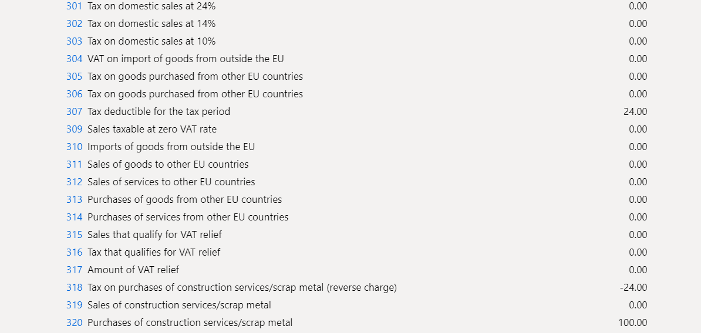
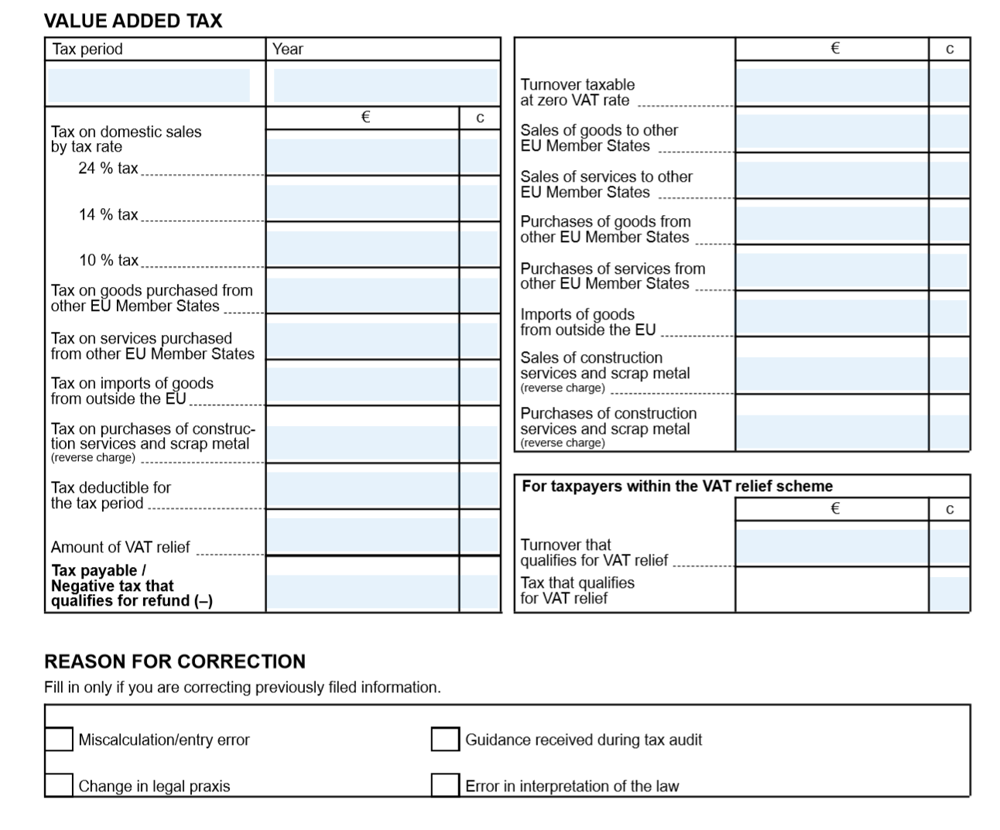

# Sales tax report for Finland

[!include [banner](../includes/banner.md)]

This article explains how to set up and generate the sales tax report for legal entities in Finland.

For general information about how to set up the value-added tax (VAT) statement, see [VAT reporting for Europe](emea-vat-reporting.md).

> [!NOTE]
> Deprecated: By March 1, 2023, we will no longer support the Sales tax report for Finland (Finish report layout). New **VAT declaration TXT (FI**) and **VAT declaration Excel (FI)** Electronic reporting (ER) formats are introduced under the **Tax declaration** model. The Sales tax report for Finland design was based on reporting codes and the Finnish report layout. This design will be replaced by a new VAT declaration design, [VAT declaration for Finland](emea-fin-vat-declaration.md).

## Set up the report layout for sales tax authorities

To generate the sales tax report in the correct format for the appropriate tax authority, you must set up the report layout for the sales tax authorities. On the **Sales tax authorities** page, select the sales tax authority that will be used in the sales tax codes for the sales tax settlement period. Then, in the **Report layout** field, select **Finnish report layout**.

## Set up sales tax reporting codes for VAT reporting

Set up sales tax reporting codes by following the instructions in [Set up sales tax reporting codes](../general-ledger/tasks/set-up-sales-tax-reporting-codes.md). The following table provides an example of sales tax reporting codes for Finland.

| **Sales tax reporting code** | **Description**                                                                                                                                                                                                                           |
|------------------------------|-------------------------------------------------------------------------------------------------------------------------------------------------------------------------------------------------------------------------------------------|
| 301                          | Tax on domestic sales at 24 percent.                                                                                                                                                                                                      |
| 302                          | Tax on domestic sales at 14 percent.                                                                                                                                                                                                      |
| 303                          | Tax on domestic sales at 10 percent.                                                                                                                                                                                                      |
| 304                          | VAT on the import of goods from outside the European Union (EU).                                                                                                                                                                          |
| 305                          | Tax on goods that are purchased from other EU countries/regions.                                                                                                                                                                                  |
| 306                          | Tax on services that are purchased from other EU countries/regions.                                                                                                                                                                               |
| 307                          | Tax deductible for the tax period.                                                                                                                                                                                                        |
| 308                          | Tax payable/negative tax that qualifies for refund (-). On the sales tax report, the value in this box is automatically calculated as the sum of reporting codes 301, 302, 303, 304, 305, 306, and 318, plus reporting codes 307 and 317. |
| 309                          | Sales taxable at a VAT rate of 0 (zero).                                                                                                                                                                                                  |
| 310                          | Imports of goods from outside the EU.                                                                                                                                                                                                     |
| 311                          | Sales of goods to other EU countries/regions.                                                                                                                                                                                                     |
| 312                          | Sales of services to other EU countries/regions.                                                                                                                                                                                                  |
| 313                          | Purchases of goods from other EU countries/regions.                                                                                                                                                                                               |
| 314                          | Purchases of services from other EU countries/regions.                                                                                                                                                                                            |
| 315                          | Sales that qualify for VAT relief.                                                                                                                                                                                                        |
| 316                          | Tax that qualifies for VAT relief.                                                                                                                                                                                                        |
| 317                          | Amount of VAT relief.                                                                                                                                                                                                                     |
| 318                          | Tax on purchases of construction services/scrap metal (reverse charge).                                                                                                                                                                   |
| 319                          | Sales of construction services/scrap metal.                                                                                                                                                                                               |
| 320                          | Purchases of construction services/scrap metal.                                                                                                                                                                                           |
| 332                          | Calculation error/typing error.                                                                                                                                                                                                           |
| 333                          | Guidance that is received during a tax audit.                                                                                                                                                                                             |
| 334                          | Change in legal practice.                                                                                                                                                                                                                 |
| 335                          | Error in the interpretation of tax laws.                                                                                                                                                                                                  |

## Set up sales tax codes

Set up sales tax codes by following the instructions in [Sales tax codes for VAT reporting](emea-vat-reporting.md#sales-tax-codes-for-vat-reporting) and [Sales tax overview](../general-ledger/indirect-taxes-overview.md).

## Generate a sales tax payment and print the Finnish sales tax report

1. Go to **Tax** \> **Declarations** \> **Sales tax** \> **Settle and post sales tax**.
2. In the **Report sales tax for settlement period** dialog box, set the following fields.

| **Field**                 | **Description**                                                                                                                                                                                                                                                                                               |
|---------------------------|---------------------------------------------------------------------------------------------------------------------------------------------------------------------------------------------------------------------------------------------------------------------------------------------------------------|
| Settlement period         | Select the applicable reporting period.                                                                                                                                                                                                                                                                       |
| From date                 | Enter the first date of the sales tax settlement period to calculate sales tax for. This value corresponds to the date in the **From** field on the **Sales tax settlement periods** page.                                                                                                                    |
| Transaction date          | Enter the date when the sales tax report is calculated. The default value is the current date. The sales tax payment is calculated for all transactions that were posted during the settlement period.                                                                                                        |
| Sales tax payment version | Select the type of sales tax settlement. Select **Original** if this tax settlement is the first sales tax settlement for the period. Select **Latest corrections** if the **Original** sales tax settlement for the period has been already generated. For more information, see [Create a sales tax payment](../general-ledger/tasks/create-sales-tax-payment.md). |

3. Select **OK**.
4. In the **Finnish sales tax report** dialog box, set the following fields.

| **Field**                       | **Description**                                                                                                                                                                                                                                                       |
|---------------------------------|-----------------------------------------------------------------------------------------------------------------------------------------------------------------------------------------------------------------------------------------------------------------------|
| Tax currency                    | Select the currency that determines which transactions should be included on the report. The report will include both transactions that are generated by using the tax currency and transactions that are generated by using the tax codes that use the tax currency. |
| Reporting currency              | Select the foreign currency that the report should be generated in.                                                                                                                                                                                                   |
| Currency rate on reporting date | Set the option to **Yes** to indicate that the currency rate on the reporting date should be used for all transactions on the report.                                                                                                                                 |

5. Select **OK** to generate sales tax payment report.

## Print the Finnish sales tax report from the sales tax payment

1. Go to **Tax \> Inquiries and reports \> Sales tax payments** to open the **Sales tax payment** page.
2. Select the record to print, and then select **Print report**.
3. In the dialog box, set the fields as described in the previous section, and then select **OK**.

## Report sales tax for a settlement period

You can generate the Finnish sales tax report by using the **Report sales tax for settlement period** inquiry.

1. Go to **Tax \> Declarations \> Sales tax \> Report sales tax for settlement period**.
2. In the dialog box, set the **Settlement period**, **From date**, **Tax currency**, and **Reporting currency** fields as described in the section, [Generate a sales tax payment and print the Finnish sales tax report](#generate-print-finnish) section earlier in this article.
3. In the **Sales tax payment version** field, select one of the following values:

   - **Original** – Generate a report for sales tax transactions of the first posted settlement calculation for the period.
   - **Corrections** – Generate a report for sales tax transactions of the subsequent settlement calculations for the period.
   - **Total list** – Generate a report for all sales transactions for the period, including the original and all corrections.

4. Select **OK**.
5. In the **Finnish sales tax report** dialog box, set the **Tax currency**, **Reporting currency**, and **Currency rate on reporting date** fields as described in the section, [Generate a sales tax payment and print the Finnish sales tax report](#generate-print-finnish) earlier in this article.

## Example

The following example shows how you can set up sales tax codes and sales tax reporting codes, post transactions, and generate the Finnish sales tax report.

1.  Go to **Tax** \> **Indirect taxes** \> **Sales tax** \> **Sales tax codes**, and set up the following sales tax codes.

| **Sales tax code** | **Percentage** | **Description**                                                                        |
|--------------------|----------------|----------------------------------------------------------------------------------------|
| FI24               | 24             | Domestic sales and purchases at a rate of 24 percent                                   |
| FI14               | 14             | Domestic sales and purchases at a rate of 14 percent                                   |
| FI10               | 10             | Domestic sales and purchases at a rate of 10 percent                                   |
| FIEU24             | 24             | EU purchases at a rate of 24 percent where the **Use tax** option is set to **Yes**.   |
| FIEU14             | 14             | EU purchases at a rate of 14 percent where the **Use tax** option is set to **Yes**.   |
| FIEU10             | 10             | EU purchases at a rate of 10 percent where the **Use tax** option is set to **Yes**..  |
| FIImp24            | 24             | Import at a rate of 24 percent where the **Use tax** option is set to **Yes**.         |
| FIImp14            | 14             | Import at a rate of 14 percent where the **Use tax** option is set to **Yes**.         |
| FIImp10            | 10             | Import at a rate of 10 percent where the **Use tax** option is set to **Yes**.         |
| FIRC24             | 24             | Reverse charge at a rate of 24 percent where the **Use tax** option is set to **Yes**. |
| FIRC14             | 14             | Reverse charge at a rate of 14 percent where the **Use tax** option is set to **Yes**. |
| FIRC10             | 10             | Reverse charge at a rate of 10 percent where the **Use tax** option is set to **Yes**. |
| FIEUS              | 0              | EU sales where the **Exempt** option is set to **Yes**.                                |
| FIThird            | 0              | Export sales where the **Exempt** option is set to **Yes**.                            |

2. On the **Sales tax codes** page, on the **Report setup** FastTab, assign reporting codes to sales tax codes.

The following table shows how to assign sales tax reporting codes to sales tax codes.

| **Sales tax code** | **Taxable sales** | **Tax-free sale** | **Sales tax payable** | **Taxable purchases** | **Sales tax receivable** | **Taxable import** | **Use tax** | **Offset use tax** |
|--------------------|-------------------|-------------------|-----------------------|-----------------------|--------------------------|--------------------|-------------|--------------------|
| FI24               |                   |                   | 301                   |                       | 307                      |                    |             |                    |
| FI14               |                   |                   | 302                   |                       | 307                      |                    |             |                    |
| FI10               |                   |                   | 303                   |                       | 307                      |                    |             |                    |
| FIEU24             |                   |                   |                       |                       |                          | 313                | 307         | 305                |
| FIEU14             |                   |                   |                       |                       |                          | 313                | 307         | 305                |
| FIEU10             |                   |                   |                       |                       |                          | 313                | 307         | 305                |
| FIImp24            |                   |                   |                       |                       |                          | 310                | 307         | 304                |
| FIImp14            |                   |                   |                       |                       |                          | 310                | 307         | 304                |
| FIImp10            |                   |                   |                       |                       |                          | 310                | 307         | 304                |
| FIRC24             |                   |                   |                       |                       |                          | 320                | 307         | 318                |
| FIRC14             |                   |                   |                       |                       |                          | 320                | 307         | 318                |
| FIRC10             |                   |                   |                       |                       |                          | 320                | 307         | 318                |
| FIEUS              |                   | 311               |                       |                       |                          |                    |             |                    |
| FIThird            |                   | 309               |                       |                       |                          |                    |             |                    |

> [!NOTE]
> The preceding configuration is just an example and depends on the structure of the sales tax codes that are used. If you want values to be calculated and transferred to the sales tax report, for each tax code that is used in the sales tax payment process, you must set a relevant sales tax reporting code in one or more fields on the **Report setup** tab.

3. Post the following transactions. For example, for Customer invoices go to **Accounts receivable** \> **Invoices** \> **All free text invoices**, for Vendor invoices go to **Accounts payable** \> **Invoices** \> **Invoice journal**.

| **Date**         | **Transaction type**            | **Amount net** | **VAT amount** | **Sales tax code** | **Expected tax base – Reporting code** | **Expected tax amount – Reporting code** |
|------------------|---------------------------------|----------------|----------------|--------------------|----------------------------------------|------------------------------------------|
| February 1, 2020 | Customer invoice (domestic)     | 100            | 24             | FI24               | Not applicable                         | 301                                      |
| February 1, 2020 | Vendor invoice (EU)             | 100            | 14             | FIEU14             | 313                                    | 305 – Tax payable 307 – Tax deduction    |
| February 1, 2020 | Vendor invoice (import)         | 100            | 10             | FIImp10            | 310                                    | 304 – Tax payable 307 – Tax deduction    |
| February 1, 2020 | Customer invoice (EU)           | 100            | 0              | FIEUS              | 311                                    | Not applicable                           |
| February 1, 2020 | Customer invoice (export)       | 100            | 0              | FIThird            | 309                                    | Not applicable                           |
| February 1, 2020 | Vendor invoice (reverse charge) | 100            | 24             | FIRC24             | 320                                    | 318 – Tax payable 307 – Tax deduction    |

4. Go to **Tax** \> **Declarations** \> **Sales tax** \> **Settle and post sales tax**. In the **Report sales tax for settlement period** dialog box in the **Sales tax payment version** field, select **Original**.
5. Print the report and review the data.

6. Post the new transaction. For example, go to **Accounts receivable** \> **Invoices** \> **All free text invoices**.

| **Date**         | **Transaction type**        | **Amount net** | **VAT amount** | **Sales tax code** | **Expected tax base – Reporting code** | **Expected tax amount – Reporting code** |
|------------------|-----------------------------|----------------|----------------|--------------------|----------------------------------------|------------------------------------------|
| February 1, 2020 | Customer invoice (domestic) | 100            | 10             | FI10               | Not applicable                         | 303                                      |

7. Go to **Tax** \> **Declarations** \> **Sales tax** \> **Settle and post sales tax**. In the **Report sales tax for settlement period** dialog box in the **Sales tax payment version** field, select **Latest corrections**.
8. Go to **Tax** \> **Declarations** \> **Sales tax** \> **Report sales tax for settlement period**. In the **Report sales tax for settlement period** dialog box in the **Sales tax payment version** field, select **Corrections**.

9. Go to **Tax** \> **Declarations** \> **Sales tax** \> **Report sales tax for settlement period**. In the **Report sales tax for settlement period** dialog box in the **Sales tax payment version** field, select **Total list**.

## Additional information

If you set up reverse charges according to [Reverse charge VAT](emea-reverse-charge.md), you can get data about the reporting codes on the **Sales tax payment by code** report.

1. Go to **Tax** \> **Inquiries and reports** \> **Sales tax reports** \> **Sales tax payment by code**.
2. In the dialog box, set the **Settlement period** and **From date** fields.
3. Select **OK**, and review the report result.

## Report a VAT declaration to the tax authority

After you've generated the Finnish sales tax report, use the data on it to fill in the self-assessed tax return for the Finnish Tax Administration in the official format. For example, the following illustration shows what the Finnish self-assessed tax return has looked like since 2019.

[!INCLUDE[footer-include](../../includes/footer-banner.md)]
