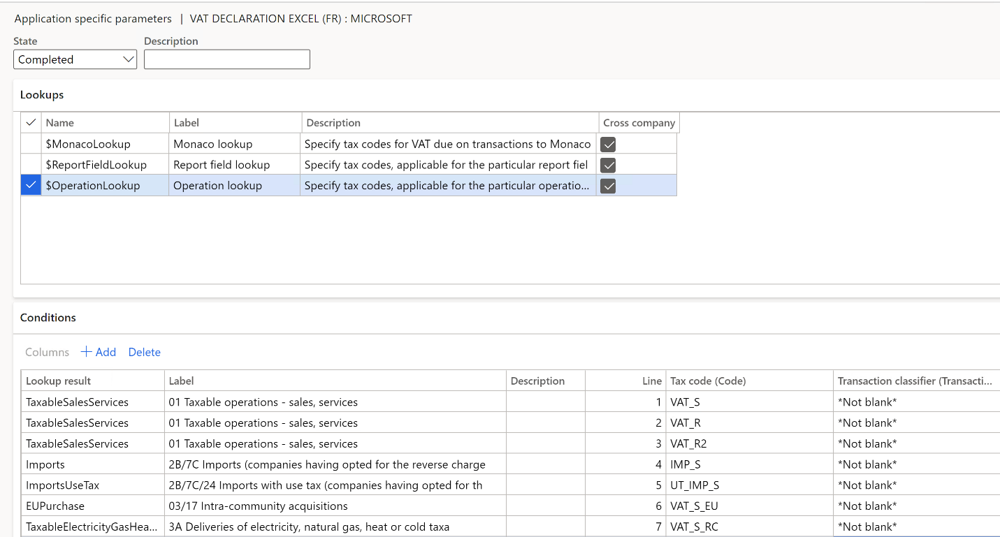
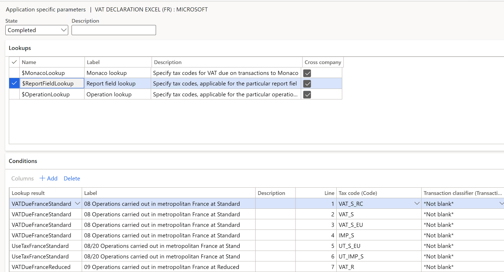
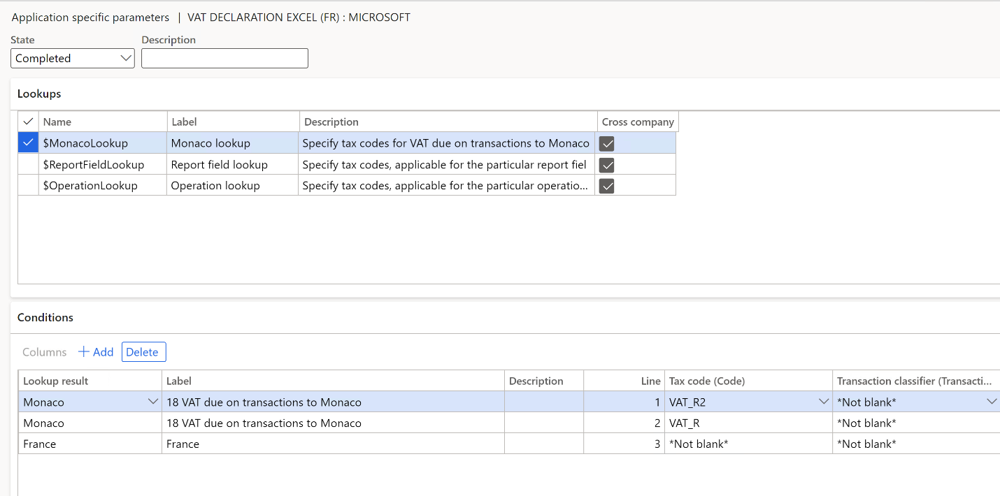

# VAT declaration (France)

[!include [banner](../includes/banner.md)]

This article describes how to set up and generate a report for France that can be used to report a value-added tax (VAT) declaration in the [www.impots.gouv.fr](http://www.impots.gouv.fr) online portal by using the exchange of computerized forms (EFI) channel.

To automatically generate the report, you must first create enough sales tax codes to keep a separate VAT accounting for each box on the VAT declaration. Additionally, in the application-specific parameters of the Electronic reporting (ER) format for the VAT declaration, you must associate sales tax codes with the result of the lookups for the VAT declaration boxes.

For France, you must configure three lookups:

- Operation lookup
- Report field lookup
- Monaco lookup

For more information about how to set up application-specific parameters, see the [Set up application-specific parameters for VAT declaration fields](#set-up-application-specific-parameters-for-vat-declaration-fields) section later in this article.

In the following tables, the **Lookup result** column shows the lookup result that is preconfigured for a specific VAT declaration row in the VAT declaration format. Use this information to correctly associate sales tax codes with the lookup result and then with the row of the VAT declaration.

### VAT declaration preview overview

The VAT declaration preview in France contains the following information.

**SECTION A - AMOUNT OF OPERATIONS CARRIED OUT**

**TAXABLE OPERATIONS**

| Line | Box  | Description | Lookup | Lookup result |
|------|------|-------------|--------|---------------|
| A1   | 0979 | Sales and services | Operation lookup | TaxableSalesServices |
| A2   | 0981 | Other taxable transactions | Operation lookup | OtherTaxableTransactions |
| A3   | 0044 | Intra-community purchases of services | Operation lookup | EUPurchaseServices |
| A4   | 0056 | Imports (other than petroleum products) | Operation lookup | TaxableImports |
| A5   | 0051 | Withdrawals from the suspensive tax regime (other than petroleum products) | Operation lookup | TaxableWithdrawalsSuspensiveTaxRegime |
| B1   | 0048 | Releases for consumption of petroleum products | Operation lookup | TaxablePetroleumProductsReleasesForConsumption |
| B2   | 0031 | Intra-community acquisitions | Operation lookup | EUPurchase (Line 17 is also affected.) |
| B3   | 0030 | Deliveries of electricity, natural gas, heat, or cold that are taxable in France (domestic reverse charge) | Operation lookup | TaxableElectricityGasHeatCold |
| B4   | 0040 | Purchases of goods or services from a taxable person who isn't established in France | Operation lookup | PurchasesFromPersonNotEstablished |
| B5   | 0036 | Regularizations | Operation lookup | TaxableRegularizations |

**NON-TAXABLE OPERATIONS**

| Line | Box  | Description | Lookup | Lookup result |
|------|------|-------------|--------|---------------|
| E1   | 0032 | Exports outside the European Union (EU) | Operation lookup | ExportsOutsideEU |
| E2   | 0033 | Other non-taxable transactions | Operation lookup | OtherNonTaxableTransactions |
| E3   | 0047 | Distance sales that are taxable in another member state for the benefit of non-taxable persons (business-to-consumer \[B2C\] sales) | Operation lookup | EUDistanceB2CSales |
| E4   | 0052 | Imports (other than petroleum products) | Operation lookup | NonTaxableImports |
| E5   | 0053 | Withdrawals from the suspensive tax regime (other than petroleum products) | Operation lookup | WithdrawalsFromSuspensiveTaxRegime |
| E6   | 0054 | Imports placed under a suspensive tax regime (other than petroleum products) | Operation lookup | ImportsSuspensiveTaxRegime |
| F1   | 0055 | Intra-Community acquisitions | Operation lookup | NonTaxableEUPurchase |
| F2   | 0034 | Intra-community deliveries to a taxable person (business-to-business \[B2B\] sales) | Operation lookup | EUSales |
| F3   | 0029 | Deliveries of electricity, natural gas, heat, or cold that aren't taxable in France | Operation lookup | ElectricityGasHeatColdNotTaxable |
| F4   | 0049 | Releases for consumption of petroleum products | Operation lookup | NonTaxablePetroleumProductsReleasesForConsumption |
| F5   | 0050 | Imports of petroleum products placed under suspensive tax regime | Operation lookup | ImportsPetroleumProductsSuspensiveTaxRegime |
| F6   | 0037 | Tax-free purchases | Operation lookup | TaxFreePurchases |
| F7   | 0043 | Sales of goods or services by a taxable person who isn't established in France | Operation lookup | SalesByPersonNotEstablished |
| F8   | 0039 | Regularizations | Operation lookup | NotTaxableRegularizations |
| F9   | 0061 | Internal transactions carried out between members of a single taxable person | Operation lookup | InternalTransactionsAUMember |

**SECTION B - VAT CALCULATION TO BE PAID**

**GROSS VAT**

**Operations carried out in France excluding petroleum products and imports**

| Line | Box  | Description | Lookup | Lookup result |
|------|------|-------------|--------|---------------|
| 08   | 0207 | Standard rate of 20 percent | Report field lookup | 
VATDueFranceStandard

UseTaxFranceStandard (Line 20 is also affected.)
 |
| 09   | 0105 | Reduced rate of 5.5 percent | Report field lookup | 
VATDueFranceReduced

UseTaxFranceReduced (Line 20 is also affected.)
 |
| 9B   | 0151 | Reduced rate of 10 percent | Report field lookup | 
VATDueFranceReduced2

UseTaxFranceReduced2 (Line 20 is also affected.)
 |

**Operations carried out in the overseas departments excluding petroleum products and imports**

| Line | Box  | Description | Lookup | Lookup result |
|------|------|-------------|--------|---------------|
| 10   | 0201 | Standard rate of 8.5 percent | Report field lookup | 
VATDueOverseasStandard

UseTaxOverseasStandard (Line 20 is also affected.)
 |
| 11   | 0100 | Reduced rate of 2.1 percent | Report field lookup | 
VATDueOverseasReduced

UseTaxOverseasReduced (Line 20 is also affected.
 |

**Transactions taxable at another rate (France or overseas departments) excluding petroleum products and imports**

| Line | Box  | Description | Lookup | Lookup result |
|------|------|-------------|--------|---------------|
| T1   | 1120 | Transactions carried out in the DOM and taxable at the rate of 1.75% | Report field lookup | 
VATDueSpecificRateDOM1_75

UseTaxSpecificRateDOM1_75 (Line 20 is also affected.)

UseTaxPropertySpecificRateDOM1_75
 |
| T2   | 1110 | Transactions carried out in the DOM and taxable at the rate of 1.05% | Report field lookup | 
VATDueSpecificRateDOM1_05

UseTaxSpecificRateDOM1_05 (Line 20 is also affected.)

UseTaxPropertySpecificRateDOM1_05 (Line 19 is also affected.)
 |
| T3   | 1081 | Operations carried out in Corsica and taxable at the rate of 10% | Report field lookup | 
VATDueSpecificRateCorse10

UseTaxSpecificRateCorse10 (Line 20 is also affected.)

UseTaxPropertySpecificRateCorse10 (Line 19 is also affected.)
 |
| T4   | 1050 | Operations carried out in Corsica and taxable at the rate of 2.1% | Report field lookup | 
VATDueSpecificRateCorse2_1

UseTaxSpecificRateCorse2_1 (Line 20 is also affected.)

UseTaxPropertySpecificRateCorse2_1 (Line 19 is also affected.)
 |
| T5   | 1040 | Transactions carried out in Corsica and taxable at the rate of 0.9% | Report field lookup | 
VATDueSpecificRateCorse0_9

UseTaxSpecificRateCorse0_9 (Line 20 is also affected.)

UseTaxPropertySpecificRateCorse0_9 (Line 19 is also affected.)
 |
| T6   | 1010 | Transactions carried out in mainland France at the rate of 2.1% | Report field lookup | 
VATDueSpecificRateFrance2_1

UseTaxSpecificRateFrance2_1 (Line 20 is also affected.)

UseTaxPropertySpecificRateFrance2_1 (Line 19 is also affected.)
 |
| T7   | 0990 | VAT deduction on copyright | Report field lookup | 
VATDueSpecificRateCopyright

UseTaxSpecificRateCopyright (Line 20 is also affected.)
 |
| 13   | 0900 | Old rates | Report field lookup | 
VATDueOldRates

UseTaxOldRates (Line 20 is also affected.)

UseTaxPropertyOldRates (Line 19 is also affected.)
 |

**Petroleum products**

| Line | Box  | Description | Lookup | Lookup result |
|------|------|-------------|--------|---------------|
| P1   | 0208 | Standard rate of 20 percent on petroleum products | Report field lookup | 
VATDuePetroleumStandard

UseTaxPetroleumStandard (Lines 20 and 2E are also affected.)
 |
| P2   | 0152 | Reduced rate of 13 percent on petroleum products | Report field lookup | 
VATDuePetroleumReduced

UseTaxPetroleumReduced (Lines 20 and 2E are also affected.)
 |

**Imports**

| Line | Box  | Description | Lookup | Lookup result |
|------|----- |-------------|--------|---------------|
| I1   | 0210 | Standard rate 20 % | Report field lookup | 
VATDueImportsFranceStandard

UseTaxImportsFranceStandard (Lines 20 and 24 are also affected.)
 |
| I2   | 0211 | Reduced rate 10 % | Report field lookup | 
VATDueImportsFranceReduced2

UseTaxImportsFranceReduced2 (Lines 20 and 24 are also affected.)
 |
| I3   | 0212 | Reduced rate 8,5 % | Report field lookup | 
VATDueImportsOverseasStandard

UseTaxImportsOverseasStandard (Lines 20 and 24 are also affected.)
 |
| I4   | 0213 | Reduced rate 5,5 % | Report field lookup | 
VATDueImportsFranceReduced

UseTaxImportsFranceReduced (Lines 20 and 24 are also affected.)
 |
| I5   | 0214 | Reduced rate 2,1 % | Report field lookup | 
VATDueImportsOverseasReduced

UseTaxImportsOverseasReduced (Lines 20 and 24 are also affected.)
 |
| I6   | 0215 | Reduced rate 1,05 % | Report field lookup | 
VATDueImportsSpecificRate

UseTaxImportsSpecificRate (Lines 20 and 24 are also affected.)
 |

**VAT calculation**

| Line | Box  | Description | Lookup | Lookup result |
|------|----- |-------------|--------|---------------|
| 15   | 0600 | Previously deducted VAT that must be returned | Report field lookup | 
VATDeductedToBeReturned

VATDeductedToBeReturnedRegularizations

VATDeductedToBeReturnedPetroleum

VATDeductedToBeReturnedImports
 |
| 15   | 0600 | (including VAT on petroleum products ) | Report field lookup | VATDeductedToBeReturnedPetroleum |
| 15   | 0600 | (including VAT on imported products excluding petroleum products) | Report field lookup | VATDeductedToBeReturnedImports |
| 5B   | 0602 | Amounts that must be added, including holiday deposits (expressed in euros) | Report field lookup | VATCorrectionAmountToBeAdded |
| 16   | Not applicable | Total gross VAT due (lines 08 through 5B) | Total | Total of tax amount of lines 08 + 09 + 9B + 10 + 11 + 13 + 14 + P1 + P2 + I1 + I2 + I3 + I4 + I5 + I6 + 15 + 5B |
| 7C   | 0046 | Including VAT on imports that benefit from the reverse charge scheme | Total | Total of tax amount of lines I1 + I2 + I3 + I5 + I6 + T1 + T2 + T3 + T4 + T5 + T6 + T7 |
| 17   | 0035 | Including VAT on intra-community acquisitions | Operation lookup | EUPurchase (Line B2 is also affected.) |
| 18   | 0038 | Including VAT on transactions to Monaco | Monaco lookup | Monaco |

**DEDUCTIBLE VAT**

| Line | Box  | Description | Lookup | Lookup result |
|------|------|-------------|--------|---------------|
| 19   | 0703 | Property that constitutes capital assets | Report field lookup | 
VATDeductionPropertyCapitalAssets

UseTaxImportsPropertyFranceStandard (Lines I1, 24 are also affected.)

UseTaxImportsPropertyFranceReduced (Lines I4, 24 are also affected.)

UseTaxImportsPropertyFranceReduced2 (Lines I2, 24 are also affected.)

UseTaxImportsPropertyOverseasStandard (Lines I3, 24 are also affected.)

UseTaxImportsPropertyOverseasReduced (Lines I5, 24 are also affected.)

UseTaxImportsPropertySpecificRate (Lines I6, 24 are also affected.)

UseTaxPropertyFranceStandard (Line 08 is also affected.)

UseTaxPropertyFranceReduced (Line 09 is also affected.)

UseTaxPropertyFranceReduced2 (Line 9B is also affected.)

UseTaxPropertyOverseasStandard (Line 10 is also affected.)

UseTaxPropertyOverseasReduced (Line 11 is also affected.)

UseTaxPropertyOldRates (Line 13 is also affected.)

UseTaxPropertySpecificRateDOM1_75 (Line T1 is also affected.)

UseTaxPropertySpecificRateDOM1_05 (Line T2 is also affected.)

UseTaxPropertySpecificRateCorse10 (Line T3 is also affected.)

UseTaxPropertySpecificRateCorse2_1 (Line T4 is also affected.)

UseTaxPropertySpecificRateCorse0_9 (Line T5 is also affected.)

UseTaxPropertySpecificRateFrance2_1 (Line T6 is also affected.)
|
| 20   | 0702 | Other goods and services | Report field lookup | 
VATDeductionOtherGoodsServices

VATDeductionOtherGoodsServicesImports (Line 24 is also affected.)

VATDeductionOtherGoodsServicesPetroleum (Line 2E is also affected.)

VATDeductionOtherGoodsServicesImportPetroleum (Lines 24 and 2E are also affected.)

UseTaxFranceStandard (Line 08 is also affected.)/p>
UseTaxFrancePetroleumStandard (Lines P1 and 2E are also affected.)

UseTaxFranceReduced (Line 09 is also affected.)

UseTaxFranceReduced2 (Line P2 is also affected.)

UseTaxFrancePetroleumReduced (Lines 9C and 2E are also affected.)

UseTaxOverseasStandard (Line 10 is also affected.)

UseTaxOverseasReduced (Line 11 is also affected.)

UseTaxOldRates (Line 13 is also affected.)

UseTaxSpecificRate (Line 14 is also affected.)

UseTaxPetroleumStandard (Lines P1 and 2E are also affected.)

UseTaxPetroleumReduced (Lines P2 and 2E are also affected.)

UseTaxImportsOverseasStandard (Lines I3 and 24 are also affected.)

UseTaxImportsFranceReduced (Lines I4 and 24 are also affected.)

UseTaxImportsOverseasReduced (Lines I5 and 24 are also affected.)

UseTaxImportsSpecificRate (Lines I6 and 24 are also affected.)
 |
| 21   | 0059 | Other VAT that must be deducted | Report field lookup | VATDeductionTaxableRegularizations |
| 22   | 8001 | Credit that was carried forward and that appeared on line 27 of the previous statement | Not applicable | The user defines the value in a dialog box. |
| 2C   | 0603 | Amounts that must be charged, including holiday deposits (expressed in euros) | Report field lookup | VATDeductionAmountsToBeCharged |
| 22A  | Not applicable | The single tax coefficient that is applicable for the period, if it differs | Not applicable | The user defines the value in a dialog box. |
| 23   | Not applicable | Total deductible VAT (lines 19 through 2C) | Not applicable | Total of lines 19 + 20 + 21 + 22 + 2C |
| 24   | 0710 | Of which deductible VAT on imports | Not applicable | 
VATDeductionOtherGoodsServicesImports (Line 20 is also affected.)

VATDeductionOtherGoodsServicesImportPetroleum (Lines 20 and 2E are also affected.)

UseTaxImportsOverseasStandard (Lines I3 and 20 are also affected.)

UseTaxImportsOverseasReduced (Lines I5 and 20 are also affected.)

UseTaxImportsFranceStandard (Lines I1 and 20 are also affected.)

UseTaxImportsFranceReduced (Lines I4 and 20 are also affected.)

UseTaxImportsFranceReduced2 (Lines I2 and 20 are also affected.)

UseTaxImportsPropertyFranceStandard (Lines I1 and 19 are also affected.)

UseTaxImportsPropertyFranceReduced (Lines I4 and 19 are also affected.)

UseTaxImportsPropertyFranceReduced2 (Lines I2 and 19 are also affected.)

UseTaxImportsPropertyOverseasStandard (Lines I3 and 19 are also affected.)

UseTaxImportsPropertyOverseasReduced (Lines I5 and 19 are also affected.)

UseTaxImportsPropertySpecificRate (Lines I6 and 19 are also affected.)

UseTaxImportsSpecificRate (Lines I6 and 20 are also affected.)
 |
| 2E   | 0711 | Of which deductible VAT on petroleum products | Not applicable | 
VATDeductionOtherGoodsServicesImportPetroleum (Lines 20 and 24 are also affected.)

UseTaxFrancePetroleumReduced (Lines 9C and 20 are also affected.)

VATDeductionOtherGoodsServicesPetroleum (Line 20 is also affected.)

UseTaxFrancePetroleumReduced (Lines 9C and 20 are also affected.)

UseTaxFrancePetroleumStandard (Lines 8A and 20 are also affected.)

UseTaxPetroleumStandard (Lines P1 and 20 are also affected.)

UseTaxPetroleumReduced (Lines P2 and 20 are also affected.)
 |

**CREDIT / TAX PAYABLE**

| Line | Box  | Description | Lookup result |
|------|------|-------------|---------------|
| 25   | 0705 | VAT credit (line 23 – line 16) | Total: lines 23 – 16 |
| 26   | 8002 | Credit repayment that is requested | The user defines the value in a dialog box. |
| AA   | 8005 | VAT credit that is transferred to the head company of the group | The user defines the value in a dialog box. |
| 27   | 8003 | Credit to carry forward (line 25 – line 26 – line AA). This amount should be carried over to line 22 of the next return. | Total: lines 25 – 26 – AA |
| 28   | Not applicable | Total net VAT payable (line 16 – line 23) | Total: lines 16 – 23 |
| 29   | 9979 | Assimilated taxes | The user defines a value in a dialog box. |
| AB   | 9991 | Total payable that is paid by the head company of the group on the summary declaration | The user defines a value in a dialog box. |
| 32   | Not applicable | Total payable (line 28 + line 29 – line AB) | Total: lines 28 + 29 + Z5 – AB |

### Note about purchase reverse charge VAT

If you configure sales tax codes to post incoming reverse charge VAT by using use tax, associate your sales tax codes with the lookup result of the **Report field** lookup that contains "UseTax" in the name.

Alternatively, you can configure two separate sales tax codes: one for VAT due and one for VAT deduction. Then associate each code with the appropriate lookup report of the **Report field** lookup.

**Example**

For a taxable purchase of electricity, gas, heat, or cold that has a domestic reverse charge, you configure sales tax code **UT\_S\_RC** with use tax. You then associate the code with the **UseTaxTaxableElectricityGasHeatCold** lookup result of the **Operation** lookup and the **UseTaxFranceStandard** lookup result of the **Report field** lookup. In this case, amounts that use the **UT\_S\_RC** sales tax code will be reflected on line 3A (via the **Operation** lookup), and on lines 08 and 20 (using the **Report field** lookup).

Alternatively, you configure two sales tax codes:

- **VAT\_S\_RC**, which has a tax rate value of -20 percent
- **InVAT\_S\_RC**, which has a tax rate value of 20 percent

You then associate the codes with lookup results in the following way:

- Associate **VAT\_S\_RC** with the **TaxableElectricityGasHeatCold** lookup result of the **Operation** lookup and the **VATDueFranceStandard** lookup result of the **Report field** lookup.
- Associate **InVAT\_S\_RC** with the **VATDeductionOtherGoodsServices** lookup result of the **Report field** lookup.

In this case, amounts that use the **VAT\_S\_RC** sales tax code will be reflected on lines 3A (via the **Operation** lookup) and 08 (via the **Report field** lookup). Amounts that use the **InVAT\_S\_RC** sales tax code will be reflected on line 20 (via the **Report field** lookup).

For more information about how to configure reverse charge VAT, see [Reverse charges](emea-reverse-charge.md).

## Set up a VAT declaration preview for France

### Import ER configurations

1. Open the **Electronic reporting** workspace.
2. Import the following version or later of this ER format:

    - VAT Declaration Excel (FR) version 85.15

### Set up application-specific parameters for VAT declaration fields

To automatically generate a VAT declaration preview report in Microsoft Excel, associate sales tax codes in the application and lookup results in the ER configuration.

> [!NOTE]
> We recommend that you enable the feature, **Use application specific parameters from previous versions of ER formats** in the **Feature management** workspace. When this feature is enabled, parameters that are configured for the earlier version of an ER format automatically become applicable for the later version of the same format. If this feature is not enabled, you must configure application-specific parameters explicitly for each format version. The **Use application specific parameters from previous versions of ER formats** feature is available in the **Feature management** workspace starting in Finance version 10.0.23. For more information about how to set up the parameters of an ER format for each legal entity, see [Set up the parameters of an ER format per legal entity](../../fin-ops-core/dev-itpro/analytics/er-app-specific-parameters-set-up.md).

#### Set up operations

Follow these steps to define which sales tax codes generate which boxes in section A, "AMOUNT OF OPERATIONS CARRIED OUT."

1. Go to **Workspaces** \> **Electronic reporting**, and select **Reporting configurations**.
2. Select the **VAT declaration Excel (FR)** configuration, and then select **Configurations** \> **Application specific parameters setup** to open the **Application specific parameters** page.
3. On the **Application specific parameters** page, on the **Lookups** FastTab, select **Operation lookup**.
4. On the **Conditions** FastTab, set the following fields to associate the sales tax codes and operations.

    | Field | Description |
    |-------|-------------|
    | Lookup result | Select the operation to set up. For more information about the operations and their assignment to VAT declaration rows, see the [VAT declaration preview overview](#vat-declaration-preview-overview) section earlier in this article. |
    | Tax code | Select the sales tax code to associate with the operation. Posted tax transactions that use the selected sales tax code will be collected in the appropriate declaration box. We recommend that you separate sales tax codes in such a way that one sales tax code generates amounts in only one declaration box. |
    | Transaction classifier | 
If you created enough sales tax codes to determine a declaration box, select **\*Not blank\***. If you didn't create enough sales tax codes so that one sales tax code generates amounts in only one declaration box, set up a transaction classifier. The following transaction classifiers are available:
<ul><li>**Purchase**</li><li>**PurchaseExempt** (tax-exempt purchase)</li><li>**PurchaseReverseCharge** (tax receivable from a purchase reverse charge)</li><li>**Sales**</li><li>**SalesExempt** (tax-exempt sale)</li><li>**SalesReverseCharge** (tax payable from a purchase reverse charge or a sales reverse charge)</li><li>**Use tax**</li></ul>
For each transaction classifier, a classifier for the credit note is also available. For example, one of these classifiers is **PurchaseCreditNote** (purchase credit note).
 |

    > [!NOTE]
    > Be sure to associate all sales tax codes with lookup results. If any sales tax codes should not generate values in section A, associate them with the **Other** lookup result.

    

#### Set up report fields

Follow these steps to define which sales tax codes generate which boxes in section B, "VAT CALCULATION TO BE PAID."

1. On the **Application specific parameters** page, on the **Lookups** FastTab, select **Report field lookup**.
2. On the **Conditions** FastTab, associate the sales tax codes and report fields.

    > [!NOTE] 
    > Be sure to associate all sales tax codes with lookup results. If any sales tax codes should not generate values in section B, associate them with the **Other** lookup result.

    

#### Set up sales tax codes for Monaco

Follow these steps to define which sales tax codes generate the amount in box 18, **Including VAT on transactions to Monaco**.

1. On the **Application specific parameters** page, on the **Lookups** FastTab, select **Monaco lookup**.
2. On the **Conditions** FastTab, associate the sales tax codes and the **Monaco** lookup result.

    > [!NOTE]
    > As the last line in the setup, create a line where you associate the **\*Not blank\*** value of the **Tax code** field with the **France** lookup result. This line indicates that all other sales tax codes are related to operations in France and should not generate the amount in box 18.

    

### Set up the VAT reporting format

1. In the **Feature management** workspace, enable the **VAT statement format reports** feature.
2. Go to **General ledger** \> **Setup** \> **General ledger parameters**.
3. On the **Sales tax** tab, on the **Tax options** FastTab, in the **VAT statement format mapping** field, select the **VAT declaration Excel (FR)** ER format.

    This format will be printed when you run the **Report sales tax for settlement period** report. It will also be printed when you select **Print** on the **Sales tax payments** page.

4. Go to **Tax** \> **Sales tax** \> **Sales tax authorities**. On the **Tax authorities** page, select the tax authority, and then, in the **Report layout** field, select **Default**. If you configured a VAT declaration in a legal entity that has [multiple VAT registrations](emea-reporting-for-multiple-vat-registrations.md), go to **General ledger** \> **Setup** \> **General ledger parameters**. On the **Sales tax** tab, on the **Electronic reporting for countries/regions** FastTab, on the **FRA country/region** line, select the **VAT Declaration Excel (FR)** ER format.

## Preview the VAT declaration in Excel

### Preview the VAT declaration in Excel from the Report sales tax for settlement period periodic task

1. Go to **Tax** \> **Periodic tasks** \> **Declarations** \> **Sales tax** \> **Report sales tax for settlement period**.
2. Set the following fields.

    | Field                     | Description |
    |---------------------------|-------------|
    | Settlement period         | Select the settlement period. |
    | Sales tax payment version | 
Select one of the following values:
<ul><li>**Original** – Generate a report for sales tax transactions of the original sales tax payment or before the sales tax payment is generated.</li><li>**Corrections** – Generate a report for sales tax transactions of all the subsequent sales tax payments for the period</li><li>**Total list** – Generate a report for all sales tax transactions for the period, including the original and all corrections.</li></ul> |
    | From date                 | Select the start date of the reporting period. |

3. Select **OK**.
4. In the **Electronic report parameters** dialog box, set the following fields.

    | Field                                                                          | Description                                                     |
    |--------------------------------------------------------------------------------|-----------------------------------------------------------------|
    | Credit carried forward from the previous statement                             | Enter the amount to export in line 22 (box 8001) of the report. |
    | Single tax coefficient                                                         | Enter the coefficient to export in line 22A of the report.      |
    | Credit repayment requested                                                     | Enter the amount to export in line 26 (box 8002) of the report. |
    | VAT credit transferred to the group head company on the summary declaration    | Enter the amount to export in line AA (box 8005) of the report. |
    | Assimilated taxes                                                              | Enter the amount to export in line 29 (box 9979) of the report. |
    | Total payable paid by the company head of the group on the summary declaration | Enter the amount to export in line AB (box 9991) of the report. |

5. Select **OK**, and review Excel report.

### Settle and post sales tax

1. Go to **Tax** \> **Periodic tasks** \> **Declarations** \> **Sales tax** \> **Settle and post sales tax**.
2. Set the following fields.

    | Field                     | Description |
    |---------------------------|-------------|
    | Settlement period         | Select the settlement period. |
    | Sales tax payment version | 
Select one of the following values:
<ul><li>**Original** – Generate the original sales tax payment for the settlement period.</li><li>**Latest corrections** – Generate a correction sales tax payment after the original sales tax payment for the settlement period was created.</li></ul> |
    | From date                 | Select the start date of the reporting period. |

3. Select **OK**.

### Preview the VAT declaration in Excel from the Sales tax payments inquiry

1. Go to **Tax** \> **Inquiries and reports** \> **Sales tax inquiries** \> **Sales tax payments**, and select a sales tax payment line.
2. Select **Print report**.
3. In the **Electronic report parameters** dialog box, set the fields as explained in the [Preview the VAT declaration in Excel from the Report sales tax for settlement period periodic task](#preview-the-vat-declaration-in-excel-from-the-report-sales-tax-for-settlement-period-periodic-task) section earlier in this article. Then review the Excel file that is generated for the selected sales tax payment line.

> [!NOTE] 
> The report is generated only for the selected line of the sales tax payment. If you must generate, for example, a corrective declaration that contains all corrections for the period, or a replacement declaration that contains original data and all corrections, use the **Report sales tax for settlement period** periodic task.

## Preview the VAT declaration from electronic messages

If you use electronic messages to generate the report, you can collect tax data from multiple legal entities. For more information, see the [Run a VAT
declaration for multiple legal entities](#run-a-vat-declaration-for-multiple-legal-entities) section later in this article.

### Set up electronic messages

#### Download and import example settings for electronic messages

The data package that includes example settings contains electronic message settings that are used to generate the Excel report for France. You can extend these settings or create your own. For more information about how to work with electronic messaging and create your own settings, see [Electronic messaging](../general-ledger/electronic-messaging.md).

1. In [LCS](https://lcs.dynamics.com/v2), in the Shared asset library, select **Data package** as the asset type, and then download the **FR VAT declaration** package. The downloaded file is named **FR VAT declaration package.zip**.
2. In Finance, in the **Data management** workspace, select **Import**.
3. On the **Import** FastTab, in the **Group name** field, enter a name for the job.
4. On the **Selected entities** FastTab, select **Add file**.
5. In **Add file** dialog box, make sure that the **Source data format** field is set to **Package**, select **Upload and add**, and then select the zip file that you downloaded earlier. Select **Close**.
6. After the data entities are uploaded, on the Action Pane select **Import**.
7. Go to **Tax** \> **Inquiries and reports** \> **Electronic messages** \> **Electronic messages**, and review the electronic message processing that you imported (**FR VAT declaration**).

#### Configure electronic messages

1. Go to **Tax** \> **Setup** \> **Electronic messages** \> **Populate records actions**.
2. Select the **FR Populate VAT return records** line, and then select **Edit query**.
3. Use the filter to specify the settlement periods to include in the report.
4. If you must report tax transactions from other settlement periods in a different declaration, create a new **Populate records** action, and select the appropriate settlement periods.

### Generate a VAT declaration preview from electronic messages

The following procedure applies to the example electronic message processing that you imported earlier from the LCS Shared asset library.

1. Go to **Tax** \> **Inquiries and reports** \> **Electronic messages** \> **Electronic messages**.
2. In the left pane, select the report format to generate. For example, select **FR VAT declaration**.
3. On the **Messages** FastTab, select **New**, and then, in the **Run processing** dialog box, select **OK**.
4. Select the message line that is created, enter a description, and then specify the start and end dates for the declaration.

    > [!NOTE]
    > Steps 5 through 7 are optional.

5. Optional: On the **Messages** FastTab, select **Collect data**, and then select **OK**. The sales tax payments that were generated earlier are added to the message. For more information, see the [Settle and post sales tax](#settle-and-post-sales-tax) section earlier in this article. If you skip this step, you can still generate a VAT declaration by using the **Tax declaration version** field in the **Declaration** dialog box.
6. Optional: On the **Message items** FastTab, review the sales tax payments that are transferred for processing. By default, all sales tax payments of the selected period that weren't included in any other message of the same processing are included.
7. Optional: Select **Original document** to review the sales tax payments, or select **Delete** to exclude sales tax payments from processing. If you skip this step, you can still generate a VAT declaration by using the **Tax declaration version** field in the **Declaration** dialog box.
8. On the **Messages** FastTab, select **Update status**. In the **Update status** dialog box, select the **Ready to generate** action, and then select **OK**. Verify that the message status is changed to **Ready to generate**.
9. Select **Generate report**. To preview the VAT declaration amounts, in the **Run processing** dialog box, select **Preview report**, and then select **OK**.
10. In the **Electronic reporting parameters** dialog box, set the following fields, and then select **OK**.

    | Field | Description |
    |-------|-------------|
    | Settlement period | Select the settlement period. If you selected **Collect data** in step 5, you can disregard this field. The report will be generated for the sales tax transactions that are included in the collected sales tax payments. |
    | Tax declaration version | 
Select one of the following values:
<ul><li>**Original** – Generate a report for sales tax transactions of the original sales tax payment or before the sales tax payment is generated.</li><li>**Corrections** – Generate a report for sales tax transactions of all the subsequent sales tax payments for the period.</li><li>**Total list** – Generate a report for all sales tax transactions for the period, including the original and all corrections.</li></ul> |
    | 
Credit carried forward from the previous statement

Single tax coefficient

Credit repayment requested VAT credit transferred to the group head company on the summary declaration

Assimilated taxes

Total payable paid by the company head of the group on the summary declaration
 | Set these fields as explained in the [Preview the VAT declaration in Excel](#preview-the-vat-declaration-in-excel-from-the-report-sales-tax-for-settlement-period-periodic-task) section earlier in this article. |

    If you selected **Collect data** in step 5, you can disregard this field. The report will be generated for the sales tax transactions that are included in the collected sales tax payments.

11. Select the **Attachments** button (paper clip symbol) in the upper-right corner of the page, and then select **Open** to open the file. Review the amounts in the Excel document.

## Run a VAT declaration for multiple legal entities

To use the formats to report the VAT declaration for a group of legal entities, you must first set up the application-specific parameters of the ER formats for sales tax codes from all required legal entities.

### Set up electronic messages to collect tax data from multiple legal entities

Follow these steps to set up electronic messages to collect data from multiple legal entities.

1. Go to **Workspaces** \> **Feature management**.
2. Find and select the **Cross-company queries for the populate records actions** feature in the list, and then select **Enable now**.
3. Go to **Tax** \> **Setup** \> **Electronic messages** \> **Populate records actions**.
4. On the **Populate records action** page, select the **FR Populate VAT return records** line.

    In the **Datasources setup** grid, a new **Company** field is available. For existing records, this field shows the identifier of the current legal entity.

5. In the **Datasources setup** grid, add a line for each additional legal entity that must be included in reporting, and set the following fields.

    | Field                  | Description                                                                                                                   |
    |------------------------|-------------------------------------------------------------------------------------------------------------------------------|
    | Name                   | Enter a value that will help you understand where this record comes from. For example, enter **VAT payment of Subsidiary 1**. |
    | Message item type      | Select **VAT return**. This value is the only value that is available for all the records.                                    |
    | Account type           | Select **All**.                                                                                                               |
    | Master table name      | Specify **TaxReportVoucher** for all the records.                                                                             |
    | Document number field  | Specify **Voucher** for all the records.                                                                                      |
    | Document date field    | Specify **TransDate** for all the records.                                                                                    |
    | Document account field | Specify **TaxPeriod** for all the records.                                                                                    |
    | Company                | Select the ID of the legal entity.                                                                                            |
    | User query             | The checkbox is automatically selected when you define criteria by selecting **Edit query**.                                  |

6. For each new line, select **Edit query**, and specify a related settlement period for the legal entity that is specified in the **Company** field on the line.

    When the setup is completed, the **Collect data** function on the **Electronic messages** page collects sales tax payments from all legal entities that you defined.
