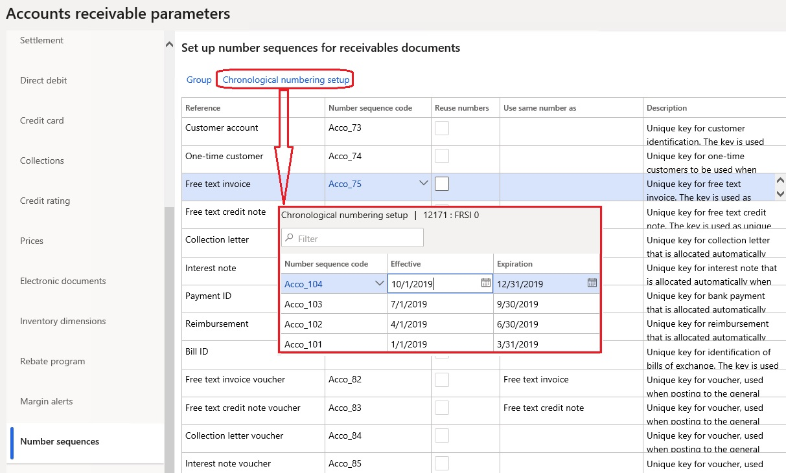

# Chronological invoice and voucher numbers

[!include [banner](../includes/banner.md)]

This article explains how to set up and use chronological numbers for invoices and vouchers in Accounts receivable.  

In some countries/regions, there is a legal requirement that all invoices and related vouchers that are issued be numbered in chronological order. The chronology must be supported by fiscal periods. All the numbers that belong to earlier periods must be less than the numbers that belong to later periods. Within one fiscal period, chronological order isn't mandatory, but there must be no gaps in the numbering. To meet this requirement, chronological numbering in Accounts receivable affects the following documents:

-   Free text invoice
-   Free text invoice voucher
-   Free text credit note
-   Free text credit note voucher
-   Sales invoice
-   Sales invoice voucher
-   Sales credit note
-   Sales credit note voucher

## Prerequisites

| Category            | Prerequisite                                                                                                                                                                                                                                                                                                                                                                                   |
|---------------------|------------------------------------------------------------------------------------------------------------------------------------------------------------------------------------------------------------------------------------------------------------------------------------------------------------------------------------------------------------------------------------------------|
| Country/region  | The primary address of the legal entity must be in France.|
| Parameters      | Set **Chronological numbering** to **Yes** on the **Accounts receivable parameters** page, on the **Updates** tab.                                                                                                                                                                                                |
| Related setup tasks | On the **Number sequences** page, define as many number sequences as you require to cover the affected fiscal periods. You should specify a company for each number sequence. The segments of the number sequences must be defined so that they provide chronological order for periods. For example, the segment names can contain a special prefix that identifies a specific period.  |

## Set up chronological numbering
### Accounts receivable parameters

On the **Accounts receivable parameters** page, on the **Number sequences** tab, select one of the supported references, such as **Free text invoice**. Then click the **Chronological numbering setup** button that will be available for the supported references. On the **Chronological numbering setup** page, define the date-effective number sequences that have valid periods.

### Number sequence groups

If different customers use different patterns for numbering, you must set up chronological numbering at the level of the number sequence group. On the **Accounts receivable parameters** page, on the **Number sequences** tab, select one of the supported references, and then click **Group**. On the **Number sequence group** page, select an existing group, or create a new group. In the **Reference** section, select one of the supported references, and then click **Chronological numbering setup**. On the **Chronological numbering setup** page, define date-effective number sequences that have valid periods.

## Invoice posting
When you post an invoice or a credit note, the appropriate number sequence is used to generate a number. This number sequence is selected based on the valid period that contains the invoice date. Customer-specific chronological numbering has higher priority than chronological numbering.

### Dates control

The system performs an additional invoice dates control for customer invoices: 

- Posting new invoices with dates earlier than the date of the latest posted invoice is forbidden if no reason code is defined. To enable posting, a reason code must be entered either in an invoice/order header or in one of the lines.
- A warning is raised if the new invoice date is later than the system date.

[!INCLUDE[footer-include](../../includes/footer-banner.md)]
