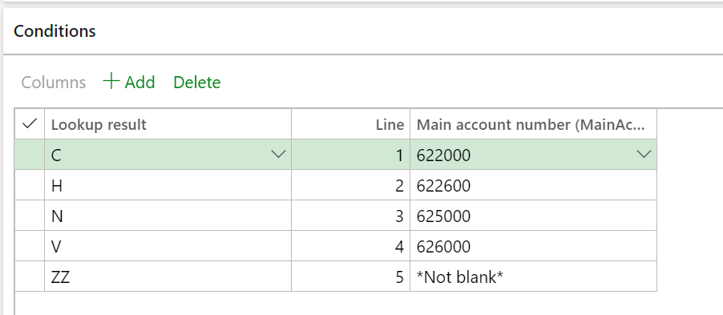

---
# required metadata

title: DAS-2 report
description: This topic guides you through the process of generating the Standard Audit File for France (FEC) in Microsoft Dynamics 365 Finance.
author: sndray
manager: AnnBe
ms.date: 03/06/2020
ms.topic: article
ms.prod: 
ms.service: dynamics-ax-applications
ms.technology: 

# optional metadata

# ms.search.form: 
audience: Application User
# ms.devlang: 
ms.reviewer: kfend
ms.search.scope: Core, Operations
# ms.tgt_pltfrm: 
# ms.custom:
ms.search.region: France
# ms.search.industry: 
ms.author: shylaw
ms.search.validFrom: 2016-02-28
ms.dyn365.ops.version: AX 7.0.0

---

# DAS-2 report

[!include [banner](../includes/banner.md)]

French legal entities that do business with self-employed professionals must provide a DAS-2 declaration report to the tax authorities. The DAS-2 report is an annual fiscal declaration that includes all payments to vendors of this type that exceed 1,200 euros (EUR). It should be generated in Microsoft Excel format. After the report is generated, you save the file in the **ETAFI (CEGID)** environment. The file will then be validated, converted into the electronic data interchange (EDI) structure, and transmitted.

The DAS-2 Excel report is generated by using by using the Electronic reporting (ER) tool. It includes the following worksheets:

- **Details** – All vendor invoices that were paid by the selected period and vendor profile that has a DAS-2 classification.
- **Summary by vendor** – The DAS-2 declaration grouped by vendor. Each column represents the amounts per DAS-2 classification.
- **DAS-2 form** – A summary of the declaration for each vendor. There is one form for each vendor.

Before you generate the report for the first time, you must download the following models and formats from Microsoft Dynamics Lifecycle Services (LCS):

- Statistics on invoices.version.32.xml or later versions
- Statistics on invoices model mapping.version.32.31.xml or later versions
- DAS-2 report.version.32.14 (FR) or later versions
- DAS-2 form.version.32.14.6 (FR) or later versions 

> [!NOTE]
> For more information about how to download ER formats, see [Download Electronic reporting configurations from Lifecycle Services](../../dev-itpro/analytics/download-electronic-reporting-configuration-lcs.md).

After you've finished downloading the ER configurations from LCS, follow these steps.

1. In Microsoft Dynamics 365 Finance, select the related French company.
2. Go to **Workspaces** \> **Electronic reporting**, and set the **Microsoft** provider to **Active**.
3. Select **Configurations** \> **Exchange**, and load the configuration from the XML file to import the tax declaration model and the Goods and services tax (GST) report format file.
4. In the **Electronic reporting** workspace, select **Configurations** \> **Setup**.
5. On the **Conditions** tab, select version **32.14**, and create the configuration that will let you set up the mapping between main accounts that are configured in your company and the related tax authority classification of the DAS-2 report.

    1. In the **Lookup result** field, select the related classification.
    2. In the **Main account** field, select the main account that is used to post the related transactions that belong to the selected classification.
    3. Set the **Status** field to **Completed**.

### Example

On line 2 of the preceding configuration, main account **622600**, which is used to post fee expense transactions, is mapped to classification **H** (**Fees and Vacations**), which is established by the tax authority.

Line 1 includes the configuration that has the classification **ZZ**. It's used when the invoice journal has other expense transactions that won't be detailed on the DAS-2 report. For each VAT main account and DAS-2 classification, create an additional line that will be used when the invoice has tax amounts that are included in the transactions.

> [!NOTE]
> Create the same configuration for the DAS-2 page.

## Assign a tax registration ID to a vendor record

Because the report includes the SIRET (Système d'identification du répertoire des établissements) registration, the tax registration ID that represents the SIRET uses the **VAT ID** registration category. Follow these steps to add a tax registration ID to a vendor record.

1. Go to **Organization administration** \> **Global address book** \> **Registration types** \> **Registration types** and create the **SIRET** registration type.
2. Go to **Organization administration** \> **Global address book** \> **Registration types** \> **Registration categories** to assign the **SIRET** registration type to the **VAT ID** category.
3. Go to **Accounts payable** \> **Vendors** \> **All vendors**.
4. Find and open the vendor record that you want to enter the registration ID for.
5. On the **Vendor** page, select **Registration ID** to open the **Manage addresses** page.
6. On the **Tax registration** tab, select **Add**, and then, in the **Registration ID** field, select **SIRET**.

## Generate the DAS-2 report

Follow these steps to generate the tax declaration report.

1. Go to **Accounts payable** \> **Inquiries and reports** \> **DAS-2 report**.
2. Select the format for the report:

    - **DAS-2 report (FR)** – Generate a detailed report that includes all transactions.
    - **DAS-2 form (FR)** – Generate a separate report for each vendor.

3. Select the "from" and "to" dates.
4. Select the vendor posting profile. Vendor posting profiles let you easily include vendor transactions for all vendors, a group of vendors, or a single vendor on the report that is generated. You can create a vendor posting profile that is used specifically for DAS-2 reports.

> [!NOTE]
> The DAS-2 report includes all purchase invoices that are fully settled during the selected period and for the vendor profile. Invoices that are partially settled aren't included on this report.
