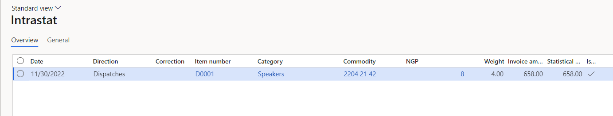
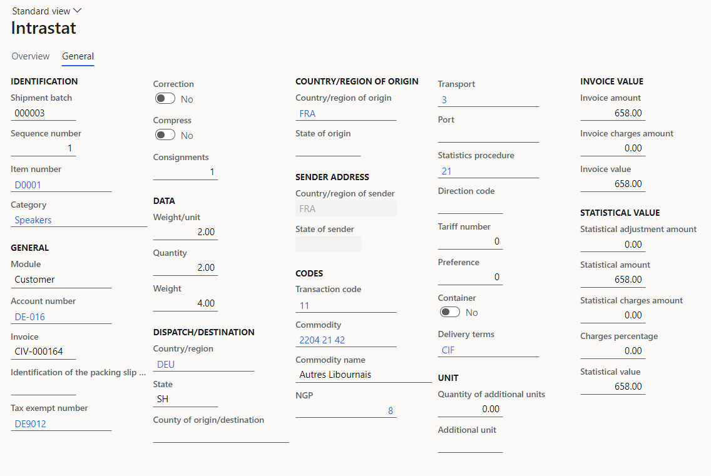
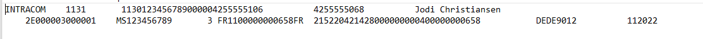
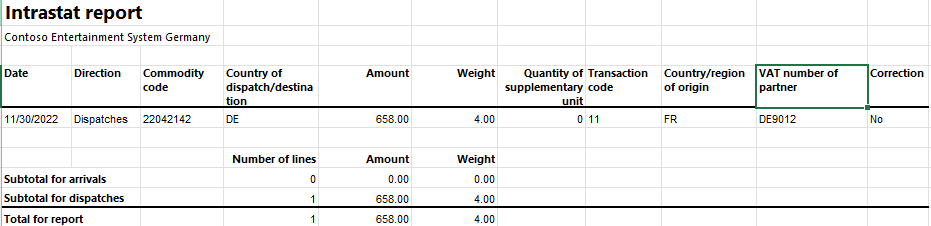

# French Intrastat

[!include[banner](../includes/banner.md)]

Companies in France that are registered for value-added tax (VAT), and that trade with other European Union (EU) countries/regions, must declare the exchange of goods and services to and from France. The Declaration d'exchanges de biens (Declaration of Trade in Goods, or DEB) is a combination of the EU Sales List and the Intrastat report. You must submit this report monthly for all intracommunity sales of goods.

You can generate the DEB report in either of two electronic text file formats: SAISUNIC 330 or INTRACOM format.

The following table shows the fields that are included in the French Intrastat declaration in SAISUNIC 330 format. The table also indicates the report levels of each field. A field can have the following report levels:

- **4** – Tax declaration.
- **1** – Statistical response.
- **5** – Statistical response to shipment and tax declaration, and joint filling.

| Field                       | Report levels |
|-----------------------------|---------------|
| Period Of Reference         | 4, 1, 5       |
| Number Of Declaration       | 4, 1, 5       |
| Line Number                 | 4, 1, 5       |
| Country ISO Code (FR)       | 4, 1, 5       |
| Complementary Code          | 4, 1, 5       |
| Siren Number                | 4, 1, 5       |
| VAT Code Of Customer        | 4, 1, 5       |
| Direction Code              | 4, 1, 5       |
| Transaction Type            | 4, 1, 5       |
| Obligation Level            | 4, 1, 5       |
| Commodity Code              | 1, 5          |
| National NGP                | 1, 5          |
| County (Department)         | 1, 5          |
| Nature Of Transaction       | 1, 5          |
| Country Of Origination      | 1, 5          |
| Country Of Origin - Imports | 1, 5          |
| Final Destination - Exports | 1, 5          |
| Invoice Value               | 4, 1, 5       |
| Statistical Value           | 1, 5          |
| Net Weight                  | 1, 5          |
| Additional Units            | 1, 5          |
| Transport Code              | 1, 5          |

The following table shows the fields that are included in the French Intrastat declaration in INTRACOM format. The table also indicates the report levels of each field. A field can have the following report levels:

- **4** – Tax declaration.
- **1** – Statistical response.
- **5** – Statistical response to shipment and tax declaration, and joint filling.

| Field                       | Report levels |
|-----------------------------|---------------|
| Direction code              | 4, 1, 5       |
| Number Of Declaration       | 4, 1, 5       |
| Number Of Line              | 4, 1, 5       |
| Siren                       | 4, 1, 5       |
| County (Department)         | 1, 5          |
| Transport Code              | 1, 5          |
| Country Of Origin           | 1, 5          |
| Nature Of Transaction       | 1, 5          |
| Invoice Value               | 4, 1, 5       |
| Modes Of Delivery           | 1, 5          |
| Transaction Type            | 4, 1, 5       |
| Obligation Level            | 4, 1, 5       |
| Commodity Code              | 1, 5          |
| National NGP                | 1, 5          |
| Net Weight                  | 1, 5          |
| Statistical Value           | 1, 5          |
| Additional Units            | 1, 5          |
| Country Of Origin - Imports | 1, 5          |
| Final Destination - Exports | 1, 5          |
| VAT Code Of Customer        | 4, 1, 5       |
| Complementary Code          | 4, 1, 5       |
| Period Of Reference         | 4, 1, 5       |

## Set up Intrastat

- In [Microsoft Dynamics Lifecycle Services](https://lcs.dynamics.com/Logon/Index), in the Shared asset library, download the latest versions of the following Electronic reporting (ER) configurations for the Intrastat declaration:

    - Intrastat model
    - Intrastat report
    - Intrastat INTRACOM (FR)
    - Intrastat SAISUNIC (FR)

    For more information, see [Download Electronic reporting configurations from Lifecycle Services](../../fin-ops-core/dev-itpro/analytics/download-electronic-reporting-configuration-lcs.md).

### Set up VAT IDs

#### Set up VAT codes for your company

1. Go to **Tax** \> **Setup** \> **Sales tax** \> **Tax exempt numbers**.
2. On the Action Pane, select **New**.
3. In the **Country/region** field, select **FRA**.
4. In the **Tax exempt number** field, enter your company's VAT number key.
5. Go to **Organization administration** \> **Organizations** \> **Legal entities**, and select your company.
6. On the **Foreign trade and logistics** FastTab, in the **Intrastat** section, set the **VAT exempt number export** and **VAT exempt number import** fields to the code that you created in step 4.
7. On the **Tax registration** FastTab, in the **Tax registration number** field, enter your company's tax registration number.

#### Set up the VAT IDs for trading partners

##### Create a registration type for the company code

You must create VAT ID registration types for all the countries or regions that your company does business with.

1. Go to **Organization administration** \> **Global address book** \> **Registration types** \> **Registration types**.
2. On the Action Pane, select **New** to create a registration type for the VAT ID.
3. In the **Enter registration type details** dialog box, in the **Name** field, enter a name for the new registration type. For example, enter **VAT ID**.
4. In the **Country/region** field, select the country or region of the trading partner.
5. Select **Create**.

##### Match the registration type with a registration category

1. Go to **Organization administration** \> **Global address book** \> **Registration types** \> **Registration categories**.
2. On the Action Pane, select **New** to create a link between a registration type and a registration category.
3. For the registration type for the VAT ID, select the **VAT ID** registration category.
4. Repeat steps 2 and 3 for the other registration types that you created for the countries or regions that your company does business with.

##### Set up the VAT number of a trading partner

1. Go to **Accounts receivable** \> **Customers** \> **All customers**.
2. In the grid, select a customer.
3. On the Action Pane, on the **Customer** tab, in the **Registration** group, select **Registration IDs**.
4. On the **Registration ID** FastTab, select **Add** to create a registration ID.
5. In the **Registration type** field, select the registration type that you created for the company code.
6. In the **Registration number** field, enter the company's VAT number.
7. On the Action Pane, select **Save**, and then close the page.

For more information, see [Registration IDs](emea-registration-ids.md).

### Set up foreign trade parameters

1. Go to **Tax** \> **Setup** \> **Foreign trade** \> **Foreign trade parameters**.
2. On the **Intrastat** tab, on the **Electronic reporting** FastTab, in the **File format mapping** field, select **Intrastat INTRACOM (FR)** or **Intrastat SAISUNIC (FR)**.
3. In the **Report format mapping** field, select **Intrastat report**.
4. On the **Commodity code hierarchy** FastTab, in the **Category hierarchy** field, select **Intrastat**.
5. On the **General** FastTab, in the **Transaction code** field, select the code that is used for transfers of goods.
6. In the **Credit note** field, select the code that is used for returns of goods.
7. In the **Worker** field, select the name of the contact person.
8. On the **Contact** tab, add information about the contact person:

    - In the **Telephone** field, enter the telephone number of the contact person.
    - In the **Fax** field, enter the fax number of the contact person.

9. On the **Country/region properties** tab, in the **Country/region** field, list all the countries or regions that your company does business with. For each country/region that is part of the EU, select **EU** in the **Country/region type** field, so that the country appears on your Intrastat report. For France, select **Domestic** in the **Country/region type** field.

### Set up compression of Intrastat

- Go to **Tax** \> **Setup** \> **Foreign trade** \> **Compression of Intrastat**, and select the fields that should be compared when Intrastat information is summarized. For French Intrastat, select the following fields:
 
    - Statistics procedure
    - Country/region of origin
    - Transport
    - Correction
    - Country/region
    - County of origin/destination
    - Direction
    - Country/region of sender
    - Transaction code
    - Commodity

### Set up product parameters for the Intrastat declaration

1. Go to **Product information management** \> **Products** \> **Released products**.
2. In the grid, select a product.
3. On the **Foreign trade** FastTab, in the **Intrastat** section, in the **Commodity** field, select the commodity code. The name of the commodity will be printed in the **Description of commodities** field on the Intrastat report.
4. In the **Origin** section, in the **Country/region** field, select the product's country or region of origin.
5. On the **Manage inventory** FastTab, in the **Net weight** field, enter the product's weight in kilograms.

### NGP codes

On the DEB report, the codification of products consists of the following elements:

- The eight-digit CN8 code that represents the tariff and statistical nomenclature of the EU.
- If applicable, the one-digit Nomenclature Générale des Produits (NGP) national item code.

In 2022, the NGP applies to only three types of products:

- Some products from cows, sheep, and goats
- Military equipment
- French wines

You must set up the NGP codes and assign them to related products. The **NGP** field is then automatically set on the **Intrastat journal** page.

#### Set up an NGP code

1. Go to **Tax** \> **Setup** \> **Foreign trade** \> **NGP codes**.
2. On the Action Pane, select **New**.
3. In the **NGP** field, enter a single-digit code.
4. In the **Description** field, enter a description for the code.

#### Assign an NGP code to a product

1. Go to **Product information management** \> **Products** \> **Released products**.
2. In the grid, select a product.
3. On the **Foreign trade** FastTab, in the **Intrastat** section, in the **NGP** field, select the appropriate NGP code.

### Set up warehouse parameters for the Intrastat declaration

1. Go to **Warehouse management** \> **Setup** \> **Warehouse** \> **Warehouses**.
2. Select a warehouse, and then, on the **Addresses** FastTab, select **Add** or **Edit**.
3. In the dialog box, in the **City** field, select the warehouse's city. The city's state or province will be used as a county for your DEB report.

### Set up the transport method

1. Go to **Tax** \> **Setup** \> **Foreign trade** \> **Transport method**.
2. On the Action Pane, select **New**.
3. In the **Transport** field, enter a unique code. Companies in France use one-digit transport codes.

### Intrastat journal

Go to **Tax** \> **Declarations** \> **Foreign trade** \> **Intrastat** to manage your transactions that are applicable to foreign trade with EU countries/region. For more information, see [Intrastat overview](emea-intrastat.md).

The **NGP** column is specific to France and shows the NGP code for the product. If the NGP isn't applicable to a product, **0** (zero) is shown. To adjust the NGP code, select the transaction, and then, on the **General** tab, in the **Codes** section, in the **NGP** field, select the required NGP code.

#### Intrastat transfer

On the **Intrastat** page, on the Action Pane, you can select **Transfer** to automatically transfer the information about intracommunity trade from your sales orders, free text invoices, purchase orders, vendor invoices, vendor product receipts, project invoices, and transfer orders. Only documents that have an EU country as the country or region of destination (for dispatches) or consignment (for arrivals) will be transferred.

Because the DEB report is a combination of the EU Sales List and the Intrastat report, it also includes *triangular* transactions, where a direct delivery is made from one EU country/region (party A) to another EU country/region (party C), and a French legal entity (party B) is in the middle of the triangular deal.

#### Generate a DEB (Intrastat) report

1. Go to **Tax** \> **Declarations** \> **Foreign trade** \> **Intrastat**.
2. On the Action Pane, select **Output** \> **Report**.
3. In the **Intrastat Report** dialog box, set the following fields.

    | Field            | Description                                                                                                                         |
    |------------------|-------------------------------------------------------------------------------------------------------------------------------------|
    | From date        | Select the start date for the report.                                                                                               |
    | To date          | Select the end date for the report.                                                                                                 |
    | Generate file    | Set this option to **Yes** to generate a .txt file.                                                                                 |
    | File name        | Enter the name of the .txt file for your Intrastat report.                                                                          |
    | Generate report  | Set this option to **Yes** to generate an .xml file.                                                                                |
    | Report file name | Enter the required name.                                                                                                            |
    | Only corrections | Set this option to **Yes** to report only corrections. Set it to **No** to report both normal transactions and corrections.         |
    | Direction        | Select **Arrivals** for a report about intracommunity arrivals. Select **Dispatches** for a report about intracommunity dispatches. |

4. Select **OK** to close the **Intrastat Report** dialog box.
5. In the **Electronic report parameters** dialog box, on the **Parameters** FastTab, in the **Report level** field, select the report level. The report level can be **1 - statistical response**, **4 - tax declaration**, or **5 - statistical response to shipment and tax declaration**.

## Example

The following example shows how to set up French Intrastat and create the DEB report. It uses the **DEMF** legal entity.

### Preliminary setup

1. In [Microsoft Dynamics Lifecycle Services](https://lcs.dynamics.com/Logon/Index), in the Shared asset library, download the latest versions of the following ER configurations for the Intrastat declaration format:

    - Intrastat model
    - Intrastat report
    - Intrastat INTRACOM (FR)

2. Set up a product hierarchy:

    1. Go to **Product information management** \> **Setup** \> **Categories and attributes** \> **Category hierarchies**.
    2. In the grid, select **Intrastat**.
    3. On the Action Pane, on the **Category hierarchy** tab, in the **Maintain** group, select **Edit**.
    4. On the Action Pane, select **New category node**.
    5. In the **Name** field, enter **Autres Libournais**.
    6. In the **Code** field, enter **2204 21 42**.
    7. On the Action Pane, select **Save**.

### Set up VAT IDs

#### Set up VAT codes for your company

1. Go to **Tax** \> **Setup** \> **Sales tax** \> **Tax exempt numbers**.
2. On the Action Pane, select **New**.
3. In the **Country/region** field, select **FRA**.
4. In the **Tax exempt number** field, enter **MS123456**.
5. Go to **Organization administration** \> **Organizations** \> **Legal entities**, and select **DEMF**.
6. On the **Foreign trade and logistics** FastTab, in the **Intrastat** section, set the **VAT exempt number export** and **VAT exempt number import** fields to the code that you created in step 4.
7. On the **Tax registration** FastTab, in the **Tax registration number** field, enter **123456789**.

#### Set up the VAT IDs for trading partners

##### Create a registration type for the company code

1. Go to **Organization administration** \> **Global address book** \> **Registration types** \> **Registration types**.
2. On the Action Pane, select **New** to create a registration type for the VAT ID.
3. In the **Enter registration type details** dialog box, in the **Name** field, enter **VAT ID**.
4. In the **Country/region** field, select **DEU**.
5. Select **Create**.

##### Match the registration type with a registration category

1. Go to **Organization administration** \> **Global address book** \> **Registration types** \> **Registration categories**.
2. On the Action Pane, select **New** to create a link between the registration type and the registration category.
3. For the **VAT ID** registration type of the **DEU** country/region, select the **VAT ID** registration category.

##### Set up the customer's VAT registration number

1. Go to **Accounts receivable** \> **Customers** \> **All customers**.
2. In the grid, select **DE-016**.
3. On the Action Pane, on the **Customer** tab, in the **Registration** group, select **Registration IDs**.
4. On the **Registration ID** FastTab, select **Add** to create a registration ID.
5. In the **Registration type** field, select **VAT ID**.
6. In the **Registration number** field, enter **DE9012**.
7. On the Action Pane, select **Save**, and then close the page.
8. On the **Invoice and delivery** FastTab, in the **Sales tax** section, in the **Tax exempt number** field, select **DE9012**.

### Set up foreign trade parameters

1. Go to **Tax** \> **Setup** \> **Foreign trade** \> **Foreign trade parameters**.
2. On the **Intrastat** tab, on the **General** FastTab, in the **Transaction code** field, select **11**.
3. On the **Electronic reporting** FastTab, in the **File format mapping** field, select **Intrastat INTRACOM (FR)**.
4. In the **Report format mapping** field, select **Intrastat report**.
5. On the **Commodity code hierarchy** FastTab, in the **Category hierarchy** field, select **Intrastat**.
6. In the **Worker** field, select a record.
7. On the **Contact** tab, in the **Telephone** field, enter the contact's telephone number
8. In the **Fax** field, enter the contact's fax number.

### Create NGP code

1. Go to **Tax** \> **Setup** \> **Foreign trade** \> **NGP codes**.
2. On the Action Pane, select **New**.
3. In the **NGP** field, enter **8**.
4. In the **Description name** field enter **NGP 8**.
5. On the Action Pane, select **Save**.

### Set up product information

1. Go to **Product information management** \> **Products** \> **Released products**.
2. In the grid, select **D0001**.
3. On the **Foreign trade** FastTab, in the **Intrastat** section, in the **NGP** field, select **8**.
4. In the **Commodity** field, select **2204 21 42**.
5. In the **Origin** section, in the **Country/region** field, select **FRA**.
6. On the **Manage inventory** FastTab, in the **Weight measurements** section, in the **Net weight** field, enter **2**.
7. On the Action Pane, select **Save**, and then close the page.
8. In the grid, select **D0003**.
9. On the **Foreign trade** FastTab, in the **Intrastat** section, in the **Commodity** field, select **100 200 30**.
10. In the **Origin** section, in the **Country/region** field, select **DEU**.
11. On the **Manage inventory** FastTab, in the **Weight measurements** section, in the **Net weight** field, enter **5**.
12. On the Action Pane, select **Save**.

### Set up Regime codes

1. Go to **Tax** \> **Setup** \> **Foreign trade** \> **Statistics procedure**.
2. On the Action Pane, select **New**.
3. In the **Statistics procedure** field, enter **21**.
4. In the **Text 1** field, enter **Regime code 21**.

### Change the site address

1. Go to **Warehouse management** \> **Setup** \> **Warehouse** \> **Sites**.
2. In the grid, select **1**.
3. On the **Addresses** FastTab, select **Edit**.
4. In the **Edit address** dialog box, in the **Country/region** field, select **FRA**.
5. Select **OK**.
6. Go to **Warehouse management** \> **Setup** \> **Warehouse** \> **Warehouses**, and select a warehouse.
7. On the **Addresses** FastTab, select **Add**.
8. In the **New address** dialog box, in the **Country/region** field, select **FRA**.
9. In the **City** field, select **Bordeaux**.
10. Select **OK** to close the dialog box.

### Set up a transport method

1. Go to **Tax** \> **Setup** \> **Foreign trade** \> **Transport method**.
2. On the Action Pane, select **New**.
3. In the **Transport** field, enter **3**.
4. In the **Description** field, enter **Road transport**.

### Assign a transport mode to a mode of delivery

1. Go to **Procurement and sourcing** \> **Setup** \> **Distribution** \> **Modes of delivery**.
2. In the grid, select **50**.
3. On the **Foreign trade** FastTab, in the **Transport** field, select **3**.

### Create a sales order with an EU customer that includes the new product

1. Go to **Accounts receivable** \> **Orders** \> **All sales orders**.
2. On the Action Pane, select **New**.
3. In the **Create sales order** dialog box, in the **Customer** section, in the **Customer account** field, select **DE-016**.
4. In the **Address** section, in the **Delivery address** field, select the plus sign (**+**) to create an address.
5. In the **New address** dialog box, in the **Name of description** field, enter **Germany**.
6. In the **Country/region** field, select **DEU**.
7. Select **OK**.
8. In the **Create sales order** dialog box, select **OK**.
9. On the **Sales order lines** FastTab, in the **Item number** field, select **0001**.
10. On the **Lines details** FastTab, **Foreign trade** tab, in the **Statistics procedure** field, select **21**.
11. In the **State of origin** field, select **AL**.
12. On the Action Pane, select **Save**.
13. On the **Header** tab, on the **Delivery** FastTab, in the **Mode of delivery** field, make sure that **50** is selected.
14. On the Action Pane, on the **Invoice** tab, in the **Generate** group, select **Invoice**.
15. In the **Posting invoice** dialog box, on the **Parameters** FastTab, in the **Parameter** section, in the **Quantity** field, select **All**. Then select **OK** to post the invoice.

### Transfer the transaction to the Intrastat journal and review the result

1. Go to **Tax** \> **Declarations** \> **Foreign trade** \> **Intrastat**.
2. On the Action Pane, select **Transfer**.
3. In the **Intrastat (Transfer)** dialog box, in the **Parameters** section, set the **Customer invoice** option to **Yes**. Then select **OK**.
4. Sort transactions by the **Date** field. The top transaction is the result transaction.

    

5. Select the transaction line, and then select the **General** tab to view more details.

    

6. On the Action Pane, select **Output** \> **Report**.
7. In the **Intrastat Report** dialog box, on the **Parameters** FastTab, in the **Date** section, select the month of the sales order that you created.
8. In the **Export options** section, set the **Generate file** option to **Yes**.
9. In the **File name** field, enter the required name.
10. Select **OK** to close the **Intrastat Report** dialog box.
11. In the **Electronic report parameters** dialog box, on the **Parameters** FastTab, in the **Report level** field, select **5 - statistical response to shipment and tax declaration**, and review the report.

    

12. Review the generated Excel report.

    

[!INCLUDE[footer-include](../../includes/footer-banner.md)]
