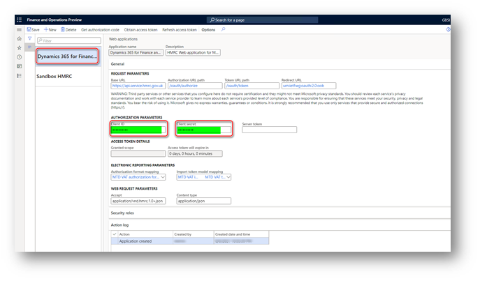

---
# required metadata

title: Authorize your Finance environment to interoperate with HMRC's MTD web-service
description: This topic explains the process of authorization of your Finance environment to interoperate with HMRC's MTD web-service.
author: liza-golub
ms.date: 08/17/2021
ms.topic: article
ms.prod: 
ms.technology: 

# optional metadata

# ms.search.form: 
# ROBOTS: 
audience: Application User
# ms.devlang: 
ms.reviewer: kfend
# ms.tgt_pltfrm: 
# ms.custom: 
ms.search.region: United Kingdom
# ms.search.industry: 
ms.author: elgolu
ms.search.validFrom: 08/07/2021

---

# Authorize your Finance to interoperate with HMRC's MTD web-service

This topic explains how to authorize you Finance environment to interoperate with HMRC's MTD web-service.

Two parameters uniquely identify each web application on the HMRC side:

- **Client ID**: The unique identifier of the web application.
- **Client secret**: The secret passphrase that is used to authorize the web application.

These parameters are used when requests are sent to HMRC. They must be filled in before you start the authorization process for a web application.

For the production web application (**Dynamics 365 for Finance and Operations**), Microsoft delivers these parameters through the package of data entities, 
and they are stored in the system in an encrypted format. When you import the pre-defined setup of Electronic messages functionality for MTD for VAT, 
these parameters are also imported. No additional manual actions are required. After the parameters are imported, the production application is ready for authorization.

> [!IMPORTANT]
> When you are using the MTD VAT feature provided by Microsoft you don't need to request production credentials from HMRC. All the nessesary web application credentials are imported to your system during the MTD VAT feature setup.

- Go to **Tax** > **Setup** > **Electronic messages** > **Web applications**, and verify that the **Client ID** and **Client secret** field values are set for the **Dynamics 365 for Finance and Operations** web application.

  

Don't edit the record by changing or updating these values. Additionally, you don't have to create a web application of the production type on the HMRC side, because the **Dynamics 365 for Finance and Operations** web application is ready to interoperate in live with the production MTD service for VAT. Complete the steps in the next section to obtain an authorization code and an access token.

## Obtain an authorization code for the production environment

When your company is ready to interoperate in a production environment with MTD for VAT, you must create an HMRC online account, unless it already exists. This account is also known as a Government Gateway account. Next, link the online account to the Finance application by selecting **Dynamics 365 for Finance and Operations** as the MTD-compatible software. A user ID and password will be obtained and linked to the VAT registration number:

- **User ID**: The name that is used to access HMRC while an authorization code is being requested.
- **Password**: The password that is used to access HMRC while an authorization code is being requested.

After you obtain your user credentials, an application of the production type can be authorized.

### Obtain an authorization code

To get an authorization code from HMRC, complete the following steps.

1. Go to **Tax** > **Setup** > **Electronic messages** > **Web applications**, select **Dynamics 365 for Finance and Operations** web application. 
2. On the Action Pane, select **Get authorization code**. 
3. Select **Yes** to confirm that you want to initialize the authorization process.
4. Un the **Electronic reporting parameters** page, in the **Scope** field, enter **read:vat write:vat**.
5. Select **OK** to continue.

    

6. In the **System administrator consent** dialog, select the check box to confirm enabling interoperation with HMRC’s MTD API and using external web services. Your privacy is important to us. To learn more, read our [Privacy Notice](emea-gbr-mtd-vat-integration.md#privacy-notice).

7. Select **Agree** to continue, and in the HMRC portal, select **Continue** on the bottom of the page.
8. In to the HMRC portal for authorization, on the **Sign in** page, enter the (1) **User ID** and (2) **Password** values that you obtained from HMRC during your subsciption for MTD, and select (3) **Sign in**.

    

8. Select **Grant authority**. The **Authorisation granted** page shows the authorization code that HMRC granted to you for your Finance environment. 
10. Copy the authorization code.

    > [!IMPORTANT]
    > The authorization code is only valid for 10 minutes. You must obtain the access token during this time. If you don't obtain the access token within 10 minutes, and the authorization code expires, you can get a new authorization code.

### Obtain an access token

Complete the following steps to initialize the retrieval of an access token within ten minutes of an authorization code being granted by HMRC.

1. Go to **Tax** > **Setup** > **Electronic messages** > **Web applications**, and select ythe **Dynamics 365 for Finance and Operations** web application. 
2. On the **Web applications** page, on the Action Pane, select **Obtain access token** to request an access token from HMRC. 
3. Paste the authorization code that you copied from the HMRC portal earlier, and then select **OK**. The access token request is sent to HMRC, and the access token from the response that's received is automatically saved in Finance. You can't view the access token from the user interface (UI). However, the **Access token will expire in** field shows the validity period of the access token.

Each access token is valid for four hours after it's created by HMRC. You don't have to manually refresh an access token. During interoperation with HMRC, the process of refreshing the access token is done automatically by the system.

To manually refresh an access token, on the **Web applications** page, on the Action Pane, select **Refresh access token**. A refresh access token request is sent to HMRC, and a new access token from the response that is received is automatically saved in the system.

[!INCLUDE[footer-include](../../includes/footer-banner.md)]
