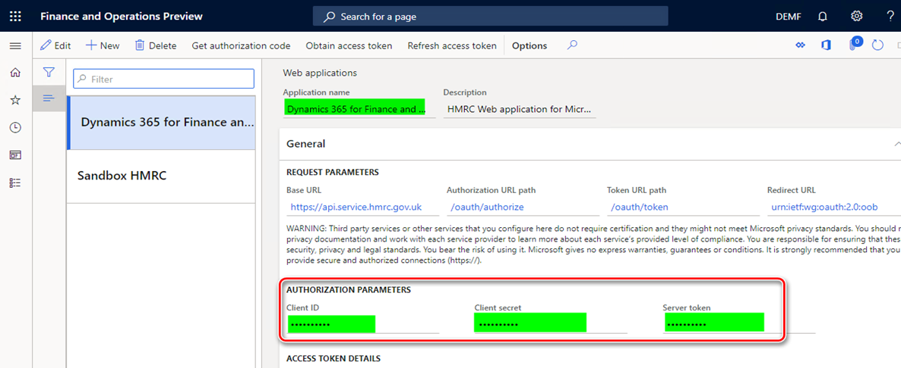

---
# required metadata

title: Authorize your Dynamics 365 Finance to interoperate with HMRC's MTD web-service
description: This topic explains the process of authorization of your Dynamics 365 Finance to interoperate with HMRC's MTD web-service.
author: liza-golub
ms.date: 08/07/2021
ms.topic: article
ms.prod: 
ms.technology: 

# optional metadata

# ms.search.form: 
# ROBOTS: 
audience: Application User
# ms.devlang: 
ms.reviewer: kfend
# ms.tgt_pltfrm: 
# ms.custom: 
ms.search.region: United Kingdom
# ms.search.industry: 
ms.author: elgolu
ms.search.validFrom: 08/07/2021

---

# Authorize your Dynamics 365 Finance to interoperate with HMRC's MTD web-service

This topic explains the process of authorization of your Dynamics 365 Finance to interoperate with HMRC's MTD web-service.

Two parameters uniquely identify each web application on the HMRC side:

- **Client ID** – The unique identifier of the web application.
- **Client secret** – The secret passphrase that is used to authorize the web application.

These parameters are used when requests are sent to HMRC. They must be filled in before you start the authorization process for a web application.

For the production web application (**Dynamics 365 for Finance and Operations**), Microsoft delivers these parameters through the package of data entities, 
and they are stored in the system in an encrypted format. When you import the predefined setup of Electronic messages functionality for MTD for VAT, 
these parameters are also imported. No additional manual actions are required. After the parameters are imported, the production application is ready for authorization.

> [!IMPORTANT]
> When you are using MTD VAT feature provided by Microsoft you **do not need to request production credentials** from HMRC. All the nessesary web application credentials are already imported to your system during MTD VAT feature setup.

- Go to **Tax** \> **Setup** \> **Electronic messages** \> **Web applications**, and verify that **Client ID** and **Client secret** values are set for the **Dynamics 365 for Finance and Operations** web application.

Don't edit the record by changing or updating these values. Additionally, you don't have to create a web application of the production type on the HMRC side, because the **Dynamics 365 for Finance and Operations** web application is completely ready to interoperate in live with the production MTD service for VAT. The next steps should be to obtain and authorization code and an access token.

For the sandbox web application (**Sandbox HMRC**), you can manually obtain **Client ID** and **Client secret** values from the **Manage credentials** section of your sandbox application in the HMRC portal. 

1. Copy the parameters, and then, in Finance, open the **Web applications** page. 
2. Go to **Tax** \> **Setup** \> **Electronic messages** \> **Web applications** and select the **Sandbox HMRC** web application.
3. On the **General** FastTab, in the **Authorization parameters** section, paste the parameters into the appropriate fields.

## Obtain an authorization code for the production environment

When a company is ready to interoperate in live with MTD for VAT, it must create an HMRC online account (Government Gateway account), unless an account already exists. Next, the company must link the online account to the Finance application by selecting **Microsoft Dynamics 365 Finance** as the software. It will then obtain user credentials (a user ID and password) that are linked to its VAT registration number:

- **User ID** – The name that is used to access HMRC while an authorization code is being requested.
- **Password** – The password that is used to access HMRC while an authorization code is being requested.

Before you can work with MTD for VAT, the VAT registration number of your legal entity must be defined in the registration ID. For more information, see [Registration IDs](emea-registration-ids.md).

1. Create a registration type that you will use for VAT registration numbers. For more information, see [Registration type](emea-registration-ids.md#registration-type-creation).
2. Associate the registration type created in step 1 with a registration category of **VAT ID**. For more information, see [Registration category](emea-registration-ids.md#supported-registration-categories).
3. Go to **Organization administration** \> **Global Address Book** \> **Legal entities**, and then, on the Action Pane, select **Registration ID**.
4. Define the VAT registration number as a registration ID that is associated with the registration category of **VAT ID** that you created in step 2.

    

After the company has obtained user credentials, an application of the production type can be authorized. An application of production type is uniquely identified by a client ID and a client secret, and is provided by Microsoft (unless the company is creating its own solution for any version of Finance). To authorize the application of the production type, complete the following tasks on the Finance side:

1. Obtain an authorization code.
2. Obtain an access token.

### Obtain an authorization code
To get an authorization code from HMRC, complete the following steps.

1. Go to **Tax** \> **Setup** \> **Electronic messages** \> **Web applications**, select the web application that you want to authorize (**Dynamics 365 for Finance and Operations**), and on the Action Pane, select **Get authorization code**. 
2. Select **OK** to confirm that you want to initialize the authorization process. 
3. On the **Electronic report parameters** page, set the **Scope** field. The following values are allowed by HMRC:

- read:vat
- write:vat
- read:vat write:vat

4. We recommend that you enter **read:vat write:vat** in this field, because the same application must be used for both GET and POST HTTPS requests to the web service. When you've finished, select **OK** to send the authorization request to HMRC. 

5. You're redirected to the HMRC portal for authorization. On the **Sign in** page, enter the **User ID** and **Password** values that your company obtained when it created an HMRC online account. 

6. The next page shows the authorization code. Copy it to the clipboard, and then get an access token. 

> [!IMPORTANT]
> The authorization code is valid for only 10 minutes. You must retrieve the access token during this time. If you don't retrieve the access token within 10 minutes, and the authorization code expires, you might have to get a new authorization code.

### Obtain an access token

You should initialize the retrieval of an access token within ten minutes of an authorization code being granted by HMRC.

1. Go to **Tax** \> **Setup** \> **Electronic messages** \> **Web applications**, and select the web application that you want to authorize (**Dynamics 365 for Finance**). 
2. On the **Web applications** page, on the Action Pane, select **Obtain access token** to request an access token from HMRC. 
3. Paste the authorization code that you copied from the HMRC portal earlier, and then select **OK**. The access token request is sent to HMRC, and the access token from the response that is received is automatically saved in Finance. You can't view the access token from the user interface (UI). However, the **Access token will expire in** field shows the validity period of the access token.

Every access token is valid for four hours after it's created by HMRC. You don't have to manually refresh an access token. During interoperation with HMRC, the process of refreshing the access token is done automatically by the system.

To manually get a new access token, you can refresh. To manually refresh an access token, on the **Web applications** page, on the Action Pane, select **Refresh access token**. A refresh access token request is sent to HMRC, and a new access token from the response that is received is automatically saved in the system.
