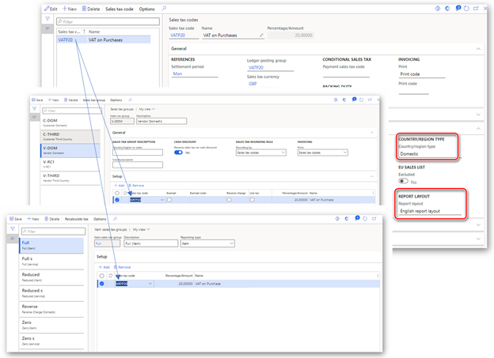
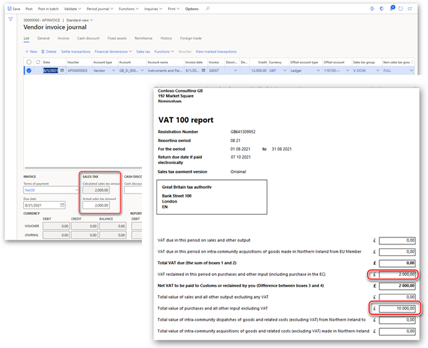
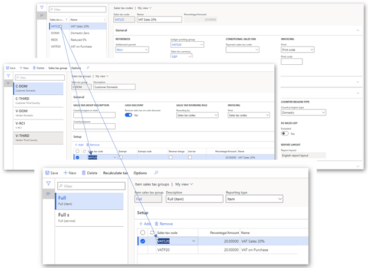
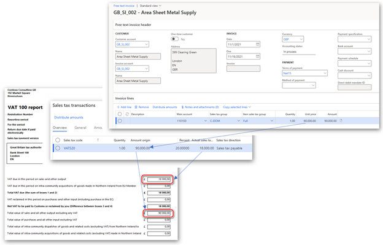
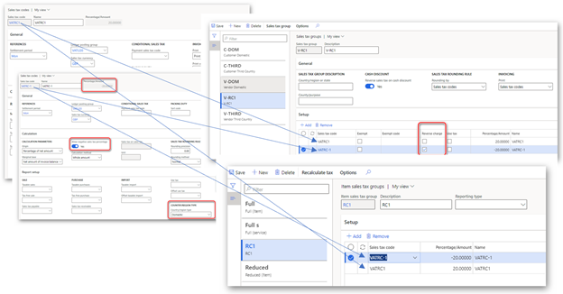
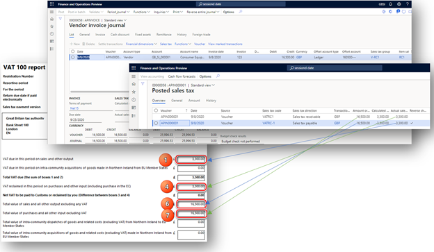

# VAT setup details for VAT declarations in the United Kingdom

[!include [banner](../includes/banner.md)]

This article provides details about the value-added tax (VAT) setup for VAT declarations in the United Kingdom (UK).

Information about the administration of VAT in the UK can be found on the official website for the tax authority of the UK, [Her Majesty's Revenue and Customs (HMRC)](https://www.gov.uk/topic/business-tax/vat).

After a company registers for VAT, the law of the UK requires that it charge VAT on sales of goods and services. The company is also entitled to reclaim VAT on purchases of goods and services.

There are currently three VAT rates:

- **Standard rate** – This rate applies to most goods and services.
- **Reduced rate** – This rate applies to some goods and services, such as children's car seats and home energy.
- **Zero rate percent (0%)** – This rate applies to zero-rate-percentage goods and services, such as most food and children's clothes.

The VAT rate that a business charges depends on its goods and services. Some goods and services, such as postage stamps, and financial and property transactions, are exempt from VAT. Other goods and services are outside the VAT tax system. Therefore, you can't charge or reclaim the VAT on them. Rates can change, and you must apply any changes to the rates from the date when they change. For current information about VAT rates in the UK, see [VAT rates](https://www.gov.uk/vat-rates).

Companies that are registered for VAT in the UK must periodically submit a VAT return to HMRC. A VAT return must be submitted even if there is no VAT to pay or reclaim.

The VAT return for the UK consists of the following boxes:

- **Box 1** – VAT that is due in the period on sales and other outputs.
- **Box 2** – VAT that is due in the period on acquisitions of goods in Northern Ireland from European Union (EU) member states.
- **Box 3** – The total VAT that is due.
- **Box 4** – VAT that is reclaimed in the period on purchases and other inputs, including acquisitions from the EU.
- **Box 5** – The net VAT to pay to HMRC or to reclaim.
- **Box 6** – The total value of sales and all other outputs, excluding any VAT.
- **Box 7** – The total value of purchases and all other inputs, excluding any VAT.
- **Box 8** – The total value of all supplies of goods and related costs, excluding any VAT, from Northern Ireland to EU member states (from January 1, 2021).
- **Box 9** – The total value of acquisitions of goods and related costs, excluding any VAT, in Northern Ireland from EU member states (from January 1, 2021).

In Microsoft Dynamics 365 Finance, you must complete the following setup to ensure that VAT returns are correctly calculated.

## Country/region type in Foreign trade parameters

1. Go to **Tax** > **Setup** > **Foreign trade** > **Foreign trade parameters**.
2. On the **Countries/regions properties** FastTab, set the country/region of the current legal entity to **Domestic**.
3. If your current legal entity is in Northern Ireland, set the country/region of EU countries/regions that participate in EU trade with the current legal entity to **EU**. For each country/region, identify the country/region code for foreign trade purposes.
4. Set the country/region of all other countries/regions that do business with the current legal entity to **Third country/region**.

## Company tax registration in customer invoices

If your company is in Northern Ireland and provides services to counterparties in the EU, or if you trade in goods from locations in Great Britain (England, Scotland, and Wales) and Northern Ireland, enable and use the **Company tax registration in customer invoices** feature.

1. Go to **Workspaces** > **Feature management**.
2. In the feature list, find and select, **Company tax registration in customer invoices**, and then select **Enable**.

For more information about feature management and available options, see [Feature management overview](../../fin-ops-core/fin-ops/get-started/feature-management/feature-management-overview.md).

The **Company tax registration in customer invoices** feature lets you select the company tax registration ID when you post sales invoices or packing slips from the following sources:

- Sales orders
- Free text invoices
- Projects

You can also issue invoices that use the tax registration number of the company, where **GB** (for England, Scotland, and Wales) or **XI** (for Northern Ireland) is added as a prefix.

To use the **Company tax registration in customer invoices** feature, set up the tax registration ID among the registration IDs of your legal entity. For more information about how to set up registration ID master data, see [Registration IDs](emea-registration-ids.md).

When the **Company tax registration in customer invoices** feature is enabled, the registration type, or the value in the **Primary for country** field, is associated with the VAT ID registration category. The registration type is used to define the tax registration number for the registration ID of the legal entity. This number is used as the default value in the **Tax registration number** field on sales orders during invoicing, packing slip posting, and project invoice proposal posting.

## Sales tax authorities

1. Go to **Tax** > **Indirect taxes** > **Sales tax** > **Sales tax authorities**.
2. Select **New** to create a record, and specify the parameters of the tax authority. For more information, see [Set up sales tax authorities](../general-ledger/tasks/set-up-sales-tax-authorities.md).
3. In the **Report layout** field, select **Default**.

## Sales tax settlement periods

1. Go to **Tax** > **Indirect taxes** > **Sales tax** > **Sales tax settlement periods**.
2. Select **New** to create a record, and specify the parameters of the sales tax settlement period. For more information, see [Set up sales tax settlement periods](../general-ledger/tasks/set-up-sales-tax-settlement-periods.md).
3. Make sure that the sales tax settlement periods that you create correlate with the VAT obligation periods that are specified for your company's account in HMRC.

## Ledger posting groups

1. Go to **Tax** > **Setup** > **Sales tax** > **Ledger posting groups**.
2. Select **New** to create a record, and specify the parameters of the ledger posting group to define the VAT posting rules in your legal entity. The posting type of general ledger accounts for VAT should be **Sales tax**. For more information, see [Set up Ledger posting groups for sales tax](../general-ledger/tasks/set-up-ledger-posting-groups-sales-tax.md).

## Sales tax groups

Create sales tax groups for the different types of business operations that are applicable to your company. These operation types can include, for example, **Accounts payable Domestic**, **Accounts payable Third country**, **Accounts receivable Domestic**, **Accounts receivable Third country**, **Reverse charge VAT**.

1. Go to **Tax** > **Indirect taxes** > **Sales tax** > **Sales tax groups**.
2. Select **New** to create a record, and specify the parameters of the sales tax group. For more information, see [Set up sales tax groups and item sales tax groups](../general-ledger/tasks/set-up-sales-tax-groups-item-sales-tax-groups.md).

## Item sales tax groups

1. Go to **Tax** > **Indirect taxes** > **Sales tax** > **Item sales tax groups**.
2. Select **New** to create a record, and specify the parameters of the item sales tax group. For more information, see [Set up sales tax groups and item sales tax groups](../general-ledger/tasks/set-up-sales-tax-groups-item-sales-tax-groups.md).
3. Specify the reporting type for the item sales tax group. For the reporting types that are applicable to the business operations of your company, more than three item sales tax groups are required. You can select among the following groups:

    - Full (Reporting type = Item)
    - Full (Reporting type = Service)
    - Reduced (Reporting type = Item)
    - Reduced (Reporting type = Service)
    - Zero (Reporting type = Item)
    - Zero (Reporting type = Service)
    - Reverse charge (Reporting type = Empty)

## Sales tax codes

1. Go to **Tax** > **Indirect taxes** > **Sales tax** > **Sales tax codes**.
2. Select **New** to create a record, and specify the parameters of the sales tax code.
3. In the **Sales tax currency** field, select **GBP**. For more information, see [Set up sales tax codes](../general-ledger/tasks/set-up-sales-tax-codes.md).
4. In the **Country/region** field, select the country/region type that the tax code will be used for. For sales tax codes used to post intra-community dispatches of goods from Northern Ireland to EU Member States, in **Country/Region type** field, select **EU**. For other operations, select **Domestic** or **Third** depending on whether the sales tax code will be used for posting domestic operations or operations with counterparties in other countries/regions.
5. For reverse charge VAT operations, create two sales tax codes, one that has a negative rate and one that has a positive rate. For more information, see [Reverse charge mechanism for VAT/GST scheme](emea-reverse-charge.md). As of January 1, 2021, a “reverse charge” approach can be used for acquisitions that companies in Great Britain make from counterparties in the EU, and that can be accounted for as import VAT on a VAT Return. This accounting is also known as *postponed VAT accounting*. 
6. Distribute the new sales tax codes into sales tax groups and item sales tax groups. Make sure that each sales tax code is added to an item sales tax group and a sales tax group, and that the required fields are set on the **Setup** FastTab of the **Sales tax groups** page. The required fields include:

    - **Exempt** and **Exempt code**: For VAT exempt operations.
    - **Reverse charge**: For sales tax codes that are set up for importing and reverse change operations with a negative rate.
    - **Use tax**: For intra-community acquisitions of goods made in Northern Ireland from EU Member States. As of January 1, 2021, tax setups that use the **use tax** approach will no longer be applicable to acquisitions that companies in Great Britain make from the EU.

    The combination of these groups must lead to one sales tax code. There is an exception for the setup of reverse charge VAT operations, which Finance uses for VAT posting. These two groups, together with **Reporting type** defind for **Item sales tax group** and the **Country/region type** of the **Sales tax code**, will lead to reporting in different [boxes of the VAT declaration](#boxes).
 
> [!NOTE]
> As of January 1, 2021, dispatch of goods and related costs to customers in the EU must be excluded from box 8 if the dispatches are from Great Britain. Therefore, the sales tax code with the **Country/Region type** value set up to **EU** can be used for intra-community dispatches of goods from Northern Ireland to EU Member States only.

## Set up reverse charge rules

1. Go to **Tax** > **Setup** > **Parameters** > **General ledger parameters**. 
2. On the **Reverse charge** tab, select the **Enable reverse charge** check box. 
3. In the **Purchase order sales tax group** field, select the sales tax group created and set up for importing/reverse change operations.

For more information, see [Reverse charge mechanism for VAT/GST scheme](emea-reverse-charge.md).
 
There are several scenarios, such as postponed VAT accounting and VAT reverse charge for building and construction services, where the deemed output VAT will be accounted for on the value of the invoice and added to box 1 of the VAT return. However nothing will be entered in box 6 for the transaction. To exclude the tax base amount from box 6, you must complete the following setup. This steps in this procedure use the example of postponed VAT accounting.

1. Go to **Tax** > **Setup** > **Sales tax** > **Reverse charge rules**, and select **New**.
2. In the **Partner country/region type** field, select **Third country/region**. The same partner country/region type must be specified in the master data for related vendors.
3. In the **Reverse charge item group** field select **All**.
4. In the **Threshold amount** field, enter **0.00**.
5. Select the **Empty tax base for outgoing tax** check box.

## Box calculation for the VAT declaration

The default setup of the VAT declaration that is proposed in the scope of the Making Tax Digital for VAT (MTD VAT) feature is explained in [Set up application-specific parameters for the VAT Declaration format](emea-gbr-mtd-vat-integration-setup.md#declaration). The following algorithm is used to calculate the VAT return amounts.

| Box number | Short description | Calculation description |
|------------|-------------------|-------------------------|
| Box 1      | VAT that is due in the period on sales and other outputs. | 
To calculate the amount in this box, combine the tax amounts of tax transactions that are posted during the reporting period and that have the following classification values:
<ul><li>Sales</li><li>SalesCreditNote</li><li>SalesReverseCharge</li><li>SalesReverseChargeCreditNote</li></ul> |
| Box 2      | VAT that is due in the period on intra-community acquisitions of goods in Northern Ireland from EU member states. | 
To calculate the amount in this box, combine the tax amounts of tax transactions that are posted during the reporting period, and that have a **Reporting type** value other than **Service**, a **Country/Region type** value of **EU**, and the following classification values:
<ul><li>UseTax</li><li>UseTaxCreditNote</li></ul> |
| Box 3      | The total VAT that is due. | Box 1 + box 2. |
| Box 4      | VAT that is reclaimed in the period on purchases and other inputs, including acquisitions from the EU. | 
To calculate the amount in this box, combine the tax amounts of tax transactions that are posted during the reporting period and that have the following classification values:
<ul><li>Purchase</li><li>PurchaseCreditNote</li><li>PurchaseReverseCharge</li><li>PurchaseReverseChargeCreditNote</li><li>PurchaseExempt</li><li>PurchaseExemptCreditNote</li><li>UseTax</li><li>UseTaxCreditNote</li></ul> |
| Box 5      | The net VAT to pay to HMRC or to reclaim. | The absolute value of box 3 – box 4. |
| Box 6      | The total value of sales and all other outputs, excluding any VAT. | 
To calculate the amount in this box, combine the tax base amounts of tax transactions that are posted during the reporting period and that have the following classification values:
<ul><li>Sales</li><li>SalesCreditNote</li><li>SalesReverseCharge</li><li>SalesReverseChargeCreditNote</li><li>SaleExempt</li><li>SalesExemptCreditNote</li></ul> |
| Box 7      | The total value of purchases and all other inputs, excluding any VAT. | 
To calculate the amount in this box, combine the tax base amounts of tax transactions that are posted during the reporting period and that have the following classification values:
<ul><li>Purchase</li><li>PurchaseCreditNote</li><li>PurchaseReverseCharge</li><li>PurchaseReverseChargeCreditNote</li><li>PurchaseExempt</li><li>PurchaseExemptCreditNote</li><li>UseTax</li><li>UseTaxCreditNote</li></ul> |
| Box 8      | The total value of intra-community dispatches of goods and related costs, excluding VAT, from Northern Ireland to EU member states. | 
To calculate the amount in this box, combine the tax base amounts of tax transactions that are posted during the reporting period, and that have a **Reporting type** other than **Service**, a **Country/Region type** value of **EU**, and the following classification values:
<ul><li>SaleExempt</li><li>SalesExemptCreditNote</li><li>Sales</li><li>SalesCreditNote</li><li>SalesReverseCharge</li><li>SalesReverseChargeCreditNote</li></ul> |
| Box 9      | The total value of intra-community acquisitions of goods and related costs, excluding VAT, in Northern Ireland from EU member states. | 
To calculate the amount in this box, combine the tax base amounts of tax transactions that are posted during the reporting period, and that have a **Reporting type** value other than **Service**, a **Country/Region type** value of **EU**, and the following classification values:
<ul><li>UseTax</li><li>UseTaxCreditNote</li><li>Purchase</li><li>PurchaseCreditNote</li><li>PurchaseReverseCharge</li><li>PurchaseReverseChargeCreditNote</li><li>PurchaseExempt</li><li>PurchaseExemptCreditNote</li></ul> |

## Examples of correct VAT setup

This section provides details about sales tax setup and reporting in the VAT 100 report for some commonly used scenarios in the United Kingdom (UK).

### Domestic purchase

1. Set up a sales tax code, a sales tax group, and an item sales tax group.

    

2. Post a vendor invoice and generate the VAT 100 report. 
3. Verify the amounts in box 4 and box 7.

    

### Domestic sale

1. Set up a sales tax code, a sales tax group, and an item sales tax group.

    

2. Post a free text invoice and generate the VAT 100 report. 
3. Verify the amounts in box 1 and box 6.

    

### Domestic reverse charge for services

1. Set up a sales tax code, a sales tax group, and an item sales tax group.

    

2. Post a vendor invoice and generate the VAT 100 report. 
3. Verify the amounts in box 1, 4, 6, and box 7.

    
